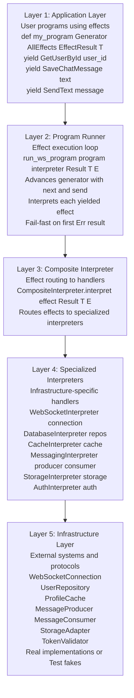
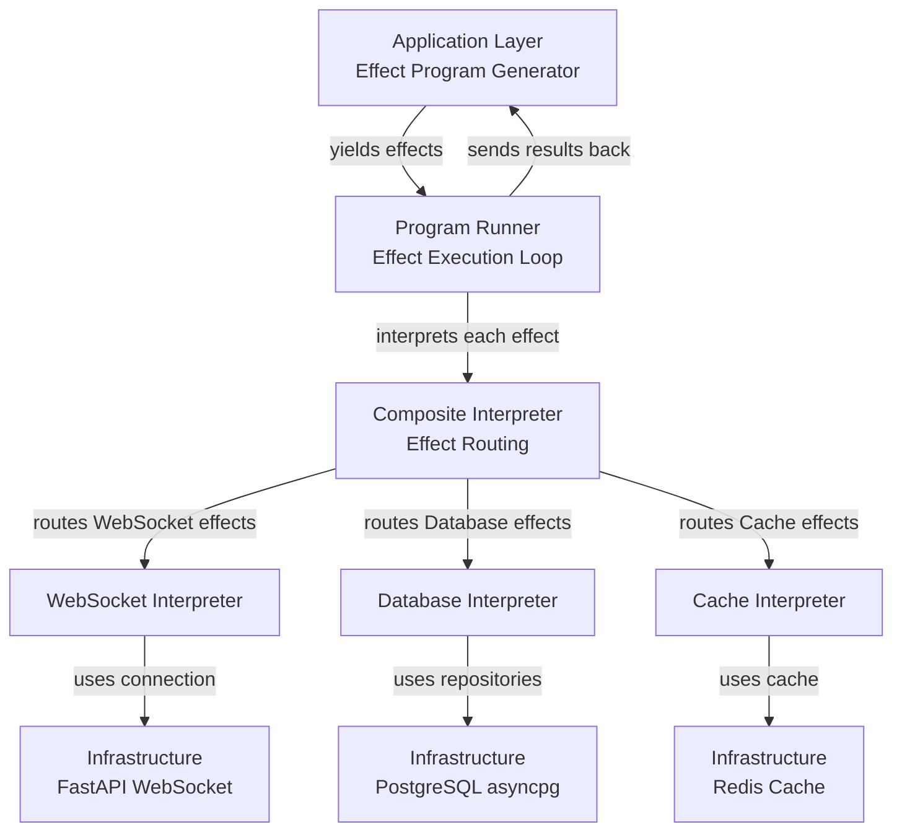
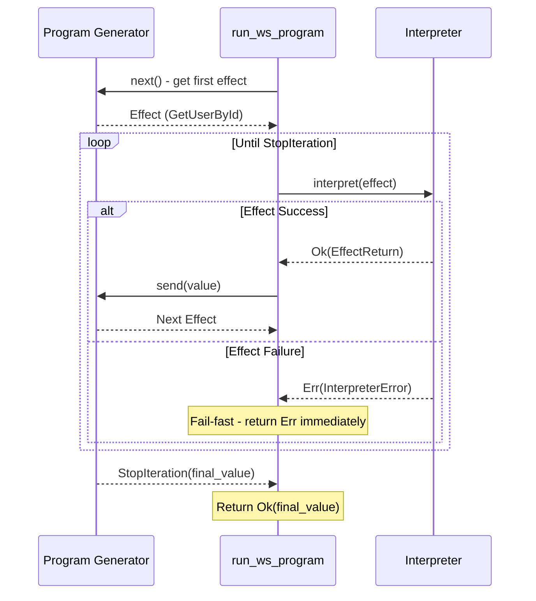
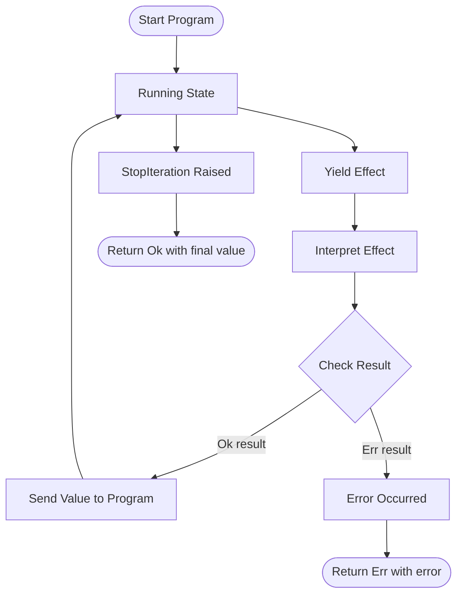
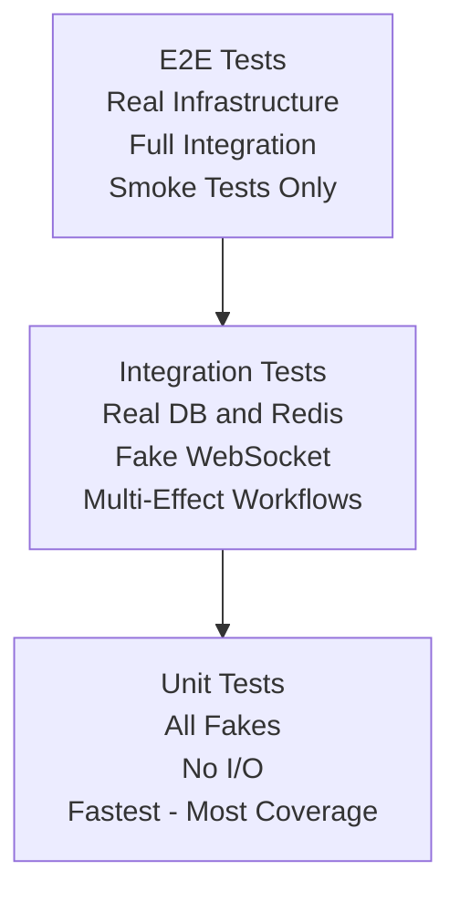

# Architecture

**functional_effects** - A pure functional effect system for Python with algebraic data types and explicit error handling.

## Design Philosophy

### Make Invalid States Unrepresentable

The core principle: If your program compiles with `mypy --strict`, it should be correct.

We achieve this through:
1. **Algebraic Data Types (ADTs)** - Model all possible states explicitly
2. **Result Type** - Make errors visible in type signatures
3. **Immutability** - Eliminate temporal coupling and race conditions
4. **Exhaustive Matching** - Type checker enforces handling all cases

## Architecture Layers

The system is organized in 5 layers with clear separation of concerns:



**Layer Responsibilities:**

1. **Application Layer**: Pure effect programs (business logic as generators)
2. **Program Runner**: Execution engine (generator protocol, fail-fast semantics)
3. **Composite Interpreter**: Effect routing (pattern matching to specialized handlers)
4. **Specialized Interpreters**: Infrastructure integration (WebSocket, Database, Cache, Messaging, Storage, Auth)
5. **Infrastructure Layer**: External systems (PostgreSQL, Redis, FastAPI, Apache Pulsar, AWS S3, JWT auth, or test fakes)

**Key Properties:**
- **Unidirectional flow**: Data flows down through layers, results flow back up
- **Separation of concerns**: Each layer has single responsibility
- **Testability**: Replace Layer 5 with fakes for unit tests
- **Type safety**: All boundaries have explicit Result types

### Visual Data Flow

The following diagram shows how data flows through the architecture layers:



**Key Points:**
- Programs yield effects (pure data) to the runner
- Runner calls interpreter for each effect
- Composite interpreter routes to specialized handlers
- Specialized interpreters interact with infrastructure
- Results flow back up through the same path (fail-fast on errors)

## Core Abstractions

### 1. Effects (Data Structures)

Effects are **pure data** - they describe what should happen, not how to do it.

```python
@dataclass(frozen=True)
class SendText:
    """Effect: Send text message over WebSocket."""
    text: str

@dataclass(frozen=True)
class GetUserById:
    """Effect: Look up user by ID."""
    user_id: UUID
```

**Why frozen dataclasses?**
- Immutable - can't be modified after creation
- Hashable - can be used in sets, dict keys
- Thread-safe - no race conditions
- Clear intent - "this is data, not behavior"

### 2. Result Type (Explicit Error Handling)

```python
@dataclass(frozen=True)
class Ok[T]:
    """Success case containing value."""
    value: T

@dataclass(frozen=True)
class Err[E]:
    """Failure case containing error."""
    error: E

type Result[T, E] = Ok[T] | Err[E]
```

**Why not exceptions?**
- Errors are **visible in type signatures**
- Cannot forget to handle errors (type checker enforces)
- Errors can be transformed, composed, logged
- No invisible control flow (no try/except archaeology)

**Example:**
```python
# Without Result - invisible error
async def get_user(user_id: UUID) -> User:
    # Raises what? ValueError? DatabaseError? Who knows!
    return await db.query(...)

# With Result - explicit error
async def get_user(user_id: UUID) -> Result[User, DatabaseError]:
    # Type signature documents all failure modes
    try:
        user = await db.query(...)
        return Ok(user)
    except Exception as e:
        return Err(DatabaseError(...))
```

### 3. Algebraic Data Types (Domain Modeling)

ADTs use type unions to represent "one of these cases" explicitly.

```python
# ❌ Bad - Optional hides the reason
async def get_user(user_id: UUID) -> User | None:
    ...  # Why None? Not found? Deleted? Access denied? Timeout?

# ✅ Good - ADT makes all cases explicit
@dataclass(frozen=True)
class UserFound:
    user: User
    source: str  # "database" | "cache"

@dataclass(frozen=True)
class UserNotFound:
    user_id: UUID
    reason: str  # "does_not_exist" | "deleted" | "access_denied"

type UserLookupResult = UserFound | UserNotFound

async def get_user(user_id: UUID) -> UserLookupResult:
    ...

# Usage forces handling all cases
match result:
    case UserFound(user=user, source=source):
        print(f"Found: {user.name} from {source}")
    case UserNotFound(user_id=uid, reason=reason):
        print(f"Not found: {uid} ({reason})")
```

**Benefits:**
- Impossible to forget cases (exhaustive matching)
- Self-documenting (all states explicit)
- Refactoring-friendly (add new case → type errors guide you)

### 4. Generator-Based Programs

Programs are generators that yield effects and receive results.

```python
from collections.abc import Generator

def greet_user(user_id: UUID) -> Generator[AllEffects, EffectResult, str]:
    # Yield effect, receive typed result
    user_result = yield GetUserById(user_id=user_id)

    match user_result:
        case None:
            yield SendText(text="User not found")
            return "error"
        case User(name=name):
            yield SendText(text=f"Hello {name}!")
            return "success"
```

**Why generators?**
- **Separation of concerns**: Program describes what (effects), interpreter decides how (execution)
- **Composability**: Use `yield from` to call sub-programs
- **Testability**: Swap real interpreter for fake
- **Type safety**: Return type preserved (`Generator[..., ..., str]` → runner returns `Result[str, E]`)

**Generator Protocol:**
```python
program = greet_user(user_id)
effect = next(program)              # Get first effect
result = await interpret(effect)    # Execute effect
next_effect = program.send(result)  # Send result, get next effect
# Repeat until StopIteration
```

**Effect Execution Flow:**

The following diagram shows how the runner executes a program using the generator protocol:



**Key Behavior:**
- Runner uses `next()` to get the first effect from the program
- For each effect, runner calls `interpreter.interpret(effect)`
- On success (`Ok`), runner sends the value back to the program using `send()`
- On failure (`Err`), runner immediately returns the error (fail-fast semantics)
- When program completes (`StopIteration`), runner returns `Ok(final_value)`

**Error Propagation State Machine:**

The following diagram shows the fail-fast error propagation semantics:



**Critical Properties:**
- **Fail-Fast**: First error immediately stops execution and returns `Err`
- **No Cleanup**: Program does not continue after error (no finally blocks)
- **No Retry**: Errors are returned as-is (retry logic in application layer)
- **Deterministic**: Same error at same point always produces same result

### 5. Interpreters (Effect Handlers)

Interpreters execute effects against real or fake infrastructure.

```python
class WebSocketInterpreter:
    def __init__(self, connection: WebSocketConnection):
        self._connection = connection

    async def interpret(self, effect: WebSocketEffect) -> Result[EffectReturn, WebSocketClosedError]:
        match effect:
            case SendText(text=text):
                if not await self._connection.is_open():
                    return Err(WebSocketClosedError(...))
                await self._connection.send_text(text)
                return Ok(EffectReturn(value=None, effect_name="SendText"))
            case Close(reason=reason):
                await self._connection.close()
                return Ok(EffectReturn(value=None, effect_name="Close"))
```

**Production interpreter**: Uses real WebSocket connection (FastAPI, asyncio)
**Test interpreter**: Uses `FakeWebSocketConnection` (in-memory list)

**Why this matters:**
- Same program works in tests and production
- No mocking framework needed
- Tests are deterministic (no network I/O)

## Design Decisions

### Why Generators Instead of Monads?

**Considered**: Free monads, IO monad, continuation monad

**Chose generators** because:
1. Native Python feature (no library needed)
2. Familiar syntax (looks like regular async code)
3. Type checker understands them
4. Excellent IDE support
5. No performance overhead (compared to monad transformers)

**Tradeoff**: Less compositional than monads, but easier to learn and use.

### Why Result Type Instead of Exceptions?

**Exceptions are invisible:**
```python
def divide(a: int, b: int) -> float:
    return a / b  # Raises ZeroDivisionError - not in signature!
```

**Result type makes errors visible:**
```python
def divide(a: int, b: int) -> Result[float, str]:
    if b == 0:
        return Err("Division by zero")
    return Ok(a / b)
```

**Benefits:**
- Type checker enforces error handling
- No try/except archaeology
- Errors can be transformed, logged, retried
- Fail-fast semantics (first error stops program)

**Tradeoff**: More verbose, but eliminates entire classes of bugs.

### Why Frozen Dataclasses Instead of NamedTuples?

**Frozen dataclasses**:
- Better IDE support (type hints, docstrings)
- Clearer syntax (`@dataclass(frozen=True)`)
- Can have methods
- More Pythonic

**NamedTuples**:
- More concise
- Slightly faster

**Decision**: Developer experience > minor performance gain.

### Why Composite Interpreter Instead of Monad Transformers?

**Composite pattern:**
```python
class CompositeInterpreter:
    def __init__(self, websocket: WebSocketInterpreter, database: DatabaseInterpreter, ...):
        self._websocket = websocket
        self._database = database

    async def interpret(self, effect: AllEffects) -> Result[EffectReturn, InterpreterError]:
        match effect:
            case SendText() | Close() | ReceiveText():
                return await self._websocket.interpret(effect)
            case GetUserById() | SaveChatMessage():
                return await self._database.interpret(effect)
```

**Benefits:**
- Simple delegation (no transformer stack)
- Easy to add new effect types
- Clear error handling (each interpreter returns Result)
- Type-safe (mypy validates effect routing)

**Tradeoff**: Less theoretical elegance than monad transformers, but easier to understand and debug.

### Why No Effect Type Classes?

**Considered**: Haskell-style type classes for effects

**Problem**: Python doesn't have type classes (protocols are not sufficient)

**Solution**: Use union types and pattern matching
```python
type WebSocketEffect = SendText | Close | ReceiveText
type DatabaseEffect = GetUserById | SaveChatMessage
type AllEffects = WebSocketEffect | DatabaseEffect | CacheEffect
```

**Benefits:**
- Works with Python's type system
- Exhaustive matching enforces handling all effects
- No runtime overhead

### Why ADTs Instead of Optional?

**Optional is a code smell:**
```python
async def get_user(user_id: UUID) -> User | None:
    ...  # Why None? Not found? Error? Deleted? Cache miss?
```

**ADT is self-documenting:**
```python
@dataclass(frozen=True)
class UserFound:
    user: User
    source: str  # Where did we find it?

@dataclass(frozen=True)
class UserNotFound:
    user_id: UUID
    reason: str  # Why couldn't we find it?

type UserLookupResult = UserFound | UserNotFound
```

**Benefits:**
- Forces caller to think about all cases
- Self-documenting (no comments needed)
- Refactoring-safe (add new case → type errors guide you)

## Testing Strategy

### Test Pyramid

The following diagram shows our testing strategy organized by test type:



**Test Distribution:**
- **Few** E2E tests (slowest, real infrastructure)
- **Some** Integration tests (moderate speed, partial real infrastructure)
- **Many** Unit tests (fastest, all fakes, most coverage)

**Unit tests** (fastest, most coverage):
- Use `FakeWebSocketConnection`, `FakeUserRepository`, etc.
- No network I/O
- Deterministic
- Test individual effects and error handling

**Integration tests**:
- Real database, real cache
- Test multi-effect workflows
- Verify infrastructure wiring

**E2E tests**:
- Real everything
- Test critical user journeys
- Minimal coverage (smoke tests)

### Fakes vs Mocks

**We use fakes, not mocks.**

**Fake** (real implementation):
```python
@dataclass
class FakeUserRepository:
    _users: dict[UUID, User] = field(default_factory=dict)

    async def get_by_id(self, user_id: UUID) -> UserLookupResult:
        user = self._users.get(user_id)
        if user is not None:
            return UserFound(user=user, source="database")
        return UserNotFound(user_id=user_id, reason="does_not_exist")
```

**Mock** (framework-based):
```python
mock_repo = Mock()
mock_repo.get_by_id.return_value = User(...)  # Brittle!
```

**Why fakes?**
- Real behavior (no magic)
- Type-safe (mypy validates)
- Reusable across tests
- No mocking framework needed
- Tests survive refactoring

### Error Testing

Always test error paths explicitly:

```python
@pytest.mark.asyncio
async def test_database_failure():
    # Use FailingUserRepository
    failing_repo = FailingUserRepository(error_message="Connection timeout")
    interpreter = create_test_interpreter(user_repo=failing_repo)

    result = await run_ws_program(program(), interpreter)

    # Assert error case
    assert_err(result, DatabaseError)
    error = unwrap_err(result)
    assert "Connection timeout" in error.db_error
```

**Why?** Error handling is half your code. Test it.

## Performance Considerations

### Immutability Cost

**Concern**: Creating new objects is expensive.

**Reality**: Python's garbage collector handles short-lived objects efficiently. Cost is negligible compared to I/O.

**Benchmark** (informal):
- Mutable update: ~50ns
- Frozen dataclass creation: ~150ns
- Database query: ~1-10ms (10,000-100,000x slower)

**Conclusion**: Correctness > micro-optimization. I/O dominates.

### Generator Overhead

**Concern**: Generator protocol adds call overhead.

**Reality**: Overhead is constant (~100ns per effect), I/O dominates.

**Example**:
- Program with 10 effects: ~1μs overhead
- Same program with real DB/WebSocket: ~10-100ms

**Conclusion**: Generator overhead is in the noise.

### Result Type Overhead

**Concern**: Pattern matching on Result adds overhead.

**Reality**: Branching is fast (~1ns), I/O dominates.

**Alternative**: Exceptions have ~1μs overhead when raised.

**Conclusion**: Result type is faster for error cases.

## Migration Guide

### From Imperative to Functional

**Before** (imperative, exceptions):
```python
async def greet_user(websocket: WebSocket, db: AsyncSession, user_id: UUID):
    # Tightly coupled to infrastructure
    user = await db.execute(select(User).where(User.id == user_id))
    if not user:
        await websocket.send_text("User not found")
        return

    await websocket.send_text(f"Hello {user.name}!")
    await db.execute(insert(ChatMessage).values(...))
```

**After** (functional, effects):
```python
def greet_user(user_id: UUID) -> Generator[AllEffects, EffectResult, None]:
    # Pure program, testable without infrastructure
    user_result = yield GetUserById(user_id=user_id)

    match user_result:
        case None:
            yield SendText(text="User not found")
            return
        case User(name=name):
            yield SendText(text=f"Hello {name}!")
            message = yield SaveChatMessage(user_id=user_id, text=f"Hello {name}!")
            assert isinstance(message, ChatMessage)
```

**Benefits:**
- Testable without database/WebSocket
- Type-safe (all effects explicit)
- Composable (can call from other programs)
- Error handling enforced by type system

## Future Extensions

### Planned Features

1. **Parallel Effects**
   ```python
   results = yield Parallel([
       GetUserById(user_id=user1),
       GetUserById(user_id=user2),
   ])
   ```

2. **Effect Retries**
   ```python
   result = yield Retry(
       effect=GetUserById(user_id=user_id),
       max_attempts=3,
       backoff=exponential,
   )
   ```

3. **Effect Timeouts**
   ```python
   result = yield Timeout(
       effect=GetUserById(user_id=user_id),
       seconds=5.0,
   )
   ```

4. **Effect Logging**
   ```python
   # Automatic structured logging for all effects
   result = yield GetUserById(user_id=user_id)
   # Logs: {"effect": "GetUserById", "user_id": "...", "duration_ms": 42, "result": "ok"}
   ```

### Non-Goals

- **Not a web framework** - Works with FastAPI/Flask/etc., doesn't replace them
- **Not an ORM** - Use SQLAlchemy/asyncpg/etc. for database access
- **Not a task queue** - Use Celery/Dramatiq/etc. for background jobs
- **Not a reactive framework** - Use RxPY/aioreactive/etc. for streams

## References

- **Algebraic Effects**: Research papers on effect systems
- **Result Type**: Rust's `Result<T, E>`, Haskell's `Either`
- **ADTs**: Haskell's sum types, TypeScript's discriminated unions
- **Generators**: PEP 255, PEP 342 (coroutines)
- **Type Safety**: Mypy strict mode, PEP 695 (generic type syntax)

---

**Philosophy**: Correctness first, performance second. Make invalid states unrepresentable.
