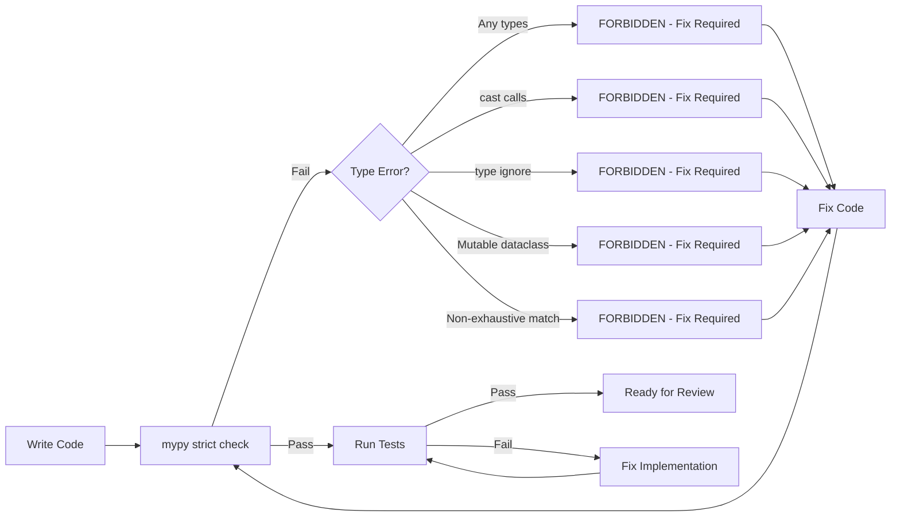
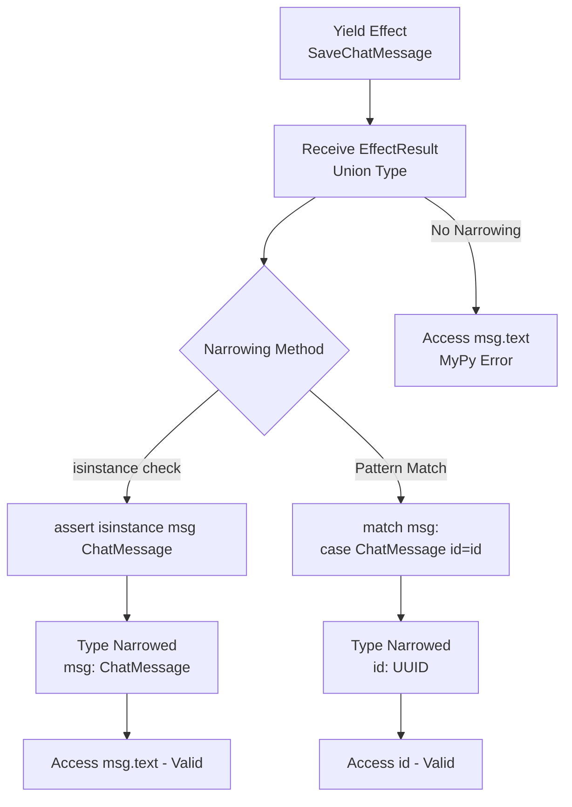

# Claude Code Patterns for Effectful

## Project Overview

**Effectful** is a pure functional effect system library for Python that brings algebraic data types, explicit error handling, and composable programs to async Python applications.

**Core Philosophy**: Make invalid states unrepresentable through the type system.

**Architecture**: Pure Python library (no web framework) with Docker-managed development environment for integration testing against real infrastructure (PostgreSQL, Redis, MinIO S3, Apache Pulsar).

## 🏗️ Architecture

**Stack**: Python 3.12+ | Poetry | asyncpg | Redis | WebSockets | Docker

**Library Structure**:
- `effectful/` - Main library package (renamed from functional_effects)
- `effectful/algebraic/` - Result[T, E], EffectReturn types
- `effectful/domain/` - Business domain models (User, Message, Profile, Token, etc.)
- `effectful/effects/` - Immutable effect definitions (WebSocket, Database, Cache, Messaging, Storage, Auth)
- `effectful/interpreters/` - Effect handlers (execution layer)
- `effectful/programs/` - Program execution runners
- `effectful/adapters/` - Real infrastructure implementations (PostgreSQL, Redis, S3, Pulsar)
- `effectful/infrastructure/` - Protocol definitions (interfaces)
- `effectful/testing/` - Testing matchers and utilities
- `tests/` - Comprehensive test suite (329+ tests)
- `examples/` - Working example programs
- `documents/` - Tutorials and API reference

**5-Layer Architecture**:
```
Layer 1: Application (User programs as generators)
    ↓
Layer 2: Program Runner (run_ws_program - effect execution loop)
    ↓
Layer 3: Composite Interpreter (Effect routing)
    ↓
Layer 4: Specialized Interpreters (WebSocket, Database, Cache, Messaging, Storage, Auth)
    ↓
Layer 5: Infrastructure Layer (PostgreSQL, Redis, S3, Pulsar, or test doubles)
```

## 📋 Command Reference

**All commands run inside Docker**: `docker compose -f docker/docker-compose.yml exec effectful poetry run <command>`

**Important**: Poetry is NOT set up as a virtual environment. Running `poetry install` outside the container should not create a `.venv` directory. All development happens inside Docker.

| Task | Command |
|------|---------|
| Start services | `docker compose -f docker/docker-compose.yml up -d` |
| View logs | `docker compose -f docker/docker-compose.yml logs -f effectful` |
| Check code quality | `docker compose -f docker/docker-compose.yml exec effectful poetry run check-code` |
| Test all | `docker compose -f docker/docker-compose.yml exec effectful poetry run test-all` |
| Test unit | `docker compose -f docker/docker-compose.yml exec effectful poetry run test-unit` |
| Test integration | `docker compose -f docker/docker-compose.yml exec effectful poetry run test-integration` |
| Python shell | `docker compose -f docker/docker-compose.yml exec effectful poetry run python` |
| Build package | `docker compose -f docker/docker-compose.yml exec effectful poetry build` |

**Entrypoints**:
- `check-code` - Black formatter + MyPy strict type checking
- `test-unit` - Unit tests only (pytest-mock, no I/O)
- `test-integration` - Integration tests (real PostgreSQL, Redis, MinIO, Pulsar)
- `test-all` - Complete test suite

**Test Isolation**: Each test is responsible for creating reproducible starting conditions (e.g., TRUNCATE + seed in fixtures).

**With output capture**: Add `> /tmp/test-output.txt 2>&1` to any test command (see Test Output Management).

## 📊 Test Statistics

| Category | Test Count | Duration | Infrastructure |
|----------|-----------|----------|----------------|
| Unit Tests | 200+ tests | ~0.5s | pytest-mock only |
| Integration | 27+ tests | ~1.1s | Real PostgreSQL/Redis/MinIO |
| Full suite | **329 tests** | **~1.6s** | Mixed |
| Coverage | 69% overall | - | Excludes adapters without infra |

**Test Organization**:
- `tests/test_algebraic/` - Result, EffectReturn type tests
- `tests/test_domain/` - Domain model tests
- `tests/test_effects/` - Effect definition tests
- `tests/test_interpreters/` - Individual interpreter tests (pytest-mock)
- `tests/test_programs/` - Program runner tests
- `tests/test_integration/` - Multi-effect workflows (real infrastructure)
- `tests/test_demo/` - Demo program tests

## ✅ Universal Success Criteria

All code changes must meet these requirements:
- ✅ Exit code 0 (all operations complete successfully)
- ✅ **Zero MyPy errors** (mypy --strict mandatory)
- ✅ Zero stderr output
- ✅ Zero console warnings/errors
- ✅ **Zero skipped tests** (pytest.skip() forbidden)
- ✅ 100% test pass rate
- ✅ **Zero `Any`, `cast()`, or `# type: ignore`** (escape hatches forbidden)
- ✅ Minimum 45% code coverage (adapters excluded)

Referenced by: Type Safety Doctrines, Testing Philosophy, Code Quality checks, Contributing Checklist.

## 🐳 Docker Development

### Container Services

**Main Services** (docker-compose.yml):
- `effectful` - Python 3.12 + Poetry container with two entrypoints:
  - **Main**: Library development and unit tests
  - **Mock Client**: Separate process for integration testing
- `postgres` - PostgreSQL 15+ (asyncpg repository testing)
- `redis` - Redis 7+ (cache and auth testing)
- `minio` - S3-compatible storage (storage effect testing)
- `pulsar` - Apache Pulsar (messaging effect testing)

### Data Persistence

**Named Volumes (Recommended)**:
- PostgreSQL: `pgdata:/var/lib/postgresql/data`
- Redis: `redisdata:/data`
- MinIO: `miniodata:/data`
- Pulsar: `pulsardata:/pulsar/data`
- ✅ Automatic correct file ownership (no permission issues)
- ✅ Cross-platform compatible (macOS, Linux, Windows)
- ✅ Remove with: `docker compose -f docker/docker-compose.yml down -v`

**Why Not Bind Mounts?**:
- ❌ Docker Desktop for Mac has permission conflicts with PostgreSQL
- ❌ Bind mounts cause "Permission denied" errors during TRUNCATE operations
- ❌ Random test failures in integration suite
- ✅ Named volumes solve all these issues

### Package Management
- Poetry manages all Python dependencies via `pyproject.toml`
- No manual pip/pipx usage - all dependencies declared in pyproject.toml
- Use: `poetry add <package>` for runtime deps, `poetry add --group dev <package>` for dev deps

## 🧪 Testing Philosophy

**Core Principle**: Tests exist to find problems, not provide false confidence.

**Test Pyramid Strategy**:
```
        /\
       /E2\      E2E/Demo (Few) - Real infrastructure, full workflows
      /----\
     / Intg \    Integration (Some) - Real DB/Redis/MinIO, mocked WebSocket
    /--------\
   /   Unit   \  Unit (Many) - pytest-mock only, no I/O, fast (<1s)
  /------------\
```

Success criteria: See Universal Success Criteria section above.

### Test Output Management

**CRITICAL - Output Truncation**: Bash tool truncates at 30,000 characters. Large test suites can exceed this.

**REQUIRED Pattern**:

```bash
# Step 1: Run tests with output redirection
docker compose -f docker/docker-compose.yml exec effectful poetry run pytest > /tmp/test-output.txt 2>&1

# Step 2: Read complete output using Read tool on /tmp/test-output.txt

# Step 3: Analyze ALL failures, not just visible ones
```

**Why This Matters**: Truncated output hides failures, making diagnosis impossible. File-based approach ensures complete output is always available. Read tool has no size limits.

**For all test categories**: Use pattern above with `pytest`, `test-integration`, or specific test paths.

**Forbidden Practices**:
- ❌ `Bash(command="...pytest...", timeout=60000)` - Kills tests mid-run, truncates output
- ❌ `Bash(command="...pytest...", run_in_background=True)` - Loses real-time failure visibility
- ❌ Reading partial output with `head -n 100` or similar truncation
- ❌ Checking test status before completion (polling BashOutput prematurely)
- ❌ Running tests via Bash tool and analyzing truncated stdout
- ❌ Drawing conclusions without seeing complete output
- ❌ Creating fix plans based on partial failure information

**Required Practices**:
- ✅ Always redirect to /tmp/, then read complete output
- ✅ Verify you have seen ALL test results before creating fix plans
- ✅ If output is truncated, STOP and re-run with file redirection
- ✅ Let tests complete naturally (integration tests may take 1-2 seconds - patience required!)
- ✅ Review ALL stdout/stderr output before drawing conclusions

### Testing Strategy: Mocks vs Integration

**Unit Tests** (200+ tests, <1s):
- Use `pytest-mock` with `mocker.AsyncMock(spec=Protocol)`
- **No real infrastructure** - pure logic testing
- Test interpreters, domain models, effects, algebraic types
- Type-safe mocking: `spec=` parameter ensures correct interface

**Integration Tests** (27+ tests, ~1s):
- **Real PostgreSQL, Redis, MinIO** via Docker sidecars
- Mocked WebSocket (no real client needed for most tests)
- Test multi-effect workflows end-to-end
- Validates actual database queries, cache operations, S3 storage

**Mock Client Service**:
- Separate entrypoint in same Docker container
- Used for integration tests that need WebSocket client behavior
- Simulates real client connections without browser automation

## 🔍 Code Quality: check-code Command

**Usage**: `docker compose -f docker/docker-compose.yml exec effectful poetry run check-code` (see Command Reference)

### Black + MyPy Workflow

Runs Black (formatter) → MyPy (strict type checker) with fail-fast behavior.

**Behavior**:
1. **Black**: Auto-formats Python code (line-length=100)
2. **MyPy**: Strict type checking with 30+ strict settings, disallow_any_explicit=true
3. **Fail-fast**: Exits on first failure

Must meet Universal Success Criteria (exit code 0, Black formatting applied, zero MyPy errors).

## 🛡️ Type Safety Doctrines

### Core Type Safety Workflow

The following diagram shows our zero-tolerance type safety enforcement:



**Enforcement:**
- `mypy --strict` with `disallow_any_explicit = true`
- Zero tolerance for escape hatches
- All errors must be fixed before tests run
- Type checking is a gate, not a suggestion

### 1. NO Escape Hatches

```python
# ❌ FORBIDDEN - These constructs are NEVER allowed
from typing import Any, cast

def process(data: Any) -> Any:  # NO!
    return cast(int, data)      # NO!

def transform(x):  # type: ignore  # NO!
    return x

# ✅ CORRECT - Explicit types always
from uuid import UUID
from effectful.algebraic.result import Result, Ok, Err
from effectful.domain.user import User

def process(user_id: UUID) -> Result[User, str]:
    if not isinstance(user_id, UUID):
        return Err("Invalid UUID")
    return Ok(User(id=user_id, email="test@example.com", name="Test"))
```

**Enforcement**: `mypy --strict` with `disallow_any_explicit = true` in pyproject.toml

### 2. ADTs Over Optional Types

```python
# ❌ WRONG - Optional hides the reason for None
from typing import Optional

async def get_user(user_id: UUID) -> Optional[User]:
    user = await db.query(...)
    return user  # Why is it None? Not found? Error? Timeout?

# ✅ CORRECT - ADT makes all cases explicit
from dataclasses import dataclass
from effectful.domain.user import User

@dataclass(frozen=True)
class UserFound:
    user: User
    source: str  # "database" | "cache"

@dataclass(frozen=True)
class UserNotFound:
    user_id: UUID
    reason: str  # "does_not_exist" | "deleted" | "access_denied"

type UserLookupResult = UserFound | UserNotFound

async def get_user(user_id: UUID) -> UserLookupResult:
    user = await db.query(...)
    if user is not None:
        return UserFound(user=user, source="database")
    return UserNotFound(user_id=user_id, reason="does_not_exist")

# Usage with exhaustive pattern matching
match result:
    case UserFound(user=user, source=source):
        print(f"Found {user.name} from {source}")
    case UserNotFound(user_id=uid, reason=reason):
        print(f"User {uid} not found: {reason}")
```

**Why**: ADTs force callers to handle all cases explicitly. The type system prevents forgetting edge cases.

### 3. Result Type for Error Handling

```python
# ❌ WRONG - Exceptions are invisible in type signatures
async def save_message(user_id: UUID, text: str) -> ChatMessage:
    # Raises ValueError? DatabaseError? Who knows!
    return await db.save(...)

# ✅ CORRECT - Errors are part of the type signature
from effectful.algebraic.result import Result, Ok, Err
from effectful.interpreters.errors import DatabaseError

async def save_message(
    user_id: UUID, text: str
) -> Result[ChatMessage, DatabaseError]:
    try:
        msg = await db.save(...)
        return Ok(msg)
    except Exception as e:
        return Err(DatabaseError(
            effect=SaveChatMessage(user_id=user_id, text=text),
            db_error=str(e),
            is_retryable=True
        ))

# Caller MUST handle errors
match result:
    case Ok(message):
        print(f"Saved: {message.id}")
    case Err(error):
        print(f"Failed: {error.db_error}")
        if error.is_retryable:
            await retry_logic()
```

**Why**: Errors become type-checked documentation. Impossible to forget error handling.

### 4. Immutability by Default

```python
# ❌ WRONG - Mutable state allows invalid mutations
from dataclasses import dataclass

@dataclass
class User:
    id: UUID
    email: str
    name: str

user = User(id=uuid4(), email="test@example.com", name="Alice")
user.email = None  # Oops! Type checker doesn't prevent this at runtime

# ✅ CORRECT - Frozen dataclasses prevent mutation
@dataclass(frozen=True)
class User:
    id: UUID
    email: str
    name: str

user = User(id=uuid4(), email="test@example.com", name="Alice")
# user.email = None  # Error: cannot assign to field 'email'

# To "update", create new instance
updated_user = User(id=user.id, email="new@example.com", name=user.name)
```

**Why**: Immutability eliminates entire classes of bugs (race conditions, unexpected mutations, temporal coupling).

### 5. Exhaustive Pattern Matching

```python
# ❌ WRONG - Non-exhaustive matching
from effectful.algebraic.result import Result, Ok, Err

def process(result: Result[int, str]) -> int:
    match result:
        case Ok(value):
            return value
    # Missing Err case - mypy error!

# ✅ CORRECT - Exhaustive matching
def process(result: Result[int, str]) -> int:
    match result:
        case Ok(value):
            return value
        case Err(error):
            print(f"Error: {error}")
            return 0
```

**Why**: Type checker enforces handling all cases. No forgotten branches.

### 6. Type Narrowing for Union Types

```python
# ❌ WRONG - Accessing union type attributes without narrowing
from effectful.effects.database import SaveChatMessage

def program() -> Generator[AllEffects, EffectResult, str]:
    message = yield SaveChatMessage(user_id=user_id, text="Hello")
    # Error: EffectResult is str | User | ChatMessage | None
    return f"Saved: {message.text}"  # mypy error!

# ✅ CORRECT - Type narrowing with isinstance
def program() -> Generator[AllEffects, EffectResult, str]:
    message = yield SaveChatMessage(user_id=user_id, text="Hello")
    assert isinstance(message, ChatMessage)  # Type narrowing
    return f"Saved: {message.text}"  # OK - mypy knows it's ChatMessage

# ✅ ALTERNATIVE - Pattern matching
def program() -> Generator[AllEffects, EffectResult, str]:
    message = yield SaveChatMessage(user_id=user_id, text="Hello")
    match message:
        case ChatMessage(id=msg_id, text=text):
            return f"Saved: {text}"
        case _:
            return "Unexpected type"
```

**Why**: Union types require explicit narrowing. Type checker ensures runtime type safety.

**Type Narrowing Flow:**



**Required Practices:**
- Always narrow union types before accessing variant-specific attributes
- Use `isinstance` for single-variant narrowing
- Use pattern matching for multi-variant ADTs
- MyPy will error if you forget to narrow - this is intentional

### 7. Generic Type Parameters

```python
# ❌ WRONG - Bare generic types lose information
def process(items: list) -> dict:  # What kind of list? What dict structure?
    return {str(i): item for i, item in enumerate(items)}

# ✅ CORRECT - Fully parameterized generics
def process(items: list[str]) -> dict[str, str]:
    return {str(i): item for i, item in enumerate(items)}

# ✅ CORRECT - Generic functions with TypeVar
from typing import TypeVar

T = TypeVar("T")

def first_or_none(items: list[T]) -> T | None:
    return items[0] if items else None

# Type checker infers: first_or_none([1, 2, 3]) -> int | None
```

**Why**: Generic parameters preserve type information through transformations.

### 8. PEP 695 Type Aliases

```python
# ❌ WRONG - String-based type aliases (deprecated)
from typing import Generator

EffectResult = "str | User | ChatMessage | None"  # NO!

# ✅ CORRECT - PEP 695 type aliases (Python 3.12+)
from collections.abc import Generator

type EffectResult = str | User | ChatMessage | ProfileData | CacheLookupResult | None

type WSProgram = Generator[AllEffects, EffectResult, None]

# Usage
def my_program() -> WSProgram:
    yield SendText(text="Hello")
    return None
```

**Why**: Type aliases are first-class citizens with proper IDE support and type checking.

## 🚫 Test Anti-Patterns (1-21)

### 1. Tests Pass When Features Broken
- ❌ Expecting valid data to fail
- ✅ Test that valid inputs return expected outputs

### 2. Accepting "Not Implemented" Errors
- ❌ `assert result is None or isinstance(result, User)` - accepts missing implementation
- ✅ `assert isinstance(result, User)` with error message

### 3. Silent Effect Failures
- ❌ Accepting None from effects that should return values
- ✅ Only accept typed success values

### 4. Testing Actions Without Validating Results
- ❌ Yield effect, no verification of result
- ✅ Yield effect, verify result type and value

### 5. Contradicting Domain Guarantees
- ❌ Testing that required domain invariants don't hold
- ✅ Verify domain invariants are maintained

### 6. Using pytest.skip()
- ❌ **NEVER** use `pytest.skip()` or `@pytest.mark.skip`
- ✅ Let tests FAIL to expose gaps, or delete test

### 7. Hardcoded Success Tests
- ❌ `assert True` - always passes
- ✅ Validate actual behavior and return values

### 8. Overly Permissive Assertions
- ❌ Accepting any non-None value
- ✅ Only accept specific expected values

### 9. Lowered Standards
- ❌ `assert len(result) > 0` - accepts anything non-empty
- ✅ Validate specific expected values

### 10. Test Timeouts
- ❌ Using `timeout` command to limit execution
- ✅ Let tests complete naturally

### 11. Testing with Real Infrastructure in Unit Tests

```python
# ❌ WRONG - Unit tests depend on PostgreSQL, Redis, etc.
@pytest.mark.asyncio
async def test_user_lookup():
    async with asyncpg.connect(DATABASE_URL) as conn:  # Real DB!
        user = await UserRepository(conn).get_by_id(user_id)
        assert user is not None

# ✅ CORRECT - Use pytest-mock for unit tests
from effectful.testing import unwrap_ok

@pytest.mark.asyncio
async def test_user_lookup(mocker):
    # Setup
    mock_repo = mocker.AsyncMock(spec=UserRepository)
    mock_repo.get_by_id.return_value = User(
        id=user_id, email="test@example.com", name="Alice"
    )
    interpreter = create_test_interpreter(user_repo=mock_repo)

    # Test
    def program() -> Generator[AllEffects, EffectResult, bool]:
        user = yield GetUserById(user_id=user_id)
        assert isinstance(user, User)
        yield SendText(text=f"Hello {user.name}")
        return True

    result = await run_ws_program(program(), interpreter)
    value = unwrap_ok(result)
    assert value is True
```

**Why**: Unit tests must be fast, deterministic, and isolated. Real infrastructure belongs in integration tests only.

### 12. Not Testing Error Paths

```python
# ❌ WRONG - Only testing happy path
@pytest.mark.asyncio
async def test_user_lookup():
    result = await run_ws_program(program(), interpreter)
    value = unwrap_ok(result)  # Assumes Ok
    assert value == "success"

# ✅ CORRECT - Test error cases explicitly
from effectful.testing import assert_err, unwrap_err

@pytest.mark.asyncio
async def test_user_lookup_database_failure(mocker):
    # Setup failing infrastructure
    mock_repo = mocker.AsyncMock(spec=UserRepository)
    mock_repo.get_by_id.side_effect = DatabaseError(
        effect=GetUserById(user_id=user_id),
        db_error="Connection timeout",
        is_retryable=True
    )
    interpreter = create_test_interpreter(user_repo=mock_repo)

    # Test
    def program() -> Generator[AllEffects, EffectResult, bool]:
        user = yield GetUserById(user_id=user_id)
        return True

    result = await run_ws_program(program(), interpreter)

    # Assert error
    assert_err(result)
    error = unwrap_err(result)
    assert isinstance(error, DatabaseError)
    assert "Connection timeout" in error.db_error
```

**Why**: Error handling is half your code. Test it.

### 13. Incomplete Assertions

```python
# ❌ WRONG - Only checking result succeeded
result = await run_ws_program(program(), interpreter)
assert_ok(result)  # Did the program do the right thing?

# ✅ CORRECT - Verify side effects and state changes
result = await run_ws_program(program(), interpreter)
value = unwrap_ok(result)

# Check return value
assert value == "success"

# Check side effects (when using mocks)
mock_websocket.send_text.assert_called_once_with("Hello Alice")

# Check state changes (when using real infrastructure)
assert len(await message_repo.get_all()) == 1
assert (await message_repo.get_all())[0].text == "Hello Alice"
```

**Why**: Programs have effects beyond return values. Verify the entire behavior.

### 14. Relaxed Validation
- ❌ Default fallbacks for missing fields: `if not result: result = default`
- ✅ Strict validation requiring all fields: `assert isinstance(result, ExpectedType)`

### 15. Disabling Test Infrastructure
- ❌ Commenting out fixtures or test setup to make tests pass
- ✅ Fix root cause of test failures

### 16. Masking Root Causes with Workarounds
- ❌ Adding try/except to hide errors
- ✅ Fix root cause, use Result type for expected errors

### 17. Trial-and-Error Debugging
- ❌ Multiple conflicting "fixing tests" commits without diagnosis
- ✅ Systematic: baseline → root cause → plan → fix → validate

### 18. Adding Unvalidated Features During Test Fixing
- ❌ Adding new features while debugging test failures
- ✅ Fix tests first, add features after tests pass

**Recovery Checklist**:
1. Document baseline failures
2. Investigate recent commits
3. Identify root causes (not symptoms)
4. Create systematic plan
5. Fix avoiding anti-patterns
6. Verify no new anti-patterns
7. Run full test suite

**Red Flags**: Multiple "fixing tests" commits in rapid succession, validation becoming less strict, infrastructure disabled instead of debugged, "temporary workaround" comments.

### 19. Test-Specific Environment Variables in Production Code
- ❌ Checking `PYTEST_RUNNING`, `PYTEST_CURRENT_TEST` in library code
- ❌ `if os.getenv("PYTEST_RUNNING"): return mock_value` - library code aware of test runner
- ✅ Use dependency injection: pass test doubles via constructor/parameters
- ✅ Interpreter pattern allows swapping infrastructure without library code changes

Impact: Couples library logic to test infrastructure, creates nondeterministic behavior.

### 20. Holding Database Locks Across Test Execution
- ❌ Executing TRUNCATE inside a transaction that wraps test execution
- ❌ Yielding test fixtures while holding AccessExclusiveLock from TRUNCATE
- ✅ **TRUNCATE+seed before each test**: Commit immediately, lock released before test runs

Impact: Tests timeout waiting for locks to release.

### 21. Docker Bind Mount Permission Issues (PostgreSQL Data Files)
- ❌ Using bind mount `./pgdata:/var/lib/postgresql/data` on Docker Desktop for Mac
- ❌ Files created with root ownership instead of postgres ownership
- ❌ PostgreSQL cannot access its own data files during TRUNCATE
- ✅ **Named Docker volume**: `pgdata:/var/lib/postgresql/data` ensures correct ownership
- ✅ Docker manages volume permissions automatically

Impact: Tests fail non-deterministically with `Permission denied: could not open file`.

**Correct Solution (docker-compose.yml)**:
```yaml
# ✅ Named volume ensures correct ownership
postgres:
  image: postgres:15-alpine
  volumes:
    - pgdata:/var/lib/postgresql/data  # Docker manages permissions

volumes:
  pgdata:
    driver: local
```

Detection:
- Error message: `could not open file "base/16384/XXXXX": Permission denied`
- Random test failures (different test each run)
- Works individually, fails in full suite

Prevention:
- Always use named volumes for PostgreSQL data
- Never use bind mounts for database files on Docker Desktop
- Verify file ownership after docker compose -f docker/docker-compose.yml up

## 🚫 Implementation Anti-Patterns

### 1. Using `Any` Types
- ❌ Function parameters or return types with `Any`
- ✅ Explicit types always (see Type Safety Doctrines)

### 2. Mutable Domain Models
- ❌ Dataclasses without `frozen=True`
- ✅ All domain models immutable: `@dataclass(frozen=True)`

### 3. Optional for Domain Logic
- ❌ Returning `Optional[User]` from domain methods
- ✅ ADT types: `UserLookupResult = UserFound | UserNotFound`

### 4. Exceptions for Expected Errors
- ❌ Raising exceptions for expected failure cases
- ✅ Result type: `Result[Success, Error]`

### 5. Imperative Effect Execution
- ❌ Directly calling infrastructure in programs: `await db.query(...)`
- ✅ Yield effects: `user = yield GetUserById(user_id=user_id)`

**Reference**: See effectful/ARCHITECTURE.md for comprehensive functional architecture guide.

Impact: Breaks separation of concerns, makes testing difficult, couples business logic to infrastructure.

## Effect Program Patterns

### 1. Generator-Based DSL

```python
from collections.abc import Generator
from effectful import (
    AllEffects,
    EffectResult,
    GetUserById,
    SendText,
    SaveChatMessage,
)

def greet_user(user_id: UUID) -> Generator[AllEffects, EffectResult, bool]:
    """Effect program that looks up user and sends personalized greeting."""

    # Yield effect, receive result
    user = yield GetUserById(user_id=user_id)

    # Type narrowing
    if not isinstance(user, User):
        yield SendText(text="Error: User not found")
        return False

    # Use narrowed type
    greeting = f"Hello {user.name}!"
    yield SendText(text=greeting)

    # Type narrowing for next effect
    message = yield SaveChatMessage(user_id=user_id, text=greeting)
    assert isinstance(message, ChatMessage)

    yield SendText(text=f"Message saved with ID: {message.id}")
    return True
```

**Pattern**: `result = yield Effect(...)` - Yield effect, receive typed result.

### 2. Fail-Fast Error Propagation

```python
from effectful import run_ws_program

async def execute() -> None:
    result = await run_ws_program(greet_user(user_id), interpreter)

    # run_ws_program returns Err immediately on first effect failure
    match result:
        case Ok(success):
            print(f"Program completed: {success}")
        case Err(error):
            print(f"Program failed: {error}")
            # error is one of: DatabaseError | WebSocketClosedError | CacheError | etc.
```

**Pattern**: First effect that returns Err short-circuits the entire program.

### 3. Composing Programs

```python
def lookup_and_cache_profile(
    user_id: UUID
) -> Generator[AllEffects, EffectResult, ProfileData | None]:
    """Reusable program: lookup user, create profile, cache it."""
    user = yield GetUserById(user_id=user_id)

    if not isinstance(user, User):
        return None

    profile = ProfileData(id=str(user.id), name=user.name, email=user.email)
    yield PutCachedProfile(user_id=user.id, profile_data=profile, ttl_seconds=300)
    return profile

def greet_with_caching(user_id: UUID) -> Generator[AllEffects, EffectResult, str]:
    """Compose smaller programs into larger workflows."""

    # Check cache first
    cached = yield GetCachedProfile(user_id=user_id)
    if isinstance(cached, ProfileData):
        greeting = f"Hello {cached.name} (from cache)!"
    else:
        # Cache miss - lookup and cache
        profile = yield from lookup_and_cache_profile(user_id)
        if profile is None:
            return "User not found"
        greeting = f"Hello {profile.name}!"

    yield SendText(text=greeting)
    return greeting
```

**Pattern**: Use `yield from` to delegate to sub-programs.

## 🗄️ Database

**Schema**: Integration tests use real PostgreSQL with schema migrations
**Test Data**: Auto-seeded before each integration test (with TRUNCATE for isolation)
**Reset**: `docker compose -f docker/docker-compose.yml down -v && docker compose -f docker/docker-compose.yml up -d`

## 🔒 Git Workflow Policy

**Critical Rule**: Claude Code is NOT authorized to commit or push changes.

### Forbidden Git Operations
- ❌ **NEVER** run `git commit` (including `--amend`, `--no-verify`, etc.)
- ❌ **NEVER** run `git push` (including `--force`, `--force-with-lease`, etc.)
- ❌ **NEVER** run `git add` followed by commit operations
- ❌ **NEVER** create commits under any circumstances

### Required Workflow
- ✅ Make all code changes as requested
- ✅ Run tests and validation (see Command Reference)
- ✅ Leave ALL changes as **uncommitted** working directory changes
- ✅ User reviews changes using `git status` and `git diff`
- ✅ User manually commits and pushes when satisfied

**Rationale**: All changes must be human-reviewed before entering version control. This ensures code quality, prevents automated commit mistakes, and maintains clear authorship.

## 🔧 Development Workflow

1. `docker compose -f docker/docker-compose.yml up -d`
2. Make code changes
3. `poetry run check-code` (see Code Quality section)
4. `poetry run pytest` (see Command Reference)
5. Leave changes uncommitted (see Git Workflow Policy)

### Adding New Effects

1. Define immutable effect dataclass in `effectful/effects/`
   - Use `@dataclass(frozen=True)`
   - Include all parameters needed for execution
2. Add effect to `AllEffects` union type in `effectful/programs/program_types.py`
3. Update `EffectResult` union type if effect returns new type
4. Create specialized interpreter in `effectful/interpreters/`
   - Inherit from `BaseInterpreter`
   - Implement `handle()` method returning `Result[T, E]`
5. Register interpreter in `CompositeInterpreter`
6. Create real adapter in `effectful/adapters/` (if needed)
7. Write unit tests with pytest-mock (see Testing Antipatterns)
8. Write integration tests with real infrastructure
9. Update documentation in `documents/`

### Adding New Domain Models

1. Create ADT types in `effectful/domain/`
   - All dataclasses `frozen=True`
   - Use union types for variants: `type Result = Success | Failure`
2. Update `EffectResult` if model is returned from effects
3. Write exhaustive pattern matching examples
4. Add tests for domain model validation
5. Update API documentation

## 📊 Configuration

**Environment Variables**:
```bash
# PostgreSQL (integration tests)
POSTGRES_HOST=postgres
POSTGRES_PORT=5432
POSTGRES_DB=effectful_test
POSTGRES_USER=effectful
POSTGRES_PASSWORD=effectful_pass

# Redis (integration tests)
REDIS_HOST=redis
REDIS_PORT=6379

# MinIO S3 (integration tests)
MINIO_ENDPOINT=minio:9000
MINIO_ACCESS_KEY=minioadmin
MINIO_SECRET_KEY=minioadmin
MINIO_BUCKET=effectful-test

# Pulsar (integration tests)
PULSAR_URL=pulsar://pulsar:6650
```

## 🤝 Contributing Checklist

All items must meet Universal Success Criteria (see above).

- [ ] Code quality: `poetry run check-code` exits 0
- [ ] Tests for all features (unit + integration)
- [ ] No forbidden constructs (Any/cast/type:ignore)
- [ ] No anti-patterns (1-21)
- [ ] All dataclasses frozen (`frozen=True`)
- [ ] ADTs used instead of Optional for domain logic
- [ ] Result type used for all fallible operations
- [ ] Exhaustive pattern matching (all cases handled)
- [ ] Type narrowing for union types
- [ ] Generic type parameters specified
- [ ] Integration tests use real infrastructure
- [ ] Unit tests use pytest-mock only
- [ ] Changes left uncommitted (see Git Workflow Policy)

## 📚 References

### Type Safety
- **Result Type**: `effectful/algebraic/result.py`
- **ADT Examples**: `effectful/domain/user.py`, `effectful/domain/profile.py`
- **Type Aliases**: `effectful/programs/program_types.py`

### Testing
- **Testing Utilities**: `effectful/testing/__init__.py`
- **Testing Patterns**: `documents/testing/TESTING_PATTERNS.md`
- **Test Suite Audit**: `documents/testing/TEST_SUITE_AUDIT.md`

### Architecture
- **Architecture Guide**: `ARCHITECTURE.md`
- **Effect Programs**: `tests/test_integration/test_chat_workflow.py`
- **Contributing Guide**: `CONTRIBUTING.md`

### Examples
- **Hello World**: `examples/01_hello_world.py`
- **User Greeting**: `examples/02_user_greeting.py`
- **Caching Workflow**: `examples/03_caching_workflow.py`
- **Error Handling**: `examples/04_error_handling.py`
- **Messaging Workflow**: `examples/05_messaging_workflow.py`

---

**Status**: Library foundation complete | Docker infrastructure ready | 329 tests passing
**Philosophy**: If the type checker passes, the program is correct. Make the type system work for you, not against you.
**Architecture**: Pure functional effect system with 5-layer architecture (Application → Runner → Composite → Interpreters → Infrastructure)
