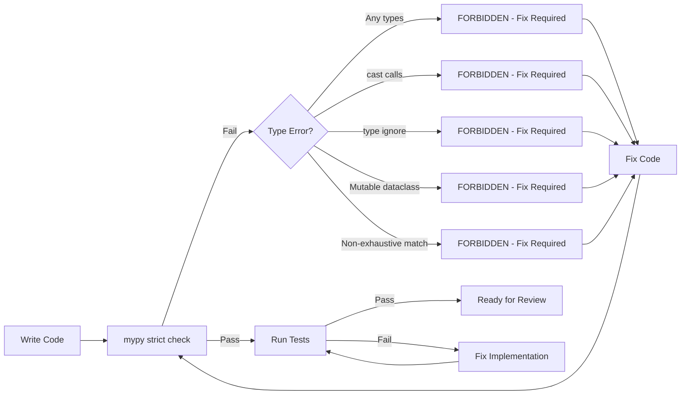
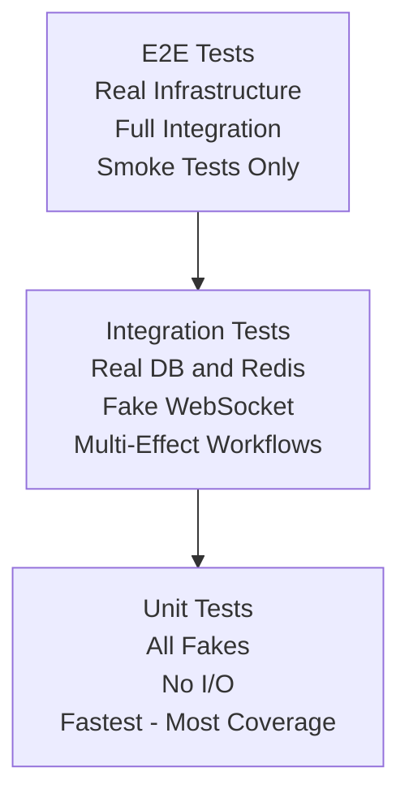

# Contributing to functional_effects

Thank you for considering contributing to **functional_effects**! This guide will help you understand our development workflow, code standards, and testing practices.

## Table of Contents

- [Development Setup](#development-setup)
- [Code Standards](#code-standards)
- [Testing Requirements](#testing-requirements)
- [Pull Request Process](#pull-request-process)
- [Architecture Guidelines](#architecture-guidelines)
- [Common Tasks](#common-tasks)

## Development Setup

### Prerequisites

- Python 3.12+
- Poetry (package manager)
- Git

### Initial Setup

```bash
# Clone repository
git clone https://github.com/your-org/functional_effects.git
cd functional_effects

# Install dependencies
poetry install

# Verify setup
poetry run pytest
poetry run mypy functional_effects
```

### Development Environment

```bash
# Activate virtual environment
poetry shell

# Run tests
pytest

# Type check
mypy functional_effects

# Format code
black functional_effects tests

# Lint
ruff check functional_effects tests
```

## Code Standards

### Type Safety - Zero Tolerance

**CRITICAL**: This project maintains `mypy --strict` with zero errors. All code must pass strict type checking.

#### Type Safety Workflow

The following diagram shows our type safety enforcement process:



**Key Points:**
- Type checking is mandatory before tests can run
- Zero tolerance for escape hatches (Any, cast, type: ignore)
- All type errors must be fixed, never suppressed
- MyPy acts as a gate, not a suggestion tool

#### Forbidden Constructs

```python
# ❌ NEVER use Any
from typing import Any

def process(data: Any) -> Any:  # FORBIDDEN
    return data

# ❌ NEVER use cast
from typing import cast

result = cast(User, some_value)  # FORBIDDEN

# ❌ NEVER use type: ignore
def broken_function():  # type: ignore  # FORBIDDEN
    ...
```

#### Required Patterns

```python
# ✅ Always use explicit types
from uuid import UUID
from functional_effects.algebraic.result import Result, Ok, Err

def process(user_id: UUID) -> Result[User, str]:
    if not isinstance(user_id, UUID):
        return Err("Invalid UUID")
    return Ok(User(id=user_id, email="test@example.com", name="Test"))

# ✅ Use generics with parameters
from collections.abc import Generator

def transform(items: list[str]) -> dict[str, int]:  # Not list or dict
    return {item: len(item) for item in items}

# ✅ Use frozen dataclasses
from dataclasses import dataclass

@dataclass(frozen=True)  # Always frozen
class User:
    id: UUID
    email: str
    name: str
```

### ADTs Over Optional

```python
# ❌ WRONG - Optional hides the reason
from typing import Optional

async def get_user(user_id: UUID) -> Optional[User]:
    ...

# ✅ CORRECT - ADT makes all cases explicit
from dataclasses import dataclass

@dataclass(frozen=True)
class UserFound:
    user: User
    source: str

@dataclass(frozen=True)
class UserNotFound:
    user_id: UUID
    reason: str

type UserLookupResult = UserFound | UserNotFound

async def get_user(user_id: UUID) -> UserLookupResult:
    ...
```

### Result Type for Errors

```python
# ❌ WRONG - Exceptions invisible in signature
async def save_data(data: str) -> bool:
    await db.save(data)  # Raises what exceptions?
    return True

# ✅ CORRECT - Errors explicit in signature
from functional_effects.algebraic.result import Result, Ok, Err

async def save_data(data: str) -> Result[bool, DatabaseError]:
    try:
        await db.save(data)
        return Ok(True)
    except Exception as e:
        return Err(DatabaseError(effect=..., db_error=str(e), is_retryable=True))
```

### Immutability

All dataclasses must be `frozen=True`:

```python
# ❌ WRONG
@dataclass
class User:
    name: str

# ✅ CORRECT
@dataclass(frozen=True)
class User:
    name: str
```

### Code Formatting

```bash
# Format code before committing
black functional_effects tests

# Check formatting
black --check functional_effects tests

# Lint
ruff check functional_effects tests
```

**Configuration**: See `pyproject.toml` for Black/Ruff settings.

## Testing Requirements

### Test Coverage: 100%

All code must have 100% test coverage. No exceptions.

```bash
# Run tests with coverage
pytest --cov=functional_effects --cov-report=term-missing

# Must show 100% coverage for all modules
```

### Test Strategy Pyramid

The following diagram shows our testing approach organized by type:



**Test Distribution:**
- **Many** Unit tests (all fakes, no I/O, fastest execution)
- **Some** Integration tests (real DB/Redis, fake WebSocket)
- **Few** E2E tests (real infrastructure, smoke tests only)

**Philosophy**: Push testing down to the unit level. Most bugs should be caught by fast unit tests with fakes, not slow integration tests with real infrastructure.

### Test Organization

```
tests/
├── test_algebraic/          # Result, EffectReturn
├── test_domain/             # User, ChatMessage, ProfileData
├── test_effects/            # Effect definitions
├── test_interpreters/       # WebSocket, Database, Cache interpreters
├── test_programs/           # run_ws_program
├── test_integration/        # Multi-effect workflows
└── test_testing/            # Testing utilities (fakes, fixtures, matchers)
```

### Testing Antipatterns - Forbidden

#### 1. Using pytest.skip()

```python
# ❌ FORBIDDEN
@pytest.mark.skip(reason="TODO: Implement later")
def test_feature():
    pass

# ✅ CORRECT - Either implement or delete
def test_feature():
    # Full implementation
    ...
```

**Rationale**: Skipped tests hide gaps in coverage and rot.

#### 2. Testing with Real Infrastructure

```python
# ❌ WRONG - Real database
@pytest.mark.asyncio
async def test_user_lookup():
    async with asyncpg.connect(DATABASE_URL) as conn:
        ...

# ✅ CORRECT - Use fakes
from functional_effects.testing import FakeUserRepository

@pytest.mark.asyncio
async def test_user_lookup():
    fake_repo = FakeUserRepository()
    fake_repo._users[user_id] = User(...)
    ...
```

**Rationale**: Tests must be fast, deterministic, isolated.

#### 3. Incomplete Assertions

```python
# ❌ WRONG - Only checking success
result = await run_ws_program(program(), interpreter)
assert_ok(result)

# ✅ CORRECT - Verify side effects and state
result = await run_ws_program(program(), interpreter)
value = unwrap_ok(result)

assert value == "expected"
assert len(fake_websocket._sent_messages) == 2
assert fake_websocket._sent_messages[0] == "Hello"
assert len(fake_message_repo._messages) == 1
```

**Rationale**: Programs have effects beyond return values.

#### 4. Not Testing Error Paths

```python
# ❌ WRONG - Only happy path
def test_user_lookup():
    result = await run_ws_program(program(), interpreter)
    assert_ok(result)

# ✅ CORRECT - Test error cases
from functional_effects.testing import FailingUserRepository

def test_user_lookup_database_failure():
    failing_repo = FailingUserRepository(error_message="Connection timeout")
    interpreter = create_test_interpreter(user_repo=failing_repo)

    result = await run_ws_program(program(), interpreter)

    assert_err(result, DatabaseError)
    error = unwrap_err(result)
    assert "Connection timeout" in error.db_error
```

**Rationale**: Error handling is half your code. Test it.

### Testing Utilities

Use the `functional_effects.testing` module:

```python
from functional_effects.testing import (
    # Fakes
    FakeWebSocketConnection,
    FakeUserRepository,
    FakeChatMessageRepository,
    FakeProfileCache,
    create_test_interpreter,

    # Failing variants
    FailingUserRepository,
    FailingChatMessageRepository,
    FailingProfileCache,

    # Matchers
    assert_ok,
    assert_err,
    unwrap_ok,
    unwrap_err,
    assert_ok_value,
    assert_err_message,
)

@pytest.mark.asyncio
async def test_my_program():
    # Setup
    interpreter = create_test_interpreter()

    # Test
    result = await run_ws_program(my_program(), interpreter)

    # Assert
    value = unwrap_ok(result)
    assert value == "expected"
```

## Pull Request Process

### Before Submitting

1. **Run full test suite**:
   ```bash
   pytest --cov=functional_effects --cov-report=term-missing
   ```
   Must show 100% coverage, zero failures.

2. **Type check**:
   ```bash
   mypy functional_effects
   ```
   Must show zero errors.

3. **Format code**:
   ```bash
   black functional_effects tests
   ruff check functional_effects tests
   ```

4. **Update documentation** if adding features:
   - Docstrings on all public functions
   - Examples in docstrings
   - Update README.md if needed

### PR Checklist

- [ ] All tests pass (100% coverage)
- [ ] Zero mypy errors (`mypy --strict`)
- [ ] Code formatted (Black + Ruff)
- [ ] No forbidden constructs (Any, cast, type: ignore)
- [ ] All dataclasses are frozen
- [ ] ADTs used instead of Optional
- [ ] Result type used for errors
- [ ] Error paths tested
- [ ] Docstrings on public APIs
- [ ] Examples in docstrings
- [ ] CHANGELOG.md updated

### PR Template

```markdown
## Description

Brief description of changes.

## Type of Change

- [ ] Bug fix
- [ ] New feature
- [ ] Breaking change
- [ ] Documentation update

## Testing

- [ ] All tests pass (100% coverage)
- [ ] Zero mypy errors
- [ ] Error paths tested

## Checklist

- [ ] Code formatted (Black + Ruff)
- [ ] No Any/cast/type: ignore
- [ ] All dataclasses frozen
- [ ] Docstrings added
- [ ] CHANGELOG.md updated
```

## Architecture Guidelines

### Adding New Effects

1. **Define effect** (frozen dataclass):
   ```python
   # functional_effects/effects/new_category.py
   from dataclasses import dataclass

   @dataclass(frozen=True)
   class NewEffect:
       """Description of what this effect does."""
       param: str
   ```

2. **Add to effect union**:
   ```python
   # functional_effects/programs/types.py
   type NewCategoryEffect = NewEffect | OtherNewEffect
   type AllEffects = WebSocketEffect | DatabaseEffect | CacheEffect | NewCategoryEffect
   ```

3. **Create interpreter**:
   ```python
   # functional_effects/interpreters/new_category.py
   from functional_effects.algebraic.result import Result, Ok, Err

   class NewCategoryInterpreter:
       async def interpret(self, effect: NewCategoryEffect) -> Result[EffectReturn, InterpreterError]:
           match effect:
               case NewEffect(param=param):
                   # Execute effect
                   return Ok(EffectReturn(value=result, effect_name="NewEffect"))
   ```

4. **Add to composite interpreter**:
   ```python
   # functional_effects/interpreters/composite.py
   async def interpret(self, effect: AllEffects) -> Result[EffectReturn, InterpreterError]:
       match effect:
           case NewEffect() | OtherNewEffect():
               return await self._new_category.interpret(effect)
   ```

5. **Create test fake**:
   ```python
   # functional_effects/testing/fakes.py
   @dataclass
   class FakeNewCategoryService:
       _state: dict[str, str] = field(default_factory=dict)

       async def execute(self, param: str) -> Result[str, str]:
           # Fake implementation
           ...
   ```

6. **Write tests**:
   ```python
   # tests/test_effects/test_new_category.py
   @pytest.mark.asyncio
   async def test_new_effect():
       interpreter = create_test_interpreter()
       # Test program using NewEffect
       ...
   ```

### Adding New Domain Models

1. **Define ADT variants**:
   ```python
   # functional_effects/domain/new_model.py
   from dataclasses import dataclass

   @dataclass(frozen=True)
   class NewModelFound:
       model: NewModel
       source: str

   @dataclass(frozen=True)
   class NewModelNotFound:
       model_id: UUID
       reason: str

   type NewModelLookupResult = NewModelFound | NewModelNotFound
   ```

2. **Export from root**:
   ```python
   # functional_effects/__init__.py
   from functional_effects.domain.new_model import (
       NewModel,
       NewModelFound,
       NewModelNotFound,
       NewModelLookupResult,
   )
   ```

3. **Write tests**:
   ```python
   # tests/test_domain/test_new_model.py
   def test_new_model_construction():
       model = NewModel(id=uuid4(), name="Test")
       assert model.name == "Test"
   ```

## Common Tasks

### Running Tests

```bash
# All tests
pytest

# Specific file
pytest tests/test_programs/test_runners.py

# Specific test
pytest tests/test_programs/test_runners.py::TestRunWSProgram::test_immediate_return

# With coverage
pytest --cov=functional_effects --cov-report=term-missing

# Verbose
pytest -v
```

### Type Checking

```bash
# Check entire project
mypy functional_effects

# Check specific file
mypy functional_effects/programs/runners.py

# Strict mode (required)
mypy --strict functional_effects
```

### Code Formatting

```bash
# Format all code
black functional_effects tests

# Check formatting (CI)
black --check functional_effects tests

# Lint
ruff check functional_effects tests

# Auto-fix lint issues
ruff check --fix functional_effects tests
```

### Building Documentation

```bash
# Generate API docs
cd docs
make html

# View docs
open _build/html/index.html
```

### Release Process

1. Update version in `pyproject.toml`
2. Update `CHANGELOG.md`
3. Run full test suite: `pytest --cov=functional_effects`
4. Type check: `mypy --strict functional_effects`
5. Format: `black functional_effects tests`
6. Commit: `git commit -m "Release v0.2.0"`
7. Tag: `git tag v0.2.0`
8. Push: `git push && git push --tags`
9. Build: `poetry build`
10. Publish: `poetry publish`

## Getting Help

- **Documentation**: See `docs/` directory
- **Examples**: See `examples/` directory
- **Architecture**: See `ARCHITECTURE.md`
- **Type Safety**: See `functional_effects/CLAUDE.md`
- **Issues**: GitHub Issues
- **Discussions**: GitHub Discussions

## Code of Conduct

### Standards

- Be respectful and inclusive
- Provide constructive feedback
- Focus on what is best for the project
- Show empathy towards others

### Unacceptable Behavior

- Harassment or discrimination
- Trolling or insulting comments
- Publishing others' private information
- Other conduct inappropriate in a professional setting

---

**Remember**: If `mypy --strict` passes with zero errors and pytest shows 100% coverage, your code is ready for review. Type safety is not optional.
