# effectful

[](https://www.python.org/downloads/)
[](http://mypy-lang.org/)
[](https://github.com/psf/black)
[](LICENSE)

A pure functional effect system for Python that brings algebraic data types, explicit error handling, and type-safe composable programs to async applications.

## Features

- ✅ **Type-Safe Effects** - All side effects explicit in type signatures
- ✅ **Result Type** - Explicit error handling (no hidden exceptions)
- ✅ **Algebraic Data Types** - Make invalid states unrepresentable
- ✅ **Generator-Based DSL** - Familiar async/await-like syntax
- ✅ **Testable by Design** - Swap real infrastructure for fakes
- ✅ **100% MyPy Strict** - Zero `Any`, `cast`, or `type: ignore`
- ✅ **Immutable by Default** - All dataclasses frozen
- ✅ **Exhaustive Matching** - Type checker enforces handling all cases

## Installation

```bash
pip install effectful
```

Or with Poetry:

```bash
poetry add effectful
```

## Quick Start

### Your First Program

```python
from collections.abc import Generator
from effectful import (
    AllEffects,
    EffectResult,
    SendText,
    GetUserById,
    User,
    run_ws_program,
)

def greet_user(user_id: UUID) -> Generator[AllEffects, EffectResult, str]:
    """Effect program: lookup user and send personalized greeting."""
    # Yield effect, receive result
    user_result = yield GetUserById(user_id=user_id)

    # Pattern match on result
    match user_result:
        case None:
            yield SendText(text="User not found")
            return "error"
        case User(name=name):
            yield SendText(text=f"Hello {name}!")
            return "success"
```

### Running Programs

```python
from effectful import create_composite_interpreter

# Production: use real infrastructure
interpreter = create_composite_interpreter(
    websocket_connection=real_websocket,
    user_repo=real_db_repo,
    message_repo=real_db_repo,
    cache=real_redis_cache,
)

result = await run_ws_program(greet_user(user_id), interpreter)

match result:
    case Ok(value):
        print(f"Success: {value}")
    case Err(error):
        print(f"Error: {error}")
```

### Testing Programs

```python
from effectful.testing import (
    create_test_interpreter,
    FakeUserRepository,
    unwrap_ok,
)

@pytest.mark.asyncio
async def test_greet_user():
    # Setup test data
    fake_repo = FakeUserRepository()
    fake_repo._users[user_id] = User(id=user_id, email="test@example.com", name="Alice")

    # Create test interpreter
    interpreter = create_test_interpreter(user_repo=fake_repo)

    # Run program
    result = await run_ws_program(greet_user(user_id), interpreter)

    # Assert
    value = unwrap_ok(result)
    assert value == "success"
```

## Core Concepts

### Effects as Data

Effects are **immutable dataclasses** describing what should happen:

```python
from dataclasses import dataclass

@dataclass(frozen=True)
class SendText:
    """Effect: Send text message over WebSocket."""
    text: str

@dataclass(frozen=True)
class GetUserById:
    """Effect: Look up user by ID."""
    user_id: UUID
```

### Programs as Generators

Programs are **generators** that yield effects and receive results:

```python
def my_program() -> Generator[AllEffects, EffectResult, str]:
    # Yield effect
    user_result = yield GetUserById(user_id=user_id)

    # Receive typed result
    match user_result:
        case User(name=name):
            yield SendText(text=f"Hello {name}!")
            return "success"
        case _:
            return "not_found"
```

### Interpreters Execute Effects

Interpreters handle effects and interact with infrastructure:

```python
# Production: real infrastructure
interpreter = create_composite_interpreter(
    websocket_connection=FastAPIWebSocket(...),
    user_repo=PostgresUserRepository(...),
    message_repo=PostgresMessageRepository(...),
    cache=RedisProfileCache(...),
)

# Testing: fake infrastructure
from effectful.testing import create_test_interpreter
test_interpreter = create_test_interpreter()
```

### Result Type for Errors

Explicit error handling instead of exceptions:

```python
from effectful.algebraic.result import Result, Ok, Err

# Errors visible in signature
def divide(a: int, b: int) -> Result[float, str]:
    if b == 0:
        return Err("Division by zero")
    return Ok(a / b)

# Caller must handle both cases
match divide(10, 2):
    case Ok(value):
        print(f"Result: {value}")
    case Err(error):
        print(f"Error: {error}")
```

### Algebraic Data Types

Model all possible states explicitly:

```python
@dataclass(frozen=True)
class UserFound:
    user: User
    source: str  # "database" | "cache"

@dataclass(frozen=True)
class UserNotFound:
    user_id: UUID
    reason: str  # "does_not_exist" | "deleted" | "access_denied"

type UserLookupResult = UserFound | UserNotFound

# Exhaustive pattern matching
match result:
    case UserFound(user=user, source=source):
        print(f"Found {user.name} from {source}")
    case UserNotFound(user_id=uid, reason=reason):
        print(f"Not found: {uid} ({reason})")
```

## Available Effects

The following diagram shows all available effect types organized by category:

```mermaid
flowchart TB
    AllEffects[AllEffects<br/>Union of All Effect Types]

    AllEffects --> WebSocket[WebSocket Effects]
    AllEffects --> Database[Database Effects]
    AllEffects --> Cache[Cache Effects]
    AllEffects --> Messaging[Messaging Effects]
    AllEffects --> Storage[Storage Effects]
    AllEffects --> Auth[Auth Effects]

    WebSocket --> SendText[SendText<br/>Send text message]
    WebSocket --> ReceiveText[ReceiveText<br/>Receive text message]
    WebSocket --> Close[Close<br/>Close connection]

    Database --> GetUser[GetUserById<br/>Lookup user by ID]
    Database --> SaveMsg[SaveChatMessage<br/>Save chat message]

    Cache --> GetCache[GetCachedProfile<br/>Get cached profile]
    Cache --> PutCache[PutCachedProfile<br/>Cache profile with TTL]

    Messaging --> PublishMessage[PublishMessage<br/>Publish to topic]
    Messaging --> ConsumeMessage[ConsumeMessage<br/>Consume from subscription]
    Messaging --> AckMessage[AcknowledgeMessage<br/>Ack successful processing]
    Messaging --> NackMessage[NegativeAcknowledge<br/>Reject for redelivery]

    Storage --> GetObject[GetObject<br/>Retrieve from S3]
    Storage --> PutObject[PutObject<br/>Store in S3]
    Storage --> DeleteObject[DeleteObject<br/>Remove from S3]
    Storage --> ListObjects[ListObjects<br/>List objects in bucket]
```



### WebSocket Effects
- `SendText(text: str)` - Send text message
- `ReceiveText()` - Receive text message
- `Close(reason: CloseReason)` - Close connection

### Database Effects
- `GetUserById(user_id: UUID)` - Lookup user
- `SaveChatMessage(user_id: UUID, text: str)` - Save message

### Cache Effects
- `GetCachedProfile(user_id: UUID)` - Get cached profile
- `PutCachedProfile(user_id: UUID, profile_data: ProfileData, ttl_seconds: int)` - Cache profile

### Messaging Effects
- `PublishMessage(topic: str, payload: bytes, key: str | None, properties: dict[str, str] | None)` - Publish message to Apache Pulsar topic
- `ConsumeMessage(subscription: str, timeout_ms: int)` - Consume message from Pulsar subscription
- `AcknowledgeMessage(message_id: str)` - Acknowledge successful message processing
- `NegativeAcknowledge(message_id: str, delay_seconds: int | None)` - Reject message for redelivery

See [Tutorial 08: Messaging Effects](documents/tutorials/08_messaging_effects.md) for comprehensive examples and patterns.

### Storage Effects
- `GetObject(bucket: str, key: str)` - Retrieve object from S3
- `PutObject(bucket: str, key: str, content: bytes, metadata: dict[str, str] | None, content_type: str | None)` - Store object in S3
- `DeleteObject(bucket: str, key: str)` - Remove object from S3
- `ListObjects(bucket: str, prefix: str | None, max_keys: int)` - List objects in S3 bucket

See [Tutorial 09: Storage Effects](documents/tutorials/09_storage_effects.md) for comprehensive examples and patterns.

## Testing Utilities

```python
from effectful.testing import (
    # Fakes (in-memory test doubles)
    FakeWebSocketConnection,
    FakeUserRepository,
    FakeChatMessageRepository,
    FakeProfileCache,
    create_test_interpreter,

    # Failing variants (for error testing)
    FailingUserRepository,
    FailingChatMessageRepository,
    FailingProfileCache,

    # Assertion helpers
    assert_ok,
    assert_err,
    unwrap_ok,
    unwrap_err,
    assert_ok_value,
    assert_err_message,
)
```

## Documentation

### Tutorials (Step-by-Step Guides)

**Getting Started**:
- **[01. Quickstart Guide](documents/tutorials/01_quickstart.md)** - Get running in 10 minutes
- **[02. Effect Types](documents/tutorials/02_effect_types.md)** - Learn all available effects
- **[03. ADTs and Result Types](documents/tutorials/03_adts_and_results.md)** - Master type safety

**Advanced Topics**:
- **[04. Testing Guide](documents/tutorials/04_testing_guide.md)** - Comprehensive testing strategies
- **[05. Production Deployment](documents/tutorials/05_production_deployment.md)** - Deploy with Docker, PostgreSQL, Redis
- **[06. Advanced Composition](documents/tutorials/06_advanced_composition.md)** - Build complex workflows
- **[07. Migration Guide](documents/tutorials/07_migration_guide.md)** - Migrate from imperative code

### API Reference

- **[API Documentation](documents/api/)** - Complete API reference
  - [Effects API](documents/api/effects.md) - All effect types
  - [Result Type API](documents/api/result.md) - Result[T, E] and error handling
  - [Interpreters API](documents/api/interpreters.md) - Executing programs
  - [Programs API](documents/api/programs.md) - Program types and composition
  - [Testing API](documents/api/testing.md) - Testing utilities and patterns

### Architecture and Contributing

- **[Architecture](ARCHITECTURE.md)** - Design rationale and patterns
- **[Contributing](CONTRIBUTING.md)** - Development workflow and standards
- **[Type Safety Guidelines](effectful/CLAUDE.md)** - Zero-tolerance type safety

## Examples

See [`examples/`](examples/) directory for complete working programs.

## Development

### Setup

```bash
# Clone repository
git clone https://github.com/your-org/effectful.git
cd effectful

# Install dependencies
poetry install

# Run tests
poetry run pytest

# Type check
poetry run mypy effectful

# Format code
poetry run black effectful tests
```

### Running Tests

```bash
# All tests
pytest

# With coverage
pytest --cov=effectful --cov-report=term-missing

# Specific file
pytest tests/test_programs/test_runners.py

# Type checking
mypy --strict effectful
```

### Code Quality

```bash
# Format
black effectful tests

# Lint
ruff check effectful tests

# Type check (must pass with zero errors)
mypy --strict effectful
```

## Project Structure

```
effectful/
├── algebraic/          # Result[T, E], EffectReturn[T]
├── domain/             # User, ChatMessage, ProfileData
├── effects/            # Effect definitions (SendText, GetUserById, etc.)
├── infrastructure/     # Repository/Cache protocols
├── interpreters/       # WebSocket, Database, Cache interpreters
├── programs/           # run_ws_program runner
└── testing/            # Fakes, fixtures, matchers

tests/
├── test_algebraic/     # Result, EffectReturn tests
├── test_domain/        # Domain model tests
├── test_effects/       # Effect definition tests
├── test_interpreters/  # Interpreter tests
├── test_programs/      # run_ws_program tests
├── test_integration/   # Multi-effect workflow tests
└── test_testing/       # Testing utilities tests

documents/
├── tutorials/          # Step-by-step guides (7 tutorials)
└── api/                # Complete API reference (5 references)
```

## Type Safety Guarantee

This library maintains **zero tolerance** for type safety violations:

- ❌ **NO** `Any` types
- ❌ **NO** `cast()` calls
- ❌ **NO** `# type: ignore` comments
- ✅ **100%** `mypy --strict` compliance

See [CLAUDE.md](effectful/CLAUDE.md) for complete type safety guidelines.

## Philosophy

> Make invalid states unrepresentable through the type system.

- **ADTs** over Optional types
- **Result** type over exceptions
- **Immutability** by default
- **Exhaustive matching** enforced by type checker
- **Explicit effects** instead of hidden side effects

## Contributing

We welcome contributions! Please see [CONTRIBUTING.md](CONTRIBUTING.md) for:

- Development setup
- Code standards (type safety, formatting, testing)
- Pull request process
- Architecture guidelines

## License

MIT License - see [LICENSE](LICENSE) for details.

## Support

- **Questions?** Open a [discussion](https://github.com/your-org/effectful/discussions)
- **Bug reports?** File an [issue](https://github.com/your-org/effectful/issues)
- **Contributing?** See [CONTRIBUTING.md](CONTRIBUTING.md)

---

**Made with ❤️ for type-safe functional programming in Python.**
