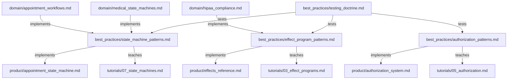

# HealthHub Engineering Best Practices

> Implementation patterns for building HealthHub using ADTs, effect programs, and pure functional programming.

---

## Purpose

The **best_practices/** tier contains **HealthHub-specific implementation patterns** for applying domain knowledge in code. These documents focus on **HOW to implement** features using HealthHub's tech stack and architecture.

**Key Principle**: If a pattern describes HealthHub's specific implementation choices (ADT-based authorization, effect programs, generator testing), it belongs in this tier.

---

## Document Organization

### Core Patterns

**[Authorization Patterns](authorization_patterns.md)** (244 lines)
- HOW to use HealthHub's ADT-based authorization system
- Pattern matching for access control (PatientAuthorized, DoctorAuthorized, AdminAuthorized, Unauthorized)
- Capability-based fields (can_prescribe)
- Testing authorization logic
- Anti-patterns: string-based roles, boolean authorization, exception-based auth

**Use this when**: Implementing authorization checks in HealthHub routes, programs, or business logic.

---

**[State Machine Patterns](state_machine_patterns.md)** (456 lines)
- HOW to implement ADT-based state machines in HealthHub
- Five core patterns:
  1. ADT Status Types (frozen dataclasses with state-specific fields)
  2. Transition Result ADT (TransitionSuccess | TransitionInvalid)
  3. Validate Before Transition (exhaustive pattern matching)
  4. Terminal State Detection (is_terminal function)
  5. Status-Specific Actions (get_available_actions by role)
- Five anti-patterns: string-based status, no validation, stateless status, mutable status, exception-based transitions
- Comprehensive testing patterns

**Use this when**: Implementing any workflow with states (appointments, prescriptions, lab results, invoices).

---

**[Effect Program Patterns](effect_program_patterns.md)** (318 lines)
- HOW to write pure effect programs as generators
- Six core patterns:
  1. Generator-Based Programs (yield effects, receive results)
  2. Type Narrowing After Effects (isinstance checks)
  3. Fire-and-Forget Notifications (don't block on notification failures)
  4. Program Composition (yield from for sub-programs)
  5. Early Return on Failure (guard clauses)
  6. Audit Logging Pattern (log all PHI access)
- Six anti-patterns: direct infrastructure calls, missing type narrowing, silent failures, blocking on notifications, imperative loops, skipping validation
- Generator testing patterns

**Use this when**: Writing new effect programs or refactoring existing business logic.

---

### Quality & Testing

**[Testing Doctrine](testing_doctrine.md)** (1,345 lines)
- Comprehensive testing philosophy and patterns for HealthHub
- Three test tiers: Backend Unit, Integration, E2E
- 22 test anti-patterns with examples
- Generator testing patterns (step through yield statements)
- Integration testing with real infrastructure (PostgreSQL, Redis, Pulsar)
- E2E testing for complete workflows
- Test output management (30,000 char truncation handling)
- Coverage requirements (backend: comprehensive, integration: conceptual)

**Use this when**: Writing tests for any HealthHub component (programs, interpreters, repositories).

---

## Relationship to Other Tiers

### Domain → Best Practices

The **domain/** tier provides **healthcare domain knowledge** that best_practices implements:

- [Appointment Workflows](../domain/appointment_workflows.md) → Implemented using state_machine_patterns.md
- [Medical State Machines](../domain/medical_state_machines.md) → General patterns implemented in state_machine_patterns.md
- [HIPAA Compliance](../domain/hipaa_compliance.md) → Audit logging implemented in effect_program_patterns.md

**Flow**: Healthcare requirements → HealthHub implementation patterns

---

### Best Practices → Product

The **product/** tier contains **HealthHub-specific implementations** that use these patterns:

- authorization_patterns.md → [Authorization System](../product/authorization_system.md)
- state_machine_patterns.md → [Appointment State Machine](../product/appointment_state_machine.md)
- effect_program_patterns.md → [Effects Reference](../product/effects_reference.md)
- testing_doctrine.md → All product testing

**Flow**: Implementation patterns → Actual HealthHub code

---

### Best Practices → Tutorials

The **tutorials/** tier provides **step-by-step guides** that teach these patterns:

- authorization_patterns.md → [Tutorial 05: Authorization](../tutorials/05_authorization.md)
- state_machine_patterns.md → [Tutorial 07: State Machines](../tutorials/07_state_machines.md)
- effect_program_patterns.md → [Tutorial 03: Effect Programs](../tutorials/03_effect_programs.md)

**Flow**: Patterns reference → Guided implementation

---

## Cross-Tier Navigation

**Starting Point**: If you're new to HealthHub development, start here:
1. Read [Effect Program Patterns](effect_program_patterns.md) to understand program structure
2. Read [State Machine Patterns](state_machine_patterns.md) to understand workflow implementation
3. Read [Authorization Patterns](authorization_patterns.md) to understand access control
4. Read [Testing Doctrine](testing_doctrine.md) to understand testing philosophy

**Reference Material**: If you're implementing a specific feature:
- **Authorization**: authorization_patterns.md → ../product/authorization_system.md
- **State Machine**: state_machine_patterns.md → ../product/appointment_state_machine.md
- **Effect Program**: effect_program_patterns.md → ../product/effects_reference.md
- **Testing**: testing_doctrine.md → tests/pytest/*

**Architectural Context**: For healthcare domain understanding:
1. Read [domain/medical_state_machines.md](../domain/medical_state_machines.md) for healthcare requirements
2. Then read state_machine_patterns.md for HealthHub implementation
3. Then check [product/appointment_state_machine.md](../product/appointment_state_machine.md) for actual code

---

## Document Dependencies

**Legend**:
- **implements**: Best practice implements domain knowledge OR product implements best practice
- **teaches**: Tutorial teaches best practice
- **tests**: Testing doctrine covers testing strategy

---

## Maintenance Guidelines

### When to Add New Documents

Add a new document to **best_practices/** if:
- ✅ The content describes HealthHub-specific implementation patterns
- ✅ It provides HOW-TO guidance for developers
- ✅ It's reusable across multiple HealthHub features

Do NOT add to **best_practices/** if:
- ❌ The content is general healthcare domain knowledge (use domain/)
- ❌ It describes a specific HealthHub feature implementation (use product/)
- ❌ It's a step-by-step tutorial (use tutorials/)

### When to Update Existing Documents

Update **best_practices/** documents when:
- New implementation patterns emerge from code reviews
- Anti-patterns are discovered in production
- HealthHub architecture evolves (new effect types, new interpreters)
- Testing strategies change (new test infrastructure, new patterns)

---

## Pattern Hierarchy

**Best Practices follow this hierarchy**:

1. **Domain Knowledge** (from domain/ tier)
   - Medical workflows, HIPAA requirements, healthcare constraints

2. **Implementation Patterns** (this tier)
   - ADT-based authorization, state machines, effect programs, testing

3. **Product Implementation** (product/ tier)
   - Actual HealthHub code using these patterns

4. **Tutorials** (tutorials/ tier)
   - Step-by-step guides for learning patterns

---

## Quick Reference

| What do you need? | Document to read |
|-------------------|------------------|
| Implement authorization | [Authorization Patterns](authorization_patterns.md) |
| Implement state machine | [State Machine Patterns](state_machine_patterns.md) |
| Write effect program | [Effect Program Patterns](effect_program_patterns.md) |
| Write tests | [Testing Doctrine](testing_doctrine.md) |
| Understand domain | [../domain/](../domain/) |
| See actual code | [../product/](../product/) |
| Learn step-by-step | [../tutorials/](../tutorials/) |

---

**Last Updated**: 2025-11-26
**Maintainer**: HealthHub Team
**Document Count**: 4 best practice documents
