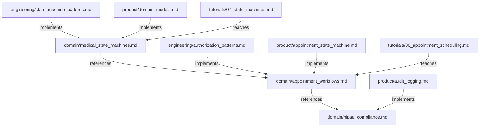

# Healthcare Domain Knowledge

> Extends base [Effectful Documentation](../../documents/README.md) and [Documentation Standards](../../documents/documentation_standards.md); base standards apply. This section captures HealthHub-specific domain deltas only.

---

## Purpose

The **domain/** tier contains healthcare domain knowledge that is **NOT specific to HealthHub**. These documents describe:

- Medical workflows and their requirements (appointment scheduling, prescriptions, lab results)
- Healthcare compliance regulations (HIPAA audit logging)
- State machine patterns for medical entities
- Business rules enforced by the healthcare industry

**Key Principle**: If a pattern or rule would apply to ANY healthcare management system (not just HealthHub), it belongs in this tier.

---

## Document Organization

### Medical Workflows

**[Appointment Workflows](appointment_workflows.md)** (279 lines)
- Complete appointment lifecycle (Requested → Confirmed → InProgress → Completed/Cancelled)
- Medical context for each state (patient safety, resource allocation, billing implications)
- Healthcare-specific validation rules (cannot skip states, terminal states immutable)
- Cancellation policies based on who cancelled and timing
- HIPAA audit requirements for appointment transitions

**Use this when**: Understanding the medical domain requirements for appointment scheduling in healthcare applications.

---

**[Medical State Machines](medical_state_machines.md)** (567 lines)
- General state machine patterns for healthcare workflows
- Four core medical workflows:
  * Appointments (Requested → Confirmed → InProgress → Completed)
  * Prescriptions (Pending → Active → Completed/Expired)
  * Lab Results (Ordered → InProgress → Completed → Reviewed)
  * Invoices (Draft → Sent → Paid/Overdue)
- Healthcare principles (terminal state immutability, state-specific context, role-based authority)
- ADT design patterns for medical entities
- Transition validation with medical domain rules
- Audit logging integration for HIPAA compliance

**Use this when**: Designing state machines for any medical workflow (prescriptions, lab results, billing), understanding general healthcare state machine principles.

---

### Compliance

**[HIPAA Compliance](hipaa_compliance.md)** (253 lines)
- HIPAA audit logging requirements for Protected Health Information (PHI)
- What constitutes PHI access (reads, updates, state transitions)
- Required audit fields (who, what, when, why, from where)
- Retention requirements (6 years minimum)
- Access control requirements (role-based authorization)
- Breach notification requirements

**Use this when**: Understanding HIPAA requirements for any healthcare application handling patient data.

---

## Relationship to Other Tiers

### Domain → Best Practices

The **engineering/** tier provides **HealthHub-specific implementation patterns** that apply these domain concepts:

- [State Machine Patterns](../engineering/state_machine_patterns.md) - How to implement medical state machines using ADTs
- [Authorization Patterns](../engineering/authorization_patterns.md) - How to use ADT-based authorization for medical roles
- [Effect Patterns](../engineering/effect_patterns.md) - How to compose medical workflows as effect programs

**Flow**: Domain knowledge → HealthHub implementation patterns

---

### Domain → Product

The **product/** tier contains **HealthHub-specific implementations** of domain concepts:

- [Appointment State Machine](../product/appointment_state_machine.md) - HealthHub's implementation of appointment workflows
- [Domain Models](../product/domain_models.md) - HealthHub's Appointment, Prescription, LabResult, Invoice entities
- [Authorization System](../product/authorization_system.md) - HealthHub's PatientAuthorized | DoctorAuthorized | AdminAuthorized ADT
- [Audit Logging](../product/audit_logging.md) - HealthHub's HIPAA audit logging implementation

**Flow**: Domain requirements → HealthHub implementation

---

### Domain → Tutorials

The **tutorials/** tier provides **step-by-step guides** that reference domain concepts:

- [Tutorial 06: Appointment Scheduling](../tutorials/06_appointment_scheduling.md) - Building appointment workflows
- [Tutorial 07: State Machines](../tutorials/07_state_machines.md) - Implementing medical state machines

**Flow**: Domain knowledge → Step-by-step implementation guide

---

## Cross-Tier Navigation

**Starting Point**: If you're new to healthcare application development, start here:
1. Read [Appointment Workflows](appointment_workflows.md) to understand the medical domain
2. Read [HIPAA Compliance](hipaa_compliance.md) to understand regulatory requirements
3. Then move to [engineering/](../engineering/) to learn HealthHub implementation patterns

**Reference Material**: If you're implementing a new medical workflow:
1. Check [Medical State Machines](medical_state_machines.md) for general patterns
2. Check [engineering/state_machine_patterns.md](../engineering/state_machine_patterns.md) for ADT implementation patterns
3. Check [product/](../product/) for examples from existing HealthHub workflows

**Compliance Questions**: If you need to verify HIPAA compliance:
1. Read [HIPAA Compliance](hipaa_compliance.md) for regulatory requirements
2. Check [product/audit_logging.md](../product/audit_logging.md) for HealthHub's implementation
3. Verify all PHI access triggers audit log entries

---

## Document Dependencies

**Legend**:
- **references**: Cross-references for additional context
- **implements**: Provides HealthHub-specific implementation of domain concept
- **teaches**: Step-by-step guide for implementing domain concept

---

## Maintenance Guidelines

### When to Add New Documents

Add a new document to **domain/** if:
- ✅ The content applies to ANY healthcare application (not just HealthHub)
- ✅ It describes medical domain requirements, workflows, or compliance rules
- ✅ Multiple healthcare applications would need this same knowledge

Do NOT add to **domain/** if:
- ❌ The content is specific to HealthHub's implementation choices
- ❌ It describes HealthHub's tech stack (FastAPI, PostgreSQL, Redis)
- ❌ It documents HealthHub's specific API endpoints or features

### When to Update Existing Documents

Update **domain/** documents when:
- Healthcare industry regulations change (new HIPAA requirements)
- Medical workflows evolve (new prescription approval steps)
- Healthcare best practices change (new patient safety guidelines)

---

## Quick Reference

| What do you need? | Document to read |
|-------------------|------------------|
| Understand appointment medical context | [Appointment Workflows](appointment_workflows.md) |
| Design a new medical workflow | [Medical State Machines](medical_state_machines.md) |
| Verify HIPAA compliance | [HIPAA Compliance](hipaa_compliance.md) |
| Implement appointment state machine | [../product/appointment_state_machine.md](../product/appointment_state_machine.md) |
| Learn ADT state machine patterns | [../engineering/state_machine_patterns.md](../engineering/state_machine_patterns.md) |

---

**Last Updated**: 2025-11-26
**Supersedes**: none
**Maintainer**: HealthHub Team
**Document Count**: 3 domain documents  
**Referenced by**: ../README.md, product/architecture_overview.md
