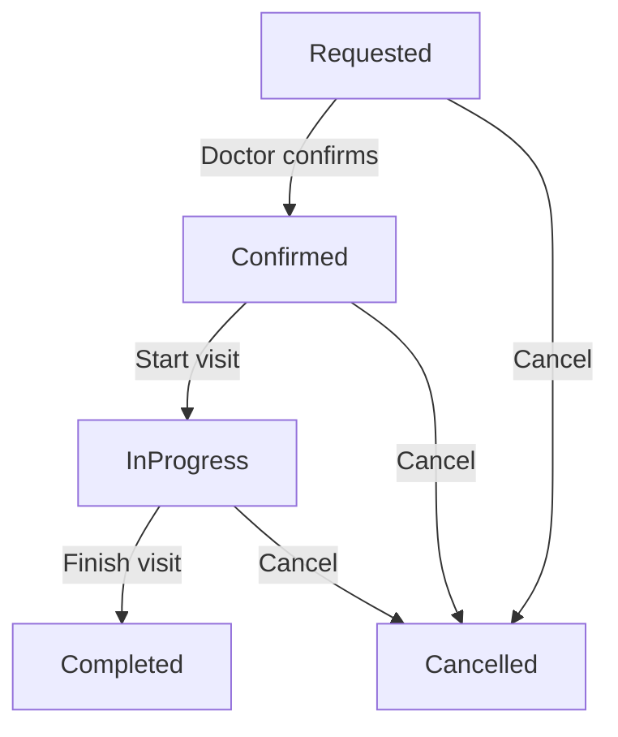

# Appointment Workflows

> Extends base [Documentation Standards](../../../../documents/documentation_standards.md); base rules apply. HealthHub-specific appointment workflow deltas only.

---

## Overview

Medical appointments follow a structured lifecycle from initial patient request through completion or cancellation. This domain knowledge applies to any healthcare application managing appointment scheduling.

**Why This Matters**: Proper appointment state management ensures:
- Patient safety (confirmed appointments with scheduled times)
- Resource allocation (doctor schedules, exam rooms)
- Billing accuracy (only completed appointments generate charges)
- Legal compliance (audit trails for cancellations and no-shows)

---

## Appointment Lifecycle

### 5-State Machine



---

## Appointment Status Types

### Status ADT

Medical appointments have 5 distinct states, each carrying state-specific contextual data:

```python
type AppointmentStatus = (
    Requested    # Initial patient request
    | Confirmed  # Doctor confirmed with scheduled time
    | InProgress # Visit currently happening
    | Completed  # Visit finished with notes
    | Cancelled  # Cancelled by patient/doctor/system
)
```

---

### Requested

**Medical Context**: Patient has requested an appointment but doctor has not yet confirmed availability.

```python
@dataclass(frozen=True)
class Requested:
    """Patient requested appointment, awaiting doctor confirmation."""
    requested_at: datetime
```

**Fields**:
- `requested_at`: When patient made the request (for SLA tracking, no-show prevention)

**Allowed Transitions**:
- → **Confirmed**: Doctor accepts and schedules
- → **Cancelled**: Patient cancels or doctor declines

**Medical Implications**:
- No guaranteed timeslot yet
- No billing occurs
- Doctor not obligated to accept

---

### Confirmed

**Medical Context**: Doctor has confirmed the appointment and committed a specific time slot.

```python
@dataclass(frozen=True)
class Confirmed:
    """Doctor confirmed appointment with scheduled time."""
    confirmed_at: datetime
    scheduled_time: datetime
```

**Fields**:
- `confirmed_at`: When doctor confirmed (for audit trail)
- `scheduled_time`: Exact appointment date/time (resource allocation)

**Allowed Transitions**:
- → **InProgress**: Patient arrives, visit begins
- → **Cancelled**: Cancellation (may incur fees depending on timing)

**Medical Implications**:
- Doctor time slot reserved
- Exam room/resources allocated
- Patient notification sent
- Cancellation policies may apply

---

### InProgress

**Medical Context**: Patient is currently with the doctor, visit is happening.

```python
@dataclass(frozen=True)
class InProgress:
    """Appointment currently happening."""
    started_at: datetime
```

**Fields**:
- `started_at`: Visit start time (for billing, duration tracking)

**Allowed Transitions**:
- → **Completed**: Normal visit conclusion
- → **Cancelled**: Early termination (patient leaves, emergency interruption)

**Medical Implications**:
- Billing clock started
- Medical records being created/updated
- Doctor unavailable for other patients

---

### Completed

**Medical Context**: Visit finished successfully with doctor's notes recorded.

```python
@dataclass(frozen=True)
class Completed:
    """Appointment finished with visit notes."""
    completed_at: datetime
    notes: str
```

**Fields**:
- `completed_at`: Visit end time (for billing calculation)
- `notes`: Doctor's visit summary (medical records, billing codes)

**Terminal State**: No further transitions (immutable medical record)

**Medical Implications**:
- Generates billable event
- Medical notes permanently recorded
- Follow-up appointments may be scheduled
- Patient can be discharged

---

### Cancelled

**Medical Context**: Appointment was cancelled before completion.

```python
@dataclass(frozen=True)
class Cancelled:
    """Appointment cancelled by patient, doctor, or system."""
    cancelled_at: datetime
    cancelled_by: Literal["patient", "doctor", "system"]
    reason: str
```

**Fields**:
- `cancelled_at`: Cancellation timestamp (for no-show tracking)
- `cancelled_by`: Who initiated cancellation (affects penalties/fees)
- `reason`: Cancellation explanation (medical records, analytics)

**Terminal State**: No further transitions (audit trail preserved)

**Medical Implications**:
- Doctor time slot released
- May incur cancellation fees (depending on timing and who cancelled)
- Affects no-show statistics
- May require rescheduling

**Cancellation Policies**:
- **Patient cancellation**: May incur fee if < 24 hours notice
- **Doctor cancellation**: No fee, patient priority for reschedule
- **System cancellation**: Emergency, doctor illness, etc.

---

## Valid Transition Matrix

| From/To | Requested | Confirmed | InProgress | Completed | Cancelled |
|---------|-----------|-----------|------------|-----------|-----------|
| **Requested** | - | ✅ | ❌ | ❌ | ✅ |
| **Confirmed** | ❌ | - | ✅ | ❌ | ✅ |
| **InProgress** | ❌ | ❌ | - | ✅ | ✅ |
| **Completed** | ❌ | ❌ | ❌ | - | ❌ |
| **Cancelled** | ❌ | ❌ | ❌ | ❌ | - |

---

## Healthcare Workflows

### Typical Happy Path

1. **Patient Request** (Requested)
   - Patient selects doctor and preferred times
   - System creates appointment in Requested state
   - Doctor receives notification

2. **Doctor Confirmation** (Requested → Confirmed)
   - Doctor reviews request
   - Confirms and assigns exact scheduled_time
   - Patient receives confirmation notification

3. **Patient Arrives** (Confirmed → InProgress)
   - Patient checks in at scheduled time
   - Doctor starts visit
   - Billing timer starts

4. **Visit Completion** (InProgress → Completed)
   - Doctor finishes examination
   - Records visit notes
   - Billing finalized

### Cancellation Scenarios

**Early Cancellation** (Requested → Cancelled):
- Patient cancels before doctor confirms
- No fees, no impact

**Late Cancellation** (Confirmed → Cancelled):
- Cancelled < 24 hours before scheduled_time
- May incur cancellation fee
- Doctor slot difficult to fill

**Mid-Visit Cancellation** (InProgress → Cancelled):
- Emergency interruption
- Patient leaves early
- Partial billing may apply

---

## Healthcare-Specific Validation Rules

### Transition Validation

**Medical Safety Rules**:
1. Cannot skip states (Requested → Completed invalid)
2. Terminal states immutable (Completed → Cancelled invalid)
3. Must have scheduled_time before InProgress
4. Must record notes before marking Completed

**Business Rules**:
1. Only doctors can transition Requested → Confirmed
2. Only doctors can transition InProgress → Completed
3. Both patient and doctor can transition to Cancelled (with different implications)

---

## Audit Requirements

Every appointment state transition must be logged for:
- **HIPAA Compliance**: Access to patient scheduling data
- **Billing Disputes**: Proof of visit completion
- **No-Show Tracking**: Pattern analysis for chronic cancellations
- **Medical Records**: Appointment history part of patient chart

**Required Audit Fields**:
- `user_id`: Who performed transition
- `timestamp`: When transition occurred
- `previous_status`: State before transition
- `new_status`: State after transition
- `reason`: Why transition happened (for cancellations)
- `purpose_of_use`: Treatment | payment | operations | break_glass
- `patient_id`: Patient the appointment belongs to
- `correlation_id`: Ties appointment transitions to related actions (notifications, billing)

---

## Privacy & Minimum Necessary

- Do not store detailed reason-for-visit in appointment titles; keep clinical details in charting systems
- Notifications (email/SMS/push) must mask sensitive fields (no diagnosis codes, minimal PHI)
- Calendar exports: provide masked summaries unless user explicitly opts into detailed entries
- Staff views: restrict by role and location; audit all accesses with purpose_of_use

---

## Telehealth-Specific Requirements

- Verify provider licensure for patient’s location before confirming (Requested → Confirmed gate)
- Obtain patient consent for recording; default to no recording; if recorded, tag and retain per policy
- Enforce secure platform use (TLS, authenticated links, no public meeting IDs); rotating meeting tokens per session
- Capture location at check-in for jurisdictional compliance; re-check if IP geo differs materially

---

## Pediatric & Guardian Scenarios

- Appointments may require guardian consent; capture guardian relationship and consent timestamp
- Age-based privacy: restrict visibility of sensitive visits based on jurisdictional minor privacy rules
- Transition authority: guardians can schedule/cancel when permitted; certain services may require provider confirmation

---

## Cancellation & No-Show Documentation

- Log who cancelled, when, and communication sent to patient; retain proof of notice for disputes
- Track notice timing (<24h) for fee policy; audit calculation inputs
- Record patient communications (email/SMS metadata) related to cancellations/reschedules
- For no-shows, record check-in absence, attempt to contact, and follow-up scheduling offer

---

## Related Documentation

### Domain Knowledge
- [Medical State Machines](medical_state_machines.md) - General state machine patterns for healthcare
- [HIPAA Compliance](hipaa_compliance.md) - Audit logging requirements

### HealthHub Implementation
- [Appointment State Machine](../product/appointment_state_machine.md) - HealthHub-specific implementation
- [Domain Models](../product/domain_models.md) - Appointment entity structure

---

**Last Updated**: 2025-12-01  
**Supersedes**: none  
**Referenced by**: ../README.md, ../product/appointment_state_machine.md
