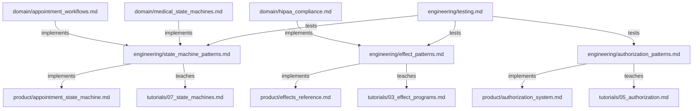

# HealthHub Engineering Best Practices

> Extends base [Engineering Standards](../../../../documents/engineering/README.md). Base rules apply; this doc indexes HealthHub-specific overlays only.

---

## Purpose

The **engineering/** tier contains **HealthHub-specific implementation patterns** for applying domain knowledge in code. These documents focus on **HOW to implement** features using HealthHub's tech stack and architecture.

**Key Principle**: If a pattern describes HealthHub's specific implementation choices (ADT-based authorization, effect programs, generator testing), it belongs in this tier.

---

## Document Organization

All overlays in this folder inherit the base engineering SSoTs by filename; each doc links to the base and only lists HealthHub-specific deltas.

### Core Patterns

**[Authorization Patterns](authorization_patterns.md)** (HealthHub implementation)
- ADT-based authorization system (PatientAuthorized, DoctorAuthorized, AdminAuthorized, Unauthorized)
- Capability-based fields (can_prescribe)
- Testing authorization logic
- Anti-patterns: string-based roles, boolean authorization, exception-based auth

**Use this when**: Implementing authorization checks in HealthHub routes, programs, or business logic.

---

**[State Machine Patterns](state_machine_patterns.md)** (HealthHub implementation)
- HOW to implement ADT-based state machines in HealthHub
- Five core patterns:
  1. ADT Status Types (frozen dataclasses with state-specific fields)
  2. Transition Result ADT (TransitionSuccess | TransitionInvalid)
  3. Validate Before Transition (exhaustive pattern matching)
  4. Terminal State Detection (is_terminal function)
  5. Status-Specific Actions (get_available_actions by role)
- Five anti-patterns: string-based status, no validation, stateless status, mutable status, exception-based transitions
- Comprehensive testing patterns

**Use this when**: Implementing any workflow with states (appointments, prescriptions, lab results, invoices).

---

**[Effect Patterns](effect_patterns.md)** (HealthHub deltas)
- Extends base [effect_patterns.md](../../../../documents/engineering/effect_patterns.md) — base rules apply; this doc lists only HealthHub-specific additions (PHI audit logging, fire-and-forget notifications, medical ADT narrowing, state-machine composition).

---

**[Purity Standards](purity_standards.md)** (HealthHub implementation; extends base purity doctrine)
- HIPAA-compliant code review standards for effect system purity
- Six purity standards mapped to §164.312 requirements:
  1. Effects as Data (§164.312(b) Audit Controls)
  2. Yield Don't Call (§164.312(a)(1) Access Control)
  3. Interpreters Isolate Impurity (All §164.312)
  4. Immutability by Default (§164.312(c)(1) Integrity)
  5. No Loops (§164.312(b) Deterministic workflows)
  6. Exhaustive Pattern Matching (§164.312 Medical safety)
- Automated violation detection (grep patterns)
- 12 anti-patterns with severity triage (CRITICAL/HIGH/MEDIUM)
- Layer-specific standards (routes, programs, interpreters, domain, infrastructure)
- Code review checklists (purity + HIPAA compliance)
- Current codebase violation scan (15+ critical violations)

**Use this when**: Conducting code reviews, evaluating purity compliance, identifying HIPAA violations, automated CI/CD checks.

---

### Quality & Testing

**[Testing](testing.md)** (HealthHub deltas)
- Extends base [testing.md](../../../../documents/engineering/testing.md) — doctrine lives in the base; this doc adds HealthHub layout, generator stepping, PHI-safe fixtures, and stack commands.
- HealthHub-only additions: test layout under `tests/pytest/backend` and `tests/pytest/e2e`, generator stepping for programs, PHI-safe fixtures, and real-stack integration guidance (PostgreSQL/Redis/Pulsar/MinIO).
- Use this when applying base testing doctrine to HealthHub’s stack and PHI requirements.

---

### Security & Compliance

**[Security Hardening](security_hardening.md)** (867 lines)
- Dual-token JWT authentication (access 15min, refresh 7 days)
- CSRF protection layers (Bearer token, SameSite cookies, CORS, WebSocket origin validation)
- ADT-based authorization security (pattern matching, capability fields)
- Rate limiting for PHI protection (login, PHI access, API endpoints)
- HIPAA Security Rule compliance (§164.312 mapping)
- Cookie security configuration (HttpOnly, Secure, SameSite)
- Anti-patterns: string-based roles, localStorage tokens, missing rate limiting

**Use this when**: Implementing authentication, authorization, or security controls for medical data.

---

### Observability & Operations

**[Monitoring & Alerting](monitoring_and_alerting.md)** (HealthHub deltas)
- Extends base [monitoring_and_alerting.md](../../../../documents/engineering/monitoring_and_alerting.md) and [observability.md](../../../../documents/engineering/observability.md) — base rules apply; this doc adds PHI-safe metrics catalog, healthcare SLO thresholds, Grafana dashboards, and clinical alert routing.

---

### Development Quality

**[Code Quality](code_quality.md)** (HealthHub deltas)
- Extends base [code_quality.md](../../../../documents/engineering/code_quality.md) — base doctrine applies; this doc adds HIPAA-focused lint bans and demo-specific command wrappers.

---

### Real-Time Communication

**[WebSocket Security](websocket_security.md)** (HealthHub implementation; extends base WebSocket guidance)
- Native WebSocket architecture with Redis Pub/Sub
- One-time ticket authentication (60s expiry, Redis GETDEL)
- Channel isolation for patient PHI (server-side authorization)
- Connection state machine (Idle → Connecting → Authenticating → Active → Reconnecting → Terminated)
- Medical event protocol (appointment_updated, lab_result_ready, prescription_created, billing_invoice_ready)
- Priority levels (normal, urgent, critical) with acknowledgments
- Security controls (CSP, origin validation, rate limiting, TLS requirement)
- Resilience patterns (heartbeat, exponential backoff, subscription recovery)

**Use this when**: Implementing real-time notifications, WebSocket connections, or critical medical alerts.

---

### Integration

**[FastAPI Integration Patterns](fastapi_integration_patterns.md)** (390 lines)
- Route handler → effect program conversion (HTTP → Program → HTTP)
- Request/response lifecycle (Pydantic validation, program execution, DTO conversion)
- Error handling (domain errors → HTTP status codes)
- Dependency injection for interpreters (get_interpreter factory pattern)
- Authorization dependencies (ADT-based access control with Depends())
- Role-based filtering (pattern matching for query construction)
- Common pitfalls (direct infrastructure calls, mixing exceptions, resource leaks)

**Use this when**: Creating new FastAPI routes, integrating with effectful programs, or bridging HTTP and effect systems.

---

**[Frontend Architecture](frontend_architecture.md)** (355 lines)
- FastAPI StaticFiles mount + catch-all route pattern (ShipNorth reference)
- Single-server architecture (backend + frontend on port 8851)
- Build process (Vite → build/ directory → Docker image)
- Three development workflows (backend only, frontend dev with HMR, full stack rebuild)
- Route registration order (API → StaticFiles → catch-all)
- React Router client-side routing integration
- Troubleshooting guide (503 errors, 404s, static asset issues)

**Use this when**: Setting up frontend serving, debugging frontend access issues, or understanding the frontend build process.

---

### Documentation Standards

**[Documentation Standards](documentation_standards.md)** (HealthHub deltas)
- Extends base [documentation_standards.md](../../../../documents/documentation_standards.md) — base rules apply; this doc adds accessibility/alt-text reminders and PHI-free diagrams.
- Use this when documenting HealthHub and needing demo-specific reminders on top of the base standards.

**Build Artifact Management** (base SSoT)
- Read [../../../../documents/engineering/build_artifact_management.md](../../../../documents/engineering/build_artifact_management.md) for artifact/versioning rules (lockfiles treated as artifacts, container-only `/opt/**` outputs).
- HealthHub follows the same doctrine: lockfiles are ignored, and build outputs stay inside containers.

### Authentication State Machine Overlay

- Access token lives **only in memory**; refresh token is **HttpOnly cookie** managed by the backend.
- Missing or expired access tokens trigger a refresh attempt; only a confirmed refresh denial clears tokens and returns to the unauthenticated state.
- Refresh calls must include `credentials: include`; access tokens are short-lived (15 minutes) and renewed on refresh.
- Frontend states include `Hydrating → (Authenticated | Unauthenticated)`, with a `Refreshing` hop for refresh attempts and `RefreshDenied` prior to returning to `Unauthenticated`.

---

## Relationship to Other Tiers

### Domain → Best Practices

The **domain/** tier provides **healthcare domain knowledge** that best_practices implements:

- [Appointment Workflows](../domain/appointment_workflows.md) → Implemented using state_machine_patterns.md
- [Medical State Machines](../domain/medical_state_machines.md) → General patterns implemented in state_machine_patterns.md
- [HIPAA Compliance](../domain/hipaa_compliance.md) → Audit logging implemented in effect_patterns.md

**Flow**: Healthcare requirements → HealthHub implementation patterns

---

### Best Practices → Product

The **product/** tier contains **HealthHub-specific implementations** that use these patterns:

- authorization_patterns.md → [Authorization System](../product/authorization_system.md)
- state_machine_patterns.md → [Appointment State Machine](../product/appointment_state_machine.md)
- effect_patterns.md → [Effects Reference](../product/effects_reference.md)
- testing.md → All product testing

**Flow**: Implementation patterns → Actual HealthHub code

---

### Best Practices → Tutorials

The **tutorials/** tier provides **step-by-step guides** that teach these patterns:

- authorization_patterns.md → [Tutorial 05: Authorization](../tutorials/05_authorization.md)
- state_machine_patterns.md → [Tutorial 07: State Machines](../tutorials/07_state_machines.md)
- effect_patterns.md → [Tutorial 03: Effect Programs](../tutorials/03_effect_programs.md)

**Flow**: Patterns reference → Guided implementation

---

## Cross-Tier Navigation

**Starting Point**: If you're new to HealthHub development, start here:
1. Read [Effect Patterns](effect_patterns.md) to understand program structure
2. Read [State Machine Patterns](state_machine_patterns.md) to understand workflow implementation
3. Read [Authorization Patterns](authorization_patterns.md) to understand access control
4. Read [Testing](testing.md) to understand testing philosophy

**Reference Material**: If you're implementing a specific feature:
- **Authorization**: authorization_patterns.md → ../product/authorization_system.md
- **State Machine**: state_machine_patterns.md → ../product/appointment_state_machine.md
- **Effect Program**: effect_patterns.md → ../product/effects_reference.md
- **Testing**: testing.md → tests/pytest/*

**Architectural Context**: For healthcare domain understanding:
1. Read [domain/medical_state_machines.md](../domain/medical_state_machines.md) for healthcare requirements
2. Then read state_machine_patterns.md for HealthHub implementation
3. Then check [product/appointment_state_machine.md](../product/appointment_state_machine.md) for actual code

---

## Document Dependencies

**Legend**:
- **implements**: Best practice implements domain knowledge OR product implements best practice
- **teaches**: Tutorial teaches best practice
- **tests**: Testing doctrine covers testing strategy

---

## Maintenance Guidelines

### When to Add New Documents

Add a new document to **engineering/** if:
- ✅ The content describes HealthHub-specific implementation patterns
- ✅ It provides HOW-TO guidance for developers
- ✅ It's reusable across multiple HealthHub features

Do NOT add to **engineering/** if:
- ❌ The content is general healthcare domain knowledge (use domain/)
- ❌ It describes a specific HealthHub feature implementation (use product/)
- ❌ It's a step-by-step tutorial (use tutorials/)

### When to Update Existing Documents

Update **engineering/** documents when:
- New implementation patterns emerge from code reviews
- Anti-patterns are discovered in production
- HealthHub architecture evolves (new effect types, new interpreters)
- Testing strategies change (new test infrastructure, new patterns)

---

## Pattern Hierarchy

**Best Practices follow this hierarchy**:

1. **Domain Knowledge** (from domain/ tier)
   - Medical workflows, HIPAA requirements, healthcare constraints

2. **Implementation Patterns** (this tier)
   - ADT-based authorization, state machines, effect programs, testing

3. **Product Implementation** (product/ tier)
   - Actual HealthHub code using these patterns

4. **Tutorials** (tutorials/ tier)
   - Step-by-step guides for learning patterns

---

## Quick Reference

| What do you need? | Document to read |
|-------------------|------------------|
| Implement authorization | [Authorization Patterns](authorization_patterns.md) |
| Implement state machine | [State Machine Patterns](state_machine_patterns.md) |
| Write effect program | [Effect Patterns](effect_patterns.md) |
| **Review code purity** | **[Purity Standards](purity_standards.md)** |
| Write tests | [Testing](testing.md) |
| Implement security | [Security Hardening](security_hardening.md) |
| Add monitoring | [Monitoring & Alerting](monitoring_and_alerting.md) |
| Enforce code quality | [Code Quality](code_quality.md) |
| Implement WebSockets | [WebSocket Security](websocket_security.md) |
| Integrate FastAPI | [FastAPI Integration Patterns](fastapi_integration_patterns.md) |
| Serve frontend | [Frontend Architecture](frontend_architecture.md) |
| Create diagrams | [Documentation Standards](documentation_standards.md) |
| Understand domain | [../domain/](../domain/) |
| See actual code | [../product/](../product/) |
| Learn step-by-step | [../tutorials/](../tutorials/) |

---

**Last Updated**: 2025-11-28
**Supersedes**: none
**Maintainer**: HealthHub Team
**Document Count**: 13 engineering documents  
**Referenced by**: ../README.md, product/architecture_overview.md
