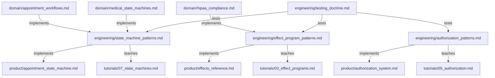

# HealthHub Engineering Best Practices

> Implementation patterns for building HealthHub using ADTs, effect programs, and pure functional programming.

---

## Purpose

The **engineering/** tier contains **HealthHub-specific implementation patterns** for applying domain knowledge in code. These documents focus on **HOW to implement** features using HealthHub's tech stack and architecture.

**Key Principle**: If a pattern describes HealthHub's specific implementation choices (ADT-based authorization, effect programs, generator testing), it belongs in this tier.

---

## Document Organization

### Core Patterns

**[Authorization Patterns](authorization_patterns.md)** (244 lines)
- HOW to use HealthHub's ADT-based authorization system
- Pattern matching for access control (PatientAuthorized, DoctorAuthorized, AdminAuthorized, Unauthorized)
- Capability-based fields (can_prescribe)
- Testing authorization logic
- Anti-patterns: string-based roles, boolean authorization, exception-based auth

**Use this when**: Implementing authorization checks in HealthHub routes, programs, or business logic.

---

**[State Machine Patterns](state_machine_patterns.md)** (456 lines)
- HOW to implement ADT-based state machines in HealthHub
- Five core patterns:
  1. ADT Status Types (frozen dataclasses with state-specific fields)
  2. Transition Result ADT (TransitionSuccess | TransitionInvalid)
  3. Validate Before Transition (exhaustive pattern matching)
  4. Terminal State Detection (is_terminal function)
  5. Status-Specific Actions (get_available_actions by role)
- Five anti-patterns: string-based status, no validation, stateless status, mutable status, exception-based transitions
- Comprehensive testing patterns

**Use this when**: Implementing any workflow with states (appointments, prescriptions, lab results, invoices).

---

**[Effect Program Patterns](effect_program_patterns.md)** (318 lines)
- HOW to write pure effect programs as generators
- Six core patterns:
  1. Generator-Based Programs (yield effects, receive results)
  2. Type Narrowing After Effects (isinstance checks)
  3. Fire-and-Forget Notifications (don't block on notification failures)
  4. Program Composition (yield from for sub-programs)
  5. Early Return on Failure (guard clauses)
  6. Audit Logging Pattern (log all PHI access)
- Six anti-patterns: direct infrastructure calls, missing type narrowing, silent failures, blocking on notifications, imperative loops, skipping validation
- Generator testing patterns

**Use this when**: Writing new effect programs or refactoring existing business logic.

---

**[Purity Standards](purity_standards.md)** (750+ lines)
- HIPAA-compliant code review standards for effect system purity
- Six purity standards mapped to §164.312 requirements:
  1. Effects as Data (§164.312(b) Audit Controls)
  2. Yield Don't Call (§164.312(a)(1) Access Control)
  3. Interpreters Isolate Impurity (All §164.312)
  4. Immutability by Default (§164.312(c)(1) Integrity)
  5. No Loops (§164.312(b) Deterministic workflows)
  6. Exhaustive Pattern Matching (§164.312 Medical safety)
- Automated violation detection (grep patterns)
- 12 anti-patterns with severity triage (CRITICAL/HIGH/MEDIUM)
- Layer-specific standards (routes, programs, interpreters, domain, infrastructure)
- Code review checklists (purity + HIPAA compliance)
- Current codebase violation scan (15+ critical violations)

**Use this when**: Conducting code reviews, evaluating purity compliance, identifying HIPAA violations, automated CI/CD checks.

---

### Quality & Testing

**[Testing Doctrine](testing_doctrine.md)** (1,345 lines)
- Comprehensive testing philosophy and patterns for HealthHub
- Three test tiers: Backend Unit, Integration, E2E
- 22 test anti-patterns with examples
- Generator testing patterns (step through yield statements)
- Integration testing with real infrastructure (PostgreSQL, Redis, Pulsar)
- E2E testing for complete workflows
- Test output management (30,000 char truncation handling)
- Coverage requirements (backend: comprehensive, integration: conceptual)

**Use this when**: Writing tests for any HealthHub component (programs, interpreters, repositories).

---

### Security & Compliance

**[Security Hardening](security_hardening.md)** (867 lines)
- Dual-token JWT authentication (access 15min, refresh 7 days)
- CSRF protection layers (Bearer token, SameSite cookies, CORS, WebSocket origin validation)
- ADT-based authorization security (pattern matching, capability fields)
- Rate limiting for PHI protection (login, PHI access, API endpoints)
- HIPAA Security Rule compliance (§164.312 mapping)
- Cookie security configuration (HttpOnly, Secure, SameSite)
- Anti-patterns: string-based roles, localStorage tokens, missing rate limiting

**Use this when**: Implementing authentication, authorization, or security controls for medical data.

---

### Observability & Operations

**[Monitoring & Observability](monitoring_observability.md)** (1,431 lines)
- Prometheus metrics architecture for healthcare
- Healthcare-specific metrics catalog (PHI access, appointments, prescriptions, lab results, audit logs)
- Recording rules (PHI access rate, appointment success, lab result delivery)
- Service Level Objectives (SLOs) with multi-window burn rates
- Alert rules by severity (P1/P2/P3 with thresholds)
- Grafana dashboards (6 healthcare dashboards)
- Four Golden Signals (Latency, Traffic, Errors, Saturation)
- Developer workflow (adding metrics, testing, dashboard creation)

**Use this when**: Adding metrics to features, creating dashboards, defining alerts, tracking SLOs, or monitoring PHI access.

---

### Development Quality

**[Code Quality Enforcement](code_quality_enforcement.md)** (590 lines)
- Ruff linting architecture (F, E, W, B, ANN, PT, UP rules)
- Tool responsibility split (Ruff → Black → MyPy)
- Healthcare-specific quality rules (no mutable defaults, no bare except, type hints required)
- Effect system boundary enforcement (banned APIs: asyncpg, Redis, Pulsar in effect programs)
- check-code integration (Ruff → Black → MyPy fail-fast workflow)
- pyproject.toml configuration examples

**Use this when**: Setting up linting, enforcing code standards, or onboarding developers.

---

### Real-Time Communication

**[WebSocket Security](websocket_security.md)** (690 lines)
- Native WebSocket architecture with Redis Pub/Sub
- One-time ticket authentication (60s expiry, Redis GETDEL)
- Channel isolation for patient PHI (server-side authorization)
- Connection state machine (Idle → Connecting → Authenticating → Active → Reconnecting → Terminated)
- Medical event protocol (appointment_updated, lab_result_ready, prescription_created, billing_invoice_ready)
- Priority levels (normal, urgent, critical) with acknowledgments
- Security controls (CSP, origin validation, rate limiting, TLS requirement)
- Resilience patterns (heartbeat, exponential backoff, subscription recovery)

**Use this when**: Implementing real-time notifications, WebSocket connections, or critical medical alerts.

---

### Integration

**[FastAPI Integration Patterns](fastapi_integration_patterns.md)** (390 lines)
- Route handler → effect program conversion (HTTP → Program → HTTP)
- Request/response lifecycle (Pydantic validation, program execution, DTO conversion)
- Error handling (domain errors → HTTP status codes)
- Dependency injection for interpreters (get_interpreter factory pattern)
- Authorization dependencies (ADT-based access control with Depends())
- Role-based filtering (pattern matching for query construction)
- Common pitfalls (direct infrastructure calls, mixing exceptions, resource leaks)

**Use this when**: Creating new FastAPI routes, integrating with effectful programs, or bridging HTTP and effect systems.

---

**[Frontend Architecture](frontend_architecture.md)** (355 lines)
- FastAPI StaticFiles mount + catch-all route pattern (ShipNorth reference)
- Single-server architecture (backend + frontend on port 8850)
- Build process (Vite → build/ directory → Docker image)
- Three development workflows (backend only, frontend dev with HMR, full stack rebuild)
- Route registration order (API → StaticFiles → catch-all)
- React Router client-side routing integration
- Troubleshooting guide (503 errors, 404s, static asset issues)

**Use this when**: Setting up frontend serving, debugging frontend access issues, or understanding the frontend build process.

---

### Documentation Standards

**[Mermaid Standards](mermaid_standards.md)** (270 lines)
- Universal compatibility subset (GitHub + VSCode)
- Diagram types (state machines, sequence diagrams, flowcharts)
- Healthcare patterns (appointment state machine, prescription workflow, authorization flows, lab result alerts)
- Style guide (color coding, node shapes, arrow types)
- Accessibility guidelines (WCAG AA compliance, descriptive labels, maximum 15 nodes)
- Safe subset (flowchart TB, solid arrows only, no subgraphs)
- Testing checklist

**Use this when**: Creating state machine diagrams, authorization flows, or architecture visualizations.

---

## Relationship to Other Tiers

### Domain → Best Practices

The **domain/** tier provides **healthcare domain knowledge** that best_practices implements:

- [Appointment Workflows](../domain/appointment_workflows.md) → Implemented using state_machine_patterns.md
- [Medical State Machines](../domain/medical_state_machines.md) → General patterns implemented in state_machine_patterns.md
- [HIPAA Compliance](../domain/hipaa_compliance.md) → Audit logging implemented in effect_program_patterns.md

**Flow**: Healthcare requirements → HealthHub implementation patterns

---

### Best Practices → Product

The **product/** tier contains **HealthHub-specific implementations** that use these patterns:

- authorization_patterns.md → [Authorization System](../product/authorization_system.md)
- state_machine_patterns.md → [Appointment State Machine](../product/appointment_state_machine.md)
- effect_program_patterns.md → [Effects Reference](../product/effects_reference.md)
- testing_doctrine.md → All product testing

**Flow**: Implementation patterns → Actual HealthHub code

---

### Best Practices → Tutorials

The **tutorials/** tier provides **step-by-step guides** that teach these patterns:

- authorization_patterns.md → [Tutorial 05: Authorization](../tutorials/05_authorization.md)
- state_machine_patterns.md → [Tutorial 07: State Machines](../tutorials/07_state_machines.md)
- effect_program_patterns.md → [Tutorial 03: Effect Programs](../tutorials/03_effect_programs.md)

**Flow**: Patterns reference → Guided implementation

---

## Cross-Tier Navigation

**Starting Point**: If you're new to HealthHub development, start here:
1. Read [Effect Program Patterns](effect_program_patterns.md) to understand program structure
2. Read [State Machine Patterns](state_machine_patterns.md) to understand workflow implementation
3. Read [Authorization Patterns](authorization_patterns.md) to understand access control
4. Read [Testing Doctrine](testing_doctrine.md) to understand testing philosophy

**Reference Material**: If you're implementing a specific feature:
- **Authorization**: authorization_patterns.md → ../product/authorization_system.md
- **State Machine**: state_machine_patterns.md → ../product/appointment_state_machine.md
- **Effect Program**: effect_program_patterns.md → ../product/effects_reference.md
- **Testing**: testing_doctrine.md → tests/pytest/*

**Architectural Context**: For healthcare domain understanding:
1. Read [domain/medical_state_machines.md](../domain/medical_state_machines.md) for healthcare requirements
2. Then read state_machine_patterns.md for HealthHub implementation
3. Then check [product/appointment_state_machine.md](../product/appointment_state_machine.md) for actual code

---

## Document Dependencies

**Legend**:
- **implements**: Best practice implements domain knowledge OR product implements best practice
- **teaches**: Tutorial teaches best practice
- **tests**: Testing doctrine covers testing strategy

---

## Maintenance Guidelines

### When to Add New Documents

Add a new document to **engineering/** if:
- ✅ The content describes HealthHub-specific implementation patterns
- ✅ It provides HOW-TO guidance for developers
- ✅ It's reusable across multiple HealthHub features

Do NOT add to **engineering/** if:
- ❌ The content is general healthcare domain knowledge (use domain/)
- ❌ It describes a specific HealthHub feature implementation (use product/)
- ❌ It's a step-by-step tutorial (use tutorials/)

### When to Update Existing Documents

Update **engineering/** documents when:
- New implementation patterns emerge from code reviews
- Anti-patterns are discovered in production
- HealthHub architecture evolves (new effect types, new interpreters)
- Testing strategies change (new test infrastructure, new patterns)

---

## Pattern Hierarchy

**Best Practices follow this hierarchy**:

1. **Domain Knowledge** (from domain/ tier)
   - Medical workflows, HIPAA requirements, healthcare constraints

2. **Implementation Patterns** (this tier)
   - ADT-based authorization, state machines, effect programs, testing

3. **Product Implementation** (product/ tier)
   - Actual HealthHub code using these patterns

4. **Tutorials** (tutorials/ tier)
   - Step-by-step guides for learning patterns

---

## Quick Reference

| What do you need? | Document to read |
|-------------------|------------------|
| Implement authorization | [Authorization Patterns](authorization_patterns.md) |
| Implement state machine | [State Machine Patterns](state_machine_patterns.md) |
| Write effect program | [Effect Program Patterns](effect_program_patterns.md) |
| **Review code purity** | **[Purity Standards](purity_standards.md)** |
| Write tests | [Testing Doctrine](testing_doctrine.md) |
| Implement security | [Security Hardening](security_hardening.md) |
| Add monitoring | [Monitoring & Observability](monitoring_observability.md) |
| Enforce code quality | [Code Quality Enforcement](code_quality_enforcement.md) |
| Implement WebSockets | [WebSocket Security](websocket_security.md) |
| Integrate FastAPI | [FastAPI Integration Patterns](fastapi_integration_patterns.md) |
| Serve frontend | [Frontend Architecture](frontend_architecture.md) |
| Create diagrams | [Mermaid Standards](mermaid_standards.md) |
| Understand domain | [../domain/](../domain/) |
| See actual code | [../product/](../product/) |
| Learn step-by-step | [../tutorials/](../tutorials/) |

---

**Last Updated**: 2025-11-28
**Maintainer**: HealthHub Team
**Document Count**: 12 engineering documents
