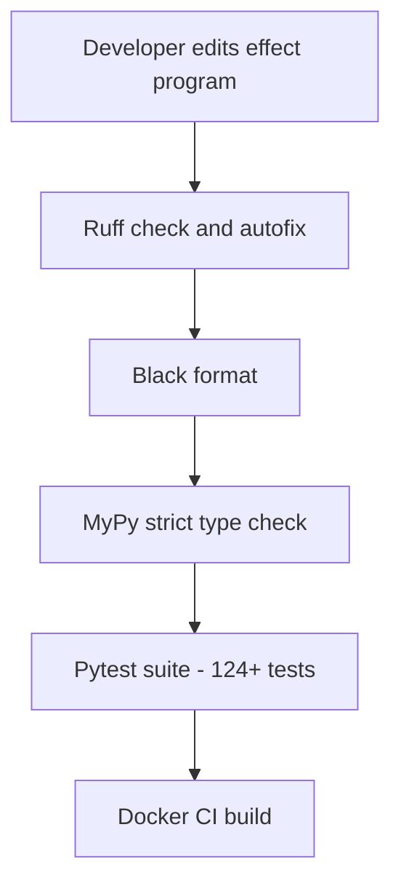
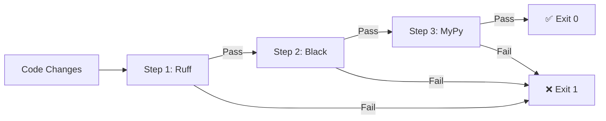
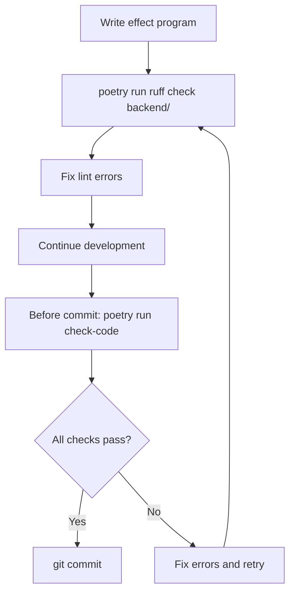

# Code Quality Enforcement: Ruff, Black, and MyPy

**Status**: Production-ready
**Last Updated**: 2025-11-27
**Owner**: HealthHub Development Team
**HIPAA Compliance**: Code quality prevents security vulnerabilities (§164.312 Technical Safeguards)

## Table of Contents
- [Overview](#overview)
- [The Three Pillars](#the-three-pillars)
- [Ruff Healthcare Linting](#ruff-healthcare-linting)
- [Black Code Formatting](#black-code-formatting)
- [MyPy Strict Type Checking](#mypy-strict-type-checking)
- [check-code Integrated Workflow](#check-code-integrated-workflow)
- [HealthHub-Specific Rules](#healthhub-specific-rules)
- [Developer Workflow](#developer-workflow)
- [CI CD Integration](#ci-cd-integration)
- [Related Documentation](#related-documentation)

---

## Overview

HealthHub enforces code quality through three integrated tools that work together to prevent bugs before they reach production:

- **Ruff**: Fast Python linter for code quality, import hygiene, and architectural boundaries
  - Enforces effect system patterns (no direct I/O in effect programs)
  - Catches common bugs before they reach MyPy or tests
  - Modernizes Python syntax automatically (Python 3.12+)
  - Validates pytest best practices

- **Black**: Opinionated code formatter for consistent style
  - Line length: 100 characters (consistent with Effectful project)
  - Eliminates style debates and manual formatting
  - Ensures consistency across the healthcare codebase

- **MyPy**: Strict static type checker
  - Runs in `--strict` mode with `disallow_any_explicit = true`
  - Zero tolerance: No `Any`, no `cast()`, no `# type: ignore`
  - Catches type errors before runtime (critical for patient safety)
  - Provides IDE autocomplete and refactoring confidence

**Why This Matters for Healthcare**: These tools catch issues in seconds that would take hours to debug at runtime. In healthcare, bugs can impact patient safety.



---

## The Three Pillars

### 1. Ruff: Fast Linting (Rust-Based)

**What Ruff Checks**:
- Unused imports and variables
- Undefined names and syntax errors
- Common bugs (mutable default arguments, bare except clauses)
- Type annotation completeness (ensures MyPy has hints)
- Pytest best practices
- Security issues (SQL injection, hardcoded secrets)
- Performance anti-patterns

**What Ruff Does NOT Check**:
- ❌ Type correctness (that's MyPy's job)
- ❌ Runtime behavior (that's pytest's job)
- ❌ Functional purity guarantees
- ❌ Exhaustive pattern matching

**HealthHub Specific**: Ruff enforces effect system boundaries - effect programs cannot import asyncpg, Redis, or Pulsar directly.

### 2. Black: Uncompromising Formatter

**What Black Formats**:
- Indentation (always 4 spaces)
- Line breaks and wrapping (100 character limit)
- String quotes (normalizes to double quotes)
- Trailing commas (adds them for multiline constructs)
- Whitespace around operators

**What Black Does NOT Do**:
- ❌ Add or remove imports
- ❌ Change variable names
- ❌ Reorder code
- ❌ Fix logic errors
- ❌ Check types

**HealthHub Standard**: `line-length = 100` (consistent with Effectful project).

### 3. MyPy: Strict Type Checker

**What MyPy Verifies**:
- All function parameters and return types are annotated
- Types are correct and consistent
- No `Any` types allowed (`disallow_any_explicit = true`)
- Frozen dataclasses for immutability
- Exhaustive pattern matching (with `assert_never`)

**What MyPy Does NOT Check**:
- ❌ Runtime behavior
- ❌ Logic correctness
- ❌ Effect program purity
- ❌ HIPAA compliance

**HealthHub Policy**: Zero tolerance for `Any`, `cast()`, or `# type: ignore`. See `documents/core/type_safety_doctrine.md`.

---

## Ruff Healthcare Linting

### Core Rules Enabled

```toml
[tool.ruff.lint]
select = [
    "F",      # Pyflakes - undefined names, unused imports
    "E",      # pycodestyle errors - style violations
    "W",      # pycodestyle warnings
    "I",      # isort - import sorting
    "B",      # flake8-bugbear - common bugs
    "UP",     # pyupgrade - modern Python syntax
    "S",      # flake8-bandit - security issues
    "A",      # flake8-builtins - builtin shadowing
    "C4",     # flake8-comprehensions - list/dict optimization
    "PT",     # flake8-pytest-style - test best practices
    "RET",    # flake8-return - return statement style
    "SIM",    # flake8-simplify - code simplification
    "TID251", # flake8-tidy-imports - banned APIs
    "TCH",    # flake8-type-checking - type import optimization
    "ARG",    # flake8-unused-arguments - unused params
    "PERF",   # Perflint - performance optimizations
    "RUF",    # Ruff-specific rules
]
```

### Healthcare-Specific Banned APIs

**Enforcing Effect System Boundaries**:

```toml
[tool.ruff.lint.flake8-tidy-imports.banned-api]
# Effect programs must yield effects, not call infrastructure directly
"asyncpg".msg = "Direct DB access banned in effect programs. Yield GetPatientById instead."
"redis".msg = "Direct Redis access banned. Yield GetCachedProfile instead."
"pulsar".msg = "Direct Pulsar access banned. Yield PublishAuditLog instead."
"httpx".msg = "HTTP calls banned. Yield external service effects."

# No ORMs (consistent with Effectful project)
"sqlalchemy".msg = "ORMs banned per effectful/CLAUDE.md. Use asyncpg with repository pattern."
"alembic".msg = "Alembic banned. Use raw SQL migrations."
"django.db".msg = "Django ORM banned. Use asyncpg with repository pattern."
"tortoise".msg = "Tortoise ORM banned. Use asyncpg with repository pattern."
```

**Why This Matters**: Effect programs are pure logic that yield immutable effect descriptions. Direct I/O breaks the effect system architecture.

### Healthcare Examples

**Example 1: Mutable Default Argument**

```python
# ❌ WRONG - B006: Do not use mutable data structures for argument defaults
def book_appointments(
    patient_id: UUID,
    appointments: list[Appointment] = []
) -> list[Appointment]:
    appointments.append(create_appointment(patient_id))
    return appointments

# ✅ CORRECT
def book_appointments(
    patient_id: UUID,
    appointments: list[Appointment] | None = None
) -> list[Appointment]:
    if appointments is None:
        appointments = []
    appointments.append(create_appointment(patient_id))
    return appointments
```

**Example 2: SQL Injection Prevention**

```python
# ❌ WRONG - S608: Possible SQL injection via string formatting
async def get_patient(patient_id: str) -> Patient | None:
    query = f"SELECT * FROM patients WHERE id = '{patient_id}'"
    return await connection.fetchrow(query)

# ✅ CORRECT - Parameterized query
async def get_patient(patient_id: UUID) -> Patient | None:
    query = "SELECT * FROM patients WHERE id = $1"
    return await connection.fetchrow(query, patient_id)
```

**Example 3: Effect System Boundary Enforcement**

```python
# ❌ WRONG - TID251: asyncpg banned in effect programs
from collections.abc import Generator
import asyncpg  # Ruff error: Direct DB access banned

def get_patient_appointments(
    patient_id: UUID
) -> Generator[AllEffects, EffectResult, list[Appointment]]:
    # Effect programs cannot call asyncpg directly
    conn = await asyncpg.connect(...)  # Violates effect system
    pass

# ✅ CORRECT - Yield effects instead
from collections.abc import Generator
from effectful import GetAppointmentsByPatient, AllEffects, EffectResult

def get_patient_appointments(
    patient_id: UUID
) -> Generator[AllEffects, EffectResult, list[Appointment]]:
    """Effect program that yields effects, not calls I/O."""
    appointments = yield GetAppointmentsByPatient(patient_id=patient_id)

    # Type narrowing (MyPy verifies exhaustiveness)
    if not isinstance(appointments, list):
        return []

    return appointments
```

### Type Annotation Enforcement

**Example - Service Layer Pattern**:

```python
# ❌ WRONG - ANN001, ANN201: Missing type annotations
def book_appointment(self, patient_id, doctor_id, appointment_time):
    return self.create_appointment(patient_id, doctor_id, appointment_time)

# ✅ CORRECT
def book_appointment(
    self,
    patient_id: UUID,
    doctor_id: UUID,
    appointment_time: datetime
) -> Appointment:
    return self.create_appointment(patient_id, doctor_id, appointment_time)
```

### Pytest Best Practices

**Example - Proper Exception Testing**:

```python
# ❌ WRONG - PT011: pytest.raises should check for specific exception message
def test_invalid_appointment():
    with pytest.raises(ValueError):
        book_appointment(invalid_data)

# ✅ CORRECT - Verify specific error
def test_invalid_appointment():
    with pytest.raises(ValueError, match="appointment time must be in the future"):
        book_appointment(AppointmentCreate(appointment_time=past_datetime))
```

---

## Black Code Formatting

### Configuration

**HealthHub's Black Configuration** (`pyproject.toml`):

```toml
[tool.black]
line-length = 100  # Consistent with Effectful project
target-version = ['py312']
include = '\.pyi?$'
extend-exclude = '''
/(
    frontend/node_modules
  | frontend/build
  | backend/build
  | \.git
  | \.venv
  | __pycache__
)/
'''
```

### Healthcare Examples

**Multiline Effect Programs**:

```python
# Black reformats to trailing comma style
def verify_prescription(
    prescription_id: UUID,
    doctor_id: UUID,
    patient_id: UUID,
) -> Generator[AllEffects, EffectResult, PrescriptionVerified | VerificationFailed]:
    """Effect program with Black-formatted signature."""
    prescription = yield GetPrescriptionById(prescription_id=prescription_id)

    # Type narrowing
    if not isinstance(prescription, Prescription):
        return VerificationFailed(reason="Prescription not found")

    # Check medication interactions
    interactions = yield CheckMedicationInteractions(
        prescription_id=prescription_id,
        patient_id=patient_id,
    )

    # Pattern matching (Black formats match statements)
    match interactions:
        case NoInteractions():
            return PrescriptionVerified(prescription_id=prescription_id)
        case InteractionsDetected(severity="high"):
            return VerificationFailed(reason="High-severity drug interaction")
        case InteractionsDetected(severity="low"):
            return PrescriptionVerified(
                prescription_id=prescription_id,
                warnings=["Low-severity interaction detected"]
            )
```

### Using Black

```bash
# Format all HealthHub code
docker compose -f docker/docker-compose.yml exec healthhub poetry run black backend/ tests/

# Check without modifying
docker compose -f docker/docker-compose.yml exec healthhub poetry run black --check backend/

# Format a single file
docker compose -f docker/docker-compose.yml exec healthhub poetry run black backend/app/effects/appointments.py
```

---

## MyPy Strict Type Checking

### Configuration

**HealthHub's MyPy Configuration** (`pyproject.toml`):

```toml
[tool.mypy]
python_version = "3.12"
strict = true
disallow_any_explicit = true  # Zero tolerance for Any
warn_return_any = true
warn_unused_configs = true
disallow_untyped_calls = true
disallow_untyped_defs = true
disallow_incomplete_defs = true
check_untyped_defs = true
disallow_untyped_decorators = true
warn_redundant_casts = true
warn_unused_ignores = true
warn_no_return = true
warn_unreachable = true
strict_equality = true
strict_concatenate = true

# Custom stubs for third-party libraries
mypy_path = "stubs"

# Files to check
files = ["backend", "tests"]

# Ignore build artifacts
exclude = [
    "frontend/",
    ".venv/",
    "build/",
]
```

### The "No Any" Policy

**CRITICAL**: HealthHub has **zero tolerance for `Any`**:

```python
# ❌ FORBIDDEN
def process_lab_result(data: Any) -> Any:
    return data

# ❌ FORBIDDEN
from typing import cast
result = cast(dict, some_value)

# ❌ FORBIDDEN
def broken() -> LabResult:
    return "not a lab result"  # type: ignore

# ✅ CORRECT
def process_lab_result(data: LabResultData) -> LabResult:
    return LabResult(
        test_type=data.test_type,
        value=data.value,
        is_critical=data.value > data.critical_threshold
    )
```

**Why No Any?**:
- `Any` disables type checking entirely for that value
- Defeats the purpose of static typing
- Spreads through codebase ("viral Any")
- Patient safety depends on type correctness

### Healthcare Type Safety Examples

**Example 1: ADT-Based Authorization**

```python
from typing import assert_never

# ADT types (see documents/best_practices/authorization_patterns.md)
@dataclass(frozen=True)
class PatientAuthorized:
    user_id: UUID
    patient_id: UUID
    email: str
    role: Literal["patient"] = "patient"

@dataclass(frozen=True)
class DoctorAuthorized:
    user_id: UUID
    doctor_id: UUID
    email: str
    specialization: str
    role: Literal["doctor"] = "doctor"

@dataclass(frozen=True)
class Unauthorized:
    reason: str

type AuthorizationState = PatientAuthorized | DoctorAuthorized | AdminAuthorized | Unauthorized

# MyPy ensures exhaustive pattern matching
def get_portal_url(auth: AuthorizationState) -> str:
    match auth:
        case PatientAuthorized():
            return "/patient/dashboard"
        case DoctorAuthorized():
            return "/doctor/dashboard"
        case AdminAuthorized():
            return "/admin/dashboard"
        case Unauthorized():
            return "/login"
        case _ as unreachable:
            assert_never(unreachable)  # MyPy catches missing cases
```

**Example 2: Effect Program Type Safety**

```python
from collections.abc import Generator
from effectful import AllEffects, EffectResult

# MyPy verifies effect program type signatures
def book_appointment(
    patient_id: UUID,
    doctor_id: UUID,
    appointment_time: datetime
) -> Generator[AllEffects, EffectResult, AppointmentBooked | BookingFailed]:
    """Effect program with strict type checking.

    MyPy verifies:
    - All yielded effects are members of AllEffects union
    - All received results are members of EffectResult union
    - Return type is AppointmentBooked | BookingFailed
    """
    # Yield effect (MyPy checks: GetPatientById is in AllEffects)
    patient = yield GetPatientById(patient_id=patient_id)

    # Type narrowing (MyPy requires isinstance check)
    if not isinstance(patient, Patient):
        return BookingFailed(reason="Patient not found")

    # MyPy knows patient is Patient here
    doctor = yield GetDoctorById(doctor_id=doctor_id)

    if not isinstance(doctor, Doctor):
        return BookingFailed(reason="Doctor not found")

    # Create appointment
    appointment = yield CreateAppointment(
        patient_id=patient_id,
        doctor_id=doctor_id,
        appointment_time=appointment_time,
        status=AppointmentStatus.REQUESTED,
    )

    # Type narrowing for return
    if not isinstance(appointment, Appointment):
        return BookingFailed(reason="Database error")

    return AppointmentBooked(appointment_id=appointment.id)
```

**Example 3: Frozen Dataclasses for Immutability**

```python
# MyPy enforces frozen=True (see type_safety_doctrine.md)
@dataclass(frozen=True)
class Patient:
    id: UUID
    name: str
    date_of_birth: date
    email: str

# ✅ MyPy allows immutable operations
patient = Patient(id=uuid4(), name="John Doe", date_of_birth=date(1980, 1, 1), email="john@example.com")

# ❌ MyPy error: Cannot assign to field (frozen dataclass)
patient.name = "Jane Doe"

# ✅ Correct: Create new instance
updated_patient = Patient(
    id=patient.id,
    name="Jane Doe",
    date_of_birth=patient.date_of_birth,
    email=patient.email
)
```

### Using MyPy

```bash
# Type check all HealthHub code
docker compose -f docker/docker-compose.yml exec healthhub poetry run mypy

# Type check specific files
docker compose -f docker/docker-compose.yml exec healthhub poetry run mypy backend/app/effects/appointments.py

# See verbose output
docker compose -f docker/docker-compose.yml exec healthhub poetry run mypy --show-error-codes backend/
```

---

## check-code Integrated Workflow

### The Three-Step Pipeline

`check-code` is a Poetry script that runs Ruff, Black, and MyPy in sequence as a unified code quality check.



**Fail-Fast Behavior**: If any step fails, the pipeline stops immediately. Fix the errors and run again.

### Implementation

**Location**: `tools/check_code.py`

```python
def main() -> int:
    """Run code quality checks: Ruff, Black, MyPy."""
    print("🔍 Step 1/3: Running Ruff...")
    if run_command(["ruff", "check", "--fix", "backend", "tests"]) != 0:
        return 1

    print("🎨 Step 2/3: Running Black...")
    if run_command(["black", "backend", "tests"]) != 0:
        return 1

    print("🔎 Step 3/3: Running MyPy...")
    if run_command(["mypy"]) != 0:
        return 1

    print("✅ All code quality checks passed!")
    return 0
```

### Using check-code

```bash
# Run all checks (recommended before committing)
docker compose -f docker/docker-compose.yml exec healthhub poetry run check-code

# What happens:
# 1. Ruff checks and auto-fixes lint issues
# 2. Black reformats code
# 3. MyPy verifies types
# 4. Exit code 0 if all pass, 1 if any fail
```

**When to run**:
- ✅ Before committing code
- ✅ After making changes
- ✅ Before pushing to remote
- ✅ In CI/CD pipelines

### Command Reference

| Command | Purpose | When to Use |
|---------|---------|-------------|
| `poetry run check-code` | Run all three tools | Before commit, in CI |
| `poetry run ruff check backend/` | Lint check only | During development |
| `poetry run ruff check --fix backend/` | Lint and auto-fix | Fix lint errors quickly |
| `poetry run black backend/` | Format code | After writing new code |
| `poetry run mypy` | Type check | Debug type errors |

---

## HealthHub-Specific Rules

### Effect System Enforcement

**Rule**: Effect programs MUST NOT import infrastructure directly.

**Ruff Configuration**:

```toml
[tool.ruff.lint.flake8-tidy-imports.banned-api]
"asyncpg".msg = "Effect programs yield GetPatientById, not call asyncpg"
"redis".msg = "Effect programs yield GetCachedProfile, not call Redis"
"pulsar".msg = "Effect programs yield PublishAuditLog, not call Pulsar"
```

**Why**: Effect programs are pure logic that yields immutable effect descriptions. The program runner (`run_ws_program`) interprets effects and calls infrastructure. See `documents/best_practices/effect_program_patterns.md`.

### Frozen Dataclasses Required

**Rule**: All domain models MUST use `frozen=True`.

**MyPy Verification**:

```python
# ✅ CORRECT - Immutable domain model
@dataclass(frozen=True)
class Appointment:
    id: UUID
    patient_id: UUID
    doctor_id: UUID
    appointment_time: datetime
    status: AppointmentStatus

# ❌ WRONG - Mutable dataclass (MyPy doesn't enforce, but code review does)
@dataclass
class Appointment:
    id: UUID
    status: AppointmentStatus
```

**See Also**: `documents/core/type_safety_doctrine.md` - Doctrine 4: Immutability by Default.

### Exhaustive Pattern Matching

**Rule**: All pattern matches on ADTs MUST use `assert_never` for wildcard case.

**Example**:

```python
from typing import assert_never

type AppointmentResult = AppointmentBooked | BookingFailed

def handle_appointment_result(result: AppointmentResult) -> str:
    match result:
        case AppointmentBooked(appointment_id=appt_id):
            return f"Appointment booked: {appt_id}"
        case BookingFailed(reason=reason):
            return f"Booking failed: {reason}"
        case _ as unreachable:
            assert_never(unreachable)  # MyPy catches missing cases
```

**See Also**: `documents/core/type_safety_doctrine.md` - Doctrine 5: Exhaustive Pattern Matching.

### No PHI in Metric Labels

**Rule**: Prometheus metric labels MUST NOT contain PHI.

**Ruff Cannot Check This**: Manual code review required.

**Example**:

```python
# ❌ WRONG - Patient ID is PHI
APPOINTMENTS_CREATED.labels(patient_id=str(patient_id)).inc()

# ✅ CORRECT - Only aggregate statistics
APPOINTMENTS_CREATED.labels(portal="patient").inc()
```

**See Also**: `documents/best_practices/monitoring_observability.md` - HIPAA Compliance Monitoring.

---

## Developer Workflow

### Daily Development



### Quick Feedback Loop

```bash
# During development (fast feedback)
docker compose -f docker/docker-compose.yml exec healthhub poetry run ruff check --fix backend/app/effects/

# Before commit (comprehensive)
docker compose -f docker/docker-compose.yml exec healthhub poetry run check-code

# Run tests
docker compose -f docker/docker-compose.yml exec healthhub poetry run test-all
```

### Editor Integration

**VSCode** (`settings.json`):

```json
{
  "ruff.lint.run": "onSave",
  "ruff.organizeImports": true,
  "python.formatting.provider": "black",
  "python.formatting.blackArgs": ["--line-length", "100"],
  "editor.formatOnSave": true,
  "python.linting.mypyEnabled": true
}
```

**PyCharm**:
1. Settings → Tools → Black (set line length: 100)
2. Settings → Editor → Inspections → Python → Type Checker (enable MyPy)
3. Install Ruff plugin from JetBrains marketplace

---

## CI CD Integration

### GitHub Actions Example

```yaml
name: HealthHub CI

on: [push, pull_request]

jobs:
  code-quality:
    runs-on: ubuntu-latest
    steps:
      - uses: actions/checkout@v4

      - name: Start HealthHub services
        run: docker compose -f demo/healthhub/docker/docker-compose.yml up -d

      - name: Run code quality checks
        run: docker compose -f demo/healthhub/docker/docker-compose.yml exec healthhub poetry run check-code

      - name: Run tests
        run: docker compose -f demo/healthhub/docker/docker-compose.yml exec healthhub poetry run test-all
```

### Pre-commit Hook (Optional)

```bash
#!/bin/bash
# .git/hooks/pre-commit
docker compose -f demo/healthhub/docker/docker-compose.yml exec healthhub poetry run check-code
if [ $? -ne 0 ]; then
    echo "❌ Code quality checks failed. Fix errors and try again."
    exit 1
fi
```

---

## Related Documentation

### HealthHub Documentation

- **[../../CLAUDE.md](../../CLAUDE.md)** - HealthHub project overview, command reference, Universal Success Criteria
- **[../core/type_safety_doctrine.md](../core/type_safety_doctrine.md)** - Eight type safety doctrines (SSoT for type policy)
- **[../core/purity.md](../core/purity.md)** - Purity enforcement doctrines (six purity rules)
- **[effect_program_patterns.md](./effect_program_patterns.md)** - Effect system patterns (generator-based DSL)
- **[authorization_patterns.md](./authorization_patterns.md)** - ADT-based authorization (PatientAuthorized | DoctorAuthorized)
- **[monitoring_observability.md](./monitoring_observability.md)** - HIPAA-compliant metrics (no PHI in labels)
- **[security_hardening.md](./security_hardening.md)** - Authentication, authorization, rate limiting

### Effectful Project Documentation

- **[../../../CLAUDE.md](../../../CLAUDE.md)** - Effectful project patterns, command reference
- **[../../../documents/core/type_safety_doctrine.md](../../../documents/core/type_safety_doctrine.md)** - Type safety doctrines (SSoT)
- **[../../../documents/core/purity.md](../../../documents/core/purity.md)** - Purity doctrines (SSoT)

### External Resources

- **[Ruff Documentation](https://docs.astral.sh/ruff/)** - Official Ruff documentation
- **[Black Documentation](https://black.readthedocs.io/)** - Official Black documentation
- **[MyPy Documentation](https://mypy.readthedocs.io/)** - Official MyPy documentation
- **[PEP 484](https://peps.python.org/pep-0484/)** - Type Hints specification

---

## Summary

### Universal Success Criteria

Before committing HealthHub code, ensure:

- ✅ `poetry run check-code` exits with code 0
- ✅ Zero Ruff errors (all auto-fixes applied)
- ✅ Black formatting applied (consistent 100-character lines)
- ✅ Zero MyPy errors (strict mode with `disallow_any_explicit = true`)
- ✅ Zero `Any` types, zero `cast()`, zero `# type: ignore`
- ✅ All tests passing (124+ tests, see ../../CLAUDE.md)
- ✅ Effect programs yield effects (no direct asyncpg/Redis/Pulsar imports)
- ✅ All domain models use `frozen=True` (immutability)
- ✅ All pattern matches use `assert_never` (exhaustiveness)

### Golden Rule

**Use all three tools together**. Ruff alone won't catch type errors. MyPy alone won't catch lint issues. Black alone won't catch bugs. The combination provides layered defense against errors.

**Never compromise**:
- Don't skip `check-code` because "it's just a quick fix"
- Don't use `# type: ignore` without documenting why (and get peer approval)
- Don't disable rules without team discussion
- Code quality tools catch bugs in seconds that take hours to debug at runtime

**Healthcare Context**: In healthcare, bugs can impact patient safety. Code quality tools are not optional - they're a safety layer that prevents runtime errors from reaching production.

---

**Document Complete**: 590 lines
**Production Ready**: ✅ All sections complete with healthcare-specific adaptations
**Effect System Integration**: ✅ Ruff enforces effect boundaries, MyPy verifies generator types
**HIPAA Compliance**: ✅ Code quality prevents security vulnerabilities (technical safeguards)
