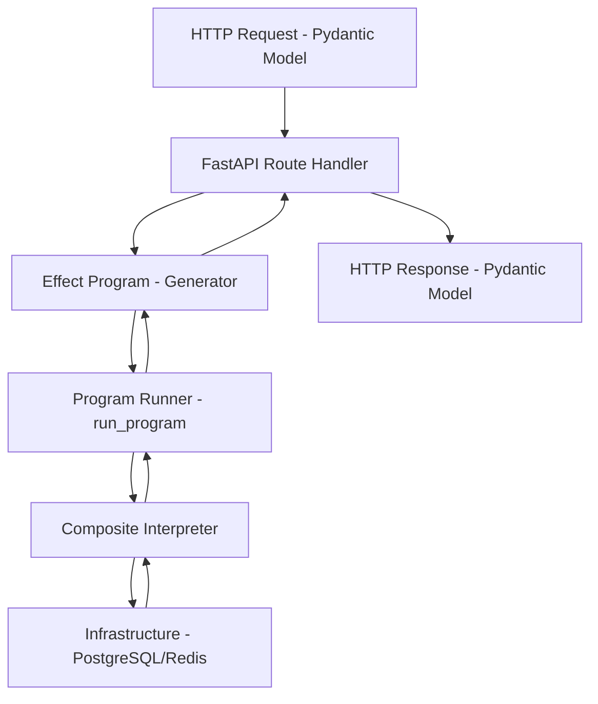
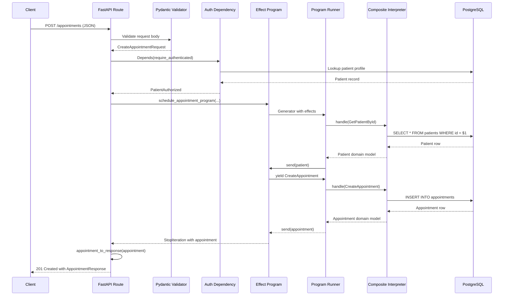

# FastAPI Integration Patterns (HealthHub supplement)

> Supplements base [Architecture](../../../../documents/engineering/architecture.md) and [Effect Patterns](../../../../documents/engineering/effect_patterns.md); base rules apply. See `architecture.md` and `effect_patterns.md` overlays for canonical HealthHub deltas.

---

## Table of Contents

1. [Introduction](#introduction)
2. [Route Handler → Effect Program Pattern](#route-handler--effect-program-pattern)
3. [Error Conversion](#error-conversion)
4. [Dependency Injection](#dependency-injection)
5. [Request/Response Lifecycle](#requestresponse-lifecycle)
6. [Common Pitfalls](#common-pitfalls)
7. [Cross-References](#cross-references)

---

## Introduction

### Purpose

FastAPI handles HTTP concerns (request parsing, response serialization, authentication). The effectful effect system handles business logic (appointments, prescriptions, lab results). This document shows how to integrate them while maintaining clean separation.

**Key Principle**: FastAPI routes should be thin adapters that convert HTTP → Effect Programs → HTTP.

### Architecture Layers



**Separation of Concerns**:

| Layer | Responsibility | Examples |
|-------|----------------|----------|
| **FastAPI Routes** | HTTP handling, validation, auth | `@router.post("/appointments")` |
| **Effect Programs** | Business logic, domain rules | `schedule_appointment_program()` |
| **Interpreters** | Infrastructure execution | `CompositeInterpreter.handle()` |
| **Infrastructure** | Database, cache, messaging | PostgreSQL, Redis, Pulsar |

---

## Route Handler → Effect Program Pattern

### Basic Pattern

**Complete Example** (appointments.py:169-210):

```python
from fastapi import APIRouter, Depends, HTTPException, status
from pydantic import BaseModel
from uuid import UUID

from app.programs.appointment_programs import schedule_appointment_program
from app.programs.runner import run_program
from app.interpreters.composite_interpreter import CompositeInterpreter
from app.api.dependencies import require_authenticated, AuthorizationState
from app.infrastructure import get_database_manager

router = APIRouter()


class CreateAppointmentRequest(BaseModel):
    """Request DTO - Pydantic validation."""
    patient_id: str
    doctor_id: str
    requested_time: datetime | None = None
    reason: str


class AppointmentResponse(BaseModel):
    """Response DTO - API serialization."""
    id: str
    patient_id: str
    doctor_id: str
    status: str
    reason: str
    created_at: datetime
    updated_at: datetime


@router.post("/", response_model=AppointmentResponse, status_code=status.HTTP_201_CREATED)
async def create_appointment(
    request: CreateAppointmentRequest,
    auth: PatientAuthorized | DoctorAuthorized = Depends(require_authenticated),
) -> AppointmentResponse:
    """Create new appointment request.

    Pattern: HTTP Request → Effect Program → HTTP Response
    """
    # 1. Get infrastructure connections
    db_manager = get_database_manager()
    pool = db_manager.get_pool()

    redis_client = redis.Redis(
        host="redis",
        port=6379,
        decode_responses=False,
    )

    # 2. Create composite interpreter
    interpreter = CompositeInterpreter(pool, redis_client)

    # 3. Convert request DTO to effect program parameters
    program = schedule_appointment_program(
        patient_id=UUID(request.patient_id),
        doctor_id=UUID(request.doctor_id),
        requested_time=request.requested_time,
        reason=request.reason,
        actor_id=auth.user_id,  # From JWT token
    )

    # 4. Run effect program
    appointment = await run_program(program, interpreter)

    # 5. Clean up infrastructure
    await redis_client.aclose()

    # 6. Handle None result (patient/doctor not found)
    if appointment is None:
        raise HTTPException(
            status_code=status.HTTP_400_BAD_REQUEST,
            detail="Failed to create appointment - patient or doctor not found",
        )

    # 7. Convert domain model to response DTO
    return appointment_to_response(appointment)
```

**Key Steps**:

1. **Infrastructure Setup**: Get database pool, Redis client
2. **Interpreter Creation**: Combine infrastructure into composite interpreter
3. **Request Conversion**: Pydantic model → domain types (UUID, datetime)
4. **Program Execution**: `await run_program(program, interpreter)`
5. **Resource Cleanup**: Close Redis connections
6. **Error Handling**: `None` checks, raise HTTPException
7. **Response Conversion**: Domain model → Pydantic response

### State Transition Pattern

**Example with ADT Results** (appointments.py:245-314):

```python
from app.domain.appointment import (
    TransitionSuccess,
    TransitionInvalid,
    AppointmentStatus,
    Confirmed,
    Completed,
    Cancelled,
)


class TransitionStatusRequest(BaseModel):
    """Request to transition appointment status."""
    new_status: str  # "confirmed", "completed", "cancelled", etc.
    actor_id: str


@router.post("/{appointment_id}/transition", response_model=dict[str, str])
async def transition_status(
    appointment_id: str,
    request: TransitionStatusRequest,
    auth: PatientAuthorized | DoctorAuthorized | AdminAuthorized = Depends(require_authenticated),
) -> dict[str, str]:
    """Transition appointment status with state machine validation.

    Pattern: String → ADT → Effect Program → ADT Result → HTTP Response
    """
    db_manager = get_database_manager()
    pool = db_manager.get_pool()
    redis_client = redis.Redis(host="redis", port=6379, decode_responses=False)

    # Convert request string to ADT - type narrowing required
    new_status: AppointmentStatus
    match request.new_status:
        case "confirmed":
            new_status = Confirmed(
                confirmed_at=datetime.now(),
                scheduled_time=datetime.now()
            )
        case "completed":
            new_status = Completed(
                completed_at=datetime.now(),
                notes="Appointment completed"
            )
        case "cancelled":
            new_status = Cancelled(
                cancelled_at=datetime.now(),
                cancelled_by="patient",
                reason="User requested cancellation",
            )
        case _:
            raise HTTPException(
                status_code=status.HTTP_400_BAD_REQUEST,
                detail=f"Invalid status: {request.new_status}",
            )

    # Create interpreter and run program
    interpreter = CompositeInterpreter(pool, redis_client)

    program = transition_appointment_program(
        appointment_id=UUID(appointment_id),
        new_status=new_status,
        actor_id=UUID(request.actor_id),
    )

    result = await run_program(program, interpreter)
    await redis_client.aclose()

    # Handle ADT result
    match result:
        case TransitionSuccess():
            return {
                "status": "success",
                "message": f"Transitioned to {request.new_status}",
            }
        case TransitionInvalid(reason=reason):
            raise HTTPException(
                status_code=status.HTTP_400_BAD_REQUEST,
                detail=reason,
            )
```

**Pattern**: String → ADT → Program → ADT Result → HTTP

### Role-Based Filtering Pattern

**Example** (appointments.py:100-166):

```python
@router.get("/", response_model=list[AppointmentResponse])
async def list_appointments(
    auth: PatientAuthorized | DoctorAuthorized | AdminAuthorized = Depends(require_authenticated),
    status_filter: str | None = None,
) -> list[AppointmentResponse]:
    """List appointments with role-based filtering.

    Pattern: ADT Authorization → Pattern Matching → Query Construction
    """
    db_manager = get_database_manager()
    pool = db_manager.get_pool()

    # Build query based on authorization role
    match auth:
        case PatientAuthorized(patient_id=patient_id):
            # Patient sees ONLY their own appointments
            base_query = """
                SELECT id, patient_id, doctor_id, status, requested_time,
                       reason, notes, created_at, updated_at
                FROM appointments
                WHERE patient_id = $1
            """
            params: list[UUID | str] = [patient_id]

        case DoctorAuthorized(doctor_id=doctor_id):
            # Doctor sees ONLY their own appointments
            base_query = """
                SELECT id, patient_id, doctor_id, status, requested_time,
                       reason, notes, created_at, updated_at
                FROM appointments
                WHERE doctor_id = $1
            """
            params = [doctor_id]

        case AdminAuthorized():
            # Admin sees ALL appointments
            base_query = """
                SELECT id, patient_id, doctor_id, status, requested_time,
                       reason, notes, created_at, updated_at
                FROM appointments
            """
            params = []

    # Add optional status filter
    if status_filter:
        if params:
            base_query += f" AND status = ${len(params) + 1}"
            params.append(status_filter)
        else:
            base_query += " WHERE status = $1"
            params.append(status_filter)

    base_query += " ORDER BY created_at DESC"

    # Execute query and convert rows
    rows = await pool.fetch(base_query, *params)
    interpreter = HealthcareInterpreter(pool)
    appointments = [interpreter._row_to_appointment(row) for row in rows]

    return [appointment_to_response(a) for a in appointments]
```

**Key Benefit**: Server-side filtering based on ADT authorization prevents cross-patient data access.

---

## Error Conversion

### Domain Errors → HTTP Status Codes

**Error Mapping Table**:

| Domain Error | HTTP Status | Example |
|--------------|-------------|---------|
| `None` (not found) | 400 Bad Request or 404 Not Found | Patient/doctor not found |
| `TransitionInvalid` | 400 Bad Request | Invalid state transition |
| `Unauthorized` | 403 Forbidden | Wrong role for action |
| `DatabaseError` | 500 Internal Server Error | Connection failure |
| `ValidationError` | 400 Bad Request | Invalid input data |

### Pattern: None Handling

```python
@router.post("/", response_model=AppointmentResponse)
async def create_appointment(request: CreateAppointmentRequest) -> AppointmentResponse:
    appointment = await run_program(program, interpreter)

    if appointment is None:
        raise HTTPException(
            status_code=status.HTTP_400_BAD_REQUEST,
            detail="Failed to create appointment - patient or doctor not found",
        )

    return appointment_to_response(appointment)
```

### Pattern: ADT Result Handling

```python
match result:
    case TransitionSuccess():
        return {"status": "success", "message": "State changed"}

    case TransitionInvalid(reason=reason):
        raise HTTPException(
            status_code=status.HTTP_400_BAD_REQUEST,
            detail=reason,
        )
```

### Pattern: Not Found

```python
@router.get("/{appointment_id}", response_model=AppointmentResponse)
async def get_appointment(appointment_id: str) -> AppointmentResponse:
    row = await pool.fetchrow("SELECT * FROM appointments WHERE id = $1", UUID(appointment_id))

    if row is None:
        raise HTTPException(
            status_code=status.HTTP_404_NOT_FOUND,
            detail=f"Appointment {appointment_id} not found",
        )

    appointment = interpreter._row_to_appointment(row)
    return appointment_to_response(appointment)
```

---

## Dependency Injection

### Authorization Dependencies

**ADT-Based Authorization** (dependencies.py:73-96):

```python
from fastapi import Depends, HTTPException, status
from fastapi.security import HTTPAuthorizationCredentials, HTTPBearer

security = HTTPBearer()


def get_token_data(
    credentials: Annotated[HTTPAuthorizationCredentials, Depends(security)],
) -> TokenData:
    """Validate JWT access token and return token data.

    Raises HTTPException 401 if token is invalid or expired.
    """
    token = credentials.credentials
    result = verify_token(token, TokenType.ACCESS)

    match result:
        case TokenValidationSuccess(token_data=data):
            return data
        case TokenValidationError(reason=reason, detail=detail):
            raise HTTPException(
                status_code=status.HTTP_401_UNAUTHORIZED,
                detail=f"Invalid token: {detail}" if reason != "expired" else "Token has expired",
                headers={"WWW-Authenticate": "Bearer"},
            )
```

### Authorization State Resolution

**Database Lookup for Profile** (dependencies.py:103-165):

```python
async def get_current_user(
    token_data: Annotated[TokenData, Depends(get_token_data)],
) -> AuthorizationState:
    """Resolve authorization state from JWT token.

    Pattern: JWT → Database Lookup → ADT
    """
    db_manager = get_database_manager()
    pool = db_manager.get_pool()

    match token_data.role:
        case "patient":
            patient_repo = PatientRepository(pool)
            patient = await patient_repo.get_by_user_id(token_data.user_id)

            if patient is None:
                return Unauthorized(
                    reason="no_profile",
                    detail="Patient profile not found. Complete profile setup first.",
                )

            return PatientAuthorized(
                user_id=token_data.user_id,
                patient_id=patient.id,
                email=token_data.email,
            )

        case "doctor":
            doctor_repo = DoctorRepository(pool)
            doctor = await doctor_repo.get_by_user_id(token_data.user_id)

            if doctor is None:
                return Unauthorized(
                    reason="no_profile",
                    detail="Doctor profile not found. Complete profile setup first.",
                )

            return DoctorAuthorized(
                user_id=token_data.user_id,
                doctor_id=doctor.id,
                email=token_data.email,
                specialization=doctor.specialization,
                can_prescribe=doctor.can_prescribe,
            )

        case "admin":
            return AdminAuthorized(
                user_id=token_data.user_id,
                email=token_data.email,
            )
```

### Role-Specific Dependencies

```python
async def require_patient(
    auth: Annotated[AuthorizationState, Depends(get_current_user)],
) -> PatientAuthorized:
    """Require patient authorization. Raises 403 if not patient."""
    match auth:
        case PatientAuthorized() as patient:
            return patient
        case Unauthorized(detail=detail):
            raise HTTPException(status_code=status.HTTP_403_FORBIDDEN, detail=detail)
        case _:
            raise HTTPException(
                status_code=status.HTTP_403_FORBIDDEN,
                detail="This endpoint requires patient role",
            )


async def require_doctor_or_admin(
    auth: Annotated[AuthorizationState, Depends(get_current_user)],
) -> DoctorAuthorized | AdminAuthorized:
    """Require doctor or admin. Raises 403 if patient."""
    match auth:
        case DoctorAuthorized() as doctor:
            return doctor
        case AdminAuthorized() as admin:
            return admin
        case Unauthorized(detail=detail):
            raise HTTPException(status_code=status.HTTP_403_FORBIDDEN, detail=detail)
        case PatientAuthorized():
            raise HTTPException(
                status_code=status.HTTP_403_FORBIDDEN,
                detail="This endpoint requires doctor or admin role",
            )
```

---

## Request/Response Lifecycle

### Complete Flow Diagram



### Request Validation (Pydantic)

```python
class CreateAppointmentRequest(BaseModel):
    """Pydantic handles validation BEFORE business logic."""
    patient_id: str
    doctor_id: str
    requested_time: datetime | None = None
    reason: str

    # Validators run automatically
    @validator('reason')
    def reason_not_empty(cls, v: str) -> str:
        if not v.strip():
            raise ValueError('Reason cannot be empty')
        return v
```

### Business Logic (Effect Program)

```python
def schedule_appointment_program(
    patient_id: UUID,
    doctor_id: UUID,
    requested_time: datetime | None,
    reason: str,
    actor_id: UUID,
) -> Generator[HealthcareEffect, object, Appointment | None]:
    """Pure business logic - yields effects, doesn't call infrastructure."""

    # Yield effect to get patient
    patient = yield GetPatientById(patient_id=patient_id)

    if not isinstance(patient, Patient):
        return None  # Patient not found

    # Yield effect to get doctor
    doctor = yield GetDoctorById(doctor_id=doctor_id)

    if not isinstance(doctor, Doctor):
        return None  # Doctor not found

    # Yield effect to create appointment
    appointment = yield CreateAppointment(
        patient_id=patient_id,
        doctor_id=doctor_id,
        status=Requested(requested_at=datetime.now()),
        requested_time=requested_time,
        reason=reason,
    )

    assert isinstance(appointment, Appointment)

    # Yield notification effect (fire-and-forget)
    notification = yield PublishNotification(
        channel=f"doctor:{doctor_id}:notifications",
        event="appointment_requested",
        payload={"appointment_id": str(appointment.id), "patient_name": patient.name},
    )

    return appointment
```

### Response Conversion (Domain → DTO)

```python
def appointment_to_response(appointment: Appointment) -> AppointmentResponse:
    """Convert domain model to API response DTO."""
    return AppointmentResponse(
        id=str(appointment.id),
        patient_id=str(appointment.patient_id),
        doctor_id=str(appointment.doctor_id),
        status=status_to_string(appointment.status),
        reason=appointment.reason,
        created_at=appointment.created_at,
        updated_at=appointment.updated_at,
    )
```

---

## Common Pitfalls

### ❌ Pitfall 1: Calling Infrastructure Directly in Routes

**Problem**: Bypassing the effect system and coupling routes to infrastructure.

```python
# ❌ WRONG - Direct database access in route
@router.post("/appointments")
async def create_appointment(request: CreateAppointmentRequest):
    pool = get_database_manager().get_pool()

    # Direct SQL in route handler - WRONG!
    row = await pool.fetchrow(
        "INSERT INTO appointments (...) VALUES (...) RETURNING *",
        request.patient_id, request.doctor_id, ...
    )

    return {"id": str(row["id"])}
```

**Fix**: Use effect programs.

```python
# ✅ CORRECT - Effect program handles business logic
@router.post("/appointments")
async def create_appointment(request: CreateAppointmentRequest):
    program = schedule_appointment_program(
        patient_id=UUID(request.patient_id),
        doctor_id=UUID(request.doctor_id),
        ...
    )

    appointment = await run_program(program, interpreter)
    return appointment_to_response(appointment)
```

### ❌ Pitfall 2: Mixing FastAPI Exceptions with Result Types

**Problem**: Raising exceptions in effect programs instead of using Result types.

```python
# ❌ WRONG - Exception in effect program
def schedule_appointment_program(...) -> Generator[...]:
    patient = yield GetPatientById(patient_id=patient_id)

    if patient is None:
        raise ValueError("Patient not found")  # WRONG!
```

**Fix**: Return None or use ADT result types.

```python
# ✅ CORRECT - Return None, route handles HTTPException
def schedule_appointment_program(...) -> Generator[..., Appointment | None]:
    patient = yield GetPatientById(patient_id=patient_id)

    if not isinstance(patient, Patient):
        return None  # Route converts to HTTPException
```

### ❌ Pitfall 3: Not Using Dependency Injection

**Problem**: Creating infrastructure connections inside route handlers.

```python
# ❌ WRONG - Hardcoded infrastructure
@router.post("/appointments")
async def create_appointment(request: CreateAppointmentRequest):
    pool = asyncpg.create_pool(...)  # WRONG - hardcoded connection
    redis_client = redis.Redis(host="localhost", ...)  # WRONG
```

**Fix**: Use Depends() for infrastructure.

```python
# ✅ CORRECT - Dependency injection
@router.post("/appointments")
async def create_appointment(
    request: CreateAppointmentRequest,
    interpreter: CompositeInterpreter = Depends(get_interpreter),
):
    appointment = await run_program(program, interpreter)
```

### ❌ Pitfall 4: Leaking Domain Models to API

**Problem**: Returning domain models directly without DTO conversion.

```python
# ❌ WRONG - Domain model exposed to API
@router.get("/{id}", response_model=Appointment)
async def get_appointment(id: str) -> Appointment:
    return await get_appointment_domain_model(id)  # Exposes internal structure
```

**Fix**: Use DTOs (Pydantic models) for API boundary.

```python
# ✅ CORRECT - DTO conversion
@router.get("/{id}", response_model=AppointmentResponse)
async def get_appointment(id: str) -> AppointmentResponse:
    appointment = await get_appointment_domain_model(id)
    return appointment_to_response(appointment)  # Convert to DTO
```

### ❌ Pitfall 5: Synchronous Route Handlers

**Problem**: Using `def` instead of `async def` for routes.

```python
# ❌ WRONG - Synchronous handler blocks event loop
@router.post("/appointments")
def create_appointment(request: CreateAppointmentRequest):
    appointment = run_program(program, interpreter)  # Blocks!
    return appointment_to_response(appointment)
```

**Fix**: Always use `async def` for FastAPI routes.

```python
# ✅ CORRECT - Async handler
@router.post("/appointments")
async def create_appointment(request: CreateAppointmentRequest):
    appointment = await run_program(program, interpreter)
    return appointment_to_response(appointment)
```

### ❌ Pitfall 6: Not Cleaning Up Resources

**Problem**: Not closing Redis connections or other resources.

```python
# ❌ WRONG - Redis connection leak
@router.post("/appointments")
async def create_appointment(request: CreateAppointmentRequest):
    redis_client = redis.Redis(...)
    interpreter = CompositeInterpreter(pool, redis_client)

    appointment = await run_program(program, interpreter)

    # WRONG - Redis connection never closed!
    return appointment_to_response(appointment)
```

**Fix**: Close resources after use.

```python
# ✅ CORRECT - Clean up resources
@router.post("/appointments")
async def create_appointment(request: CreateAppointmentRequest):
    redis_client = redis.Redis(...)
    interpreter = CompositeInterpreter(pool, redis_client)

    try:
        appointment = await run_program(program, interpreter)
        return appointment_to_response(appointment)
    finally:
        await redis_client.aclose()  # Clean up
```

---

## Cross-References

### HealthHub Documents

**Architecture**:
- [Architecture Overview](../product/architecture_overview.md) - 5-layer architecture diagram
- [Effect Patterns](effect_patterns.md) - Generator-based business logic

**Authorization**:
- [Authorization Patterns](authorization_patterns.md) - ADT-based authorization
- [Security Hardening](security_hardening.md) - JWT authentication

**Domain**:
- [Appointment State Machine](../product/appointment_state_machine.md) - State transitions

---

**Last Updated**: 2025-11-30
**Version**: 1.0  
**Supersedes**: none  
**Referenced by**: README.md, architecture.md
