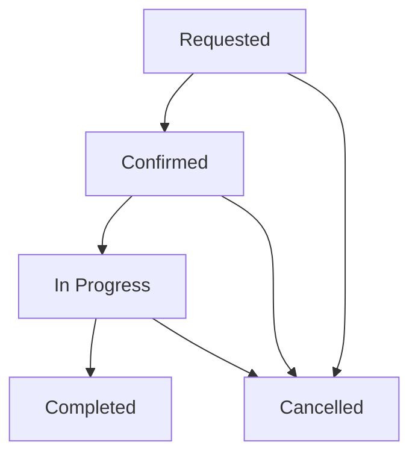
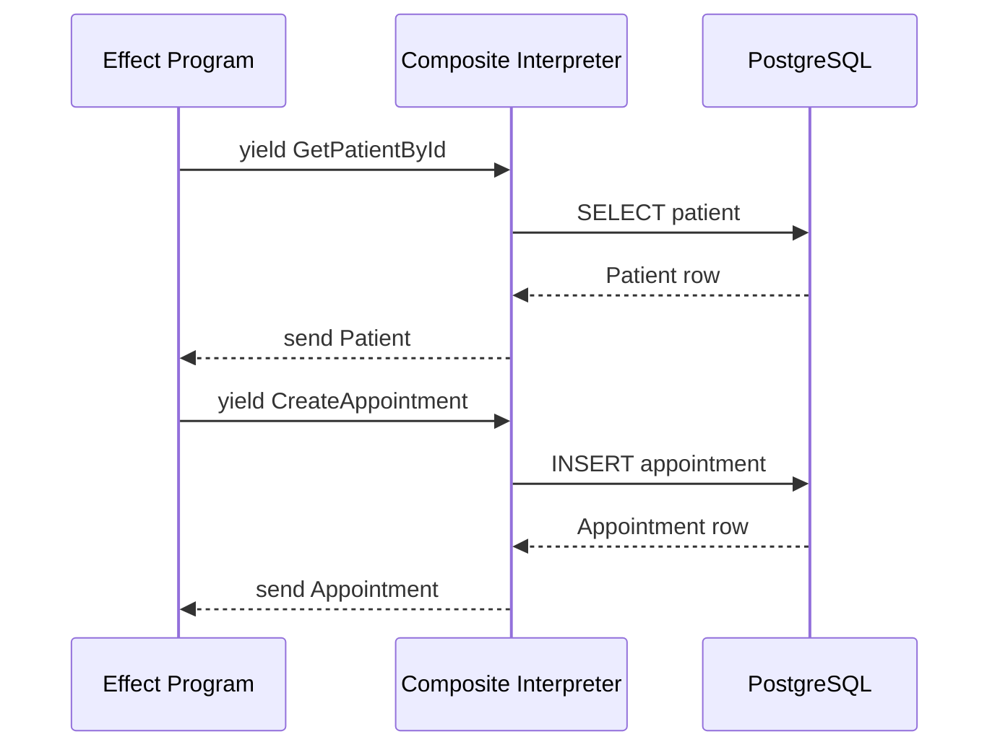
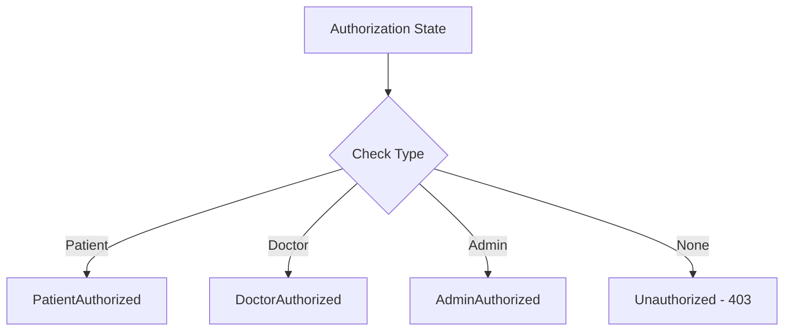
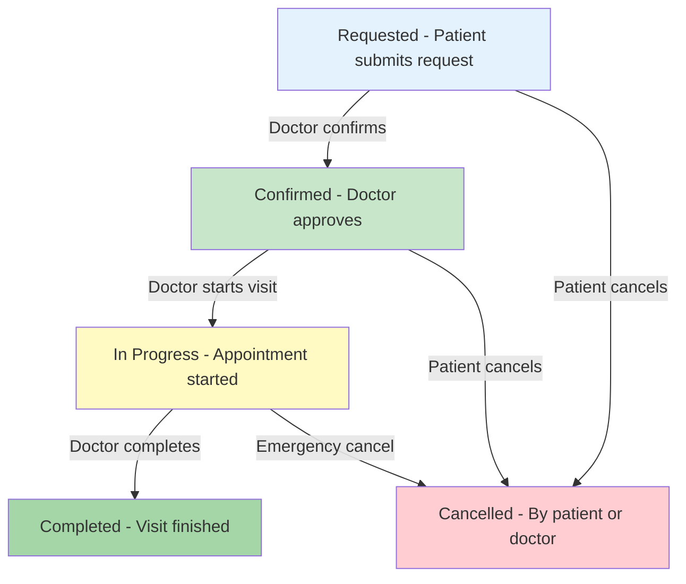
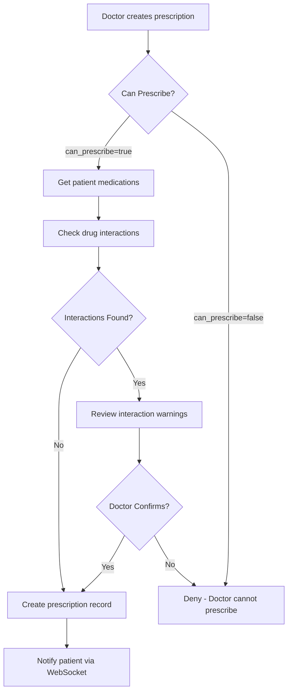
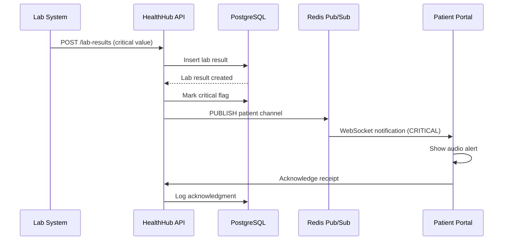
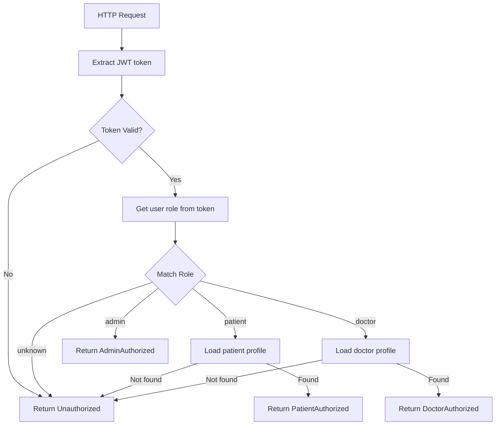
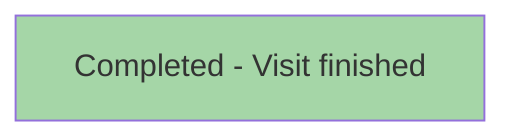
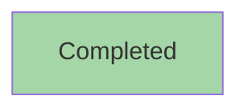

# Mermaid Diagram Standards for HealthHub

> **Healthcare-specific diagram standards** ensuring universal compatibility and accessibility for medical workflows.

---

## Table of Contents

1. [Overview](#overview)
2. [Diagram Types](#diagram-types)
3. [Healthcare Patterns](#healthcare-patterns)
4. [Style Guide](#style-guide)
5. [Accessibility](#accessibility)
6. [Safe Subset](#safe-subset)
7. [Cross-References](#cross-references)

---

## Overview

### Purpose

Define Mermaid diagram standards for HealthHub documentation that:
- Render identically in **GitHub** and **VSCode**
- Follow healthcare accessibility guidelines (WCAG AA)
- Clearly visualize medical workflows and state machines

### Compatibility Principle

**Problem**: GitHub (Mermaid v10.8.0) and VSCode extensions (Mermaid v11+) have syntax differences.

**Solution**: Use only the safe subset documented here.

**Priority**: Universal compatibility > Visual features

### Orientation Guidelines

**Core Principle**: Always orient the largest axis vertically (TB direction) for readability.

**Rule of Thumb**: If your longest chain has more than 3 elements, use `flowchart TB`.

---

## Diagram Types

### 1. State Diagrams (Appointment Status)

**Use Case**: Visualize appointment state machine transitions.

**Why it works**: Clear top-to-bottom flow, solid arrows only.

### 2. Sequence Diagrams (Effect Program Execution)

**Use Case**: Show effect program flow with interpreter interactions.

**Why it works**: Simple participants, solid/dashed arrows only, no complex blocks.

### 3. Flowcharts (Authorization Decision Trees)

**Use Case**: Visualize ADT pattern matching for authorization.

**Why it works**: Diamond shapes for decisions, solid arrows, clear flow.

---

## Healthcare Patterns

### Pattern 1: Appointment State Machine

**Healthcare Context**: Appointment status transitions with color-coded states (blue → green → yellow → green, red for cancelled).

### Pattern 2: Prescription Creation with Interaction Checking

**Healthcare Context**: Medication interaction checking with doctor override capability.

### Pattern 3: Lab Result Critical Value Alert

**Healthcare Context**: Critical lab result with guaranteed delivery and acknowledgment.

### Pattern 4: ADT Authorization Pattern Matching

**Healthcare Context**: JWT authentication → ADT authorization state resolution.

---

## Style Guide

### Color Coding

**Appointment States**:
- **Requested**: Light blue (#e3f2fd) - Initial state
- **Confirmed**: Light green (#c8e6c9) - Doctor approved
- **InProgress**: Light yellow (#fff9c4) - Active visit
- **Completed**: Green (#a5d6a7) - Successful completion
- **Cancelled**: Light red (#ffcdd2) - Terminal failure state

**Authorization States**:
- **PatientAuthorized**: Light blue (#e3f2fd)
- **DoctorAuthorized**: Light green (#c8e6c9)
- **AdminAuthorized**: Light purple (#e1bee7)
- **Unauthorized**: Light red (#ffcdd2)

### Node Shapes

| Shape | Use Case | Syntax |
|-------|----------|--------|
| **Rectangle** | Action, process step | `[Label]` |
| **Rounded** | Start/end state | `(Label)` |
| **Diamond** | Decision point | `{Label?}` |
| **Database** | Data store | `[(Label)]` |

### Arrow Types

**Only use these arrow types** (universal compatibility):

- `-->` Solid arrow (actions, transitions)
- `-->|label|` Solid arrow with label (conditions)

**NEVER use** (incompatible):
- ❌ `-.->` Dotted arrow
- ❌ `==>` Thick arrow
- ❌ `..` Dotted line

### Layout Direction

**Preferred**: `flowchart TB` (top-to-bottom)

**Acceptable**: `flowchart LR` (left-to-right) only for 3 or fewer sequential elements

---

## Accessibility

### WCAG AA Compliance

**Color Contrast**: All colors meet WCAG AA contrast ratios (4.5:1 for text).

**Color Independence**: Never rely solely on color to convey meaning.

**Good** (color + label):

**Bad** (color only):

### Descriptive Labels

**Good**: `Confirmed[Confirmed - Doctor approved]`

**Bad**: `C[Conf.]` (abbreviation, unclear)

### Maximum Diagram Complexity

**Limit**: 15 nodes per diagram maximum

**Rationale**: Cognitive load, screen reader navigation, visual clarity for patients.

---

## Safe Subset

### ✅ ALWAYS SAFE

**Flowcharts**:
- Keyword: `flowchart TB` or `flowchart LR`
- Nodes: `[Box]`, `(Rounded)`, `{Diamond}` only
- Arrows: `-->` solid only
- Labels: `A -->|label| B`

**Sequence Diagrams**:
- Keyword: `sequenceDiagram`
- Arrows: `->>` solid, `-->>` dashed response
- Participants: Simple alphanumeric names

### ❌ ALWAYS AVOID

- ❌ Dotted lines (`-.->`)
- ❌ Subgraphs (`subgraph`)
- ❌ Note over (`Note over Participant`)
- ❌ Special characters in labels (`:`, `()`, `{}`)
- ❌ Mixed arrow types

### Testing Checklist

Before committing diagrams:

- [ ] Uses only safe patterns
- [ ] No dotted lines
- [ ] No subgraphs
- [ ] Labels are descriptive (not abbreviations)
- [ ] Colors meet WCAG AA contrast (if used)
- [ ] Fewer than 15 nodes
- [ ] Tested in GitHub preview
- [ ] Tested in VSCode (Markdown Preview Mermaid Support extension)

---

## Cross-References

### HealthHub Documents

**State Machines**:
- [State Machine Patterns](state_machine_patterns.md) - Appointment status transitions
- [../product/appointment_state_machine.md](../product/appointment_state_machine.md) - Complete state machine reference

**Authorization**:
- [Authorization Patterns](authorization_patterns.md) - ADT pattern matching diagrams
- [../product/authorization_system.md](../product/authorization_system.md) - Authorization flow

**Architecture**:
- [../product/architecture_overview.md](../product/architecture_overview.md) - 5-layer architecture diagrams

**WebSocket**:
- [WebSocket Security](websocket_security.md) - Real-time notification flows

---

**Last Updated**: November 2025
**Version**: 1.0
