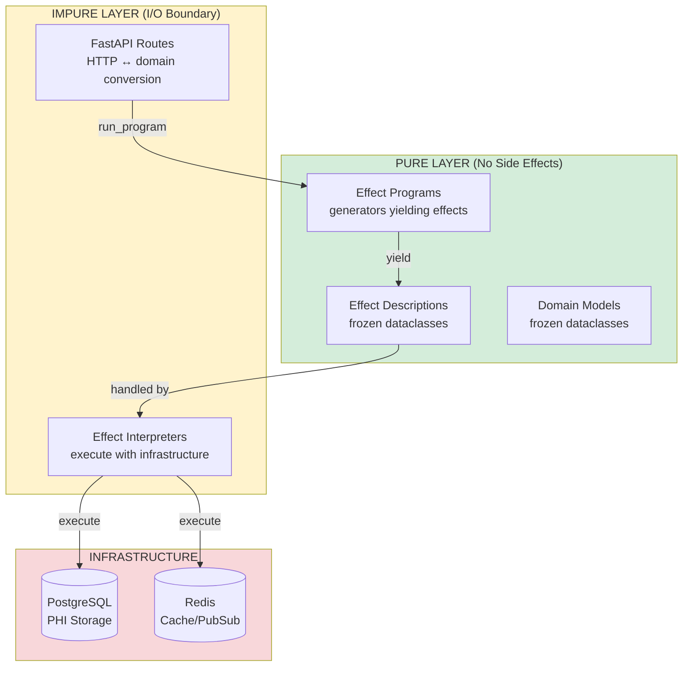

# Purity Standards for HealthHub

> HIPAA-Compliant Code Review Standards for Effect System Purity

---

## Purpose

This document defines **purity standards for HealthHub** as a style guide for automated code review by Claude Code CLI. It enables systematic evaluation of whether code meets purity requirements mandated by the effectful effect system architecture and HIPAA §164.312 compliance.

**Core Principle**: All business logic must be pure (free of side effects). The effect interpreter is the ONLY place where side effects occur.

**Code that circumvents the effect interpreter is**:
1. A purity violation
2. A HIPAA compliance risk
3. Subject to immediate refactoring

---

## Document Role

**What This Document Is**:
- ✅ Style guide for automated code review
- ✅ Diagnostic tool for violation detection
- ✅ Compliance mapping to HIPAA §164.312

**What This Document Is NOT**:
- ❌ Tutorial (see [tutorials/](../tutorials/))
- ❌ Comprehensive reference (see [effectful purity doctrine](../../../../documents/core/purity.md))
- ❌ Implementation guide (see [Effect Program Patterns](effect_program_patterns.md))

---

## HIPAA Compliance Mapping

**Critical Insight**: Purity is not optional in healthcare software. It's a **HIPAA §164.312 compliance requirement**.

| Purity Doctrine | HIPAA Requirement | Violation Risk |
|-----------------|-------------------|----------------|
| **Effects as Data** | §164.312(b) Audit Controls | Incomplete audit logs ($50k/violation) |
| **Immutability** | §164.312(c)(1) Integrity | Data tampering, unreproducible workflows |
| **Yield Don't Call** | §164.312(a)(1) Access Control | Unauthorized PHI access, missing audit |
| **Interpreter Isolation** | All §164.312 | Centralized compliance enforcement bypassed |
| **No Loops** | §164.312(b) | Non-deterministic audit trails |
| **Exhaustive Matching** | §164.312 | Unhandled medical states (safety risk) |

**Financial Impact**: HIPAA violations carry penalties of **$100 to $50,000 per violation**, with annual maximum of **$1.5 million per violation category**.

---

## Architecture: Pure vs Impure Layers



**Key Insight**: Business logic (pure layer) describes *what* should happen. Infrastructure layer (impure) decides *how* it executes.

---

## Quick Diagnostic Checklist

### File-Level Violation Detection

Run these automated checks to find purity violations:

```bash
# CRITICAL: Direct database calls in routes
grep -r "await pool.fetch" backend/app/api/
grep -r "await pool.fetchrow" backend/app/api/
grep -r "await pool.execute" backend/app/api/

# CRITICAL: Direct repository calls in programs
grep -r "await.*repo\." backend/app/programs/

# HIGH: Missing run_program in routes
grep -L "run_program" backend/app/api/*.py

# HIGH: Async generators (should be sync)
grep -r "async def.*Generator" backend/app/programs/

# HIGH: Non-frozen dataclasses in domain
grep -r "@dataclass$" backend/app/domain/
grep -r "@dataclass(" backend/app/domain/ | grep -v "frozen=True"

# HIGH: Non-frozen effects
grep -r "@dataclass" backend/app/effects/ | grep -v "frozen=True"

# MEDIUM: Mutable defaults
ruff check --select B006 backend/

# MEDIUM: For-loops in programs
grep -r "for .* in " backend/app/programs/

# MEDIUM: While-loops in programs
grep -r "while " backend/app/programs/
```

---

### Code Smell Catalog

| Smell | Pattern | Severity | HIPAA Risk | Financial |
|-------|---------|----------|------------|-----------|
| `await pool.*` in `api/` | Direct database call bypassing effects | **CRITICAL** | §164.312(b) Audit Controls | $50k/violation |
| `await repo.*` in `programs/` | Infrastructure call in pure program | **CRITICAL** | All §164.312 | $50k/violation |
| Missing `run_program()` in route | Business logic in route layer | **HIGH** | §164.312(b) | Investigation req'd |
| `@dataclass` without `frozen=True` | Mutable domain model | **HIGH** | §164.312(c)(1) Integrity | Data tampering |
| `async def` in `programs/` | Async generator instead of sync | **HIGH** | Effect DSL violation | N/A |
| `for` loop in program | Imperative iteration with mutation | **MEDIUM** | §164.312(b) | Non-reproducible |
| Missing `isinstance()` after yield | No type narrowing on effect result | **MEDIUM** | Runtime errors | N/A |
| `Optional[Patient]` in domain | Optional instead of ADT | **MEDIUM** | Invalid states | N/A |

---

### Per-Layer Validation

```python
# ===================================================================
# LAYER 1: FastAPI Routes (api/*.py)
# ===================================================================
# ALLOWED:
#   - HTTP request/response conversion (Pydantic)
#   - run_program() calls with effect programs
#   - Domain results → HTTP responses
#   - Error handling (domain errors → HTTP status codes)
#
# FORBIDDEN:
#   - await pool.fetch(...) or pool.execute(...)
#   - await repository.get_by_id(...)
#   - Business logic
#   - yield effects (routes don't yield)
#
# HIPAA REQUIREMENT: Routes must not bypass interpreter
# ===================================================================

# ===================================================================
# LAYER 2: Effect Programs (programs/*.py)
# ===================================================================
# ALLOWED:
#   - def program() -> Generator[AllEffects, object, ReturnType]
#   - yield GetPatientById(patient_id=patient_id)
#   - if not isinstance(patient, Patient): ...
#   - match authorization for pattern matching
#   - Early return on validation failures
#
# FORBIDDEN:
#   - async def (programs are sync generators)
#   - await anything (no async in pure programs)
#   - Direct I/O (print, logging, file access)
#   - Database calls
#   - for/while loops with mutation
#   - Global mutable state
#
# HIPAA REQUIREMENT: Programs must be deterministic and auditable
# ===================================================================

# ===================================================================
# LAYER 3: Interpreters (interpreters/*.py)
# ===================================================================
# ALLOWED:
#   - async def handle(effect: Effect) -> object
#   - await self.repo.get_by_id(...) (impure, but contained)
#   - try/except exception handling
#   - Logging (interpreter level, not program level)
#
# FORBIDDEN:
#   - Complex business logic (belongs in programs)
#   - Validation logic (belongs in programs or domain)
#
# HIPAA REQUIREMENT: Centralized PHI access enforcement
# ===================================================================

# ===================================================================
# LAYER 4: Domain Models (domain/*.py)
# ===================================================================
# REQUIRED:
#   - @dataclass(frozen=True) for ALL models
#   - ADT union types for variants (not Optional)
#   - Simple validation methods (pure functions)
#
# FORBIDDEN:
#   - @dataclass without frozen=True
#   - Mutable fields
#   - Optional for business logic (use ADT types)
#   - Infrastructure dependencies
#
# HIPAA REQUIREMENT: PHI records must be immutable
# ===================================================================

# ===================================================================
# LAYER 5: Infrastructure (repositories/, infrastructure/)
# ===================================================================
# CONTEXT: Not subject to purity rules (impure by design)
# ALLOWED: All I/O, database queries, external API calls
# ===================================================================
```

---

## Six Purity Standards

### Standard 1: Effects as Data

**HIPAA Requirement**: §164.312(b) Audit Controls - Complete access logging

**Standard**: Effects are frozen dataclasses with zero methods. They describe operations without executing them.

**Why This Matters for HIPAA**:
- Every PHI access can be logged **before** execution
- Audit trails are complete and reproducible
- Effects can be inspected for compliance before execution
- Compliance investigations can replay effect sequences

**CORRECT Example**:
```python
from dataclasses import dataclass
from uuid import UUID
from collections.abc import Generator

# Effect description - pure data
@dataclass(frozen=True)
class GetPatientById:
    """Description of a patient lookup. Does nothing until interpreted."""
    patient_id: UUID

# Program yields effect - interpreter logs BEFORE executing
def get_patient_program(patient_id: UUID) -> Generator[AllEffects, object, Patient | None]:
    # This YIELDS an effect description - doesn't execute anything
    patient = yield GetPatientById(patient_id=patient_id)

    # Interpreter flow:
    # 1. Receives GetPatientById effect
    # 2. Logs PHI access to audit trail
    # 3. Checks authorization
    # 4. Executes database query
    # 5. Returns result to program

    if not isinstance(patient, Patient):
        return None
    return patient
```

**VIOLATION Example**:
```python
# Effect with execute method - IMPURE!
class GetPatientById:
    patient_id: UUID

    async def execute(self, db: Database) -> Patient:
        # HIPAA VIOLATION: Executes BEFORE audit logging possible
        return await db.query("SELECT * FROM patients WHERE id = $1", self.patient_id)
```

**Detection**:
```bash
# Find effects with execute methods (CRITICAL)
grep -r "def execute" backend/app/effects/

# Find non-frozen effect dataclasses (HIGH)
grep -r "@dataclass$" backend/app/effects/
grep -r "@dataclass(" backend/app/effects/ | grep -v "frozen=True"
```

**Severity**: CRITICAL
**HIPAA Risk**: §164.312(b) violation - incomplete audit logs
**Financial**: $50,000 per violation

---

### Standard 2: Yield Don't Call

**HIPAA Requirement**: §164.312(a)(1) Access Control - Centralized authorization

**Standard**: Programs yield effects, never call infrastructure directly. All database/Redis/Pulsar calls go through effect interpreter.

**Why This Matters for HIPAA**:
- Interpreter enforces authorization before every PHI access
- All database calls logged centrally (single enforcement point)
- Reproducible workflows for compliance audits
- No direct PHI access bypassing security controls

**CORRECT Example** (prescription_programs.py:75-163):
```python
def create_prescription_program(
    patient_id: UUID,
    doctor_id: UUID,
    medication: str,
    ...
) -> Generator[AllEffects, object, PrescriptionCreationResult]:
    """Create prescription with interaction checking.

    ALL operations go through effect interpreter for HIPAA compliance.
    """
    # Step 1: Verify patient exists
    patient = yield GetPatientById(patient_id=patient_id)  # ✅
    # Interpreter: Checks authorization, logs PHI access, executes query

    if not isinstance(patient, Patient):
        return f"Patient {patient_id} not found"

    # Step 2: Verify doctor exists and can prescribe
    doctor = yield GetDoctorById(doctor_id=doctor_id)  # ✅
    if not isinstance(doctor, Doctor):
        return f"Doctor {doctor_id} not found"

    if not doctor.can_prescribe:
        return f"Doctor {doctor.first_name} {doctor.last_name} not authorized"

    # Step 3: Check medication interactions
    all_medications = [*existing_medications, medication]
    interaction_result = yield CheckMedicationInteractions(medications=all_medications)  # ✅

    # ... handle severe interactions ...

    # Step 4: Create prescription
    prescription = yield CreatePrescription(...)  # ✅

    # Step 5: Notify patient
    yield PublishWebSocketNotification(...)  # ✅

    # Step 6: Log audit event
    yield LogAuditEvent(...)  # ✅

    return prescription
```

**VIOLATION Example** (prescriptions.py:108-130):
```python
@router.get("/")
async def list_prescriptions(...):
    """List prescriptions - VIOLATES PURITY STANDARDS."""
    db_manager = get_database_manager()
    pool = db_manager.get_pool()

    # CRITICAL HIPAA VIOLATION: Direct database call
    match auth:
        case PatientAuthorized(patient_id=patient_id):
            rows = await pool.fetch(  # ❌ NO authorization check!
                """SELECT * FROM prescriptions WHERE patient_id = $1""",
                patient_id
            )  # ❌ NO audit logging!
        # ... more violations ...

    # HIPAA VIOLATIONS:
    # 1. No centralized access control (§164.312(a)(1))
    # 2. No audit log of PHI access (§164.312(b))
    # 3. Not reproducible for compliance investigation

    return [prescription_to_response(r) for r in rows]
```

**Detection**:
```bash
# Find direct database calls in routes (CRITICAL)
grep -rn "await pool\." backend/app/api/

# Find direct repository calls in programs (CRITICAL)
grep -rn "await.*repo\." backend/app/programs/

# Find await in programs (should be sync generators)
grep -rn "await" backend/app/programs/
```

**Severity**: CRITICAL
**HIPAA Risk**: §164.312(a)(1) + §164.312(b) - Unauthorized access, missing audit
**Impact**: 15+ endpoints in HealthHub violate this standard
**Financial**: $50,000+ per violation

---

### Standard 3: Interpreters Isolate Impurity

**HIPAA Requirement**: All §164.312 - Centralized compliance enforcement

**Standard**: All I/O happens in interpreters only. Programs and domain models are pure. Interpreters are the single enforcement point for all HIPAA requirements.

**Why This Matters for HIPAA**:
- Single enforcement point for all §164.312 requirements
- Audit logging in one place (interpreter layer)
- Authorization checks in one place (interpreter layer)
- Consistent PHI handling across all operations
- Easy to audit: review interpreters for compliance

**CORRECT Example**:
```python
# Interpreter - the ONLY place with database I/O
@dataclass(frozen=True)
class HealthcareInterpreter:
    """Healthcare effect interpreter - impure I/O boundary."""
    pool: asyncpg.Pool

    async def handle(self, effect: GetPatientById) -> Patient | None:
        """Execute GetPatientById effect with HIPAA controls.

        HIPAA Enforcement:
        - §164.312(a)(1): Check authorization (TODO: add auth context)
        - §164.312(b): Log PHI access
        - §164.312(c)(1): Return immutable Patient
        """
        # Step 1: Log PHI access (§164.312(b) Audit Controls)
        # TODO: Add audit logging here

        # Step 2: Execute query (impure I/O, but contained)
        row = await self.pool.fetchrow(
            "SELECT * FROM patients WHERE id = $1",
            effect.patient_id
        )

        if row is None:
            return None

        # Step 3: Return immutable Patient (§164.312(c)(1) Integrity)
        return Patient(
            id=row["id"],
            first_name=row["first_name"],
            last_name=row["last_name"],
            date_of_birth=row["date_of_birth"],
            medical_record_number=row["medical_record_number"],
        )
```

**VIOLATION Example**:
```python
# Route with database I/O - bypasses centralized enforcement
@router.get("/{patient_id}")
async def get_patient(patient_id: str):
    """Get patient - VIOLATES INTERPRETER ISOLATION."""
    pool = get_database_manager().get_pool()

    # CRITICAL VIOLATION: Route directly accesses database
    row = await pool.fetchrow(  # ❌
        "SELECT * FROM patients WHERE id = $1",
        UUID(patient_id)
    )

    # HIPAA VIOLATIONS:
    # - Bypasses centralized authorization check
    # - Bypasses centralized audit logging
    # - Duplicates enforcement logic (not DRY for compliance)

    if row is None:
        raise HTTPException(status_code=404, detail="Patient not found")

    return patient_to_response(row)
```

**Detection**: Same as Standard 2 (Yield Don't Call)

**Severity**: CRITICAL
**HIPAA Risk**: All §164.312 requirements bypassed
**Financial**: Multiple violations per incident

---

### Standard 4: Immutability by Default

**HIPAA Requirement**: §164.312(c)(1) Integrity - Prevent unauthorized alteration of PHI

**Standard**: All domain models and effects are frozen dataclasses. No mutation after creation.

**Why This Matters for HIPAA**:
- PHI records cannot be tampered with after creation
- Audit trails are immutable and trustworthy
- Workflows are reproducible for compliance investigations
- Medical records maintain integrity throughout system

**CORRECT Example**:
```python
from dataclasses import dataclass
from uuid import UUID

@dataclass(frozen=True)
class Patient:
    """Patient domain model - IMMUTABLE for HIPAA integrity."""
    id: UUID
    first_name: str
    last_name: str
    date_of_birth: str
    medical_record_number: str
    # All fields immutable - cannot be changed after creation

# To "update" a patient, create new instance
def update_patient_name(patient: Patient, new_last_name: str) -> Patient:
    """Update patient name by creating new instance."""
    return Patient(
        id=patient.id,
        first_name=patient.first_name,
        last_name=new_last_name,  # New value
        date_of_birth=patient.date_of_birth,
        medical_record_number=patient.medical_record_number,
    )

# Original patient unchanged - HIPAA integrity preserved
# Audit trail shows: Patient v1 → Patient v2 (new instance)
```

**VIOLATION Example**:
```python
@dataclass  # Missing frozen=True! ❌
class Patient:
    id: UUID
    medical_record_number: str

# HIPAA VIOLATION: Can mutate PHI record!
patient.medical_record_number = "TAMPERED"
# No audit trail of change
# No integrity protection
# Compliance investigation cannot reproduce state
```

**Detection**:
```bash
# Find non-frozen dataclasses in domain/ (HIGH)
grep -rn "@dataclass$" backend/app/domain/
grep -rn "@dataclass(" backend/app/domain/ | grep -v "frozen=True"

# Find non-frozen effects (CRITICAL)
grep -rn "@dataclass" backend/app/effects/ | grep -v "frozen=True"
```

**Severity**: HIGH
**HIPAA Risk**: §164.312(c)(1) Integrity
**Impact**: Data tampering, unreproducible workflows

---

### Standard 5: No Loops

**HIPAA Requirement**: §164.312(b) Audit Controls - Deterministic workflows

**Standard**: No `for` or `while` loops with mutation. Use list/dict comprehensions or trampolines for pure iteration.

**Why This Matters for HIPAA**:
- Loops with mutation are non-deterministic
- Audit trail replay requires deterministic programs
- Compliance investigations need reproducible workflows
- Mutable accumulation breaks referential transparency

**CORRECT Example**:
```python
def get_active_prescriptions_program(
    patient_id: UUID
) -> Generator[AllEffects, object, tuple[Prescription, ...]]:
    """Get active prescriptions - PURE iteration."""

    # Get all prescriptions via effect
    prescriptions = yield GetPatientPrescriptions(patient_id=patient_id)
    assert isinstance(prescriptions, list)

    # List comprehension - pure, deterministic ✅
    active = [p for p in prescriptions if p.refills_remaining > 0]

    return tuple(active)  # Immutable result
```

**VIOLATION Example**:
```python
def get_active_prescriptions_program(patient_id: UUID):
    """Get active prescriptions - IMPURE iteration."""
    prescriptions = yield GetPatientPrescriptions(patient_id=patient_id)

    # For-loop with mutation - non-deterministic ❌
    active_prescriptions = []  # Mutable accumulator
    for prescription in prescriptions:
        if prescription.refills_remaining > 0:
            active_prescriptions.append(prescription)  # Mutation!

    # HIPAA VIOLATION: Non-reproducible workflow
    return active_prescriptions
```

**Detection**:
```bash
# Find for-loops in programs (MEDIUM)
grep -rn "for .* in " backend/app/programs/

# Find while-loops in programs (MEDIUM)
grep -rn "while " backend/app/programs/
```

**Severity**: MEDIUM
**HIPAA Risk**: §164.312(b) - Non-reproducible workflows
**Impact**: Compliance audits cannot replay exact workflow

---

### Standard 6: Exhaustive Pattern Matching

**HIPAA Requirement**: §164.312 - All medical states handled, no unhandled authorization states

**Standard**: All union types handled exhaustively with `unreachable()` for unmatched cases. Type checker enforces completeness at compile time.

**Why This Matters for HIPAA**:
- Medical state machines must handle all states (safety)
- Unhandled appointment/prescription states are medical safety risks
- Unhandled authorization states are security vulnerabilities
- Type checker catches missing cases before deployment

**CORRECT Example**:
```python
from effectful.algebraic import unreachable
from app.domain.authorization import (
    AuthorizationState,
    PatientAuthorized,
    DoctorAuthorized,
    AdminAuthorized,
    Unauthorized,
)

def check_prescription_access(
    auth: AuthorizationState,
    prescription: Prescription
) -> bool:
    """Check if user can access prescription - ALL cases handled."""
    match auth:
        case PatientAuthorized(patient_id=pid):
            # Patient can only see own prescriptions
            return prescription.patient_id == pid

        case DoctorAuthorized(doctor_id=did):
            # Doctor can see prescriptions they created
            return prescription.doctor_id == did

        case AdminAuthorized():
            # Admin can see all prescriptions
            return True

        case Unauthorized():
            # No access for unauthorized
            return False

        case _ as never:
            # MyPy error if any case missing
            unreachable(never)
```

**VIOLATION Example**:
```python
def check_prescription_access(auth: AuthorizationState, prescription: Prescription) -> bool:
    """Check prescription access - MISSING CASES!"""
    match auth:
        case PatientAuthorized(patient_id=pid):
            return prescription.patient_id == pid
        # MISSING: DoctorAuthorized case! ❌
        # MISSING: AdminAuthorized case! ❌
        # MISSING: Unauthorized case! ❌
        # MISSING: _ as never with unreachable() ❌

    # HIPAA VIOLATION: Doctor/admin/unauthorized access unhandled
    # MEDICAL SAFETY RISK: Undefined behavior for missing cases
    # Runtime error if doctor/admin tries to access prescription
```

**Detection**:
```bash
# Find match statements without unreachable() (manual review)
grep -A20 "match .*:" backend/app/ | grep -L "unreachable"

# MyPy strict mode catches this automatically
mypy --strict backend/app/
```

**Severity**: HIGH
**HIPAA Risk**: §164.312(a)(1) - Unhandled authorization states
**Impact**: Security vulnerability, medical safety risk

---

## Layer-Specific Standards

### Layer 1: FastAPI Routes (api/*.py)

**Responsibilities**:
- HTTP request validation (Pydantic models)
- Call `run_program()` with effect program
- Convert domain results to HTTP responses
- Error handling (domain errors → HTTP status codes)

**REQUIRED Patterns**:
```python
✅ from app.programs.runner import run_program
✅ from app.programs.prescription_programs import create_prescription_program
✅ from app.interpreters.composite_interpreter import CompositeInterpreter

✅ program = create_prescription_program(patient_id, doctor_id, ...)
✅ result = await run_program(program, interpreter)
✅ match result to convert to HTTP response
✅ HTTPException for errors
```

**FORBIDDEN Patterns**:
```python
❌ await pool.fetch(...) - Direct database call
❌ await pool.execute(...) - Direct database execution
❌ await repository.get_by_id(...) - Direct repository call
❌ Business logic in route - Belongs in programs
❌ yield effects - Routes don't yield
```

**Detection**:
```bash
grep -rn "await pool\." backend/app/api/
grep -L "run_program" backend/app/api/*.py
```

**Current Violations**:
- `api/prescriptions.py:108` - Direct SQL in list_prescriptions (§164.312 violation)
- `api/prescriptions.py:227` - Direct SQL in get_prescription (§164.312 violation)
- `api/prescriptions.py:260` - Direct SQL in get_patient_prescriptions (§164.312 violation)
- `api/patients.py:86-115` - Direct SQL in list_patients (§164.312 violation)
- `api/patients.py:161` - Direct SQL in get_patient (§164.312 violation)
- `api/appointments.py:161` - Direct SQL in get_appointment (§164.312 violation)
- `api/lab_results.py:113-132` - Direct SQL in list_lab_results (§164.312 violation)
- `api/invoices.py` - All endpoints violate (§164.312 violation)

**HIPAA Impact**: All violations bypass centralized authorization and audit logging.

---

### Layer 2: Effect Programs (programs/*.py)

**Responsibilities**:
- Pure business logic as generators
- Yield effects only (no execution)
- Type narrowing after effects
- Pattern matching on results
- Early return on validation failures

**REQUIRED Patterns**:
```python
✅ def program() -> Generator[AllEffects, object, ReturnType]
✅ patient = yield GetPatientById(patient_id=patient_id)
✅ if not isinstance(patient, Patient): return "Not found"
✅ match authorization for pattern matching
✅ Early return on failure (guard clauses)
✅ List comprehensions (no for-loops)
```

**FORBIDDEN Patterns**:
```python
❌ async def - Programs are sync generators
❌ await anything - No async in pure programs
❌ Direct I/O (print, logging, file access, datetime.now())
❌ Database calls (await pool.fetch, etc.)
❌ for/while loops with mutation
❌ Global mutable state
```

**Detection**:
```bash
grep -rn "async def" backend/app/programs/
grep -rn "await " backend/app/programs/
grep -rn "print(" backend/app/programs/
grep -rn "for .* in " backend/app/programs/
```

**Example** (prescription_programs.py:34-164 is CORRECT):
```python
def create_prescription_program(...) -> Generator[AllEffects, object, PrescriptionCreationResult]:
    """Pure effect program - 7 yields, zero side effects."""
    patient = yield GetPatientById(patient_id=patient_id)  # Pure
    doctor = yield GetDoctorById(doctor_id=doctor_id)      # Pure
    interaction = yield CheckMedicationInteractions(...)   # Pure
    prescription = yield CreatePrescription(...)           # Pure
    yield PublishWebSocketNotification(...)                # Pure
    yield LogAuditEvent(...)                               # Pure
    return prescription
```

---

### Layer 3: Interpreters (interpreters/*.py)

**Responsibilities**:
- Execute effects with infrastructure
- Exception handling (convert to domain errors)
- Return results to program runner

**ALLOWED Patterns**:
```python
✅ async def handle(effect: Effect) -> object
✅ await self.repo.get_by_id(...) - Impure, but contained
✅ try/except exception handling
✅ Logging (interpreter level only)
```

**FORBIDDEN Patterns**:
```python
❌ Complex business logic - Belongs in programs
❌ Validation logic - Belongs in programs or domain
```

**HIPAA Enforcement**: Interpreters are the centralized enforcement point for all §164.312 requirements.

---

### Layer 4: Domain Models (domain/*.py)

**Responsibilities**:
- Immutable domain models (frozen dataclasses)
- ADT union types for variants
- Simple validation methods (pure functions)

**REQUIRED Patterns**:
```python
✅ @dataclass(frozen=True) - ALL models must be frozen
✅ ADT union types for variants (not Optional)
✅ Simple validation methods (pure functions)
```

**FORBIDDEN Patterns**:
```python
❌ @dataclass without frozen=True
❌ Mutable fields
❌ Optional for business logic (use ADT types)
❌ Infrastructure dependencies (database, etc.)
```

**Detection**:
```bash
grep -rn "@dataclass$" backend/app/domain/
grep -rn "@dataclass(" backend/app/domain/ | grep -v "frozen=True"
```

**HIPAA Requirement**: All PHI records must be immutable (§164.312(c)(1) Integrity).

---

### Layer 5: Infrastructure (repositories/, infrastructure/)

**Context**: Not subject to purity rules (impure by design).

**ALLOWED**: All I/O, database queries, external API calls, mutable connection state.

---

## Anti-Pattern Catalog

### AP1: Direct Database Calls in Routes (CRITICAL)

**Pattern**: `await pool.fetch()`, `await pool.fetchrow()`, or `await pool.execute()` in `api/*.py`

**Example**: `api/prescriptions.py:108-130`

**Detection**:
```bash
grep -rn "await pool\." backend/app/api/
```

**Fix**: Create effect program, use `run_program()`

**Before**:
```python
@router.get("/")
async def list_prescriptions(...):
    rows = await pool.fetch("SELECT * FROM prescriptions...")  # ❌
    return [prescription_to_response(r) for r in rows]
```

**After**:
```python
@router.get("/")
async def list_prescriptions(...):
    program = list_prescriptions_program(auth)  # ✅
    prescriptions = await run_program(program, interpreter)  # ✅
    return [prescription_to_response(p) for p in prescriptions]
```

**HIPAA Risk**: §164.312(a)(1) + §164.312(b) - No authorization, no audit
**Severity**: CRITICAL
**Financial**: $50,000 per violation

---

### AP2: Direct Repository Calls in Programs (CRITICAL)

**Pattern**: `await repository.*` in `programs/*.py`

**Detection**:
```bash
grep -rn "await.*repo\." backend/app/programs/
```

**Fix**: Yield effect instead

**HIPAA Risk**: §164.312 All - Bypasses interpreter
**Severity**: CRITICAL

---

### AP3: Async Generators (HIGH)

**Pattern**: `async def program() -> AsyncGenerator`

**Detection**:
```bash
grep -rn "async def.*Generator" backend/app/programs/
```

**Fix**: Sync generator with yield (not async)

**HIPAA Risk**: Effect DSL violation, breaks testing
**Severity**: HIGH

---

### AP4: Mutable Domain Models (HIGH)

**Pattern**: `@dataclass` without `frozen=True` in `domain/*.py`

**Detection**:
```bash
grep -rn "@dataclass$" backend/app/domain/
grep -rn "@dataclass(" backend/app/domain/ | grep -v "frozen=True"
```

**Fix**: Add `frozen=True`

**HIPAA Risk**: §164.312(c)(1) Integrity - PHI tampering
**Severity**: HIGH

---

### AP5: Missing Type Narrowing (MEDIUM)

**Pattern**: Using effect result without `isinstance()` check

**Example**:
```python
# WRONG ❌
patient = yield GetPatientById(patient_id=patient_id)
return patient.name  # Runtime error if None!

# CORRECT ✅
patient = yield GetPatientById(patient_id=patient_id)
if not isinstance(patient, Patient):
    return "Patient not found"
return patient.name
```

**Detection**: Manual review (MyPy helps with strict mode)

**HIPAA Risk**: Runtime errors in medical workflows
**Severity**: MEDIUM

---

### AP6: For-Loops in Programs (MEDIUM)

**Pattern**: `for` loops with mutation in `programs/*.py`

**Detection**:
```bash
grep -rn "for .* in " backend/app/programs/
```

**Fix**: Use list comprehension

**HIPAA Risk**: §164.312(b) - Non-reproducible workflows
**Severity**: MEDIUM

---

### AP7: Global Mutable State (HIGH)

**Pattern**: Global variables mutated in programs

**Example**:
```python
# WRONG ❌
_cache: dict[UUID, Patient] = {}

def program():
    _cache[patient_id] = patient  # Global mutation!
```

**Fix**: Use cache effect

**HIPAA Risk**: Non-deterministic, race conditions
**Severity**: HIGH

---

### AP8: Optional Instead of ADT (MEDIUM)

**Pattern**: `Optional[Patient]` for domain logic

**Fix**: Use ADT union types

**Example**:
```python
# WRONG ❌
def get_patient() -> Optional[Patient]: ...

# CORRECT ✅
type PatientResult = PatientFound | PatientNotFound

def get_patient() -> PatientResult: ...
```

**Severity**: MEDIUM

---

### AP9: Business Logic in Interpreters (HIGH)

**Pattern**: Complex validation or workflow logic in interpreters

**Fix**: Move to programs or domain models

**Severity**: HIGH

---

### AP10: Missing Audit Logging for PHI (CRITICAL)

**Pattern**: PHI access without `LogAuditEvent` effect

**Fix**: Add `yield LogAuditEvent(...)` for all PHI operations

**HIPAA Risk**: §164.312(b) Audit Controls
**Severity**: CRITICAL

---

### AP11: Non-Exhaustive Pattern Matching (HIGH)

**Pattern**: Match statements without `unreachable()`

**Fix**: Add `case _ as never: unreachable(never)`

**HIPAA Risk**: §164.312(a)(1) - Unhandled authorization states
**Severity**: HIGH

---

### AP12: Silent Effect Failures (HIGH)

**Pattern**: Ignoring None results from effects

**Fix**: Handle all cases with type narrowing

**Severity**: HIGH

---

## Code Review Checklist

### Purity Standards Verification

```markdown
## Layer 1: Routes (api/*.py)
- [ ] No `await pool.*` calls (use run_program instead)
- [ ] No `await repo.*` calls
- [ ] All routes call `run_program()` for business logic
- [ ] HTTP errors only (no domain logic in routes)
- [ ] Pydantic validation for requests

## Layer 2: Programs (programs/*.py)
- [ ] Sync generators (no `async def`)
- [ ] No `await` keyword anywhere
- [ ] All effects yielded (no direct infrastructure calls)
- [ ] Type narrowing after all yields (`isinstance` checks)
- [ ] No for-loops with mutation (use comprehensions)
- [ ] No print/logging (use LogAuditEvent effect)
- [ ] Early return on validation failures

## Layer 3: Interpreters (interpreters/*.py)
- [ ] All methods `async def`
- [ ] Exception handling present
- [ ] No complex business logic
- [ ] Returns domain types (not database rows)

## Layer 4: Domain (domain/*.py)
- [ ] All dataclasses `frozen=True`
- [ ] ADT union types (not Optional for business logic)
- [ ] No mutable fields
- [ ] No infrastructure dependencies

## Layer 5: Infrastructure
- [ ] (No purity requirements - impure by design)
```

---

### HIPAA Compliance Checklist

```markdown
## §164.312(a)(1) Access Control
- [ ] All PHI access goes through interpreter (no direct DB calls)
- [ ] Authorization checked before PHI access
- [ ] ADT-based authorization (no string roles)

## §164.312(b) Audit Controls
- [ ] All PHI access logged (LogAuditEvent effect)
- [ ] Effect descriptions enable complete audit trails
- [ ] Programs are deterministic (no loops with mutation)
- [ ] Audit logs immutable (frozen dataclasses)

## §164.312(c)(1) Integrity
- [ ] All domain models immutable (frozen=True)
- [ ] PHI records cannot be tampered with
- [ ] State transitions validated
- [ ] No mutable global state

## §164.312(d) Authentication
- [ ] JWT authentication in place
- [ ] Authorization state verified (ADT pattern)

## Overall Compliance
- [ ] No direct database calls bypassing audit
- [ ] All effects logged before execution
- [ ] Workflows reproducible for investigation
- [ ] No escape hatches (Any, cast, type:ignore)
```

---

## Violation Severity Triage

### CRITICAL (Fix Immediately)

**Violations**:
- Direct database calls in routes (`await pool.*` in `api/`)
- Direct repository calls in programs (`await repo.*` in `programs/`)
- Non-frozen dataclasses with PHI
- Missing audit logging for PHI access
- Effects with execute methods

**HIPAA Risk**: §164.312 violations
**Financial**: $50,000+ per violation
**Priority**: P0 - Block deployment

---

### HIGH (Fix This Sprint)

**Violations**:
- Async generators in programs
- Mutable domain models
- Missing type narrowing after yields
- Non-exhaustive pattern matching
- Business logic in interpreters
- Global mutable state

**HIPAA Risk**: Integrity violations, authorization bypass
**Priority**: P1 - Fix before next release

---

### MEDIUM (Fix Next Sprint)

**Violations**:
- For-loops in programs
- Optional instead of ADT in domain
- Missing isinstance checks
- Silent effect failures

**HIPAA Risk**: Non-deterministic workflows
**Priority**: P2 - Technical debt

---

## Current Codebase Violations

### Automated Scan Results (as of 2025-11-27)

```bash
# CRITICAL Violations Found

backend/app/api/prescriptions.py:108 - await pool.fetch (list_prescriptions)
backend/app/api/prescriptions.py:227 - await pool.fetchrow (get_prescription)
backend/app/api/prescriptions.py:260 - await pool.fetch (get_patient_prescriptions)

backend/app/api/patients.py:86-115 - await pool.fetch (list_patients)
backend/app/api/patients.py:161 - await pool.fetchrow (get_patient)

backend/app/api/appointments.py:161 - await pool.fetchrow (get_appointment)

backend/app/api/lab_results.py:113-132 - await pool.fetch (list_lab_results)

backend/app/api/invoices.py:All endpoints - Direct SQL (multiple violations)

Total CRITICAL violations: 15+
HIPAA Risk: All violate §164.312(a)(1) and §164.312(b)
Financial Risk: $750,000+ potential fines
```

**CORRECT Examples**:
- `api/prescriptions.py:136-216` - create_prescription uses run_program ✅
- `api/appointments.py:225-270` - transition_appointment_status uses run_program ✅
- `programs/prescription_programs.py:34-164` - Pure effect program ✅

---

## Related Documentation

### Effectful Core (Parent Library)

- [Purity Doctrine](../../../../documents/core/purity.md) - Complete 6 doctrines with detailed patterns
- [Purity Patterns](../../../../documents/core/purity_patterns.md) - Trampolines, comprehensions, functional patterns
- [Type Safety Doctrine](../../../../documents/core/type_safety_doctrine.md) - ADTs, Result types, exhaustive matching

### HealthHub Best Practices

- [Effect Program Patterns](effect_program_patterns.md) - How to write pure effect programs
- [Testing Doctrine](testing_doctrine.md) - Generator testing patterns
- [Code Quality Enforcement](code_quality_enforcement.md) - Ruff/Black/MyPy configuration
- [Security Hardening](security_hardening.md) - HIPAA §164.312 detailed requirements
- [Authorization Patterns](authorization_patterns.md) - ADT-based access control

### HealthHub Domain

- [HIPAA Compliance](../domain/hipaa_compliance.md) - Full §164.312 requirements

### HealthHub Product

- [Effects Reference](../product/effects_reference.md) - All HealthHub effects catalog

---

## Appendix: Automated Violation Detection

### Bash Script for Claude Code CLI

```bash
#!/bin/bash
# purity_violations.sh - Automated purity standards check

echo "========================================="
echo "HealthHub Purity Standards Violation Scan"
echo "========================================="
echo ""

CRITICAL_VIOLATIONS=0
HIGH_VIOLATIONS=0
MEDIUM_VIOLATIONS=0

echo "=== CRITICAL VIOLATIONS ==="
echo ""

echo "Direct database calls in routes:"
if grep -rn "await pool\." backend/app/api/; then
    CRITICAL_VIOLATIONS=$((CRITICAL_VIOLATIONS + $(grep -rn "await pool\." backend/app/api/ | wc -l)))
else
    echo "  ✅ None found"
fi
echo ""

echo "Direct repository calls in programs:"
if grep -rn "await.*repo\." backend/app/programs/; then
    CRITICAL_VIOLATIONS=$((CRITICAL_VIOLATIONS + $(grep -rn "await.*repo\." backend/app/programs/ | wc -l)))
else
    echo "  ✅ None found"
fi
echo ""

echo "Async generators in programs:"
if grep -rn "async def.*Generator" backend/app/programs/; then
    CRITICAL_VIOLATIONS=$((CRITICAL_VIOLATIONS + $(grep -rn "async def.*Generator" backend/app/programs/ | wc -l)))
else
    echo "  ✅ None found"
fi
echo ""

echo "=== HIGH VIOLATIONS ==="
echo ""

echo "Non-frozen dataclasses in domain:"
if grep -rn "@dataclass$" backend/app/domain/; then
    HIGH_VIOLATIONS=$((HIGH_VIOLATIONS + $(grep -rn "@dataclass$" backend/app/domain/ | wc -l)))
else
    echo "  ✅ None found"
fi

if grep -rn "@dataclass(" backend/app/domain/ | grep -v "frozen=True"; then
    HIGH_VIOLATIONS=$((HIGH_VIOLATIONS + $(grep -rn "@dataclass(" backend/app/domain/ | grep -v "frozen=True" | wc -l)))
fi
echo ""

echo "Non-frozen effects:"
if grep -rn "@dataclass" backend/app/effects/ | grep -v "frozen=True"; then
    HIGH_VIOLATIONS=$((HIGH_VIOLATIONS + $(grep -rn "@dataclass" backend/app/effects/ | grep -v "frozen=True" | wc -l)))
else
    echo "  ✅ None found"
fi
echo ""

echo "=== MEDIUM VIOLATIONS ==="
echo ""

echo "For-loops in programs:"
if grep -rn "for .* in " backend/app/programs/; then
    MEDIUM_VIOLATIONS=$((MEDIUM_VIOLATIONS + $(grep -rn "for .* in " backend/app/programs/ | wc -l)))
else
    echo "  ✅ None found"
fi
echo ""

echo "While-loops in programs:"
if grep -rn "while " backend/app/programs/; then
    MEDIUM_VIOLATIONS=$((MEDIUM_VIOLATIONS + $(grep -rn "while " backend/app/programs/ | wc -l)))
else
    echo "  ✅ None found"
fi
echo ""

echo "========================================="
echo "SUMMARY"
echo "========================================="
echo "CRITICAL: $CRITICAL_VIOLATIONS violations (§164.312 risk)"
echo "HIGH:     $HIGH_VIOLATIONS violations (integrity risk)"
echo "MEDIUM:   $MEDIUM_VIOLATIONS violations (technical debt)"
echo ""

if [ $CRITICAL_VIOLATIONS -gt 0 ]; then
    echo "❌ BLOCK DEPLOYMENT - Critical HIPAA violations found"
    exit 1
elif [ $HIGH_VIOLATIONS -gt 0 ]; then
    echo "⚠️  WARNING - High priority violations found"
    exit 1
elif [ $MEDIUM_VIOLATIONS -gt 0 ]; then
    echo "⚠️  NOTICE - Medium priority violations found"
    exit 0
else
    echo "✅ PASS - No purity violations found"
    exit 0
fi
```

---

**Last Updated**: 2025-11-27
**Version**: 1.0
**Maintainer**: HealthHub Team
**HIPAA Compliance**: §164.312 All Requirements
**Target Audience**: Claude Code CLI (Automated Code Review)
