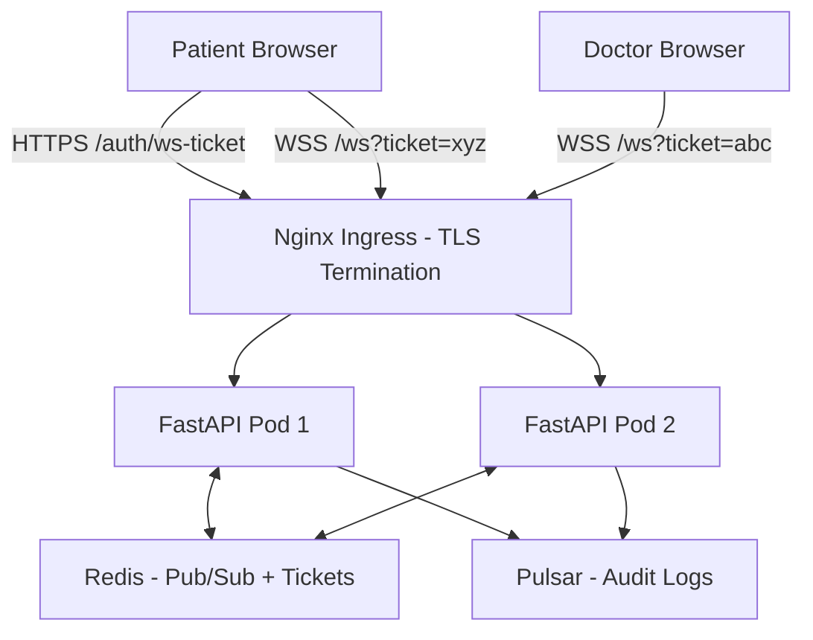
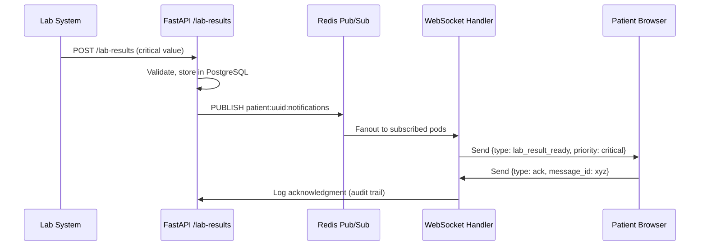
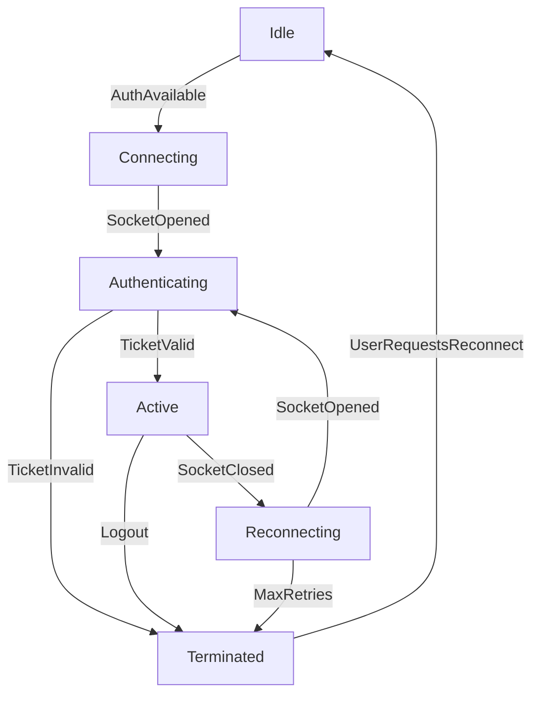

# WebSocket Security for HealthHub

> **Healthcare-specific guide** for secure real-time notifications covering authentication, authorization, patient isolation, and critical medical alerts.

---

## Table of Contents

1. [Executive Summary](#executive-summary)
2. [Architecture Overview](#architecture-overview)
3. [Authentication & Authorization](#authentication--authorization)
4. [Connection State Machine](#connection-state-machine)
5. [Message Protocol](#message-protocol)
6. [Security Controls](#security-controls)
7. [Resilience Patterns](#resilience-patterns)
8. [Anti-Patterns](#anti-patterns)
9. [Cross-References](#cross-references)

---

## Executive Summary

### Architecture Decisions

**Native WebSocket over Socket.IO**:
- Standards-compliant (RFC 6455)
- Lower overhead (~1KB per connection vs ~5KB)
- Direct browser support without client library
- Simpler debugging (DevTools Network tab)

**Redis Pub/Sub for Horizontal Scaling**:
- Stateless FastAPI pods (no sticky sessions)
- Fanout to all subscribed clients across instances
- Low latency (<10ms local delivery)
- Self-healing with TTL on coordination keys

**One-Time Tickets for Authentication**:
- Separate credential flow from WebSocket upgrade
- 60-second expiry prevents replay attacks
- Redis GETDEL ensures single use
- JWT signature validation before consumption

### Top Security Controls

1. **One-time WS ticket** (exp≤60s, Redis GETDEL) - prevents replay
2. **Patient channel isolation** (server-side authorization) - prevents cross-patient access
3. **TLS requirement** (wss:// mandatory) - PHI transmission security
4. **CSP enforcement** (connect-src wss://healthhub.example.com) - prevents data exfiltration
5. **Origin validation** (FastAPI middleware) - blocks unauthorized domains
6. **Rate limiting** (per-connection, per-user) - prevents notification spam

### Healthcare-Specific Features

**Critical Alert Priority**:
- Lab results with critical values: PRIORITY=CRITICAL
- Urgent appointments: PRIORITY=URGENT
- Normal notifications: PRIORITY=NORMAL

**Patient Safety Requirements**:
- Critical lab results: delivery guarantee with acknowledgment
- Appointment reminders: duplicate prevention (idempotency)
- Prescription notifications: medication interaction warnings

**HIPAA Compliance**:
- §164.312(e)(1) Transmission Security: TLS 1.2+ required (wss://)
- §164.312(a)(1) Access Control: Patient channel isolation
- §164.312(b) Audit Controls: Connection events logged to Pulsar

---

## Architecture Overview

### System Components



**Component Responsibilities**:

| Component | Responsibility |
|-----------|----------------|
| **FastAPI WebSocket Endpoint** (`/ws`) | Connection upgrade, ticket validation, state management |
| **Redis Pub/Sub** | Message fanout to all subscribed clients across pods |
| **Redis Tickets Store** | One-time ticket storage (60s TTL, GETDEL consumption) |
| **Pulsar Audit Log** | Connection events (connect, subscribe, disconnect) |
| **WebSocketHandler** | Per-connection lifecycle (authenticate → subscribe → deliver) |

### Data Flow: Critical Lab Result



**Key Properties**:
- Atomic publish (lab result + notification)
- Priority=CRITICAL triggers visual/audio alert
- Acknowledgment required for critical messages
- Audit trail for compliance (delivery time tracking)

---

## Authentication & Authorization

### One-Time Ticket Flow

**Step 1: Generate Ticket (REST API)**

```python
from fastapi import APIRouter, Depends, HTTPException
from effectful.domain import PatientAuthorized, DoctorAuthorized
from backend.app.auth_deps import require_authenticated
import jwt
import secrets
from datetime import datetime, timedelta, UTC

router = APIRouter()

@router.post("/auth/ws-ticket")
async def generate_ws_ticket(
    auth: PatientAuthorized | DoctorAuthorized = Depends(require_authenticated),
    redis: Redis = Depends(get_redis),
) -> dict[str, str]:
    """Generate one-time WebSocket authentication ticket.

    Security properties:
    - 60-second expiry (prevents long replay window)
    - Unique jti stored in Redis with user context
    - GETDEL ensures single use (atomic read+delete)
    """
    jti = secrets.token_urlsafe(32)

    # Store ticket in Redis with user context
    ticket_key = f"ws:ticket:{jti}"
    ticket_data = {
        "user_id": str(auth.user_id),
        "role": auth.role,  # "patient" or "doctor"
        "patient_id": str(auth.patient_id) if isinstance(auth, PatientAuthorized) else None,
        "doctor_id": str(auth.doctor_id) if isinstance(auth, DoctorAuthorized) else None,
    }

    await redis.set(
        ticket_key,
        json.dumps(ticket_data),
        ex=60  # 60-second TTL
    )

    # Create JWT ticket
    ticket_jwt = jwt.encode(
        {
            "jti": jti,
            "aud": "ws",  # audience: WebSocket only
            "exp": datetime.now(UTC) + timedelta(seconds=60),
            "user_id": str(auth.user_id),
        },
        settings.JWT_SECRET,
        algorithm="HS256"
    )

    return {"ticket": ticket_jwt}
```

**Step 2: Validate Ticket (WebSocket Connection)**

```python
from fastapi import WebSocket, WebSocketDisconnect
from redis.asyncio import Redis

async def authenticate_websocket(
    websocket: WebSocket,
    ticket_jwt: str,
    redis: Redis,
) -> PatientAuthorized | DoctorAuthorized | None:
    """Validate and consume one-time WebSocket ticket.

    Returns:
        Authorization state if valid, None if invalid.
    """
    # 1. Verify JWT signature and expiry
    try:
        payload = jwt.decode(
            ticket_jwt,
            settings.JWT_SECRET,
            algorithms=["HS256"],
            audience="ws"
        )
    except jwt.InvalidTokenError:
        await websocket.close(code=4401, reason="Invalid ticket")
        return None

    jti = payload["jti"]

    # 2. Consume ticket from Redis (GETDEL = atomic read+delete)
    ticket_key = f"ws:ticket:{jti}"
    ticket_data_str = await redis.getdel(ticket_key)

    if not ticket_data_str:
        # Ticket already used or expired
        await websocket.close(code=4401, reason="Ticket consumed or expired")
        return None

    ticket_data = json.loads(ticket_data_str)

    # 3. Reconstruct authorization state
    if ticket_data["role"] == "patient":
        return PatientAuthorized(
            user_id=UUID(ticket_data["user_id"]),
            patient_id=UUID(ticket_data["patient_id"]),
            email="",  # Not needed for WebSocket
            role="patient"
        )
    else:  # doctor
        return DoctorAuthorized(
            user_id=UUID(ticket_data["user_id"]),
            doctor_id=UUID(ticket_data["doctor_id"]),
            email="",
            specialization="",  # Fetch from DB if needed
            can_prescribe=True,  # Fetch from DB if needed
            role="doctor"
        )
```

**Security Properties**:

| Property | Implementation | Threat Mitigated |
|----------|----------------|------------------|
| **Single-use** | Redis GETDEL (atomic) | Replay attacks |
| **Short-lived** | 60s expiry | Stolen ticket window |
| **Signature validation** | JWT HS256 | Token forgery |
| **Audience restriction** | aud="ws" | Token misuse (access token used for WS) |
| **User context** | Redis stores role, patient_id | Authorization decision |

### Channel Authorization

**Channel Naming Convention**:

```
{entity_type}:{entity_id}:{stream}

Examples:
- patient:550e8400-e29b-41d4-a716-446655440000:notifications
- doctor:123e4567-e89b-12d3-a456-426614174000:notifications
- system:critical_alerts (admin-only)
```

**Authorization Matrix**:

| User Role | Allowed Channels |
|-----------|------------------|
| **Patient** | `patient:{own_patient_id}:notifications` ONLY |
| **Doctor** | `doctor:{own_doctor_id}:notifications` ONLY |
| **Admin** | All channels (including `system:*`) |

**Authorization Enforcement**:

```python
async def authorize_channel_subscription(
    channel: str,
    auth: PatientAuthorized | DoctorAuthorized,
) -> bool:
    """Server-side channel authorization.

    CRITICAL: This check prevents cross-patient data access.
    """
    parts = channel.split(":")

    if len(parts) < 2:
        return False  # Invalid channel format

    entity_type = parts[0]
    entity_id_str = parts[1]

    match auth:
        case PatientAuthorized(patient_id=patient_id):
            # Patient can ONLY subscribe to own notifications
            return (
                entity_type == "patient"
                and entity_id_str == str(patient_id)
            )

        case DoctorAuthorized(doctor_id=doctor_id):
            # Doctor can ONLY subscribe to own notifications
            return (
                entity_type == "doctor"
                and entity_id_str == str(doctor_id)
            )

        case AdminAuthorized():
            # Admin can subscribe to all channels
            return True

        case Unauthorized():
            return False
```

**HIPAA Compliance**: This server-side authorization implements §164.312(a)(1) Access Control - "Implement technical policies and procedures that allow only authorized persons to access electronic protected health information."

---

## Connection State Machine

### State Definitions

```python
from dataclasses import dataclass
from datetime import datetime
from typing import Literal
from uuid import UUID

@dataclass(frozen=True)
class Idle:
    """No connection established."""
    reason: Literal["NotInitialized", "NoAuth"]

@dataclass(frozen=True)
class Connecting:
    """WebSocket connection in progress."""
    attempt: int
    started_at: datetime

@dataclass(frozen=True)
class Authenticating:
    """Connection established, awaiting ticket validation."""
    connected_at: datetime

@dataclass(frozen=True)
class Active:
    """Authenticated and ready to receive messages."""
    user_id: UUID
    connection_id: str
    authenticated_at: datetime
    role: Literal["patient", "doctor", "admin"]

@dataclass(frozen=True)
class Reconnecting:
    """Connection lost, attempting to reconnect."""
    attempt: int
    previous_connection_id: str
    reason: str
    backoff_seconds: int

@dataclass(frozen=True)
class Terminated:
    """Connection permanently closed."""
    reason: Literal["UserLogout", "ServerClose", "AuthFailure", "MaxRetriesExceeded"]
    terminated_at: datetime

type ConnectionState = (
    Idle
    | Connecting
    | Authenticating
    | Active
    | Reconnecting
    | Terminated
)
```

### State Transitions



**State Transition Rules**:

1. **Idle → Connecting**: User has access token, WebSocket URL available
2. **Connecting → Authenticating**: TCP handshake complete, WebSocket upgrade successful
3. **Authenticating → Active**: Ticket validated, user context loaded
4. **Authenticating → Terminated**: Ticket invalid/expired/consumed (4401 close code)
5. **Active → Reconnecting**: Connection lost (network failure, server restart)
6. **Active → Terminated**: User logout, server close (maintenance)
7. **Reconnecting → Authenticating**: Backoff complete, new connection established
8. **Reconnecting → Terminated**: Max retries exceeded (5 attempts)

**Illegal Transitions** (prevented by ADT):
- ❌ Idle → Active (must authenticate first)
- ❌ Authenticating → Reconnecting (not yet active)
- ❌ Terminated → Active (must restart from Idle)

---

## Message Protocol

### Message Type Summary

**Client → Server** (4 types):
- `auth` - Send one-time ticket for authentication
- `ping` - Heartbeat keepalive
- `subscribe` - Subscribe to notification channel
- `unsubscribe` - Unsubscribe from channel

**Server → Client** (6 types):
- `authenticated` - Authentication successful
- `error` - Error response (invalid request, unauthorized, etc.)
- `pong` - Heartbeat response
- `subscribed` - Subscription confirmed
- `unsubscribed` - Unsubscription confirmed
- `notification` - Medical event notification

### Client to Server Messages

#### AuthMessage

```typescript
{
  "type": "auth",
  "token": "eyJhbGciOiJIUzI1NiIsInR5cCI6IkpXVCJ9..."
}
```

Sent immediately after WebSocket connection opens. Token is one-time ticket from `/auth/ws-ticket` endpoint.

#### PingMessage

```typescript
{
  "type": "ping"
}
```

Sent every 30 seconds to detect dead connections. Server responds with `pong`.

#### SubscribeMessage

```typescript
{
  "type": "subscribe",
  "channel": "patient:550e8400-e29b-41d4-a716-446655440000:notifications"
}
```

Request to subscribe to notification channel. Server validates authorization before confirming.

#### UnsubscribeMessage

```typescript
{
  "type": "unsubscribe",
  "channel": "patient:550e8400-e29b-41d4-a716-446655440000:notifications"
}
```

Request to unsubscribe from channel. Always succeeds (no authorization check needed).

### Server to Client Messages

#### AuthenticatedMessage

```typescript
{
  "type": "authenticated",
  "user_id": "550e8400-e29b-41d4-a716-446655440000",
  "connection_id": "conn_abc123",
  "role": "patient"
}
```

Sent after successful ticket validation. Client should store `connection_id` for debugging.

#### ErrorMessage

```typescript
{
  "type": "error",
  "code": "UNAUTHORIZED_CHANNEL",
  "message": "You are not authorized to subscribe to this channel"
}
```

**Error Codes**:

| Code | Description | Action |
|------|-------------|--------|
| `AUTHENTICATION_REQUIRED` | Must authenticate before subscribing | Send `auth` message |
| `AUTHENTICATION_FAILED` | Invalid or expired ticket | Request new ticket |
| `INVALID_MESSAGE_FORMAT` | Malformed JSON or missing fields | Fix client code |
| `SUBSCRIPTION_FAILED` | Channel subscription failed | Check channel name |
| `UNAUTHORIZED_CHANNEL` | Not authorized to access channel | Check authorization |
| `RATE_LIMIT_EXCEEDED` | Too many requests | Implement backoff |
| `INTERNAL_ERROR` | Server-side error | Retry with backoff |

#### PongMessage

```typescript
{
  "type": "pong",
  "timestamp": "2025-11-27T12:34:56.789Z"
}
```

Response to `ping` message. Client should track round-trip time for latency monitoring.

#### SubscribedMessage

```typescript
{
  "type": "subscribed",
  "channel": "patient:550e8400-e29b-41d4-a716-446655440000:notifications"
}
```

Confirms successful subscription. Client can now receive notifications on this channel.

#### UnsubscribedMessage

```typescript
{
  "type": "unsubscribed",
  "channel": "patient:550e8400-e29b-41d4-a716-446655440000:notifications"
}
```

Confirms successful unsubscription. No more notifications will be received on this channel.

#### NotificationMessage (Medical Events)

**Appointment Updated**:

```typescript
{
  "type": "notification",
  "event": "appointment_updated",
  "priority": "normal",
  "payload": {
    "appointment_id": "550e8400-e29b-41d4-a716-446655440000",
    "old_status": "requested",
    "new_status": "confirmed",
    "scheduled_time": "2025-12-01T10:00:00Z",
    "doctor_name": "Dr. Sarah Johnson",
    "specialization": "cardiology"
  },
  "timestamp": "2025-11-27T12:34:56.789Z"
}
```

**Lab Result Ready** (CRITICAL):

```typescript
{
  "type": "notification",
  "event": "lab_result_ready",
  "priority": "critical",  // Critical value detected
  "payload": {
    "lab_result_id": "123e4567-e89b-12d3-a456-426614174000",
    "test_type": "blood_glucose",
    "status": "reviewed",
    "critical_flag": true,
    "message": "Critical value detected - immediate attention required",
    "reviewed_by": "Dr. Sarah Johnson"
  },
  "timestamp": "2025-11-27T12:34:56.789Z",
  "requires_ack": true  // Client must send acknowledgment
}
```

**Prescription Created**:

```typescript
{
  "type": "notification",
  "event": "prescription_created",
  "priority": "normal",
  "payload": {
    "prescription_id": "789e0123-e45b-67d8-a901-234567890abc",
    "medication_name": "Lisinopril",
    "dosage": "10mg",
    "frequency": "once daily",
    "doctor_name": "Dr. Sarah Johnson",
    "pharmacy_instructions": "Take with food"
  },
  "timestamp": "2025-11-27T12:34:56.789Z"
}
```

**Billing Invoice Ready**:

```typescript
{
  "type": "notification",
  "event": "billing_invoice_ready",
  "priority": "normal",
  "payload": {
    "invoice_id": "inv_550e8400",
    "amount": 150.00,
    "currency": "USD",
    "due_date": "2025-12-15",
    "services": [
      "Annual physical examination",
      "Blood work - comprehensive panel"
    ]
  },
  "timestamp": "2025-11-27T12:34:56.789Z"
}
```

**Priority Levels**:

| Priority | Use Case | Client Behavior |
|----------|----------|----------------|
| `normal` | Routine notifications (appointments, invoices) | Show notification badge |
| `urgent` | Appointment reminders (<24h), prescription updates | Show popup notification |
| `critical` | Lab results with critical values | Visual + audio alert, require acknowledgment |

**Acknowledgment Protocol** (Critical Messages):

```typescript
// Client sends acknowledgment for critical messages
{
  "type": "ack",
  "event_id": "lab_result_ready:123e4567-e89b-12d3-a456-426614174000",
  "timestamp": "2025-11-27T12:34:57.000Z"
}
```

Server logs acknowledgment to Pulsar for audit trail (delivery time tracking).

---

## Security Controls

### Defense-in-Depth Strategy

**Layer 1: Transport Security**
- TLS 1.2+ required (wss:// protocol)
- Certificate validation enforced
- No fallback to unencrypted ws://

**Layer 2: Origin Validation**
- Allowed origins: `https://healthhub.example.com`, `https://app.healthhub.example.com`
- Reject WebSocket upgrades from unknown origins
- Implemented in FastAPI middleware

**Layer 3: Authentication**
- One-time ticket with 60s expiry
- Redis GETDEL for single-use enforcement
- JWT signature validation

**Layer 4: Authorization**
- Server-side channel authorization (patient isolation)
- ADT pattern matching for authorization decisions
- Deny by default on any check failure

**Layer 5: Rate Limiting**
- Per-connection: 10 messages/second
- Per-user: 100 messages/minute
- Global: 10,000 messages/second (instance limit)

**Layer 6: Content Security Policy**
- `connect-src 'self' wss://healthhub.example.com;`
- Prevents data exfiltration to unauthorized domains
- Blocks XSS-based WebSocket attacks

### CSP Configuration

```http
Content-Security-Policy:
  default-src 'self';
  script-src 'self';
  style-src 'self';
  img-src 'self' data:;
  connect-src 'self' https://healthhub.example.com wss://healthhub.example.com;
  object-src 'none';
  frame-ancestors 'none';
  form-action 'self';
  base-uri 'self';
```

**Critical**: Always include `wss://` in `connect-src`. Missing this blocks WebSocket connections.

### Rate Limiting Implementation

```python
from collections import defaultdict
from datetime import datetime, timedelta, UTC
from asyncio import Lock

class WebSocketRateLimiter:
    """Rate limiter for WebSocket messages (in-memory per-pod)."""

    def __init__(self) -> None:
        self.per_connection_limit = 10  # messages per second
        self.per_user_limit = 100  # messages per minute
        self.connection_counts: dict[str, list[datetime]] = defaultdict(list)
        self.user_counts: dict[UUID, list[datetime]] = defaultdict(list)
        self.lock = Lock()

    async def check_rate_limit(
        self,
        connection_id: str,
        user_id: UUID,
    ) -> bool:
        """Check if message is within rate limits.

        Returns:
            True if allowed, False if rate limit exceeded.
        """
        async with self.lock:
            now = datetime.now(UTC)

            # Per-connection rate limit (10 msg/sec)
            self.connection_counts[connection_id] = tuple(
                ts for ts in self.connection_counts[connection_id]
                if now - ts < timedelta(seconds=1)
            )

            if len(self.connection_counts[connection_id]) >= self.per_connection_limit:
                return False

            # Per-user rate limit (100 msg/min)
            self.user_counts[user_id] = tuple(
                ts for ts in self.user_counts[user_id]
                if now - ts < timedelta(minutes=1)
            )

            if len(self.user_counts[user_id]) >= self.per_user_limit:
                return False

            # Record this message
            self.connection_counts[connection_id].append(now)
            self.user_counts[user_id].append(now)

            return True
```

**HIPAA Compliance**: Rate limiting prevents brute-force attacks on patient data access, supporting §164.312(a)(1) Access Control.

---

## Resilience Patterns

### Heartbeat Implementation

**Client-side** (JavaScript):

```typescript
class HealthHubWebSocket {
  private ws: WebSocket | null = null
  private heartbeatInterval: number | null = null
  private lastPongTime: Date | null = null

  connect(ticket: string): void {
    this.ws = new WebSocket(`wss://healthhub.example.com/ws?ticket=${ticket}`)

    this.ws.onopen = () => {
      this.startHeartbeat()
    }

    this.ws.onmessage = (event) => {
      const message = JSON.parse(event.data)

      if (message.type === 'pong') {
        this.lastPongTime = new Date()
      }
    }

    this.ws.onclose = () => {
      this.stopHeartbeat()
      this.reconnect()
    }
  }

  private startHeartbeat(): void {
    this.heartbeatInterval = window.setInterval(() => {
      if (this.ws?.readyState === WebSocket.OPEN) {
        this.ws.send(JSON.stringify({ type: 'ping' }))

        // Check if pong received within 5 seconds
        setTimeout(() => {
          if (this.lastPongTime && new Date().getTime() - this.lastPongTime.getTime() > 5000) {
            // No pong received - connection dead
            this.ws?.close()
          }
        }, 5000)
      }
    }, 30000)  // Ping every 30 seconds
  }

  private stopHeartbeat(): void {
    if (this.heartbeatInterval) {
      clearInterval(this.heartbeatInterval)
      this.heartbeatInterval = null
    }
  }
}
```

**Server-side** (Python):

```python
async def handle_ping(websocket: WebSocket) -> None:
    """Respond to ping with pong."""
    await websocket.send_json({
        "type": "pong",
        "timestamp": datetime.now(UTC).isoformat()
    })
```

### Reconnection with Exponential Backoff

```typescript
class HealthHubWebSocket {
  private reconnectAttempts = 0
  private maxReconnectAttempts = 5
  private baseBackoffMs = 1000  // 1 second

  private reconnect(): void {
    if (this.reconnectAttempts >= this.maxReconnectAttempts) {
      console.error('Max reconnection attempts exceeded')
      this.onTerminated('MaxRetriesExceeded')
      return
    }

    this.reconnectAttempts++

    // Exponential backoff with jitter: 1s, 2s, 4s, 8s, 16s
    const backoffMs = Math.min(
      this.baseBackoffMs * Math.pow(2, this.reconnectAttempts - 1),
      30000  // Max 30 seconds
    )

    // Add jitter (±20%)
    const jitter = backoffMs * 0.2 * (Math.random() - 0.5)
    const delayMs = backoffMs + jitter

    console.log(`Reconnecting in ${delayMs}ms (attempt ${this.reconnectAttempts})`)

    setTimeout(() => {
      this.getNewTicketAndConnect()
    }, delayMs)
  }

  private async getNewTicketAndConnect(): Promise<void> {
    try {
      // Get new one-time ticket
      const response = await fetch('/api/auth/ws-ticket', {
        method: 'POST',
        headers: {
          'Authorization': `Bearer ${this.accessToken}`
        }
      })

      const { ticket } = await response.json()

      // Connect with new ticket
      this.connect(ticket)

      // Reset attempt counter on success
      this.reconnectAttempts = 0
    } catch (error) {
      console.error('Failed to get new ticket:', error)
      this.reconnect()  // Try again
    }
  }
}
```

### Subscription Recovery

```typescript
class HealthHubWebSocket {
  private subscriptions: Set<string> = new Set()

  subscribe(channel: string, callback: (payload: any) => void): void {
    // Store subscription for recovery
    this.subscriptions.add(channel)

    // Send subscribe message
    this.ws?.send(JSON.stringify({
      type: 'subscribe',
      channel
    }))

    // Register callback
    this.callbacks.set(channel, callback)
  }

  private async onAuthenticated(): Promise<void> {
    // Re-subscribe to all channels after reconnection
    for (const channel of this.subscriptions) {
      this.ws?.send(JSON.stringify({
        type: 'subscribe',
        channel
      }))
    }
  }
}
```

### Critical Message Acknowledgment

```typescript
private handleNotification(message: NotificationMessage): void {
  // Show notification to user
  this.displayNotification(message)

  // Send acknowledgment for critical messages
  if (message.requires_ack) {
    this.ws?.send(JSON.stringify({
      type: 'ack',
      event_id: `${message.event}:${message.payload.lab_result_id}`,
      timestamp: new Date().toISOString()
    }))
  }

  // Trigger audio alert for critical priority
  if (message.priority === 'critical') {
    this.playAudioAlert()
  }
}
```

---

## Anti-Patterns

### ❌ Anti-Pattern 1: No Ticket Validation

**Problem**: Accepting WebSocket connections without validating one-time ticket.

```python
# ❌ WRONG - No authentication
@app.websocket("/ws")
async def websocket_endpoint(websocket: WebSocket):
    await websocket.accept()  # Anyone can connect!

    while True:
        data = await websocket.receive_text()
        await websocket.send_text(data)
```

**Fix**: Always validate ticket before accepting connection.

```python
# ✅ CORRECT - Ticket validation required
@app.websocket("/ws")
async def websocket_endpoint(
    websocket: WebSocket,
    ticket: str = Query(...),
    redis: Redis = Depends(get_redis)
):
    auth = await authenticate_websocket(websocket, ticket, redis)

    if not auth:
        return  # Connection closed with 4401

    await websocket.accept()
    # ... rest of handler
```

### ❌ Anti-Pattern 2: Client-Side Channel Authorization

**Problem**: Trusting client to check channel authorization.

```typescript
// ❌ WRONG - Client checks authorization
subscribe(channel: string): void {
  if (this.userRole === 'patient' && channel.startsWith(`patient:${this.userId}`)) {
    this.ws.send(JSON.stringify({ type: 'subscribe', channel }))
  } else {
    console.error('Not authorized')  // Client can bypass this!
  }
}
```

**Fix**: Server-side authorization always required.

```python
# ✅ CORRECT - Server enforces authorization
async def handle_subscribe(
    channel: str,
    auth: PatientAuthorized | DoctorAuthorized
) -> bool:
    if not authorize_channel_subscription(channel, auth):
        await websocket.send_json({
            "type": "error",
            "code": "UNAUTHORIZED_CHANNEL",
            "message": "You are not authorized to subscribe to this channel"
        })
        return False

    # Subscribe to Redis pub/sub
    await redis_pubsub.subscribe(channel)
    return True
```

### ❌ Anti-Pattern 3: Missing Heartbeat

**Problem**: Not detecting dead connections.

```typescript
// ❌ WRONG - No heartbeat
connect(ticket: string): void {
  this.ws = new WebSocket(`wss://healthhub.example.com/ws?ticket=${ticket}`)
  // Connection may be dead for minutes before client realizes
}
```

**Fix**: Implement ping/pong heartbeat.

```typescript
// ✅ CORRECT - Heartbeat every 30 seconds
private startHeartbeat(): void {
  this.heartbeatInterval = setInterval(() => {
    this.ws?.send(JSON.stringify({ type: 'ping' }))
  }, 30000)
}
```

### ❌ Anti-Pattern 4: No Reconnection Logic

**Problem**: Giving up after first connection failure.

```typescript
// ❌ WRONG - No reconnection
this.ws.onclose = () => {
  console.error('Connection closed')  // User stuck!
}
```

**Fix**: Exponential backoff reconnection.

```typescript
// ✅ CORRECT - Auto-reconnect with backoff
this.ws.onclose = () => {
  this.reconnect()  // Implements exponential backoff
}
```

### ❌ Anti-Pattern 5: PHI in Metric Labels

**Problem**: Exposing patient identifiers in Prometheus metrics.

```python
# ❌ WRONG - PHI in labels
NOTIFICATIONS_SENT = Counter(
    "websocket_notifications_sent_total",
    "Notifications sent via WebSocket",
    ["patient_id", "event_type"]  # patient_id is PHI!
)

# This creates: websocket_notifications_sent_total{patient_id="550e...",event_type="lab_result"}
```

**Fix**: Only aggregate statistics, no PHI.

```python
# ✅ CORRECT - No PHI in labels
NOTIFICATIONS_SENT = Counter(
    "websocket_notifications_sent_total",
    "Notifications sent via WebSocket",
    ["event_type", "priority"]  # Aggregate only
)

# This creates: websocket_notifications_sent_total{event_type="lab_result",priority="critical"}
```

---

## Cross-References

### HealthHub Documents

**Security**:
- [Security Hardening](security_hardening.md) - JWT authentication, CSRF protection, rate limiting
- [Authorization Patterns](authorization_patterns.md) - ADT-based authorization, pattern matching

**Observability**:
- [Monitoring & Observability](monitoring_observability.md) - WebSocket connection metrics, message rate tracking

**Implementation**:
- [../product/notification_system.md](../product/notification_system.md) - WebSocket implementation details
- [../product/architecture_overview.md](../product/architecture_overview.md) - System architecture

**Compliance**:
- [../domain/hipaa_compliance.md](../domain/hipaa_compliance.md) - HIPAA Security Rule requirements

### HIPAA Security Rule Mapping

| HIPAA Requirement | Implementation |
|-------------------|----------------|
| **§164.312(e)(1) Transmission Security** | TLS 1.2+ (wss://), certificate validation |
| **§164.312(a)(1) Access Control** | One-time tickets, server-side channel authorization |
| **§164.312(b) Audit Controls** | Connection events logged to Pulsar (connect, subscribe, disconnect) |

---

**Last Updated**: November 2025
**Version**: 1.0
