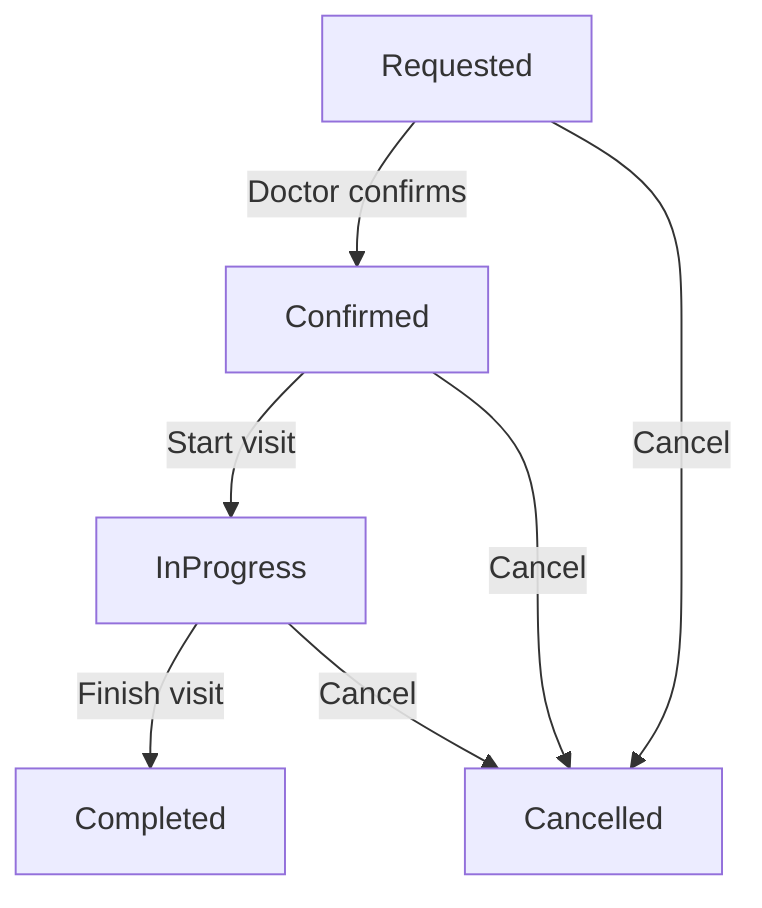

# Appointment State Machine

> Extends base [Documentation Standards](../../../../documents/documentation_standards.md) and [Architecture](../../../../documents/engineering/architecture.md); base rules apply. HealthHub-specific appointment state machine deltas only.

---

## Overview

Appointments in HealthHub follow a finite state machine with five states. The ADT pattern ensures only valid transitions are allowed.

**Location**: `backend/app/domain/appointment.py`

---

## State Diagram



---

## Status Types

### AppointmentStatus ADT

```python
type AppointmentStatus = (
    Requested
    | Confirmed
    | InProgress
    | Completed
    | Cancelled
)
```

Each status variant carries contextual data specific to that state.

---

### Requested

Initial status when patient requests an appointment.

```python
@dataclass(frozen=True)
class Requested:
    """Patient requested appointment, awaiting doctor confirmation."""
    requested_at: datetime
```

| Field | Type | Description |
|-------|------|-------------|
| requested_at | datetime | When request was made |

**Allowed Transitions**: Confirmed, Cancelled

---

### Confirmed

Doctor has confirmed the appointment with a scheduled time.

```python
@dataclass(frozen=True)
class Confirmed:
    """Doctor confirmed appointment with scheduled time."""
    confirmed_at: datetime
    scheduled_time: datetime
```

| Field | Type | Description |
|-------|------|-------------|
| confirmed_at | datetime | When doctor confirmed |
| scheduled_time | datetime | Scheduled appointment time |

**Allowed Transitions**: InProgress, Cancelled

---

### InProgress

Appointment is currently happening.

```python
@dataclass(frozen=True)
class InProgress:
    """Appointment currently happening."""
    started_at: datetime
```

| Field | Type | Description |
|-------|------|-------------|
| started_at | datetime | When visit started |

**Allowed Transitions**: Completed, Cancelled

---

### Completed

Appointment finished successfully.

```python
@dataclass(frozen=True)
class Completed:
    """Appointment finished with notes."""
    completed_at: datetime
    notes: str
```

| Field | Type | Description |
|-------|------|-------------|
| completed_at | datetime | When visit finished |
| notes | str | Doctor's visit notes |

**Terminal State**: No further transitions allowed.

---

### Cancelled

Appointment was cancelled.

```python
@dataclass(frozen=True)
class Cancelled:
    """Appointment cancelled by patient, doctor, or system."""
    cancelled_at: datetime
    cancelled_by: Literal["patient", "doctor", "system"]
    reason: str
```

| Field | Type | Description |
|-------|------|-------------|
| cancelled_at | datetime | When cancelled |
| cancelled_by | Literal | Who cancelled |
| reason | str | Cancellation reason |

**Terminal State**: No further transitions allowed.

---

## Transition Validation

### TransitionResult ADT

```python
type TransitionResult = TransitionSuccess | TransitionInvalid
```

```python
@dataclass(frozen=True)
class TransitionSuccess:
    """Valid state transition."""
    new_status: AppointmentStatus

@dataclass(frozen=True)
class TransitionInvalid:
    """Invalid state transition."""
    current_status: str
    attempted_status: str
    reason: str
```

---

### validate_transition Function

```python
def validate_transition(
    current: AppointmentStatus, new: AppointmentStatus
) -> TransitionResult:
    """Validate appointment state transition.

    Valid transitions:
    - Requested -> Confirmed
    - Requested -> Cancelled
    - Confirmed -> InProgress
    - Confirmed -> Cancelled
    - InProgress -> Completed
    - InProgress -> Cancelled
    """
    match (current, new):
        # From Requested
        case (Requested(), Confirmed()):
            return TransitionSuccess(new_status=new)
        case (Requested(), Cancelled()):
            return TransitionSuccess(new_status=new)

        # From Confirmed
        case (Confirmed(), InProgress()):
            return TransitionSuccess(new_status=new)
        case (Confirmed(), Cancelled()):
            return TransitionSuccess(new_status=new)

        # From InProgress
        case (InProgress(), Completed()):
            return TransitionSuccess(new_status=new)
        case (InProgress(), Cancelled()):
            return TransitionSuccess(new_status=new)

        # Invalid transitions
        case _:
            current_name = type(current).__name__
            new_name = type(new).__name__
            return TransitionInvalid(
                current_status=current_name,
                attempted_status=new_name,
                reason=f"Cannot transition from {current_name} to {new_name}",
            )
```

---

## Transition Matrix

| From/To | Requested | Confirmed | InProgress | Completed | Cancelled |
|---------|-----------|-----------|------------|-----------|-----------|
| Requested | - | Valid | Invalid | Invalid | Valid |
| Confirmed | Invalid | - | Valid | Invalid | Valid |
| InProgress | Invalid | Invalid | - | Valid | Valid |
| Completed | Invalid | Invalid | Invalid | - | Invalid |
| Cancelled | Invalid | Invalid | Invalid | Invalid | - |

---

## Effect Program Usage

### Scheduling an Appointment

```python
def schedule_appointment_program(
    patient_id: UUID,
    doctor_id: UUID,
    requested_time: datetime | None,
    reason: str,
    actor_id: UUID,
) -> Generator[AllEffects, object, Appointment | None]:
    # Verify patient exists
    patient = yield GetPatientById(patient_id=patient_id)
    if not isinstance(patient, Patient):
        return None

    # Verify doctor exists
    doctor = yield GetDoctorById(doctor_id=doctor_id)
    if not isinstance(doctor, Doctor):
        return None

    # Create appointment in Requested status
    appointment = yield CreateAppointment(
        patient_id=patient_id,
        doctor_id=doctor_id,
        requested_time=requested_time,
        reason=reason,
    )

    # Send notification to doctor
    yield PublishWebSocketNotification(
        channel=f"doctor:{doctor_id}:notifications",
        message={"type": "appointment_requested", ...},
        recipient_id=doctor_id,
    )

    return appointment
```

### Transitioning Status

```python
def transition_appointment_program(
    appointment_id: UUID,
    new_status: AppointmentStatus,
    actor_id: UUID,
) -> Generator[AllEffects, object, TransitionResult]:
    # Get current appointment
    appointment = yield GetAppointmentById(appointment_id=appointment_id)
    if not isinstance(appointment, Appointment):
        return TransitionInvalid(
            current_status=None,
            attempted_status=new_status,
            reason=f"Appointment {appointment_id} not found",
        )

    # Attempt transition (validates internally)
    result = yield TransitionAppointmentStatus(
        appointment_id=appointment_id,
        new_status=new_status,
        actor_id=actor_id,
    )

    # If successful, send notifications
    if isinstance(result, TransitionSuccess):
        yield PublishWebSocketNotification(...)
        yield LogAuditEvent(...)

    return result
```

---

## Testing State Transitions

### Valid Transitions

```python
def test_requested_to_confirmed() -> None:
    current = Requested(requested_at=datetime.now(UTC))
    new = Confirmed(
        confirmed_at=datetime.now(UTC),
        scheduled_time=datetime.now(UTC) + timedelta(days=1),
    )

    result = validate_transition(current, new)
    assert isinstance(result, TransitionSuccess)

def test_confirmed_to_in_progress() -> None:
    current = Confirmed(
        confirmed_at=datetime.now(UTC),
        scheduled_time=datetime.now(UTC),
    )
    new = InProgress(started_at=datetime.now(UTC))

    result = validate_transition(current, new)
    assert isinstance(result, TransitionSuccess)
```

### Invalid Transitions

```python
def test_requested_to_completed_invalid() -> None:
    current = Requested(requested_at=datetime.now(UTC))
    new = Completed(
        completed_at=datetime.now(UTC),
        notes="Visit notes",
    )

    result = validate_transition(current, new)
    assert isinstance(result, TransitionInvalid)
    assert "Cannot transition from Requested to Completed" in result.reason

def test_completed_to_cancelled_invalid() -> None:
    current = Completed(
        completed_at=datetime.now(UTC),
        notes="Visit notes",
    )
    new = Cancelled(
        cancelled_at=datetime.now(UTC),
        cancelled_by="patient",
        reason="Changed mind",
    )

    result = validate_transition(current, new)
    assert isinstance(result, TransitionInvalid)
```

---

## Pattern Matching Examples

### Display Status

```python
def format_status(status: AppointmentStatus) -> str:
    match status:
        case Requested(requested_at=ts):
            return f"Awaiting confirmation (requested {ts.date()})"

        case Confirmed(scheduled_time=ts):
            return f"Confirmed for {ts.strftime('%Y-%m-%d %H:%M')}"

        case InProgress(started_at=ts):
            return f"In progress (started {ts.strftime('%H:%M')})"

        case Completed(notes=notes):
            return f"Completed: {notes[:50]}..."

        case Cancelled(cancelled_by=by, reason=reason):
            return f"Cancelled by {by}: {reason}"
```

### Status-Specific Actions

```python
def get_available_actions(
    status: AppointmentStatus, is_doctor: bool
) -> list[str]:
    match status:
        case Requested():
            actions = ["cancel"]
            if is_doctor:
                actions.append("confirm")
            return actions

        case Confirmed():
            actions = ["cancel"]
            if is_doctor:
                actions.append("start")
            return actions

        case InProgress():
            actions = []
            if is_doctor:
                actions.extend(["complete", "cancel"])
            return actions

        case Completed() | Cancelled():
            return []  # No actions for terminal states
```

---

## Related Documentation

### Domain Knowledge
- [Appointment Workflows](../domain/appointment_workflows.md) - Healthcare domain requirements for appointment scheduling
- [Medical State Machines](../domain/medical_state_machines.md) - General medical workflow patterns

### Best Practices
- [State Machine Patterns](../engineering/effect_patterns.md#state-machines) - ADT-based state machine implementation patterns

### Product Documentation
- [Domain Models](domain_models.md) - Appointment entity structure
- [Effects Reference](effects_reference.md) - Appointment effects (CreateAppointment, UpdateAppointmentStatus, etc.)
- [API Reference](api_reference.md) - Appointment HTTP endpoints
- [Authorization System](authorization_system.md) - Role-based transition authority (doctor-only transitions)

---

**Last Updated**: 2025-11-26  
**Supersedes**: none  
**Referenced by**: ../README.md, ../engineering/effect_patterns.md#state-machines
**Maintainer**: HealthHub Team
