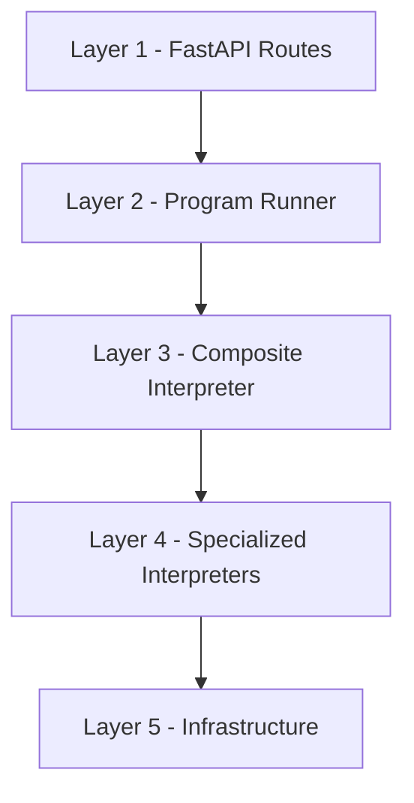
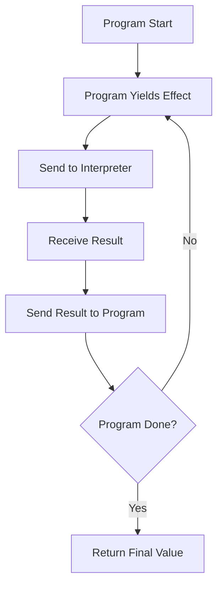
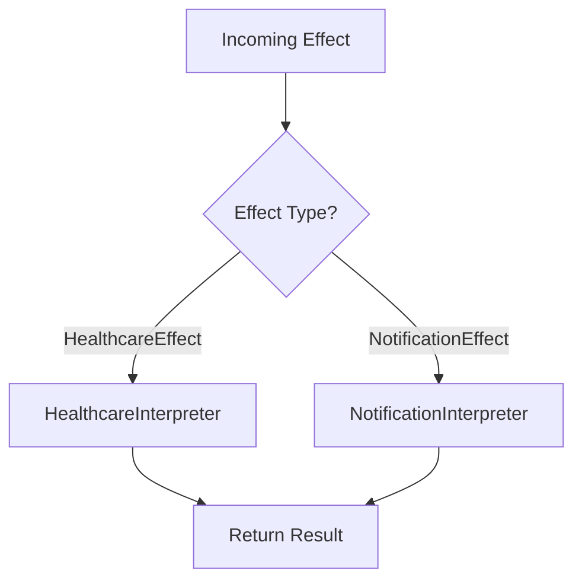
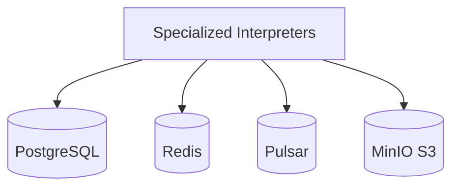
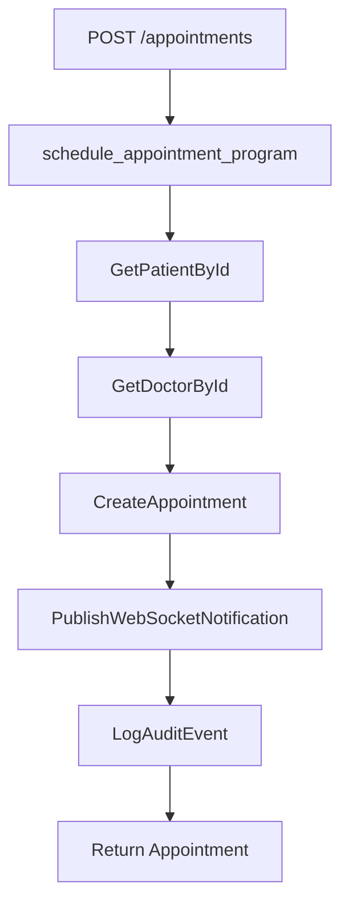

# HealthHub Architecture Overview

> 5-layer effect system architecture for healthcare management.

---

## High-Level Architecture

HealthHub implements a **pure functional effect system** built on the Effectful library. The architecture separates business logic (pure generators) from infrastructure (interpreters).



---

## Layer Details

### Layer 1: Application (FastAPI Routes)

Entry point for all HTTP requests. Routes receive requests, extract parameters, and invoke effect programs.

**Location**: `backend/app/api/`

**Responsibilities**:
- HTTP request/response handling
- JWT authentication validation
- Request parameter extraction
- Program invocation

**Example**: `backend/app/api/appointments.py`

```python
@router.post("/", response_model=AppointmentResponse)
async def create_appointment(
    request: CreateAppointmentRequest,
    current_user: AuthorizationState = Depends(get_current_user),
    interpreter: CompositeInterpreter = Depends(get_interpreter),
) -> AppointmentResponse:
    result = await run_program(
        schedule_appointment_program(
            patient_id=request.patient_id,
            doctor_id=request.doctor_id,
            requested_time=request.requested_time,
            reason=request.reason,
            actor_id=current_user.user_id,
        ),
        interpreter,
    )
    return AppointmentResponse.from_domain(result)
```

---

### Layer 2: Program Runner

The effect execution loop. Steps through generator-based programs, sending effects to interpreters and returning results.

**Location**: `backend/app/programs/runner.py`

**Responsibilities**:
- Generator protocol execution
- Effect-result exchange loop
- Program completion handling



**Implementation**:

```python
async def run_program(
    program: Generator[AllEffects, object, T],
    interpreter: CompositeInterpreter
) -> T:
    effect_result: object = None

    try:
        while True:
            effect = program.send(effect_result)
            effect_result = await interpreter.handle(effect)

    except StopIteration as stop:
        return stop.value
```

---

### Layer 3: Composite Interpreter

Routes effects to specialized interpreters based on effect type using pattern matching.

**Location**: `backend/app/interpreters/composite_interpreter.py`

**Responsibilities**:
- Effect type routing
- Interpreter coordination
- Infrastructure connection management



**Implementation**:

```python
async def handle(self, effect: AllEffects) -> object:
    match effect:
        case HealthcareEffect():
            return await self.healthcare_interpreter.handle(effect)

        case NotificationEffect():
            return await self.notification_interpreter.handle(effect)
```

---

### Layer 4: Specialized Interpreters

Execute effects against real infrastructure. Each interpreter handles a specific effect category.

**Location**: `backend/app/interpreters/`

| Interpreter | Effects Handled | Infrastructure |
|-------------|-----------------|----------------|
| HealthcareInterpreter | Patient, Doctor, Appointment, Prescription, Lab, Invoice | PostgreSQL |
| NotificationInterpreter | WebSocket publish, Audit logging | Redis pub/sub, PostgreSQL |

**HealthcareInterpreter Pattern**:

```python
async def handle(self, effect: HealthcareEffect) -> object:
    match effect:
        case GetPatientById(patient_id=pid):
            row = await self.pool.fetchrow(
                "SELECT * FROM patients WHERE id = $1", pid
            )
            return Patient.from_row(row) if row else None

        case CreateAppointment(patient_id=pid, doctor_id=did, ...):
            row = await self.pool.fetchrow(
                "INSERT INTO appointments (...) VALUES (...) RETURNING *",
                pid, did, ...
            )
            return Appointment.from_row(row)
```

---

### Layer 5: Infrastructure

Real infrastructure services accessed via interpreters.

**Location**: `backend/app/infrastructure/`, Docker services

| Service | Purpose | Port |
|---------|---------|------|
| PostgreSQL | Patient, appointment, prescription data | 5433 |
| Redis | WebSocket pub/sub, session cache | 6380 |
| Apache Pulsar | Durable message queue (async workflows) | 6651 |
| MinIO | S3-compatible document storage | 9001 |



---

## Effect Flow Example

Complete flow for scheduling an appointment:



**Program Code**:

```python
def schedule_appointment_program(
    patient_id: UUID,
    doctor_id: UUID,
    requested_time: datetime | None,
    reason: str,
    actor_id: UUID,
) -> Generator[AllEffects, object, Appointment | None]:
    # Step 1: Verify patient exists
    patient = yield GetPatientById(patient_id=patient_id)
    if not isinstance(patient, Patient):
        return None

    # Step 2: Verify doctor exists
    doctor = yield GetDoctorById(doctor_id=doctor_id)
    if not isinstance(doctor, Doctor):
        return None

    # Step 3: Create appointment
    appointment = yield CreateAppointment(
        patient_id=patient_id,
        doctor_id=doctor_id,
        requested_time=requested_time,
        reason=reason,
    )
    assert isinstance(appointment, Appointment)

    # Step 4: Notify doctor via WebSocket
    yield PublishWebSocketNotification(
        channel=f"doctor:{doctor_id}:notifications",
        message={"type": "appointment_requested", ...},
        recipient_id=doctor_id,
    )

    # Step 5: Log audit event
    yield LogAuditEvent(
        user_id=actor_id,
        action="create_appointment",
        resource_type="appointment",
        resource_id=appointment.id,
        ...
    )

    return appointment
```

---

## Key Architectural Benefits

### 1. Pure Business Logic

Programs are pure generators that yield effect descriptions. No I/O in business logic.

```python
# Pure - only yields descriptions
def process_lab_result(...) -> Generator[AllEffects, object, LabResult]:
    patient = yield GetPatientById(patient_id=patient_id)
    # ... pure logic ...
    result = yield CreateLabResult(...)
    return result
```

### 2. Testability

Programs can be tested by stepping through the generator without real infrastructure:

```python
def test_schedule_appointment() -> None:
    gen = schedule_appointment_program(patient_id, doctor_id, time, reason, actor)

    # First effect: GetPatientById
    effect1 = next(gen)
    assert isinstance(effect1, GetPatientById)
    assert effect1.patient_id == patient_id

    # Send mock patient, expect GetDoctorById
    effect2 = gen.send(mock_patient)
    assert isinstance(effect2, GetDoctorById)
```

### 3. Effect Composition

Programs can delegate to sub-programs using `yield from`:

```python
def complete_visit_program(...) -> Generator[AllEffects, object, Invoice]:
    # Delegate to transition program
    result = yield from transition_appointment_program(
        appointment_id, Completed(), actor_id
    )

    # Create invoice
    invoice = yield CreateInvoice(...)
    return invoice
```

### 4. Explicit Dependencies

All effects are explicit in the type signature:

```python
Generator[AllEffects, object, Appointment | None]
#         ^effects    ^results  ^return type
```

---

## Type Safety

All effects are immutable frozen dataclasses:

```python
@dataclass(frozen=True)
class GetPatientById:
    """Effect: Fetch patient by ID."""
    patient_id: UUID

@dataclass(frozen=True)
class CreateAppointment:
    """Effect: Create new appointment request."""
    patient_id: UUID
    doctor_id: UUID
    requested_time: datetime | None
    reason: str
```

Effect union type provides exhaustive pattern matching:

```python
type HealthcareEffect = (
    GetPatientById
    | GetDoctorById
    | CreateAppointment
    | GetAppointmentById
    | TransitionAppointmentStatus
    | CreatePrescription
    | CheckMedicationInteractions
    | CreateLabResult
    | GetLabResultById
    | CreateInvoice
)
```

---

## Related Documentation

### Best Practices
- [Effect Program Patterns](../engineering/effect_program_patterns.md) - How to write programs in Layer 1
- [Testing Doctrine](../engineering/testing_doctrine.md) - Testing strategy for each layer

### Product Documentation
- [Effects Reference](effects_reference.md) - Complete effect API (Layer 2)
- [Domain Models](domain_models.md) - Healthcare domain types (Layer 1)
- [Authorization System](authorization_system.md) - ADT-based authorization (Layer 1)
- [Appointment State Machine](appointment_state_machine.md) - State machine implementation (Layer 1)
- [Database Schema](database_schema.md) - Infrastructure layer (Layer 5)

---

**Last Updated**: 2025-11-26
**Maintainer**: HealthHub Team
