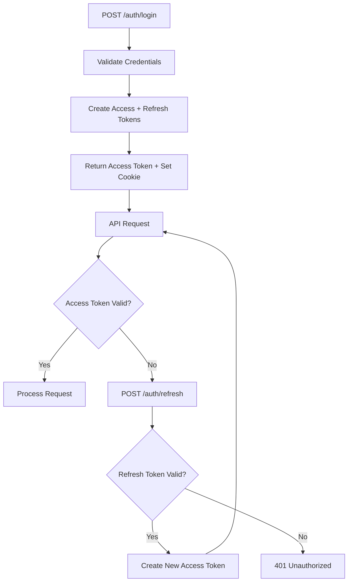

# Authentication System

> JWT dual-token authentication with access and refresh tokens.

---

## Overview

HealthHub uses a dual-token JWT authentication pattern:

| Token Type | Lifetime | Storage | Purpose |
|------------|----------|---------|---------|
| Access Token | 15 minutes | Authorization header | API authentication |
| Refresh Token | 7 days | HttpOnly cookie | Token renewal |

**Location**: `backend/app/auth/jwt.py`

---

## Token Flow



---

## Token Structure

### TokenData

Decoded JWT payload structure.

```python
@dataclass(frozen=True)
class TokenData:
    """Decoded JWT token data."""
    user_id: UUID
    email: str
    role: str
    token_type: TokenType
    exp: datetime
    iat: datetime
```

| Field | Type | Description |
|-------|------|-------------|
| user_id | UUID | User unique identifier |
| email | str | User email address |
| role | str | User role (patient, doctor, admin) |
| token_type | TokenType | ACCESS or REFRESH |
| exp | datetime | Expiration timestamp |
| iat | datetime | Issued-at timestamp |

### TokenType Enum

```python
class TokenType(str, Enum):
    ACCESS = "access"
    REFRESH = "refresh"
```

---

## Token Operations

### Create Access Token

```python
def create_access_token(user_id: UUID, email: str, role: str) -> str:
    """Create a short-lived JWT access token (15 minutes)."""
    now = datetime.now(timezone.utc)
    expires_delta = timedelta(minutes=settings.jwt_access_token_expire_minutes)
    expire = now + expires_delta

    payload = {
        "user_id": str(user_id),
        "email": email,
        "role": role,
        "token_type": TokenType.ACCESS.value,
        "exp": expire,
        "iat": now,
    }

    return jwt.encode(payload, settings.jwt_secret_key, algorithm=settings.jwt_algorithm)
```

### Create Refresh Token

```python
def create_refresh_token(user_id: UUID, email: str, role: str) -> str:
    """Create a long-lived JWT refresh token (7 days)."""
    now = datetime.now(timezone.utc)
    expires_delta = timedelta(days=settings.jwt_refresh_token_expire_days)
    expire = now + expires_delta

    payload = {
        "user_id": str(user_id),
        "email": email,
        "role": role,
        "token_type": TokenType.REFRESH.value,
        "exp": expire,
        "iat": now,
    }

    return jwt.encode(payload, settings.jwt_secret_key, algorithm=settings.jwt_algorithm)
```

---

## Token Validation

### TokenValidationResult ADT

```python
type TokenValidationResult = TokenValidationSuccess | TokenValidationError
```

```python
@dataclass(frozen=True)
class TokenValidationSuccess:
    """Successful token validation result."""
    token_data: TokenData

@dataclass(frozen=True)
class TokenValidationError:
    """Failed token validation result."""
    reason: Literal["expired", "invalid", "malformed"]
    detail: str
```

### verify_token Function

```python
def verify_token(token: str, expected_type: TokenType) -> TokenValidationResult:
    """Verify and decode a JWT token."""
    try:
        payload = jwt.decode(
            token,
            settings.jwt_secret_key,
            algorithms=[settings.jwt_algorithm],
        )

        token_type = payload.get("token_type")
        if token_type != expected_type.value:
            return TokenValidationError(
                reason="invalid",
                detail=f"Expected {expected_type.value} token, got {token_type}",
            )

        token_data = TokenData(
            user_id=UUID(payload["user_id"]),
            email=payload["email"],
            role=payload["role"],
            token_type=TokenType(token_type),
            exp=datetime.fromtimestamp(payload["exp"], tz=timezone.utc),
            iat=datetime.fromtimestamp(payload["iat"], tz=timezone.utc),
        )

        return TokenValidationSuccess(token_data=token_data)

    except jwt.ExpiredSignatureError:
        return TokenValidationError(reason="expired", detail="Token has expired")

    except (jwt.InvalidTokenError, jwt.DecodeError):
        return TokenValidationError(reason="invalid", detail="Invalid token signature")

    except (ValueError, KeyError) as e:
        return TokenValidationError(reason="malformed", detail=f"Malformed token payload: {e}")
```

---

## API Endpoints

### POST /auth/login

Authenticate user and receive tokens.

**Request**:
```json
{
    "email": "patient@example.com",
    "password": "secure_password"
}
```

**Response**:
```json
{
    "access_token": "eyJ0eXAiOiJKV1QiLCJhbGciOiJIUzI1NiJ9...",
    "token_type": "bearer"
}
```

**Headers Set**:
- `Set-Cookie: refresh_token=...; HttpOnly; Secure; SameSite=Strict; Path=/auth`

### POST /auth/refresh

Renew access token using refresh token from cookie.

**Request**: No body (refresh token read from cookie)

**Response**:
```json
{
    "access_token": "eyJ0eXAiOiJKV1QiLCJhbGciOiJIUzI1NiJ9...",
    "token_type": "bearer"
}
```

### POST /auth/logout

Clear refresh token cookie.

**Response**: 204 No Content

**Headers Set**:
- `Set-Cookie: refresh_token=; HttpOnly; Secure; SameSite=Strict; Path=/auth; Max-Age=0`

---

## Password Hashing

**Location**: `backend/app/auth/password.py`

Uses bcrypt for secure password hashing:

```python
import bcrypt

def hash_password(password: str) -> str:
    """Hash a password using bcrypt."""
    salt = bcrypt.gensalt()
    return bcrypt.hashpw(password.encode(), salt).decode()

def verify_password(password: str, hashed: str) -> bool:
    """Verify a password against its hash."""
    return bcrypt.checkpw(password.encode(), hashed.encode())
```

---

## Configuration

Environment variables for JWT settings:

```bash
JWT_SECRET_KEY=healthhub-secret-key-change-in-production
JWT_ALGORITHM=HS256
JWT_ACCESS_TOKEN_EXPIRE_MINUTES=15
JWT_REFRESH_TOKEN_EXPIRE_DAYS=7
```

**Production Requirements**:
- Use strong random secret key (32+ characters)
- Store secret in secure vault (not environment variables)
- Consider RSA keys for token signing in distributed systems

---

## Security Considerations

### Access Token

- Short lifetime (15 minutes) limits damage from token theft
- Sent in Authorization header (not stored in localStorage)
- Contains minimal claims (no sensitive data)

### Refresh Token

- Stored in HttpOnly cookie (not accessible to JavaScript)
- Secure flag ensures HTTPS-only transmission
- SameSite=Strict prevents CSRF attacks
- Long lifetime but revocable via database blacklist

### General

- All passwords hashed with bcrypt
- Token validation checks both signature and type
- Expired tokens rejected immediately
- Malformed tokens return specific error details

---

## Usage in FastAPI

```python
from fastapi import Depends, HTTPException
from fastapi.security import HTTPBearer, HTTPAuthorizationCredentials

security = HTTPBearer()

async def get_current_user(
    credentials: HTTPAuthorizationCredentials = Depends(security),
    pool: asyncpg.Pool = Depends(get_pool),
) -> AuthorizationState:
    token = credentials.credentials

    result = verify_token(token, TokenType.ACCESS)

    match result:
        case TokenValidationSuccess(token_data=data):
            # Lookup user and create authorization state
            user = await get_user_by_id(pool, data.user_id)
            return create_authorization_state(user)

        case TokenValidationError(reason=reason, detail=detail):
            raise HTTPException(status_code=401, detail=f"{reason}: {detail}")
```

---

## Related Documentation

### Best Practices
- [Authorization Patterns](../best_practices/authorization_patterns.md) - Using AuthorizationState ADT in routes

### Product Documentation
- [Authorization System](authorization_system.md) - AuthorizationState ADT and role-based access
- [API Reference](api_reference.md) - Authentication endpoints (/auth/login, /auth/refresh)
- [Audit Logging](audit_logging.md) - Login/logout tracking for HIPAA compliance

---

**Last Updated**: 2025-11-26
**Maintainer**: HealthHub Team
