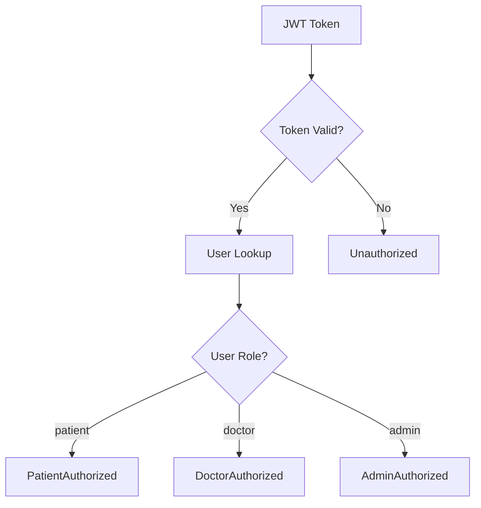

# HealthHub Authorization System

> Extends base [Documentation Standards](../../../../documents/documentation_standards.md) and [Code Quality](../../../../documents/engineering/code_quality.md); base rules apply. HealthHub-specific authorization deltas only.

---

## Overview

HealthHub uses **Algebraic Data Type (ADT)** authorization instead of traditional string-based role checking. This approach makes unauthorized access impossible at the type level.

**Location**: `backend/app/domain/authorization.py`

---

## Authorization State ADT

```python
type AuthorizationState = (
    PatientAuthorized
    | DoctorAuthorized
    | AdminAuthorized
    | Unauthorized
)
```



---

## Authorization States

### PatientAuthorized

Validated patient with access to their own records.

```python
@dataclass(frozen=True)
class PatientAuthorized:
    """Patient authorized state."""

    user_id: UUID
    patient_id: UUID
    email: str
    role: Literal["patient"] = "patient"
```

| Field | Type | Description |
|-------|------|-------------|
| user_id | UUID | User account ID |
| patient_id | UUID | Patient record ID |
| email | str | User email |
| role | Literal | Always "patient" |

**Permissions**:
- View own medical records
- View own appointments
- Request new appointments
- View own prescriptions
- View own lab results
- View own invoices

---

### DoctorAuthorized

Validated doctor with access to patient care features.

```python
@dataclass(frozen=True)
class DoctorAuthorized:
    """Doctor authorized state."""

    user_id: UUID
    doctor_id: UUID
    email: str
    specialization: str
    can_prescribe: bool
    role: Literal["doctor"] = "doctor"
```

| Field | Type | Description |
|-------|------|-------------|
| user_id | UUID | User account ID |
| doctor_id | UUID | Doctor record ID |
| email | str | User email |
| specialization | str | Medical specialty |
| can_prescribe | bool | Prescribing authority |
| role | Literal | Always "doctor" |

**Permissions**:
- View assigned patient records
- Confirm/manage appointments
- Create lab orders
- Review lab results
- Write prescriptions (if can_prescribe=True)

---

### AdminAuthorized

Validated administrator with full system access.

```python
@dataclass(frozen=True)
class AdminAuthorized:
    """Admin authorized state."""

    user_id: UUID
    email: str
    role: Literal["admin"] = "admin"
```

| Field | Type | Description |
|-------|------|-------------|
| user_id | UUID | User account ID |
| email | str | User email |
| role | Literal | Always "admin" |

**Permissions**:
- Full system access
- User management
- System configuration
- Audit log access
- All patient/doctor records

---

### Unauthorized

Failed authentication or insufficient permissions.

```python
@dataclass(frozen=True)
class Unauthorized:
    """Unauthorized state."""

    reason: str
    detail: str | None = None
```

| Field | Type | Description |
|-------|------|-------------|
| reason | str | Why authorization failed |
| detail | str or None | Additional context |

**Common Reasons**:
- "Invalid token"
- "Token expired"
- "User not found"
- "Insufficient permissions"
- "Patient not authorized for this resource"

---

## Usage Patterns

### Pattern Matching in Routes

```python
@router.get("/patients/{patient_id}")
async def get_patient(
    patient_id: UUID,
    current_user: AuthorizationState = Depends(get_current_user),
) -> PatientResponse:
    match current_user:
        case PatientAuthorized(patient_id=pid) if pid == patient_id:
            # Patient accessing own record
            return await get_patient_by_id(patient_id)

        case DoctorAuthorized() | AdminAuthorized():
            # Doctor or admin accessing any patient
            return await get_patient_by_id(patient_id)

        case PatientAuthorized():
            # Patient trying to access another patient
            raise HTTPException(403, "Cannot access other patient records")

        case Unauthorized(reason=reason):
            raise HTTPException(401, reason)
```

### Prescription Authority Check

```python
def create_prescription_program(
    doctor_auth: DoctorAuthorized,
    patient_id: UUID,
    medication: str,
    ...
) -> Generator[AllEffects, object, Prescription | None]:
    # Type system ensures only DoctorAuthorized can call this

    if not doctor_auth.can_prescribe:
        return None  # Doctor lacks prescribing authority

    # Check medication interactions
    result = yield CheckMedicationInteractions(medications=[medication])

    match result:
        case MedicationInteractionWarning(severity="severe"):
            return None  # Block severe interactions

        case _:
            prescription = yield CreatePrescription(...)
            return prescription
```

### Exhaustive Pattern Matching

```python
def get_user_display(auth: AuthorizationState) -> str:
    match auth:
        case PatientAuthorized(email=email):
            return f"Patient: {email}"

        case DoctorAuthorized(email=email, specialization=spec):
            return f"Dr. {email} ({spec})"

        case AdminAuthorized(email=email):
            return f"Admin: {email}"

        case Unauthorized(reason=reason):
            return f"Unauthorized: {reason}"
```

---

## Anti-Patterns

### String-Based Role Checking (Wrong)

```python
# WRONG - String comparison is error-prone
if user.role == "doctor":
    # Easy to typo "doktor", no compile-time check
    ...
```

### Nullable Authorization (Wrong)

```python
# WRONG - Optional doesn't capture failure reason
def get_user() -> User | None:
    # No information about WHY authorization failed
    ...
```

### Exception-Based Authorization (Wrong)

```python
# WRONG - Exceptions don't compose, hard to test
def require_doctor():
    if not is_doctor():
        raise UnauthorizedException("Not a doctor")
    # No typed return value
```

---

## Helper Functions

### Creating Authorization States

```python
def create_patient_authorized(
    user: User, patient_id: UUID
) -> PatientAuthorized:
    """Create patient authorized state from user and patient ID."""
    return PatientAuthorized(
        user_id=user.id,
        patient_id=patient_id,
        email=user.email,
    )

def create_doctor_authorized(
    user: User,
    doctor_id: UUID,
    specialization: str,
    can_prescribe: bool,
) -> DoctorAuthorized:
    """Create doctor authorized state from user and doctor info."""
    return DoctorAuthorized(
        user_id=user.id,
        doctor_id=doctor_id,
        email=user.email,
        specialization=specialization,
        can_prescribe=can_prescribe,
    )

def create_admin_authorized(user: User) -> AdminAuthorized:
    """Create admin authorized state from user."""
    return AdminAuthorized(
        user_id=user.id,
        email=user.email,
    )

def create_unauthorized(
    reason: str, detail: str | None = None
) -> Unauthorized:
    """Create unauthorized state with reason."""
    return Unauthorized(reason=reason, detail=detail)
```

---

## Testing Authorization

```python
def test_patient_can_access_own_records() -> None:
    auth = PatientAuthorized(
        user_id=uuid4(),
        patient_id=PATIENT_ID,
        email="patient@example.com",
    )

    match auth:
        case PatientAuthorized(patient_id=pid) if pid == PATIENT_ID:
            pass  # Expected
        case _:
            pytest.fail("Should be authorized")

def test_patient_cannot_access_other_records() -> None:
    auth = PatientAuthorized(
        user_id=uuid4(),
        patient_id=PATIENT_ID,
        email="patient@example.com",
    )

    other_patient_id = uuid4()

    match auth:
        case PatientAuthorized(patient_id=pid) if pid == other_patient_id:
            pytest.fail("Should not match other patient")
        case PatientAuthorized():
            pass  # Expected - accessing different patient

def test_unauthorized_captures_reason() -> None:
    auth = Unauthorized(reason="Token expired", detail="Refresh required")

    assert auth.reason == "Token expired"
    assert auth.detail == "Refresh required"
```

---

## Related Documentation

### Best Practices
- [Authorization Patterns](../engineering/authorization.md) - Usage patterns and anti-patterns

### Product Documentation
- [Authentication](authentication.md) - JWT token handling
- [Domain Models](domain_models.md) - User and role models
- [API Reference](api_reference.md) - Protected endpoints
- [Audit Logging](audit_logging.md) - Access logging

---

**Last Updated**: 2025-11-25  
**Supersedes**: none  
**Referenced by**: ../README.md, ../engineering/authorization.md
**Maintainer**: HealthHub Team
