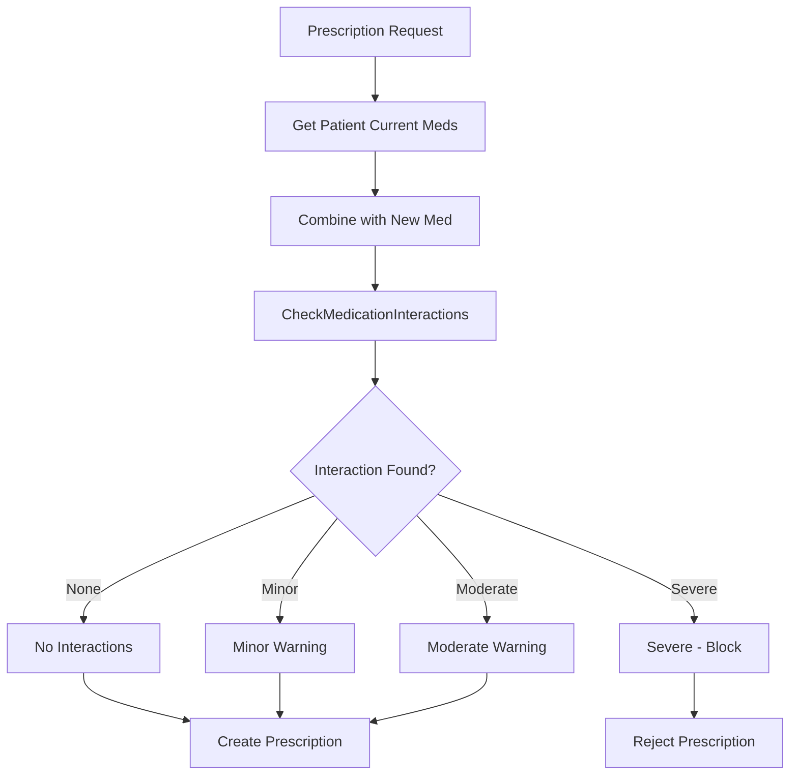

# Medication Interactions

> Drug interaction checking system for prescription safety.

---

## Overview

HealthHub includes a medication interaction checking system that validates prescriptions against known drug interactions before they are created.

**Severity Levels**:
- **Minor**: Low clinical significance
- **Moderate**: May require monitoring
- **Severe**: Contraindicated, should not be prescribed together

---

## Interaction Check Effect

### CheckMedicationInteractions

```python
@dataclass(frozen=True)
class CheckMedicationInteractions:
    """Effect: Check for drug interactions."""
    medications: list[str]
```

| Field | Type | Description |
|-------|------|-------------|
| medications | list[str] | List of drug names to check |

### Result Types

```python
type MedicationCheckResult = NoInteractions | MedicationInteractionWarning
```

```python
@dataclass(frozen=True)
class NoInteractions:
    """No medication interactions detected."""
    medications_checked: list[str]

@dataclass(frozen=True)
class MedicationInteractionWarning:
    """Warning about drug interactions."""
    medications: list[str]
    severity: Literal["minor", "moderate", "severe"]
    description: str
```

---

## Interaction Workflow



---

## Usage in Effect Programs

### Basic Interaction Check

```python
def prescribe_medication_program(
    patient_id: UUID,
    doctor_auth: DoctorAuthorized,
    medication: str,
    dosage: str,
    frequency: str,
    duration_days: int,
) -> Generator[AllEffects, object, Prescription | None]:
    # Verify prescribing authority
    if not doctor_auth.can_prescribe:
        return None

    # Get patient's current medications (from active prescriptions)
    patient = yield GetPatientById(patient_id=patient_id)
    if not isinstance(patient, Patient):
        return None

    # Get active prescriptions for the patient
    current_meds = yield GetActivePatientMedications(patient_id=patient_id)

    # Combine current meds with new medication
    all_medications = [*current_meds, medication]

    # Check for interactions
    check_result = yield CheckMedicationInteractions(medications=all_medications)

    match check_result:
        case NoInteractions():
            # Safe to prescribe
            pass

        case MedicationInteractionWarning(severity="severe"):
            # Block severe interactions
            return None

        case MedicationInteractionWarning(severity="moderate" | "minor"):
            # Allow with warning (logged in metadata)
            pass

    # Create the prescription
    prescription = yield CreatePrescription(
        patient_id=patient_id,
        doctor_id=doctor_auth.doctor_id,
        medication=medication,
        dosage=dosage,
        frequency=frequency,
        duration_days=duration_days,
        refills_remaining=0,
        notes=None,
    )

    return prescription
```

### Handling Warnings

```python
def prescribe_with_warning_handling(
    patient_id: UUID,
    doctor_auth: DoctorAuthorized,
    medication: str,
    override_warning: bool,  # Doctor acknowledged warning
) -> Generator[AllEffects, object, PrescriptionResult]:
    check_result = yield CheckMedicationInteractions(
        medications=[medication, *current_meds]
    )

    match check_result:
        case MedicationInteractionWarning(
            severity="moderate",
            description=desc,
        ) if not override_warning:
            # Require acknowledgment for moderate interactions
            return PrescriptionBlocked(
                reason="moderate_interaction",
                description=desc,
                requires_override=True,
            )

        case MedicationInteractionWarning(severity="severe"):
            # Never allow severe interactions
            return PrescriptionBlocked(
                reason="severe_interaction",
                description=check_result.description,
                requires_override=False,
            )

        case _:
            # Safe to proceed
            prescription = yield CreatePrescription(...)
            return PrescriptionCreated(prescription=prescription)
```

---

## Known Interactions Database

Example interactions that the system checks:

| Drug A | Drug B | Severity | Description |
|--------|--------|----------|-------------|
| Warfarin | Aspirin | Severe | Increased bleeding risk |
| Metformin | Alcohol | Moderate | Lactic acidosis risk |
| Lisinopril | Potassium | Moderate | Hyperkalemia risk |
| Simvastatin | Grapefruit | Minor | Increased statin levels |
| SSRIs | MAOIs | Severe | Serotonin syndrome |
| NSAIDs | Lithium | Moderate | Lithium toxicity |

---

## Interpreter Implementation

```python
# Known interactions database (simplified)
INTERACTIONS: list[tuple[str, str, str, str]] = [
    ("Warfarin", "Aspirin", "severe", "Increased bleeding risk"),
    ("Metformin", "Alcohol", "moderate", "Lactic acidosis risk"),
    ("Lisinopril", "Potassium", "moderate", "Hyperkalemia risk"),
    # ... more interactions
]

async def handle_check_interactions(
    effect: CheckMedicationInteractions,
) -> MedicationCheckResult:
    medications = [med.lower() for med in effect.medications]

    # Check all pairs for interactions
    for i, med1 in enumerate(medications):
        for med2 in medications[i + 1:]:
            for drug_a, drug_b, severity, description in INTERACTIONS:
                if {med1, med2} == {drug_a.lower(), drug_b.lower()}:
                    return MedicationInteractionWarning(
                        medications=[med1, med2],
                        severity=severity,
                        description=description,
                    )

    return NoInteractions(medications_checked=effect.medications)
```

---

## Testing

### No Interactions

```python
def test_no_interactions() -> None:
    gen = prescribe_medication_program(
        patient_id=patient_id,
        doctor_auth=doctor_auth,
        medication="Ibuprofen",
        ...
    )

    # Step through to interaction check
    effect = next(gen)  # GetPatientById
    effect = gen.send(mock_patient)  # GetActivePatientMedications
    effect = gen.send(["Acetaminophen"])  # CheckMedicationInteractions

    assert isinstance(effect, CheckMedicationInteractions)
    assert effect.medications == ["Acetaminophen", "Ibuprofen"]

    # Send no interactions result
    effect = gen.send(NoInteractions(medications_checked=effect.medications))

    # Should proceed to CreatePrescription
    assert isinstance(effect, CreatePrescription)
```

### Severe Interaction Blocked

```python
def test_severe_interaction_blocked() -> None:
    gen = prescribe_medication_program(
        patient_id=patient_id,
        doctor_auth=doctor_auth,
        medication="Aspirin",  # Patient already on Warfarin
        ...
    )

    # Step through to interaction check
    effect = next(gen)
    effect = gen.send(mock_patient)
    effect = gen.send(["Warfarin"])  # Current meds
    effect = gen.send(CheckMedicationInteractions(medications=["Warfarin", "Aspirin"]))

    # Send severe interaction warning
    warning = MedicationInteractionWarning(
        medications=["Warfarin", "Aspirin"],
        severity="severe",
        description="Increased bleeding risk",
    )

    # Program should return None (blocked)
    try:
        gen.send(warning)
        pytest.fail("Should have stopped iteration")
    except StopIteration as e:
        assert e.value is None  # Prescription blocked
```

---

## API Response Format

When an interaction is detected, the API returns detailed information:

```json
{
    "status": "interaction_detected",
    "interaction": {
        "medications": ["Warfarin", "Aspirin"],
        "severity": "severe",
        "description": "Increased bleeding risk when combining anticoagulants with NSAIDs"
    },
    "action_required": "Cannot proceed. Please select alternative medication."
}
```

For moderate interactions with override option:

```json
{
    "status": "warning",
    "interaction": {
        "medications": ["Metformin", "Lisinopril"],
        "severity": "moderate",
        "description": "Monitor kidney function when combining"
    },
    "action_required": "Acknowledge warning to proceed",
    "override_available": true
}
```

---

## Related Documentation

### Domain Knowledge
- [Medical State Machines](../domain/medical_state_machines.md) - Prescription lifecycle (Pending → Active → Completed/Expired)

### Best Practices
- [Effect Program Patterns](../engineering/effect_program_patterns.md) - Early return on severe interactions (Pattern 5)

### Product Documentation
- [Effects Reference](effects_reference.md) - CheckMedicationInteractions effect
- [Domain Models](domain_models.md) - Prescription model and MedicationCheckResult ADT
- [Authorization System](authorization_system.md) - Prescribing authority (can_prescribe capability)

---

**Last Updated**: 2025-11-26
**Maintainer**: HealthHub Team
