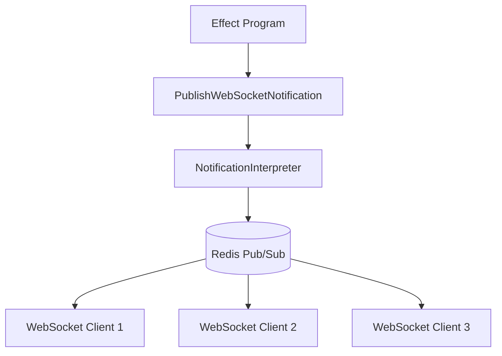

# Notification System

> Real-time WebSocket notifications via Redis pub/sub.

---

## Overview

HealthHub uses Redis pub/sub for real-time notifications to connected WebSocket clients. Notifications are ephemeral (not persisted) and delivered only to active connections.

**Components**:
- Redis 7+ for pub/sub messaging
- WebSocket connections for real-time delivery
- Effect-based API for publishing

---

## Architecture



---

## Notification Effect

### PublishWebSocketNotification

```python
@dataclass(frozen=True)
class PublishWebSocketNotification:
    """Effect: Publish ephemeral notification via Redis pub/sub."""
    channel: str
    message: dict[str, str | int | bool]
    recipient_id: UUID | None
```

| Field | Type | Description |
|-------|------|-------------|
| channel | str | Redis pub/sub channel name |
| message | dict | JSON-serializable notification payload |
| recipient_id | UUID or None | Target user (None for broadcast) |

### Result Types

```python
type PublishResult = NotificationPublished | PublishFailed

@dataclass(frozen=True)
class NotificationPublished:
    """Notification successfully published to channel."""
    channel: str
    message_id: str
    recipients_count: int

@dataclass(frozen=True)
class PublishFailed:
    """Failed to publish notification."""
    channel: str
    reason: str
```

---

## Channel Patterns

| Pattern | Example | Use Case |
|---------|---------|----------|
| `doctor:{id}:notifications` | `doctor:abc123:notifications` | Doctor-specific alerts |
| `patient:{id}:notifications` | `patient:def456:notifications` | Patient-specific updates |
| `appointment:{id}:updates` | `appointment:ghi789:updates` | Appointment status changes |
| `system:alerts` | `system:alerts` | System-wide broadcasts |

---

## Notification Types

### Appointment Notifications

**Appointment Requested** (to doctor):
```python
yield PublishWebSocketNotification(
    channel=f"doctor:{doctor_id}:notifications",
    message={
        "type": "appointment_requested",
        "appointment_id": str(appointment.id),
        "patient_name": f"{patient.first_name} {patient.last_name}",
        "reason": reason,
        "requested_time": requested_time.isoformat(),
    },
    recipient_id=doctor_id,
)
```

**Appointment Status Changed** (to patient):
```python
yield PublishWebSocketNotification(
    channel=f"patient:{patient_id}:notifications",
    message={
        "type": "appointment_status_changed",
        "appointment_id": str(appointment_id),
        "new_status": "Confirmed",
        "scheduled_time": scheduled_time.isoformat(),
    },
    recipient_id=patient_id,
)
```

### Lab Result Notifications

**Critical Lab Result** (to doctor):
```python
yield PublishWebSocketNotification(
    channel=f"doctor:{doctor_id}:notifications",
    message={
        "type": "critical_lab_result",
        "result_id": str(lab_result.id),
        "patient_name": f"{patient.first_name} {patient.last_name}",
        "test_type": lab_result.test_type,
        "requires_review": True,
    },
    recipient_id=doctor_id,
)
```

**Lab Result Available** (to patient):
```python
yield PublishWebSocketNotification(
    channel=f"patient:{patient_id}:notifications",
    message={
        "type": "lab_result_available",
        "result_id": str(lab_result.id),
        "test_type": lab_result.test_type,
        "reviewed": lab_result.reviewed_by_doctor,
    },
    recipient_id=patient_id,
)
```

### Prescription Notifications

**New Prescription** (to patient):
```python
yield PublishWebSocketNotification(
    channel=f"patient:{patient_id}:notifications",
    message={
        "type": "new_prescription",
        "prescription_id": str(prescription.id),
        "medication": prescription.medication,
        "doctor_name": f"Dr. {doctor.last_name}",
    },
    recipient_id=patient_id,
)
```

---

## Usage in Effect Programs

### Fire-and-Forget Pattern

Notifications should not block workflow completion:

```python
def schedule_appointment_program(...) -> Generator[AllEffects, object, Appointment]:
    # Core workflow
    appointment = yield CreateAppointment(...)

    # Fire-and-forget notification (don't check result)
    yield PublishWebSocketNotification(
        channel=f"doctor:{doctor_id}:notifications",
        message={...},
        recipient_id=doctor_id,
    )

    # Continue regardless of notification success
    return appointment
```

### Conditional Notifications

Only notify on specific conditions:

```python
def process_lab_result_program(...) -> Generator[AllEffects, object, LabResult]:
    result = yield CreateLabResult(...)

    # Only notify for critical results
    if result.critical:
        yield PublishWebSocketNotification(
            channel=f"doctor:{doctor_id}:notifications",
            message={
                "type": "critical_lab_result",
                "urgent": True,
                ...
            },
            recipient_id=doctor_id,
        )

    return result
```

---

## WebSocket Client Integration

### Connection Setup

```javascript
// Client-side WebSocket connection
const ws = new WebSocket(`wss://api.healthhub.example/ws/${userId}`);

ws.onmessage = (event) => {
    const notification = JSON.parse(event.data);

    switch (notification.type) {
        case 'appointment_requested':
            showAppointmentRequest(notification);
            break;
        case 'critical_lab_result':
            showUrgentAlert(notification);
            break;
        case 'new_prescription':
            showPrescriptionNotification(notification);
            break;
    }
};
```

### Server-Side Handler

```python
@app.websocket("/ws/{user_id}")
async def websocket_endpoint(
    websocket: WebSocket,
    user_id: UUID,
    redis_client: redis.Redis = Depends(get_redis),
):
    await websocket.accept()

    # Subscribe to user's notification channel
    pubsub = redis_client.pubsub()
    await pubsub.subscribe(f"patient:{user_id}:notifications")

    try:
        async for message in pubsub.listen():
            if message["type"] == "message":
                await websocket.send_text(message["data"])
    finally:
        await pubsub.unsubscribe()
        await websocket.close()
```

---

## Interpreter Implementation

```python
class NotificationInterpreter:
    def __init__(
        self,
        pool: asyncpg.Pool,
        redis_client: redis.Redis,
    ) -> None:
        self.pool = pool
        self.redis_client = redis_client

    async def handle(self, effect: NotificationEffect) -> object:
        match effect:
            case PublishWebSocketNotification(
                channel=channel,
                message=message,
                recipient_id=recipient_id,
            ):
                try:
                    # Publish to Redis channel
                    message_json = json.dumps(message)
                    recipients = await self.redis_client.publish(channel, message_json)

                    return NotificationPublished(
                        channel=channel,
                        message_id=str(uuid4()),
                        recipients_count=recipients,
                    )

                except redis.RedisError as e:
                    return PublishFailed(
                        channel=channel,
                        reason=str(e),
                    )

            case LogAuditEvent(...):
                # Handle audit logging
                ...
```

---

## Testing

### Unit Testing (Mocked)

```python
def test_notification_published() -> None:
    gen = schedule_appointment_program(patient_id, doctor_id, time, reason, actor)

    # Step through to notification effect
    effect = next(gen)  # GetPatientById
    effect = gen.send(mock_patient)  # GetDoctorById
    effect = gen.send(mock_doctor)  # CreateAppointment
    effect = gen.send(mock_appointment)  # PublishWebSocketNotification

    assert isinstance(effect, PublishWebSocketNotification)
    assert effect.channel == f"doctor:{doctor_id}:notifications"
    assert effect.message["type"] == "appointment_requested"
```

### Integration Testing

```python
async def test_notification_delivered(redis_client: redis.Redis) -> None:
    # Subscribe to channel
    pubsub = redis_client.pubsub()
    await pubsub.subscribe("doctor:abc:notifications")

    # Publish notification
    interpreter = NotificationInterpreter(pool, redis_client)
    result = await interpreter.handle(
        PublishWebSocketNotification(
            channel="doctor:abc:notifications",
            message={"type": "test"},
            recipient_id=None,
        )
    )

    assert isinstance(result, NotificationPublished)
    assert result.recipients_count >= 0
```

---

## Configuration

```bash
REDIS_HOST=redis
REDIS_PORT=6379
REDIS_DB=0
```

---

## Related Documentation

### Best Practices
- [Effect Program Patterns](../best_practices/effect_program_patterns.md) - Fire-and-forget notifications (Pattern 3)
- [Testing Doctrine](../best_practices/testing_doctrine.md) - Testing notification workflows

### Product Documentation
- [Architecture Overview](architecture_overview.md) - How messaging fits in the 5-layer architecture
- [Effects Reference](effects_reference.md) - PublishWebSocketNotification effect
- [Audit Logging](audit_logging.md) - Notification event logging

---

**Last Updated**: 2025-11-26
**Maintainer**: HealthHub Team
