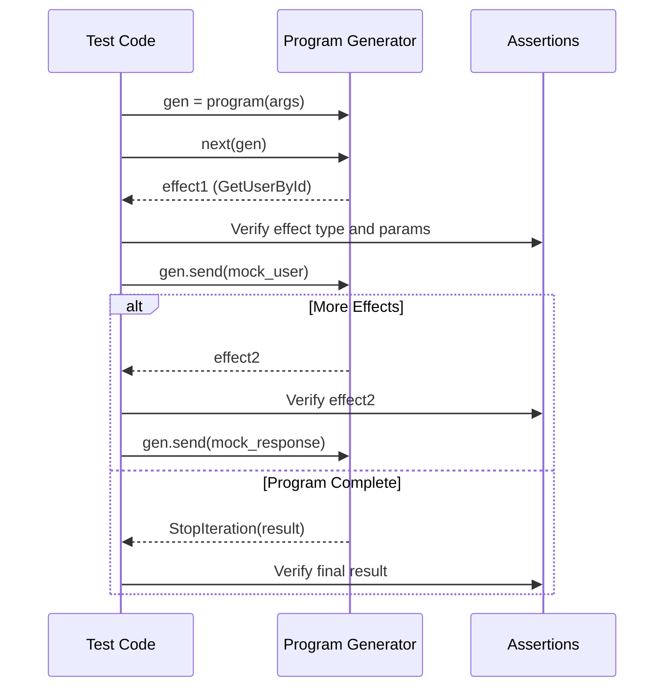

# Tutorial 04: Testing Effect Programs

This tutorial teaches you how to test effect programs using **generator-based mocking** with pytest-mock. This approach tests pure programs without requiring interpreters or real infrastructure.

## Prerequisites

- Completed [Tutorial 01: Quick Start](./01_quickstart.md)
- Completed [Tutorial 02: Effect Types](./02_effect_types.md)
- Completed [Tutorial 03: ADTs and Results](./03_adts_and_results.md)
- Familiarity with pytest

## Learning Objectives

By the end of this tutorial, you will:
- Write unit tests using generator-based mocking (no interpreters needed)
- Test success paths and error paths with explicit Result types
- Mock effect responses step-by-step
- Test program composition with yield from
- Understand test organization strategies

## Setup

### Installation

```bash
poetry add --group dev pytest pytest-asyncio pytest-mock pytest-cov
```

### Project Structure

```
your_project/
├── src/
│   └── programs/
│       ├── greet_user.py
│       └── workflows.py
└── tests/
    ├── test_programs/
    │   ├── test_greet_user.py
    │   └── test_workflows.py
    └── conftest.py
```

---

## Part 1: Generator-Based Testing Pattern

### Writing a Testable Program

Let's start with a simple program that uses explicit error handling with Result types:

```python
# src/programs/user_programs.py
from collections.abc import Generator
from uuid import UUID

from functional_effects import AllEffects, EffectResult, GetUserById
from functional_effects.algebraic.result import Result, Ok, Err
from functional_effects.domain.user import User
from demo.domain.errors import AppError

def get_user_program(
    user_id: UUID
) -> Generator[AllEffects, EffectResult, Result[User, AppError]]:
    """Get user by ID with explicit error handling.

    Returns:
        Ok(user) if user found
        Err(AppError) if user not found
    """
    user = yield GetUserById(user_id=user_id)

    if user is None:
        return Err(AppError.not_found(f"User {user_id} not found"))

    assert isinstance(user, User)  # Type narrowing
    return Ok(user)
```

### Generator-Based Testing

**Key Concept**: Test effect programs by manually stepping through the generator, mocking each effect's response:

**Testing Flow Diagram:**

The following diagram shows how generator-based testing works:



**Test Execution Steps:**
1. **Create generator**: Call program function to get generator instance
2. **Get first effect**: Use `next(gen)` to yield first effect
3. **Assert effect**: Verify effect type and parameters
4. **Send mock response**: Use `gen.send(mock_value)` to provide mocked data
5. **Repeat**: Continue for each effect in the program
6. **Catch StopIteration**: Extract final return value from exception
7. **Assert result**: Verify program returned expected Result type

**Example Test:**

```python
# tests/test_programs/test_user_programs.py
import pytest
from pytest_mock import MockerFixture
from uuid import uuid4

from functional_effects.domain.user import User
from functional_effects.algebraic.result import Ok, Err
from demo.domain.errors import AppError
from src.programs.user_programs import get_user_program


class TestGetUserProgram:
    """Test suite for get_user_program."""

    def test_get_user_success(self, mocker: MockerFixture) -> None:
        """Test successfully retrieving a user."""
        # Setup: Create test data
        user_id = uuid4()
        user = User(id=user_id, email="alice@example.com", name="Alice")

        # Step 1: Create generator from program
        gen = get_user_program(user_id=user_id)

        # Step 2: Get first effect (GetUserById)
        effect1 = next(gen)
        assert effect1.__class__.__name__ == "GetUserById"
        assert effect1.user_id == user_id

        # Step 3: Send mock response to generator
        try:
            gen.send(user)
            pytest.fail("Expected StopIteration")
        except StopIteration as e:
            result = e.value  # Extract return value

        # Step 4: Verify result
        assert isinstance(result, Ok)
        assert isinstance(result.value, User)
        assert result.value.id == user_id
        assert result.value.email == "alice@example.com"

    def test_get_user_not_found(self, mocker: MockerFixture) -> None:
        """Test retrieving non-existent user."""
        # Setup
        user_id = uuid4()

        # Create generator
        gen = get_user_program(user_id=user_id)

        # Step 1: GetUserById returns None
        effect1 = next(gen)

        # Send None (user not found)
        try:
            gen.send(None)
            pytest.fail("Expected StopIteration")
        except StopIteration as e:
            result = e.value

        # Verify error result
        assert isinstance(result, Err)
        assert isinstance(result.error, AppError)
        assert result.error.error_type == "not_found"
        assert str(user_id) in result.error.message
```

**Key Testing Patterns**:
1. ✅ Use `next(gen)` to get the first effect
2. ✅ Use `gen.send(mock_value)` to provide mock responses
3. ✅ Catch `StopIteration` to extract the final `Result`
4. ✅ Use pattern matching or `isinstance` to verify `Ok`/`Err`
5. ✅ No interpreters, no async/await - just pure generators

---

## Part 2: Testing Multi-Step Programs

### Testing Programs with Multiple Effects

Let's test a program that validates input, fetches data, and performs an update:

```python
# src/programs/user_programs.py
import re
from uuid import UUID
from functional_effects import AllEffects, EffectResult, GetUserById, UpdateUser, InvalidateCache
from functional_effects.algebraic.result import Result, Ok, Err
from functional_effects.domain.user import User
from demo.domain.errors import AppError

def update_user_program(
    user_id: UUID,
    email: str | None = None,
    name: str | None = None
) -> Generator[AllEffects, EffectResult, Result[User, AppError]]:
    """Update user with validation and cache invalidation."""
    # Validation 1: At least one field
    if email is None and name is None:
        return Err(AppError.validation_error("At least one field must be provided"))

    # Validation 2: Email format
    if email is not None and "@" not in email:
        return Err(AppError.validation_error("Invalid email format"))

    # Effect 1: Verify user exists
    user = yield GetUserById(user_id=user_id)
    if user is None:
        return Err(AppError.not_found(f"User {user_id} not found"))

    # Effect 2: Update user
    updated_result = yield UpdateUser(user_id=user_id, email=email, name=name)
    assert isinstance(updated_result, bool)
    if not updated_result:
        return Err(AppError.internal_error("Failed to update user"))

    # Effect 3: Invalidate cache
    yield InvalidateCache(key=f"user:{user_id}")

    # Effect 4: Get updated user
    updated_user = yield GetUserById(user_id=user_id)
    assert isinstance(updated_user, User)

    return Ok(updated_user)
```

### Testing Multi-Step Success Path

```python
def test_update_user_success(self, mocker: MockerFixture) -> None:
    """Test successfully updating a user."""
    # Setup
    user_id = uuid4()
    original_user = User(id=user_id, email="alice@example.com", name="Alice")
    updated_user = User(id=user_id, email="alice.new@example.com", name="Alice")

    # Create generator
    gen = update_user_program(user_id=user_id, email="alice.new@example.com")

    # Step 1: GetUserById returns original user
    effect1 = next(gen)
    assert effect1.__class__.__name__ == "GetUserById"
    result1 = gen.send(original_user)

    # Step 2: UpdateUser returns True
    effect2 = result1
    assert effect2.__class__.__name__ == "UpdateUser"
    assert effect2.user_id == user_id
    assert effect2.email == "alice.new@example.com"
    result2 = gen.send(True)

    # Step 3: InvalidateCache
    effect3 = result2
    assert effect3.__class__.__name__ == "InvalidateCache"
    assert f"user:{user_id}" in effect3.key
    result3 = gen.send(True)

    # Step 4: GetUserById returns updated user
    effect4 = result3
    assert effect4.__class__.__name__ == "GetUserById"

    try:
        gen.send(updated_user)
        pytest.fail("Expected StopIteration")
    except StopIteration as e:
        result = e.value

    # Verify final result
    assert isinstance(result, Ok)
    assert result.value.email == "alice.new@example.com"
```

### Testing Validation Errors (No Effects Yielded)

```python
def test_update_user_no_fields(self, mocker: MockerFixture) -> None:
    """Test update fails when no fields provided."""
    # Create generator
    gen = update_user_program(user_id=uuid4())

    # No effects should be yielded - validation fails immediately
    try:
        next(gen)
        pytest.fail("Expected StopIteration")
    except StopIteration as e:
        result = e.value

    # Verify error result
    assert isinstance(result, Err)
    assert isinstance(result.error, AppError)
    assert result.error.error_type == "validation_error"
    assert "at least one field" in result.error.message.lower()

def test_update_user_invalid_email(self, mocker: MockerFixture) -> None:
    """Test update fails with invalid email format."""
    gen = update_user_program(user_id=uuid4(), email="invalid-email")

    # Validation happens before any effects
    try:
        next(gen)
        pytest.fail("Expected StopIteration")
    except StopIteration as e:
        result = e.value

    assert isinstance(result, Err)
    assert result.error.error_type == "validation_error"
    assert "email" in result.error.message.lower()
```

---

## Part 3: Testing Complex Workflows (All 6 Infrastructure Types)

### Testing Programs Using Multiple Infrastructure Types

Let's test a complex program that demonstrates auth, cache, database, storage, messaging, and WebSocket:

```python
# src/programs/chat_programs.py
from collections.abc import Generator
from uuid import uuid4
from datetime import datetime, timezone

from functional_effects import (
    AllEffects, EffectResult,
    ValidateToken, GetCachedValue, PutCachedValue, GetUserById,
    PutObject, PublishMessage, SendText
)
from functional_effects.algebraic.result import Result, Ok, Err
from functional_effects.domain.token_result import TokenValid, TokenInvalid
from functional_effects.domain.user import User
from demo.domain.errors import AuthError, AppError
from demo.domain.responses import MessageResponse

def send_authenticated_message_with_storage_program(
    token: str, text: str
) -> Generator[AllEffects, EffectResult, Result[MessageResponse, AuthError | AppError]]:
    """Send message using all 6 infrastructure types."""
    # Step 1: [Auth] Validate JWT token
    validation_result = yield ValidateToken(token=token)

    match validation_result:
        case TokenInvalid():
            return Err(AuthError(message="Invalid token", error_type="token_invalid"))
        case TokenValid(user_id=user_id):
            pass

    # Step 2-4: [Cache + Database] Cache-aside pattern
    cached_result = yield GetCachedValue(key=f"user:{user_id}")

    if cached_result is None:
        # Cache miss - load from database
        user = yield GetUserById(user_id=user_id)
        if user is None:
            return Err(AppError.not_found(f"User {user_id} not found"))

        # Store in cache
        yield PutCachedValue(key=f"user:{user_id}", value=b"...", ttl_seconds=300)

    # Validation
    if not text or text.strip() == "":
        return Err(AppError.validation_error("Message text cannot be empty"))

    # Step 5: [Storage] Archive to S3
    message_id = uuid4()
    s3_key = f"messages/{user_id}/{message_id}.json"
    storage_result = yield PutObject(bucket="chat-archive", key=s3_key, content=b"...")

    # Step 6: [Messaging] Publish to Pulsar
    pulsar_message_id = yield PublishMessage(topic="chat-messages", payload=b"...")

    # Step 7: [WebSocket] Send confirmation
    yield SendText(text=f"Message sent: {message_id}")

    return Ok(MessageResponse(
        message_id=message_id,
        user_id=user_id,
        text=text,
        created_at=datetime.now(timezone.utc)
    ))
```

### Testing the Complete Success Path

```python
from functional_effects.domain.s3_object import PutSuccess

def test_send_authenticated_message_success(self, mocker: MockerFixture) -> None:
    """Test successful message send using all 6 infrastructure types."""
    # Setup
    user_id = uuid4()
    token_valid = TokenValid(user_id=user_id, claims={"email": "alice@example.com"})
    user = User(id=user_id, email="alice@example.com", name="Alice")
    message_text = "Hello from all 6 infrastructure types!"

    # Create generator
    gen = send_authenticated_message_with_storage_program(
        token="valid_token_123", text=message_text
    )

    # Step 1: [Auth] ValidateToken
    effect1 = next(gen)
    assert effect1.__class__.__name__ == "ValidateToken"
    assert effect1.token == "valid_token_123"
    result1 = gen.send(token_valid)

    # Step 2: [Cache] GetCachedValue (cache miss)
    effect2 = result1
    assert effect2.__class__.__name__ == "GetCachedValue"
    assert f"user:{user_id}" in effect2.key
    result2 = gen.send(None)  # Cache miss

    # Step 3: [Database] GetUserById
    effect3 = result2
    assert effect3.__class__.__name__ == "GetUserById"
    assert effect3.user_id == user_id
    result3 = gen.send(user)

    # Step 4: [Cache] PutCachedValue
    effect4 = result3
    assert effect4.__class__.__name__ == "PutCachedValue"
    assert f"user:{user_id}" in effect4.key
    assert effect4.ttl_seconds == 300
    result4 = gen.send(True)

    # Step 5: [Storage] PutObject to S3
    effect5 = result4
    assert effect5.__class__.__name__ == "PutObject"
    assert effect5.bucket == "chat-archive"
    put_success = PutSuccess(key=effect5.key, bucket="chat-archive", version_id="v1")
    result5 = gen.send(put_success)

    # Step 6: [Messaging] PublishMessage to Pulsar
    effect6 = result5
    assert effect6.__class__.__name__ == "PublishMessage"
    assert effect6.topic == "chat-messages"
    result6 = gen.send("pulsar_message_id_123")

    # Step 7: [WebSocket] SendText
    effect7 = result6
    assert effect7.__class__.__name__ == "SendText"
    assert "Message sent:" in effect7.text

    try:
        gen.send(None)
        pytest.fail("Expected StopIteration")
    except StopIteration as e:
        result = e.value

    # Verify final result
    assert isinstance(result, Ok)
    assert isinstance(result.value, MessageResponse)
    assert result.value.user_id == user_id
    assert result.value.text == message_text
```

---

## Part 4: Testing Early Returns

Programs can return early when encountering validation errors or missing data:

```python
def test_send_authenticated_message_invalid_token(
    self, mocker: MockerFixture
) -> None:
    """Test send fails with invalid token."""
    # Setup
    token_invalid = TokenInvalid(token="bad_token", reason="malformed")

    # Create generator
    gen = send_authenticated_message_with_storage_program(
        token="bad_token", text="Hello"
    )

    # Step 1: ValidateToken returns TokenInvalid
    effect1 = next(gen)

    try:
        gen.send(token_invalid)
        pytest.fail("Expected StopIteration")
    except StopIteration as e:
        result = e.value

    # Verify error - program stopped after first effect
    assert isinstance(result, Err)
    assert isinstance(result.error, AuthError)
    assert result.error.error_type == "token_invalid"
```

**Key Pattern**: When a program returns `Err`, it stops immediately. No subsequent effects are yielded.

---

## Part 5: Test Organization

### Organizing Tests by Test Suite

Group related tests in classes:

```python
class TestSendMessageProgram:
    """Test suite for send_message_program."""

    def test_send_message_success(self, mocker: MockerFixture) -> None:
        """Test successfully sending a message."""
        # ...

    def test_send_message_user_not_found(self, mocker: MockerFixture) -> None:
        """Test sending message fails when user doesn't exist."""
        # ...

    def test_send_message_empty_text(self, mocker: MockerFixture) -> None:
        """Test sending message fails with empty text."""
        # ...

    def test_send_message_text_too_long(self, mocker: MockerFixture) -> None:
        """Test sending message fails when text exceeds max length."""
        # ...
```

### Directory Structure

```
tests/
├── test_demo/
│   ├── __init__.py
│   ├── test_auth_programs.py      # 13 tests
│   ├── test_user_programs.py      # 10 tests
│   ├── test_message_programs.py   # 6 tests
│   └── test_chat_programs.py      # 5 tests (all 6 infrastructure types)
└── conftest.py
```

---

## Best Practices

### ✅ DO

1. **Test Programs as Pure Generators**
   ```python
   # ✅ No interpreters, no infrastructure
   gen = get_user_program(user_id=user_id)
   effect = next(gen)
   result = gen.send(mock_value)
   ```

2. **Use Result Types for Explicit Error Handling**
   ```python
   # ✅ Return Result[T, E] from programs
   def get_user(...) -> Generator[..., Result[User, AppError]]:
       # ...
       return Ok(user)  # or Err(AppError(...))
   ```

3. **Test One Behavior Per Test**
   ```python
   def test_user_found_returns_ok() -> None: ...
   def test_user_not_found_returns_err() -> None: ...
   def test_validation_fails_returns_err() -> None: ...
   ```

4. **Verify Effect Properties**
   ```python
   effect = next(gen)
   assert effect.__class__.__name__ == "GetUserById"
   assert effect.user_id == expected_user_id
   ```

5. **Use Pattern Matching or isinstance for Results**
   ```python
   # Pattern matching
   match result:
       case Ok(user): assert user.id == user_id
       case Err(error): pytest.fail(f"Unexpected error: {error}")

   # isinstance
   assert isinstance(result, Ok)
   assert isinstance(result.value, User)
   ```

6. **Test Early Returns (Validation Errors)**
   ```python
   gen = update_user_program(user_id=uuid4())  # No fields
   try:
       next(gen)  # Should stop immediately
       pytest.fail("Expected StopIteration")
   except StopIteration as e:
       assert isinstance(e.value, Err)
   ```

### ❌ DON'T

1. **Don't Use Fakes or Test Doubles**
   ```python
   # ❌ Forbidden
   interpreter = MessagingInterpreter(producer=FakeMessageProducer())

   # ✅ Use generator-based testing instead
   gen = send_message_program(...)
   effect = next(gen)
   result = gen.send(mock_response)
   ```

2. **Don't Skip Result Type Verification**
   ```python
   # ❌ Missing Result type check
   result = e.value
   assert result.value.id == user_id  # Assumes Ok

   # ✅ Verify Result type first
   assert isinstance(result, Ok)
   assert result.value.id == user_id
   ```

3. **Don't Test Multiple Behaviors in One Test**
   ```python
   # ❌ Too much in one test
   def test_get_user() -> None:
       # Tests both found AND not found - split into 2 tests!
       ...
   ```

4. **Don't Use Real Infrastructure in Unit Tests**
   ```python
   # ❌ Don't do this in unit tests
   db_conn = await asyncpg.connect(DATABASE_URL)
   redis_client = await aioredis.from_url(REDIS_URL)
   ```

5. **Don't Use pytest.skip()**
   ```python
   # ❌ Forbidden - creates false confidence
   @pytest.mark.skip(reason="Not implemented yet")
   def test_complex_workflow() -> None: ...

   # ✅ Let tests FAIL to expose gaps, or delete test
   ```

---

## Next Steps

- Explore the demo application in `/demo` for complete working examples
- Read [demo/README.md](../../demo/README.md) for comprehensive documentation
- Study real tests in `tests/test_demo/` (35 tests with 100% pass rate)
- Review [ARCHITECTURE.md](../../ARCHITECTURE.md) for system design

## Summary

You learned how to:
- ✅ Test effect programs using generator-based mocking
- ✅ Use `next(gen)` and `gen.send()` to mock effect responses
- ✅ Test multi-step programs with multiple effects
- ✅ Test validation errors that occur before effects
- ✅ Use Result types for explicit error handling
- ✅ Test complex workflows using all 6 infrastructure types
- ✅ Organize tests by test suite

**Key Takeaway**: Test effect programs as pure generators without requiring interpreters or real infrastructure. This provides fast, reliable, type-safe tests that verify program logic in isolation.

Happy testing! 🧪
