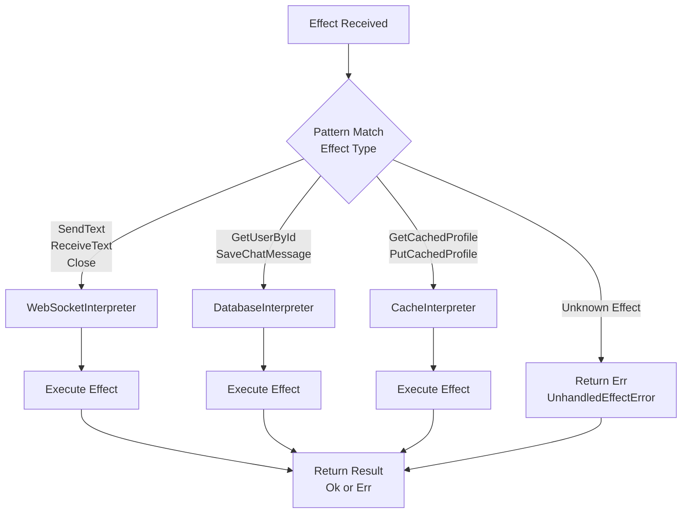

# Interpreters API Reference

This document provides a comprehensive reference for effect interpreters and error types.

> **Core Doctrine**: For the 5-layer architecture and data flow diagrams, see [architecture.md](../engineering/architecture.md#5-layer-architecture).

## Overview

Interpreters execute effects by implementing the actual side effects described by effect values. They translate declarative effect descriptions into concrete I/O operations.

**Key Principle**: Programs describe **what** to do (effects), interpreters implement **how** to do it.

## Interpreter Factory

### create_composite_interpreter

Create a composite interpreter that delegates to specialized sub-interpreters.

**Type Signature**:
```python
def create_composite_interpreter(
    websocket_connection: WebSocketConnection,
    user_repo: UserRepository,
    message_repo: ChatMessageRepository,
    cache: ProfileCache,
    message_producer: MessageProducer | None = None,
    message_consumer: MessageConsumer | None = None,
    object_storage: ObjectStorage | None = None,
    auth_service: AuthService | None = None,
) -> CompositeInterpreter
```

**Parameters**:
- `websocket_connection: WebSocketConnection` - WebSocket protocol implementation
- `user_repo: UserRepository` - User data repository
- `message_repo: ChatMessageRepository` - Message data repository
- `cache: ProfileCache` - Profile caching layer
- `message_producer: MessageProducer | None` - Optional Pulsar message producer
- `message_consumer: MessageConsumer | None` - Optional Pulsar message consumer
- `object_storage: ObjectStorage | None` - Optional S3-compatible object storage
- `auth_service: AuthService | None` - Optional JWT authentication service

**Returns**: `CompositeInterpreter` - Fully configured interpreter

**Usage**:
```python
from effectful import create_composite_interpreter, run_ws_program
from effectful.adapters.postgres import PostgresUserRepository, PostgresChatMessageRepository
from effectful.adapters.redis_cache import RedisProfileCache
from effectful.adapters.websocket_connection import RealWebSocketConnection
import asyncpg

# Create infrastructure connections
db_conn = await asyncpg.connect(DATABASE_URL)
ws_conn = RealWebSocketConnection(websocket)
cache_conn = await aioredis.create_redis_pool(REDIS_URL)

# Create repositories
user_repo = PostgresUserRepository(connection=db_conn)
message_repo = PostgresChatMessageRepository(connection=db_conn)
cache = RedisProfileCache(redis=cache_conn)

# Create interpreter
interpreter = create_composite_interpreter(
    websocket_connection=ws_conn,
    user_repo=user_repo,
    message_repo=message_repo,
    cache=cache,
)

# Run program
result = await run_ws_program(my_program(), interpreter)
```

### Effect Routing

The CompositeInterpreter routes effects to specialized interpreters using pattern matching:



**Routing Logic:**
- CompositeInterpreter uses exhaustive pattern matching on effect type
- Each specialized interpreter handles effects for its domain
- Unknown effects return `UnhandledEffectError`
- All interpreters return `Result[EffectReturn, InterpreterError]`

---

## Individual Interpreters

### WebSocketInterpreter

Handles WebSocket communication effects.

**Type Signature**:
```python
class WebSocketInterpreter:
    def __init__(self, connection: WebSocketConnection) -> None:
        self._connection = connection

    async def interpret(
        self, effect: WebSocketEffect
    ) -> Result[EffectReturn[EffectResult], InterpreterError]:
        return await self._connection.run(effect)
```

**Supported Effects**:
- `SendText` → sends text message
- `ReceiveText` → receives text message
- `Close` → closes connection

**Usage**:
```python
from effectful.interpreters.websocket import WebSocketInterpreter
from effectful import SendText, Ok

interpreter = WebSocketInterpreter(connection=ws_conn)

effect = SendText(text="Hello")
result = await interpreter.interpret(effect)

match result:
    case Ok(EffectReturn(value=None, effect_name="SendText")):
        print("Message sent successfully")
    case Err(error):
        print(f"Failed: {error}")
```

---

### DatabaseInterpreter

Handles database persistence effects.

**Type Signature**:
```python
class DatabaseInterpreter:
    def __init__(
        self,
        user_repo: UserRepository,
        message_repo: ChatMessageRepository,
    ) -> None:
        self._user_repo = user_repo
        self._message_repo = message_repo

    async def interpret(
        self, effect: DatabaseEffect
    ) -> Result[EffectReturn[EffectResult], InterpreterError]:
        return await route_database_effect(effect, self._user_repo, self._message_repo)
```

**Supported Effects**:
- `GetUserById` → queries user repository
- `SaveChatMessage` → persists message

**Usage**:
```python
from effectful.interpreters.database import DatabaseInterpreter
from effectful import GetUserById, Ok
from uuid import uuid4

interpreter = DatabaseInterpreter(
    user_repo=user_repo,
    message_repo=message_repo,
)

effect = GetUserById(user_id=uuid4())
result = await interpreter.interpret(effect)

match result:
    case Ok(EffectReturn(value=User() as user, effect_name="GetUserById")):
        print(f"Found user: {user.name}")
    case Ok(EffectReturn(value=UserNotFound(), effect_name="GetUserById")):
        print("User not found")
    case Err(error):
        print(f"Database error: {error}")
```

---

### CacheInterpreter

Handles cache operations.

**Type Signature**:
```python
class CacheInterpreter:
    def __init__(self, cache: ProfileCache) -> None:
        self._cache = cache

    async def interpret(
        self, effect: CacheEffect
    ) -> Result[EffectReturn[EffectResult], InterpreterError]:
        return await self._cache.execute(effect)
```

**Supported Effects**:
- `GetCachedProfile` → retrieves from cache
- `PutCachedProfile` → stores in cache

**Usage**:
```python
from effectful.interpreters.cache import CacheInterpreter
from effectful import GetCachedProfile, Ok
from uuid import uuid4

interpreter = CacheInterpreter(cache=cache)

effect = GetCachedProfile(user_id=uuid4())
result = await interpreter.interpret(effect)

match result:
    case Ok(EffectReturn(value=ProfileData() as profile, effect_name="GetCachedProfile")):
        print(f"Cache hit: {profile.name}")
    case Ok(EffectReturn(value=CacheMiss(), effect_name="GetCachedProfile")):
        print("Cache miss")
    case Err(error):
        print(f"Cache error: {error}")
```

---

## Error Types

### InterpreterError

Union type for all interpreter errors.

```python
type InterpreterError = (
    UnhandledEffectError
    | WebSocketClosedError
    | DatabaseError
    | CacheError
    | MessagingError
    | StorageError
    | AuthError
)
```

---

### DatabaseError

Database operation failures.

**Type Signature**:
```python
@dataclass(frozen=True)
class DatabaseError:
    effect: DatabaseEffect
    db_error: str
    is_retryable: bool
```

**Fields**:
- `effect: DatabaseEffect` - The effect that failed
- `db_error: str` - Error message from database
- `is_retryable: bool` - Whether retry might succeed

**Common Causes**:
- Connection timeout
- Query syntax error
- Constraint violation
- Transaction deadlock

**Usage**:
```python
from effectful import run_ws_program, Err
from effectful.interpreters.errors import DatabaseError

result = await run_ws_program(my_program(), interpreter)

match result:
    case Err(DatabaseError(db_error=msg, is_retryable=True)):
        # Retry operation
        result = await run_ws_program(my_program(), interpreter)
    case Err(DatabaseError(db_error=msg, is_retryable=False)):
        # Permanent failure - log and return error to user
        logger.error(f"Database error: {msg}")
    case Ok(value):
        print(f"Success: {value}")
```

---

### WebSocketClosedError

WebSocket connection closed.

**Type Signature**:
```python
@dataclass(frozen=True)
class WebSocketClosedError:
    effect: WebSocketEffect
    close_code: int
    reason: str
```

**Fields**:
- `effect: WebSocketEffect` - The effect that failed
- `close_code: int` - WebSocket close code (e.g., 1000, 1006)
- `reason: str` - Close reason message

**Common Close Codes**:
- `1000` - Normal closure
- `1001` - Going away
- `1006` - Abnormal closure (no close frame)
- `1008` - Policy violation

**Usage**:
```python
from effectful import run_ws_program, Err
from effectful.interpreters.errors import WebSocketClosedError

result = await run_ws_program(my_program(), interpreter)

match result:
    case Err(WebSocketClosedError(close_code=1000, reason=msg)):
        # Normal closure - clean exit
        logger.info(f"Connection closed normally: {msg}")
    case Err(WebSocketClosedError(close_code=1006)):
        # Abnormal closure - connection lost
        logger.warning("Connection lost unexpectedly")
    case Ok(value):
        print(f"Success: {value}")
```

---

### CacheError

Cache operation failures.

**Type Signature**:
```python
@dataclass(frozen=True)
class CacheError:
    effect: CacheEffect
    cache_error: str
    is_retryable: bool
```

**Fields**:
- `effect: CacheEffect` - The effect that failed
- `cache_error: str` - Error message from cache
- `is_retryable: bool` - Whether retry might succeed

**Common Causes**:
- Connection timeout
- Out of memory
- Network partition
- Serialization error

**Usage**:
```python
from effectful import run_ws_program, Err
from effectful.interpreters.errors import CacheError

result = await run_ws_program(my_program(), interpreter)

match result:
    case Err(CacheError(cache_error=msg, is_retryable=True)):
        # Retry with exponential backoff
        await asyncio.sleep(1)
        result = await run_ws_program(my_program(), interpreter)
    case Err(CacheError(cache_error=msg, is_retryable=False)):
        # Cache unavailable - continue without cache
        logger.warning(f"Cache disabled: {msg}")
        result = await run_ws_program(fallback_program(), interpreter)
    case Ok(value):
        print(f"Success: {value}")
```

---

### UnhandledEffectError

Interpreter received an effect type it doesn't support.

**Type Signature**:
```python
@dataclass(frozen=True)
class UnhandledEffectError:
    effect: Effect
    available_interpreters: list[str]
```

**Fields**:
- `effect: Effect` - The unsupported effect
- `available_interpreters: list[str]` - List of interpreter names that were tried

**Usage**:
This error indicates a programming error (effect sent to wrong interpreter):

```python
from effectful.interpreters.errors import UnhandledEffectError

match result:
    case Err(UnhandledEffectError(effect=eff, available_interpreters=names)):
        # This should not happen in production - indicates bug
        logger.error(f"Bug: No interpreter for {eff}, tried: {names}")
        raise RuntimeError(f"Interpreter configuration error")
```

---

## Infrastructure Protocols

Interpreters depend on protocol interfaces for actual I/O operations.

### WebSocketConnection

Protocol for WebSocket operations.

```python
class WebSocketConnection(Protocol):
    def is_open(self) -> bool:
        """Check if connection is open."""

    async def send_text(self, message: str) -> None:
        """Send text message."""

    async def receive_text(self) -> str:
        """Receive text message."""

    async def close(self, code: int = 1000, reason: str = "") -> None:
        """Close connection."""
```

**Implementations**:
- `RealWebSocketConnection` - WebSocket adapter for real connections

---

### UserRepository

Protocol for user data operations.

```python
class UserRepository(Protocol):
    async def get_by_id(self, user_id: UUID) -> UserLookupResult:
        """Lookup user by ID."""
```

**Return Type**:
```python
type UserLookupResult = UserFound | UserNotFound

@dataclass(frozen=True)
class UserFound:
    user: User
    source: str  # "database" | "cache"

@dataclass(frozen=True)
class UserNotFound:
    user_id: UUID
    reason: Literal["does_not_exist", "deleted"]
```

**Implementations**:
- `PostgresUserRepository` - PostgreSQL adapter

---

### ChatMessageRepository

Protocol for message persistence.

```python
class ChatMessageRepository(Protocol):
    async def save_message(self, user_id: UUID, text: str) -> ChatMessage:
        """Save message to database."""
```

**Implementations**:
- `PostgresChatMessageRepository` - PostgreSQL adapter

---

### ProfileCache

Protocol for profile caching.

```python
class ProfileCache(Protocol):
    async def get_profile(self, user_id: UUID) -> CacheLookupResult:
        """Get profile from cache."""

    async def put_profile(
        self, user_id: UUID, profile: ProfileData, ttl_seconds: int = 300
    ) -> None:
        """Store profile in cache."""
```

**Return Type**:
```python
type CacheLookupResult = CacheHit | CacheMiss

@dataclass(frozen=True)
class CacheHit:
    value: ProfileData
    ttl_remaining: int  # seconds

@dataclass(frozen=True)
class CacheMiss:
    key: str
    reason: str  # "not_found" | "expired" | "evicted"
```

**Implementations**:
- `RedisProfileCache` - Redis adapter

---

## Custom Interpreters

You can create custom interpreters by implementing the interpreter protocol.

### Example: Logging Interpreter

```python
from effectful.interpreters.base import EffectInterpreter
from effectful import Result, Ok, EffectReturn, EffectResult
from effectful.interpreters.errors import InterpreterError, UnhandledEffectError
import logging

logger = logging.getLogger(__name__)

class LoggingInterpreter(EffectInterpreter):
    """Interpreter that logs all effects before delegating."""

    def __init__(self, delegate: EffectInterpreter) -> None:
        self.delegate = delegate

    async def interpret(
        self, effect: Effect
    ) -> Result[EffectReturn[EffectResult], InterpreterError]:
        logger.info(f"Executing effect: {type(effect).__name__}")

        result = await self.delegate.interpret(effect)

        match result:
            case Ok(EffectReturn(value=value, effect_name=name)):
                logger.info(f"Effect {name} succeeded with: {value}")
            case Err(error):
                logger.error(f"Effect failed: {error}")

        return result
```

### Example: Metrics Interpreter

```python
from effectful.interpreters.base import EffectInterpreter
import time

class MetricsInterpreter(EffectInterpreter):
    """Interpreter that tracks effect execution metrics."""

    def __init__(self, delegate: EffectInterpreter) -> None:
        self.delegate = delegate
        self.metrics = {"count": 0, "errors": 0, "total_duration_ms": 0}

    async def interpret(
        self, effect: Effect
    ) -> Result[EffectReturn[EffectResult], InterpreterError]:
        start = time.time()
        self.metrics["count"] += 1

        result = await self.delegate.interpret(effect)

        duration_ms = (time.time() - start) * 1000
        self.metrics["total_duration_ms"] += duration_ms

        if result.is_err():
            self.metrics["errors"] += 1

        return result
```

---

## Production Configuration

### Connection Pooling

Use connection pools for production workloads:

```python
import asyncpg
import aioredis

# PostgreSQL connection pool
db_pool = await asyncpg.create_pool(
    dsn=DATABASE_URL,
    min_size=5,
    max_size=20,
    command_timeout=60.0,
)

# Redis connection pool
redis_pool = await aioredis.create_redis_pool(
    REDIS_URL,
    minsize=5,
    maxsize=10,
)

# Use pooled connections
async with db_pool.acquire() as db_conn:
    user_repo = PostgresUserRepository(connection=db_conn)
    message_repo = PostgresChatMessageRepository(connection=db_conn)

    cache = RedisProfileCache(redis=redis_pool)

    interpreter = create_composite_interpreter(
        websocket_connection=ws_conn,
        user_repo=user_repo,
        message_repo=message_repo,
        cache=cache,
    )

    result = await run_ws_program(my_program(), interpreter)
```

### Error Monitoring

Integrate with error tracking services:

```python
import sentry_sdk
from effectful import run_ws_program, Err

result = await run_ws_program(my_program(), interpreter)

match result:
    case Err(error):
        sentry_sdk.capture_exception(Exception(str(error)))
        logger.error("Interpreter error", extra={"error": str(error)})
    case Ok(value):
        logger.info("Program completed", extra={"result": value})
```

### Timeouts

Configure interpreter timeouts:

```python
import asyncio

# Wrap program execution with timeout
try:
    result = await asyncio.wait_for(
        run_ws_program(my_program(), interpreter),
        timeout=30.0  # 30 seconds
    )
except asyncio.TimeoutError:
    logger.error("Program execution timeout")
    alert_ops_team("program timeout after 30s")
```

---

## See Also

- [Effects API](./effects.md) - Effect types that interpreters execute
- [Result Type API](./result.md) - Return types for interpreter operations
- [Programs API](./programs.md) - Running programs with interpreters
- [Testing Standards](../engineering/testing.md) - Testing with mock interpreters

---

**Last Updated**: 2025-12-01  
**Supersedes**: none  
**Referenced by**: documents/api/README.md, ../README.md
