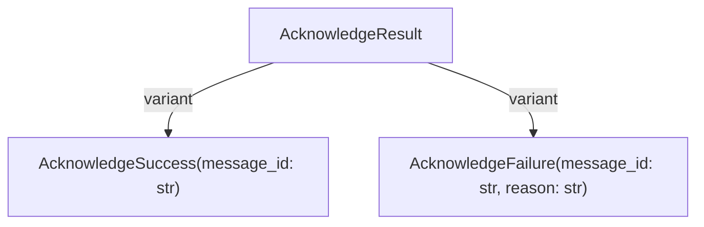
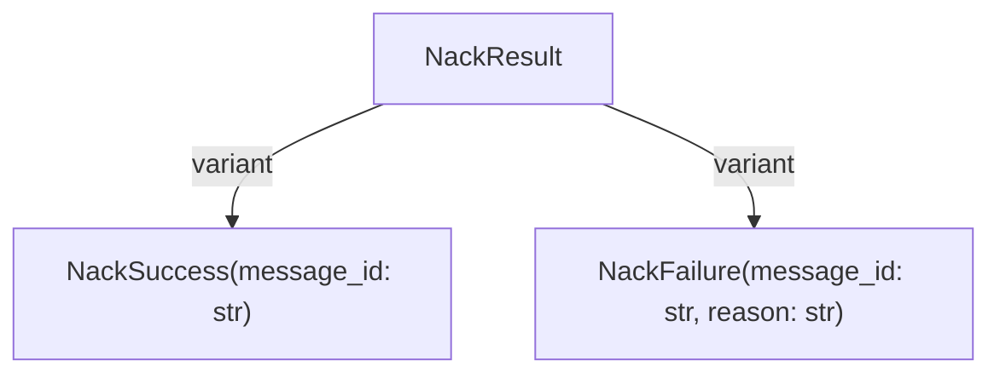

# Messaging Effects API Reference

**Status**: Authoritative source
**Supersedes**: none
**Referenced by**: demo/healthhub/documents/api/messaging.md, documents/api/README.md, documents/api/effects.md, documents/api/interpreters.md, documents/api/storage.md, documents/documentation_standards.md, documents/engineering/functional_catalogue.md, documents/readme.md, documents/tutorials/messaging_effects.md

> **Purpose**: Reference for messaging effect types used for pub/sub communication with brokers like Apache Pulsar.

> **Note**: This API reference covers the legacy Python effectful library. For the Effectful Language, see [DSL Documentation](../dsl/intro.md).

## SSoT Link Map

| Need                      | Link                                                            |
| ------------------------- | --------------------------------------------------------------- |
| All effects overview      | [Effects API](effects.md)                                       |
| Messaging tutorial        | [Messaging Effects Tutorial](../tutorials/messaging_effects.md) |
| Testing messaging effects | [Testing](../engineering/testing.md)                            |
| Architecture patterns     | [Architecture](../engineering/architecture.md)                  |
| Effect patterns           | [Effect Patterns](../engineering/effect_patterns.md)            |

## Effect Types

### PublishMessage

Publishes a message to a topic.

```python
# file: examples/messaging.py
from effectful import PublishMessage, MessageEnvelope

@dataclass(frozen=True)
class PublishMessage:
    topic: str
    payload: bytes
    properties: dict[str, str] | None = None
```

**Parameters:**

- `topic` - The topic/queue name to publish to
- `payload` - Message content as bytes
- `properties` - Optional metadata key-value pairs

**Returns:** `PublishResult` (see Domain Models below)

**Example:**

```python
# file: examples/messaging.py
import json
from effectful import PublishMessage, PublishSuccess, PublishFailure

def publish_event(
    event_type: str, data: dict[str, str]
) -> Generator[AllEffects, EffectResult, bool]:
    payload = json.dumps({"type": event_type, "data": data}).encode()

    result = yield PublishMessage(
        topic="events",
        payload=payload,
        properties={"event_type": event_type}
    )

    match result:
        case PublishSuccess(message_id=mid):
            yield SendText(text=f"Published: {mid}")
            return True
        case PublishFailure(error=err):
            yield SendText(text=f"Publish failed: {err}")
            return False
```

### ConsumeMessage

Consumes a message from a topic with timeout.

```python
# file: examples/messaging.py
@dataclass(frozen=True)
class ConsumeMessage:
    topic: str
    subscription: str
    timeout_ms: int = 5000
```

**Parameters:**

- `topic` - The topic/queue name to consume from
- `subscription` - Subscription name for this consumer
- `timeout_ms` - Timeout in milliseconds (default: 5000)

**Returns:** `ConsumeResult` (see Domain Models below)

**Example:**

```python
# file: examples/messaging.py
from effectful import ConsumeMessage, MessageEnvelope, ConsumeTimeout

def process_messages(
    topic: str
) -> Generator[AllEffects, EffectResult, int]:
    processed = 0

    while True:
        result = yield ConsumeMessage(
            topic=topic,
            subscription="my-subscription",
            timeout_ms=1000
        )

        match result:
            case MessageEnvelope() as msg:
                # Process the message
                yield SendText(text=f"Received: {msg.payload.decode()}")
                yield AcknowledgeMessage(message_id=msg.message_id, topic=topic)
                processed += 1
            case ConsumeTimeout():
                # No more messages
                break

    return processed
```

### AcknowledgeMessage

Acknowledges successful processing of a message.

```python
# file: examples/messaging.py
@dataclass(frozen=True)
class AcknowledgeMessage:
    message_id: str
    topic: str
```

**Parameters:**

- `message_id` - The ID of the message to acknowledge
- `topic` - The topic the message came from

**Returns:** `None`

**Example:**

```python
# file: examples/messaging.py
from effectful import AcknowledgeMessage, MessageEnvelope

def handle_message(
    msg: MessageEnvelope
) -> Generator[AllEffects, EffectResult, None]:
    # Process message...
    process_payload(msg.payload)

    # Acknowledge after successful processing
    yield AcknowledgeMessage(
        message_id=msg.message_id,
        topic=msg.topic
    )
```

### NegativeAcknowledge

Negative acknowledgment - signals processing failure for redelivery.

```python
# file: examples/messaging.py
@dataclass(frozen=True)
class NegativeAcknowledge:
    message_id: str
    topic: str
```

**Parameters:**

- `message_id` - The ID of the message to nack
- `topic` - The topic the message came from

**Returns:** `None`

**Example:**

```python
# file: examples/messaging.py
from effectful import NegativeAcknowledge, MessageEnvelope

def handle_with_retry(
    msg: MessageEnvelope
) -> Generator[AllEffects, EffectResult, bool]:
    try:
        result = process_payload(msg.payload)
        if result:
            yield AcknowledgeMessage(
                message_id=msg.message_id,
                topic=msg.topic
            )
            return True
        else:
            # Processing failed, request redelivery
            yield NegativeAcknowledge(
                message_id=msg.message_id,
                topic=msg.topic
            )
            return False
    except Exception:
        yield NegativeAcknowledge(
            message_id=msg.message_id,
            topic=msg.topic
        )
        return False
```

## Domain Models

### MessageEnvelope

Container for a consumed message with metadata.

```python
# file: examples/messaging.py
@dataclass(frozen=True)
class MessageEnvelope:
    message_id: str
    topic: str
    payload: bytes
    properties: dict[str, str]
    publish_time: datetime
```

**Fields:**

- `message_id` - Unique identifier for the message
- `topic` - Topic the message was consumed from
- `payload` - Message content as bytes
- `properties` - Metadata key-value pairs
- `publish_time` - When the message was published

### PublishResult

ADT for publish operation outcomes.

````mermaid
flowchart TB
  %% kind: ADT
  %% id: effectful.domain.message_envelope.PublishResult
  %% summary: Outcomes for publishing a message

  PublishResult
  PublishResult -->|variant| PublishResult_PublishSuccess
  PublishResult -->|variant| PublishResult_PublishFailure

  PublishResult_PublishSuccess["PublishSuccess(message_id: str)"]
  PublishResult_PublishFailure["PublishFailure(error: str)"]
```text

```python
# file: examples/messaging.py
type PublishResult = PublishSuccess | PublishFailure

@dataclass(frozen=True)
class PublishSuccess:
    message_id: str

@dataclass(frozen=True)
class PublishFailure:
    error: str
````

**Pattern Matching:**

```python
# file: examples/messaging.py
result = yield PublishMessage(topic="events", payload=data)

match result:
    case PublishSuccess(message_id=mid):
        # Handle success
        pass
    case PublishFailure(error=err):
        # Handle failure
        pass
```

### ConsumeResult

ADT for consume operation outcomes.

````mermaid
flowchart TB
  %% kind: ADT
  %% id: effectful.domain.message_envelope.ConsumeResult
  %% summary: Outcomes for consuming a message

  ConsumeResult
  ConsumeResult -->|variant| ConsumeResult_MessageEnvelope
  ConsumeResult -->|variant| ConsumeResult_ConsumeTimeout
  ConsumeResult -->|variant| ConsumeResult_ConsumeFailure

  ConsumeResult_MessageEnvelope["MessageEnvelope(message_id: str, topic: str, payload: bytes, properties: dict[str, str], publish_time: datetime)"]
  ConsumeResult_ConsumeTimeout["ConsumeTimeout()"]
  ConsumeResult_ConsumeFailure["ConsumeFailure(error: str)"]
```text

```python
# file: examples/messaging.py
type ConsumeResult = MessageEnvelope | ConsumeTimeout

@dataclass(frozen=True)
class ConsumeTimeout:
    pass

@dataclass(frozen=True)
class ConsumeFailure:
    error: str
````

### AcknowledgeResult

ADT for acknowledgment outcomes.



### NackResult

ADT for negative-acknowledgment outcomes.



**Pattern Matching:**

```python
# file: examples/messaging.py
result = yield ConsumeMessage(topic="events", subscription="sub")

match result:
    case MessageEnvelope() as msg:
        # Process message
        pass
    case ConsumeTimeout():
        # No message available
        pass
```

## Error Handling

The `MessagingInterpreter` may return `MessagingError` for infrastructure failures:

```python
# file: examples/messaging.py
from effectful import MessagingError

result = await run_ws_program(my_program(), interpreter)

match result:
    case Ok(value):
        print(f"Success: {value}")
    case Err(MessagingError(message=msg)):
        print(f"Messaging error: {msg}")
    case Err(error):
        print(f"Other error: {error}")
```

## Complete Workflow Example

```python
# file: examples/messaging.py
from collections.abc import Generator
from effectful import (
    AllEffects,
    EffectResult,
    PublishMessage,
    ConsumeMessage,
    AcknowledgeMessage,
    NegativeAcknowledge,
    MessageEnvelope,
    ConsumeTimeout,
    PublishSuccess,
    PublishFailure,
    SendText,
)
import json

def event_processor() -> Generator[AllEffects, EffectResult, dict[str, int]]:
    """Process events from queue and publish results."""
    stats = {"processed": 0, "failed": 0}

    while True:
        # Consume next message
        result = yield ConsumeMessage(
            topic="incoming-events",
            subscription="processor",
            timeout_ms=2000
        )

        match result:
            case ConsumeTimeout():
                break

            case MessageEnvelope() as msg:
                # Parse and process
                try:
                    event = json.loads(msg.payload)
                    processed = {"original": event, "status": "processed"}

                    # Publish result
                    pub_result = yield PublishMessage(
                        topic="processed-events",
                        payload=json.dumps(processed).encode(),
                        properties={"source_id": msg.message_id}
                    )

                    match pub_result:
                        case PublishSuccess():
                            yield AcknowledgeMessage(
                                message_id=msg.message_id,
                                topic=msg.topic
                            )
                            stats["processed"] += 1
                        case PublishFailure():
                            yield NegativeAcknowledge(
                                message_id=msg.message_id,
                                topic=msg.topic
                            )
                            stats["failed"] += 1

                except json.JSONDecodeError:
                    yield NegativeAcknowledge(
                        message_id=msg.message_id,
                        topic=msg.topic
                    )
                    stats["failed"] += 1

    yield SendText(text=f"Stats: {stats}")
    return stats
```

## SSoT Link Map

| Need                                        | Link                                                            |
| ------------------------------------------- | --------------------------------------------------------------- |
| Overview of all effect types                | [Effects Overview](effects.md)                                  |
| Storage effects (S3/object storage)         | [Storage Effects](storage.md)                                   |
| MessagingInterpreter implementation details | [Interpreters](interpreters.md)                                 |
| Step-by-step messaging tutorial             | [Messaging Effects Tutorial](../tutorials/messaging_effects.md) |
| Result type for error handling              | [Result API](result.md)                                         |
| Program composition patterns                | [Programs API](programs.md)                                     |
| Effect patterns                             | [Effect Patterns](../engineering/effect_patterns.md)            |
| Testing messaging effects                   | [Testing Guide](../tutorials/testing_guide.md)                  |

## See Also

- [Effects Overview](effects.md) - All effect types
- [Storage Effects](storage.md) - S3/object storage effects
- [Interpreters](interpreters.md) - MessagingInterpreter details
- [Tutorial: Messaging Effects](../tutorials/messaging_effects.md) - Step-by-step guide

______________________________________________________________________

## Cross-References

- [Documentation Standards](../documentation_standards.md)
- [Engineering Architecture](../engineering/architecture.md)
