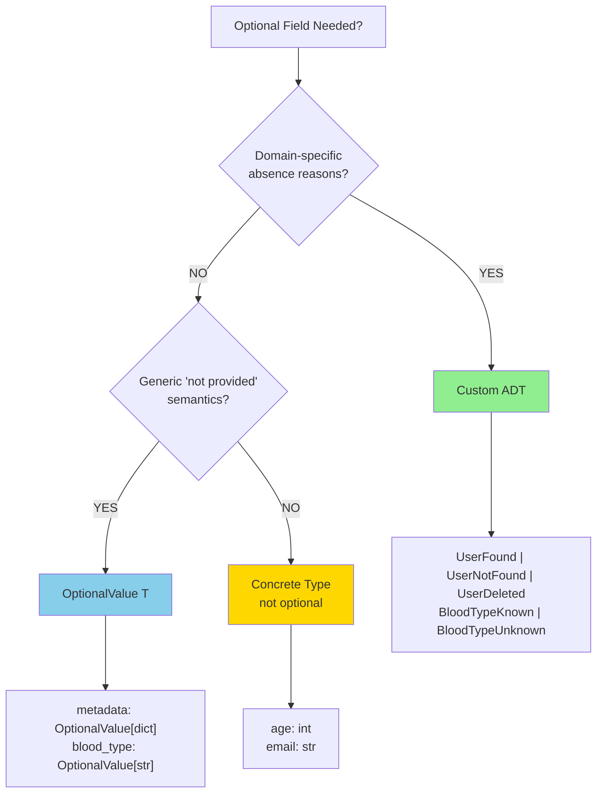

# OptionalValue API

**Status**: Authoritative source
**Supersedes**: none
**Referenced by**: tutorials/adts_and_results.md, engineering/architecture.md, engineering/code_quality.md, engineering/effect_patterns.md

> **Purpose**: Core ADT for representing optional values using functional algebraic data types instead of Python's Optional; provides explicit absence reasons and type-safe pattern matching.

---

## Overview

OptionalValue is a lightweight algebraic data type (ADT) that represents values that may be present or intentionally absent with an explicit reason. It replaces bare `Optional[T]` usage while maintaining ergonomic APIs and type safety.

**Why OptionalValue exists:**
- **Explicit absence**: `Absent(reason="not_provided")` is more informative than `None`
- **Type safety**: Pattern matching ensures all cases are handled exhaustively
- **Semantic clarity**: Distinguishes between "value not provided" vs "value unknown" vs domain-specific reasons
- **Simpler than custom ADTs**: When you only need generic "present or absent" semantics

**When to use OptionalValue:**
- Generic optional fields in domain models (e.g., `blood_type: OptionalValue[str]`)
- Effect parameters that may be absent (e.g., `metadata: OptionalValue[dict[str, str]]`)
- Any field with "present or absent" semantics where absence has no domain-specific meaning

**When NOT to use OptionalValue:**
- Domain-specific absence reasons → Use custom ADT (e.g., `UserFound | UserNotFound | UserDeleted`)
- Always-present fields → Use concrete type (e.g., `age: int`, not `OptionalValue[int]`)
- External API boundaries → Convert to `T | None` with `from_optional_value()`

See [Decision Tree](#decision-tree-optional-vs-optionalvalue-vs-custom-adt) for complete guidance.

---

## API Reference

### Provided[T]

Represents a value that is present.

```python
@dataclass(frozen=True)
class Provided(Generic[T_co]):
    """Represents a present value."""
    value: T_co
```

**Type Parameters:**
- `T_co`: Covariant type parameter (read-only, allows subtype substitution)

**Fields:**
- `value: T_co` - The present value

**Example:**
```python
from effectful.domain.optional_value import Provided

blood_type = Provided(value="O+")
metadata = Provided(value={"content-type": "application/json"})
```

---

### Absent[T]

Represents a value that is intentionally missing with a reason.

```python
@dataclass(frozen=True)
class Absent(Generic[T_co]):
    """Represents an intentionally missing value with a reason."""
    reason: str = "not_provided"
```

**Type Parameters:**
- `T_co`: Covariant type parameter (read-only, allows subtype substitution)

**Fields:**
- `reason: str` - Explanation for why the value is absent (default: `"not_provided"`)

**Common reason values:**
- `"not_provided"` - Value not supplied by user (default)
- `"not_requested"` - Value not requested in query
- `"not_disclosed"` - Value withheld for privacy
- `"not_applicable"` - Value doesn't apply in this context

**Example:**
```python
from effectful.domain.optional_value import Absent

blood_type = Absent(reason="not_provided")
metadata = Absent(reason="not_requested")
notes = Absent(reason="not_disclosed")
```

---

### OptionalValue[T]

Type alias representing either a present value or an absent value.

```python
type OptionalValue[T_co] = Provided[T_co] | Absent[T_co]
```

**Type Parameters:**
- `T_co`: Covariant type parameter (read-only)

**Usage:**
```python
from effectful.domain.optional_value import OptionalValue, Provided, Absent

# Type annotation
metadata: OptionalValue[dict[str, str]]

# Pattern matching
match metadata:
    case Provided(value=data):
        print(f"Metadata: {data}")
    case Absent(reason=r):
        print(f"No metadata: {r}")
```

---

## Helper Functions

### to_optional_value()

Convert an optional value (`T | None`) into the OptionalValue ADT.

**Signature:**
```python
def to_optional_value(
    value: T_co | None,
    *,
    reason: str = "not_provided"
) -> OptionalValue[T_co]
```

**Parameters:**
- `value: T_co | None` - The value to convert (None becomes Absent, T becomes Provided)
- `reason: str` - Reason string if value is None (default: `"not_provided"`)

**Returns:**
- `OptionalValue[T_co]` - Either `Provided(value)` or `Absent(reason)`

**Examples:**
```python
from effectful.domain.optional_value import to_optional_value

# Convert present value
result = to_optional_value("O+")
# Result: Provided(value="O+")

# Convert None with default reason
result = to_optional_value(None)
# Result: Absent(reason="not_provided")

# Convert None with custom reason
result = to_optional_value(None, reason="not_disclosed")
# Result: Absent(reason="not_disclosed")
```

**Use case:** Converting from external APIs or user input that use `None` sentinel.

---

### from_optional_value()

Convert OptionalValue back to an optional sentinel (`T | None`) for external APIs.

**Signature:**
```python
def from_optional_value(optional_value: OptionalValue[T_co]) -> T_co | None
```

**Parameters:**
- `optional_value: OptionalValue[T_co]` - The OptionalValue to convert

**Returns:**
- `T_co | None` - The wrapped value if Provided, None if Absent

**Examples:**
```python
from effectful.domain.optional_value import from_optional_value, Provided, Absent

# Convert Provided → value
result = from_optional_value(Provided(value="O+"))
# Result: "O+"

# Convert Absent → None
result = from_optional_value(Absent(reason="not_provided"))
# Result: None
```

**Use case:** Converting to external APIs (boto3, sqlalchemy, etc.) that expect `None` sentinel.

See [Pattern 4: Boundary Conversion](#pattern-4-boundary-conversion) for complete examples.

---

## Pattern 1: Basic Usage

### Constructing OptionalValue

**Option 1: Direct construction**
```python
from effectful.domain.optional_value import Provided, Absent

# Present value
blood_type = Provided(value="O+")

# Absent value
blood_type = Absent(reason="not_provided")
```

**Option 2: Helper function**
```python
from effectful.domain.optional_value import to_optional_value

# From value
blood_type = to_optional_value("O+")  # → Provided(value="O+")

# From None
blood_type = to_optional_value(None)  # → Absent(reason="not_provided")

# From None with custom reason
blood_type = to_optional_value(None, reason="not_disclosed")
```

### Pattern Matching

**Exhaustive matching with match/case:**
```python
from effectful.domain.optional_value import Provided, Absent

match blood_type:
    case Provided(value=bt):
        print(f"Blood type: {bt}")
    case Absent(reason=r):
        print(f"Blood type unknown: {r}")
```

**Type narrowing with isinstance:**
```python
if isinstance(blood_type, Provided):
    # Type narrowed: blood_type.value is accessible
    print(f"Blood type: {blood_type.value}")
elif isinstance(blood_type, Absent):
    # Type narrowed: blood_type.reason is accessible
    print(f"Blood type unknown: {blood_type.reason}")
```

---

## Pattern 2: Domain Models

Use OptionalValue for generic optional fields in domain models where absence has no domain-specific meaning.

**Example: Patient Demographics**

```python
from dataclasses import dataclass
from uuid import UUID
from effectful.domain.optional_value import OptionalValue, Provided, Absent

@dataclass(frozen=True)
class Patient:
    id: UUID
    name: str
    email: str
    blood_type: OptionalValue[str]  # Generic: provided or not provided

# Construction
patient = Patient(
    id=UUID("..."),
    name="Alice",
    email="alice@example.com",
    blood_type=Provided(value="O+")
)

# Pattern matching
match patient.blood_type:
    case Provided(value=bt):
        print(f"Blood type on file: {bt}")
    case Absent(reason="not_provided"):
        print("Blood type not provided")
    case Absent(reason="not_disclosed"):
        print("Patient declined to disclose blood type")
```

**Testing:**
```python
def test_patient_with_blood_type() -> None:
    patient = Patient(
        id=uuid4(),
        name="Alice",
        email="alice@example.com",
        blood_type=Provided(value="O+")
    )

    assert isinstance(patient.blood_type, Provided)
    assert patient.blood_type.value == "O+"

def test_patient_without_blood_type() -> None:
    patient = Patient(
        id=uuid4(),
        name="Bob",
        email="bob@example.com",
        blood_type=Absent(reason="not_provided")
    )

    assert isinstance(patient.blood_type, Absent)
    assert patient.blood_type.reason == "not_provided"
```

---

## Pattern 3: Effect Parameters (THE CANONICAL NORMALIZATION PATTERN)

**Problem:** Users want ergonomic APIs when constructing effects:
```python
# Allow all three forms:
yield PutObject(bucket="x", key="y", content=b"z", metadata={"k": "v"})  # dict
yield PutObject(bucket="x", key="y", content=b"z")  # None (default)
yield PutObject(bucket="x", key="y", content=b"z", metadata=Absent(reason="redacted"))  # OptionalValue
```

But effects should store normalized `OptionalValue[T]` internally for type safety and pattern matching.

**Solution:** Local type-specific normalization in `__init__`.

### THE CANONICAL PATTERN

**Replicate this pattern in your effects:**

```python
from dataclasses import dataclass
from effectful.domain.optional_value import OptionalValue, Provided, Absent, to_optional_value

# Local normalization function - type-specific, 4 lines, simple
def _normalize_optional_value(
    value: dict[str, str] | OptionalValue[dict[str, str]] | None,
) -> OptionalValue[dict[str, str]]:
    """Normalize plain values into OptionalValue ADT."""
    if isinstance(value, (Provided, Absent)):
        return value
    return to_optional_value(value)

@dataclass(frozen=True, init=False)
class PutObject:
    bucket: str
    key: str
    content: bytes
    metadata: OptionalValue[dict[str, str]]  # Always OptionalValue internally

    def __init__(
        self,
        bucket: str,
        key: str,
        content: bytes,
        metadata: dict[str, str] | OptionalValue[dict[str, str]] | None = None,
    ) -> None:
        """Create PutObject effect with ergonomic metadata parameter.

        Args:
            bucket: S3 bucket name
            key: Object key
            content: Object content bytes
            metadata: Optional metadata dict (normalized to OptionalValue)
        """
        # Normalize to OptionalValue before storing
        object.__setattr__(self, "bucket", bucket)
        object.__setattr__(self, "key", key)
        object.__setattr__(self, "content", content)
        object.__setattr__(self, "metadata", _normalize_optional_value(metadata))
```

### Why Local (Not Shared)?

**This is NOT duplication to fix.** Each `_normalize_optional_value()` function is:

1. **Type-specific** - Handles concrete types (`dict[str, str]`, `int`, `str`, not generic `T`)
2. **Simple** - 4 lines, single isinstance check, no complex logic
3. **Local** - Used only in one module's `__init__` methods
4. **Pattern** - Intentionally replicated, like `frozen=True` or `@dataclass`

**Extracting to shared utility would:**
- Lose type specificity (requires complex generic constraints)
- Add unnecessary indirection (import + function call overhead)
- Create import dependencies (violates locality principle)
- Reduce clarity (one-line normalization becomes import + call)

**Think of it like `frozen=True`:** You write `@dataclass(frozen=True)` in every file. That's not duplication—it's a pattern. Same here.

### Usage Examples

**Ergonomic API:**
```python
# Pass dict directly (normalized to Provided)
effect = PutObject(bucket="my-bucket", key="file.txt", content=b"data", metadata={"type": "json"})

# Omit parameter (normalized to Absent with default reason)
effect = PutObject(bucket="my-bucket", key="file.txt", content=b"data")

# Pass OptionalValue explicitly (idempotent - no normalization needed)
effect = PutObject(bucket="my-bucket", key="file.txt", content=b"data", metadata=Absent(reason="redacted"))
```

**Internal representation (always OptionalValue):**
```python
effect = PutObject(bucket="my-bucket", key="file.txt", content=b"data", metadata={"type": "json"})

# Always normalized to OptionalValue
assert isinstance(effect.metadata, Provided)
assert effect.metadata.value == {"type": "json"}
```

### Testing Pattern

```python
def test_put_object_normalizes_metadata_dict() -> None:
    """Test that dict is normalized to Provided."""
    effect = PutObject(bucket="b", key="k", content=b"", metadata={"x": "y"})

    assert isinstance(effect.metadata, Provided)
    assert effect.metadata.value == {"x": "y"}

def test_put_object_normalizes_metadata_none() -> None:
    """Test that None (default) is normalized to Absent."""
    effect = PutObject(bucket="b", key="k", content=b"")

    assert isinstance(effect.metadata, Absent)
    assert effect.metadata.reason == "not_provided"

def test_put_object_normalizes_metadata_optional_value() -> None:
    """Test that OptionalValue is idempotent (no change)."""
    effect = PutObject(bucket="b", key="k", content=b"", metadata=Absent(reason="custom"))

    assert isinstance(effect.metadata, Absent)
    assert effect.metadata.reason == "custom"
```

### When to Use This Pattern

Use local normalization when:
- Effect has optional parameters
- Want ergonomic API (allow `T`, `None`, or `OptionalValue[T]`)
- Need type-safe storage (always `OptionalValue[T]` internally)
- Each parameter has concrete type (not generic across effects)

**See also:** [Effect Patterns: Pattern 6 - Boundary Normalization](../engineering/effect_patterns.md#pattern-6-boundary-normalization-for-optionalvalue)

---

## Pattern 4: Boundary Conversion

Use `from_optional_value()` to convert OptionalValue back to `T | None` when calling external APIs (boto3, sqlalchemy, etc.).

**Example: S3 Storage Adapter**

```python
from effectful.domain.optional_value import from_optional_value, OptionalValue

class S3StorageAdapter:
    async def put_object(
        self,
        bucket: str,
        key: str,
        content: bytes,
        metadata: OptionalValue[dict[str, str]],
        content_type: OptionalValue[str],
    ) -> PutObjectResult:
        """Put object to S3, converting OptionalValue to Optional for boto3."""

        # Convert OptionalValue → Optional for external API
        metadata_dict: dict[str, str] | None = from_optional_value(metadata)
        content_type_str: str | None = from_optional_value(content_type)

        # boto3 expects Optional (None), not OptionalValue
        if metadata_dict is not None and content_type_str is not None:
            response = self._s3_client.put_object(
                Bucket=bucket,
                Key=key,
                Body=content,
                Metadata=metadata_dict,
                ContentType=content_type_str,
            )
        elif metadata_dict is not None:
            response = self._s3_client.put_object(
                Bucket=bucket,
                Key=key,
                Body=content,
                Metadata=metadata_dict,
            )
        # ... handle other cases ...

        return PutObjectSuccess(key=key, version_id=response["VersionId"])
```

**Pattern:**
1. **Effect parameters** use OptionalValue (type-safe, explicit reasons)
2. **Boundary conversion** uses `from_optional_value()` before calling external APIs
3. **External APIs** receive `T | None` (their expected format)

**See also:** Real-world example in `effectful/adapters/s3_storage.py`

---

## Decision Tree: Optional vs OptionalValue vs Custom ADT

Use this decision tree to choose the right approach:



### Examples by Scenario

| Field | Choice | Reason |
|-------|--------|--------|
| User lookup result | Custom ADT: `UserFound \| UserNotFound \| UserDeleted` | Domain-specific reasons (not found vs deleted vs access denied) |
| Blood type | OptionalValue[str] | Generic optional (provided or not provided, no domain semantics) |
| Effect metadata | OptionalValue[dict[str, str]] | Generic optional parameter (present or absent) |
| Patient age | int | Always present (not optional) |
| Cache lookup | Custom ADT: `CacheHit \| CacheMiss` | Domain-specific (cache semantics matter) |
| Doctor notes | OptionalValue[str] | Generic optional (provided or not provided) |

### Decision Logic

**Use Custom ADT when:**
- Absence has domain-specific meaning (`UserNotFound` vs `UserDeleted`)
- Multiple absence reasons exist
- Presence/absence is a domain concept (e.g., cache hit/miss)
- Type system should enforce handling of all cases

**Use OptionalValue[T] when:**
- Generic "provided or not provided" semantics
- No domain-specific absence reasons
- Field is optional data (not optional behavior)
- Want ergonomic API without custom types

**Use Concrete Type when:**
- Field is always present (never optional)
- Absence would be an error (not a valid state)

---

## Testing Patterns

### Testing Effects with OptionalValue

```python
from effectful.effects.storage import PutObject
from effectful.domain.optional_value import Provided, Absent

def test_effect_with_provided_metadata() -> None:
    """Test effect construction with metadata present."""
    effect = PutObject(
        bucket="test-bucket",
        key="test.txt",
        content=b"data",
        metadata={"content-type": "text/plain"}
    )

    # Verify normalization to Provided
    assert isinstance(effect.metadata, Provided)
    assert effect.metadata.value == {"content-type": "text/plain"}

def test_effect_with_absent_metadata() -> None:
    """Test effect construction with metadata absent."""
    effect = PutObject(
        bucket="test-bucket",
        key="test.txt",
        content=b"data"
    )

    # Verify normalization to Absent
    assert isinstance(effect.metadata, Absent)
    assert effect.metadata.reason == "not_provided"
```

### Testing Generator Programs

```python
from collections.abc import Generator
from effectful.domain.optional_value import Provided, Absent, OptionalValue

def greet_patient(patient_id: UUID) -> Generator[AllEffects, EffectResult, str]:
    """Program that greets patient with optional blood type."""
    patient = yield GetPatient(patient_id=patient_id)

    match patient.blood_type:
        case Provided(value=bt):
            greeting = f"Hello {patient.name}, blood type: {bt}"
        case Absent(reason="not_provided"):
            greeting = f"Hello {patient.name}"
        case Absent(reason=r):
            greeting = f"Hello {patient.name} (blood type: {r})"

    yield SendText(text=greeting)
    return greeting

def test_greet_patient_with_blood_type(fake_interpreter: Interpreter) -> None:
    """Test greeting with blood type provided."""
    patient = Patient(
        id=uuid4(),
        name="Alice",
        email="alice@example.com",
        blood_type=Provided(value="O+")
    )

    fake_interpreter.register_effect_result(GetPatient, patient)

    result = await run_program(greet_patient(patient.id), fake_interpreter)

    assert_ok(result)
    value = unwrap_ok(result)
    assert value == "Hello Alice, blood type: O+"
```

---

## Common Mistakes & Anti-Patterns

### Anti-Pattern 1: Using Optional for Domain Fields

**Problem:** `Optional[T]` hides WHY the value is None.

```python
# ❌ WRONG: Optional hides absence reason
from typing import Optional

@dataclass(frozen=True)
class Patient:
    blood_type: Optional[str]  # Why None? Not provided? Unknown? Refused to answer?

# None - ambiguous
patient = Patient(blood_type=None)
```

**Fix:** Use OptionalValue with explicit reason.

```python
# ✅ CORRECT: OptionalValue makes absence explicit
from effectful.domain.optional_value import OptionalValue, Absent

@dataclass(frozen=True)
class Patient:
    blood_type: OptionalValue[str]  # Explicitly: Provided or Absent with reason

# Explicit reason
patient = Patient(blood_type=Absent(reason="not_provided"))
patient = Patient(blood_type=Absent(reason="not_disclosed"))
```

**See:** [Code Quality: Doctrine 2 - ADTs Over Optional Types](../engineering/code_quality.md#2-adts-over-optional-types)

---

### Anti-Pattern 2: Custom ADT for Generic Absence

**Problem:** Over-engineering with custom ADT when OptionalValue suffices.

```python
# ❌ WRONG: Overly complex for generic optional
@dataclass(frozen=True)
class MetadataProvided:
    value: dict[str, str]

@dataclass(frozen=True)
class MetadataAbsent:
    reason: str

type MetadataField = MetadataProvided | MetadataAbsent

# Too much boilerplate
metadata: MetadataField = MetadataProvided(value={"k": "v"})
```

**Fix:** Use OptionalValue for generic "provided or not" semantics.

```python
# ✅ CORRECT: OptionalValue for generic optional
from effectful.domain.optional_value import OptionalValue, Provided

metadata: OptionalValue[dict[str, str]] = Provided(value={"k": "v"})
```

**Rule:** If absence has no domain-specific meaning, use OptionalValue. If absence has semantic importance (e.g., `UserDeleted` vs `UserNotFound`), use custom ADT.

---

### Anti-Pattern 3: Sharing Normalization Logic

**Problem:** Trying to extract `_normalize_optional_value()` to shared utility.

```python
# ❌ WRONG: Premature abstraction
# In effectful/utils/normalization.py
from typing import TypeVar
T = TypeVar("T")

def normalize_optional_value(
    value: T | OptionalValue[T] | None
) -> OptionalValue[T]:  # Generic T loses type specificity!
    if isinstance(value, (Provided, Absent)):
        return value
    return to_optional_value(value)

# In effect module
from effectful.utils.normalization import normalize_optional_value

@dataclass(frozen=True, init=False)
class PutObject:
    metadata: OptionalValue[dict[str, str]]

    def __init__(self, ..., metadata: dict[str, str] | OptionalValue[dict[str, str]] | None = None):
        object.__setattr__(self, "metadata", normalize_optional_value(metadata))
        # ^^ Loses dict[str, str] specificity, requires complex generics
```

**Fix:** Keep normalization local and type-specific.

```python
# ✅ CORRECT: Local, type-specific normalization (THE CANONICAL PATTERN)
# In effect module (local)
def _normalize_optional_value(
    value: dict[str, str] | OptionalValue[dict[str, str]] | None,
) -> OptionalValue[dict[str, str]]:  # Concrete type preserved!
    if isinstance(value, (Provided, Absent)):
        return value
    return to_optional_value(value)

@dataclass(frozen=True, init=False)
class PutObject:
    metadata: OptionalValue[dict[str, str]]

    def __init__(self, ..., metadata: dict[str, str] | OptionalValue[dict[str, str]] | None = None):
        object.__setattr__(self, "metadata", _normalize_optional_value(metadata))
```

**Why local is correct:**
1. **Type-specific** - Each effect has concrete types (dict, int, str), not generic T
2. **Simple** - 4 lines, single isinstance check, trivial
3. **Local** - Used only in one module's __init__ methods
4. **Pattern** - Replicate like `frozen=True`, not extract like shared logic

**See:** [Pattern 3: Effect Parameters](#pattern-3-effect-parameters-the-canonical-normalization-pattern) for complete explanation.

---

### Anti-Pattern 4: Manual Pattern Matching Instead of from_optional_value()

**Problem:** Manually extracting value with pattern matching when calling external APIs.

```python
# ❌ WRONG: Manual extraction at boundary
metadata_dict = effect.metadata.value if isinstance(effect.metadata, Provided) else None

s3_client.put_object(Bucket=bucket, Key=key, Body=content, Metadata=metadata_dict)
```

**Fix:** Use `from_optional_value()` for boundary conversion.

```python
# ✅ CORRECT: Use helper for boundary conversion
from effectful.domain.optional_value import from_optional_value

metadata_dict = from_optional_value(effect.metadata)

s3_client.put_object(Bucket=bucket, Key=key, Body=content, Metadata=metadata_dict)
```

**See:** [Pattern 4: Boundary Conversion](#pattern-4-boundary-conversion)

---

## References

**Related Documentation:**
- [Architecture: Why ADTs Instead of Optional?](../engineering/architecture.md#why-adts-instead-of-optional)
- [Code Quality: Doctrine 2 - ADTs Over Optional Types](../engineering/code_quality.md#2-adts-over-optional-types)
- [Effect Patterns: Pattern 6 - Boundary Normalization](../engineering/effect_patterns.md#pattern-6-boundary-normalization-for-optionalvalue)
- [Tutorial: ADTs and Results](../tutorials/adts_and_results.md)

**Source Code:**
- Implementation: `effectful/domain/optional_value.py`
- Real-world usage: `demo/healthhub/backend/app/` (JWT claims, healthcare effects, notifications)
- Examples: `examples/optional_value.py`

**Related Types:**
- [Result Type API](result.md) - For fallible operations with explicit errors
- [Custom ADTs](../tutorials/adts_and_results.md) - For domain-specific union types

---

## Cross-References
- [Architecture: Why ADTs Instead of Optional?](../engineering/architecture.md#why-adts-instead-of-optional)
- [Code Quality: Doctrine 2 - ADTs Over Optional Types](../engineering/code_quality.md#2-adts-over-optional-types)
- [Effect Patterns: Pattern 6 - Boundary Normalization](../engineering/effect_patterns.md#pattern-6-boundary-normalization-for-optionalvalue)
- [Tutorial: ADTs and Results](../tutorials/adts_and_results.md)
- [Result Type API](result.md)
