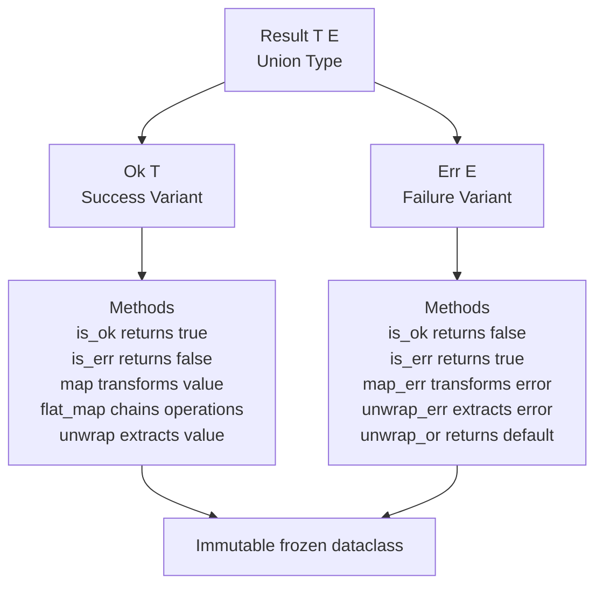

# Result Type API Reference

This document provides a comprehensive reference for the `Result[T, E]` type and related utilities.

## Overview

The `Result[T, E]` type represents either success (`Ok[T]`) or failure (`Err[E]`). It makes error handling explicit in type signatures, eliminating hidden exceptions and forcing callers to handle both success and error cases.

## Type Definition

```python
type Result[T, E] = Ok[T] | Err[E]
```

**Type Parameters**:
- `T` - The success value type
- `E` - The error type

### Result Type Structure

The following diagram shows the Result type structure as an Algebraic Data Type (ADT):



**Key Properties:**
- **Sum Type**: A Result is exactly one of two variants (Ok or Err)
- **Immutable**: Both variants are frozen dataclasses
- **Type Safe**: Pattern matching ensures all cases handled
- **Composable**: Methods like `map` and `flat_map` enable chaining

## Ok[T] - Success Variant

### Construction

```python
from effectful import Ok

success: Result[int, str] = Ok(42)
```

### Methods

#### `is_ok() -> bool`

Check if this result is a success.

```python
result = Ok(42)
assert result.is_ok() is True
```

#### `is_err() -> bool`

Check if this result is a failure.

```python
result = Ok(42)
assert result.is_err() is False
```

#### `map[U](f: Callable[[T], U]) -> Ok[U]`

Transform the success value.

```python
result = Ok(42)
doubled = result.map(lambda x: x * 2)
assert doubled == Ok(84)
```

#### `flat_map[U, E](f: Callable[[T], Result[U, E]]) -> Result[U, E]`

Chain another Result-producing computation (monadic bind).

```python
def divide(x: int) -> Result[int, str]:
    if x == 0:
        return Err("division by zero")
    return Ok(100 // x)

result = Ok(10)
chained = result.flat_map(divide)
assert chained == Ok(10)

result_zero = Ok(0)
chained_err = result_zero.flat_map(divide)
assert chained_err == Err("division by zero")
```

#### `map_err[F](f: Callable[[E], F]) -> Ok[T]`

Transform the error value (no-op for Ok).

```python
result = Ok(42)
mapped = result.map_err(lambda e: f"Error: {e}")
assert mapped == Ok(42)  # Unchanged
```

#### `unwrap() -> T`

Extract the success value (safe for Ok).

```python
result = Ok(42)
value = result.unwrap()
assert value == 42
```

#### `unwrap_or[U](default: U) -> T`

Extract the value or return default (returns value for Ok).

```python
result = Ok(42)
value = result.unwrap_or(0)
assert value == 42  # Returns actual value, not default
```

#### `unwrap_err() -> Never`

Extract the error value (raises ValueError for Ok).

```python
result = Ok(42)
# result.unwrap_err()  # Raises ValueError
```

---

## Err[E] - Failure Variant

### Construction

```python
from effectful import Err

failure: Result[int, str] = Err("not found")
```

### Methods

#### `is_ok() -> bool`

Check if this result is a success.

```python
result = Err("failed")
assert result.is_ok() is False
```

#### `is_err() -> bool`

Check if this result is a failure.

```python
result = Err("failed")
assert result.is_err() is True
```

#### `map[T, U](f: Callable[[T], U]) -> Err[E]`

Transform the success value (no-op for Err).

```python
result: Result[int, str] = Err("failed")
doubled = result.map(lambda x: x * 2)
assert doubled == Err("failed")  # Unchanged
```

#### `flat_map[T, U](f: Callable[[T], Result[U, E]]) -> Err[E]`

Chain another Result-producing computation (no-op for Err).

```python
def process(x: int) -> Result[int, str]:
    return Ok(x * 2)

result: Result[int, str] = Err("failed")
chained = result.flat_map(process)
assert chained == Err("failed")  # Short-circuits
```

#### `map_err[F](f: Callable[[E], F]) -> Err[F]`

Transform the error value.

```python
result = Err("not found")
mapped = result.map_err(lambda e: f"Error: {e}")
assert mapped == Err("Error: not found")
```

#### `unwrap() -> Never`

Extract the success value (raises ValueError for Err).

```python
result = Err("failed")
# result.unwrap()  # Raises ValueError
```

#### `unwrap_or[U](default: U) -> U`

Extract the value or return default (returns default for Err).

```python
result: Result[int, str] = Err("failed")
value = result.unwrap_or(0)
assert value == 0  # Returns default
```

#### `unwrap_err() -> E`

Extract the error value (safe for Err).

```python
result = Err("failed")
error = result.unwrap_err()
assert error == "failed"
```

---

## Pattern Matching

The recommended way to handle Result values is pattern matching:

```python
from effectful import Result, Ok, Err

def process(result: Result[int, str]) -> str:
    match result:
        case Ok(value):
            return f"Success: {value}"
        case Err(error):
            return f"Error: {error}"
```

### Type Narrowing

Pattern matching automatically narrows types:

```python
result: Result[int, str] = Ok(42)

match result:
    case Ok(value):
        # value has type int here
        doubled = value * 2
    case Err(error):
        # error has type str here
        print(f"Failed: {error}")
```

### Exhaustiveness

Pattern matching ensures all cases are handled:

```python
# MyPy error: Missing case Err
def incomplete(result: Result[int, str]) -> int:
    match result:
        case Ok(value):
            return value
    # Missing Err case - type checker catches this!
```

---

## EffectReturn[T] Wrapper

Effects return their values wrapped in `EffectReturn[T]` for debugging and telemetry.

### Type Definition

```python
@dataclass(frozen=True)
class EffectReturn[T]:
    value: T
    effect_name: str
```

### Usage

Interpreters wrap effect results:

```python
from effectful import EffectReturn, SendText

# Interpreter returns:
Ok(EffectReturn(value=None, effect_name="SendText"))
```

Programs receive unwrapped values:

```python
# In program code, you work with the value directly:
def program() -> Generator[AllEffects, EffectResult, None]:
    # SendText returns None, not EffectReturn[None]
    yield SendText(text="Hello")
    return None
```

### Methods

#### `map[U](f: Callable[[T], U]) -> EffectReturn[U]`

Transform the wrapped value while preserving effect_name:

```python
result = EffectReturn(42, "GetCount")
doubled = result.map(lambda x: x * 2)
assert doubled == EffectReturn(84, "GetCount")
```

---

## Utility Functions

### fold_result

Exhaustive pattern matching as a function:

```python
from effectful.algebraic.result import fold_result

def process_value(result: Result[int, str]) -> int:
    return fold_result(
        result,
        on_ok=lambda value: value * 2,
        on_err=lambda _: 0,
    )

assert process_value(Ok(21)) == 42
assert process_value(Err("failed")) == 0
```

**Type Signature**:
```python
def fold_result[T, E, R](
    result: Result[T, E],
    on_ok: Callable[[T], R],
    on_err: Callable[[E], R],
) -> R
```

---

## Common Patterns

### Chaining Operations

Use `flat_map` to chain Result-producing operations:

```python
from effectful import Result, Ok, Err

def parse_int(s: str) -> Result[int, str]:
    try:
        return Ok(int(s))
    except ValueError:
        return Err(f"Invalid integer: {s}")

def divide_by_two(n: int) -> Result[float, str]:
    if n % 2 != 0:
        return Err("Not divisible by 2")
    return Ok(n / 2)

result = (
    parse_int("42")
    .flat_map(divide_by_two)
    .map(lambda x: f"Result: {x}")
)
assert result == Ok("Result: 21.0")
```

### Error Transformation

Use `map_err` to enrich error information:

```python
from effectful import Result, Err

def fetch_user(user_id: int) -> Result[User, str]:
    # ... database operation
    return Err("not found")

result = fetch_user(123).map_err(
    lambda e: f"Failed to fetch user 123: {e}"
)
assert result == Err("Failed to fetch user 123: not found")
```

### Default Values

Use `unwrap_or` for safe defaults:

```python
from effectful import Result, Ok, Err

def get_count(cache_key: str) -> Result[int, str]:
    # ... cache lookup
    return Err("cache miss")

count = get_count("page_views").unwrap_or(0)
assert count == 0  # Uses default on error
```

### Converting Exceptions to Results

Wrap exception-throwing code:

```python
from effectful import Result, Ok, Err

def safe_divide(a: int, b: int) -> Result[float, str]:
    try:
        return Ok(a / b)
    except ZeroDivisionError:
        return Err("division by zero")

assert safe_divide(10, 2) == Ok(5.0)
assert safe_divide(10, 0) == Err("division by zero")
```

### Railway-Oriented Programming

Chain operations that stop on first error:

```python
from effectful import Result, Ok, Err

def validate_email(email: str) -> Result[str, str]:
    if "@" not in email:
        return Err("Invalid email: missing @")
    return Ok(email)

def validate_length(email: str) -> Result[str, str]:
    if len(email) < 5:
        return Err("Invalid email: too short")
    return Ok(email)

def create_user(email: str) -> Result[User, str]:
    return (
        validate_email(email)
        .flat_map(validate_length)
        .map(lambda e: User(email=e))
    )

# Stops at first error:
assert create_user("bad") == Err("Invalid email: missing @")
assert create_user("a@b") == Err("Invalid email: too short")
```

---

## Type Safety

### No Hidden Exceptions

Result types make errors explicit in function signatures:

```python
# ❌ Hidden exception - caller doesn't know it can fail
def fetch_user(user_id: int) -> User:
    # May raise DatabaseError - caller unaware!
    ...

# ✅ Explicit error - type signature shows it can fail
def fetch_user(user_id: int) -> Result[User, DatabaseError]:
    # Caller MUST handle both Ok and Err cases
    ...
```

### Forced Error Handling

Pattern matching ensures all cases are handled:

```python
def process(user_id: int) -> str:
    result = fetch_user(user_id)

    # Type checker ensures both cases handled:
    match result:
        case Ok(user):
            return f"Found: {user.name}"
        case Err(error):
            return f"Error: {error}"
```

### Generic Type Preservation

Result types preserve generic information:

```python
def map_twice[T](result: Result[T, str]) -> Result[T, str]:
    return result.map(lambda x: x).map(lambda x: x)

# Type checker infers:
# int_result: Result[int, str]
int_result = map_twice(Ok(42))
```

---

## See Also

- [Effects API](./effects.md) - Effect types that return Results
- [Interpreters API](./interpreters.md) - How interpreters return Results
- [Programs API](./programs.md) - Program execution with Result types
- [Testing API](./testing.md) - Testing Result values
