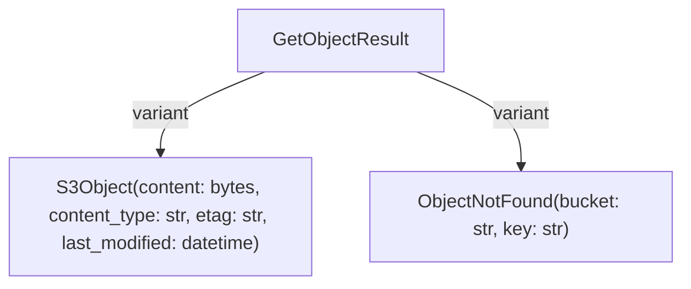

# Storage Effects API Reference

**Status**: Authoritative source
**Supersedes**: none
**Referenced by**: api/README.md, api/effects.md, api/messaging.md, tutorials/storage_effects.md, engineering/functional_catalogue.md, readme.md

> **Purpose**: Reference for storage effect types used for S3-compatible object storage operations.

> **Note**: This API reference covers the legacy Python effectful library. For the Effectful Language, see [DSL Documentation](../dsl/intro.md).

> **Core Doctrine**: For S3 workflow patterns and error handling, see [Effect Patterns](../engineering/effect_patterns.md)

## SSoT Link Map

| Need                       | Link                                                                 |
| -------------------------- | -------------------------------------------------------------------- |
| S3 workflow patterns       | [Effect Patterns](../engineering/effect_patterns.md#state-machines)  |
| Effect hierarchy placement | [Architecture](../engineering/architecture.md#effect-type-hierarchy) |
| Storage effects tutorial   | [Storage Effects Tutorial](../tutorials/storage_effects.md)          |
| Testing storage effects    | [Testing](../engineering/testing.md)                                 |

______________________________________________________________________

## Effect Types

### GetObject

Retrieves an object from storage.

```python
# file: examples/storage.py
@dataclass(frozen=True)
class GetObject:
    bucket: str
    key: str
```

**Parameters:**

- `bucket` - The bucket/container name
- `key` - The object key/path

**Returns:** `S3Object | None`

**Example:**

```python
# file: examples/storage.py
from effectful import GetObject, S3Object, SendText

def download_file(
    bucket: str, key: str
) -> Generator[AllEffects, EffectResult, bytes | None]:
    result = yield GetObject(bucket=bucket, key=key)

    match result:
        case S3Object(content=data, content_type=ct):
            yield SendText(text=f"Downloaded {len(data)} bytes ({ct})")
            return data
        case None:
            yield SendText(text=f"Object not found: {key}")
            return None
```

### PutObject

Stores an object in storage.

```python
# file: examples/storage.py
@dataclass(frozen=True)
class PutObject:
    bucket: str
    key: str
    content: bytes
    content_type: str = "application/octet-stream"
```

**Parameters:**

- `bucket` - The bucket/container name
- `key` - The object key/path
- `content` - The data to store
- `content_type` - MIME type (default: "application/octet-stream")

**Returns:** `PutResult` (see Domain Models below)

**Example:**

```python
# file: examples/storage.py
from effectful import PutObject, PutSuccess, PutFailure
import json

def save_json(
    bucket: str, key: str, data: dict[str, str]
) -> Generator[AllEffects, EffectResult, bool]:
    content = json.dumps(data).encode()

    result = yield PutObject(
        bucket=bucket,
        key=key,
        content=content,
        content_type="application/json"
    )

    match result:
        case PutSuccess(etag=etag):
            yield SendText(text=f"Saved with ETag: {etag}")
            return True
        case PutFailure(error=err):
            yield SendText(text=f"Save failed: {err}")
            return False
```

### DeleteObject

Deletes an object from storage.

```python
# file: examples/storage.py
@dataclass(frozen=True)
class DeleteObject:
    bucket: str
    key: str
```

**Parameters:**

- `bucket` - The bucket/container name
- `key` - The object key/path

**Returns:** `bool` (True if deleted, False if not found)

**Example:**

```python
# file: examples/storage.py
from effectful import DeleteObject

def remove_file(
    bucket: str, key: str
) -> Generator[AllEffects, EffectResult, bool]:
    deleted = yield DeleteObject(bucket=bucket, key=key)

    if deleted:
        yield SendText(text=f"Deleted: {key}")
    else:
        yield SendText(text=f"Not found: {key}")

    return deleted
```

### ListObjects

Lists objects in a bucket with optional prefix filtering.

```python
# file: examples/storage.py
@dataclass(frozen=True)
class ListObjects:
    bucket: str
    prefix: str = ""
```

**Parameters:**

- `bucket` - The bucket/container name
- `prefix` - Filter objects by key prefix (default: "" for all)

**Returns:** `list[str]` (list of object keys)

**Example:**

```python
# file: examples/storage.py
from effectful import ListObjects

def list_user_files(
    bucket: str, user_id: str
) -> Generator[AllEffects, EffectResult, list[str]]:
    prefix = f"users/{user_id}/"
    keys = yield ListObjects(bucket=bucket, prefix=prefix)

    yield SendText(text=f"Found {len(keys)} files for user {user_id}")
    return keys
```

## Domain Models

### S3Object

Container for retrieved object data.

```python
# file: examples/storage.py
@dataclass(frozen=True)
class S3Object:
    content: bytes
    content_type: str
    etag: str
    last_modified: datetime
```

**Fields:**

- `content` - The object data
- `content_type` - MIME type of the content
- `etag` - Entity tag for versioning/caching
- `last_modified` - Last modification timestamp

### GetObjectResult

ADT for object retrieval outcomes.



### PutResult

ADT for put operation outcomes.

````mermaid
flowchart TB
  %% kind: ADT
  %% id: effectful.domain.s3_object.PutResult
  %% summary: Outcomes for storing an object

  PutResult
  PutResult -->|variant| PutResult_PutSuccess
  PutResult -->|variant| PutResult_PutFailure

  PutResult_PutSuccess["PutSuccess(etag: str)"]
  PutResult_PutFailure["PutFailure(error: str)"]
```text

```python
# file: examples/storage.py
type PutResult = PutSuccess | PutFailure

@dataclass(frozen=True)
class PutSuccess:
    etag: str

@dataclass(frozen=True)
class PutFailure:
    error: str
````

**Pattern Matching:**

```python
# file: examples/storage.py
result = yield PutObject(bucket="data", key="file.txt", content=b"hello")

match result:
    case PutSuccess(etag=etag):
        # Handle success - etag can be used for conditional updates
        pass
    case PutFailure(error=err):
        # Handle failure - err contains error message
        pass
```

## Error Handling

The `StorageInterpreter` may return `StorageError` for infrastructure failures:

```python
# file: examples/storage.py
from effectful import StorageError

result = await run_ws_program(my_program(), interpreter)

match result:
    case Ok(value):
        print(f"Success: {value}")
    case Err(StorageError(message=msg)):
        print(f"Storage error: {msg}")
    case Err(error):
        print(f"Other error: {error}")
```

## Complete Workflow Example

```python
# file: examples/storage.py
from collections.abc import Generator
from effectful import (
    AllEffects,
    EffectResult,
    GetObject,
    PutObject,
    DeleteObject,
    ListObjects,
    S3Object,
    PutSuccess,
    PutFailure,
    SendText,
)
import json
from datetime import datetime

def backup_and_archive(
    source_bucket: str,
    archive_bucket: str,
    prefix: str
) -> Generator[AllEffects, EffectResult, dict[str, int]]:
    """Backup files from source to archive bucket."""
    stats = {"copied": 0, "failed": 0, "deleted": 0}

    # List all files to backup
    keys = yield ListObjects(bucket=source_bucket, prefix=prefix)
    yield SendText(text=f"Found {len(keys)} files to archive")

    for key in keys:
        # Get object from source
        obj = yield GetObject(bucket=source_bucket, key=key)

        if obj is None:
            stats["failed"] += 1
            continue

        assert isinstance(obj, S3Object)

        # Archive with timestamp prefix
        archive_key = f"archive/{datetime.now().isoformat()}/{key}"

        # Put in archive bucket
        result = yield PutObject(
            bucket=archive_bucket,
            key=archive_key,
            content=obj.content,
            content_type=obj.content_type
        )

        match result:
            case PutSuccess():
                stats["copied"] += 1

                # Delete from source after successful archive
                deleted = yield DeleteObject(bucket=source_bucket, key=key)
                if deleted:
                    stats["deleted"] += 1

            case PutFailure(error=err):
                yield SendText(text=f"Failed to archive {key}: {err}")
                stats["failed"] += 1

    yield SendText(text=f"Archive complete: {stats}")
    return stats


def generate_presigned_manifest(
    bucket: str,
    prefix: str
) -> Generator[AllEffects, EffectResult, bool]:
    """Generate a manifest of all objects in a prefix."""
    keys = yield ListObjects(bucket=bucket, prefix=prefix)

    manifest = {
        "bucket": bucket,
        "prefix": prefix,
        "count": len(keys),
        "objects": keys,
        "generated_at": datetime.now().isoformat()
    }

    result = yield PutObject(
        bucket=bucket,
        key=f"{prefix}manifest.json",
        content=json.dumps(manifest, indent=2).encode(),
        content_type="application/json"
    )

    match result:
        case PutSuccess():
            yield SendText(text=f"Manifest created with {len(keys)} objects")
            return True
        case PutFailure(error=err):
            yield SendText(text=f"Failed to create manifest: {err}")
            return False
```

## See Also

- [Effects Overview](effects.md) - All effect types
- [Messaging Effects](messaging.md) - Pub/sub messaging effects
- [Interpreters](interpreters.md) - StorageInterpreter details
- [Tutorial: Storage Effects](../tutorials/storage_effects.md) - Step-by-step guide

______________________________________________________________________

## Cross-References

- [Documentation Standards](../documentation_standards.md)
- [Engineering Architecture](../engineering/architecture.md)
