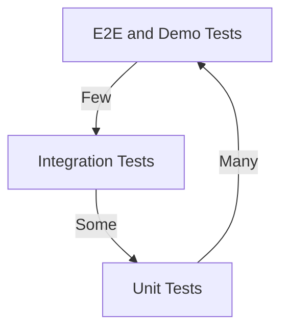
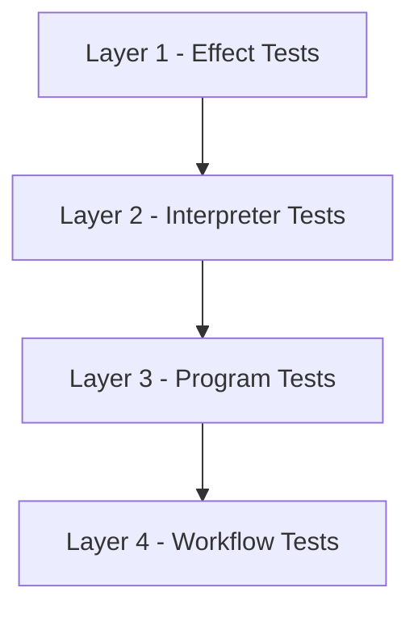
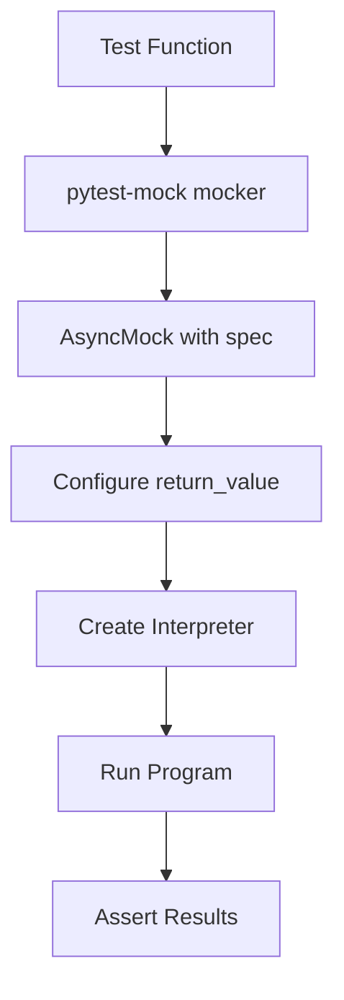
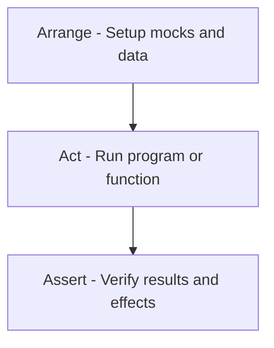
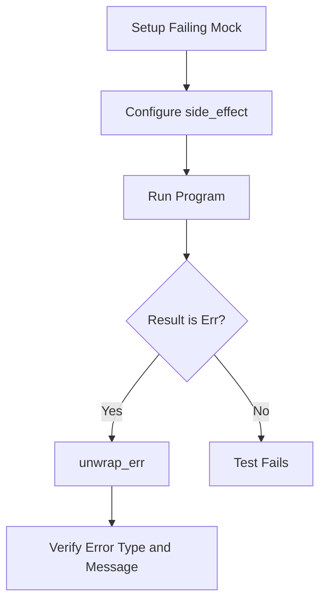

# Testing Doctrine

This is the Single Source of Truth (SSoT) for all testing policy in the Effectful project.

## Core Philosophy

**Tests exist to find problems, not provide false confidence.**

Testing is a gate, not a suggestion. If tests pass, the code should be correct. If code is incorrect, tests must fail.

---

## Test Execution Environment

**ALL tests run inside Docker containers. NEVER run tests locally.**

See [Docker Doctrine](./DOCKER_DOCTRINE.md) for complete policy.

### Running Tests

```bash
# All tests
docker compose -f docker/docker-compose.yml exec effectful poetry run pytest

# Unit tests only
docker compose -f docker/docker-compose.yml exec effectful poetry run pytest tests/unit

# Integration tests only
docker compose -f docker/docker-compose.yml exec effectful poetry run pytest tests/integration

# Specific test file
docker compose -f docker/docker-compose.yml exec effectful poetry run pytest tests/unit/test_interpreters/test_cache.py
```

### Why Docker-Only?

1. **Infrastructure Access**: Integration tests need PostgreSQL, Redis, MinIO, Pulsar
2. **Environment Consistency**: Same Python version, dependencies, system libraries
3. **Reproducibility**: Tests behave identically across all developer machines
4. **CI Parity**: Local tests match CI behavior exactly

---

## Coverage Doctrine

### Unit Tests: Minimum 45% Coverage

Unit tests must achieve **minimum 45% coverage** of library code in `effectful/`.

**What's measured:**
- `effectful/algebraic/` - Result types, EffectReturn
- `effectful/domain/` - Domain models
- `effectful/effects/` - Effect definitions
- `effectful/interpreters/` - Effect handlers
- `effectful/programs/` - Program runners
- `effectful/testing/` - Testing utilities

**What's excluded (intentionally):**
- `effectful/adapters/` - Infrastructure implementations (tested via integration)
- `effectful/infrastructure/` - Protocol definitions (no logic to test)

**Enforcement:** `--cov-fail-under=45` in pyproject.toml

**Note:** Actual coverage is ~69% overall. The minimum threshold ensures coverage doesn't regress.

### Integration Tests: Conceptual Feature Coverage

Integration tests achieve **conceptual feature coverage**, not metric-driven coverage.

**Goal:** Every user-facing feature has at least one integration test that validates the complete workflow with real infrastructure.

**Examples of features to cover:**
- User lookup workflow (database + cache)
- Message persistence workflow
- Authentication flow
- File upload/download
- Pub/sub messaging

**Not metric-driven:** Integration test coverage percentage is not a success criterion. What matters is that every feature works end-to-end.

---

## Test Pyramid



| Layer | Count | Speed | Infrastructure |
|-------|-------|-------|----------------|
| Unit | Many (200+) | Fast (<1s) | pytest-mock only |
| Integration | Some (27+) | Medium (~1s) | Real PostgreSQL/Redis/MinIO |
| E2E/Demo | Few | Slow | Full stack |

---

## Four Testing Layers



## Mock Setup Pattern



**Key Pattern:**
1. Use `mocker.AsyncMock(spec=Protocol)` for type-safe mocks
2. Configure `return_value` or `side_effect`
3. Inject mock into interpreter
4. Run program with `run_ws_program()`
5. Assert results and mock calls

---

## Test Structure Pattern



**Arrange-Act-Assert:**
- **Arrange**: Create mocks, configure behaviors, set up test data
- **Act**: Execute the code under test (single action)
- **Assert**: Verify return values, side effects, mock calls

---

### Layer 1: Effect Tests (Unit)

Test that effect dataclasses are correctly defined.

```python
def test_get_user_by_id_effect():
    effect = GetUserById(user_id=uuid4())
    assert effect.user_id is not None
    assert isinstance(effect, GetUserById)
```

### Layer 2: Interpreter Tests (Unit)

Test that interpreters correctly handle effects using pytest-mock.

```python
@pytest.mark.asyncio
async def test_database_interpreter_get_user(mocker):
    mock_repo = mocker.AsyncMock(spec=UserRepository)
    mock_repo.get_by_id.return_value = User(...)

    interpreter = DatabaseInterpreter(user_repo=mock_repo)
    result = await interpreter.handle(GetUserById(user_id=user_id))

    assert_ok(result)
    mock_repo.get_by_id.assert_called_once_with(user_id)
```

### Layer 3: Program Tests (Unit)

Test generator-based programs by manually stepping through the generator.

```python
def test_greet_user_program():
    user_id = uuid4()
    user = User(id=user_id, email="test@example.com", name="Alice")

    # Create generator
    gen = greet_user_program(user_id=user_id)

    # Step 1: GetUserById
    effect1 = next(gen)
    assert effect1.__class__.__name__ == "GetUserById"

    # Send mock response
    try:
        gen.send(user)
    except StopIteration as e:
        result = e.value

    assert result is True
```

### Layer 4: Workflow Tests (Integration)

Test complete workflows with real infrastructure.

```python
@pytest.mark.integration
@pytest.mark.asyncio
async def test_user_greeting_workflow(db_connection, redis_client):
    # Real database, real Redis
    result = await run_ws_program(greet_user(user_id), interpreter)
    assert_ok(result)

    # Verify database state
    user = await db_connection.fetch_one("SELECT * FROM users WHERE id = $1", user_id)
    assert user is not None
```

---

## Error Testing Pattern



**Error Testing Requirements:**
1. Create mock that raises/returns error
2. Run program expecting failure
3. Assert result is `Err`
4. Unwrap and verify error type
5. Check error message and properties

---

## Test Anti-Patterns (1-21)

### 1. Tests Pass When Features Broken
- **Wrong:** Expecting valid data to fail
- **Right:** Test that valid inputs return expected outputs

### 2. Accepting "Not Implemented" Errors
- **Wrong:** `assert result is None or isinstance(result, User)` - accepts missing implementation
- **Right:** `assert isinstance(result, User)` with error message

### 3. Silent Effect Failures
- **Wrong:** Accepting None from effects that should return values
- **Right:** Only accept typed success values

### 4. Testing Actions Without Validating Results
- **Wrong:** Yield effect, no verification of result
- **Right:** Yield effect, verify result type and value

### 5. Contradicting Domain Guarantees
- **Wrong:** Testing that required domain invariants don't hold
- **Right:** Verify domain invariants are maintained

### 6. Using pytest.skip()
- **Wrong:** `pytest.skip()` or `@pytest.mark.skip`
- **Right:** Let tests FAIL to expose gaps, or delete test

### 7. Hardcoded Success Tests
- **Wrong:** `assert True` - always passes
- **Right:** Validate actual behavior and return values

### 8. Overly Permissive Assertions
- **Wrong:** Accepting any non-None value
- **Right:** Only accept specific expected values

### 9. Lowered Standards
- **Wrong:** `assert len(result) > 0` - accepts anything non-empty
- **Right:** Validate specific expected values

### 10. Test Timeouts
- **Wrong:** Using `timeout` command to limit execution
- **Right:** Let tests complete naturally

### 11. Testing with Real Infrastructure in Unit Tests

```python
# WRONG - Unit tests depend on PostgreSQL, Redis, etc.
@pytest.mark.asyncio
async def test_user_lookup():
    async with asyncpg.connect(DATABASE_URL) as conn:  # Real DB!
        user = await UserRepository(conn).get_by_id(user_id)
        assert user is not None

# RIGHT - Use generator-based testing (no infrastructure)
def test_user_lookup():
    user_id = uuid4()
    user = User(id=user_id, email="test@example.com", name="Alice")

    # Create generator
    gen = greet_user_program(user_id=user_id)

    # Step through effects
    effect1 = next(gen)
    assert effect1.__class__.__name__ == "GetUserById"
    assert effect1.user_id == user_id

    # Send mock response
    try:
        gen.send(user)
    except StopIteration as e:
        result = e.value

    assert result is True
```

**Why:** Unit tests must be fast, deterministic, and isolated. Real infrastructure belongs in integration tests only.

### 12. Not Testing Error Paths

```python
# WRONG - Only testing happy path
def test_user_lookup():
    gen = get_user_program(user_id=user_id)
    effect1 = next(gen)
    # Only test success - what about None?

# RIGHT - Test error cases explicitly
def test_user_lookup_not_found():
    user_id = uuid4()

    # Create generator
    gen = get_user_program(user_id=user_id)

    # GetUserById effect
    effect1 = next(gen)
    assert effect1.__class__.__name__ == "GetUserById"

    # Send None (user not found)
    try:
        gen.send(None)
    except StopIteration as e:
        result = e.value

    # Verify error result
    assert isinstance(result, Err)
    assert "not found" in result.error.message
```

**Why:** Error handling is half your code. Test it.

### 13. Incomplete Assertions

```python
# WRONG - Only checking result succeeded
result = await run_ws_program(program(), interpreter)
assert_ok(result)  # Did the program do the right thing?

# RIGHT - Verify side effects and state changes
result = await run_ws_program(program(), interpreter)
value = unwrap_ok(result)

# Check return value
assert value == "success"

# Check side effects (when using mocks)
mock_websocket.send_text.assert_called_once_with("Hello Alice")

# Check state changes (when using real infrastructure)
assert len(await message_repo.get_all()) == 1
assert (await message_repo.get_all())[0].text == "Hello Alice"
```

**Why:** Programs have effects beyond return values. Verify the entire behavior.

### 14. Relaxed Validation
- **Wrong:** Default fallbacks for missing fields: `if not result: result = default`
- **Right:** Strict validation requiring all fields: `assert isinstance(result, ExpectedType)`

### 15. Disabling Test Infrastructure
- **Wrong:** Commenting out fixtures or test setup to make tests pass
- **Right:** Fix root cause of test failures

### 16. Masking Root Causes with Workarounds
- **Wrong:** Adding try/except to hide errors
- **Right:** Fix root cause, use Result type for expected errors

### 17. Trial-and-Error Debugging
- **Wrong:** Multiple conflicting "fixing tests" commits without diagnosis
- **Right:** Systematic: baseline, root cause, plan, fix, validate

### 18. Adding Unvalidated Features During Test Fixing
- **Wrong:** Adding new features while debugging test failures
- **Right:** Fix tests first, add features after tests pass

**Recovery Checklist:**
1. Document baseline failures
2. Investigate recent commits
3. Identify root causes (not symptoms)
4. Create systematic plan
5. Fix avoiding anti-patterns
6. Verify no new anti-patterns
7. Run full test suite

**Red Flags:** Multiple "fixing tests" commits in rapid succession, validation becoming less strict, infrastructure disabled instead of debugged, "temporary workaround" comments.

### 19. Test-Specific Environment Variables in Production Code
- **Wrong:** Checking `PYTEST_RUNNING`, `PYTEST_CURRENT_TEST` in library code
- **Wrong:** `if os.getenv("PYTEST_RUNNING"): return mock_value`
- **Right:** Use dependency injection: pass test doubles via constructor/parameters
- **Right:** Interpreter pattern allows swapping infrastructure without library code changes

**Impact:** Couples library logic to test infrastructure, creates nondeterministic behavior.

### 20. Holding Database Locks Across Test Execution
- **Wrong:** Executing TRUNCATE inside a transaction that wraps test execution
- **Wrong:** Yielding test fixtures while holding AccessExclusiveLock from TRUNCATE
- **Right:** TRUNCATE+seed before each test: Commit immediately, lock released before test runs

**Impact:** Tests timeout waiting for locks to release.

### 21. Docker Bind Mount Permission Issues (PostgreSQL Data Files)
- **Wrong:** Using bind mount `./pgdata:/var/lib/postgresql/data` on Docker Desktop for Mac
- **Wrong:** Files created with root ownership instead of postgres ownership
- **Wrong:** PostgreSQL cannot access its own data files during TRUNCATE
- **Right:** Named Docker volume: `pgdata:/var/lib/postgresql/data` ensures correct ownership
- **Right:** Docker manages volume permissions automatically

**Impact:** Tests fail non-deterministically with `Permission denied: could not open file`.

**Correct Solution (docker-compose.yml):**
```yaml
postgres:
  image: postgres:15-alpine
  volumes:
    - pgdata:/var/lib/postgresql/data  # Docker manages permissions

volumes:
  pgdata:
    driver: local
```

**Detection:**
- Error message: `could not open file "base/16384/XXXXX": Permission denied`
- Random test failures (different test each run)
- Works individually, fails in full suite

**Prevention:**
- Always use named volumes for PostgreSQL data
- Never use bind mounts for database files on Docker Desktop
- Verify file ownership after docker compose up

---

## Universal Success Criteria

All code changes must meet these requirements:

- Exit code 0 (all operations complete successfully)
- **Zero MyPy errors** (mypy --strict mandatory)
- Zero stderr output
- Zero console warnings/errors
- **Zero skipped tests** (pytest.skip() forbidden)
- 100% test pass rate
- **Zero `Any`, `cast()`, or `# type: ignore`** (escape hatches forbidden)
- **Minimum 45% unit test coverage** (library code, adapters excluded)
- **Integration tests cover all features** (conceptual coverage)

---

## Related Documentation

- **Testing Patterns:** `documents/testing/TESTING_PATTERNS.md` - Implementation patterns and examples
- **Test Suite Audit:** `documents/testing/TEST_SUITE_AUDIT.md` - Current test status
- **API Reference:** `documents/api/testing.md` - Testing utility functions
- **Tutorial:** `documents/tutorials/04_testing_guide.md` - Step-by-step guide

---

**Last Updated:** 2025-11-20
