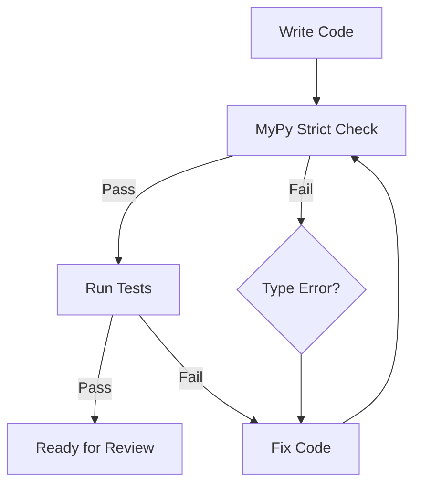
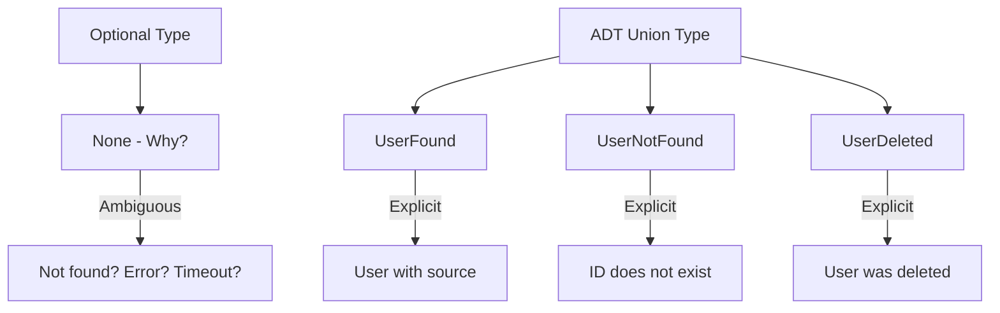
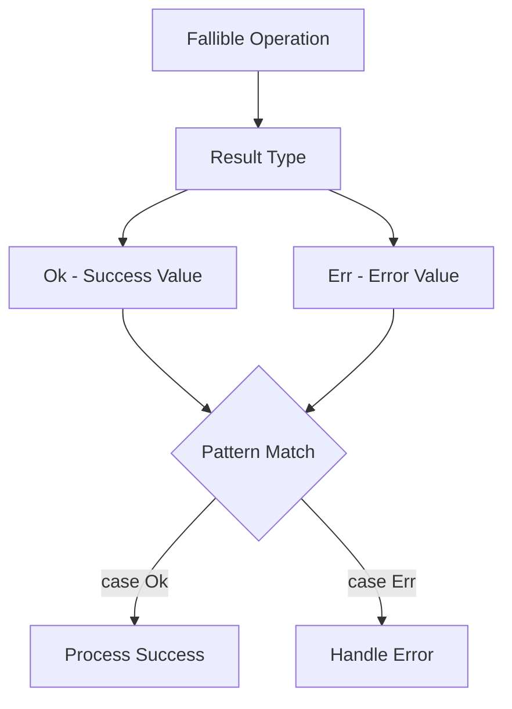
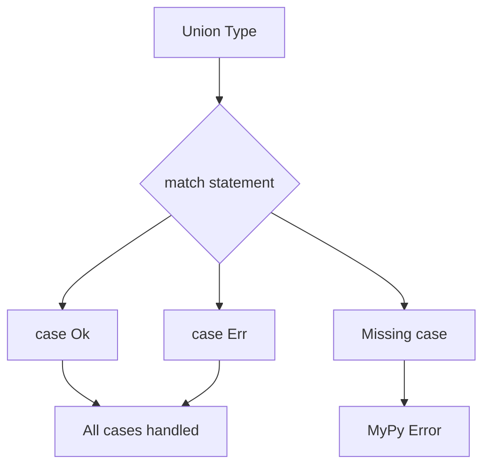
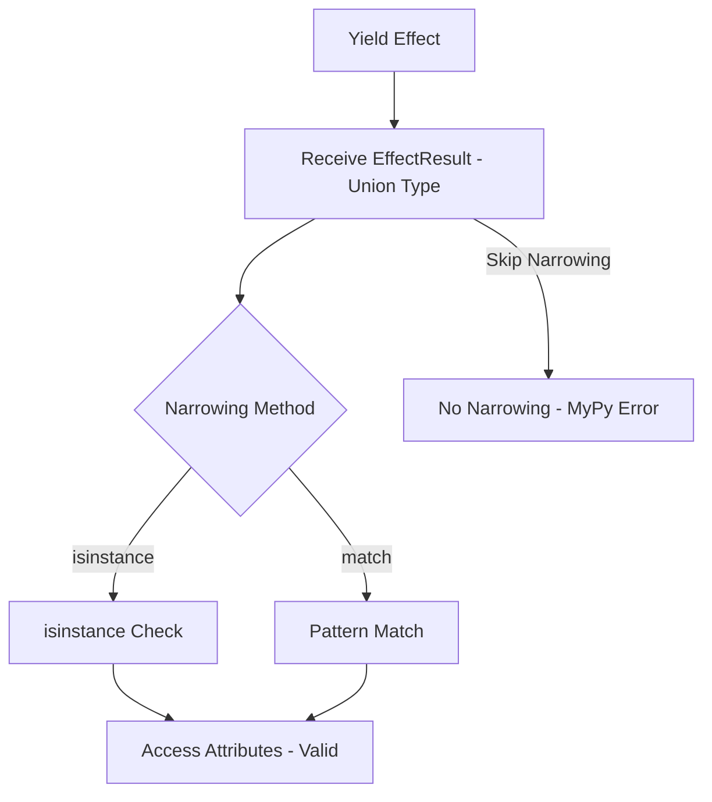

# Type Safety Doctrine

This is the Single Source of Truth (SSoT) for all type safety policy in the Effectful project.

## Core Principle

**Make invalid states unrepresentable through the type system.**

If the type checker passes, the program should be correct. The type system works for you, not against you.

---

## Type Safety Workflow



**Enforcement:**
- `mypy --strict` with `disallow_any_explicit = true`
- Zero tolerance for escape hatches
- All errors must be fixed before tests run
- Type checking is a gate, not a suggestion

---

## Eight Type Safety Doctrines

### 1. NO Escape Hatches

```python
# FORBIDDEN - These constructs are NEVER allowed
from typing import Any, cast

def process(data: Any) -> Any:  # NO!
    return cast(int, data)      # NO!

def transform(x):  # type: ignore  # NO!
    return x

# CORRECT - Explicit types always
from uuid import UUID
from effectful.algebraic.result import Result, Ok, Err
from effectful.domain.user import User

def process(user_id: UUID) -> Result[User, str]:
    if not isinstance(user_id, UUID):
        return Err("Invalid UUID")
    return Ok(User(id=user_id, email="test@example.com", name="Test"))
```

**Enforcement:** `mypy --strict` with `disallow_any_explicit = true` in pyproject.toml

### 2. ADTs Over Optional Types



```python
# WRONG - Optional hides the reason for None
from typing import Optional

async def get_user(user_id: UUID) -> Optional[User]:
    user = await db.query(...)
    return user  # Why is it None? Not found? Error? Timeout?

# CORRECT - ADT makes all cases explicit
from dataclasses import dataclass
from effectful.domain.user import User

@dataclass(frozen=True)
class UserFound:
    user: User
    source: str  # "database" | "cache"

@dataclass(frozen=True)
class UserNotFound:
    user_id: UUID
    reason: str  # "does_not_exist" | "deleted" | "access_denied"

type UserLookupResult = UserFound | UserNotFound

async def get_user(user_id: UUID) -> UserLookupResult:
    user = await db.query(...)
    if user is not None:
        return UserFound(user=user, source="database")
    return UserNotFound(user_id=user_id, reason="does_not_exist")

# Usage with exhaustive pattern matching
match result:
    case UserFound(user=user, source=source):
        print(f"Found {user.name} from {source}")
    case UserNotFound(user_id=uid, reason=reason):
        print(f"User {uid} not found: {reason}")
```

**Why:** ADTs force callers to handle all cases explicitly. The type system prevents forgetting edge cases.

### 3. Result Type for Error Handling



```python
# WRONG - Exceptions are invisible in type signatures
async def save_message(user_id: UUID, text: str) -> ChatMessage:
    # Raises ValueError? DatabaseError? Who knows!
    return await db.save(...)

# CORRECT - Errors are part of the type signature
from effectful.algebraic.result import Result, Ok, Err
from effectful.interpreters.errors import DatabaseError

async def save_message(
    user_id: UUID, text: str
) -> Result[ChatMessage, DatabaseError]:
    try:
        msg = await db.save(...)
        return Ok(msg)
    except Exception as e:
        return Err(DatabaseError(
            effect=SaveChatMessage(user_id=user_id, text=text),
            db_error=str(e),
            is_retryable=True
        ))

# Caller MUST handle errors
match result:
    case Ok(message):
        print(f"Saved: {message.id}")
    case Err(error):
        print(f"Failed: {error.db_error}")
        if error.is_retryable:
            await retry_logic()
```

**Why:** Errors become type-checked documentation. Impossible to forget error handling.

### 4. Immutability by Default

```python
# WRONG - Mutable state allows invalid mutations
from dataclasses import dataclass

@dataclass
class User:
    id: UUID
    email: str
    name: str

user = User(id=uuid4(), email="test@example.com", name="Alice")
user.email = None  # Oops! Type checker doesn't prevent this at runtime

# CORRECT - Frozen dataclasses prevent mutation
@dataclass(frozen=True)
class User:
    id: UUID
    email: str
    name: str

user = User(id=uuid4(), email="test@example.com", name="Alice")
# user.email = None  # Error: cannot assign to field 'email'

# To "update", create new instance
updated_user = User(id=user.id, email="new@example.com", name=user.name)
```

**Why:** Immutability eliminates entire classes of bugs (race conditions, unexpected mutations, temporal coupling).

### 5. Exhaustive Pattern Matching



```python
# WRONG - Non-exhaustive matching
from effectful.algebraic.result import Result, Ok, Err

def process(result: Result[int, str]) -> int:
    match result:
        case Ok(value):
            return value
    # Missing Err case - mypy error!

# CORRECT - Exhaustive matching
def process(result: Result[int, str]) -> int:
    match result:
        case Ok(value):
            return value
        case Err(error):
            print(f"Error: {error}")
            return 0
```

**Why:** Type checker enforces handling all cases. No forgotten branches.

### 6. Type Narrowing for Union Types



```python
# WRONG - Accessing union type attributes without narrowing
from effectful.effects.database import SaveChatMessage

def program() -> Generator[AllEffects, EffectResult, str]:
    message = yield SaveChatMessage(user_id=user_id, text="Hello")
    # Error: EffectResult is str | User | ChatMessage | None
    return f"Saved: {message.text}"  # mypy error!

# CORRECT - Type narrowing with isinstance
def program() -> Generator[AllEffects, EffectResult, str]:
    message = yield SaveChatMessage(user_id=user_id, text="Hello")
    assert isinstance(message, ChatMessage)  # Type narrowing
    return f"Saved: {message.text}"  # OK - mypy knows it's ChatMessage

# ALTERNATIVE - Pattern matching
def program() -> Generator[AllEffects, EffectResult, str]:
    message = yield SaveChatMessage(user_id=user_id, text="Hello")
    match message:
        case ChatMessage(id=msg_id, text=text):
            return f"Saved: {text}"
        case _:
            return "Unexpected type"
```

**Why:** Union types require explicit narrowing. Type checker ensures runtime type safety.

**Required Practices:**
- Always narrow union types before accessing variant-specific attributes
- Use `isinstance` for single-variant narrowing
- Use pattern matching for multi-variant ADTs
- MyPy will error if you forget to narrow - this is intentional

### 7. Generic Type Parameters

```python
# WRONG - Bare generic types lose information
def process(items: list) -> dict:  # What kind of list? What dict structure?
    return {str(i): item for i, item in enumerate(items)}

# CORRECT - Fully parameterized generics
def process(items: list[str]) -> dict[str, str]:
    return {str(i): item for i, item in enumerate(items)}

# CORRECT - Generic functions with TypeVar
from typing import TypeVar

T = TypeVar("T")

def first_or_none(items: list[T]) -> T | None:
    return items[0] if items else None

# Type checker infers: first_or_none([1, 2, 3]) -> int | None
```

**Why:** Generic parameters preserve type information through transformations.

### 8. PEP 695 Type Aliases

```python
# WRONG - String-based type aliases (deprecated)
from typing import Generator

EffectResult = "str | User | ChatMessage | None"  # NO!

# CORRECT - PEP 695 type aliases (Python 3.12+)
from collections.abc import Generator

type EffectResult = str | User | ChatMessage | ProfileData | CacheLookupResult | None

type WSProgram = Generator[AllEffects, EffectResult, None]

# Usage
def my_program() -> WSProgram:
    yield SendText(text="Hello")
    return None
```

**Why:** Type aliases are first-class citizens with proper IDE support and type checking.

---

## Implementation Anti-Patterns

### 1. Using `Any` Types
- **Wrong:** Function parameters or return types with `Any`
- **Right:** Explicit types always (see Doctrine 1)

### 2. Mutable Domain Models
- **Wrong:** Dataclasses without `frozen=True`
- **Right:** All domain models immutable: `@dataclass(frozen=True)`

### 3. Optional for Domain Logic
- **Wrong:** Returning `Optional[User]` from domain methods
- **Right:** ADT types: `UserLookupResult = UserFound | UserNotFound`

### 4. Exceptions for Expected Errors
- **Wrong:** Raising exceptions for expected failure cases
- **Right:** Result type: `Result[Success, Error]`

### 5. Imperative Effect Execution
- **Wrong:** Directly calling infrastructure in programs: `await db.query(...)`
- **Right:** Yield effects: `user = yield GetUserById(user_id=user_id)`

**Impact:** Breaks separation of concerns, makes testing difficult, couples business logic to infrastructure.

---

## MyPy Configuration

The following settings enforce type safety doctrines:

```toml
[tool.mypy]
python_version = "3.12"
strict = true
disallow_any_explicit = true
disallow_any_generics = true
disallow_subclassing_any = true
disallow_untyped_calls = true
disallow_untyped_defs = true
disallow_incomplete_defs = true
check_untyped_defs = true
disallow_untyped_decorators = true
warn_redundant_casts = true
warn_unused_ignores = true
warn_return_any = true
no_implicit_reexport = true
strict_equality = true
extra_checks = true
```

---

## Related Documentation

- **Result Type:** `effectful/algebraic/result.py`
- **ADT Examples:** `effectful/domain/user.py`, `effectful/domain/profile.py`
- **Type Aliases:** `effectful/programs/program_types.py`
- **Architecture:** `documents/core/ARCHITECTURE.md`

---

**Last Updated:** 2025-11-20
