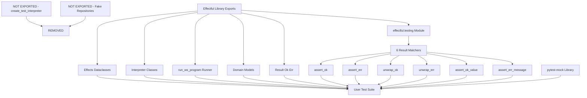
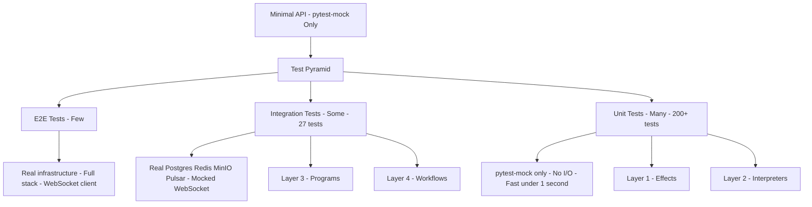
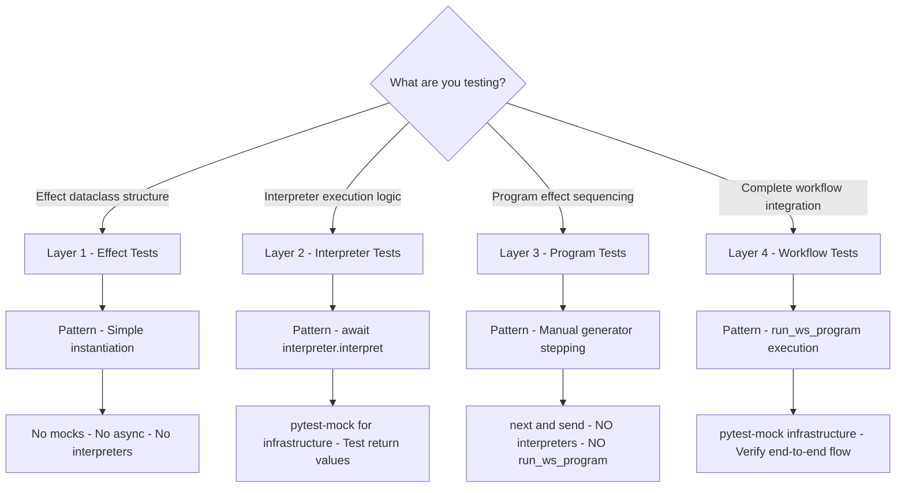
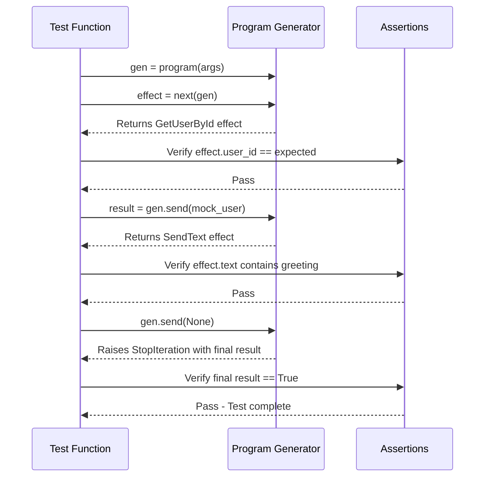
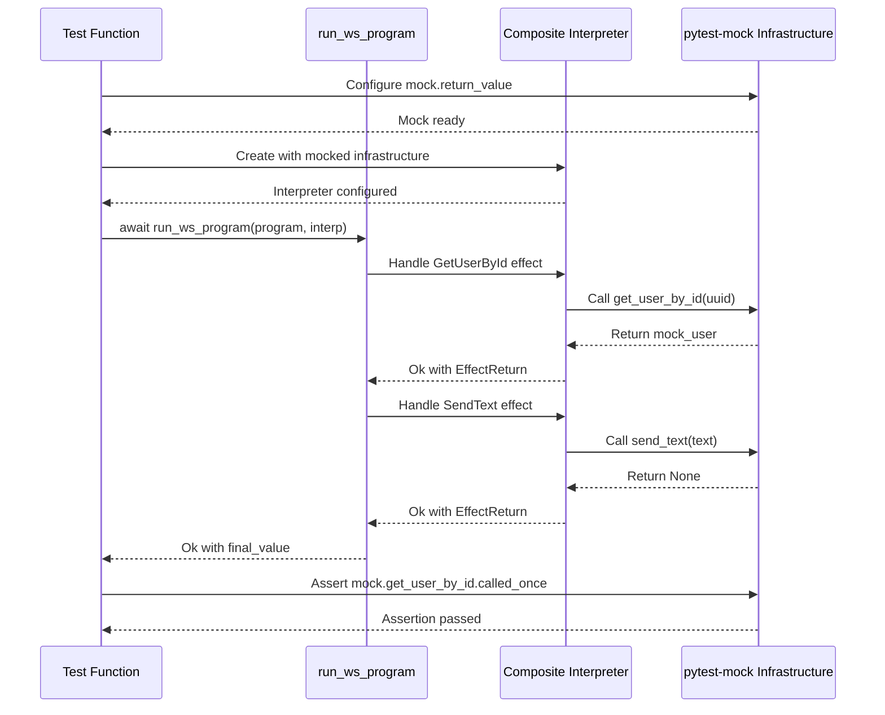

# Testing Doctrine

This is the Single Source of Truth (SSoT) for all testing policy in the Effectful project.

---

## Part 1: Minimal API Philosophy

### Core Testing Philosophy

**Tests exist to find problems, not provide false confidence.**

Testing is a gate, not a suggestion. If tests pass, the code should be correct. If code is incorrect, tests must fail.

### Why Matchers Are Part of the Library

The `effectful.testing` module exports **6 Result type matchers** as part of the public API:

```python
from effectful.testing import (
    assert_ok,           # Assert result is Ok
    assert_err,          # Assert result is Err
    unwrap_ok,           # Extract value from Ok or raise
    unwrap_err,          # Extract error from Err or raise
    assert_ok_value,     # Assert Ok with specific value
    assert_err_message,  # Assert Err with message substring
)
```

**These are Result type utilities**, not testing infrastructure. They solve a real DX problem: pattern matching boilerplate for Result types.

**Philosophy**: "Testable by Design" with batteries included. The library's value proposition includes testing support.

### What's Exported vs What's Not



**NOT exported**:
- ❌ `create_test_interpreter()` - Users should learn `CompositeInterpreter` explicitly
- ❌ Fake repositories - Use `pytest-mock` with `spec=` parameter
- ❌ Test fixtures - Integration test infrastructure only

### Pattern Matching vs Matchers

**Both approaches are valid**. Matchers are provided for convenience, not required.

**Approach 1: Pattern Matching (Verbose but Explicit)**
```python
from effectful import Ok, Err

match result:
    case Ok(value):
        assert value == expected
    case Err(error):
        pytest.fail(f"Expected Ok, got Err: {error}")
```

**Approach 2: Matchers (Concise)**
```python
from effectful.testing import assert_ok_value

assert_ok_value(result, expected)
```

**When to use matchers**:
- ✅ Quick assertions in simple tests
- ✅ Extracting values from Result types (`unwrap_ok`)
- ✅ When brevity improves readability

**When to use pattern matching**:
- ✅ Complex conditional logic based on Result
- ✅ Handling multiple Result variants in same block
- ✅ When you want explicit exhaustive matching

### pytest-mock for All Infrastructure

**ALL infrastructure mocking uses pytest-mock**, not library-provided fakes.

```python
from pytest_mock import MockerFixture
from effectful.infrastructure.repositories import UserRepository

@pytest.mark.asyncio
async def test_get_user(mocker: MockerFixture):
    # Create type-safe mock
    mock_repo = mocker.AsyncMock(spec=UserRepository)
    mock_repo.get_by_id.return_value = User(...)

    # Inject into interpreter
    interpreter = DatabaseInterpreter(user_repo=mock_repo)

    # Use in workflow test
    result = await run_ws_program(get_user_program(), interpreter)

    # Verify interactions
    mock_repo.get_by_id.assert_called_once()
```

**Why pytest-mock**:
- ✅ Type-safe with `spec=` parameter
- ✅ Industry standard, well-documented
- ✅ No maintenance burden for library
- ✅ Users learn transferable skills

---

## Part 2: Test Execution Environment

**ALL tests run inside Docker containers. NEVER run tests locally.**

See [Docker Doctrine](./docker_doctrine.md) for complete policy.

### Running Tests

```bash
# All tests
docker compose -f docker/docker-compose.yml exec effectful poetry run pytest

# Unit tests only
docker compose -f docker/docker-compose.yml exec effectful poetry run pytest tests/unit

# Integration tests only
docker compose -f docker/docker-compose.yml exec effectful poetry run pytest tests/integration

# Specific test file
docker compose -f docker/docker-compose.yml exec effectful poetry run pytest tests/unit/test_interpreters/test_cache.py
```

### Why Docker-Only?

1. **Infrastructure Access**: Integration tests need PostgreSQL, Redis, MinIO, Pulsar
2. **Environment Consistency**: Same Python version, dependencies, system libraries
3. **Reproducibility**: Tests behave identically across all developer machines
4. **CI Parity**: Local tests match CI behavior exactly

### Test Output Management

**CRITICAL**: Bash tool truncates output at 30,000 characters. Large test suites exceed this.

**Required pattern**:
```bash
# Run with output redirection
docker compose -f docker/docker-compose.yml exec effectful poetry run pytest > /tmp/test-output.txt 2>&1

# Read complete output (no size limits)
# Use Read tool on /tmp/test-output.txt
```

**Why**: File-based approach ensures complete output is always available for analysis.

---

## Part 3: Coverage Doctrine

### Unit Tests: Minimum 45% Coverage

Unit tests must achieve **minimum 45% coverage** of library code in `effectful/`.

**What's measured:**
- `effectful/algebraic/` - Result types, EffectReturn
- `effectful/domain/` - Domain models
- `effectful/effects/` - Effect definitions
- `effectful/interpreters/` - Effect handlers
- `effectful/programs/` - Program runners
- `effectful/testing/` - Testing utilities (matchers)

**What's excluded (intentionally):**
- `effectful/adapters/` - Infrastructure implementations (tested via integration)
- `effectful/infrastructure/` - Protocol definitions (no logic to test)

**Enforcement:** `--cov-fail-under=45` in pyproject.toml

**Note:** Actual coverage is ~69% overall. The minimum threshold ensures coverage doesn't regress.

### Integration Tests: Conceptual Feature Coverage

Integration tests achieve **conceptual feature coverage**, not metric-driven coverage.

**Goal:** Every user-facing feature has at least one integration test that validates the complete workflow with real infrastructure.

**Examples of features to cover:**
- User lookup workflow (database + cache)
- Message persistence workflow
- Authentication flow
- File upload/download
- Pub/sub messaging

**Not metric-driven:** Integration test coverage percentage is not a success criterion. What matters is that every feature works end-to-end.

---

## Part 4: Four-Layer Testing Architecture

### Test Pyramid



| Layer | Count | Speed | Infrastructure |
|-------|-------|-------|----------------|
| Unit | Many (200+) | Fast (<1s) | pytest-mock only |
| Integration | Some (27+) | Medium (~1s) | Real PostgreSQL/Redis/MinIO |
| E2E/Demo | Few | Slow | Full stack |

### Architecture Layers

**Each layer tests ONE concern**:
- **Effects** = **WHAT** to do (pure data)
- **Interpreters** = **HOW** to do it (execution)
- **Programs** = **WHEN** to do it (sequencing)
- **Workflows** = **WHY** to do it (business scenarios)

**Testability**: Each layer can be tested independently:
- **Effects**: No dependencies, just dataclass validation
- **Interpreters**: Mock infrastructure, focus on execution logic
- **Programs**: Mock effect results, focus on sequencing
- **Workflows**: Real interpreters + mocked infrastructure, focus on integration

### Layer 1: Effect Tests (Unit)

**Location**: `tests/test_effects/`

**Purpose**: Validate effect dataclass structure, immutability, and type safety.

**Pattern**: Simple instantiation and assertion.

```python
from effectful.effects.database import GetUserById

def test_get_user_by_id_structure():
    """Effect should be immutable with correct fields."""
    effect = GetUserById(user_id=uuid4())

    assert isinstance(effect, GetUserById)
    assert effect.user_id is not None

    # Verify immutability
    with pytest.raises(FrozenInstanceError):
        effect.user_id = uuid4()
```

**When to use**: Testing effect dataclass definitions.

**Do NOT**: Use interpreters or generators in effect tests.

### Layer 2: Interpreter Tests (Unit)

**Location**: `tests/test_interpreters/`

**Purpose**: Test effect execution against mocked infrastructure. Verify Result types, error handling, and retryability.

**Pattern**: Direct interpreter method calls with pytest-mock.

```python
from pytest_mock import MockerFixture
from effectful.interpreters.database import DatabaseInterpreter
from effectful.infrastructure.repositories import UserRepository

@pytest.mark.asyncio()
async def test_get_user_by_id_success(mocker: MockerFixture) -> None:
    """GetUserById with existing user should return Ok(EffectReturn(user))."""
    # Arrange - Mock infrastructure
    user = User(id=uuid4(), email="alice@example.com", name="Alice")
    mock_repo = mocker.AsyncMock(spec=UserRepository)
    mock_repo.get_by_id.return_value = user

    interpreter = DatabaseInterpreter(user_repo=mock_repo)
    effect = GetUserById(user_id=user.id)

    # Act
    result = await interpreter.interpret(effect)

    # Assert - Pattern match on Result
    match result:
        case Ok(EffectReturn(value=returned_user, effect_name="GetUserById")):
            assert returned_user == user
        case _:
            pytest.fail(f"Expected Ok(EffectReturn(user)), got {result}")

    # Verify mock interactions
    mock_repo.get_by_id.assert_awaited_once_with(user.id)
```

**Key points**:
- Use `mocker.AsyncMock(spec=Protocol)` for type safety
- Test both success (`Ok`) and error (`Err`) paths
- Verify retryability for errors
- Use pattern matching for Result validation
- Assert mock call counts and arguments

**When to use**: Testing individual interpreter implementations.

**Do NOT**: Use generators or run_ws_program in interpreter tests.

### Layer 3: Program Tests (Unit)

**Location**: `tests/test_demo/`

**Purpose**: Test program logic (effect sequencing, data transformations, conditional flows) in isolation.

**Pattern**: Manual generator stepping with `next()` and `gen.send()`.

```python
from demo.programs.user_programs import get_user_program

def test_get_user_program_success(mocker: MockerFixture) -> None:
    """Program should yield GetUserById and return Ok(user)."""
    # Arrange
    user_id = uuid4()
    user = User(id=user_id, email="alice@example.com", name="Alice")

    # Act - Step through program
    gen = get_user_program(user_id=user_id)

    # Step 1: Program yields GetUserById effect
    effect = next(gen)
    assert effect.__class__.__name__ == "GetUserById"
    assert effect.user_id == user_id

    # Step 2: Send mock user result, program completes
    try:
        gen.send(user)
        pytest.fail("Expected StopIteration")
    except StopIteration as e:
        result = e.value

    # Assert final result
    match result:
        case Ok(returned_user):
            assert returned_user == user
        case _:
            pytest.fail(f"Expected Ok(user), got {result}")
```

**Key points**:
- Programs are generators: use `next(gen)` to get next effect
- Use `gen.send(value)` to provide mock results
- Catch `StopIteration` to extract final return value
- Test effect sequencing and conditional logic
- NO interpreters - we're testing program logic only

**When to use**: Testing program business logic without infrastructure.

**Do NOT**: Use interpreters or run_ws_program in program tests.

### Layer 4: Workflow Tests (Integration)

**Location**: `tests/test_integration/`

**Purpose**: Test complete end-to-end workflows with interpreters executing against mocked infrastructure.

**Pattern**: `run_ws_program()` with pytest-mock infrastructure.

```python
from effectful.programs.runners import run_ws_program
from effectful.interpreters.composite import CompositeInterpreter

@pytest.mark.asyncio()
async def test_complete_user_workflow(mocker: MockerFixture) -> None:
    """Complete workflow: get user, update profile, verify update."""
    # Arrange - Mock infrastructure
    user_id = uuid4()
    user = User(id=user_id, email="alice@example.com", name="Alice")
    updated_user = User(id=user_id, email="alice@example.com", name="Alice Updated")

    mock_user_repo = mocker.AsyncMock(spec=UserRepository)
    mock_user_repo.get_by_id.return_value = user
    mock_user_repo.update.return_value = updated_user

    # Create interpreter with mocked infrastructure
    db_interpreter = DatabaseInterpreter(user_repo=mock_user_repo)
    interpreter = CompositeInterpreter(interpreters=[db_interpreter])

    # Define workflow program
    def update_user_workflow() -> Generator[AllEffects, EffectResult, User]:
        """Get user, update name, return updated user."""
        # Get existing user
        user_result = yield GetUserById(user_id=user_id)
        assert isinstance(user_result, User)

        # Update user name
        updated_result = yield UpdateUser(
            user_id=user_id,
            name="Alice Updated"
        )
        assert isinstance(updated_result, User)

        return updated_result

    # Act - Run complete workflow
    result = await run_ws_program(update_user_workflow(), interpreter)

    # Assert - Verify final result
    match result:
        case Ok(final_user):
            assert final_user.name == "Alice Updated"
            # Verify all infrastructure calls
            mock_user_repo.get_by_id.assert_awaited_once_with(user_id)
            mock_user_repo.update.assert_awaited_once()
        case Err(error):
            pytest.fail(f"Expected Ok(user), got Err({error})")
```

**Key points**:
- Use `run_ws_program(program(), interpreter)` - it handles all generator iteration
- Create interpreters with mocked infrastructure (pytest-mock with spec)
- Test complete multi-effect workflows
- Verify all mock interactions
- Test both success and error propagation paths

**When to use**: Testing complete business scenarios that compose multiple effects.

**Do NOT**: Manually step through generators (no `next()`/`gen.send()`) - let `run_ws_program` do it.

---

## Part 5: Testing Patterns

### Pattern Decision Tree



### Generator Testing Flow (Layer 3)



### Integration Testing Flow (Layer 4)



### Mock Setup Pattern

Use `mocker.AsyncMock(spec=Protocol)` for type-safe mocks:

1. Create mock with spec parameter
2. Configure `return_value` or `side_effect`
3. Inject mock into interpreter
4. Run program with `run_ws_program()`
5. Assert results and mock calls

### Test Structure Pattern (AAA)

**Arrange-Act-Assert:**
- **Arrange**: Create mocks, configure behaviors, set up test data
- **Act**: Execute the code under test (single action)
- **Assert**: Verify return values, side effects, mock calls

### Error Testing Pattern

**Error Testing Requirements:**
1. Create mock that raises/returns error
2. Run program expecting failure
3. Assert result is `Err`
4. Unwrap and verify error type
5. Check error message and properties

```python
@pytest.mark.asyncio
async def test_user_not_found_error(mocker: MockerFixture):
    # Arrange - Mock returns None (user not found)
    mock_repo = mocker.AsyncMock(spec=UserRepository)
    mock_repo.get_by_id.return_value = None

    interpreter = DatabaseInterpreter(user_repo=mock_repo)

    # Act
    result = await run_ws_program(get_user_program(user_id), interpreter)

    # Assert - Result is Err
    match result:
        case Err(error):
            assert "not found" in str(error)
        case Ok(_):
            pytest.fail("Expected Err, got Ok")
```

---

## Part 6: Complete Examples

### Example: Testing a New Database Effect

**Step 1: Effect Test** (`tests/test_effects/test_database_effects.py`)
```python
def test_delete_user_effect():
    """DeleteUser effect should be immutable."""
    user_id = uuid4()
    effect = DeleteUser(user_id=user_id)

    assert effect.user_id == user_id
    with pytest.raises(FrozenInstanceError):
        effect.user_id = uuid4()
```

**Step 2: Interpreter Test** (`tests/test_interpreters/test_database.py`)
```python
@pytest.mark.asyncio()
async def test_delete_user_success(mocker: MockerFixture) -> None:
    """DeleteUser should return Ok(None) on success."""
    mock_repo = mocker.AsyncMock(spec=UserRepository)
    mock_repo.delete.return_value = None

    interpreter = DatabaseInterpreter(user_repo=mock_repo)
    effect = DeleteUser(user_id=uuid4())

    result = await interpreter.interpret(effect)

    match result:
        case Ok(EffectReturn(value=None, effect_name="DeleteUser")):
            assert True  # Expected
        case _:
            pytest.fail(f"Expected Ok(None), got {result}")
```

**Step 3: Program Test** (`tests/test_demo/test_user_programs.py`)
```python
def test_delete_user_program():
    """Program should verify user exists before deleting."""
    user_id = uuid4()
    user = User(id=user_id, email="alice@example.com", name="Alice")

    gen = delete_user_program(user_id=user_id)

    # Step 1: Verify user exists
    effect1 = next(gen)
    assert effect1.__class__.__name__ == "GetUserById"

    # Step 2: Delete user
    effect2 = gen.send(user)
    assert effect2.__class__.__name__ == "DeleteUser"

    # Step 3: Program completes
    try:
        gen.send(None)
        pytest.fail("Expected StopIteration")
    except StopIteration as e:
        assert e.value == Ok(None)
```

**Step 4: Workflow Test** (`tests/test_integration/test_user_workflow.py`)
```python
@pytest.mark.asyncio()
async def test_delete_user_workflow(mocker: MockerFixture) -> None:
    """Complete delete workflow: verify exists, delete, verify deleted."""
    user_id = uuid4()
    user = User(id=user_id, email="alice@example.com", name="Alice")

    mock_repo = mocker.AsyncMock(spec=UserRepository)
    mock_repo.get_by_id.side_effect = [user, None]  # Exists, then deleted
    mock_repo.delete.return_value = None

    interpreter = DatabaseInterpreter(user_repo=mock_repo)

    def delete_workflow():
        user_result = yield GetUserById(user_id=user_id)
        yield DeleteUser(user_id=user_id)
        verify_result = yield GetUserById(user_id=user_id)
        return verify_result is None  # Should be deleted

    result = await run_ws_program(delete_workflow(), interpreter)

    match result:
        case Ok(True):
            mock_repo.delete.assert_awaited_once_with(user_id)
        case _:
            pytest.fail(f"Expected Ok(True), got {result}")
```

---

## Part 7: Test Anti-Patterns (1-22)

### 1. Tests Pass When Features Broken
- **Wrong:** Expecting valid data to fail
- **Right:** Test that valid inputs return expected outputs

### 2. Accepting "Not Implemented" Errors
- **Wrong:** `assert result is None or isinstance(result, User)` - accepts missing implementation
- **Right:** `assert isinstance(result, User)` with error message

### 3. Silent Effect Failures
- **Wrong:** Accepting None from effects that should return values
- **Right:** Only accept typed success values

### 4. Testing Actions Without Validating Results
- **Wrong:** Yield effect, no verification of result
- **Right:** Yield effect, verify result type and value

### 5. Contradicting Domain Guarantees
- **Wrong:** Testing that required domain invariants don't hold
- **Right:** Verify domain invariants are maintained

### 6. Using pytest.skip()
- **Wrong:** `pytest.skip()` or `@pytest.mark.skip`
- **Right:** Let tests FAIL to expose gaps, or delete test

### 7. Hardcoded Success Tests
- **Wrong:** `assert True` - always passes
- **Right:** Validate actual behavior and return values

### 8. Overly Permissive Assertions
- **Wrong:** Accepting any non-None value
- **Right:** Only accept specific expected values

### 9. Lowered Standards
- **Wrong:** `assert len(result) > 0` - accepts anything non-empty
- **Right:** Validate specific expected values

### 10. Test Timeouts
- **Wrong:** Using `timeout` command to limit execution
- **Right:** Let tests complete naturally

### 11. Testing with Real Infrastructure in Unit Tests

```python
# WRONG - Unit tests depend on PostgreSQL, Redis, etc.
@pytest.mark.asyncio
async def test_user_lookup():
    async with asyncpg.connect(DATABASE_URL) as conn:  # Real DB!
        user = await UserRepository(conn).get_by_id(user_id)
        assert user is not None

# RIGHT - Use generator-based testing (no infrastructure)
def test_user_lookup():
    user_id = uuid4()
    user = User(id=user_id, email="test@example.com", name="Alice")

    # Create generator
    gen = greet_user_program(user_id=user_id)

    # Step through effects
    effect1 = next(gen)
    assert effect1.__class__.__name__ == "GetUserById"
    assert effect1.user_id == user_id

    # Send mock response
    try:
        gen.send(user)
    except StopIteration as e:
        result = e.value

    assert result is True
```

**Why:** Unit tests must be fast, deterministic, and isolated. Real infrastructure belongs in integration tests only.

### 12. Not Testing Error Paths

```python
# WRONG - Only testing happy path
def test_user_lookup():
    gen = get_user_program(user_id=user_id)
    effect1 = next(gen)
    # Only test success - what about None?

# RIGHT - Test error cases explicitly
def test_user_lookup_not_found():
    user_id = uuid4()

    # Create generator
    gen = get_user_program(user_id=user_id)

    # GetUserById effect
    effect1 = next(gen)
    assert effect1.__class__.__name__ == "GetUserById"

    # Send None (user not found)
    try:
        gen.send(None)
    except StopIteration as e:
        result = e.value

    # Verify error result
    assert isinstance(result, Err)
    assert "not found" in result.error.message
```

**Why:** Error handling is half your code. Test it.

### 13. Incomplete Assertions

```python
# WRONG - Only checking result succeeded
result = await run_ws_program(program(), interpreter)
assert_ok(result)  # Did the program do the right thing?

# RIGHT - Verify side effects and state changes
result = await run_ws_program(program(), interpreter)
value = unwrap_ok(result)

# Check return value
assert value == "success"

# Check side effects (when using mocks)
mock_websocket.send_text.assert_called_once_with("Hello Alice")

# Check state changes (when using real infrastructure)
assert len(await message_repo.get_all()) == 1
assert (await message_repo.get_all())[0].text == "Hello Alice"
```

**Why:** Programs have effects beyond return values. Verify the entire behavior.

### 14. Relaxed Validation
- **Wrong:** Default fallbacks for missing fields: `if not result: result = default`
- **Right:** Strict validation requiring all fields: `assert isinstance(result, ExpectedType)`

### 15. Disabling Test Infrastructure
- **Wrong:** Commenting out fixtures or test setup to make tests pass
- **Right:** Fix root cause of test failures

### 16. Masking Root Causes with Workarounds
- **Wrong:** Adding try/except to hide errors
- **Right:** Fix root cause, use Result type for expected errors

### 17. Trial-and-Error Debugging
- **Wrong:** Multiple conflicting "fixing tests" commits without diagnosis
- **Right:** Systematic: baseline, root cause, plan, fix, validate

### 18. Adding Unvalidated Features During Test Fixing
- **Wrong:** Adding new features while debugging test failures
- **Right:** Fix tests first, add features after tests pass

**Recovery Checklist:**
1. Document baseline failures
2. Investigate recent commits
3. Identify root causes (not symptoms)
4. Create systematic plan
5. Fix avoiding anti-patterns
6. Verify no new anti-patterns
7. Run full test suite

**Red Flags:** Multiple "fixing tests" commits in rapid succession, validation becoming less strict, infrastructure disabled instead of debugged, "temporary workaround" comments.

### 19. Test-Specific Environment Variables in Production Code
- **Wrong:** Checking `PYTEST_RUNNING`, `PYTEST_CURRENT_TEST` in library code
- **Wrong:** `if os.getenv("PYTEST_RUNNING"): return mock_value`
- **Right:** Use dependency injection: pass test doubles via constructor/parameters
- **Right:** Interpreter pattern allows swapping infrastructure without library code changes

**Impact:** Couples library logic to test infrastructure, creates nondeterministic behavior.

### 20. Holding Database Locks Across Test Execution
- **Wrong:** Executing TRUNCATE inside a transaction that wraps test execution
- **Wrong:** Yielding test fixtures while holding AccessExclusiveLock from TRUNCATE
- **Right:** TRUNCATE+seed before each test: Commit immediately, lock released before test runs

**Impact:** Tests timeout waiting for locks to release.

### 21. Docker Bind Mount Permission Issues (PostgreSQL Data Files)
- **Wrong:** Using bind mount `./pgdata:/var/lib/postgresql/data` on Docker Desktop for Mac
- **Wrong:** Files created with root ownership instead of postgres ownership
- **Wrong:** PostgreSQL cannot access its own data files during TRUNCATE
- **Right:** Named Docker volume: `pgdata:/var/lib/postgresql/data` ensures correct ownership
- **Right:** Docker manages volume permissions automatically

**Impact:** Tests fail non-deterministically with `Permission denied: could not open file`.

**Correct Solution (docker-compose.yml):**
```yaml
postgres:
  image: postgres:15-alpine
  volumes:
    - pgdata:/var/lib/postgresql/data  # Docker manages permissions

volumes:
  pgdata:
    driver: local
```

**Detection:**
- Error message: `could not open file "base/16384/XXXXX": Permission denied`
- Random test failures (different test each run)
- Works individually, fails in full suite

**Prevention:**
- Always use named volumes for PostgreSQL data
- Never use bind mounts for database files on Docker Desktop
- Verify file ownership after docker compose up

### 22. Using Deleted Testing Utilities

**Wrong:**
```python
# ❌ Module no longer exists
from effectful.testing import create_test_interpreter, FakeUserRepository

fake_repo = FakeUserRepository()  # Deleted
interpreter = create_test_interpreter(user_repo=fake_repo)  # Deleted
```

**Right:**
```python
# ✅ Use pytest-mock with explicit interpreter setup
from pytest_mock import MockerFixture
from effectful.interpreters.composite import CompositeInterpreter

def test_workflow(mocker: MockerFixture):
    mock_repo = mocker.AsyncMock(spec=UserRepository)
    mock_repo.get_by_id.return_value = user

    db_interp = DatabaseInterpreter(user_repo=mock_repo)
    interpreter = CompositeInterpreter(interpreters=[db_interp])
```

**Why:** The library provides minimal API (6 matchers only). Infrastructure mocking uses pytest-mock, not library-provided fakes. This keeps the public API surface small and encourages learning proper patterns.

**What's still available:**
- ✅ `effectful.testing` matchers (assert_ok, unwrap_ok, etc.)
- ✅ Pattern matching on Result types
- ✅ pytest-mock for all infrastructure mocking

**What's removed:**
- ❌ `create_test_interpreter()` - Learn explicit interpreter setup
- ❌ Fake repositories - Use `mocker.AsyncMock(spec=Protocol)`
- ❌ Test fixtures as public API - Internal to test suite

---

## Part 8: Universal Success Criteria

All code changes must meet these requirements:

- Exit code 0 (all operations complete successfully)
- **Zero MyPy errors** (mypy --strict mandatory)
- Zero stderr output
- Zero console warnings/errors
- **Zero skipped tests** (pytest.skip() forbidden)
- 100% test pass rate
- **Zero `Any`, `cast()`, or `# type: ignore`** (escape hatches forbidden)
- **Minimum 45% unit test coverage** (library code, adapters excluded)
- **Integration tests cover all features** (conceptual coverage)

---

## Part 9: Related Documentation

- **Test Suite Audit:** `documents/testing/test_suite_audit.md` - Current test status and inventory
- **Tutorial:** `documents/tutorials/04_testing_guide.md` - Step-by-step testing guide
- **Type Safety:** `documents/core/type_safety_doctrine.md` - Type system enforcement
- **Purity:** `documents/core/purity.md` - Functional programming rules

---

**Last Updated:** 2025-11-24
