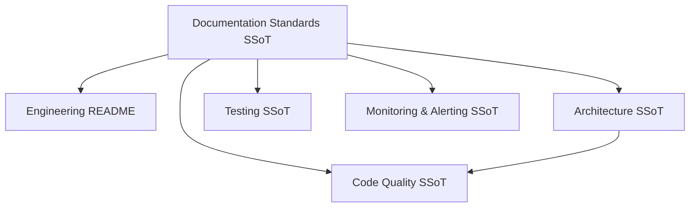
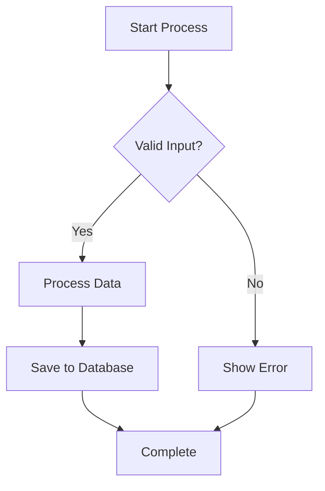
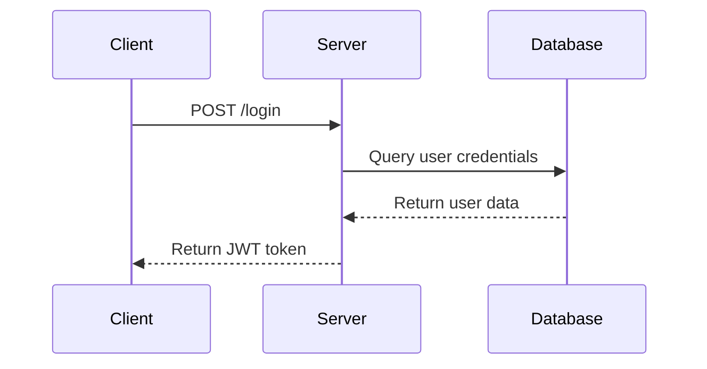
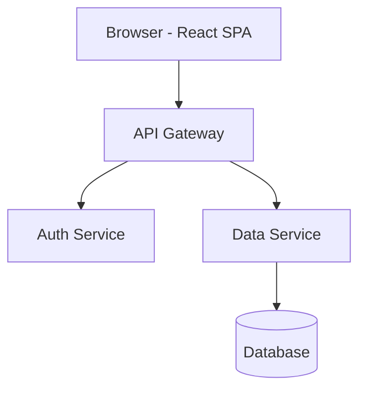
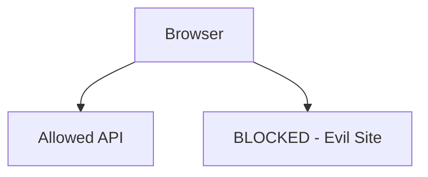
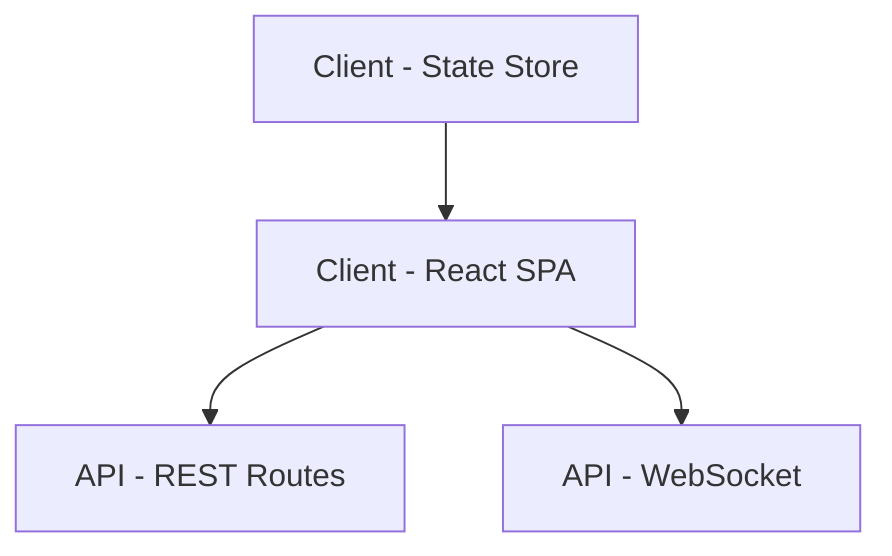
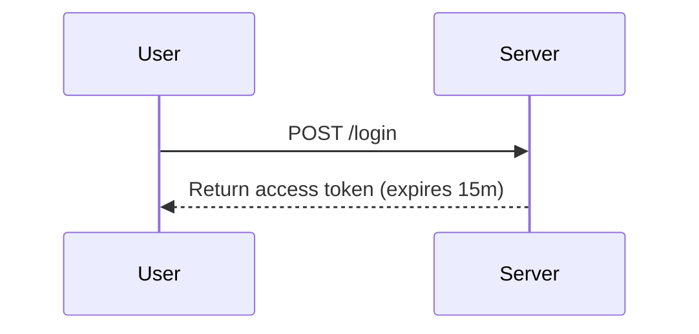
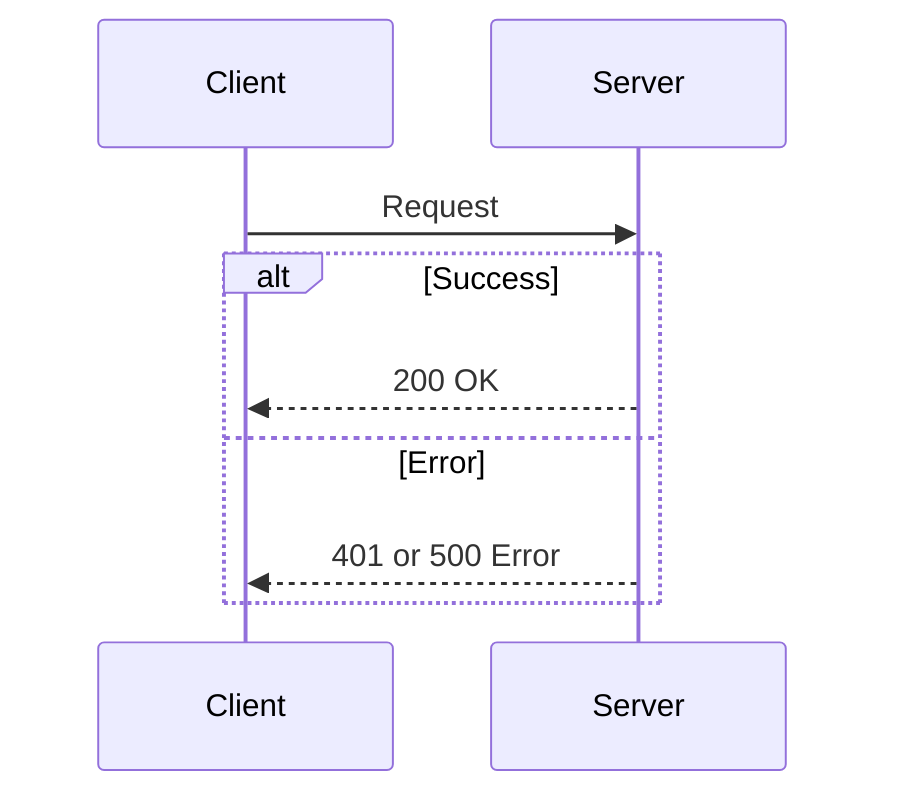
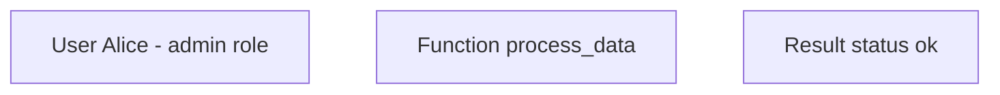

# Documentation Standards

> **Single Source of Truth (SSoT)** for all documentation practices across Effectful core and demo projects.

**Scope**
- Governs docs in `documents/` and demo overlays such as `demo/healthhub/documents/engineering`.
- Base documentation applies to demos by default; demo docs may only document deltas/overrides and must link back here.
- Avoid duplicating base content in demo docs—reference the canonical section instead.

## SSoT Link Map



| Need | Link |
|------|------|
| Navigation entry point | [Engineering README](engineering/README.md) |
| Code quality (type safety + purity) | [Code Quality](engineering/code_quality.md) |
| Architecture canonical doc | [Architecture](engineering/architecture.md) |
| Test documentation rules | [Testing](engineering/testing.md) |
| Monitoring + alerting policy | [Monitoring & Alerting](engineering/monitoring_and_alerting.md) |

## Documentation Philosophy

### Single Source of Truth (SSoT)
- Each piece of knowledge has exactly ONE authoritative location.
- All other references LINK to the SSoT, never duplicate—prefer deep links into the precise subsection.
- Mark SSoT documents explicitly: "**SSoT** for [topic]" and include `Supersedes` when refactoring.
- Update SSoT first, links follow automatically.
- Reduces maintenance burden, prevents inconsistency, ensures accuracy.
- Demo standards inherit from base SSoTs; demo docs must state explicit overrides and keep links back to the canonical base section (e.g., `demo/healthhub/documents/engineering` links here).

### Link Liberally
- Default to linking existing SSoTs rather than rephrasing content.
- When adding new sections, include cross-links to related standards (code quality, testing, observability, tutorials).
- Inline reminders (one sentence max) are fine if followed by a link to the canonical section.
- When unsure, err on the side of **more links** to reinforce DRY navigation.

### DRY (Don't Repeat Yourself)
- Duplicate content creates maintenance burden and drift.
- Liberal linking instead of copy-paste.
- Acceptable repetition: navigation breadcrumbs, quick reference tables.
- Forbidden duplication: examples, procedures, explanations.
- Exception: Context-specific summaries (3-5 lines max with link to SSoT).

### Separation of Concerns
- **Engineering standards** (documents/engineering/): HOW to build effectful code
- **Tutorials** (documents/tutorials/): Step-by-step learning guides for users
- **API reference** (documents/api/): Function signatures and usage
- **Root docs** (documents/): High-level overview and getting started
- **Demo overlays** (demo/<project>/documents/): Project-specific deltas that reference and do not duplicate the base standards

### Demo Documentation (Inheritance)
- Assume every base standard applies to demo projects unless the demo doc clearly documents an override.
- Demo docs (e.g., `demo/healthhub/documents/engineering/`) must use the **same filename** as the base document they extend.
- Every demo override starts with a link to the full base document and then lists only the project-specific deltas/overrides.
- When demo behavior differs, describe the delta succinctly and point back to the canonical section for rationale and examples.
- Forbidden: copying base examples or procedures into demo docs; prefer short reminders plus a link.

---

## File Organization Standards

### Naming Conventions
- Lowercase with underscores: `code_quality.md`, not `CodeQuality.md` or `code-quality.md`
- Descriptive names: `docker_workflow.md`, not `docker.md`
- Avoid abbreviations: `configuration.md`, not `config.md`
- No version numbers in filenames: use git for versioning
- Use full descriptive names: `documentation_standards.md`, not `docs.md`

### Directory Structure
```
documents/
├── engineering/        # Standards for contributors (HOW to build)
├── tutorials/         # Learning guides for users (LEARNING)
└── api/              # Technical reference (WHAT exists)

demo/<project>/documents/
└── engineering/      # Demo overlays (deltas only; always reference base standards)
```

### Document Size Guidelines
- Target: 300-800 lines per document
- Minimum: 100 lines (otherwise merge with related doc)
- No hard maximum; split when readability suffers or navigation becomes unclear
- Exception: Comprehensive standards like `testing.md` (~3600 lines) due to 22 anti-patterns

---

## Writing Style Guidelines

### Imperative Mood for Standards
- ✅ "Use frozen dataclasses"
- ❌ "You should use frozen dataclasses"
- ✅ "Avoid mutable state"
- ❌ "It's better to avoid mutable state"

### Active Voice Preferred
- ✅ "The interpreter handles effects"
- ❌ "Effects are handled by the interpreter"
- ✅ "MyPy enforces type safety"
- ❌ "Type safety is enforced by MyPy"

### Code Examples

**CRITICAL**: All code examples must follow zero-tolerance type safety policy:
- ❌ **FORBIDDEN**: `Any`, `cast()`, or `# type: ignore` in ANY code examples
- ✅ **REQUIRED**: Explicit types always, even in documentation

**Example format:**
```python
# ❌ WRONG - Mutable domain model
@dataclass
class User:
    name: str
    email: str

# ✅ CORRECT - Frozen for immutability
@dataclass(frozen=True)
class User:
    name: str
    email: str

# ❌ WRONG - Using Any (FORBIDDEN)
def process(data: Any) -> Any:
    return data

# ✅ CORRECT - Explicit types always
def process(data: UserData) -> Result[ProcessedData, ProcessingError]:
    return Ok(ProcessedData(...))
```

**Best Practices:**
- Include explanations AFTER code blocks
- Show both WRONG and CORRECT examples for anti-patterns
- Use real effectful types, not generic placeholders
- Always include function signatures with complete type hints
- Never use `...` or `pass` without explanation of what goes there

### Tables for Reference Material
Use tables for:
- Command reference
- Environment variables
- Metric types
- Test statistics
- Configuration options

**Example:**
```markdown
| Command | Purpose | Exit Code |
|---------|---------|-----------|
| check-code | Run Black + MyPy + doc link verification | 0 = pass |
| test-all | Run all tests | 0 = pass |
```

### Lists for Procedures
Use numbered lists for sequential steps:
1. Create directory
2. Write file
3. Verify links

Use bullet lists for unordered items:
- Type safety
- Purity
- Testing

---

## Mermaid Diagram Standards

### Core Principle
**Use only the "safe subset" that renders in both GitHub and VSCode.**

**Problem**: GitHub (Mermaid v10.8.0) and VSCode (Mermaid v11+) have compatibility differences. Diagrams that work on GitHub may fail in VSCode.

**Solution**: Restrict to universally compatible patterns documented here.

**Priority**: Universal compatibility > Visual features

### Orientation Guidelines

**Always orient the largest axis vertically (TB direction).**

Diagrams that are wider than they are tall appear very small when rendered, making them hard to read.

**Use TB (Top-Bottom) - Preferred:**
- Sequential workflows with more than 3 steps
- State machines showing status transitions
- Decision trees with multiple branches
- Any diagram where the longest chain of elements would run horizontally

**LR (Left-Right) acceptable only for:**
- Diagrams with 3 or fewer sequential elements
- Diagrams showing parallel/concurrent relationships (not sequential)
- Simple input → output flows with minimal intermediate steps

**Rule of Thumb**: Count the elements in your longest chain. If more than 3, use TB.

**Example:**
```mermaid
# ❌ BAD - LR with many elements (appears tiny)
flowchart LR
  A --> B --> C --> D --> E --> F

# ✅ GOOD - TB with same elements (readable)
flowchart TB
  A --> B
  B --> C
  C --> D
  D --> E
  E --> F
```

### Safe Patterns

#### Pattern 1: Simple Flowchart

**Use Case**: Process flows, decision trees, system architecture



**Why it works**: Simple nodes, solid arrows only, clear flow direction.

#### Pattern 2: Simple Sequence Diagram

**Use Case**: API calls, authentication flows, message passing



**Why it works**: Simple participants, solid arrows only, no complex blocks.

#### Pattern 3: Architecture Diagram (Flat Structure)

**Use Case**: System components, service topology



**Why it works**: No subgraphs, uses prefixed node names for grouping. TB orientation ensures readability.

### Forbidden Patterns

❌ **Never use:**
- Dotted lines: `-.->`, `-.-`, `..`
- Subgraphs: `subgraph` keyword
- Thick arrows: `==>`
- Note over: `Note over Participant`
- Special characters in labels: `:`, `()`, `{}`
- Mixed arrow types in same diagram
- Comments inside diagrams: `%%`

### Fixes for Common Problems

#### Problem 1: Dotted Lines for "Blocked" Connections

**❌ WRONG** (fails in VSCode):
```text
flowchart TB
  Browser[Browser]
  AllowedAPI[Allowed API]
  BlockedSite[Evil Site]

  Browser --> AllowedAPI
  Browser -.-> BlockedSite
```

**✅ CORRECT** (works everywhere):


**Fix Strategy**: Use solid arrows, add "BLOCKED" prefix to node label.

#### Problem 2: Subgraphs for Grouping

**❌ WRONG** (fails in VSCode):
```text
flowchart LR
  subgraph Client
    SPA[React SPA]
    Store[State Store]
  end

  subgraph API
    REST[REST Routes]
    WS[WebSocket]
  end

  SPA --> REST
  SPA --> WS
```

**✅ CORRECT** (works everywhere):


**Fix Strategy**: Flatten hierarchy, use prefixed node names (e.g., "Client - ", "API - "). Use TB for better readability.

#### Problem 3: Note Over in Sequence Diagrams

**❌ WRONG** (fails in some VSCode):
```text
sequenceDiagram
  User->>Server: POST /login
  Server-->>User: Return access token
  Note over User: Token expires after 15 minutes
```

**✅ CORRECT** (works everywhere):


**Fix Strategy**: Move note text into arrow label or participant message.

#### Problem 4: Complex Alt Blocks

**❌ WRONG** (fails in some VSCode):
```text
sequenceDiagram
  Client->>Server: Request
  alt Success
    Server-->>Client: 200 OK
  else Unauthorized
    Server-->>Client: 401 Unauthorized
  else Server Error
    Server-->>Client: 500 Error
  end
```

**✅ CORRECT** (works everywhere):


**Fix Strategy**: Limit to one `else` clause, combine similar cases.

#### Problem 5: Special Characters in Labels

**❌ WRONG** (may fail parsing):
```text
flowchart TB
  A[User: Alice (admin)]
  B[Function: process_data()]
  C[Result: {status: ok}]
```

**✅ CORRECT** (works everywhere):


**Fix Strategy**: Remove colons, parentheses, quotes, braces from labels.

### Testing Checklist

Before committing mermaid diagrams, verify:

- [ ] Diagram uses only safe patterns from this guide
- [ ] No dotted lines (`-.->`)
- [ ] No subgraphs (`subgraph`)
- [ ] No `Note over` in sequences
- [ ] Labels use simple text (no `:`, `()`, `{}`)
- [ ] Arrow types are consistent (don't mix styles)
- [ ] Orientation is TB for diagrams with >3 sequential elements
- [ ] Tested in GitHub preview
- [ ] Tested in VSCode with recommended extension
- [ ] Tested in Mermaid Live Editor (https://mermaid.live/)

### VSCode Setup

**Recommended Extension:**
- **Name**: Markdown Preview Mermaid Support
- **Author**: Matt Bierner
- **ID**: `bierner.markdown-mermaid`
- **Why**: Most compatible with GitHub's Mermaid version

**Installation**:
```bash
code --install-extension bierner.markdown-mermaid
```

### Alternatives When Safe Subset Isn't Enough

If your diagram requires features not in the safe subset:

#### Alternative 1: ASCII Art

**Pros**: Universal, no rendering needed, works everywhere
**Cons**: Limited visual appeal, harder to create

```
┌─────────────┐       ┌─────────────┐
│   Client    │──────>│   Server    │
└─────────────┘       └─────────────┘
                             │
                             ▼
                      ┌─────────────┐
                      │  Database   │
                      └─────────────┘
```

#### Alternative 2: Static Images

**Pros**: Full visual control, guaranteed rendering
**Cons**: Harder to update, version control issues

**Process**:
1. Create diagram in Mermaid Live Editor: https://mermaid.live/
2. Export as SVG or PNG
3. Commit image to repo
4. Reference in markdown: ``  <!-- Example uses existing doc to keep links valid -->

#### Alternative 3: PlantUML

**Pros**: Better VSCode support, more mature, richer feature set
**Cons**: Different syntax, requires separate setup

#### Alternative 4: External Links

**Pros**: No compatibility issues
**Cons**: User must leave document

```markdown
[View Architecture Diagram](https://mermaid.live/edit#pako:eNpVjk...)
```

---

## Cross-Reference Management

### Link Format

**Relative paths preferred:**
```markdown
# From documents/tutorials/01_quickstart.md
See [Code Quality](engineering/code_quality.md)

# From documents/engineering/code_quality.md
See [Effect Patterns](engineering/effect_patterns.md)
```

**Absolute paths from root:**
```markdown
# From anywhere
See [Architecture](engineering/architecture.md)
```

### Link Verification

**Required after refactors:**
```bash
# Run link verification script
python tools/verify_links.py

# Manually check for broken paths (example)
grep -r "documents/core/" .
grep -r "type_safety_enforcement.md" .  # Old filename
```

**Forbidden:**
- Dead links (target doesn't exist)
- Links to deprecated/deleted docs
- Circular references (doc A → doc B → doc A)
- Links with old filenames after refactoring

### Updating Links After Refactors

**When moving files:**
1. Use `git mv` to preserve history
2. Create link update script (sed patterns)
3. Run automated updates
4. Manually verify all references
5. Run verification script
6. Update any external references (CLAUDE.md, README, etc.)

**Example refactor workflow:**
```bash
# 1. Move file
git mv documents/engineering/monitoring_standards.md documents/engineering/monitoring_and_alerting.md

# 2. Update all references
find . -name "*.md" -exec sed -i 's/monitoring_standards\\.md/monitoring_and_alerting.md/g' {} +

# 3. Verify
python tools/verify_links.py
```

---

## SSoT Enforcement

### How to Mark Documents as Authoritative

Add explicit SSoT marker at the top:
```markdown
# Code Quality

> **Single Source of Truth (SSoT)** for all type safety and purity policy in Effectful.

[Content...]

---

**Last Updated**: YYYY-MM-DD
**Supersedes**: old_file.md (if applicable)
**Referenced by**: architecture.md, testing.md, CLAUDE.md
```

### When to Duplicate vs Link

**Always link:**
- Detailed explanations
- Code examples (except minimal 3-5 line summaries)
- Procedures
- Standards and rules
- Mermaid diagrams (link instead of copying)

**Acceptable duplication:**
- Navigation breadcrumbs
- Table of contents
- Quick reference tables (with "See [X] for details")
- Context-specific summaries (3-5 lines max with link)

**Example of acceptable duplication:**
```markdown
## Type Safety (Summary)

**Quick reminder**: Zero `Any`, `cast()`, or `type: ignore` allowed - NO exceptions.

See [Code Quality](engineering/code_quality.md#1-no-escape-hatches-zero-exceptions) for complete doctrines.
```

### Forbidden Duplication

❌ Never duplicate:
- Full code examples (link to canonical example)
- Step-by-step procedures (link to procedure doc)
- Explanations longer than 5 lines
- Mermaid diagrams (link to diagram's original location)
- Configuration settings (link to SSoT configuration doc)

---

## Document Templates

### Engineering Standard Template
```markdown
# [Topic] Standards

> **Single Source of Truth (SSoT)** for all [topic] practices in Effectful.

## Overview

[1-2 sentence description]

## Core Principles

[3-5 principles as bullet list]

## Standards

### Standard 1: [Name]

[Detailed explanation]

**Example:**
[Code example - must follow zero-tolerance type safety]

**Rationale:** [Why this standard exists]

## Anti-Patterns

### Anti-Pattern 1: [Name]

**❌ WRONG:**
[Bad example]

**✅ CORRECT:**
[Good example]

## See Also

- [Related Standard](engineering/code_quality.md)
- [Tutorial](tutorials/01_quickstart.md)

---

**Last Updated**: YYYY-MM-DD
**Referenced by**: [List of docs that reference this SSoT]
```

### Tutorial Template
```markdown
# Tutorial: [Topic]

> Learn [skill] in [timeframe]

## Prerequisites

- [Prerequisite 1]
- [Prerequisite 2]

## What You'll Learn

- [Learning objective 1]
- [Learning objective 2]

## Step 1: [Action]

[Explanation]

[Code example - must follow zero-tolerance type safety]

## Step 2: [Action]

[Continue pattern]

## Summary

[Recap of what was learned]

## Next Steps

- [Tutorial 2](tutorials/02_effect_types.md)
- [Related Standard](engineering/code_quality.md)

---

**Previous**: [Tutorial 1](tutorials/01_quickstart.md) | **Next**: [Tutorial 3](tutorials/03_adts_and_results.md)
```

### API Reference Template
```markdown
# [Component] API Reference

## Overview

[Brief description of component]

## Types

### [TypeName]

[Type definition]

**Fields:**
- `field_name` (Type): Description

**Example:**
[Usage example]

## Functions

### [function_name]

[Function signature with complete type hints]

**Parameters:**
- `param` (Type): Description

**Returns:**
- Type: Description

**Raises:**
- ErrorType: When [condition]

**Example:**
[Usage example]

## See Also

- [Related API](api/effects.md)
- [Tutorial](tutorials/01_quickstart.md)
- [Standard](engineering/architecture.md)
```

---

## File Headers

**All engineering documents should include:**
```markdown
# Document Title

> **Single Source of Truth (SSoT)** for [topic] (if applicable)

[1-2 sentence overview]

---

**Last Updated**: YYYY-MM-DD
**Supersedes**: [old-file.md] (if refactoring)
**Referenced by**: [List of documents that link here]
```

---

## Markdown Formatting

### Code Blocks
- Always specify language: \`\`\`python, \`\`\`bash, \`\`\`markdown
- Use \`\`\`markdown for showing markdown examples
- Use comments to explain code: `# Explanation`
- All code must follow zero-tolerance type safety (no Any/cast/type:ignore)

### Headings
- h1 (`#`) - Document title only
- h2 (`##`) - Major sections
- h3 (`###`) - Subsections
- h4 (`####`) - Rare, only if needed
- Never skip levels (h2 → h4)

### Emphasis
- **Bold** for important terms, emphasis, policy statements
- *Italic* for introducing terms (first use)
- `Code` for inline code, filenames, commands, Python identifiers

### Lists
- Use `-` for unordered lists (not `*` or `+`)
- Use `1.` for numbered lists
- Indent nested lists with 2 spaces
- Use checkboxes for checklists: `- [ ]` and `- [x]`

---

## Version Control

### Git Commit Messages for Docs
```
docs: add documentation standards

- Merge documentation-standards.md content
- Add mermaid diagram standards
- Include SSoT/DRY enforcement
- Add zero-tolerance policy for code examples
```

### When to Update Documentation
- Immediately when code changes affect docs
- When new features are added
- When anti-patterns are discovered
- After refactors (update all cross-references)
- When engineering standards change

---

## See Also

- [Code Quality](engineering/code_quality.md) - Zero-tolerance type safety + purity
- [Architecture](engineering/architecture.md) - Overall system design
- [Testing](engineering/testing.md) - Test documentation practices
- [Command Reference](engineering/command_reference.md) - All Docker commands
- [Monitoring & Alerting](engineering/monitoring_and_alerting.md) - Metric + alert policy
- [CONTRIBUTING](CONTRIBUTING.md) - How to contribute

---

**Last Updated**: 2025-12-01
**Referenced by**: README.md, CONTRIBUTING.md, code_quality.md, testing.md, docker_workflow.md, monitoring_and_alerting.md
