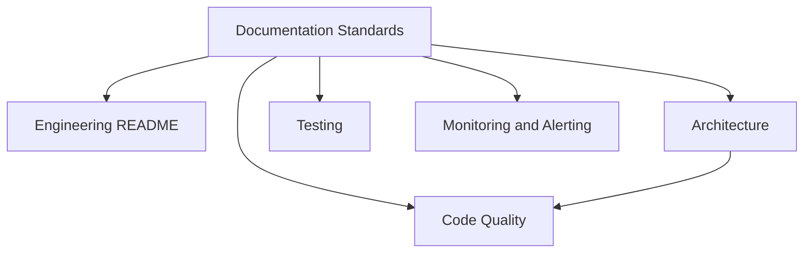

# Documentation Standards

**Status**: Authoritative source
**Supersedes**: none
**Referenced by**: README.md, contributing.md, documents/engineering/code_quality.md, documents/engineering/testing.md, documents/engineering/docker_workflow.md, documents/engineering/monitoring_and_alerting.md

> **Purpose**: Single Source of Truth (SSoT) for documentation practices across Effectful core and demo projects; aligns with the unified ShipNorth guide while preserving Effectful’s hierarchical/delta structure.

---

## 1) Philosophy and Hierarchy

- **SSoT-first**: Each concept has exactly one canonical document; all other references deep-link to it. Authoritative docs must keep the header metadata and list cross-references.  
- **DRY + link liberally**: Never copy procedures, examples, or diagrams. Brief reminders (1-3 sentences) are allowed only with a link to the SSoT subsection.  
- **Separation of concerns**: Engineering standards (how to build), domain, tutorials/product workflows, API/reference. Keep scopes distinct.  
- **Tiered structure (preserve Effectful hierarchy)**:  
  1. Framework standards (this guide)  
  2. Core SSoTs (architecture, prerequisites, code quality)  
  3. Patterns/how-tos (command patterns, deployment guides)  
  4. Generated reference (command reference, metrics)  
- **Demo overlays (delta-only)**: Demo docs inherit base rules and must use the same filenames as the base they extend. Each overlay starts with a link to the base SSoT, then lists only deltas/overrides. No copied procedures or examples; summarize differences and link back for rationale.

### Link Map (authoritative anchors)



| Need | Link |
|------|------|
| Navigation entry point | [Engineering README](engineering/README.md) |
| Code quality (type safety + purity) | [Code Quality](engineering/code_quality.md) |
| Architecture canonical doc | [Architecture](engineering/architecture.md) |
| Test documentation rules | [Testing](engineering/testing.md) |
| Monitoring + alerting policy | [Monitoring & Alerting](engineering/monitoring_and_alerting.md) |

---

## 2) Naming and File Organization

- **Primary rule**: Follow repository convention. Effectful uses snake_case for docs; stay consistent (e.g., `documentation_standards.md`, not `documentation-standards.md`).  
- Descriptive, unabbreviated names; no version numbers in filenames.  
- Keep prefixes for grouping when useful (e.g., `command_reference.md`).  
- Directory layout:  
  - `documents/engineering/` — contributor standards (how to build)  
  - `documents/tutorials/` — learning paths  
  - `documents/api/` — reference  
  - `demo/<project>/documents/` — overlays listing deltas; never duplicate base content.

---

## 2a) File Type Policy

**Prohibited in documentation directories**:

| Pattern | Examples | Reason |
|---------|----------|--------|
| Backup suffixes | `.bak`, `.bak2`, `.backup`, `.old`, `~` | Git history is the backup system |
| Temporary files | `.tmp`, `.temp`, `.swp`, `.swo` | Indicates incomplete work; use git branches |
| Plain text files | `.txt` | Lacks semantic structure; use `.md` for all docs |

**Exceptions**:
- Configuration files that require specific extensions (e.g., `.yaml`, `.json`, `.toml`)
- Lock files (e.g., `poetry.lock`)
- Generated artifacts explicitly documented in build process

**Enforcement**:
- Pre-commit hooks should reject these patterns in `documents/` directories
- CI/CD pipeline should fail if backup or temp files are committed

---

## 4) Required Header Metadata

Every doc starts with:
```markdown
# Document Title

**Status**: [Authoritative source | Reference only | Deprecated]
**Supersedes**: old-file.md (if applicable)
**Referenced by**: related-file.md, other.md (when known)

> **Purpose**: 1-2 sentence role of the doc.
> **📖 Authoritative Reference**: [link] (if Status = Reference only)
```
- Authoritative docs add a **Cross-References** section.  
- No date stamps (no “Last Updated” or dated changelogs); git history is the recency signal.

---

## 5) Cross-Referencing Rules

- Use relative links with anchors; prefer deep links.  
- Bidirectional links are recommended when documents depend on each other.  
- Optional callout for clarity:  
  ```markdown
  > **📖 See**: [Interpreters](engineering/architecture.md#5-interpreters-effect-handlers)
  ```  
- Overlays must link to the base SSoT first, then list overrides.  
- Do not leave dead links; run link verification after moves.

---

## 6) Duplication Rules

- **Always link, do not copy**: examples, procedures, standards, diagrams, configurations.  
- **Allowed duplication**: navigation tables, TOCs, quick-reference summaries (≤5 lines) that link to the SSoT.  
- **Forbidden**: copying full examples, rephrasing SSoT text, duplicating diagrams, restating policies without attribution.

---

## 7) Writing Style and Code/Doc Rigor

- **Imperative and active voice** for standards (“Use frozen dataclasses”; “The interpreter handles effects”).  
- **Code examples**: language fences required; first line includes file path comment. Show WRONG/RIGHT pairs for anti-patterns. Zero tolerance for `Any`, `cast`, or `# type: ignore`. Keep lines readable; add minimal comments for highlights.  
- **Docstrings (Python)**: Google style for all public modules/classes/functions. Sections: Args, Returns, Raises, Yields (when applicable), Note, Example. Wrap to 88 characters; describe shapes/types even with type hints.  
- **Module/class/function docs**: module overview + implementation details; classes list attributes and usage; functions include summary + Google sections + constraints. For ADTs, enumerate variants and discriminators. Effectful functions list all side effects under an **Effects** subsection.  
- **Mermaid usage**: preferred when it clarifies logic; see standards below for allowed syntax.  
- **Lists vs tables**: numbered steps for procedures; tables for command/env references and metrics.

---

## 8) Mermaid Diagram Standards

- **Compatibility-first**: GitHub, VSCode, and Mermaid Live must render identically.  
- **Orientation**: TB by default. Use LR only for ≤3 sequential steps or purely parallel flows; never draw right-to-left.  
- **Allowed syntax**: `flowchart TB|LR`, simple nodes `[ ] ( ) { }`, solid arrows `-->`. Arrow labels may be inline (`A -->|label| B`) or via label nodes—stay consistent per diagram.  
- **Forbidden**: dotted lines, subgraphs, thick arrows, `Note over`, mixed arrow styles within one diagram, labels with punctuation (`: () {}`) or hyphens, comments inside diagrams.  
- **Testing checklist**: preview in GitHub, VSCode Mermaid extension, and Mermaid Live.  
- If the safe subset is insufficient, use ASCII or static images and link to the source.

---

## 9) Templates

**Authoritative Doc**
```markdown
# Title
**Status**: Authoritative source
**Supersedes**: old.md
**Referenced by**: related.md

> **Purpose**: SSoT for [topic].

## Executive Summary
[1-2 paragraphs]

## 1. Section
...

## Cross-References
- [Related Standard](engineering/code_quality.md#result-types)
- [Upstream Architecture](engineering/architecture.md)
```

**Reference Doc**
```markdown
# Title
**Status**: Reference only
> **📖 Authoritative Reference**: [Canonical Doc](engineering/architecture.md#section)

## Quick Summary
[short overview + links]
```

**Engineering Standard / Tutorial / API Reference**
- Use the above header metadata.  
- Tutorials: prerequisites, learning objectives, numbered steps, summary, next steps.  
- API reference: types, params, returns, raises, examples; keep type completeness and zero-tolerance safety.

---

## 10) Maintenance Checklist

- [ ] Update the authoritative source first; then dependent links.  
- [ ] Run link validation after renames/moves.  
- [ ] Validate Mermaid diagrams (GitHub, VSCode, Mermaid Live).  
- [ ] Regenerate generated docs when commands/tests change.  
- [ ] Sync indices (CLAUDE.md/README.md) for repo-wide changes.  
- [ ] Quarterly freshness review: examples, diagrams, new patterns.  
- [ ] Keep git history as the only recency signal; no date stamps.

---

## 11) Demo Overlay Rules (Effectful-specific)

- Demos inherit all base standards.
- Overlay docs live under `demo/<project>/documents/` and use the same filenames as their base documents.
- Start with a link to the base SSoT, then list only overrides/deltas; no duplicated procedures, examples, or diagrams.
- If there are no deltas, state explicitly that the demo follows the base standard without changes.

## Cross-References
- [Engineering README](engineering/README.md)
- [Code Quality](engineering/code_quality.md)
- [Testing](engineering/testing.md)
- [Docker Development Doctrine](engineering/docker_workflow.md)
