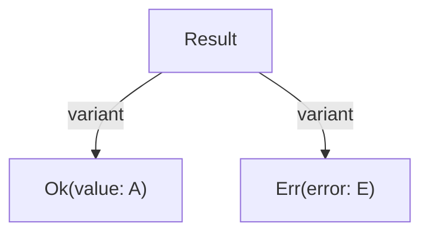
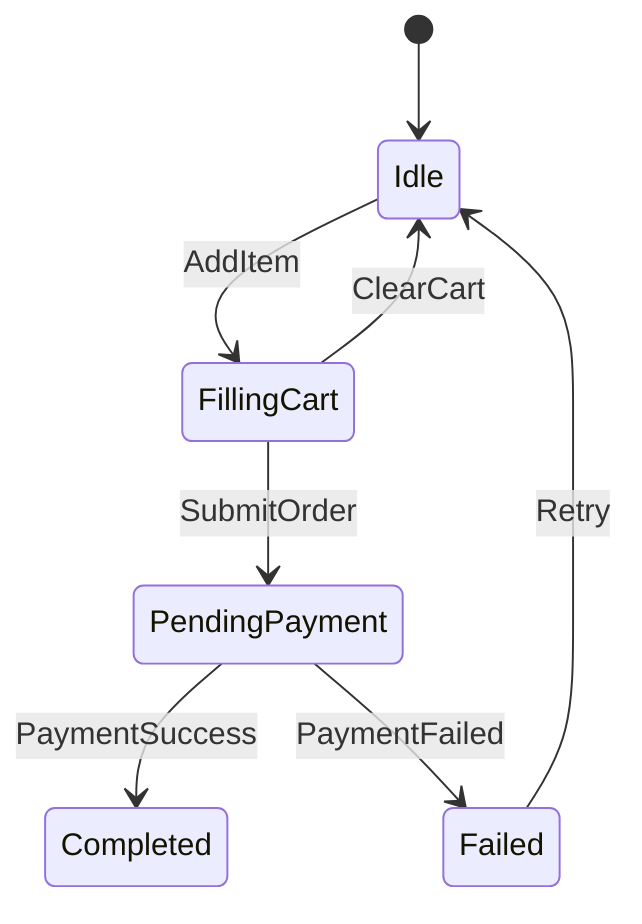

# Documentation Standards

**Status**: Authoritative source  
**Supersedes**: previous Unified Documentation Guide (documents/documentation_standards.md)  
**Referenced by**: ../CLAUDE.md, documents/README.md, documents/engineering/code_quality.md, documents/engineering/navigation.md, documents/engineering/testing.md, documents/engineering/docker_workflow.md, documents/engineering/monitoring_and_alerting.md

> **Purpose**: Single Source of Truth (SSoT) for writing and maintaining documentation across BBY, Effectful, and SpectralMC. Defines rules that can be enforced deterministically (via Markdown tooling and Python scripts) so human/LLM review can focus on semantics, architecture, and higher-level consistency.

---

## 1. Philosophy and Tiers

### 1.1 SSoT-first

- Every concept has **exactly one canonical document**; all others link to it.  
- Authoritative docs use `**Status**: Authoritative source` in their metadata header.  
- When an authoritative doc replaces an older one, set `Supersedes` accordingly.  
- Demo/overlay docs must list **deltas only** and link back to the base SSoT.

### 1.2 DRY + link liberally

- Do **not** duplicate examples, procedures, or long explanations.  
- Prefer deep links (section anchors) and **bidirectional links** for paired docs.  
- Brief reminders (1–3 sentences) are acceptable, but must link to the SSoT section.  
- Navigation tables and short quick-reference blocks are allowed duplication.

### 1.3 Separation of concerns

Keep these scopes distinct:

- **Engineering standards**: how to build and operate (code quality, testing, observability, infra).  
- **Domain**: product- or domain-specific algorithms and morphologies.  
- **Tutorials / product workflows**: step-by-step usage and deployment.  
- **API / reference**: signatures, types, generated references.

### 1.4 Tiered structure

1. **Framework standards** (this guide, code quality, testing, architecture)  
2. **Core SSoTs** (architecture, prerequisites, code quality, domain core)  
3. **Patterns / how-tos** (command patterns, deployment guides, workflows)  
4. **Generated reference** (command reference, metrics, functional catalogue)

### 1.5 Tools-first enforcement (`poetry run check-code`)

- Docs must be **mechanically clean** before human/LLM review.  
- A single entrypoint must run the full code + docs check suite:

  ```bash
  poetry run check-code
  ```

- `check-code` must run, at minimum:
  - `black` (formatting)  
  - `ruff` (linting)  
  - `mypy` (type checking)  
  - The **Markdown checking suite**:
    - Markdown formatter  
    - Markdown linter  
    - Link checker  
    - Spell checker (optional but recommended)  
    - Custom doc scripts (Mermaid, catalogue, filename/layout checks, code-block checks)

If any of these fail, `poetry run check-code` fails. LLM review happens **only after** `check-code` passes.

---

## 2. File Naming and Layout

### 2.1 Naming conventions (Markdown/docs)

- Use **snake_case** for human-facing Markdown docs in this repo:  
  - ✅ `documentation_standards.md`  
  - ✅ `effectful_dag_architecture.md`  
  - ❌ `DocumentationStandards.md`  
  - ❌ `documentation-standards.md`
- Do not mix naming styles within a repo.  
- **Explicit exceptions (no new ones)**:
  - `README.md` (at any depth)  
  - `AGENTS.md`  
  - `CLAUDE.md`  
  - Other legacy top-level index files explicitly whitelisted.
- Additional rules:
  - Descriptive, unabbreviated names (e.g., `documentation_standards.md` over `docs.md`).  
  - No version numbers in filenames (`architecture_v2.md` is forbidden; use git history).  
  - Prefixes for grouping when helpful (`cli_`, `gpu_`, `tutorial_`, `command_reference_`).

**Enforcement** (custom Python):

- `check_doc_filenames.py`:
  - Ensures `documents/` and `demo/*/documents/` Markdown files match `^[a-z0-9_]+\.md$` (minus exceptions).  
  - Rejects names containing version-like suffixes (`_v2`, `_v1_1`, etc.).

### 2.2 Directory layout

- `documents/engineering/` — engineering standards and architecture.  
- `documents/tutorials/` — tutorials, learning paths, workflows.  
- `documents/api/` — API and generated reference docs.  
- `demo/<project>/documents/` — overlay docs listing **deltas only** relative to base docs.

**Rule**: long-form docs must live in these directories or be explicitly whitelisted (e.g., repo-root `README.md`, `CONTRIBUTING.md`).

**Enforcement** (custom Python):

- `check_doc_filenames.py`:
  - Fails if unknown `.md` files appear outside allowed directories (excluding explicit top-level doc exceptions).

---

## 3. File Type Policy and Forbidden Artifacts

Within `documents/` and `demo/*/documents/`:

| Pattern             | Examples                              | Policy     |
|---------------------|---------------------------------------|-----------|
| Backup files        | `*.bak`, `*.bak2`, `*.backup`, `*.old`, `*~` | Forbidden |
| Temp/editor files   | `*.tmp`, `*.temp`, `*.swp`, `*.swo`   | Forbidden |
| Plain text docs     | `*.txt`                               | Forbidden (use `.md`) |

Configuration/lock/generated files (e.g., `.yaml`, `.json`, `.toml`, `poetry.lock`) are allowed if they are code/config, not docs.

**Enforcement** (custom Python):

- `check_doc_artifacts.py`:
  - Fails if any forbidden pattern is found in `documents/` or `demo/*/documents/`.

---

## 4. Required Header Metadata

Every Markdown documentation file **must** begin with:

```markdown
# Document Title

**Status**: Authoritative source | Reference only | Deprecated  
**Supersedes**: old-file.md | none  
**Referenced by**: file1.md, file2.md

> **Purpose**: 1–2 sentences describing the document’s role.
> **📖 Authoritative Reference**: [Canonical Doc](path/to/doc.md#section)  <!-- only if Status = Reference only -->
```

Rules:

- The first non-empty line is an H1 title (`# ...`).  
- Next three non-empty lines are metadata in bold-key form:
  - `**Status**: ...` (exact key, case-sensitive)  
  - `**Supersedes**: ...`  
  - `**Referenced by**: ...`
- A blockquote starting with `> **Purpose**:` must immediately follow metadata.  
- If `Status` is `Reference only`, the blockquote must also include a `**📖 Authoritative Reference**` line.  
- **Authoritative** docs must have a `## Cross-References` section at the end.  
- Do **not** add date stamps like “Last Updated”; git history is the recency source.

**Enforcement**:

- Existing tool:
  - Markdown linter rule MD041 ensures first line heading.  
- Custom Python:
  - `check_doc_headers.py`:
    - Validates the exact header structure (title + 3 metadata lines + Purpose blockquote).  
    - Validates `Status` is one of `Authoritative source`, `Reference only`, `Deprecated`.  
    - For `Reference only`, requires an `Authoritative Reference` link line in the Purpose blockquote.  
    - For `Authoritative source`, asserts presence of `## Cross-References` heading.

---

## 5. Cross-Referencing and Duplication Rules

### 5.1 Cross-referencing rules

- Use **relative links with section anchors** where possible; prefer deep links:  
  - `[Testing](engineering/testing.md#philosophy)`  
- Bidirectional links are recommended when docs depend on each other.  
- Optional callout for clarity:

  ```markdown
  > **📖 See**: [Navigation Architecture](engineering/navigation.md#architecture-summary)
  ```

- Overlays (demo docs) must link back to the base SSoT first, then list overrides/deltas only.  
- Do not leave dead links; run link validation after renames or moves.

**Enforcement**:

- Existing tools:
  - markdownlint: MD034 (`no-bare-urls`) to avoid raw links.  
- Custom Python:
  - `check_doc_links.py`:
    - Parses all links; forbids absolute GitHub URLs pointing back to the same repo (must be relative).  
    - Optionally checks that `Referenced by` and `Cross-References` sections point to existing files.

### 5.2 DRY and duplication rules

- **Always link, do not copy**:
  - Examples, procedures, standards, diagrams, configurations.  
- **Allowed duplication**:
  - Navigation tables, table of contents, quick-reference summaries (≤5 lines) pointing to SSoT.  
- **Forbidden**:
  - Copying full examples, duplicating diagrams, restating policies without attribution.  
  - Rephrasing SSoT text just to restate it in a new doc.

**Enforcement**:

- Tools can’t fully detect semantic duplication; this remains a **LLM/human review responsibility**.  
- Optional custom Python:
  - A “duplicate snippet” checker (fingerprints large code blocks across docs and warns if identical).

---

## 6. Markdown Style and Formatting

We rely on a Markdown formatter plus a linting ruleset for consistent style:

- **Formatter**: `mdformat` or Prettier (Markdown mode).  
- **Linter**: `markdownlint` or PyMarkdown.

### 6.1 General style rules

- No trailing whitespace; single newline at EOF.  
- ATX headings only (`#`, `##`, etc.); no Setext headings (`===`, `---`).  
- Single blank line between paragraphs, headings, lists, and code blocks.  
- Lists:
  - Unordered: `-` (dash) only.  
  - Ordered: `1.` style; relying on formatter to normalize.  
- Tables:
  - Must have a header row.  
  - Use Markdown syntax (`|` and `-`); keep readable in source.  
- Avoid HTML where Markdown suffices.  
- Soft line-length guidelines:
  - Prose: ~120 chars  
  - Code: ~100 chars (where feasible)

**Enforcement** (existing tools):

- markdownlint rules:
  - MD001, MD003, MD009, MD010, MD012, MD022, MD023, MD026, MD033, MD047, etc.  
- Formatter:
  - `mdformat` enforces consistent indentation, list formatting, headings, and spacing.

---

## 7. Code Examples in Markdown

### 7.1 Fenced code blocks

- Always use fenced code blocks (triple backticks), not indented blocks.  
- Always specify the language (e.g., ```python`, ```bash`):  

  ```python
  # tools/cli/effects.py
  # ❌ WRONG - Mutable domain model
  @dataclass
  class User:
      name: str
      email: str

  # ✅ CORRECT - Frozen for immutability
  @dataclass(frozen=True)
  class User:
      name: str
      email: str
  ```

- First non-empty line inside a code block **must be a comment** indicating the file path or context:
  - Python: `# path/to/module.py`  
  - Bash: `# example command`  
  - JSON: `// example payload` (or `# example` if appropriate)  
- Keep lines reasonably short (see §6).  
- Use WRONG/RIGHT pairs for anti-patterns.

**Enforcement**:

- Existing tools:
  - markdownlint: MD040 (`fenced-code-language`), MD046 (`code-block-style`), MD048 (`code-fence-style`).  
- Custom Python:
  - `check_doc_code_blocks.py`:
    - Confirms all fenced blocks have a language.  
    - For code-like languages, checks first non-empty line is a comment.

### 7.2 Type-safety in examples

- Zero tolerance for `Any`, `cast`, or `# type: ignore` in **good** examples.  
- You may show anti-patterns, but they must be clearly labeled as **Wrong** and paired with a **Right** example.  
- Document constraints and effects in examples (see ADT/effect documentation below).

**Enforcement** (custom Python):

- `check_doc_code_blocks.py` heuristic:
  - For Python blocks, if preceding markdown line contains “Wrong:” → no restrictions.  
  - Otherwise, fail if block contains:
    - `Any`  
    - `cast(`  
    - `# type: ignore`  
    - `from typing import Any`

---

## 8. Python Docstrings and Code Documentation

These rules are about Python code, not `.md` content, but are included for completeness and cross-linking.

### 8.1 Docstrings (Google style)

- All public modules, classes, and functions must use **Google-style docstrings**.  
- Sections: `Args`, `Returns`, `Raises`, `Yields` (when applicable), `Note`, `Example`.  
- Wrap at 88 characters (match Black).  
- Describe shapes/types in prose even with type hints.  
- Include examples (doctest style or fenced code); avoid `...` without context.  
- For ADTs, list variants and discriminators.  
- For effectful functions, include an **Effects** subsection describing side effects.

**Enforcement**:

- Existing tools:
  - `pydocstyle`, `pydoclint`, or similar, configured for Google-style.  
- Custom: additional checks can run in Python (not Markdown) to enforce docstring coverage and content patterns.

### 8.2 Module/class/function docs

- **Modules**:
  - Top-level docstring with:
    - Overview  
    - Implementation details (device, precision, purity, performance)  
    - API/reference tables (if relevant)  
- **Classes**:
  - Class docstring with:
    - Purpose  
    - Attributes / fields  
    - Example usage  
  - `__init__` docstring required if constructor behavior is non-trivial.  
- **Functions**:
  - Summary line (imperative/active voice).  
  - Full docstring with Google sections; constraints and types clearly documented.  
  - Math blocks (reST `.. math::` or inline LaTeX) allowed when necessary.

**Enforcement**:

- Python-level tools (e.g., `pydocstyle`, custom AST-based checkers); not Markdown tooling.

---

## 9. ADT and Effect Documentation

- For each ADT:
  - Explain the **kind/discriminator** field.  
  - Enumerate all variants with fields and types.  
  - Provide an exhaustive match example and link to the ADT/pattern-matching standard.  
- For effect-producing functions:
  - Include an **Effects** subsection in the docstring or nearby docs listing all side effects.  
  - Provide an effect-flow diagram (Mermaid or equivalent) when non-trivial.

**Enforcement**:

- Mostly semantic / human/LLM review; some coverage can be inferred from canonical Mermaid (see next section).

---

## 10. Mermaid Diagram Standards and Functional Canon

Mermaid is the **canonical, machine-readable representation** of all pure functional structures:

- Algebraic Data Types (**ADTs**)  
- Pure state machines

For every ADT and state machine:

1. There must be a **canonical Mermaid block inline** in a relevant doc section.  
2. That block must carry **structured metadata** (`%% kind:`, `%% id:`, …).  
3. It is automatically indexed in the **Functional Catalogue** (§11).

Other (non-canonical) Mermaid diagrams are allowed for architecture/flows but do not participate in the functional catalogue.

### 10.1 Allowed Mermaid subset (all diagrams)

To keep diagrams portable and scriptable:

- Allowed diagram types:
  - `flowchart TB`  
  - `flowchart LR`  
  - `stateDiagram-v2` (for canonical state machines)
- Allowed arrows:
  - `-->` only  
- Labels:
  - Use simple words; avoid punctuation and hyphens in labels.  
  - Within one diagram, don’t mix unlabeled and labeled arrows unless the diagram is non-canonical and simple.  
- Forbidden constructs:
  - Thick arrows (`==>`), dotted arrows (`-.->`), or other exotic forms.  
  - `subgraph`, `Note`, `style`, `classDef`, or CSS-like styling.  
  - Mixed arrow styles and mixed labeling approaches within one canonical diagram.

**Enforcement** (custom Python):

- `check_mermaid_metadata.py`:
  - For every ` ```mermaid` block:
    - Reject lines with `==>`, `-.->`, `subgraph`, `Note`, `style`, `classDef`.

### 10.2 Canonical ADT diagrams

Canonical ADTs use `flowchart TB` and a strict DSL:



Rules:

- Canonical block must start with (inside the fenced code):

  ```mermaid
  flowchart TB
    %% kind: ADT
    %% id: module.path.TypeName
    %% summary: Optional single-line summary
  ```

- `%% kind:` must equal `ADT`.  
- `%% id:` must be globally unique and dot-separated (`package.module.TypeName`).  
- `Result` (root ID) must match the ADT name (`TypeName` segment).  
- Variant node IDs must start with `<RootName>_` (e.g. `Result_Ok`, `Result_Err`).  
- Edges from root to variant:
  - `Root -->|variant| Root_VariantName`  
- You may add additional labeled edges (`|field|`, `|contains|`) for nested or composite structures.

**Enforcement** (custom Python in `check_mermaid_metadata.py`):

- Detect canonical ADT blocks (`%% kind: ADT`).
- Enforce:
  - First non-comment line is `flowchart TB`.  
  - `%% id:` present and unique across all docs.  
  - Root node matches last segment of `id`.  
  - Variant nodes prefixed with root name.  
  - Edges from root to variants use `|variant|` label.

### 10.3 Canonical state machine diagrams

Canonical state machines use `stateDiagram-v2`:



Rules:

- Canonical block must start with:

  ```mermaid
  stateDiagram-v2
    %% kind: StateMachine
    %% id: module.path.MachineName
    %% summary: Optional single-line summary
  ```

- `%% kind:` must equal `StateMachine`.  
- Exactly one initial transition from `[ * ]` (or `[*]`) to a state.  
- States should be simple identifiers (e.g. `Idle`, `PendingPayment`); events appear as labels on transitions (`StateA --> StateB: EventName`).  
- No `subgraph`, `Note`, `style`, `classDef`, or styling directives.

**Enforcement** (custom Python in `check_mermaid_metadata.py`):

- Detect canonical state machines (`%% kind: StateMachine`).
- Enforce:
  - First non-comment line is `stateDiagram-v2`.  
  - One and only one `[ * ] --> State` initial transition.  
  - All transitions match `From --> To: Event` pattern.  
  - No forbidden directives.

### 10.4 Canonical vs non-canonical diagrams

- Canonical diagrams:
  - Must have `%% kind:` and `%% id:` metadata.  
  - Participate in the **Functional Catalogue**.  
- Non-canonical diagrams:
  - No `%% kind:` line.  
  - Used for architecture overviews, effect flows, mixed concerns.  
  - Still follow the allowed subset (no advanced features) but are not indexed.

---

## 11. Functional Catalogue (Generated Index)

The **Functional Catalogue** is the authoritative, generated index of all canonical ADTs and state machines.

- Location: `documents/engineering/functional_catalogue.md`  
- Status: **Authoritative source** for the set of functional structures, but **auto-generated** (do not edit by hand).

### 11.1 Catalogue format

```markdown
# Functional Catalogue

**Status**: Authoritative source  
**Supersedes**: none  
**Referenced by**: engineering/architecture.md, engineering/code_quality.md

> **Purpose**: Generated index of all ADTs and state machines defined in the codebase and documented via Mermaid.

## Index

| Kind         | ID                              | Name          | Module                  | Doc |
|--------------|---------------------------------|---------------|-------------------------|-----|
| ADT          | core.result.Result              | Result        | core.result             | [Code Quality](engineering/code_quality.md#adt-result) |
| StateMachine | payments.checkout.CheckoutFlow  | CheckoutFlow  | payments.checkout       | [Payments](engineering/architecture.md#state-machine-checkoutflow) |
```

Rules:

- `Kind`: `ADT` or `StateMachine`.  
- `ID`: exactly the `%% id:` string.  
- `Name`: last segment of `ID`.  
- `Module`: `ID` without the last segment.  
- `Doc`: link to the doc and section containing the canonical diagram.

### 11.2 Generation and enforcement

**Generator** (custom Python):

- `tools/generate_functional_catalogue.py`:
  - Scans all `.md` for ` ```mermaid` blocks with `%% kind:` and `%% id:`.  
  - Validates metadata and uniqueness (reuses `check_mermaid_metadata` logic).  
  - Derives `Kind`, `ID`, `Name`, `Module`, and `Doc` link.  
  - Renders `functional_catalogue.md` with correct header and table.  
  - Adds a comment at top: `<!-- AUTO-GENERATED FILE. DO NOT EDIT BY HAND. -->`.

**Check mode**:

- `poetry run check-code` must:
  - Run generator in “check” mode (or regenerate to a temp file and diff).  
  - Fail if `functional_catalogue.md` is out of date.

---

## 12. Demo Overlays and Functional Deltas

Demo projects inherit base standards and functional structures with **delta-only** docs and diagrams.

### 12.1 Demo documentation overlays

- Location: `demo/<project>/documents/`.  
- Filenames must match base doc names (e.g., `demo/payments/documents/architecture.md` overlays `documents/engineering/architecture.md`).  
- Must start with a link to the base standard:

  ```markdown
  > **📖 Base Standard**: [Architecture](../../engineering/architecture.md)
  ```

- Content should list:
  - Only overrides/differences from base.  
  - No copy-pasted base procedures or diagrams.  
- If there are no deltas, explicitly say so:

  > *(This demo follows the base standard with no changes.)*

**Enforcement** (custom Python):

- `tools/check_demo_docs.py`:
  - Asserts each `demo/.../documents/*.md` has a corresponding base doc.  
  - Fails if base link at top is missing or malformed.  
  - Optionally flags demo docs that are nearly identical to base docs (copy/paste).

### 12.2 Demo canonical diagrams (functional deltas)

Demo-specific ADTs/state machines must also be canonical, with explicit linkage to base:


Rules:

- In `demo/` paths, canonical blocks must include `%% base-id:` referencing a base canonical `id`.  
- `id` should be unique and typically prefixed with `demo.<project>.`.  
- All other canonical rules still apply.

**Enforcement** (custom Python in `check_mermaid_metadata.py`):

- For canonical blocks under `demo/`:
  - Require `%% base-id:`.  
  - Assert referenced `base-id` exists among non-demo canonical IDs.

Catalogue generator includes both base and demo IDs; you may group/annotate demo entries visually in the table.

---

## 13. Documentation Tooling and `poetry run check-code`

### 13.1 Toolchain overview

Use the following tools in the docs pipeline:

- **Markdown formatting**:
  - `mdformat` or Prettier (Markdown mode).  
- **Markdown linting**:
  - `markdownlint` or PyMarkdown with configured MDxxx rules.  
- **Spell checking** (optional but recommended):
  - `codespell`, `cspell`, or similar over `documents/` and `demo/*/documents/`.  
- **Link checking**:
  - `markdown-link-check`, `linkcheckmd`, or a custom Python HTTP/link walker.  
- **Custom Python checkers**:
  - `check_doc_filenames.py`  
  - `check_doc_artifacts.py`  
  - `check_doc_headers.py`  
  - `check_doc_links.py`  
  - `check_doc_crossrefs.py` (optional)  
  - `check_doc_code_blocks.py`  
  - `check_mermaid_metadata.py`  
  - `check_demo_docs.py`  
  - `generate_functional_catalogue.py` (with a “check” mode)

### 13.2 `poetry run check-code` integration

`poetry run check-code` is the **single, canonical** local gate for code and docs:

- It must run:
  1. `black` (code formatting)  
  2. `ruff` (linting)  
  3. `mypy` (type checking)  
  4. Markdown + docs suite:
     - Formatter (`mdformat`/Prettier) in check or apply mode.  
     - Markdown linter (markdownlint/PyMarkdown).  
     - Spell checker (optional).  
     - Link checker.  
     - All custom doc scripts:
       - `check_doc_filenames.py`  
       - `check_doc_artifacts.py`  
       - `check_doc_headers.py`  
       - `check_doc_links.py` (+ optional `check_doc_crossrefs.py`)  
       - `check_doc_code_blocks.py`  
       - `check_mermaid_metadata.py`  
       - `check_demo_docs.py`  
       - `generate_functional_catalogue.py --check`
- Any failure must cause `check-code` to exit non-zero.

Authors must run:

```bash
poetry run check-code
```

before sending documentation changes for human/LLM review.

---

## 14. Enforcement Mapping: Existing Tools vs Custom Scripts

This section summarizes what is enforced by **off-the-shelf Markdown tools** vs **custom Python scripts**.

### 14.1 Off-the-shelf Markdown tooling

Handled primarily by `markdownlint` / PyMarkdown + formatter:

- Single H1, first-line heading (`MD025`, `MD041`).  
- Heading increment and style (`MD001`, `MD003`).  
- Trailing spaces, tabs, extra blank lines (`MD009`, `MD010`, `MD012`).  
- Heading punctuation (`MD026`).  
- Blank lines around headings and code (`MD022`, `MD023`, `MD031`).  
- Fenced code style and languages (`MD040`, `MD046`, `MD048`).  
- No bare URLs (`MD034`).  
- No inline HTML (`MD033`) except where explicitly allowed.  
- Final newline (`MD047`).  
- Basic line length constraints (`MD013`) if configured.

Formatting (indentation, bullet styles, spacing) is normalized by `mdformat` or Prettier.

### 14.2 Custom Python scripts (deterministic checks not covered by generic tools)

1. **File naming and layout**  
   - `check_doc_filenames.py`
     - Enforces snake_case naming for `documents/` and `demo/*/documents/`.  
     - Whitelists exceptions like `README.md`.  
     - Ensures `.md` docs are placed only in allowed directories.

2. **Forbidden artifacts**  
   - `check_doc_artifacts.py`
     - Rejects backup/temporary files and `.txt` docs inside doc dirs.

3. **Header metadata**  
   - `check_doc_headers.py`
     - Enforces exact header structure (title + Status/Supersedes/Referenced by + Purpose).  
     - Validates `Status` allowed values and required `Authoritative Reference` line for reference-only docs.  
     - Ensures `## Cross-References` exists for authoritative docs.

4. **Links and anchors**  
   - `check_doc_links.py`
     - Forbids absolute links to the same repo (requires relative links).  
     - Validates local file paths and anchors (using a heading-derived anchor map).  
     - Enforces descriptive link text (disallows link text like `here`, `this`, `click here`).

5. **Cross-References section (optional)**  
   - `check_doc_crossrefs.py`
     - Validates that cross-reference sections contain valid links.  
     - Optionally warns if there’s a mismatch between `Referenced by` and cross-reference lists.

6. **Code blocks and examples**  
   - `check_doc_code_blocks.py`
     - Ensures all fenced blocks specify a language.  
     - Enforces “first line is a comment” for code languages.  
     - Enforces zero tolerance for `Any`, `cast`, `# type: ignore`, etc. in “Right” examples (using a simple “Wrong:” label heuristic).

7. **Mermaid and functional canon**  
   - `check_mermaid_metadata.py`
     - Validates all canonical ` ```mermaid` blocks with `%% kind:` metadata:
       - `kind` ∈ {`ADT`, `StateMachine`}.  
       - `id` is present, unique, and well-formed.  
       - ADTs use `flowchart TB`; state machines use `stateDiagram-v2`.  
     - Enforces ADT DSL: root node, variant nodes, `|variant|` edges.  
     - Enforces state machine DSL: initial `[ * ]` transition, `From --> To: Event`.  
     - Forbids advanced Mermaid features (`subgraph`, `Note`, `style`, `classDef`, `==>`, `-.->`).  
     - For demo diagrams, enforces `%% base-id:` and verifies that base-id exists in non-demo docs.

8. **Demo overlays**  
   - `check_demo_docs.py`
     - Ensures each `demo/<project>/documents/*.md` has a corresponding base doc.  
     - Requires a `Base Standard` blockquote at the top linking to the base doc.  
     - Optionally warns if demo content is a copy of the base doc (insufficiently delta-only).

9. **Functional Catalogue**  
   - `generate_functional_catalogue.py`
     - Scans canonical Mermaid blocks to build `functional_catalogue.md`.  
     - “Check” mode re-generates and diff-checks committed file.  
     - Ensures the catalogue is always in sync with documentation.

10. **Integration with `poetry run check-code`**  
    - Project scripts (e.g., a `check_code.py` or a Poetry script entry) chain:
      - Python tooling (black, ruff, mypy)  
      - Markdown tools (formatter + linter)  
      - Link/spell checks  
      - All custom doc scripts listed above

---

## 15. Maintenance Checklist and Anti-Patterns

### 15.1 Update & maintenance checklist

- [ ] Update the authoritative source first; then dependent links and overlays.  
- [ ] Run link validation after doc renames/moves.  
- [ ] Validate all canonical Mermaid diagrams render correctly (GitHub, VSCode Mermaid).  
- [ ] Regenerate generated docs when commands/tests change (including functional catalogue).  
- [ ] Sync top-level indices (CLAUDE.md/README.md) for repo-wide changes.  
- [ ] Quarterly review docs for content freshness, outdated patterns, or missing ADTs/state machines.  
- [ ] Keep git history as the only recency signal; no “Last Updated” stamps.

### 15.2 Anti-patterns

- Vague status values (`Status: WIP`).  
- Mixing naming styles within a repo (snake_case + kebab-case).  
- Copy-pasted diagrams or procedures across docs.  
- Mermaid diagrams that mix arrow styles or labels, or use advanced features (`subgraph`, etc.) in canonical blocks.  
- Docstrings without `Args`/`Returns`/`Raises` or lacking shapes/types.  
- Example code using `Any`, `cast`, `# type: ignore` without being explicitly labeled as **Wrong**.  
- Date stamps in documentation files; use git history instead.

---

## Cross-References

- [Documentation Index](README.md#contribution-guidelines-documentation)  
- [CLAUDE Guide](../CLAUDE.md)  
- [Engineering Navigation](engineering/navigation.md#cross-references)  
- [Code Quality Standards](engineering/code_quality.md#related-documentation)  
- [Testing Guide](engineering/testing.md#cross-references)  
- [Docker Development Workflow](engineering/docker_workflow.md)  
- [Monitoring and Alerting](engineering/monitoring_and_alerting.md)  
- [Functional Catalogue](engineering/functional_catalogue.md)
