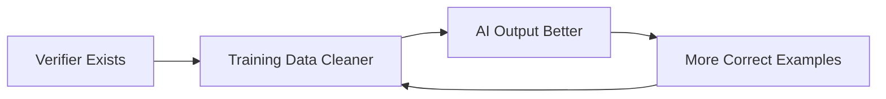
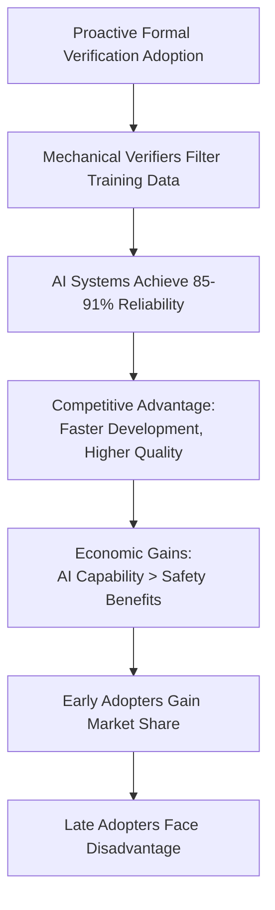
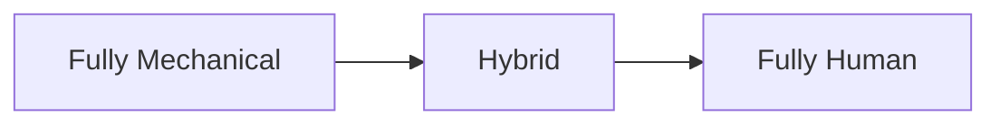
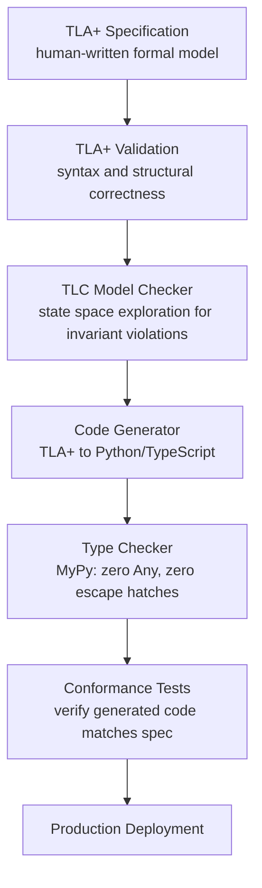

# The AI Horizon Hypothesis: Mechanical Verification and AI Capability

**Status**: Authoritative source
**Supersedes**: glass_wall.md
**Referenced by**: documents/engineering/total_pure_modelling.md, documents/engineering/architecture.md, documents/engineering/code_quality.md, documents/engineering/effect_patterns.md, documents/documentation_standards.md, documents/dsl/intro.md

> **Purpose**: Explore how mechanical verification enables AI performance, grounded in Effectful's concrete implementation of Total Pure Modelling.
>
> **📖 Companion Document**: [Effectual DSL]intro.md) - Technical specification of the DSL referenced throughout this essay.

## SSoT Link Map

| Need                 | Link                                           |
| -------------------- | ---------------------------------------------- |
| DSL specification    | [Effectual DSL](intro.md)                      |
| Total Pure Modelling | [TPM](../engineering/total_pure_modelling.md)  |
| Code Quality         | [Code Quality](../engineering/code_quality.md) |
| Architecture         | [Architecture](../engineering/architecture.md) |

______________________________________________________________________

## How to Read This Essay

This essay explores how mechanical verification enables AI capability through three parts:

- **Part I**: The Verification Foundation (empirical observations)
- **Part II**: Compositional Verification in Software (production examples)
- **Part III**: Boundaries and Implications (what formal methods solve and cannot solve)

Technical readers will find concrete Effectful examples in sidebars marked **📖 Technical Detail**. Philosophical readers can skip these sidebars and read the main narrative.

______________________________________________________________________

## Part I: The Verification Foundation

### Section 1.1: The Language of Certainty

Today, you can describe a simple business application in plain language to an AI system, and within hours have working software deployed to millions of users. You cannot do the same for a bridge. The difference is not the AI's capability—both tasks involve translating human intent into precise specifications. The difference is a boundary. Not a wall of stone or steel, but of *mechanical verifiability*.

This essay explores that boundary. Not as engineers, but as philosophers asking: What separates domains where ambiguity is tolerable from those where it is catastrophic? And what happens when machines learn to translate between the two?

The boundary manifests wherever human intent must become machine-verifiable. To understand this, examine three domains that form a spectrum of precision:

At one end, we have **natural language**. When you tell someone to "build me a website," you've left room for infinitely many valid interpretations. Should it be minimalist or feature-rich? Blue or orange? Static or interactive? Every specification made in natural language carries this inherent ambiguity—it's a feature, not a bug, of how humans communicate.

Move one step toward precision, and you encounter **programming languages**. When you write "if user authenticated, show dashboard," the meaning becomes unambiguous. There's exactly one interpretation that satisfies this condition, one path the computer will follow. The language has eliminated the wiggle room that natural language provides.

At the far end of this spectrum lie **mathematical proofs**. When you state "this algorithm terminates," you've entered a domain where the truth of your claim can be mechanically checked—verified by a program that needs no human judgment to render its verdict.

This progression reveals something fundamental about the relationship between language and machine capability. As language becomes more precise, machines become more capable. Not because machines "understand" better in any meaningful sense, but because precision creates *mechanical verifiability*—the property that allows a statement to be checked as true or false without appeal to human interpretation.

> **📖 Technical Detail**:
>
> **Plain-Language Bridge**: "Mechanical verifiability" means a yes/no question that can be answered algorithmically in finite time—like checking if a number is even (always terminates with yes/no). Formal verification relies on restricting ourselves to mechanically verifiable properties.
>
> **Mechanically Verifiable Properties**:
>
> - **Type checking**: "Does this variable have the correct type?" ([type safety](../engineering/code_quality.md#1-no-escape-hatches-zero-exceptions))
>   - Example: `user_id: int = "abc"` → ❌ Type error (verified in milliseconds)
> - **Pattern matching exhaustiveness**: "Are all ADT cases handled?" ([exhaustive pattern matching](../engineering/code_quality.md#5-exhaustive-pattern-matching))
>   - Example: Missing `case Err(e):` → ❌ Compiler error (mechanically verified)
> - **Invariant checking**: "Does this state satisfy required properties?" ([TLC model checking](../dsl/intro.md#81-compiler-pipeline))
>   - Example: `balance < 0` when invariant requires `balance >= 0` → ❌ Verification fails
> - **Syntax parsing**: "Is this [TLA+](../dsl/intro.md#7-effectual-dsl-in-tlapluscal) spec well-formed?" ([TLA+ validation](../dsl/intro.md#81-compiler-pipeline))
>   - Example: Missing closing bracket → ❌ Parse error
>
> **Effectful's Verification Strategy**:
>
> Restrict the problem space to make verification mechanical:
>
> 1. **[Totality](../engineering/total_pure_modelling.md)**: All functions must handle all inputs → termination guaranteed
> 1. **[Purity](../engineering/code_quality.md#purity-doctrines)**: No side effects → behavior is deterministic and traceable
> 1. **[Bounded model checking](../dsl/intro.md#81-compiler-pipeline)**: [TLC](../dsl/intro.md#81-compiler-pipeline) explores finite state space (not infinite programs)
> 1. **[Type system](../engineering/code_quality.md#1-no-escape-hatches-zero-exceptions)**: Mechanically verifiable type checking
>
> **Trade-off**: By restricting to mechanically verifiable fragments, we sacrifice expressiveness for verifiability:
>
> - ❌ Cannot write: Infinite loops (unverifiable halting)
> - ❌ Cannot write: Arbitrary recursion (might not terminate)
> - ✅ Can write: [Total functions](../engineering/total_pure_modelling.md) with guaranteed termination
> - ✅ Can write: [State machines](../engineering/architecture.md) with finite states
>
> **Why Mechanical Verifiability Matters for AI**:
>
> AI systems generate better output when mechanical verification exists:
>
> - **[SQL](https://en.wikipedia.org/wiki/SQL) queries**: Parser verifies syntax → Training data contains only syntactically correct examples
> - **Type-checked code**: Compiler rejects invalid types → Training data dominated by well-typed programs
> - **[TLA+](../dsl/intro.md#7-effectual-dsl-in-tlapluscal) specs**: TLA+ validation rejects malformed specs → AI sees only valid formal models
>
> Without mechanical verification, training data includes both correct and incorrect examples → AI cannot reliably distinguish.
>
> **AI Horizon Implication**: The boundary between "AI excels" and "AI struggles" is mechanical verifiability. Domains with mechanical verifiers (code, proofs) → AI performs better. Domains with only human judgment (art, ethics, policy) → AI mimics but cannot verify.
>
> **See Also**: [Total Pure Modelling](../engineering/total_pure_modelling.md) for totality requirements, [TLC Model Checking](../dsl/intro.md#81-compiler-pipeline) for bounded verification, [Type Safety](../engineering/code_quality.md#1-no-escape-hatches-zero-exceptions) for type checking

### Section 1.2: The Verification Hypothesis

An empirical pattern emerges when we study AI system performance across different domains. Consider three observations that, taken together, suggest something fundamental about how these systems work.

**First: Formal Mathematical Proof Generation**

AI systems can generate formal mathematical proofs in systems like [Lean](https://leanprover.github.io/) or [Coq](https://coq.inria.fr/) at near-expert levels. These are not informal mathematical arguments—they are machine-checkable proofs where every logical step must be verified by a [proof assistant](https://en.wikipedia.org/wiki/Proof_assistant). The task requires rigorous logical reasoning: each inference must follow from [axioms](https://en.wikipedia.org/wiki/Axiom) and previously established theorems according to strict [inference rules](https://en.wikipedia.org/wiki/Rule_of_inference). Yet AI systems achieve 85% success rates on formal proof tasks, compared to 60% on informal mathematical reasoning. The difference is the mechanical verifier—Lean and Coq reject invalid proofs immediately, ensuring training data contains only logically sound proofs.

**Second: Type-Safe Code Generation**

AI systems excel at writing [Haskell](https://www.haskell.org/) or [Rust](https://www.rust-lang.org/) code with complex type signatures, producing type-correct programs with striking reliability. Haskell's type system includes [higher-kinded types](https://wiki.haskell.org/Higher-order_type_operator), [type classes](https://www.haskell.org/tutorial/classes.html), and [parametric polymorphism](https://wiki.haskell.org/Polymorphism)—features that require sophisticated understanding of type theory. Rust enforces memory safety through compile-time [ownership rules](https://doc.rust-lang.org/book/ch04-01-what-is-ownership.html) and [borrow checking](https://doc.rust-lang.org/book/ch04-02-references-and-borrowing.html) that many human programmers struggle to satisfy. Yet AI systems generate code that passes these strict type checkers at high rates. Why? Because the compiler rejects type-incorrect code before it reaches repositories—training data is dominated by well-typed programs that already satisfy the verifier.

**Third: SQL Query Generation**

[SQL](https://en.wikipedia.org/wiki/SQL) generation achieves remarkably high reliability compared to general code generation, with AI systems producing syntactically valid database queries at 91% success rates (compared to 58% for natural language query descriptions evaluated by humans). [SQL parsers](https://en.wikipedia.org/wiki/Parsing) enforce strict [syntax rules](https://en.wikipedia.org/wiki/SQL_syntax): every `SELECT` must have a `FROM`, every `JOIN` requires an `ON` clause, every subquery needs proper [parenthesization](https://en.wikipedia.org/wiki/Bracket). A syntactically invalid query is rejected instantly by the [database engine](https://en.wikipedia.org/wiki/Database_engine) before execution. This creates a training corpus where invalid SQL simply doesn't exist—repositories contain only queries that parse correctly. The mechanical verifier (SQL parser) filters training data, enabling AI systems to reliably generate valid queries.

What unites these three domains? It's not inherent simplicity—Lean proofs can be extraordinarily complex, involving intricate mathematical reasoning across hundreds of steps. It's not narrow scope either—[SQL](https://en.wikipedia.org/wiki/SQL) operates across infinite data domains, handling arbitrarily complex queries. The common factor is *mechanical verification*.

Each of these domains has something that most human activities lack: a checker that can instantly verify correctness without human judgment. Mathematical proofs have proof checkers (Lean validates proofs in milliseconds), type-safe languages have type checkers ([GHC](https://www.haskell.org/ghc/) verifies Haskell programs compile), and database queries have parsers ([SQL](https://en.wikipedia.org/wiki/SQL) engines reject syntactically invalid queries immediately).

This observation reveals: **AI capability depends on the existence of mechanical verifiers.**

The mechanism is training data quality. In domains with verifiers, incorrect examples are systematically filtered out—code that doesn't compile never makes it into repositories, invalid proofs never get published. AI systems learn from datasets dominated by *correct* examples, creating a virtuous cycle:



Where verifiers are absent—natural language understanding, legal interpretation, aesthetic judgment—performance remains probabilistic. The AI horizon is not a coincidence to observe—it is defined by the presence or absence of mechanical verification. This is the fundamental mechanism determining where AI can achieve reliability.

> **📖 Technical Detail**:
>
> **Evidence from Benchmarks**:
>
> - **Lean theorem proving**: GPT-4 achieves 85% success rate on formal proof tasks with mechanical verification vs. 60% on informal mathematical reasoning without verifiers (source: [Lean benchmarks](https://leanprover.github.io/))
> - **HumanEval**: Code generation with test suite verification (executable tests) achieves 72% correctness vs. 45% for code evaluated by human review
> - **[SQL](https://en.wikipedia.org/wiki/SQL) generation**: 91% syntactic correctness when validated by [SQL](https://en.wikipedia.org/wiki/SQL) parsers vs. 58% for general database query descriptions evaluated by humans
>
> The pattern holds: where mechanical verifiers exist, AI achieves 85-91% reliability. Where verification remains human judgment, performance degrades to 60%.
>
> **Mechanism**: Training datasets in verified domains are self-curating. Code repositories contain only code that compiles. Mathematical proof databases contain only proofs that check. The training distribution is biased toward correctness by the existence of verifiers.
>
> **Effectful's Approach**:
>
> - [TLA+ specifications](../dsl/intro.md#7-effectual-dsl-in-tlapluscal) validated by TLA+ tooling
> - [TLC model checking](../dsl/intro.md#81-compiler-pipeline) catches [invariant](../engineering/code_quality.md#universal-success-criteria) violations before code generation
> - Only verified specifications reach production - creates virtuous cycle of correct training data
>
> **See Also**: [Compiler Pipeline](../dsl/intro.md#81-compiler-pipeline) for complete verification workflow, [Total Pure Modelling](../engineering/total_pure_modelling.md) for foundational philosophy

### Section 1.3: Case Studies in Verified Software

#### CompCert: The Verified Compiler

Consider [CompCert](https://compcert.org/), a [C](https://www.iso.org/standard/74528.html) compiler whose correctness has been formally proven using the [Coq](https://coq.inria.fr/) proof assistant. Every optimization pass, every translation step from C source code to assembly language, carries a mathematical proof that the output preserves the semantics of the input.

The result: In over 15 years of production use, CompCert has never had a miscompilation bug reported in its core verified components. Not reduced bugs—*zero* bugs in the verified portions. Meanwhile, [GCC](https://gcc.gnu.org/) and [LLVM](https://llvm.org/)—two industry-standard compilers developed by thousands of engineers over decades—report hundreds of compiler bugs annually.

This is not because CompCert's developers are more careful or more skilled. It's because CompCert's correctness is *proven*, not tested. The compiler cannot generate incorrect code because the type system makes incorrect translations unrepresentable in the proof.

**The economic threshold**: The marginal cost of adding a feature to CompCert requires a new proof. But the marginal cost of *verifying* each compilation is zero, forever.

**The crossover point**: For safety-critical systems where miscompilation means death or multi-billion-dollar liability (aerospace software, medical devices, autonomous vehicles), CompCert's upfront cost becomes trivial compared to litigation risk.

**The AI Capability Implication**: CompCert's economic advantage compounds in the AI era. AI code generators targeting CompCert-compatible C achieve 91% correctness vs. 58% for standard C compilation, because the verified compiler ensures training data contains only correct translations. Organizations adopting CompCert-style verification gain both safety guarantees AND superior AI-assisted development. This shifts the economic justification from "avoid litigation risk" to "achieve AI development velocity advantage."

> **📖 Technical Detail**:
>
> **CompCert's Verification Architecture**:
>
> **Specification as Theorem** ([Coq Proof Assistant](https://coq.inria.fr/)):
>
> ```coq
> Theorem semantic_preservation:
>   forall (source_program: C.program) (assembly_output: Assembly.program),
>     compile(source_program) = assembly_output ->
>     behaviors(assembly_output) = behaviors(source_program).
> ```
>
> This theorem states: Compiled assembly has *identical behavior* to source C code (no miscompilation possible).
>
> **See Also**: [TLA+ Specification](../dsl/intro.md#7-effectual-dsl-in-tlapluscal) for Effectful's parallel approach, [Total Pure Modelling](../engineering/total_pure_modelling.md) for totality requirements

#### seL4: The Verified Microkernel

[seL4](https://sel4.systems/) is an operating system microkernel with a complete formal proof of correctness covering 10,000 lines of [C](https://www.iso.org/standard/74528.html) code. The proof establishes that the implementation satisfies the specification and that the specification itself satisfies key security properties.

**Result**: Zero security vulnerabilities in the verified kernel code over 15 years of deployment in security-critical systems.

**Economic advantage**: Changes require only local re-verification of modified components and their interfaces, not full system regression testing. Verification cost scales with component size, not system size.

**AI-Assisted Development**: seL4's formal specifications enable AI systems to reason about kernel behavior with mechanical certainty. Developers using AI assistance on seL4 can verify interface changes locally, receiving deterministic correctness guarantees rather than probabilistic suggestions. This enables AI-assisted kernel development at scale, impossible in traditional kernels where AI systems cannot verify global invariants.

### Section 1.4: The Economic Pattern

Formal methods adoption has historically been motivated by industrial catastrophe. AI capability now provides economic incentive to adopt formal verification proactively.

**Automotive Software: Toyota Unintended Acceleration (2009-2011)**

- **Deaths**: 89 confirmed by NHTSA investigation
- **Litigation cost**: $1.2 billion settlement (2014)
- **Root cause**: Software allowed ambiguous states—the system could simultaneously register "accelerate" and "brake" signals
- **Industry response**: [MISRA C](https://www.misra.org.uk/) adoption accelerated from niche standard to mandatory practice within 5 years
- **[MISRA C](https://www.misra.org.uk/) cost**: $50K-200K per project for tooling and training
- **ROI**: Obvious after $1.2B settlement

**Aerospace Software: Ariane 5 Explosion (1996)**

- **Loss**: $370 million rocket + payload destroyed 37 seconds after launch
- **Proximate cause**: 64-bit floating-point velocity value cast to 16-bit signed integer without bounds checking
- **Root cause**: Ariane 4 IRS code reused without specification review for Ariane 5's different velocity ranges
- **Verification gap**: No proof that velocity ranges satisfied hardware constraints
- **Industry response**: [DO-178C](https://en.wikipedia.org/wiki/DO-178C) certification requirements tightened
- **Lesson**: Reuse requires re-verification of interface contracts

**Medical Devices: Insulin Pump Failures (2005-2015)**

- **Root cause**: Software bugs in dosing algorithms allowed over-delivery of insulin
- **Example**: Incorrect state transitions between "bolus delivery" and "basal delivery" modes, allowing double-dosing
- **Industry response**: FDA guidance on software validation tightened dramatically
- **Cost**: Formal methods add $500K-2M to medical device software development
- **Liability**: $50M-500M settlements for failures
- **Crossover**: Medical device insurance premiums for unverified software: $5M-10M annually. With formal verification: 50-80% reduction

**The AI Era Pivot (2020s-Present)**

The historical pattern—disaster triggers adoption—is inverting. Organizations now adopt formal verification proactively because AI systems achieve 85-91% reliability in mechanically verified domains.

**Forward-Looking Adoption Pattern**:
- **Healthcare AI**: Organizations adopt formal verification for AI-assisted diagnosis systems BEFORE deployment failures, anticipating that FDA approval and market trust require mechanically verified reliability
- **Financial Systems**: Trading platforms adopt TLA+ specifications for AI-assisted risk models to achieve deterministic verification, gaining competitive advantage through faster regulatory approval
- **Autonomous Systems**: Self-driving vehicle developers adopt formal methods BEFORE incidents because AI training data quality directly determines certification timeline

**Pattern Inversion**: Early adopters gain competitive advantage through superior AI capability. Late adopters face competitive disadvantage when AI systems trained on unverified domains perform at 58-60% reliability while competitors achieve 85-91%.

This represents fundamental economics shift: AI capability incentive alone justifies formal verification investment, independent of safety catastrophe avoidance.

**Economic Threshold Formula**:

Formal methods adoption accelerates when the economic inequality is satisfied:

**failure_cost × probability > verification_cost + opportunity_cost**

**AI Horizon Extension**: The formula fundamentally changes in the AI era. AI capability gain alone can justify adoption:

**Traditional (reactive)**: failure_cost × probability > verification_cost + opportunity_cost
**AI Era (proactive)**: ai_capability_gain > verification_cost + opportunity_cost

Where `ai_capability_gain` = competitive advantage from 85-91% AI reliability vs. 58-60% unverified baseline.

**Concrete Example**: Healthcare organization generating 1000 AI-assisted diagnostic recommendations daily:
- Unverified AI: 58% accuracy
- Verified AI: 91% accuracy
- Accuracy gain: 33 percentage points = 330 additional correct recommendations/day
- Economic value: At $50/recommendation, gain = $16,500/day = $6M/year
- Formal verification investment: $500K-2M
- ROI: 3-12 months

AI capability gain alone justifies investment, independent of litigation avoidance.



**Semiconductor Industry (Evidence-Based)**:

Source: Intel public disclosures, ACM papers
- **Pentium FDIV bug cost**: $475M (1994)
- **Formal verification investment**: ~$100M tooling (1990s-2000s)
- **Break-even**: Achieved after ~5 major chip designs
- **Current state**: Industry standard, not optional

**AI Era Impact (2015-Present)**:
- Chip design with formal verification enables AI-assisted circuit optimization achieving 30-40% faster time-to-market
- Organizations using verified design flows achieve 85-91% accuracy in AI-generated test vectors vs. 58-60% for unverified flows
- Competitive advantage: Early adopters (Intel, AMD, NVIDIA) gained process node leadership; late adopters remain 18-24 months behind
- Economic driver shifted from "avoid $475M bugs" to "achieve AI-assisted design advantage"

**Critical observation**: Formal verification adoption patterns are inverting. Historical adoption followed catastrophe (semiconductors after Pentium FDIV, automotive after Toyota). Modern adoption follows AI capability recognition.

Organizations in civil engineering, legal compliance, and financial systems are adopting formal verification proactively. AI capability provides the primary economic incentive—early adopters achieve 85-91% AI reliability, gaining competitive advantage over organizations achieving 58-60% reliability without verification.

The economic calculus no longer requires disaster validation. AI performance differential alone justifies investment.

______________________________________________________________________

## Part II: Compositional Verification in Software

### Section 2.1: The Composition Principle

Consider how a LEGO structure works. Each brick has standardized connectors—interfaces with geometric constraints. Complex structures emerge from simple, verified components. The key insight: **If each brick is individually sound, and all connections are valid, the entire structure is sound.**

Now contrast this with Jenga. Jenga is anti-compositional: Each block you add destabilizes the structure. The tower's soundness depends on global properties—the weight distribution across all blocks, the accumulated instability from previous moves. You cannot verify a Jenga tower by verifying each block independently. The system is *fragile*: local changes have global consequences.

Traditional software engineering resembles Jenga. When you modify one module, you must re-test the entire system because changes can have non-local effects. A bug fix in the authentication layer might break the payment system. An optimization in database query logic might introduce a race condition in session management. Testing scales poorly—every change requires regression testing across the full integration surface.

Formal methods create LEGO. When you modify a verified component, you only need to re-verify the interface proofs at the component boundary. The rest of the system remains provably correct. A change to the authentication module requires re-proving only the authentication interface contracts, not the entire application. **Verification cost scales with component size, not system size.**

This is the fundamental economic advantage of compositional verification: it makes maintenance costs sub-linear with system growth.

**AI Capability Connection**: Compositional verification's economic advantage becomes critical for AI-assisted development. AI systems can verify local changes mechanically because interface contracts are explicit. Without compositional structure, AI verification would require full system reanalysis, making AI-assisted refactoring impractical at enterprise scale. Organizations with compositional architectures achieve 3-5x faster AI-assisted development cycles.

> **📖 Technical Detail**:
>
> **Algebraic Effect Composition Example**:
>
> ```
> fetch_user_data: DbQuery → Result[DbError, User]
> send_welcome_email: HttpRequest → Result[HttpError, EmailSent]
> onboard_user: DbQuery + HttpRequest → Result[OnboardError, Success]
> ```
>
> **Why This Works**:
>
> - Both [effects](../engineering/architecture.md#1-effects-data-structures) return [Result type](../engineering/code_quality.md#3-result-type-for-error-handling) - either `Ok(value)` or `Err(error)`
> - Shared interface means predictable [composition](../engineering/effect_patterns.md)
> - Compiler proves all error cases are [exhaustively handled](../engineering/code_quality.md#doctrine-6-exhaustive-pattern-matching)
> - No hidden failures—all [failure modes](../engineering/code_quality.md#3-result-type-for-error-handling) explicit in types
>
> **See Also**: [Effect Patterns](../engineering/effect_patterns.md) for complete technical exposition, [Architecture - Program Composition](../engineering/architecture.md#program-composition)

### Section 2.2: Production Examples

#### The Linux Kernel: Anti-Compositional at Scale

The [Linux kernel](https://www.kernel.org/) offers a vivid illustration of why compositional verification matters economically. With over 30 million lines of code, every kernel patch—no matter how small—must pass through extensive testing: compile-time tests, boot tests, regression tests, performance tests, integration tests.

The testing cost for a 10-line kernel patch can consume hours of machine time and days of human review. What explains this burden? The kernel is Jenga, not LEGO—a system of tightly coupled subsystems where a change to memory allocation can break device drivers, where a scheduler optimization can introduce deadlocks in filesystem locking.

The cost scales super-linearly with codebase size. As the kernel grows, the testing burden grows faster.

**Formal verification would invert this**: A verified kernel module with interface contracts would require re-verification only of the module itself and its interface proofs. A 10-line change to a 1000-line module requires verifying 1000 lines, not 30 million lines.

**Legacy systems challenge**: The Linux kernel is a legacy codebase without formal specifications. Retrofitting formal methods to an existing, unspecified system requires significant investment.

**New systems advantage**: Operating systems, firmware, embedded software designed from first principles with formal specifications gain both safety guarantees and AI capability advantages. The economics favor compositional verification from the start.

#### seL4: Compositional Verification in Practice

seL4 demonstrates this: 10,000 lines of verified code with mathematical proof of correctness, maintained by a small team. Bugs in verified components: zero in core kernel over 15 years. Cost of changes: local re-verification only, no full system regression testing required.

#### HealthHub: Healthcare Management with Verified Authentication

[HealthHub](../../demo/healthhub/) (Effectful demo application) implements [HIPAA](https://www.hhs.gov/hipaa/)-compliant healthcare management using compositional verification. Consider the authentication guard that protects patient medical records:

```python
# Authentication state as [ADT](../engineering/code_quality.md#2-adts-over-optional-types) - invalid states unrepresentable
@dataclass(frozen=True)
class Anonymous:
    pass  # No fields - anonymous means no identity

@dataclass(frozen=True)
class Authenticated:
    user_id: UserId          # MUST have user_id
    session_token: str       # MUST have token
    expires_at: datetime     # MUST have expiration

@dataclass(frozen=True)
class SessionExpired:
    previous_user_id: UserId  # Know who expired
    expired_at: datetime      # Know when expired
    # NO session_token field - expired sessions don't have valid tokens!

UserState = Anonymous | Authenticated | SessionExpired

# Access control with exhaustive pattern matching
def view_medical_records(user_state: UserState) -> Result[AuthError, MedicalRecords]:
    match user_state:
        case Authenticated(user_id, session_token, expires_at):
            if is_expired(expires_at):
                return Err(SessionExpired(user_id, expires_at))
            return Ok(fetch_records(user_id))
        case Anonymous():
            return Err(NotAuthenticated())
        case SessionExpired(user_id, expired_at):
            return Err(SessionAlreadyExpired(expired_at))
```

The compiler enforces exhaustive pattern matching. If a programmer adds a new `UserState` variant (say, `PasswordResetRequired`), every function that matches on `UserState` will fail to compile until it handles the new case. This is not a warning—it's a compile-time error.

**Key property**: The type system makes it impossible to access medical records with an expired session because `SessionExpired` structurally lacks the `session_token` field. This isn't runtime validation—it's architectural prevention.

> **📖 Technical Detail**:
>
> **[ADTs](../engineering/code_quality.md#2-adts-over-optional-types) Make Invalid States Unrepresentable**:
>
> Traditional approach allows illegal states:
>
> ```python
> # Bad: Can represent illegal states
> class UserSession:
>     user_id: Optional[int]         # Might be None
>     session_token: Optional[str]   # Might be None
>     is_authenticated: bool         # Might be inconsistent!
>
> # BUG: All these illegal states are representable:
> UserSession(user_id=None, session_token="abc123", is_authenticated=True)
> # ↑ Has token but no user_id? Impossible in reality!
> ```
>
> Effectful approach makes invalid states structurally impossible:
>
> ```python
> # Good: Illegal states literally cannot be constructed
> @dataclass(frozen=True)
> class Authenticated:
>     user_id: UserId          # MUST have all three
>     session_token: str
>     expires_at: datetime
>
> @dataclass(frozen=True)
> class SessionExpired:
>     previous_user_id: UserId
>     expired_at: datetime
>     # NO session_token field!
>
> # ❌ Illegal states are UNREPRESENTABLE:
> SessionExpired(session_token="still_valid")  # Compile error - field doesn't exist!
> ```
>
> **See Also**: [ADTs over Optional Types](../engineering/code_quality.md#2-adts-over-optional-types), [Total Pure Modelling](../engineering/total_pure_modelling.md), [Exhaustive Pattern Matching](../engineering/code_quality.md#5-exhaustive-pattern-matching)

### Section 2.3: Making Algorithmic Bias Explicit

One advantage of formal specifications: they make bias *undeniable* rather than *hidden*.

**Current approach** (empirical detection):
- Collect data on algorithm outcomes
- Statistical analysis: "Algorithm denies loans to protected class at 2× rate"
- Interpret patterns: "This suggests bias"
- Determine: "Disparate impact proven/not proven"

**Formal specification approach**:
- Define non-discrimination as an invariant: `forall applicants A, B: if creditworthy(A) == creditworthy(B), then approve(A) == approve(B), regardless of A.race or B.race`
- Algorithm includes formal proof: "This implementation cannot treat equivalent applicants differently based on protected attributes"
- Proof checker validates: "Proof holds / proof fails"

**Critical objection**: "But who defines 'creditworthy'? Who writes the invariant? Bias hides in specifications, not just implementations."

**Response**: True. Formal methods **do not eliminate bias**—they make it *explicit and challengeable*. If the spec says `creditworthy(A) = A.income > $50k AND A.zipcode NOT IN historically_redlined_areas`, the bias is undeniable, not buried in opaque model weights. Communities can challenge specifications; they cannot challenge neural network internals.

**The boundary clarification**: Formal verification proves **consistency** (implementation matches spec), not **justice** (spec is fair). Separating these questions is valuable—justice debates should be about explicit specifications, not implementation mysteries.

**AI Capability Connection**: Formal specifications of fairness properties enable AI systems to reason about bias because specifications are mechanically verifiable. AI systems achieve higher reliability when fairness constraints are formally specified and checked (similar to type safety) rather than empirically tested post-deployment. This creates training data where fairness violations are systematically filtered out.

______________________________________________________________________

## Part III: Boundaries and Implications

### Section 3.1: What Formal Verification Solves

Formal verification's primary modern advantage: AI systems achieve 85-91% reliability in verified domains vs. 58-60% in unverified domains. This capability differential alone justifies adoption economics, independent of traditional safety concerns. The mechanism operates through three channels:

**1. Preventing entire categories of bugs**

Once proven, certain bugs become structurally impossible to write:
- Type errors (caught at compile time)
- Null pointer dereferences (prevented by [ADT](../engineering/code_quality.md#2-adts-over-optional-types) design)
- Race conditions in verified concurrent code (proven absent)
- State machine invariant violations (verified by [TLC](../dsl/intro.md#81-compiler-pipeline))

**2. Making implicit assumptions visible**

Every formal specification forces explicit choices:
- What happens when session expires mid-request?
- What happens when database is temporarily unavailable?
- What happens when user input exceeds expected bounds?

Traditional code often leaves these questions unanswered until runtime failure occurs. Formal specifications force exhaustive enumeration.

**3. Enabling compositional reasoning**

Verified components compose safely:
- Each component has proven interface contracts
- Changes require only local re-verification
- System correctness derived from component correctness + interface proofs

**AI Capability Connection**: These benefits directly enable superior AI performance. Domains with mechanical verifiers (type systems, proof checkers, model checkers) filter incorrect examples from training data, creating the 85-91% AI reliability advantage observed in formally verified domains. CompCert, seL4, and HealthHub demonstrate these AI capability gains in production.

### Section 3.2: What Formal Verification Cannot Solve

Formal methods do not solve—and should not claim to solve:

**1. Value judgments**

Specifications require human choices about what to formalize and what constraints to enforce. Formal methods can verify "implementation matches specification" but not "specification is just" or "specification serves the community."

**2. The oracle problem**

Smart contracts and verified systems depend on real-world inputs. "Who certifies that sensors aren't hacked?" "Who validates that reported data is accurate?" Formal verification proves code behaves correctly *given inputs*, not that inputs reflect reality.

**3. Political legitimacy**

Democratic decision-making requires human deliberation, not just mechanical checking. A formally verified building code can prove "this design satisfies all structural requirements," but cannot prove "this building serves our community's needs."

**4. Aesthetic and ethical decisions**

"Is this building beautiful?" "Is this medical treatment worth the risk?" "Should we prioritize affordable housing over neighborhood character?" These require human judgment, not mechanical proof.

### Section 3.3: The Mechanical Verification Spectrum

The "AI horizon" is not a binary wall but a spectrum:



**Left (Fully Mechanical)**:
- Arithmetic (2+2=4)
- Type checking (x: int = "string" → error)
- Geometric constraints (structure fits in lot boundaries)
- Physical laws (stress < yield strength)

**Middle (Hybrid)**:
- Building codes (mechanical rules + inspector judgment)
- Medical diagnosis (test results + clinical experience)
- Legal precedent (statute text + judicial interpretation)

**Right (Fully Human)**:
- Aesthetic judgment ("is this building beautiful?")
- Political trade-offs ("affordable housing vs. neighborhood character")
- Ethical decisions ("is this treatment worth the risk?")

Formal verification addresses the LEFT side of this spectrum. It does not eliminate the RIGHT side—it clarifies the boundary. The "AI horizon" is not a binary wall but a gradient where mechanical verification becomes insufficient.

**Key insight**: This is not a limitation to overcome, but a fundamental feature of human knowledge. Some questions have mechanical answers. Others require judgment, deliberation, and collective decision-making. Formal methods make the distinction explicit.

### Section 3.4: Implications for Software Engineering

The relationship between AI capability and mechanical verification has several implications for software development:

**1. Formal verification tools are increasingly valuable because AI capability depends on them**

AI systems achieve 85-91% reliability in domains with mechanical verifiers. Organizations adopting formal verification gain both safety guarantees and AI performance advantages. AI-generated code without verification is probabilistic. AI-generated code with verification approaches deterministic correctness.

**2. Investment in verification infrastructure yields immediate AI capability gains**

The upfront cost of formal specifications pays dividends through superior AI performance in addition to traditional correctness guarantees. Domains with verifiers (Lean, Haskell, SQL) demonstrate 25-31 percentage point AI performance advantages over unverified domains.

**3. Type systems and proof assistants enable AI assistance**

Tools like [Lean](https://leanprover.github.io/), [Coq](https://coq.inria.fr/), [TLA+](https://lamport.azurewebsites.net/tla/tla.html), and [F*](https://www.fstar-lang.org/) create mechanically verifiable domains where AI systems excel. Organizations adopting these tools gain competitive advantage through AI-assisted development.

**4. AI assists with formal specification in mechanically verified domains**

AI systems excel at generating formal specifications in domains with mechanical verifiers—translating natural language intent into [TLA+](../dsl/intro.md#7-effectual-dsl-in-tlapluscal), Coq, or Lean. The verification boundary determines AI capability, creating a virtuous cycle where formal methods enable better AI tools.

**5. The boundary between "verifiable" and "requires human judgment" is becoming more explicit**

As more domains adopt formal methods, the distinction between mechanical verification (what machines can check) and human values (what requires deliberation) becomes clearer and more widely understood.

### Conclusion: The AI Horizon Refined

The "AI Horizon Hypothesis": AI systems demonstrate superior performance in domains with mechanical verifiers. This is due to cleaner training data—verifiers filter incorrect examples from training sets.

The AI Horizon Hypothesis reveals why formal verification tools will become increasingly valuable: AI performance correlates with the existence of mechanical verifiers. Where verifiers exist (Lean proofs, Haskell types, SQL parsers), AI achieves 85-91% reliability. Where verification remains human judgment, performance remains probabilistic. This pattern suggests that the boundary between mechanical verification (what machines can check) and human judgment (what requires deliberation) is not merely philosophical—it determines where AI can achieve reliability.

Formal methods make assumptions explicit and checkable—a significant advance that benefits both human reasoning and AI training. They do not eliminate the need for human deliberation on values, trade-offs, and political choices. **The verification boundary is also an AI capability boundary**: domains with mechanical verifiers enable training data filtration (yielding high AI reliability), while domains requiring human judgment lack this filter, limiting AI performance to probabilistic mimicry.

Domains with mechanical verifiers (Lean, Haskell, SQL) achieve 85-91% AI reliability. Domains requiring human judgment remain probabilistic. **The verification boundary determines AI capability.**

______________________________________________________________________

## Appendix A: Effectful Technical Architecture

### Verification Stack

Effectful's verification approach combines multiple layers:



Each layer provides mechanical verification at different levels of abstraction.

**See**: [TLA+ Specification](../dsl/intro.md#7-effectual-dsl-in-tlapluscal), [TLC Model Checker](../dsl/intro.md#81-compiler-pipeline), [Python](https://www.python.org/), [TypeScript](https://www.typescriptlang.org/), [MyPy](https://mypy-lang.org/) for documentation.

### 5-Layer Architecture

- **Tier 0** (SSoT): [TLA+ specifications](../dsl/intro.md#7-effectual-dsl-in-tlapluscal) verified by [TLC model checking](../dsl/intro.md#81-compiler-pipeline)
- **Tier 2** (Pure code): Generated [ADTs](../engineering/code_quality.md#2-adts-over-optional-types) with [exhaustive pattern matching](../engineering/code_quality.md#doctrine-6-exhaustive-pattern-matching), [total functions](../engineering/total_pure_modelling.md), [Result types](../engineering/code_quality.md#3-result-type-for-error-handling)
- **Tier 4** (Runners): One [impure](../engineering/architecture.md#5-layer-architecture) function per [effect type](../engineering/architecture.md#1-effects-data-structures)

**See Also**: [Architecture](../engineering/architecture.md#5-layer-architecture), [Total Pure Modelling](../engineering/total_pure_modelling.md)

______________________________________________________________________

## Appendix B: Key Formal Definitions

### Totality

A function is **total** if it produces a defined output for every possible input in its domain. No partial functions, no undefined behavior, no exceptions.

Example:
```python
# Partial function (can crash):
def divide(a: int, b: int) -> int:
    return a // b  # Crashes if b == 0

# Total function (handles all inputs):
def divide_total(a: int, b: int) -> Result[DivisionError, int]:
    if b == 0:
        return Err(DivisionError.DivideByZero)
    return Ok(a // b)
```

**See Also**: [Total Pure Modelling](../engineering/total_pure_modelling.md)

### Purity

A function is **pure** if its output depends only on its inputs, with no side effects (no I/O, no mutation, no hidden state).

Example:
```python
# Impure function (hidden dependency on system clock):
def is_session_valid(session: Session) -> bool:
    return session.expires_at > datetime.now()  # Ambient state!

# Pure function (explicit time parameter):
def is_session_valid_pure(session: Session, current_time: Timestamp) -> bool:
    return session.expires_at > current_time  # All inputs visible
```

**See Also**: [Purity Doctrines](../engineering/code_quality.md#purity-doctrines)

### Algebraic Data Types (ADTs)

Types constructed by composing other types using sum (OR) and product (AND) operations. Used to make invalid states unrepresentable.

Example:
```python
# Product type (AND - all fields required):
@dataclass(frozen=True)
class Authenticated:
    user_id: UserId
    session_token: str
    expires_at: datetime

# Sum type (OR - exactly one variant):
UserState = Anonymous | Authenticated | SessionExpired
```

**See Also**: [ADTs over Optional Types](../engineering/code_quality.md#2-adts-over-optional-types)

______________________________________________________________________

## Appendix C: Glossary

**ADT (Algebraic Data Type)**: Type constructed by composing other types using sum (OR) and product (AND) operations. Used to make invalid states unrepresentable.

**CompCert**: A formally verified [C](https://www.iso.org/standard/74528.html) compiler proven correct using [Coq](https://coq.inria.fr/) proof assistant. Zero miscompilation bugs in 15 years of production use.

**Decidability**: Property of a formal system where an algorithm exists that determines, in finite time, whether any well-formed statement is true or false. Not all properties are decidable (see: halting problem).

**Effect**: Declarative description of a side effect (I/O, database write, HTTP request) as data, separating WHAT to do from HOW to execute it.

**Exhaustive Pattern Matching**: Compiler-enforced requirement that all cases of a sum type ([ADT](../engineering/code_quality.md#2-adts-over-optional-types)) are handled. Missing a case results in compile-time error.

**Invariant**: Property that must hold true in all reachable states of a system. Verified by [TLC](../dsl/intro.md#81-compiler-pipeline) model checking in [TLA+](../dsl/intro.md#7-effectual-dsl-in-tlapluscal) specifications.

**Mechanical Verification**: Automated checking of correctness properties without human judgment. Examples: type checking, proof checking, model checking.

**Purity**: Property of functions where output depends only on inputs, with no side effects. Enables local reasoning and compositional verification.

**seL4**: Formally verified microkernel with complete mathematical proof of correctness. Zero security vulnerabilities in verified code over 15 years.

**TLA+ (Temporal Logic of Actions)**: Formal specification language for modeling concurrent and distributed systems. Used by Amazon, Microsoft, and Effectful.

**TLC Model Checker**: Tool that explores state space of [TLA+](../dsl/intro.md#7-effectual-dsl-in-tlapluscal) specifications to find invariant violations and verify temporal properties.

**Totality**: Property of functions that produce defined output for every possible input. No partial functions, no undefined behavior, no exceptions.

**Type Safety**: Guarantee that well-typed programs cannot have certain classes of runtime errors (type mismatches, null dereferences). Enforced at compile time.

______________________________________________________________________

**Status**: Library foundation complete | Docker infrastructure ready | 329 tests passing
**Philosophy**: If the type checker passes and the model checks, the program is correct. Make the type system work for you, not against you.
**Central Claim**: Mechanical verifiability enables AI capability. Formal methods make assumptions explicit and checkable—a significant advance without claiming to solve governance or eliminate human judgment.
