# DSL Compiler Morphology

**Status**: Reference only
**Supersedes**: none
**Referenced by**: none

> **Purpose**: Survey the compiler-stack design space for a formally informed DSL that compiles distributed effect topologies to optimized Rust and other target-native realizations, with emphasis on IR shape, purity-boundary and proof-boundary placement, optimization strategy, and backend realization.
> **📖 Authoritative Reference**: [DSL Intro](intro.md), [JIT Compilation](jit.md), and [Proof Engine](proof_engine.md)

______________________________________________________________________

## SSoT Link Map

| Need                       | Link                                                            |
| -------------------------- | --------------------------------------------------------------- |
| DSL overview               | [DSL Intro](intro.md)                                           |
| Compilation strategy       | [JIT Compilation](jit.md)                                       |
| Pure compute DAG semantics | [Pure Compute DAGs in Haskell](pure_compute_dags_in_haskell.md) |
| Verification workflow      | [Proof Engine](proof_engine.md)                                 |
| Proof boundary philosophy  | [Proof Boundary](proof_boundary.md)                             |

______________________________________________________________________

## 1. Problem Statement

We want to design a compiler stack for a domain-specific language whose purpose is not merely to describe programs, but to describe **arbitrarily complex distributed compute systems** in a form that is:

- **pure at the representation level**
- **typed and law-aware**
- amenable to **global optimization at transpile time**
- suitable for **formal reasoning**
- compilable to **small, high-performance binaries or target-native artifacts**
- extensible enough to support:
  - portable abstractions
  - opinionated domain abstractions
  - runtime-native escape hatches
  - future runtimes not yet known at design time, whether they are best reached through Rust or
    through target-native backends

The goal is not absolute universality in the sense of perfectly abstracting every possible runtime behind one clean effect theory. The goal is instead a **universal topology**:

- generic when helpful
- opinionated when productive
- runtime-specific when necessary
- optimizable all the way down to target-native realization

That means the central problem is not simply “which language should we use?” The real problem is:

> How do we design a compiler stack whose intermediate semantics are rich enough to model distributed systems, constrained enough to optimize aggressively, and structured enough to admit meaningful proof obligations?

______________________________________________________________________

## 2. Core Objectives

### 2.1 Primary Objectives

The system should:

1. Represent distributed computation as a **pure, typed effect topology**
1. Support **arbitrarily complex logic**, including:
   - state machines
   - messaging
   - replication
   - retries
   - partial failure
   - timeouts
   - scheduling
   - causal dependencies
   - edge deployment constraints
1. Enable **compile-time compute graph optimization**
1. Support **formal methods** for:
   - correctness of the core calculus
   - correctness of transformations
   - distributed consistency properties
   - refinement from source semantics to lowered implementations
1. Generate **highly optimized Rust where Rust can target the runtime, and target-native code where
   it cannot**
1. Allow both:
   - portable effects
   - runtime-native effects
1. Remain extensible enough that a new runtime can be added by defining:
   - effect signatures
   - laws
   - lowering rules
   - interpreter/runtime support in Rust or the required target-native substrate

### 2.2 Secondary Objectives

The system should ideally also:

- permit staged lowering
- distinguish proof-friendly fragments from pragmatic fragments
- support multiple proof backends when useful
- avoid overcommitting to one theorem prover as the source language
- permit native performance work without destroying the higher-level semantics

### 2.3 Non-Goals

The system does **not** need to guarantee:

- complete proof of every emitted backend artifact
- a single universal abstraction that hides all runtime detail
- total portability of all programs across all targets
- zero escape hatches into runtime-native semantics

______________________________________________________________________

## 3. Design Thesis

The emerging design thesis is:

> The right architecture is not a single universal effect language and not a proof assistant used as the entire implementation substrate. It is a layered, law-aware, graph-oriented compiler architecture with explicit proof boundaries and explicit native escape hatches.

A useful reformulation is:

> Build a typed capability topology, not an all-explaining abstraction.

This shifts the focus from “can one language do everything?” to “how should the compiler stack be decomposed?”

### 3.1 Boundary Alignment

In the canonical boundary model from [intro.md](intro.md#2-the-proof-boundary-and-purity-boundary):

- the surface DSL, pure effect descriptions, and inspectable workflow representations live inside the **purity boundary**
- generated Rust, JS, Swift, Kotlin, C++, CUDA, and other imperative interpreters live outside the **purity boundary**
- those imperative runtimes may still remain inside the **proof boundary** when their lowering rules, memory contracts, and runtime behavior are modeled and verified
- drivers, operating-system services, vendor SDKs, firmware, and undocumented hardware behavior remain outside the **proof boundary**

This distinction matters for morphology. IR choices closest to the source side are often purity-boundary questions. Backend selection, runtime contracts, and assumption management are usually proof-boundary questions.

______________________________________________________________________

## 4. Architectural Shape

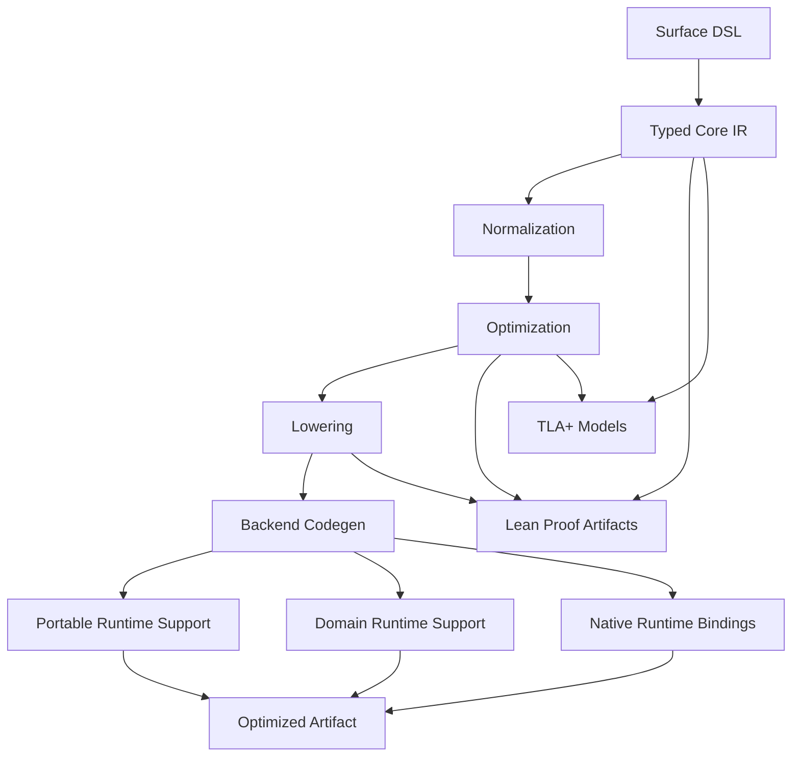

This diagram captures the intended shape:

- the **source language** is not identical to the proof language
- the **IR** is central
- the **optimizer** is semantically constrained
- **Lean** and **TLA+** can both be consumers of the semantic core
- **Rust** remains a preferred realization substrate where it can target the runtime, but it is not
  the only relevant backend

______________________________________________________________________

## 5. Why Morphology Instead of Discrete Options

A simple choice like:

- option A: Lean-first
- option B: Haskell DSL
- option C: Rust compiler core

is useful early on, but too coarse.

The real design space is **morphological**, meaning it is made of multiple semi-independent axes:

- authoring language
- compiler implementation language
- IR shape
- effect system design
- proof strategy
- model checking strategy
- optimization strategy
- backend strategy
- runtime strategy
- trust boundary
- escape-hatch policy

Some combinations are much better than others, but the space is still best understood as a morphology rather than a menu.

______________________________________________________________________

## 6. Morphology Overview

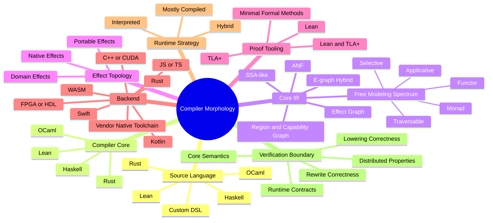

______________________________________________________________________

## 7. The Proof Problem

A central design issue is determining **which classes of proofs are needed**, which are optional, and which tools are best suited for each class.

This problem is easier if we distinguish several proof classes.

### 7.1 Class I: Core Language Metatheory

Questions:

- Is the core IR well-typed?
- Do rewrites preserve typing?
- Does normalization preserve meaning?
- Are effect capabilities tracked soundly?
- Are certain transformations semantics-preserving?

These are theorem-prover-style questions.

**Lean** is a strong candidate here because:

- it is good at mechanizing type systems
- it is good at proof by induction over syntax and semantics
- it is good at proving preservation/progress-style theorems
- it is good at defining executable or relational semantics for a core calculus

**TLA+** is much less natural here because:

- it is not optimized for metatheory of programming languages
- it is stronger for system execution models than for syntactic proof engineering

#### Recommended tooling for Class I

- primarily **Lean**
- possibly paper proofs or lightweight mechanization initially
- TLA+ generally not central

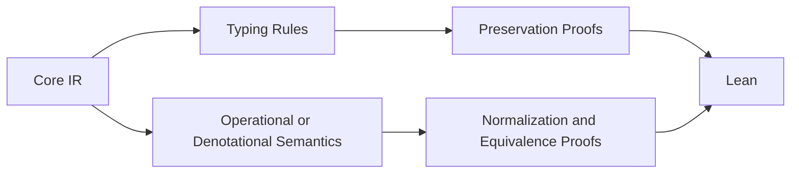

### 7.2 Class II: Rewrite and Optimization Correctness

Questions:

Here, **fusion** means combining adjacent operations or graph regions into one larger computation
without changing observable behavior. It matters because successful fusion can eliminate
intermediate materializations, reduce launch or scheduling overhead, and expose larger optimization
regions to the backend.

- Is fusion valid?
- Is batching valid?
- Is reordering valid?
- Is partial evaluation semantics-preserving?
- Does graph compaction preserve observable behavior?
- Which rewrites require capability-specific laws?

These proofs are usually local but numerous.

Lean is valuable because it can prove:

- equivalence of rewrite rules
- correctness of optimizer fragments
- legality conditions under explicit assumptions

TLA+ can help indirectly when the rewrite affects:

- concurrency
- retries
- delivery order
- temporal behavior

But TLA+ is not the best place to prove a whole optimizer correct in the theorem-prover sense.

#### Recommended tooling for Class II

- **Lean** for rewrite theorems
- **TLA+** for stress-testing distributed rewrites whose correctness depends on execution behavior
- both together when the rewrite spans both local semantics and temporal interactions

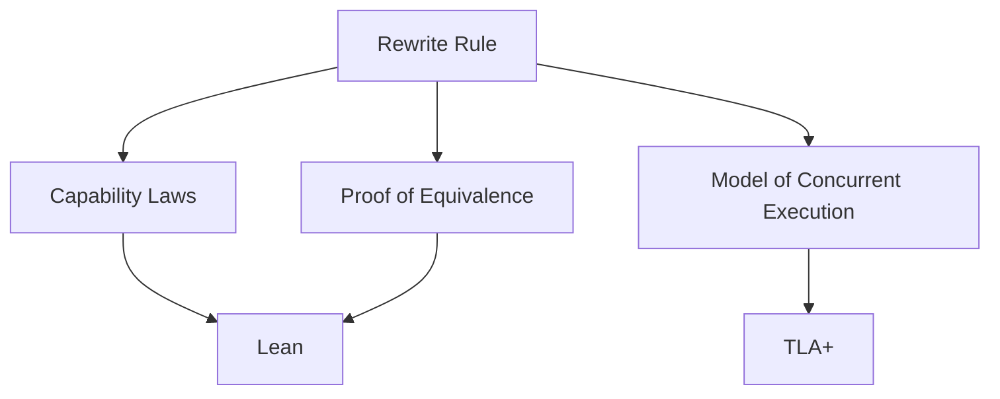

### 7.3 Class III: Distributed Safety and Eventual Consistency

Questions:

- Does a replicated fragment converge?
- Are invariants preserved under message reorderings?
- Are retry rules safe?
- Does a synchronization protocol satisfy desired safety properties?
- Are liveness claims plausible under the stated assumptions?

This is the class where **TLA+** becomes especially attractive.

TLA+ is strong for:

- temporal properties
- distributed execution spaces
- exploring failure and reordering scenarios
- checking invariants in state-machine terms

Lean can still matter here when:

- a fragment has a clean mathematical characterization
- one wants a theorem of convergence or refinement
- one wants reusable proofs of laws for replicated data types or protocol fragments

#### Recommended tooling for Class III

- **TLA+** for protocol behavior, execution exploration, temporal properties
- **Lean** for reusable mathematical theorems about convergence, refinement, or protocol fragments
- often **both**

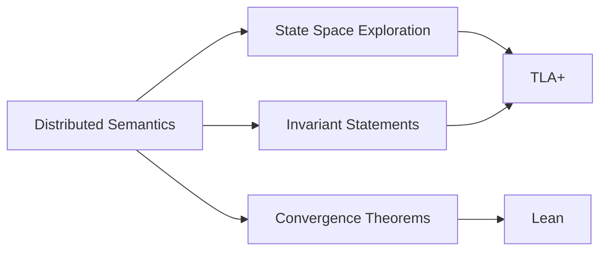

### 7.4 Class IV: Lowering and Refinement Correctness

Questions:

- Does lowering from portable effects to domain effects preserve the intended semantics?
- Does lowering from domain effects to native effects preserve required observables?
- Does the target-language state-machine representation refine the source graph semantics?
- Which guarantees are retained when escape hatches are used?

This class is tricky because it sits at the boundary between proof and engineering.

Lean is well suited to:

- proving refinement theorems for core fragments
- proving selected lowering passes correct
- proving preservation of observables for restricted subsets

TLA+ is useful when the relevant observable semantics are temporal or distributed, especially if the lowering changes scheduling or coordination.

#### Recommended tooling for Class IV

- **Lean** for formal refinement of core or restricted fragments
- **TLA+** for temporal/refinement sanity checks of distributed lowerings
- often staged: proof for the core, model checking for the complicated distributed surface

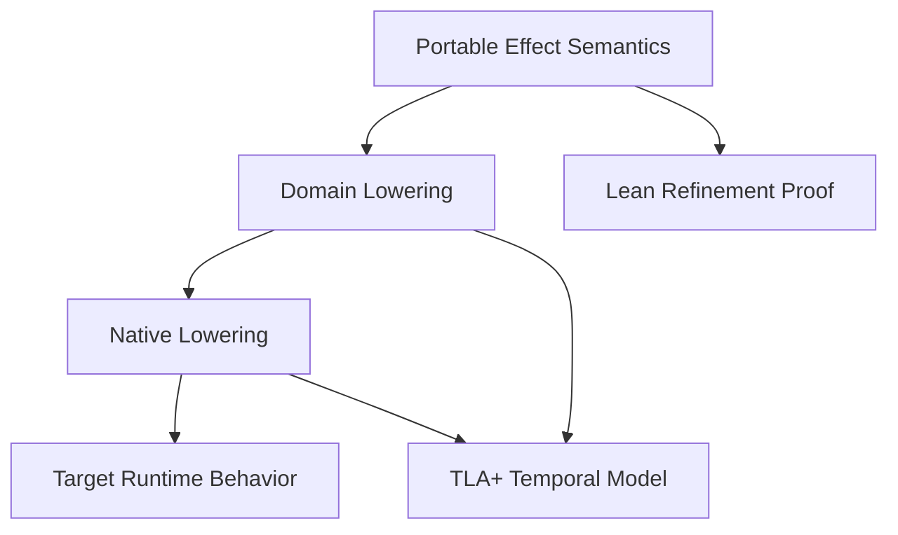

### 7.5 Class V: Runtime Contract Verification

Questions:

- Does a specific native interpreter satisfy the laws assumed by the compiler?
- Does a platform-specific effect family respect its declared semantics?
- Are the claimed batching or ordering guarantees actually true of the runtime substrate?

This class is often the hardest to fully prove.

Lean may help specify contracts and prove properties of simplified interpreter models.

TLA+ may help validate scheduling, concurrency, and failure assumptions.

But many runtime contracts may remain partially trusted and be supported by:

- tests
- fuzzing
- differential checking
- benchmarking
- runtime assertions

#### Recommended tooling for Class V

- Lean and TLA+ where practical
- but likely a mixed evidence model rather than complete proof

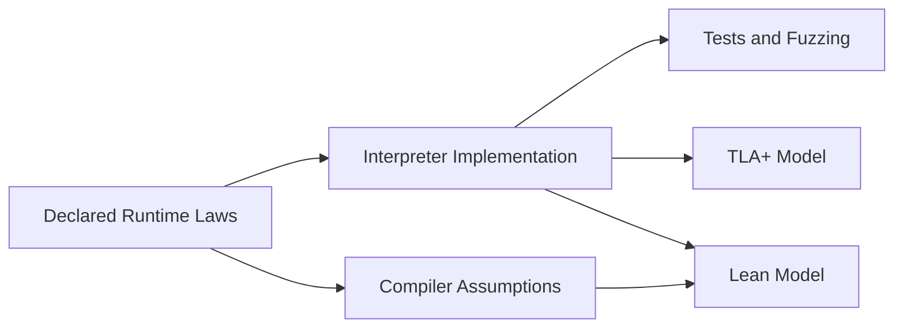

### 7.6 Class VI: Cost and Optimization Soundness

Questions:

- Is a rewrite not only correct, but beneficial under the chosen cost model?
- Does the topology partitioning improve target execution?
- Does a native lowering preserve a latency or allocation budget?

These are usually not theorem-prover questions in the same sense as semantics, though some parts can be formalized.

TLA+ is not mainly for cost proofs.

Lean can encode cost semantics, but there is risk of spending too much effort proving models that diverge from real hardware/runtime behavior.

#### Recommended tooling for Class VI

- lightweight formalization at best
- primarily empirical validation
- cost-model reasoning should remain subordinate to semantic soundness

______________________________________________________________________

## 8. Proof Tool Morphology: Lean, TLA+, or Both

The proof-tool choice is not a discrete either-or. It is itself a morphology.

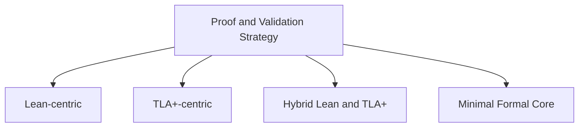

### 8.1 Lean-Centric

**Best at**

- core calculus proofs
- type soundness
- rewrite correctness
- refinement proofs
- reusable algebraic theorems

**Weak at**

- quickly exploring huge distributed state spaces
- pragmatic protocol debugging
- iterative temporal-model experimentation

**Risk**

A Lean-centric project may become too focused on theorem engineering and not enough on optimizer and backend practicality.

### 8.2 TLA+-Centric

**Best at**

- distributed systems behavior
- reordering, failure, and liveness exploration
- model checking temporal properties

**Weak at**

- mechanized compiler metatheory
- deep proof over syntax and transformations
- verified optimizer reasoning at scale

**Risk**

A TLA+-centric project may become strong at protocol exploration while leaving the compiler core under-specified.

### 8.3 Hybrid Lean and TLA+

**Best at**

- using the right tool for each class of reasoning
- separating syntactic and semantic proof obligations
- cross-validating the system from two angles

**Weak at**

- operational complexity
- duplicated semantic work
- risk of semantic drift between models

**Risk**

The hybrid approach is powerful but must be carefully managed so that Lean semantics, TLA+ models, and compiler behavior do not become three inconsistent worlds.

#### Most plausible role split

- Lean:
  - core semantics
  - rewrite laws
  - refinement theorems
- TLA+:
  - distributed execution models
  - failure scenarios
  - temporal properties
  - protocol sanity checking

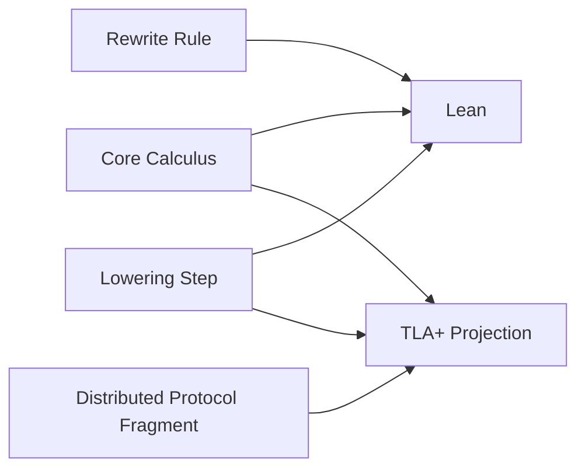

______________________________________________________________________

## 9. Morphology of Compiler-Stack Choices

Below is the broader morphology.

### 9.1 Axis A: Surface Authoring Language

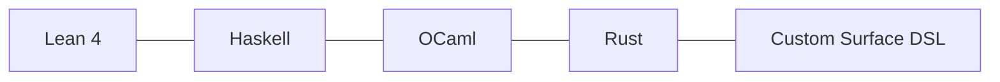

#### Lean 4 as Surface Language

**Pros**

- source and proof language can align
- rich dependent typing
- immediate access to proof-oriented abstractions
- elegant for intrinsically typed representations

**Cons**

- poor fit for fast language-design iteration compared with general compiler-host languages
- ergonomics may be too proof-driven
- code generation and optimizer experimentation become more awkward
- risks conflating “representation language” with “proof language”

**Relevance to the objective**

Lean is appealing if the system’s primary identity is a formalization that also emits code. It is less appealing if the primary identity is a practical optimizing compiler for a rich distributed DSL.

#### Haskell as Surface Language

**Pros**

- excellent for embedded DSLs
- powerful type system
- strong tradition in compiler and language experimentation
- comfortable for expressing pure semantics

**Cons**

- can drift into abstraction for its own sake
- lazy semantics may complicate implementation intuitions if the target is strict
- backend alignment with Rust is weaker than a Rust-based compiler

**Relevance to the objective**

Very strong for discovering the right semantics and IR, especially early.

#### OCaml as Surface Language

**Pros**

- pragmatic, strict, compiler-friendly
- strong pattern matching and module system
- often easier to reason about operationally than Haskell

**Cons**

- less culturally associated with fancy typed DSLs than Haskell
- smaller mindshare for this specific style of effect experimentation

**Relevance to the objective**

A serious option if the goal is a well-engineered compiler rather than a highly abstract EDSL.

#### Rust as Surface Language

**Pros**

- immediate alignment with the target ecosystem
- operational intuition and backend reality stay close
- easier sharing of data structures and runtime concepts

**Cons**

- less pleasant for language experimentation
- a weaker substrate for elegant symbolic DSLs
- higher iteration friction in early design

**Relevance to the objective**

Better once the semantics are relatively stable.

#### Custom Surface DSL

**Pros**

- maximal control over syntax and semantics
- easier to keep the user model clean
- can decouple user language from implementation language

**Cons**

- parser, tooling, and diagnostics cost
- need to reinvent language ergonomics

**Relevance to the objective**

Likely desirable eventually, regardless of compiler-core language.

______________________________________________________________________

### 9.2 Axis B: Compiler Implementation Language

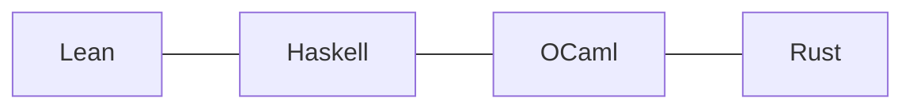

#### Lean as Compiler Implementation Language

**Pros**

- proofs close to implementation
- strong type-level guarantees
- elegant internal representations for verified fragments

**Cons**

- poor fit for large-scale optimizer engineering
- likely to slow experimentation
- not ideal for systems-integration-heavy compiler work

**Overall assessment**

Best for a verified kernel, not the whole stack.

#### Haskell as Compiler Implementation Language

**Pros**

- superb for ASTs, IRs, transforms, type systems
- fast prototyping of compiler passes
- strong expressiveness for symbolic transformations

**Cons**

- less direct backend affinity to Rust
- can enable overly abstract designs
- production hardening may be less natural than in Rust

**Overall assessment**

Excellent in the language-design and IR-discovery phase.

#### OCaml as Compiler Implementation Language

**Pros**

- excellent compiler engineering language
- strict evaluation
- clear operational behavior
- strong balance of ergonomics and pragmatism

**Cons**

- smaller adjacent ecosystem than Rust
- fewer people instinctively reach for it now

**Overall assessment**

One of the strongest underappreciated options.

#### Rust as Compiler Implementation Language

**Pros**

- strongest alignment with the final backend
- strong control over memory/layout/performance
- easiest path toward production-grade tooling and runtime integration

**Cons**

- slower for symbolic experimentation
- more verbose for early semantic research
- can lead to premature operational commitments

**Overall assessment**

Excellent once the architecture is clear; possibly premature as the first exploratory environment.

______________________________________________________________________

### 9.3 Axis C: Core IR Shape

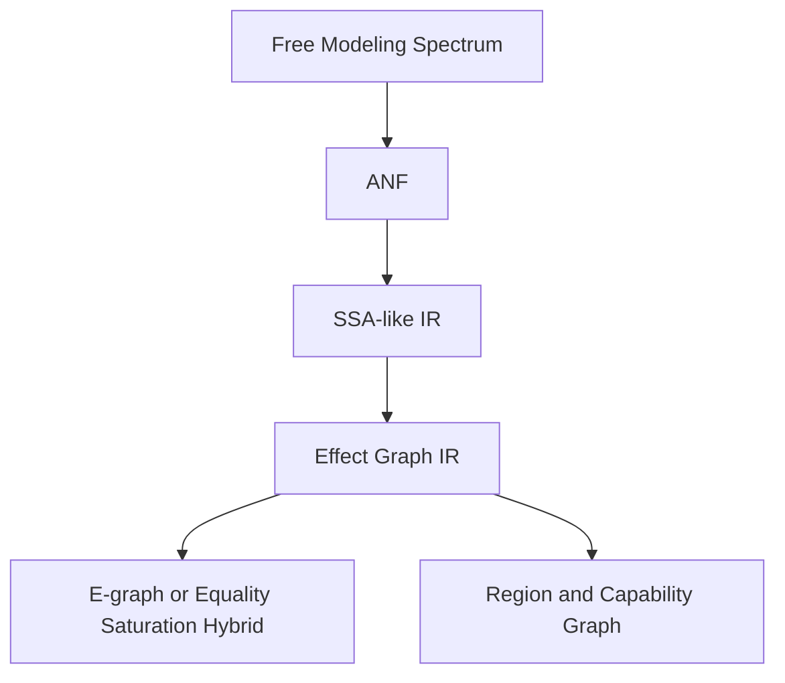

#### Free Modeling Spectrum

**Pros**

- pure and highly compositional
- keeps workflow structure as data near the purity boundary
- supports multiple interpreters and late binding of execution strategy
- strong basis for analyzable syntax trees
- can express a useful hierarchy:
  - functorial structure for uniform transformation
  - applicative structure for statically known independent composition
  - selective structure for visible conditionals
  - monadic structure for genuinely dependent sequencing
- traversable structure for batch and collection-parallel regions
- applicative and traversable fragments can preserve visible parallel structure and are often a
  strong fit for batch, workflow, and DAG-like computation
- monadic fragments remain available for barriers, conditionals, and data-dependent continuation

**Cons**

- if collapsed entirely into free monads, it often becomes too sequential
- monadic continuations can hide future structure and therefore obscure parallelism
- global graph optimization is often easier after lowering to more explicit graph or SSA-like forms
- mixed free layers require discipline about where dependency boundaries are introduced

**Assessment**

As described in [Pure Compute DAGs in Haskell](pure_compute_dags_in_haskell.md), free modeling
should not be identified only with free monads. As a hierarchy of functor, applicative, selective,
traversable, and monadic structure, it is extremely robust and flexible, and can express many
compute graphs, including highly parallelizable ones. The real limitation is narrower: a uniformly
free-monadic IR is often too sequential to serve as the whole semantic center. A staged
architecture that preserves applicative or traversable structure where independence exists, uses
selective structure where conditional visibility matters, and introduces monadic structure only
where dependencies are real, is much stronger.

#### ANF or SSA-like IR

**Pros**

- explicit data dependencies
- familiar compiler structure
- easier lowering and optimization than monadic forms

**Cons**

- not by itself rich enough for distributed topology
- needs augmentation for effects, concurrency, and regions

**Assessment**

Useful as an internal phase, but probably not the whole semantic center.

#### Effect Graph IR

**Pros**

- captures dependencies directly
- exposes concurrency and topology
- strong substrate for global optimization
- aligns with the notion of a “pure effect topology”

**Cons**

- more complex to define and reason about
- optimizer legality depends on explicit law tracking

**Assessment**

The most natural center of gravity.

#### E-graph / Equality Saturation Hybrid

**Pros**

- potentially powerful for rewrite-heavy optimization
- can explore many equivalent forms

**Cons**

- cost control is difficult
- semantic constraints must be very carefully encoded
- can become too heavyweight

**Assessment**

Likely useful as a component, not necessarily the sole IR.

#### Region and Capability Graph

**Pros**

- can encode portability zones, native zones, and proof zones
- natural place to represent escape hatches and trust boundaries

**Cons**

- more design complexity
- needs careful semantics

**Assessment**

Very attractive as an extension of effect-graph IR.

______________________________________________________________________

### 9.4 Axis D: Effect-System Shape


#### Monolithic Effect System

**Pros**

- conceptually simple

**Cons**

- too blunt for optimization and proof
- difficult to encode which laws apply where
- escape hatches become semantically messy

**Assessment**

Not recommended.

#### Algebraic Effects

**Pros**

- structured
- compositional
- expressive

**Cons**

- not enough by themselves for the full optimization story
- may not cleanly capture topology and region structure

**Assessment**

Good ingredient, not enough alone.

#### Capability Families

**Pros**

- makes laws explicit per family
- good fit for optimizer legality
- good fit for native escape hatches

**Cons**

- more design work
- requires careful discipline to avoid fragmentation

**Assessment**

Strongly recommended.

#### Layered Portable / Domain / Native Effects

**Pros**

- aligns with the desired architecture exactly
- lets the compiler reason differently at different abstraction layers
- makes portability and escape explicit

**Cons**

- semantics and lowering interfaces must be very clear
- proofs become layered rather than uniform

**Assessment**

Best fit.

______________________________________________________________________

### 9.5 Axis E: Optimization Architecture


#### Pure Normalization

**Pros**

- simple
- proof-friendly

**Cons**

- not enough for ambitious performance goals

#### Law-Driven Local Rewrites

**Pros**

- semantically tractable
- good proof target

**Cons**

- insufficient if used alone

#### Global Graph Optimization

**Pros**

- captures the real promise of the architecture
- enables fusion, pruning, batching, placement-sensitive transforms

**Cons**

- proof burden is larger
- requires explicit cost and legality framework

#### Domain-Specific Rewrites

**Pros**

- allows universal UI, storage, or sync abstractions to optimize well

**Cons**

- risks making domain semantics too opinionated if not carefully bounded

#### Runtime-Specific Lowering

**Pros**

- crucial for final performance
- preserves escape-hatch philosophy

**Cons**

- reduces portability
- requires more trust in backend implementations

______________________________________________________________________

### 9.6 Axis F: Runtime Strategy

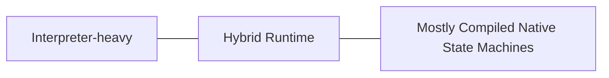

#### Interpreter-heavy

**Pros**

- simpler implementation
- flexible
- easier experimentation

**Cons**

- weak final performance
- not aligned with the small-binary objective

#### Hybrid Runtime

**Pros**

- balanced
- common substrate plus specialized generated code
- practical for staged maturity

**Cons**

- must manage the split carefully
- risk of bloated runtime layer

#### Mostly Compiled Native State Machines

**Pros**

- best performance path
- best binary-size story if done well

**Cons**

- hardest lowering problem
- strongest need for transformation correctness

**Assessment**

Likely the desired long-term target, with a hybrid runtime during development.

______________________________________________________________________

### 9.7 Axis G: Formal-Methods Strategy

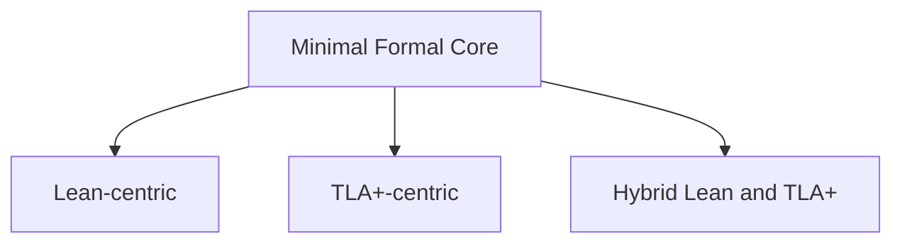

#### Minimal Formal Core

**Pros**

- faster development
- lower overhead

**Cons**

- may fail the stated objectives around correctness and eventual consistency

#### Lean-centric

**Pros**

- strongest core proof story

**Cons**

- weaker distributed exploration story

#### TLA+-centric

**Pros**

- strongest distributed protocol story

**Cons**

- weaker compiler metatheory story

#### Hybrid Lean and TLA+

**Pros**

- best overall fit for the actual problem

**Cons**

- semantic drift risk
- toolchain complexity

**Assessment**

Best match, provided the semantic interfaces are disciplined.

______________________________________________________________________

### 9.8 Axis H: Backend Language and Realization Strategy

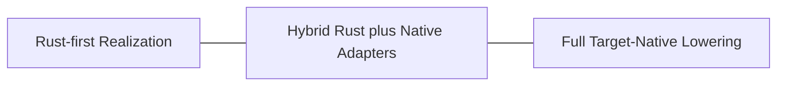

#### Rust-first Realization

**Pros**

- strongest shared implementation substrate
- excellent systems tooling and runtime integration
- can still reach many targets, including WASM, from one backend center
- keeps more of the proof and optimization story concentrated in one place

**Cons**

- cannot cover every forced-native surface cleanly
- may leave optimization opportunities unrealized in proprietary or hardware-specific domains
- some runtimes still require foreign-language adapters or fully native toolchains

**Assessment**

Preferred default where Rust can credibly target the runtime.

#### Hybrid Rust plus Native Adapters

**Pros**

- pragmatic when the host surface is forced into another language
- supports thin bridges in JS, Swift, Kotlin, C++, CUDA bindings, or vendor SDK layers
- lets Rust remain the semantic and runtime center while still exposing required native effects

**Cons**

- cross-language boundaries create boilerplate and trust surfaces
- optimization across the boundary is weaker
- proof and observability claims must account for the foreign layer explicitly

**Assessment**

Likely to be common in real systems and should be treated as first-class, not as an afterthought.

#### Full Target-Native Lowering

**Pros**

- necessary for some domains: CUDA, FPGA or HDL flows, bespoke ML inference hardware, mobile
  runtimes, browser-hosted environments, or proprietary vendor stacks
- can unlock backend-specific optimization, fusion, and dead-node removal across a whole region
- avoids pretending that a forced-native substrate is merely an implementation detail

**Cons**

- highest backend engineering burden
- highest risk of semantic drift across targets
- expands the proof and validation problem substantially

**Assessment**

Must remain an available option. Rust may still be preferred where it fits, but the morphology
should explicitly allow both thin native bindings and full native realization when the domain
requires it.

______________________________________________________________________

## 10. Option Clusters Revisited

The earlier “options” are best reinterpreted as clusters within the morphology.

### 10.1 Cluster A: Lean-First Stack

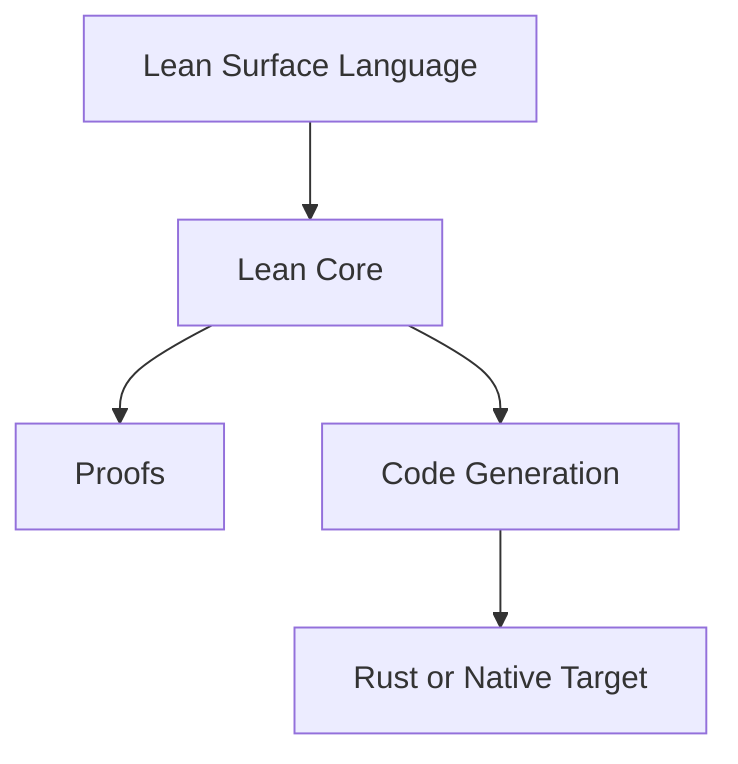

**Strengths**

- coherent proof story
- tight integration of syntax and semantics
- strong correctness orientation

**Weaknesses**

- poor fit for practical optimizer exploration
- risks making engineering subservient to formal elegance
- weaker as a product-oriented compiler core

**Relation to the ultimate objective**

Weak overall fit unless the main goal is the formalization itself.

### 10.2 Cluster B: Haskell-Hosted DSL plus Lean and TLA+ plus Rust-First Backend

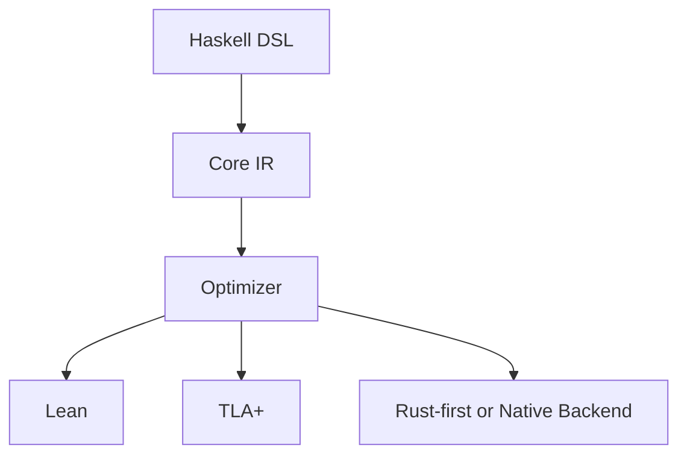

**Strengths**

- excellent design-space exploration
- strong DSL ergonomics
- good decomposition of proof and backend responsibilities

**Weaknesses**

- some distance from backend realities
- possible abstraction excess
- eventual production hardening may favor migration or reimplementation

**Relation to the ultimate objective**

One of the strongest research-phase configurations.

### 10.3 Cluster C1: Rust Compiler Core plus Lean and TLA+

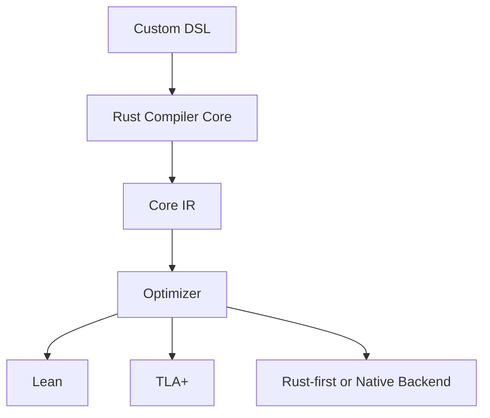

**Strengths**

- strongest operational alignment with the target
- best product trajectory
- best control over codegen and runtime integration

**Weaknesses**

- slower early semantic experimentation
- more implementation friction

**Relation to the ultimate objective**

Arguably the strongest long-term product stack.

### 10.4 Cluster C2: OCaml Compiler Core plus Lean and TLA+ plus Rust-First Backend

```mermaid
flowchart TD
    A[DSL] --> B[OCaml Compiler Core]
    B --> C[IR]
    C --> D[Optimizer]
    D --> E[Lean]
    D --> F[TLA+]
    D --> G[Rust-first or Native Backend]
```

**Strengths**

- excellent compiler ergonomics
- strict and practical
- strong middle ground between Haskell and Rust

**Weaknesses**

- less direct ecosystem alignment than Rust
- less cultural momentum than Haskell or Rust

**Relation to the ultimate objective**

A very serious and underrated choice.

### 10.5 Cluster C3: Verified Kernel plus Practical Compiler

```mermaid
flowchart LR
    A[Surface DSL] --> B[Practical Compiler Core]
    B --> C[Verified Kernel]
    C --> D[Checked Lowerings]
    D --> E[Rust or Native Target]
```

**Strengths**

- keeps formal methods focused where they provide the highest leverage
- avoids trying to prove everything
- allows mixed evidence outside the verified kernel

**Weaknesses**

- boundary design is hard
- risk of over-trusting the unverified shell

**Relation to the ultimate objective**

Very attractive if the team is disciplined about the trusted core.

______________________________________________________________________

## 11. Recommended Morphological Region

The best region of the space currently appears to be:

```mermaid
flowchart TD
    A[Custom or Embedded DSL]
    B[Compiler Core in Haskell, OCaml, or Rust]
    C[Effect Graph plus Capability and Region IR]
    D[Layered Portable Domain Native Effects]
    E[Lean for Metatheory and Rewrite Correctness]
    F[TLA+ for Distributed and Temporal Properties]
    G[Rust-first plus Native Backends]
    H[Hybrid Runtime evolving toward Mostly Compiled Native]

    A --> B
    B --> C
    C --> D
    C --> E
    C --> F
    C --> G
    G --> H
```

This recommendation is intentionally not a single point.

It says:

- avoid Lean as the whole stack
- prefer an IR-first design
- prefer an effect graph with law-bearing capabilities
- use Lean and TLA+ together where they have distinct comparative advantages
- keep Rust as the preferred target and likely eventual implementation center of gravity where it
  fits the runtime, while allowing target-native backends where it does not
- accept a layered proof story rather than a fantasy of proving the entire world at once

______________________________________________________________________

## 12. Practical Sequence for Building the Stack

### Phase 1: Semantic Discovery

- choose Haskell, OCaml, or Rust for the compiler prototype
- define the core IR
- implement interpretation
- define capability families
- define portable, domain, and native effect strata

### Phase 2: Optimizer Skeleton

- implement normalization
- implement law-tagged rewrites
- implement graph analyses
- introduce cost-guided optimization

### Phase 3: Backend Realization

- emit Rust for a restricted fragment where Rust can target the runtime
- introduce thin native adapter layers for forced languages such as JS, Swift, Kotlin, or C++/CUDA
- identify domains that require full target-native lowering
- measure artifact size and performance

### Phase 4: Formalization

- formalize the core calculus in Lean
- prove typing and selected transformation theorems
- project distributed fragments to TLA+
- validate consistency and temporal properties

### Phase 5: Native Extensions

- add platform-specific effect families
- formalize their contracts where feasible
- introduce full-native backends when boilerplate bridges are insufficient
- weaken proof claims explicitly where escape hatches are used

______________________________________________________________________

## 13. The Main Risks

```mermaid
flowchart TD
    A[Over-unification] --> B[IR becomes too vague to optimize]
    C[Semantic drift] --> D[Lean, TLA+, and compiler disagree]
    E[Proof overreach] --> F[Project slows to a halt]
    G[Backend overfitting] --> H[Portable story collapses]
    I[Native escape without typing] --> J[Optimizer becomes unsound]
```

### 13.1 Over-unification

Trying to make one abstraction explain everything can destroy optimization clarity.

### 13.2 Semantic Drift

The compiler, Lean model, and TLA+ model must be projections of a shared semantic core, not independent inventions.

### 13.3 Proof Overreach

The project should prove the important parts first, not all imaginable parts.

### 13.4 Backend Overfitting

It is possible to optimize so aggressively for one runtime that the portable architecture loses meaning.

### 13.5 Untyped Native Escape

Native effects must remain typed and law-scoped, or the optimizer and proof story will collapse.

______________________________________________________________________

## 14. Closing Position

The problem to solve is not merely:

> Which language should implement the compiler?

It is:

> What compiler-stack morphology best supports a pure, typed, law-aware topology for distributed
> compute systems, with meaningful formal methods support and a credible path to highly optimized
> Rust binaries and other target-native artifacts?

The answer is not a single tool.

The strongest current answer is a morphology centered on:

- an **IR-first compiler architecture**
- a **layered capability topology**
- **Lean for metatheory, rewrite correctness, and refinement of core fragments**
- **TLA+ for distributed execution, temporal properties, and protocol sanity**
- **Rust as the preferred realization substrate where it fits, with explicit room for target-native
  backends where it does not**
- a practical willingness to combine proof, model checking, and engineering evidence

In that view, the system is best understood not as a universal effect language, but as:

> a compositional, law-aware topology with explicit lowering layers, explicit trust boundaries, and explicit native escape hatches.

That framing is the one most aligned with the ultimate objective.

______________________________________________________________________

## Cross-References

- [intro.md](intro.md) - Effectful DSL overview and boundary model
- [jit.md](jit.md) - compilation pipeline and Rust realization guidance
- [proof_engine.md](proof_engine.md) - formal verification and proof workflow
- [proof_boundary.md](proof_boundary.md) - philosophical and practical proof-boundary framing
