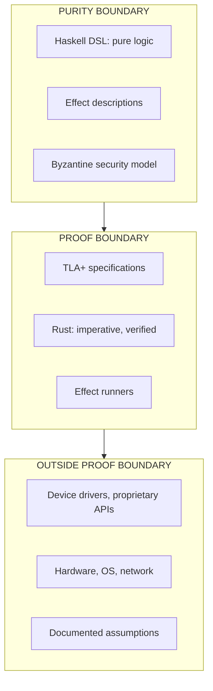
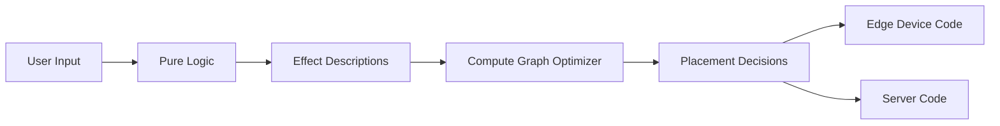

# Effectful: A Formally Verified Language for Distributed Systems

**Status**: Authoritative source
**Supersedes**: effectual_dsl_and_effectful_compiler_spec_final.md
**Referenced by**: ml_training.md, consensus.md, jit.md, infrastructure_deployment.md, engineering/architecture.md, engineering/boundary_model.md

> **Purpose**: Define Effectful, a high-level programming language for distributed systems based on formal methods. Effectful makes it possible to express complex distributed systems in a single pure Haskell-derived DSL, using distributed compute graph optimization to make frontend/backend distinctions obsolete, with a Byzantine security model that makes unsafe states unrepresentable.

______________________________________________________________________

## SSoT Link Map

| Need                       | Link                                                             |
| -------------------------- | ---------------------------------------------------------------- |
| Proof boundary philosophy  | [Proof Boundary](proof_boundary.md)                              |
| JIT compilation standards  | [JIT Compilation](jit.md)                                        |
| Infrastructure deployment  | [Infrastructure Deployment](infrastructure_deployment.md)        |
| ML training formal methods | [ML Training](ml_training.md)                                    |
| Consensus formal methods   | [Consensus](consensus.md)                                        |
| Engineering standards      | [Engineering](../engineering/README.md)                          |
| Boundary model details     | [Boundary Model](../engineering/boundary_model.md)               |
| Language architecture      | [Language Architecture](../engineering/language_architecture.md) |

______________________________________________________________________

## Document Navigation

| Document                                                     | Status        | Purpose                                                              |
| ------------------------------------------------------------ | ------------- | -------------------------------------------------------------------- |
| [intro.md](intro.md)                                         | Hub           | Effectful language overview, boundary model, consolidated references |
| [jit.md](jit.md)                                             | Authoritative | JIT compilation from Haskell compute graphs to Rust                  |
| [infrastructure_deployment.md](infrastructure_deployment.md) | Reference     | Unified node model, infrastructure as effects                        |
| [ml_training.md](ml_training.md)                             | Reference     | Formal methods for distributed ML workflows                          |
| [consensus.md](consensus.md)                                 | Reference     | Formal methods for distributed consensus protocols                   |
| [proof_boundary.md](proof_boundary.md)                       | Essay         | Philosophical foundation (self-contained, no external links)         |

> **Note**: `proof_boundary.md` is a self-contained philosophical essay. It maintains its own internal references and does not link to other documents. All other DSL documents link TO it for philosophical grounding.

______________________________________________________________________

## 1. Why Effectful Exists

### 1.1 The Problem: Distributed Systems Are Impossibly Hard

Major cloud providers (AWS, GCP, Azure) solve incredibly difficult distributed consensus problems so developers don't have to. They offer cloud products with simple APIs that have massive horizontal scaling built on proprietary algorithms. Their consensus protocols perform distributed operations at scale that would be **impossible to implement correctly without formal proofs** (see [proof_boundary.md](proof_boundary.md)).

Consider apps with complex distributed backends: large online retailers, ride-sharing platforms, major social media networks. Non-technical users interact with these apps daily, vaguely aware they require large teams and millions of dollars annually to operate—but they don't understand *why*. The reasons are explored in [proof_boundary.md](proof_boundary.md).

### 1.2 The Opportunity: Moving the Proof Boundary for the LLM Era

Effectful is built on a core belief: **empowering non-technical people to successfully "vibe code" requires moving the proof boundary.**

In the pre-LLM era, formal software methods were a niche concern. But as argued in [proof_boundary.md](proof_boundary.md), shifting to formal methods allows humans to move the proof boundary outward, **unlocking the expressive power of LLMs to create distributed systems with formal guarantees**.

This is why the world needs another high-level programming language: **none have put provably correct distributed systems at their core.**

### 1.3 Effectful's Approach

1. **Single Pure DSL**: All business logic for distributed systems (edge devices and servers) expressed in a single pure Haskell-derived DSL. No traditional frameworks (web backends, secrets stores, ML libraries).

1. **Distributed Compute Graph Optimization**: The distinction between frontend and backend becomes obsolete. Logic is freely optimized to execute where it is safe and permissioned to do so.

1. **Pure Security Model**: A rich, purely representable security model makes it impossible to represent insecure states. This is a message-based abstraction layer above transport security (TCP/UDP with SSL). In Effectful's model:

   - **Two node types**: Edge devices and servers reachable over public APIs
   - **Byzantine messaging system**: Expressive threat modelling replaces traditional firewalls *within the purity boundary*
   - (This complements—not replaces—industry-standard firewalls, ingress controls, certificates, and web protocols)

1. **Compiler as Proof**: If the compiler succeeds (itself written in Haskell), you've followed the language's rules. This gives LLMs the signal needed to write **provably correct distributed system code** for specific applications.

1. **Impossible to Represent Unsafe States**: Effectful must make it impossible to represent states that are unsafe according to the pure threat model and which TLA+ cannot prove.

______________________________________________________________________

## 2. The Proof Boundary and Purity Boundary

### 2.1 The Nested Boundary Model

Effectful replaces traditional architectural layers with a nested boundary model:



### 2.2 What Lives at Each Boundary

**Outside Proof Boundary**:

- Device drivers (GPU, network, storage)
- Proprietary APIs (iOS ARKit, Android SDK, CUDA)
- Hardware behavior
- Operating system services
- Assumptions documented explicitly—TLA+ proofs depend on them but **can never verify them**

**Proof Boundary** (TLA+ verifiable):

- TLA+ specifications, invariants, temporal properties
- Rust code: imperative, inside proof boundary, outside purity boundary
- Effect runners that communicate with drivers/APIs
- Receives "marching orders" from Haskell as pure effect descriptions

**Purity Boundary** (innermost):

- Haskell core logic with distributed compute graph optimization
- Pure functional, deterministic, exhaustively testable
- Composes with distributed consensus state machines
- Byzantine security model—threat modelling as types
- All business logic lives here

### 2.3 Why This Layering Matters

**Where we put the proof boundary is always a subjective human decision.** Effectful puts the proof boundary at the **driver level**:

- We trust Rust's type system and memory safety guarantees
- We do NOT trust device drivers or proprietary APIs
- We document assumptions about external behavior explicitly
- TLA+ proofs are conditional on these assumptions being correct

This layering enables:

1. **Maximum proof coverage**: Everything above the driver level is formally verified
1. **Clear responsibility**: Assumptions are explicit, not hidden
1. **LLM-friendly**: Compiler success signals correctness within the proof boundary

______________________________________________________________________

## 3. Effectful's Architecture

### 3.1 Single Pure DSL for All Distributed Logic

Traditional distributed systems separate concerns across:

- Frontend frameworks (React, SwiftUI)
- Backend frameworks (Django, Express)
- Database ORMs
- Message queues
- Caching layers

Effectful unifies all of this into a single pure DSL. The compiler decides where logic executes based on:

- Security permissions (what data can edge devices access?)
- Performance constraints (where is data locality optimal?)
- Consistency requirements (what ordering guarantees are needed?)

### 3.2 Distributed Compute Graph Optimization

The Haskell compiler builds a compute graph representing the entire distributed system:



The optimizer can:

- Fuse operations to reduce round trips
- Move computation closer to data
- Parallelize independent operations
- Batch similar effects

### 3.3 Pure Security Model (Byzantine Messaging)

Within the purity boundary, Effectful uses a Byzantine threat model:

- **Every message may be from an adversary**
- **Node identity is cryptographically verified**
- **Permissions are checked at the type level**
- **Invalid security states are unrepresentable**

This is inspired by Leslie Lamport's Byzantine Generals problem. Rather than relying on network firewalls (which live outside the proof boundary), Effectful bakes security into the type system.

### 3.4 Compiler as Proof

The Effectful compiler (written in Haskell) serves as a proof checker:

1. **Type checking**: Ensures all effects are properly handled
1. **Permission checking**: Ensures security constraints are satisfied
1. **Consistency checking**: Ensures distributed operations maintain invariants
1. **TLA+ conformance**: Generated code matches formal specifications

If the compiler succeeds, your program is correct within the proof boundary.

______________________________________________________________________

## 4. The Haskell + Rust Story

### 4.1 Why Haskell

Haskell is ideal for the Effectful core because:

- **Compute graph optimization**: Haskell's lazy evaluation and algebraic data types make it natural to build and optimize computation graphs
- **Pure effect descriptions**: Effects are values, not actions—they can be inspected, optimized, and composed
- **Strong type system**: Catches errors at compile time that other languages catch at runtime
- **Formal verification friendly**: Clean semantics make TLA+ conformance checking tractable

Haskell gives Rust its "marching orders" as pure effect descriptions. The Haskell compiler decides WHAT to do; Rust decides HOW to do it.

### 4.2 Why Rust

Rust is necessary for the systems layer because:

- **Driver communication**: Must interface with C APIs, hardware, OS services
- **Performance**: Tail latency matters for systems-level work; Haskell's GC is unsuitable
- **Memory safety without GC**: Rust's ownership system provides safety guarantees without runtime overhead
- **JIT target**: Generated Rust can be compiled and loaded at runtime

Rust lives INSIDE the proof boundary but OUTSIDE the purity boundary. It's imperative code that implements the pure effect descriptions from Haskell.

### 4.3 JIT Compilation

Effectful supports JIT compilation from Haskell compute graphs to Rust:

- **Static Rust**: Hand-written, optimized code for known patterns
- **JIT Rust**: Generated at runtime for dynamic structures

See [jit.md](jit.md) for complete JIT compilation standards.

______________________________________________________________________

## 5. Assumption Documentation

### 5.1 The Assumption Contract

When code communicates with something outside the proof boundary, assumptions must be documented:

```text
# assumption template
ASSUMPTION: GPU driver returns correct computation results
DEPENDS ON: NVIDIA driver version >= 535.0
TLA+ PROPERTY: ComputeResultsMatch
FAILURE MODE: Silent data corruption
MITIGATION: Checksums on critical computations
```

### 5.2 Rules for Assumptions

1. **State assumptions explicitly** about driver/API behavior
1. **TLA+ proofs are based on these assumptions** (right or wrong)
1. **There is never a way to prove assumptions are correct**—they live outside the proof boundary
1. **Document failure modes** when assumptions are violated
1. **Document mitigations** where possible

### 5.3 Unsafe Rust Policy

Unsafe Rust is permitted ONLY when:

1. Performance cannot be achieved via Haskell compute graph JIT optimization
1. The unsafe code is explicitly documented as an **unprovable assumption**
1. The unsafe code effectively lives **outside the proof boundary** for that operation

All unsafe blocks must include assumption documentation.

______________________________________________________________________

## 6. TLA+ Integration

### 6.1 Leslie Lamport's Influence

Effectful's formal methods are inspired by Leslie Lamport's work:

- **Byzantine Generals Problem** (1982): Foundation for distributed trust
- **Paxos Protocol** (1998): Distributed consensus despite failures
- **TLA+ Language**: Formal specification and model checking

### 6.2 Specification Patterns

TLA+ specifications in Effectful define:

- **State space**: All valid system states
- **Init**: Initial state predicate
- **Next**: State transition relation
- **TypeOK**: Type invariants
- **Safety properties**: Nothing bad ever happens
- **Liveness properties**: Something good eventually happens

### 6.3 Model Checking

TLC model checker verifies specifications:

```text
# example
TLA+ Spec → TLC → Counterexample or ✓
                      ↓
               Generated Code
                      ↓
               Conformance Tests
```

See [engineering/verification_contract.md](../engineering/verification_contract.md) for complete verification workflow.

______________________________________________________________________

## 7. References

### 7.1 Foundational Formal Methods

- [Leslie Lamport, *Specifying Systems: The TLA+ Language and Tools for Hardware and Software Engineers* (Addison-Wesley, 2002)](https://lamport.azurewebsites.net/tla/book.html)
- [Edmund M. Clarke, Orna Grumberg, Doron A. Peled, *Model Checking* (MIT Press, 1999)](https://mitpress.mit.edu/9780262032704/model-checking/)
- [Edsger W. Dijkstra, *A Discipline of Programming* (Prentice Hall, 1976)](https://dl.acm.org/doi/book/10.5555/1243380)
- [C. A. R. Hoare, *Communicating Sequential Processes* (Prentice Hall, 1985)](https://dl.acm.org/doi/book/10.5555/3921)

### 7.2 Specification Languages

- [Clifford B. Jones, *Systematic Software Development Using VDM* (Prentice Hall, 1990)](https://dl.acm.org/doi/book/10.5555/122981)
- [Jean-Raymond Abrial, *The B-Book: Assigning Programs to Meanings* (Cambridge University Press, 1996)](https://www.cambridge.org/core/books/bbook/7C16C1657361C6B9A29C0E9A0477C2C8)
- [J. C. M. Baeten, *Process Algebra: Equational Theories of Communicating Processes* (Cambridge University Press, 2005)](https://www.cambridge.org/core/books/process-algebra/DF38DD1C9D5EBD84A9A0A5D4A59FEE1C)

### 7.3 Temporal Logic

- [Zohar Manna, Amir Pnueli, *The Temporal Logic of Reactive and Concurrent Systems: Specification* (Springer, 1992)](https://link.springer.com/book/10.1007/978-1-4612-0933-6)
- [Zohar Manna, Amir Pnueli, *The Temporal Logic of Reactive and Concurrent Systems: Safety* (Springer, 1995)](https://link.springer.com/book/10.1007/978-1-4612-4222-7)
- [Jayadev Misra, K. Mani Chandy, "Proofs of Networks of Processes," *IEEE Transactions on Software Engineering* (1981)](https://doi.org/10.1109/TSE.1981.231167)

### 7.4 Distributed Consensus (Core Classics)

- [Lamport, *The Byzantine Generals Problem* (1982)](https://lamport.azurewebsites.net/pubs/byz.pdf)
- [Lamport, *The Part-Time Parliament* (Paxos) (1998)](https://lamport.azurewebsites.net/pubs/lamport-paxos.pdf)
- [Castro & Liskov, *Practical Byzantine Fault Tolerance* (1999)](https://css.csail.mit.edu/6.824/2014/papers/castro-practicalbft.pdf)
- [Ongaro & Ousterhout, *In Search of an Understandable Consensus Algorithm* (Raft) (2014)](https://raft.github.io/raft.pdf)

### 7.5 TLA+ Resources

- [Specifying Systems (Book)](https://lamport.azurewebsites.net/tla/book.html)
- [PlusCal Tutorial](https://lamport.azurewebsites.net/tla/tutorial/intro.html)
- [TLAPS Paper](https://lamport.azurewebsites.net/pubs/tlaps.pdf)
- [Byzantizing Paxos by Refinement](https://lamport.azurewebsites.net/tla/byzpaxos.html)

### 7.6 Modern BFT and DAG Systems

- [Yin et al., *HotStuff* (arXiv)](https://arxiv.org/abs/1803.05069)
- [Danezis et al., *Narwhal and Tusk* (arXiv)](https://arxiv.org/abs/2105.11827)
- [Keidar et al., *DAG-Rider: All You Need is DAG* (arXiv)](https://arxiv.org/abs/2102.08325)

### 7.7 Safety Engineering

- [Nancy G. Leveson, *Engineering a Safer World: Systems Thinking Applied to Safety* (MIT Press, 2011)](https://mitpress.mit.edu/9780262016629/engineering-a-safer-world/)
- [Tim Kelly, *Arguing Safety: A Systematic Approach to Safety Case Management* (University of York, 1998)](https://www-users.york.ac.uk/~tpk/ArguingSafety.htm)
- [T. P. Kelly, J. A. McDermid, "A Systematic Approach to Safety Case Management," *Safety Science* (1998)](<https://doi.org/10.1016/S0925-7535(97)00050-1>)

______________________________________________________________________

## Cross-References

- [proof_boundary.md](proof_boundary.md) — Philosophical foundation for verification limits
- [jit.md](jit.md) — JIT compilation from Haskell to Rust
- [ml_training.md](ml_training.md) — Formal methods for distributed ML
- [consensus.md](consensus.md) — Formal methods for consensus protocols
- [engineering/architecture.md](../engineering/architecture.md) — System architecture
- [engineering/boundary_model.md](../engineering/boundary_model.md) — Detailed boundary model
- [engineering/verification_contract.md](../engineering/verification_contract.md) — TLA+ verification workflow
- [engineering/runner_pattern.md](../engineering/runner_pattern.md) — Effect runner contract
