# Effectual DSL and Effectful Compiler Specification

**Status**: Authoritative source
**Supersedes**: effectual_dsl_and_effectful_compiler_spec_final.md
**Referenced by**: documents/documentation_standards.md, documents/engineering/functional_catalogue.md, verification_boundary.md

> **Purpose**: Define the **Effectual DSL** for expressing real-world business behavior as a **total, pure mathematical model** in **TLA+/PlusCal** (SSoT), and define the **Effectful Compiler** (Haskell) that deterministically generates **pure ADTs**, **pure state machines**, **Mermaid**, and **typed execution boundaries** for use in **Python**, **TypeScript**, and other languages.

## SSoT Link Map

| Need                    | Link                                                           |
| ----------------------- | -------------------------------------------------------------- |
| Documentation standards | [Documentation Standards](../documentation_standards.md)       |
| Functional catalogue    | [Functional Catalogue](../engineering/functional_catalogue.md) |
| Total pure modelling    | [Total Pure Modelling](../engineering/total_pure_modelling.md) |
| Architecture            | [Architecture](../engineering/architecture.md)                 |
| Code quality            | [Code Quality](../engineering/code_quality.md)                 |

______________________________________________________________________

## 1. Total Pure Modelling

### 1.1 The core idea

Total Pure Modelling (TPM) is a doctrine for keeping software aligned with reality by making the **model** the truth:

- The domain is represented as a **pure mathematical state space**.
- All possible external inputs are represented as **events**.
- All real-world actions are represented as **effects** (pure data).
- The model evolves only by a **total** step function/relation.

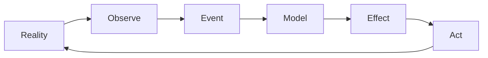

TPM is not primarily a coding style. It is a discipline of **representation**:

- If somdething can happen in reality, the model has a representation for it.
- If something cannot happen in reality, the model must not be able to represent it.
- If the model does not decide, the system must not “guess”.

### 1.2 Totality and illegal states

**Totality** means there are no “stuck” states or unhandled inputs:

- Every modeled state has a defined response to every modeled event.
- Missing cases are treated as specification errors.

**Illegal states are impossible to represent** means:

- Absence, partiality, and intermediate states are expressed as explicit ADT variants.
- If an “authenticated session” requires user identity and roles, those must be payload fields of the corresponding variant, not scattered nullable values.

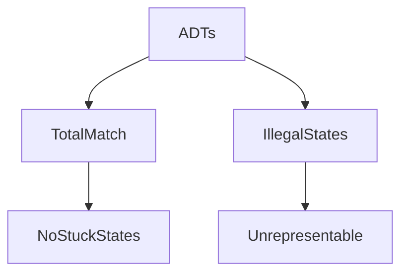

### 1.3 Effects, not ambient reality

TPM eliminates ambient sources of truth. The model never reads:

- time
- randomness
- environment flags
- network state
- database state

Instead, the model requests effects and receives events.

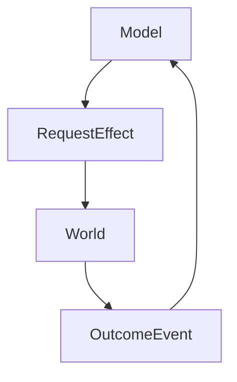

### 1.4 Provability and auditability

Because the model is pure and total:

- it can be checked (model checking, invariants, trace exploration)
- it can be generated into many target languages consistently
- its decision points are auditable as data and functions

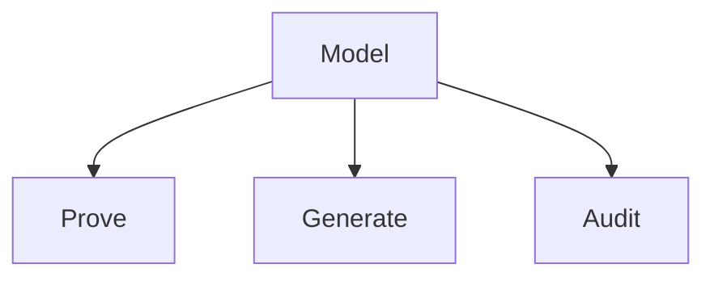

______________________________________________________________________

## 2. System overview

### 2.1 One diagram: the whole system

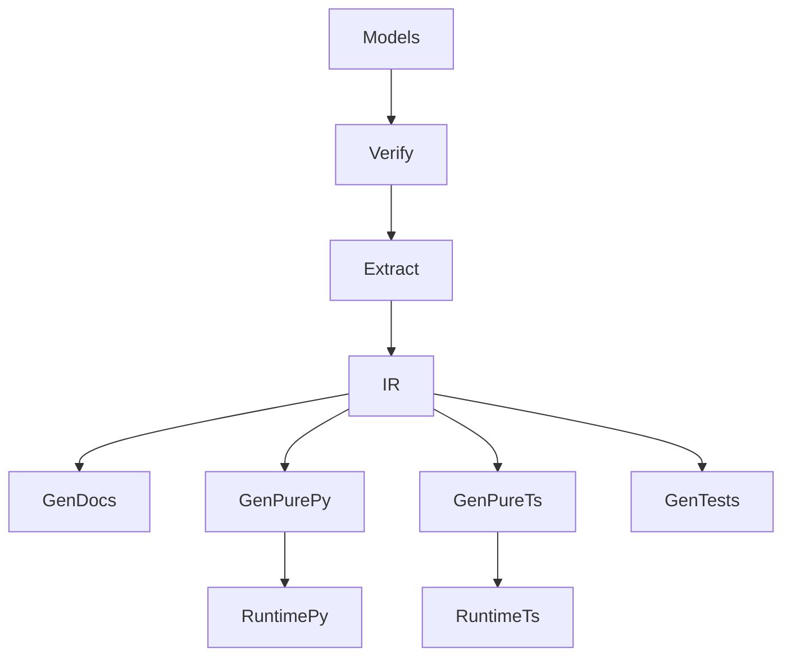

- **Models**: `documents/models/**/*.tla` (Tier 0 SSoT)
- **Verify**: TLA+ validation and TLC model checks (deterministic configs)
- **Extract**: parse Effectual DSL blocks from TLA+/PlusCal
- **IR**: normalized compiler IR (Tier 1, internal)
- **GenDocs**: generated Mermaid + model views (Tier 2)
- **GenPurePy / GenPureTs**: generated Tier 2 pure code
- **RuntimePy / RuntimeTs**: Tier 3 interpreters + Tier 4 effect runners + Tier 5 framework glue

______________________________________________________________________

## 3. Tier taxonomy

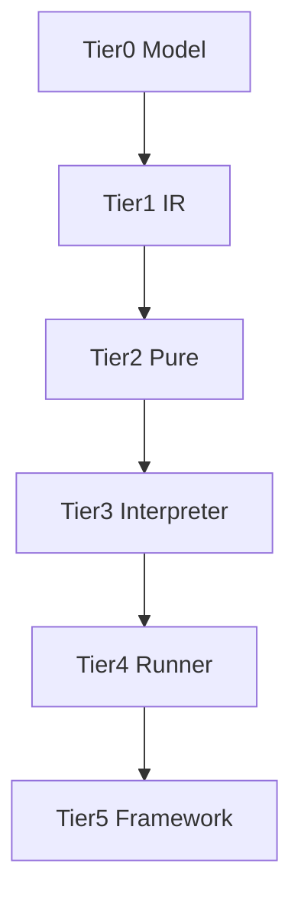

| Tier | Name        | Must be                             | Examples                             |
| ---- | ----------- | ----------------------------------- | ------------------------------------ |
| 0    | Model       | TLA+/PlusCal SSoT                   | `documents/models/healthhub/*.tla`   |
| 1    | IR          | compiler-internal                   | Haskell IR values                    |
| 2    | Pure        | total and pure                      | generated ADTs, reducers, decisions  |
| 3    | Interpreter | generic orchestration               | dispatch, scheduling, retries policy |
| 4    | Runner      | one impure function per effect type | `runDbQuery(eff) -> Result[...]`     |
| 5    | Framework   | glue only                           | FastAPI routes, React components     |

**Hard rule**: Tier 5 contains no business decisions. It only translates external inputs into pure events and pure outputs into framework responses.

______________________________________________________________________

## 4. Effect runners

### 4.1 Runners are language-agnostic operations

Runners execute the same real-world operation regardless of language. The operation is determined by the effect value.

Example:

- a SQL query effect describes a SQL query
- running that effect executes that SQL query
- this meaning is identical across Python, TypeScript, Rust, etc

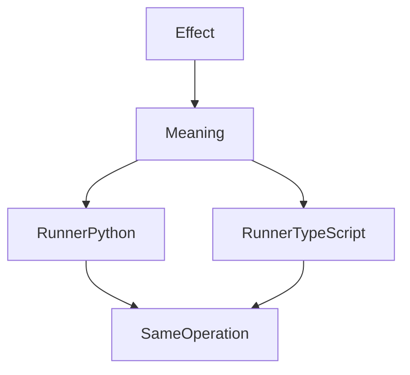

### 4.2 One impure function per effect type

For each effect type, there is exactly one impure runner function.

- Input: the **pure effect value only**
- Output: `Result[OkT, ErrT]` or an async container that resolves to it
- No other call arguments exist (dependencies are injected at construction time)

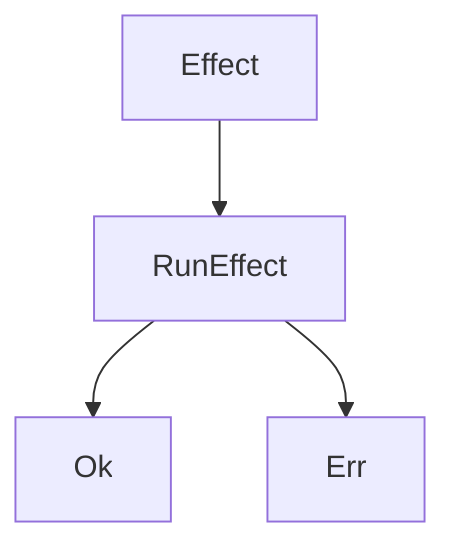

### 4.3 Result is the only outcome type

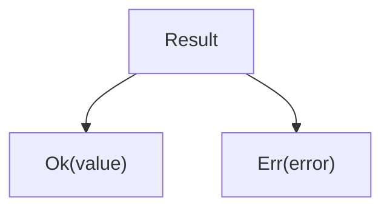

- Runners must not throw exceptions to signal expected failures.
- Runners must convert dependency failures into typed `Err(...)`.

### 4.4 Dependency injection is allowed

Runners may require injected dependencies (DB pools, HTTP clients, filesystem handles, mocks).

Injection occurs when constructing the runner implementation.

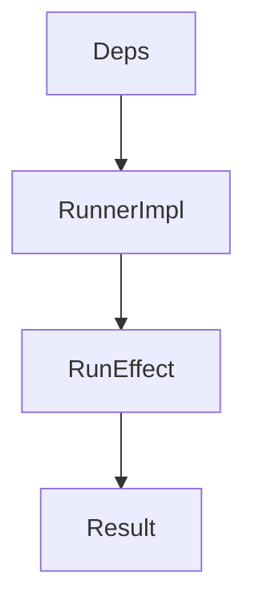

### 4.5 Dependency failures are converted

Failures from injected dependencies are converted into typed error values.

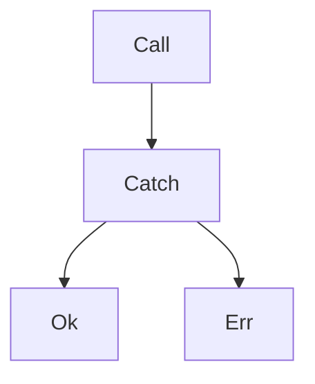

### 4.6 No hanging forever

Runners must not hang forever without returning.

Policy:

- Each runner has a deterministic timeout and cancellation policy.
- Timeouts are represented as typed `Err(Timeout(...))`.

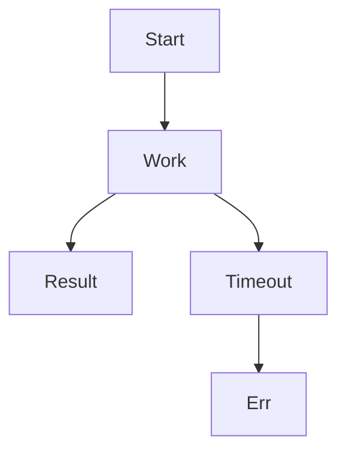

______________________________________________________________________

## 5. Generic effects are mandatory

Maximizing what the DSL can represent requires minimizing the impure surface.

- Domain logic is pure.
- Repository patterns are pure.
- Runners implement a small reusable standard effect set.

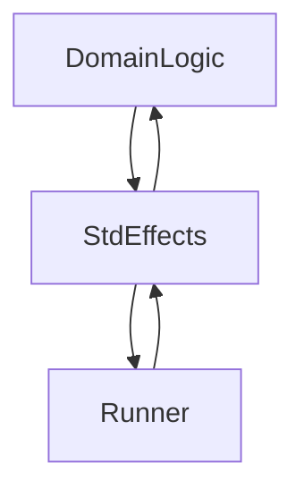

### 5.1 Standard effect kit (StdEffects)

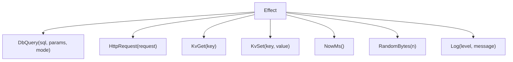

______________________________________________________________________

## 6. Generic DB query effect

### 6.1 DB types

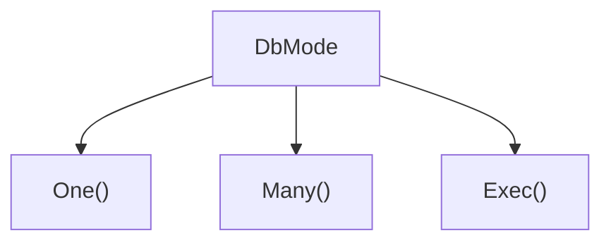

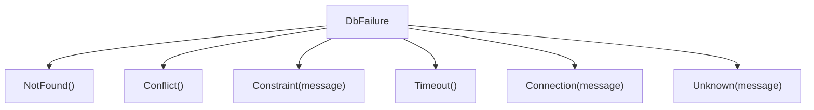

### 6.2 Repository pattern is pure

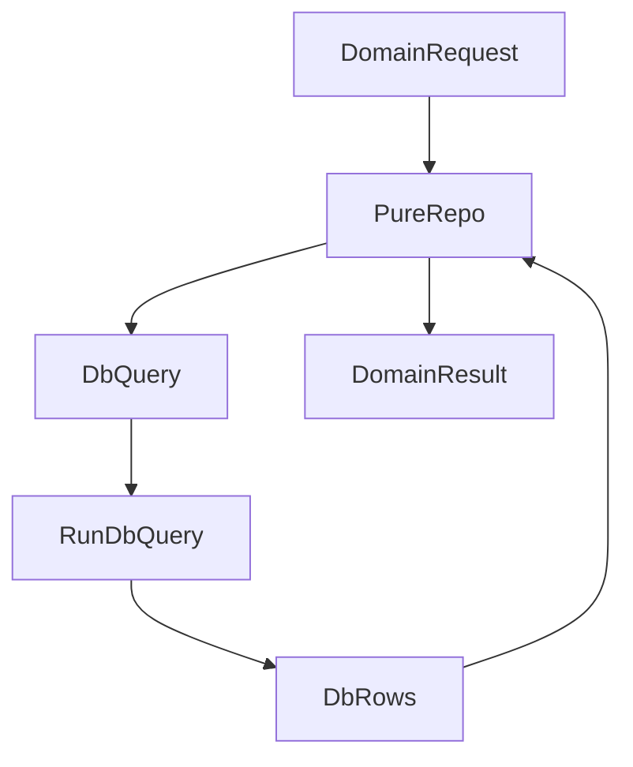

- SQL and parameters are pure.
- Mapping `DbRows` to domain ADTs is pure.
- Only the runner is impure.

______________________________________________________________________

## 7. Effectual DSL in TLA+/PlusCal

### 7.1 Where it lives

- SSoT lives under `documents/models/**`.

### 7.2 What is declared

Effectual DSL declarations define:

- payload ADTs (sum types and records)
- state machines
- usage of standard effects
- verification bindings: `Init`, `Next`, `TypeOK`, `Invariants`

### 7.3 Example: HealthHub auth flow (pure)

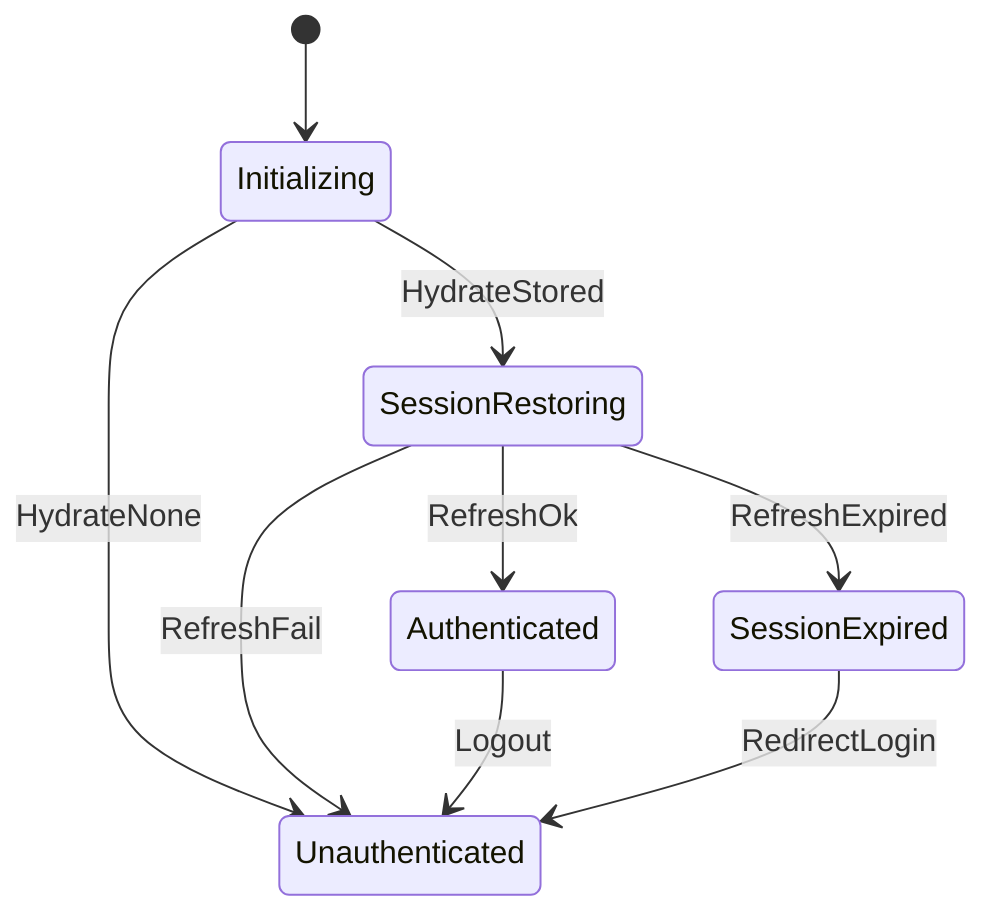

______________________________________________________________________

## 8. Effectful Compiler responsibilities

### 8.1 Compiler pipeline

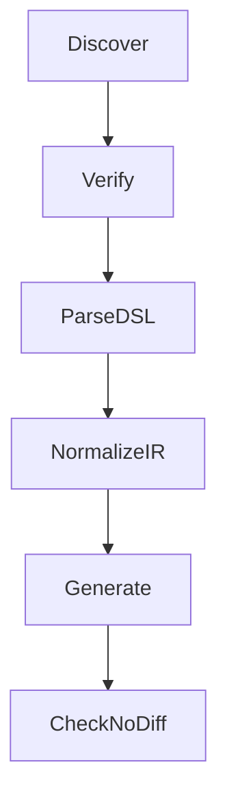

### 8.2 Outputs are tiered

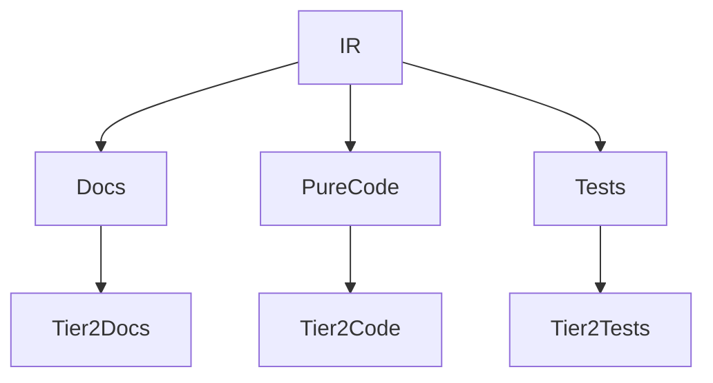

______________________________________________________________________

## 9. Why Haskell for the compiler

Haskell is a good fit for the Effectful Compiler because the compiler itself must embody the same values as the system:

- **First-class ADTs**: the compiler IR is naturally represented as sum types and records.
- **Pure transformations**: parsing, normalization, fingerprinting, and generation are deterministic functions.
- **Totality pressure**: exhaustive pattern matching and strong typing make “missing cases” loud.
- **Backends as composable modules**: code generation can be expressed as pure pretty-printing over IR.
- **Reference semantics runner**: Haskell can host a reference interpreter for pure models for testing and cross-language validation.

```mermaid
flowchart TB
IR[IR] --> PureXforms[PureTransforms]
PureXforms --> Backends[Backends]
Backends --> Outputs[Outputs]
```

______________________________________________________________________

## 10. Generated code structure

### 10.1 Recommended repository layout

```mermaid
flowchart TB
Repo[Repo]
Repo --> Documents[documents]
Documents --> Models[models]
Documents --> GenDocs[generated]
Repo --> Generated[generated]
Generated --> Py[python]
Generated --> Ts[typescript]
Repo --> Demo[demo]
Demo --> Healthhub[healthhub]
```

### 10.2 Generated paths

- `generated/python/effectful_std/**` (Tier 2 std effects + Result + stubs)
- `generated/python/healthhub_pure/**` (Tier 2 HealthHub pure logic)
- `generated/typescript/effectful_std/**` (Tier 2)
- `generated/typescript/healthhub_pure/**` (Tier 2)

______________________________________________________________________

## 11. Interpreter and runner sketches

### 11.1 Python runner sketch (DB)

#### Tier map

| Artifact                  | Tier |
| ------------------------- | ---- |
| `effectful_std` ADTs      | 2    |
| `healthhub_pure` logic    | 2    |
| interpreter orchestration | 3    |
| runner implementations    | 4    |
| FastAPI glue              | 5    |

#### Generated runner signature (generic)

```python
# file: generated/python/effectful_std/runtime/runners.py
from __future__ import annotations
from typing import Protocol, Awaitable
from effectful_std.core.result import Result
from effectful_std.db.effects import DbQuery
from effectful_std.db.types import DbRows, DbFailure

class DbRunner(Protocol):
    def run_db_query(self, eff: DbQuery) -> Awaitable[Result[DbFailure, DbRows]]: ...
```

#### Handwritten runner implementation (generic)

```python
# file: demo/healthhub/backend/runtime/db_runner_asyncpg.py
from __future__ import annotations
from dataclasses import dataclass
from effectful_std.core.result import Ok, Err, Result
from effectful_std.db.effects import DbQuery
from effectful_std.db.types import DbRows, DbFailure

@dataclass(frozen=True)
class AsyncpgDbRunner:
    pool: object
    timeout_s: float

    async def run_db_query(self, eff: DbQuery) -> Result[DbFailure, DbRows]:
        try:
            # timeout enforcement is required by policy
            rows = await self.pool.fetch(eff.sql, *eff.params_native())
            return Ok(driver_rows_to_dbrows(rows))
        except Exception as ex:
            return Err(DbFailure.Unknown(message=str(ex)))
```

### 11.2 TypeScript runner sketch (HTTP)

#### Generated runner signature (generic)

```ts
// file: generated/typescript/effectful_std/runtime/runners.ts
import { Result } from '../core/result'
import { HttpRequest } from '../http/effects'
import { HttpResponse, HttpFailure } from '../http/types'

export type HttpRunner = {
  readonly runHttpRequest: (eff: HttpRequest) => Promise<Result<HttpFailure, HttpResponse>>
}
```

#### Handwritten runner implementation (generic)

```ts
// file: demo/healthhub/frontend/src/runtime/httpRunnerFetch.ts
import { ok, err, Result } from 'generated/typescript/effectful_std/core/result'
import { HttpRequest } from 'generated/typescript/effectful_std/http/effects'
import { HttpResponse, HttpFailure } from 'generated/typescript/effectful_std/http/types'

export const runHttpRequest = async (eff: HttpRequest): Promise<Result<HttpFailure, HttpResponse>> => {
  try {
    const controller = new AbortController()
    const timeout = setTimeout(() => controller.abort(), eff.timeoutMs)
    const res = await fetch(eff.url, { method: eff.method, headers: eff.headers, body: eff.body, signal: controller.signal })
    clearTimeout(timeout)
    const text = await res.text()
    return ok({ status: res.status, bodyText: text })
  } catch (e) {
    return err({ kind: 'NetworkFailure', message: String(e) })
  }
}
```

______________________________________________________________________

## 12. Deterministic enforcement

### 12.1 Gate stack

```mermaid
flowchart TB
TLC[TLC] --> Gen[Gen]
Gen --> Check[CheckNoDiff]
Check --> Type[Typecheck]
Type --> Conf[ConformanceTests]
Conf --> Ship[Ship]
```

- TLC checks Tier 0
- compiler generation is deterministic
- no diffs allowed
- typechecking ensures generated code and handwritten glue compile
- conformance tests ensure state machines and decisions match the model

______________________________________________________________________

## 13. Summary of required handwritten artifacts

### 13.1 Python backend

- Framework glue (Tier 5)
- Runner implementations with injected dependencies (Tier 4)
- Interpreter orchestration (Tier 3)

### 13.2 TypeScript frontend

- Framework glue (Tier 5)
- Runner implementations with timeouts (Tier 4)
- Interpreter orchestration (Tier 3)

______________________________________________________________________

## Cross-References

- `documents/documentation_standards.md` (Mermaid subset and metadata rules)
- `documents/models/**` (SSoT TLA+/PlusCal)
- `demo/healthhub/**` (example integration)
