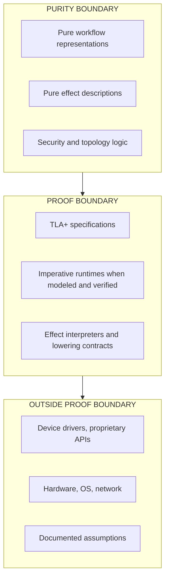
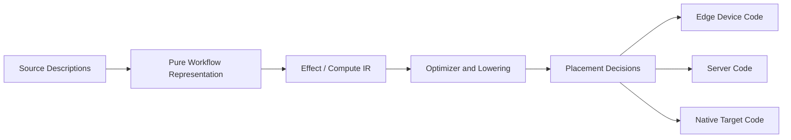

# Effectful: Compiler Morphology for Distributed Systems

**Status**: Authoritative source
**Supersedes**: effectual_dsl_and_effectful_compiler_spec_final.md
**Referenced by**: ml_training.md, consensus.md, jit.md, infrastructure_deployment.md, engineering/architecture.md, engineering/boundary_model.md

> **Purpose**: Define the current meaning of Effectful as a compiler morphology for distributed systems: a design space centered on pure workflow representations, typed effect topologies, staged lowering, explicit purity and proof boundaries, and formal verification of selected distributed properties.

______________________________________________________________________

## SSoT Link Map

| Need                       | Link                                                             |
| -------------------------- | ---------------------------------------------------------------- |
| Proof engine               | [Proof Engine](proof_engine.md)                                  |
| Proof boundary philosophy  | [Proof Boundary](proof_boundary.md)                              |
| JIT compilation standards  | [JIT and Staged Lowering](jit.md)                                |
| Infrastructure deployment  | [Infrastructure Deployment](infrastructure_deployment.md)        |
| ML training formal methods | [ML Training](ml_training.md)                                    |
| Pure compute DAG semantics | [Pure Compute DAGs in Haskell](pure_compute_dags_in_haskell.md)  |
| Consensus formal methods   | [Consensus](consensus.md)                                        |
| Engineering standards      | [Engineering](../engineering/README.md)                          |
| Boundary model details     | [Boundary Model](../engineering/boundary_model.md)               |
| Language architecture      | [Language Architecture](../engineering/language_architecture.md) |

______________________________________________________________________

## Document Navigation

| Document                                                           | Status        | Purpose                                                            |
| ------------------------------------------------------------------ | ------------- | ------------------------------------------------------------------ |
| [intro.md](intro.md)                                               | Hub           | Effectful compiler morphology overview, boundary model, references |
| [proof_engine.md](proof_engine.md)                                 | Authoritative | Effectful Proof Engine for selected distributed properties         |
| [jit.md](jit.md)                                                   | Authoritative | JIT and staged lowering within the compiler morphology             |
| [infrastructure_deployment.md](infrastructure_deployment.md)       | Reference     | Unified node model, infrastructure as effects                      |
| [ml_training.md](ml_training.md)                                   | Reference     | Formal methods for distributed ML workflows                        |
| [pure_compute_dags_in_haskell.md](pure_compute_dags_in_haskell.md) | Reference     | Gentle Haskell and category-theory guide to pure compute DAGs      |
| [consensus.md](consensus.md)                                       | Reference     | Formal methods for distributed consensus protocols                 |
| [proof_boundary.md](proof_boundary.md)                             | Essay         | Philosophical foundation (self-contained, no external links)       |

> **Note**: `proof_boundary.md` is a self-contained philosophical essay. It maintains its own internal references and does not link to other documents. All other DSL documents link TO it for philosophical grounding.

______________________________________________________________________

## 1. Why Effectful Exists

### 1.1 The Problem: Distributed Systems Are Impossibly Hard

Major cloud providers (AWS, GCP, Azure) solve incredibly difficult distributed consensus problems so developers don't have to. They offer cloud products with simple APIs that have massive horizontal scaling built on proprietary algorithms. Their consensus protocols perform distributed operations at scale that would be **impossible to implement correctly without formal proofs** (see [proof_boundary.md](proof_boundary.md)).

Consider apps with complex distributed backends: large online retailers, ride-sharing platforms, major social media networks. Non-technical users interact with these apps daily, vaguely aware they require large teams and millions of dollars annually to operate—but they don't understand *why*. The reasons are explored in [proof_boundary.md](proof_boundary.md).

### 1.2 The Opportunity: Moving the Proof Boundary for the LLM Era

Effectful is built on a core belief: **empowering non-technical people to successfully "vibe
code" requires moving the proof boundary.**

In the pre-LLM era, formal software methods were a niche concern. But as argued in [proof_boundary.md](proof_boundary.md), shifting to formal methods allows humans to move the proof boundary outward, **unlocking the expressive power of LLMs to create distributed systems with formal guarantees**.

This is why the world needs another compiler morphology: most stacks treat source language,
optimizer, distributed runtime, and proof story as loosely connected concerns. Effectful instead
tries to make boundary placement, IR choice, lowering strategy, and verification scope part of one
coherent architecture.

### 1.3 Effectful's Approach

1. **Pure Workflow Representations**: Distributed logic is first represented as pure data:
   workflows, effect descriptions, and analyzable compute graphs. Haskell is the preferred
   representation language for that style today, and the FP vocabulary behind it is defined in
   [pure_compute_dags_in_haskell.md](pure_compute_dags_in_haskell.md).

1. **Compiler Morphology Rather Than One Fixed Surface**: Source language, IR family, runtime
   strategy, and backend realization are all design axes. Effectful, as currently used in these
   docs, names that morphology rather than one frozen DSL.

1. **Distributed Compute Graph Optimization**: Frontend, backend, edge, and accelerator placement
   become optimization and permission questions rather than hard architectural walls. Logic can be
   lowered to where it is safe and useful to run.

1. **Boundary-Aware Security Model**: A rich, purely representable security model aims to make
   insecure states difficult or impossible to represent in the pure core. This is a message-based
   abstraction layer above transport security (TCP/UDP with SSL). In Effectful's model:

   - **Two node types**: Edge devices and servers reachable over public APIs
   - **Byzantine messaging system**: Expressive threat modelling replaces traditional firewalls *within the purity boundary*
   - (This complements—not replaces—industry-standard firewalls, ingress controls, certificates, and web protocols)

1. **Compiler and Proof Engine as Separate Gates**: A successful compiler pipeline means a program
   is well-formed for the chosen morphology and lowering path. The proof engine then verifies the
   selected distributed properties for the portion of the system brought inside the proof boundary.

1. **Unsafe States Should Be Explicit**: If a state depends on unmodeled driver behavior,
   unchecked native code, or unproved distributed assumptions, the system should expose that fact
   clearly rather than quietly treating it as part of the trusted core.

______________________________________________________________________

## 2. The Proof Boundary and Purity Boundary

### 2.1 The Nested Boundary Model

Effectful replaces traditional architectural layers with a nested boundary model:


```mermaid
flowchart TB
  %% Architectural diagram (non-canonical) - subgraph allowed for boundary visualization
  %% Nested boundary model - proof boundary contains purity boundary
  subgraph Outside["OUTSIDE PROOF BOUNDARY"]
    Drivers["Device drivers, proprietary APIs"]
    Hardware["Hardware, OS, network"]
    Assumptions["Documented assumptions"]
  end
  subgraph Proof["PROOF BOUNDARY"]
    TLA["TLA+ specifications"]
    Runtime["Imperative runtimes when modeled and verified"]
    Runners["Effect interpreters and lowering contracts"]
  end
  subgraph Purity["PURITY BOUNDARY"]
    Workflow["Pure workflow representations"]
    Effects["Pure effect descriptions"]
    Byzantine["Security and topology logic"]
  end
  Purity --> Proof
  Proof --> Outside
```

### 2.2 What Lives at Each Boundary

**Outside Proof Boundary**:

- Device drivers (GPU, network, storage)
- Proprietary APIs (iOS ARKit, Android SDK, CUDA)
- Hardware behavior
- Operating system services
- Assumptions documented explicitly—TLA+ proofs depend on them but **can never verify them**

**Proof Boundary** (TLA+ verifiable):

- TLA+ specifications, invariants, temporal properties
- Generated or hand-written imperative runtimes in Rust, JS, Swift, Kotlin, C++, CUDA, or other
  target-native languages when their contracts are modeled and verified
- Effect interpreters and lowerings that communicate with drivers/APIs
- Receives "marching orders" from pure workflow and effect descriptions

**Purity Boundary** (innermost):

- Pure workflow descriptions and effect topologies, often represented in Haskell today
- Pure functional, deterministic, exhaustively testable
- Composes with distributed consensus state machines
- Byzantine security model—threat modelling as types
- FP concepts such as functorial, applicative, selective, traversable, and monadic structure are
  referenced from [pure_compute_dags_in_haskell.md](pure_compute_dags_in_haskell.md)

### 2.3 Why This Layering Matters

**Where we put the proof boundary is always a subjective human decision.** Effectful puts the proof boundary at the **driver level**:

- We trust Rust's type system and memory safety guarantees
- We do NOT trust device drivers or proprietary APIs
- We document assumptions about external behavior explicitly
- TLA+ proofs are conditional on these assumptions being correct

This layering enables:

1. **Maximum proof coverage**: Everything above the driver level is formally verified
1. **Clear responsibility**: Assumptions are explicit, not hidden
1. **LLM-friendly**: Compiler success signals correctness within the proof boundary

______________________________________________________________________

## 3. Effectful's Architecture

### 3.1 Compiler Morphology for Distributed Logic

Traditional distributed systems separate concerns across:

- Frontend frameworks (React, SwiftUI)
- Backend frameworks (Django, Express)
- Database ORMs
- Message queues
- Caching layers

Effectful does not currently assume one mandatory user-facing language. It assumes a compiler stack
whose source descriptions lower into pure workflow and effect representations that remain
inspectable long enough for analysis, optimization, and verification. The compiler then decides
where logic executes based on:

- Security permissions (what data can edge devices access?)
- Performance constraints (where is data locality optimal?)
- Consistency requirements (what ordering guarantees are needed?)

### 3.2 Distributed Compute Graph Optimization

The compiler stack builds a compute graph or effect topology representing the distributed system:


```mermaid
flowchart LR
  Input["Source Descriptions"] --> Logic["Pure Workflow Representation"]
  Logic --> Effects["Effect / Compute IR"]
  Effects --> Optimizer["Optimizer and Lowering"]
  Optimizer --> Placement["Placement Decisions"]
  Placement --> Edge["Edge Device Code"]
  Placement --> Server["Server Code"]
  Placement --> Native["Native Target Code"]
```

The optimizer can:

- Fuse operations to reduce round trips
- Move computation closer to data
- Parallelize independent operations
- Batch similar effects

### 3.3 Pure Security Model (Byzantine Messaging)

Within the purity boundary, Effectful uses a Byzantine threat model:

- **Every message may be from an adversary**
- **Node identity is cryptographically verified**
- **Permissions are checked at the type level**
- **Invalid security states are unrepresentable**

This is inspired by Leslie Lamport's Byzantine Generals problem. Rather than relying on network firewalls (which live outside the proof boundary), Effectful bakes security into the type system.

### 3.4 Compiler and Proof Engine

The Effectful compiler stack validates:

1. **Type checking**: All effects are properly handled
1. **Permission checking**: Security constraints are satisfied
1. **Consistency checking**: Distributed operations maintain invariants

**The proof engine verifies selected distributed properties.** After the compiler succeeds, the
proof engine extracts formal specifications from the relevant part of the program and model-checks
them against TLA+ properties.

- Compiler passes → Program is well-formed for the chosen morphology
- Proof engine passes → Distributed system topology is provably correct

Both gates must pass for deployment of consensus-critical applications. See [proof_engine.md](proof_engine.md) for complete proof engine architecture.

______________________________________________________________________

## 4. Haskell, Rust, and Other Targets

### 4.1 Why Haskell for Pure Representations

Haskell is ideal for the Effectful pure core because:

- **Compute graph optimization**: Haskell's lazy evaluation and algebraic data types make it natural to build and optimize computation graphs
- **Pure effect descriptions**: Effects are values, not actions—they can be inspected, optimized, and composed
- **Strong type system**: Catches errors at compile time that other languages catch at runtime
- **Formal verification friendly**: Clean semantics make TLA+ conformance checking tractable

The category-theoretic and Haskell vocabulary behind those claims is defined in
[pure_compute_dags_in_haskell.md](pure_compute_dags_in_haskell.md). In the current morphology,
Haskell gives downstream runtimes their "marching orders" as pure descriptions. The pure layer
decides WHAT to do; the runtime layer decides HOW to do it.

### 4.2 Why Rust, and Why Not Only Rust

Rust is preferred for many systems targets because:

- **Driver communication**: Must interface with C APIs, hardware, OS services
- **Performance**: Tail latency matters for systems-level work; Haskell's GC is unsuitable
- **Memory safety without GC**: Rust's ownership system provides safety guarantees without runtime overhead
- **JIT target**: Generated Rust can be compiled and loaded at runtime

But Rust is not the only relevant target language. Some runtimes force JS, Swift, Kotlin, CUDA,
HDLs, or proprietary toolchains. In those cases, Effectful can either:

- generate thin target-native boilerplate that exposes effects back to Rust, or
- lower whole compute regions directly into the native target when that unlocks better placement,
  fusion, dead-node removal, or other backend-specific optimization

All such target-native code lives outside the purity boundary. It may still remain inside the
proof boundary when its lowering rules and runtime contracts are modeled and verified.

### 4.3 JIT and Staged Lowering

Effectful supports staged lowering, including JIT compilation where it is useful:

- **Static Rust**: Hand-written, optimized code for known patterns
- **JIT Rust**: Generated at runtime for dynamic structures on runtimes Rust can reach
- **Target-native lowering**: JS, Swift, Kotlin, C++, CUDA, FPGA, or vendor-native output where
  the runtime or performance envelope requires it

See [jit.md](jit.md) for the detailed JIT and staged-lowering story.

______________________________________________________________________

## 5. Assumption Documentation

### 5.1 The Assumption Contract

When code communicates with something outside the proof boundary, assumptions must be documented:

```text
# assumption template
ASSUMPTION: GPU driver returns correct computation results
DEPENDS ON: NVIDIA driver version >= 535.0
TLA+ PROPERTY: ComputeResultsMatch
FAILURE MODE: Silent data corruption
MITIGATION: Checksums on critical computations
```

### 5.2 Rules for Assumptions

1. **State assumptions explicitly** about driver/API behavior
1. **TLA+ proofs are based on these assumptions** (right or wrong)
1. **There is never a way to prove assumptions are correct**—they live outside the proof boundary
1. **Document failure modes** when assumptions are violated
1. **Document mitigations** where possible

### 5.3 Unsafe Rust Policy

Unsafe Rust is permitted ONLY when:

1. Performance cannot be achieved via Haskell compute graph JIT optimization
1. The unsafe code is explicitly documented as an **unprovable assumption**
1. The unsafe code effectively lives **outside the proof boundary** for that operation

All unsafe blocks must include assumption documentation.

______________________________________________________________________

## 6. TLA+ Integration

### 6.1 Leslie Lamport's Influence

Effectful's formal methods are inspired by Leslie Lamport's work:

- **Byzantine Generals Problem** (1982): Foundation for distributed trust
- **Paxos Protocol** (1998): Distributed consensus despite failures
- **TLA+ Language**: Formal specification and model checking

### 6.2 Specification Patterns

TLA+ specifications in the Effectful compiler morphology define:

- **State space**: All valid system states
- **Init**: Initial state predicate
- **Next**: State transition relation
- **TypeOK**: Type invariants
- **Safety properties**: Nothing bad ever happens
- **Liveness properties**: Something good eventually happens

### 6.3 Model Checking

TLC model checker verifies specifications:

```text
# example
TLA+ Spec → TLC → Counterexample or ✓
                      ↓
               Generated Code
                      ↓
               Conformance Tests
```

See [engineering/verification_contract.md](../engineering/verification_contract.md) for complete verification workflow.

______________________________________________________________________

## 7. The Proof Engine

The Effectful Proof Engine verifies distributed systems expressed in the Effectful compiler
morphology. While the compiler morphology provides the pure representations used to describe effect
topologies,
message flows, and security constraints, the proof engine verifies that the selected modeled
fragment is correct.

### 7.1 How the Proof Engine Works

| Effectful Compiler Morphology                   | Proof Engine                                |
| ----------------------------------------------- | ------------------------------------------- |
| Provides topology for distributed systems       | Verifies systems expressed in that topology |
| Pure workflow and effect representations        | Extracts TLA+ specs from modeled programs   |
| Byzantine security model as types               | Model-checks safety and liveness properties |
| Compute graphs and lowering paths for execution | Gates deployment on verification success    |

The proof engine exploits Effectful's semantic constraints (purity, explicit effects, typed security) to make verification tractable.

### 7.2 What the Proof Engine Verifies

When you write a program in the Effectful morphology representing a distributed system, the proof
engine:

1. **Projects to a finitary model** — Maps relevant source and IR types to bounded,
   model-checkable domains
1. **Extracts TLA+ specifications** — Generates formal specs from your consensus-critical code
1. **Model-checks properties** — Verifies safety and liveness using TLC/Apalache/SMT backends
1. **Gates deployment** — Only programs passing verification can deploy

```haskell
-- Effectful.ProofEngine.Verify deployment gate
-- Only App 'Verified can reach production
verify :: Backend
       -> App 'Unverified a
       -> IO (Either Report (App 'Verified a))
```

### 7.3 What the Proof Engine Does NOT Verify

The proof engine verifies the distributed system *specification*, not:

- Local computation correctness (that's the Haskell type system)
- JIT code generation (that's semantic preservation proofs)
- GPU kernel internals (outside the proof boundary)
- Driver/hardware behavior (documented assumptions)

See [proof_engine.md](proof_engine.md) for complete proof engine architecture.

______________________________________________________________________

## 8. References

### 7.1 Foundational Formal Methods

- [Leslie Lamport, *Specifying Systems: The TLA+ Language and Tools for Hardware and Software Engineers* (Addison-Wesley, 2002)](https://lamport.azurewebsites.net/tla/book.html)
- [Edmund M. Clarke, Orna Grumberg, Doron A. Peled, *Model Checking* (MIT Press, 1999)](https://mitpress.mit.edu/9780262032704/model-checking/)
- [Edsger W. Dijkstra, *A Discipline of Programming* (Prentice Hall, 1976)](https://dl.acm.org/doi/book/10.5555/1243380)
- [C. A. R. Hoare, *Communicating Sequential Processes* (Prentice Hall, 1985)](https://dl.acm.org/doi/book/10.5555/3921)

### 7.2 Specification Languages

- [Clifford B. Jones, *Systematic Software Development Using VDM* (Prentice Hall, 1990)](https://dl.acm.org/doi/book/10.5555/122981)
- [Jean-Raymond Abrial, *The B-Book: Assigning Programs to Meanings* (Cambridge University Press, 1996)](https://www.cambridge.org/core/books/bbook/7C16C1657361C6B9A29C0E9A0477C2C8)
- [J. C. M. Baeten, *Process Algebra: Equational Theories of Communicating Processes* (Cambridge University Press, 2005)](https://www.cambridge.org/core/books/process-algebra/DF38DD1C9D5EBD84A9A0A5D4A59FEE1C)

### 7.3 Temporal Logic

- [Zohar Manna, Amir Pnueli, *The Temporal Logic of Reactive and Concurrent Systems: Specification* (Springer, 1992)](https://link.springer.com/book/10.1007/978-1-4612-0933-6)
- [Zohar Manna, Amir Pnueli, *The Temporal Logic of Reactive and Concurrent Systems: Safety* (Springer, 1995)](https://link.springer.com/book/10.1007/978-1-4612-4222-7)
- [Jayadev Misra, K. Mani Chandy, "Proofs of Networks of Processes," *IEEE Transactions on Software Engineering* (1981)](https://doi.org/10.1109/TSE.1981.231167)

### 7.4 Distributed Consensus (Core Classics)

- [Lamport, *The Byzantine Generals Problem* (1982)](https://lamport.azurewebsites.net/pubs/byz.pdf)
- [Lamport, *The Part-Time Parliament* (Paxos) (1998)](https://lamport.azurewebsites.net/pubs/lamport-paxos.pdf)
- [Castro & Liskov, *Practical Byzantine Fault Tolerance* (1999)](https://css.csail.mit.edu/6.824/2014/papers/castro-practicalbft.pdf)
- [Ongaro & Ousterhout, *In Search of an Understandable Consensus Algorithm* (Raft) (2014)](https://raft.github.io/raft.pdf)

### 7.5 TLA+ Resources

- [Specifying Systems (Book)](https://lamport.azurewebsites.net/tla/book.html)
- [PlusCal Tutorial](https://lamport.azurewebsites.net/tla/tutorial/intro.html)
- [TLAPS Paper](https://lamport.azurewebsites.net/pubs/tlaps.pdf)
- [Byzantizing Paxos by Refinement](https://lamport.azurewebsites.net/tla/byzpaxos.html)

### 7.6 Modern BFT and DAG Systems

- [Yin et al., *HotStuff* (arXiv)](https://arxiv.org/abs/1803.05069)
- [Danezis et al., *Narwhal and Tusk* (arXiv)](https://arxiv.org/abs/2105.11827)
- [Keidar et al., *DAG-Rider: All You Need is DAG* (arXiv)](https://arxiv.org/abs/2102.08325)

### 7.7 Safety Engineering

- [Nancy G. Leveson, *Engineering a Safer World: Systems Thinking Applied to Safety* (MIT Press, 2011)](https://mitpress.mit.edu/9780262016629/engineering-a-safer-world/)
- [Tim Kelly, *Arguing Safety: A Systematic Approach to Safety Case Management* (University of York, 1998)](https://www-users.york.ac.uk/~tpk/ArguingSafety.htm)
- [T. P. Kelly, J. A. McDermid, "A Systematic Approach to Safety Case Management," *Safety Science* (1998)](<https://doi.org/10.1016/S0925-7535(97)00050-1>)

______________________________________________________________________

## Cross-References

- [proof_engine.md](proof_engine.md) — Effectful Proof Engine architecture
- [proof_boundary.md](proof_boundary.md) — Philosophical foundation for verification limits
- [jit.md](jit.md) — JIT and staged lowering in the compiler morphology
- [ml_training.md](ml_training.md) — Formal methods for distributed ML
- [consensus.md](consensus.md) — Formal methods for consensus protocols
- [infrastructure_deployment.md](infrastructure_deployment.md) — Infrastructure deployment under the compiler morphology
- [engineering/architecture.md](../engineering/architecture.md) — System architecture
- [engineering/boundary_model.md](../engineering/boundary_model.md) — Detailed boundary model
- [engineering/verification_contract.md](../engineering/verification_contract.md) — TLA+ verification workflow
- [engineering/runner_pattern.md](../engineering/runner_pattern.md) — Effect runner contract
