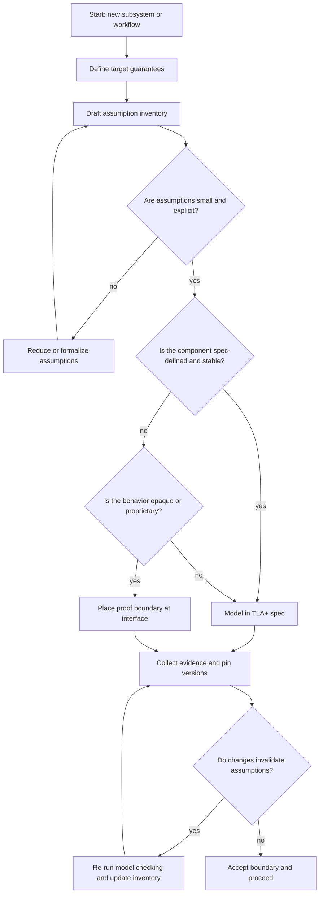

# Formal Methods Playbook for Reproducible Distributed ML Workflows on NVIDIA GPUs

> **Audience**: You already understand ML training loops, distributed systems (RPC/collectives/consensus), NVIDIA GPU execution models (streams, events, kernels, DMA), and compute-graph optimization.
>
> **Goal**: Maximize what is *provable* with **TLA+** (and related model-checking/spec techniques) for **general, distributed, effectful DAG workflows** used for ML training—while being explicit about the proof boundary created by proprietary drivers, kernels, and opaque vendor libraries.

---

## 0. Operating Principles

1. **Prove everything you can—stop exactly at the black box boundary.**  
   Your aim is not “prove the GPU is correct.” It is:  
   - prove your *workflow semantics* are precise;  
   - prove your *runtime protocol* cannot enter illegal states;  
   - prove your *distributed control plane* cannot violate safety/liveness properties (under stated assumptions);  
   - and **treat opaque components as assumptions** with minimal, explicit contracts.

2. **Separate computation from orchestration.**  
   Prove orchestration aggressively. Treat GPU kernels and vendor libs as *uninterpreted* compute steps with declared footprints and contracts.

3. **Prefer deterministic, synchronous training protocols** when byte-for-byte reproducibility is a requirement.

4. **Make illegal states unrepresentable in the workflow IR** (types) **and** unenterable at runtime (state-machine invariants + runtime checks).

5. **Use TLA+ for protocol correctness, not code-level correctness.**  
   TLA+ proves properties of *state machines* and their transitions. It does **not** prove that your Rust/C++ code is correct—unless you establish and validate a refinement relation (see §6).

---

## 1. Scope, Threat Model, and Proof Boundary

### 1.1 What you can reasonably prove with TLA+ for ML workflows

You can prove properties about:

- **Workflow execution protocols**:
  - effect ordering
  - dependency enforcement
  - idempotency and exactly-once semantics (at the protocol level)
  - error propagation and cleanup
  - checkpoint commit protocols

- **Resource safety protocols** (host/runtime level):
  - no double free / use-after-free (UAF) of runtime handles
  - no free-while-in-flight
  - no missing synchronization edges in the *planned* execution
  - bounded resource use (e.g., never exceed memory budget if the planner is correct)

- **Distributed coordination correctness**:
  - membership/epoch management
  - barrier correctness
  - all-reduce orchestration correctness (ordering, membership, failure modes)
  - checkpoint consensus and recovery semantics
  - job determinism rules (who decides what, when)

- **Reproducibility contracts**:
  - deterministic configuration selection
  - deterministic schedule selection
  - deterministic seed derivation
  - deterministic dataset partitioning and iteration order

### 1.2 What you cannot prove with TLA+ (and should not try)

You cannot prove:

- **Kernel internal correctness**:
  - “this kernel computes the right gradients”
  - “no out-of-bounds memory access inside kernel”
  - “no race inside kernel”

- **Correctness of proprietary GPU stacks**:
  - NVIDIA driver correctness
  - CUDA/cuDNN/cuBLAS correctness
  - firmware behavior

- **Correctness of the Linux kernel** (or its memory model)  
  You can *assume* the OS provides the primitives you model; you cannot prove the kernel is correct with TLA+ in your project scope.

- **Performance** (“fast”, “optimal”)  
  You can prove *absence of deadlock* or *bounded queue growth* under assumptions, not throughput.

### 1.3 The honest contract you can claim

A credible, strong statement looks like:

> We model the runtime and distributed control plane as a state machine. We prove in TLA+ that no legal workflow can drive the system into illegal protocol states (leaks, handle misuse, missing ordering edges, inconsistent checkpoint commits) **assuming**: (1) the vendor GPU stack implements its documented/assumed semantics, (2) kernels respect their declared read/write footprints, and (3) network primitives satisfy specified delivery/failure assumptions.

This is the right “maximal provability” boundary.

### 1.4 Assumption inventory and versioning

Maintain an explicit assumption inventory with pinned versions. At minimum:
- GPU driver version and release channel
- CUDA/cuDNN/cuBLAS/NCCL versions
- GPU model + stepping
- OS kernel version + configuration relevant to memory model or scheduling
- network stack assumptions (ordering, retry, timeouts)

For each assumption, record:
- the contract relied on (doc/spec reference)
- the proof artifacts that depend on it
- the change triggers that require re-validation

### 1.4.1 Assumption inventory template

```text
assumption_id: gpu-driver
component: nvidia-driver
version: 550.54.14
channel: production
contract: https://docs.nvidia.com/cuda/cuda-driver-api/index.html
scope: device execution + memory model
depends_on_proofs: [spec-1-runtime, spec-1-collectives]
change_triggers: [driver upgrade, kernel upgrade, firmware update]
assumption_owner: runtime-team
reviewer: verification-lead
review_cadence: quarterly
next_review_due: 2025-04-15
evidence_links: [tla-run-2025-01-15-01, tla-run-2025-01-15-02]
boundary_scope: [determinism, resource-safety, failure-cleanup]
escalation_policy: block-release-until-revalidated
last_reviewed: 2025-01-15
```

### 1.5 Proof boundary maintenance policy

Treat any change to the assumption inventory as a proof-boundary invalidation event.
Minimum policy:
- update the inventory first
- re-run model checking for affected specs
- re-evaluate any manual or automated evidence tied to the old versions

---

## 2. The “Effectful DAG + Railway” Execution Model

### 2.1 Core abstraction: a workflow is an effect DAG

Represent *training* as a **DAG** whose nodes are effects:

- **Pure compute** (matmul/conv/etc) – represented as *kernel invocations* (opaque compute)
- **Stateful effects**:
  - allocate/free buffers
  - host↔device memcpy
  - collectives (all-reduce, broadcast)
  - checkpoint save/restore
  - logging/metrics
  - barriers/epochs/membership changes

Edges encode:
- data dependencies
- required synchronization
- ordering constraints for determinism

### 2.2 Railway semantics: `Result[Ok, Err]` is part of the DAG meaning

Your execution semantics must specify:

- On `Err`, what happens to:
  - in-flight work
  - allocated buffers
  - partially written checkpoints
  - distributed state (epochs, membership)
- Whether error triggers:
  - immediate stop (absorbing failure), or
  - transition to a cleanup/recovery mode

**Rule of thumb**: Make failure semantics explicit and deterministic.

### 2.3 Deterministic scheduling requirement (if you want byte-for-byte)

A DAG admits many valid topological orders. To get strict reproducibility:

- Define a *canonical topological order* (e.g., lexicographic node IDs)
- Or define a scheduler that is deterministic given:
  - DAG structure
  - fixed device/cluster description
  - fixed configuration and seeds

If you allow concurrency, you must still fix:
- which nodes are submitted first
- how streams are assigned
- how collective membership ordering is chosen

---

## 3. Language & IR Design for Provable Workflows

### 3.1 Termination (avoid the halting problem by construction)

To ensure workflow compilation ends and produces a finite DAG:

- Disallow general recursion in the workflow DSL.
- Allow only:
  - `map`/`fold` over finite collections
  - bounded loops (`repeatN`)
  - structural recursion over finite shapes

**Output** is always a finite IR: `Graph` or `Plan`.

### 3.2 Make illegal states unrepresentable (where it matters)

**Host-side protocol safety** is where ADTs/types shine:

- **Handles are unforgeable** (newtypes / opaque IDs).
- **Lifetimes are explicit**:
  - buffers belong to a region/epoch
  - buffers cannot be referenced outside their scope
- **Linearity/affinity** (in spirit, even if you can’t use linear types everywhere):
  - a buffer must be freed exactly once (unless declared persistent)
  - “free” consumes the capability to use it

Typical technique:
- typed IR + a verifier pass that rejects IR violating constraints (liveness, aliasing, footprint rules).

### 3.3 Declare read/write footprints for opaque compute steps

Every kernel/library call should declare a conservative footprint:

- Buffers read: `R = {h1, h2, ...}`
- Buffers written: `W = {h3, ...}`

These footprints power:
- race-freedom proofs (ordering constraints)
- safe deallocation proofs (free not allowed while in-flight)
- deterministic ordering constraints for collectives

If you can’t know precise regions, over-approximate at the buffer level.

---

## 4. Reproducibility: Byte-for-Byte as a First-Class Constraint

Byte-for-byte reproducibility is *hard* on GPUs. The rule is:

> You only get bitwise reproducibility if you eliminate or fully control every source of nondeterminism.

### 4.1 Define a “Reproducibility Contract” (write it down)

A good contract includes:

1. **Pinned hardware**:
   - GPU model and stepping
   - number of GPUs
   - interconnect topology (PCIe/NVLink)
   - CPU model and count (can affect host-side ordering)

2. **Pinned software**:
   - OS version, kernel version
   - GPU driver version
   - CUDA/Vulkan stack versions (whichever you use)
   - vendor libraries (cuBLAS/cuDNN/NCCL) versions if in the stack
   - compiler versions (Rust, LLVM, etc.)
   - container image digest

3. **Pinned runtime configuration**:
   - math modes (TF32 on/off, flush-to-zero behavior if applicable)
   - deterministic algorithm selections in vendor libs (when available)
   - fixed workspace sizes and algorithm choice policies
   - fixed stream scheduling policy

4. **Pinned dataset and data order**:
   - dataset artifact hash
   - shard mapping to workers
   - per-worker file order
   - augmentation seeds and deterministic augmentation code paths

5. **Pinned randomness**:
   - a single global seed recorded in the manifest
   - deterministic derivation of per-step/per-worker/per-op seeds

6. **Pinned distributed membership and ordering**:
   - fixed worker IDs ordering
   - fixed ring order for all-reduce
   - fixed collective chunking strategy

### 4.2 Accept the hard truth: reproducibility does not generalize across hardware

Bitwise reproducibility usually requires:
- identical GPU model (and often same driver + library versions)

If you need cross-hardware determinism, you must:
- avoid GPU-specific nondeterminism (often impossible at scale), or
- accept weaker guarantees (numerical equivalence within tolerance).

### 4.3 Deterministic collectives are not optional

To get deterministic distributed updates:
- prefer **synchronous SGD** with deterministic all-reduce ordering
- avoid asynchronous parameter servers if bitwise reproducibility is required
- fix the reduction order (ring order, tree structure) and keep it stable

---

## 5. GPU Backends: How to “Step Past” Parts of the CUDA Barrier (Realistically)

You cannot fully escape opaque NVIDIA components on NVIDIA hardware, but you can choose where your proof boundary lies.

### Option A — **Treat CUDA/cuDNN/cuBLAS/NCCL as trusted black boxes**
**What you prove**:
- your DAG semantics and runtime protocol are correct
- you never misuse handles, streams, or synchronization at the orchestration layer
- you never violate your own footprint and ordering rules

**What you assume**:
- CUDA + libraries implement their contracts

**Why it’s pragmatic**:
- it’s the most realistic way to get performance
- it maximizes what *you* can prove while accepting vendor opacity

### Option B — **Use Vulkan compute to reduce dependence on CUDA runtime**
You still trust the NVIDIA Vulkan driver, but you benefit from:
- a public spec for command buffers, queues, fences, memory types
- a more “protocol-like” surface that maps cleanly to state machines

**Best use**:
- you want a documented execution model to align with TLA+
- you can accept driver opacity but want less CUDA-specific complexity

### Option C — **Direct driver interaction (ioctls)**
This is **research-grade** and has a weak proof payoff because:
- you still trust the kernel driver and firmware
- interfaces are undocumented/unstable
- you expand the surface area for mistakes massively

If your primary goal is “maximal formal provability,” Option C is usually a trap:
- you can prove *your* protocol, but you now have far more low-level behaviors to assume or reverse-engineer
- your proof boundary becomes harder to state, not easier

**Sweet spot recommendation**: Option A or B for anything beyond a research prototype.

### 5.1 Backend change control

Backend changes expand or shift the modeled surface. Use a simple rule:
- any change in GPU backend, driver, or library version invalidates prior proofs
- re-run the spec suite against the new inventory before relying on guarantees

---

## 6. TLA+ Methodology for Effectful DAG Runtimes

### 6.1 Your spec stack: multi-level specifications

Use at least two levels:

- **Spec 0: Semantic DAG spec (high-level)**
  - what effects mean
  - railway error behavior
  - “correctness” at the workflow level

- **Spec 1: Operational runtime spec (state machine)**
  - queues, allocations, in-flight commands, fences/events
  - ordering rules and resource rules
  - failure/cleanup rules

Then prove:
- Spec 1 **refines** Spec 0 (or is consistent with it)
- Spec 1 satisfies safety/liveness invariants

### 6.1.1 Spec adequacy checklist

Protocol correctness only applies to the constraints you encode. Require the spec to include:
- determinism constraints (scheduler, collective ordering)
- resource bounds (memory, handles, in-flight limits)
- failure behavior (cleanup mode, rollback or abort rules)
- external dependencies (network delivery assumptions, device semantics)

### 6.2 What you model (and what you abstract)

Model explicitly:
- handle allocation/free protocol
- in-flight tracking
- read/write footprints and dependency edges
- deterministic scheduling rules
- error propagation and cleanup mode
- distributed membership and barriers

### 6.3 Proof envelope artifacts

Bundle proofs with a machine-readable environment manifest:
- spec versions
- assumption inventory (from §1.4)
- model-checking parameters and limits
This makes proofs reproducible and links them to the exact boundary they depend on.

### 6.4 Additional formal methods principles to prioritize

- **Refinement mapping**: define explicit mappings between spec levels and keep them versioned with code changes.  
- **Compositional specs**: specify allocator/scheduler/collectives separately, then prove composition preserves invariants.  
- **Assumption minimization**: prefer conservative, explicit assumptions and model nondeterminism rather than optimistic guarantees.  
- **Invariant-driven design**: identify safety invariants early; wire them into specs and runtime checks.  
- **Counterexample-first workflow**: keep a log of model checker counterexamples and the design responses.  
- **Bounded checking clarity**: document bounds and what behaviors they cover.  
- **Fairness precision**: state fairness assumptions explicitly and keep them minimal; note which liveness results depend on them.  
- **Property coverage**: separate safety, liveness, determinism; ensure each is exercised by dedicated checks.  
- **Runtime–spec alignment**: add lightweight runtime checks for invariants that are expensive to model or easy to violate in code.

---

## References

- [Leslie Lamport, *Specifying Systems: The TLA+ Language and Tools for Hardware and Software Engineers* (Addison-Wesley, 2002)](https://lamport.azurewebsites.net/tla/book.html)
- [Edmund M. Clarke, Orna Grumberg, Doron A. Peled, *Model Checking* (MIT Press, 1999)](https://mitpress.mit.edu/9780262032704/model-checking/)
- [Clifford B. Jones, *Systematic Software Development Using VDM* (Prentice Hall, 1990)](https://dl.acm.org/doi/book/10.5555/122981)
- [Jean-Raymond Abrial, *The B-Book: Assigning Programs to Meanings* (Cambridge University Press, 1996)](https://www.cambridge.org/core/books/bbook/7C16C1657361C6B9A29C0E9A0477C2C8)
- [Jayadev Misra, K. Mani Chandy, “Proofs of Networks of Processes,” *IEEE Transactions on Software Engineering* (1981)](https://doi.org/10.1109/TSE.1981.231167)
- [Zohar Manna, Amir Pnueli, *The Temporal Logic of Reactive and Concurrent Systems: Specification* (Springer, 1992)](https://link.springer.com/book/10.1007/978-1-4612-0933-6)
- [Zohar Manna, Amir Pnueli, *The Temporal Logic of Reactive and Concurrent Systems: Safety* (Springer, 1995)](https://link.springer.com/book/10.1007/978-1-4612-4222-7)
- [C. A. R. Hoare, *Communicating Sequential Processes* (Prentice Hall, 1985)](https://dl.acm.org/doi/book/10.5555/3921)
- [Edsger W. Dijkstra, *A Discipline of Programming* (Prentice Hall, 1976)](https://dl.acm.org/doi/book/10.5555/1243380)
- [J. C. M. Baeten, *Process Algebra: Equational Theories of Communicating Processes* (Cambridge University Press, 2005)](https://www.cambridge.org/core/books/process-algebra/DF38DD1C9D5EBD84A9A0A5D4A59FEE1C)
- [Nancy G. Leveson, *Engineering a Safer World: Systems Thinking Applied to Safety* (MIT Press, 2011)](https://mitpress.mit.edu/9780262016629/engineering-a-safer-world/)
- [Tim Kelly, *Arguing Safety: A Systematic Approach to Safety Case Management* (University of York, 1998)](https://www-users.york.ac.uk/~tpk/ArguingSafety.htm)
- [T. P. Kelly, J. A. McDermid, “A Systematic Approach to Safety Case Management,” *Safety Science* (1998)](https://doi.org/10.1016/S0925-7535(97)00050-1)

---

## Appendix A: Proof Boundary Decision Tree

This decision tree is a technical workflow for placing a proof boundary in a system that combines model-checked protocols with opaque components. It encodes a repeatable sequence: define the intended guarantees first, enumerate assumptions, test whether those assumptions are minimal and explicit, and then decide what to model versus what to treat as an interface boundary. The goal is not to remove judgment, but to ensure the judgment is applied at a fixed set of gates and is recorded alongside the assumption inventory. Each branch is tied to a specific engineering action: reduce assumptions by formalizing or re-scoping, model components with stable, spec-defined semantics, or place a boundary at opaque interfaces and pin versions to evidence.

The structure also enforces change control. Any modification to the assumption inventory loops back to re-validation, making proof drift visible. This matters because the boundary is not a one-time declaration; it is maintained through explicit inventory updates, model-checking reruns, and versioned evidence. The flow distinguishes between technical feasibility (whether a component can be specified and modeled) and proof scope (whether a component should be trusted as an external contract). That separation keeps performance-driven choices, vendor dependencies, and architectural constraints from silently expanding the proof boundary without an explicit review.



Abstract away:
- the math inside kernels
- byte contents of tensors (unless you are modeling RNG determinism at a symbolic level)
- DMA mechanics (treat memcpy as atomic effect with completion)

### 6.3 Core invariants for a single-node GPU executor

Define variables such as:

- `Allocated`: set of live handles
- `InFlight`: set of submitted commands not completed
- `Uses(cmd)`: handles read/written by cmd
- `Completed`: set of completed commands
- `Err`: optional error state
- `Mode`: `Running | Cleanup | Done | Failed`

Then prove invariants like:

1. **Handle validity**  
   Any command references only allocated handles:
   - `∀ cmd ∈ InFlight : Uses(cmd) ⊆ Allocated`

2. **No double free**  
   `Free(h)` only if `h ∈ Allocated`, and after free `h ∉ Allocated`.

3. **No free-while-in-flight**  
   If `h` is used by any in-flight command, it cannot be freed:
   - `∀ h : (∃ cmd ∈ InFlight : h ∈ Uses(cmd)) ⇒ h ∈ Allocated ∧ ¬CanFree(h)`

4. **Ordering for hazards**  
   If cmd2 reads/writes a handle written by cmd1, cmd2 is ordered after cmd1 by:
   - stream FIFO, or
   - explicit dependency edge

5. **Deterministic scheduling**  
   If two schedules are possible, the runtime chooses the canonical one.

6. **Railway semantics**  
   If `Err` is set, no further “normal” effects occur; only cleanup/recovery actions may occur.

7. **Cleanup completeness** (if you promise it)  
   From Cleanup mode, eventually `Allocated` becomes empty (or only persistent handles remain).

### 6.4 Distributed training: what you model

Your distributed ML workflow has at least:

- **Workers** (GPU executors)
- **Coordinator / Control plane** (job state, membership, epochs)
- **Communication substrate** (collectives or point-to-point)
- **Storage** (checkpoint store, possibly object store)

Model in TLA+:
- membership changes
- barrier protocols
- collective group formation and ordering
- checkpoint commit protocol
- restart semantics and replay semantics
- idempotency keys for effects that may be retried

### 6.5 Liveness: always state your assumptions

Liveness proofs depend on assumptions like:
- messages are eventually delivered (or fail)
- submitted GPU work eventually completes (or errors)
- storage writes eventually complete (or error)

In TLA+, encode these as fairness assumptions, and **write them down** in your reproducibility/safety contract.

### 6.6 Refinement: the correct way to connect specs to code

TLA+ does **not** prove your Rust is correct directly. What you do:

1. Treat your Rust runtime as *intended to implement* Spec 1.
2. Establish a **refinement mapping**:
   - a function from concrete runtime state → abstract TLA+ state
3. Validate refinement through:
   - design alignment (one-to-one mapping of operations)
   - runtime assertions that enforce TLA+ invariants
   - model-based testing (generate traces from the spec and compare)

This is the pragmatic, standard route in systems verification.

---

## 7. Anti-Pattern Proofs (Avoid These)

1. **Modeling GPU internals in TLA+**  
   You’ll either explode the state space or accidentally assume what you need to prove.

2. **Proving numeric equivalence of floating point computations in TLA+**  
   TLA+ is not designed for bit-level floating-point arithmetic proofs.

3. **“Verifying the CUDA stack” by modeling it as correct**  
   That proves nothing. Instead, model CUDA as an *assumption* with a minimal interface contract.

4. **Single huge spec** for everything  
   Use layers and refinement; otherwise TLC becomes useless.

5. **Ignoring fairness and failure models**  
   If you don’t specify your liveness assumptions explicitly, your “proof” will not match reality.

---

## 8. Distributed Training Algorithms Under Formal Methods

This section focuses on **protocol correctness** and **reproducibility**.

### 8.1 Synchronous data parallel (recommended baseline)

**Workflow** per step:
1. Each worker computes gradients locally.
2. All-reduce gradients across workers in a deterministic order.
3. Apply update deterministically.
4. Barrier or epoch increment.

**What to prove**
- Membership agreement: all workers participate in the same step with the same group.
- Deterministic all-reduce structure (fixed ring/tree).
- Exactly-once step commit: either the step is committed everywhere or retried safely.
- Restart semantics: after failure, workers resume at the same global step with the same RNG states.

**Reproducibility keys**
- fixed batch assignment per worker
- fixed all-reduce order
- fixed floating point algorithm choices (reductions are sensitive to order)

### 8.2 Model parallel / pipeline parallel

Adds complexity:
- microbatch scheduling
- pipeline bubbles
- activation checkpointing
- cross-stage communication

**What to prove**
- no deadlock in pipeline scheduling
- no reordering that violates determinism
- correct “credit” or flow-control protocol (bounded in-flight microbatches)
- correct restart semantics: no duplicate microbatch application

### 8.3 Parameter server (asynchronous) — avoid if bitwise reproducibility is required

Asynchronous updates are inherently order-dependent:
- message delays reorder updates
- resulting floating point sums differ

You can still use formal methods here, but reproducibility is weaker unless you impose strict ordering.

**If you must use it**, enforce:
- logical clocks
- deterministic update ordering at the server
- idempotency keys per update

Then prove:
- exactly-once application of each update
- bounded staleness if that’s the algorithm requirement

---

## 9. Consensus and Coordination: “Only if Proven Correct”

Your constraint is strict:

> We can use existing consensus mechanisms only if they’ve been proven correct by TLA+ or equivalent.

### 9.1 Reality check: code-level proofs are rare

Many systems use TLA+ to validate *designs*, not to produce machine-checked proofs of shipping code. If you require implementation-level proofs, your choices will be limited and may be research-grade.

### 9.2 Pragmatic interpretation that still honors the principle

You can maintain the “prove everything provable” ethos by:

- Using **a formally specified consensus protocol** (Raft/Paxos/whatever) with known proofs/specs
- Treating the deployed consensus implementation as a **trusted component**
- Proving your system is safe **assuming** the consensus API satisfies the protocol contract

If you truly need code-level verification, you may need to:
- adopt a verified implementation from the research world, or
- build a small verified coordinator yourself (often feasible if your needs are narrow)

### 9.3 What to use consensus for in ML workflows

Use consensus only for:
- cluster membership and epochs
- step commit decisions
- checkpoint commit records (two-phase commit / write-ahead log)
- run manifests and reproducibility metadata

Avoid putting high-rate data plane traffic (tensors) behind consensus.

### 9.4 When you can avoid consensus

If you can tolerate:
- a single coordinator process (with deterministic replay),
- or append-only logs with deterministic recovery,

you can reduce coordination complexity and keep more of the system in your own provable state machine.

---

## 10. Checkpointing, Logging, and Deterministic Replay

### 10.1 Checkpoints must be globally consistent

A “checkpoint” is only meaningful if it captures:
- model parameters
- optimizer state
- RNG states (global + per-worker + per-stream/per-op if needed)
- data loader position / epoch / shuffle state
- distributed membership/epoch/step metadata

### 10.2 A provable checkpoint commit protocol (typical pattern)

1. **Prepare**: all workers write checkpoint shards to durable storage with a unique checkpoint ID.
2. **Vote**: workers report success/failure to coordinator.
3. **Commit**: coordinator publishes a commit record (consensus-backed if needed).
4. **Finalize**: workers garbage-collect uncommitted shards.

**What to prove**
- no “phantom committed” checkpoint (commit record without all shards)
- no “lost checkpoint” (all shards written but commit never reachable under assumptions)
- idempotent retries: re-running prepare/commit does not create ambiguity

### 10.3 Logging as an effect trace (enables debugging + replay)

Maintain an **append-only effect log**:
- node IDs
- effect types
- parameters (hashed if large)
- causal dependencies
- start/end timestamps (optional, not used for determinism)
- success/failure and error codes

This supports:
- deterministic replay for debugging
- auditability
- postmortem reconstruction of “what happened”

**Warning**: Time-based decisions break reproducibility. Logs should be observational, not control inputs.

---

## 11. Implementation Pattern: Verified Runtime + Black-Box Compute

### 11.1 Minimal verified core: the runtime is a state machine

Design the runtime so its transitions map directly to your TLA+ actions:

- `alloc(h)`
- `free(h)`
- `submit(cmd)`
- `poll_complete(cmd)`
- `wait(cmd)`
- `begin_cleanup()`
- `finalize_checkpoint(id)`
- …

Then:
- enforce all preconditions at runtime
- keep unsafe code in a tiny “sys” module

### 11.2 Model-based testing and runtime assertions

To bridge “spec ↔ code”:
- generate random legal workflows (within bounds)
- execute on a reference interpreter (pure)
- execute on real runtime (GPU)
- compare *observable protocol outcomes*:
  - which nodes completed
  - which checkpoint IDs committed
  - which handles allocated/freed
  - error paths behaved correctly

Include runtime assertions mirroring TLA+ invariants.

---

## 12. Effort vs Safety: A Practical Ladder

### Tier 0 — Conventional ML stack
- Use PyTorch/JAX/TF
- Rely on “best effort” determinism flags
- Minimal guarantees

### Tier 1 — Proven orchestration, trusted CUDA
- Prove your workflow runtime protocol in TLA+
- Treat CUDA/cuDNN/cuBLAS/NCCL as black boxes
- Achieve high confidence in orchestration correctness
- Best ROI for most teams

### Tier 2 — Proven distributed control plane + deterministic workflows
- Add TLA+ proofs for membership, checkpoint commit, replay semantics
- Strict run manifest and pinning
- Highest reproducibility and operational reliability

### Tier 3 — Research-grade “driver-level” work
- Direct driver interfaces / custom submission
- Very high engineering cost
- Proof payoff is smaller than it looks (still black boxes)
- Only worth it for research novelty or very narrow controlled environments

---

## 13. A Concrete Checklist

### Workflow/IR
- [ ] Workflow always compiles to a finite DAG
- [ ] Every effect has explicit inputs/outputs and footprints
- [ ] Error semantics are explicit and deterministic
- [ ] A canonical schedule is defined (or schedule is a deterministic function)

### Runtime (single node)
- [ ] Handle tables enforce unforgeability
- [ ] In-flight tracking prevents free-while-in-flight
- [ ] Stream/dependency semantics are explicit and checked
- [ ] Cleanup semantics are specified and implemented
- [ ] Runtime assertions mirror TLA+ invariants

### Distributed
- [ ] Membership/epoch semantics are specified
- [ ] Collective ordering is deterministic
- [ ] Checkpoint protocol is provably consistent
- [ ] Restart/replay semantics are deterministic and documented
- [ ] Idempotency keys exist for retryable effects

### Reproducibility
- [ ] Run manifest includes pinned hardware/software/config
- [ ] Deterministic seed derivation recorded
- [ ] Dataset artifact and partitioning are hashed and pinned
- [ ] Deterministic algorithms enforced (with performance tradeoffs understood)
- [ ] Full effect trace is recorded for audit/replay

---

## 14. Final Notes: What “Maximally Formal” Looks Like in Practice

A maximally formal ML workflow system on NVIDIA hardware looks like:

- **A pure, total workflow language** that produces a finite effect DAG.
- **A provable operational semantics** (TLA+) for the runtime and control plane.
- **A small Rust runtime** that implements the state machine with strong runtime checks.
- **A strict reproducibility contract** with pinned environments and deterministic scheduling.
- **A thin black-box boundary** for kernels and vendor stacks, captured by explicit assumptions.

You do not eliminate vendor opacity. You **contain it** and prove that everything around it is correct.

---

### Appendix A: Minimal black-box assumption template (use in specs/docs)

> **Assumption GPU-Exec**: Submitted commands either complete successfully or return a detectable error; completion notifications are truthful.  
> **Assumption GPU-Mem**: Memcpy and kernel launches affect only declared buffers, within declared bounds.  
> **Assumption GPU-Order**: Stream FIFO ordering and explicit fence/event dependencies provide ordering consistent with the backend API contract.  
> **Assumption Net**: Messages may be delayed/dropped/duplicated as modeled; retries are possible; failures are detectable within time bounds (if used).  
> **Assumption Store**: Checkpoint object store operations provide read-after-write consistency (or weaker model as specified).

Make these assumptions *explicit* so your proofs mean something.
