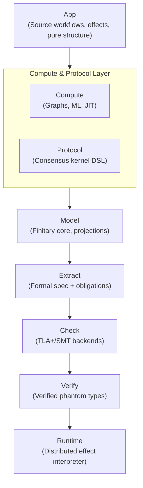

# Effectful Proof Engine

**Status**: Authoritative source
**Supersedes**: leslie_proof_engine.md
**Referenced by**: intro.md

> **Purpose**: Define the Effectful Proof Engine, which verifies distributed systems expressed in the Effectful compiler morphology. The proof engine extracts TLA+ specifications from pure workflow and protocol representations, model-checks safety and liveness properties, and gates deployment on verification success.

______________________________________________________________________

## SSoT Link Map

| Need                       | Link                                                            |
| -------------------------- | --------------------------------------------------------------- |
| Effectful overview         | [DSL Intro](intro.md)                                           |
| Proof boundary philosophy  | [Proof Boundary](proof_boundary.md)                             |
| Consensus formal methods   | [Consensus](consensus.md)                                       |
| JIT and lowering           | [JIT and Staged Lowering](jit.md)                               |
| ML training verification   | [ML Training](ml_training.md)                                   |
| Infrastructure deployment  | [Infrastructure](infrastructure_deployment.md)                  |
| Pure compute DAG semantics | [Pure Compute DAGs in Haskell](pure_compute_dags_in_haskell.md) |

______________________________________________________________________

## 1. Design Goals

The Effectful Proof Engine is designed to satisfy the following goals simultaneously:

1. **Arbitrary expressiveness at the source-representation layer**

   - Users describe rich application logic using pure workflow representations, typed effects, and
     composition. The FP vocabulary for that layer is described in
     [pure_compute_dags_in_haskell.md](pure_compute_dags_in_haskell.md).

1. **Strong formal guarantees for distributed correctness**

   - Consensus, replication, and fault-tolerance logic is formally validated using a TLA+-style toolchain

1. **High-performance execution**

   - Local computation can be compiled into optimized compute graphs and lowered into Rust, CUDA,
     or other runtime artifacts as needed

1. **Small trusted core**

   - The amount of code that must be trusted without proof is minimized and clearly identified

1. **Proof-carrying deployment**

   - It is impossible to deploy a consensus-critical application unless it has been formally checked

______________________________________________________________________

## 2. Proof Engine in the Effectful Boundary Model

The proof engine's 7 layers map to Effectful's nested boundary architecture:

| Effectful Boundary         | Proof Engine Layers                        |
| -------------------------- | ------------------------------------------ |
| **Purity Boundary**        | App, Protocol, Model                       |
| **Proof Boundary**         | Extract, Check, Verify, Runtime            |
| **Outside Proof Boundary** | External TLA+/SMT tools, drivers, hardware |

See [intro.md](intro.md#2-the-proof-boundary-and-purity-boundary) for the boundary model overview.

These boundaries are nested rather than disjoint. The App, Protocol, and Model layers live inside
the purity boundary and therefore also inside the larger proof boundary. Extract, Check, Verify,
and Runtime extend that proof boundary outward into imperative or tool-facing territory without
making those layers part of the purity boundary.

______________________________________________________________________

## 3. High-Level Architecture

The proof engine is structured as a set of layers, each with a clear responsibility and trust boundary:



______________________________________________________________________

## 4. App — Source Workflow Layer

### Purpose

The App layer holds source workflows and effect topologies before they are projected into the
verification core.

### Characteristics

- Pure description layer inside the purity boundary
- Often hosted in Haskell today, but conceptually a representation layer rather than one mandatory
  user-facing language
- Explicit effects (send, receive, storage, crypto, compute, etc.)
- FP structure such as functorial, applicative, selective, traversable, and monadic composition is
  referenced from [pure_compute_dags_in_haskell.md](pure_compute_dags_in_haskell.md)

### Key Principle

Not all application code is verified.

Only the consensus-critical portion of the program must be projected into the verified core. Other logic may remain outside the formal model.

### Status Typing

Applications are indexed by a phantom status:

```haskell
-- Effectful.ProofEngine.App phantom type for verification status
data Status = Unverified | Verified

data App (s :: Status) a
```

Only `App 'Verified` can be deployed in production.

______________________________________________________________________

## 5. Protocol — Consensus Kernel DSL

### Purpose

The Protocol layer defines the verified distributed semantics of the system.

This is the heart of the proof engine's formal guarantees.

### Core Model

Protocols are modeled as explicit state machines:

- Node-local state
- Typed messages
- Step relation
- Explicit scheduler/adversary interface

```haskell
-- Effectful.ProofEngine.Protocol step function signature
step :: Assumptions
     -> NodeId
     -> State
     -> Input
     -> (State, [OutMsg], [SysEff])
```

### Assumptions as First-Class Parameters

All fault, timing, and trust assumptions are explicit:

- Byzantine fault bounds
- Network model (async / partial sync / sync)
- Message authentication and crypto assumptions
- Trust graphs / quorum systems

This allows arbitrary customization without changing the verification machinery.

### Protocol Composition

Protocols are composable by layering:

- authentication ∘ transport ∘ quorum ∘ decision

Composition preserves formal semantics and proof obligations.

______________________________________________________________________

## 6. Model — Finitary Verification Core

### Purpose

Defines the subset of values and computations that can be reasoned about formally.

### Projection Boundary

Any value that influences protocol behavior must be projected into the model core:

```haskell
-- Effectful.ProofEngine.Model projection typeclass
class Model a where
  type Core a
  project :: a -> Core a
```

### Restrictions

- Finite or finitely-approximable domains
- Bounded data structures
- No hidden recursion or unbounded allocation

Values that cannot be projected are rejected during extraction.

______________________________________________________________________

## 7. Compute — Compute Graph & ML Subsystem

### Purpose

Provides a high-performance, optimizable execution path for local computation:

- ML workflows
- Data-parallel pipelines
- Custom CUDA kernels

The compute subsystem typically starts from pure workflow descriptions whose dependency structure is
still visible. For the Haskell and category-theoretic view of that source layer, see
[pure_compute_dags_in_haskell.md](pure_compute_dags_in_haskell.md). This document focuses on what
happens once those descriptions have to interact with verification and lowering.

### Compute Graph IR

- Typed dataflow graph
- Explicit tensor shapes, dtypes, layouts
- Explicit device placement (CPU/GPU)
- Explicit purity/determinism annotations

### Custom CUDA Operations

Custom kernels are defined as graph ops, not arbitrary side effects.

Each op declares:

- Type signature
- Shape function
- Workspace bounds
- Determinism guarantees

This enables:

- Static memory planning
- Safe execution
- Fixed memory footprint enforcement

### Optimization Pipeline

1. Graph construction (Haskell)
1. Rewrite passes (fusion, CSE, layout)
1. Scheduling and memory planning
1. Lowering to a stable IR
1. Rust JIT execution (CPU + CUDA)

______________________________________________________________________

## 8. Extract — Formal Artifact Generation

### Purpose

Transforms protocol definitions into formal verification artifacts.

### Generated Artifacts

- TLA+ modules encoding protocol semantics
- Model-checking configurations
- Proof obligations (invariants, refinement mappings)
- Provenance metadata

### Provenance Mapping

Every generated variable and transition is mapped back to source-level constructs, enabling meaningful counterexample diagnostics.

______________________________________________________________________

## 9. Check — Verification Backends

### Purpose

Integrates external formal tools.

### Supported Backends

- TLC (explicit-state model checking)
- Apalache (symbolic/SMT-based checking)
- TLAPS (proof checking, optional)

### API

```haskell
-- Effectful.ProofEngine.Check verification API
check :: Backend -> Bundle -> IO (Either Report CheckedBundle)
```

Reports include:

- Pass/fail
- Counterexample traces
- Source-mapped diagnostics

______________________________________________________________________

## 10. Verify — Proof-Carrying Deployment

### Purpose

Ensures that only verified programs can run.

```haskell
-- Effectful.ProofEngine.Verify deployment gate
verify :: Backend
       -> App 'Unverified a
       -> IO (Either Report (App 'Verified a))
```

This gate is non-bypassable without unsafe operations.

______________________________________________________________________

## 11. Runtime — Distributed Effect Interpreter

### Purpose

Executes verified applications in a distributed setting.

### Characteristics

- Deterministic, replayable execution
- Single-writer per node
- Fixed-capacity immutable effect log
- Explicit scheduler/adversary interface

### Storage Model

- Preallocated append-only log
- Persistent snapshots
- Typed OutOfSpace handling

The runtime semantics matches the protocol model by construction.

______________________________________________________________________

## 12. Trust Model

### Phase 1 (Practical)

Trusted:

- The proof engine extractor
- External TLA+/SMT tools
- Runtime kernel

### Phase 2 (Stronger)

- Trace validation between runtime and model
- Differential checking

### Phase 3 (Foundational, optional)

- Proof certificates
- Small proof-checking kernel
- Kernel proven sound in a proof assistant

______________________________________________________________________

## 13. Why Refinement is Central

The proof engine prioritizes refinement proofs:

- Abstract specs define correctness
- Protocols prove they refine the abstract spec
- Customizations preserve correctness automatically

This scales far better than ad-hoc invariant proofs.

______________________________________________________________________

## 14. Summary

The Effectful Proof Engine enables:

- Expressive distributed applications described within the Effectful compiler morphology
- Formal validation of consensus correctness
- High-performance local computation
- Clear trust boundaries
- Incremental strengthening of guarantees

It combines the strengths of:

- Haskell (abstraction, DSLs, compilation)
- TLA+ (distributed system correctness)
- Rust (safe, fast runtime)
- CUDA (specialized performance)

without forcing any single tool to do what it is not good at.

______________________________________________________________________

## Cross-References

- [intro.md](intro.md) — Effectful compiler morphology overview and boundary model
- [proof_boundary.md](proof_boundary.md) — Philosophical foundation for verification limits
- [consensus.md](consensus.md) — Formal methods for distributed consensus
- [jit.md](jit.md) — JIT and staged lowering in the compiler morphology
- [ml_training.md](ml_training.md) — Formal methods for distributed ML workflows
- [infrastructure_deployment.md](infrastructure_deployment.md) — Nodes, messages, and pure effects
