# Pure Compute DAGs in Haskell

**Status**: Reference only
**Supersedes**: none
**Referenced by**: none

> **Purpose**: Present a Haskell- and Mermaid-centric account of how pure compute DAGs can be described, inspected, optimized, memoized, and distributed using category-theoretic structure. The emphasis is on giving an ML engineer enough Haskell and category theory to talk precisely about workflow shape, parallelism, determinism, caching, and retention policy.
> **📖 Authoritative Reference**: [Effectful DSL Intro](intro.md), [DSL Compiler Morphology](dsl_compiler_morphology.md), [ML Training](ml_training.md), and [Total Pure Modelling](../engineering/total_pure_modelling.md)

______________________________________________________________________

## SSoT Link Map

| Need                         | Link                                                           |
| ---------------------------- | -------------------------------------------------------------- |
| DSL overview                 | [DSL Intro](intro.md)                                          |
| Compiler morphology          | [DSL Compiler Morphology](dsl_compiler_morphology.md)          |
| ML-specific application      | [ML Training](ml_training.md)                                  |
| Purity discipline            | [Total Pure Modelling](../engineering/total_pure_modelling.md) |
| Backend and lowering context | [JIT Compilation](jit.md)                                      |
| Proof-boundary philosophy    | [Proof Boundary](proof_boundary.md)                            |

______________________________________________________________________

## 1. Overview

This document describes a pure functional approach to compute DAGs centered around Haskell values.

The core idea is simple:

> A workflow should first be a pure description of computation. Execution strategy comes later.

That framing is useful far beyond one domain. It applies to:

- ML training and evaluation
- Monte Carlo simulation and SDE path generation
- ETL and feature pipelines
- media, batch, and scientific compute graphs
- heterogeneous CPU, GPU, FPGA, and accelerator execution
- any distributed system where determinism and memoization matter

This is not a rewrite of category theory textbooks. It is a working vocabulary. The goal is to give an engineer enough Haskell and category theory to:

- describe a compute graph precisely in pure terms
- see where parallel structure is preserved and where true dependency barriers arise
- understand why `Functor`, `Applicative`, `Selective`, and `Monad` each model different kinds of graph shape
- understand free modeling as a hierarchy, not a synonym for free monads
- reason about deterministic memoization and cross-run cache reuse
- express cache retention policy as part of the model rather than as an afterthought
- understand how the same pure description can be interpreted locally, in parallel, or across a distributed system

This document reads best when the Haskell snippets are treated as precise pseudocode, the
category-theory terms are treated as names for useful dependency patterns, and the laws are
treated as guardrails rather than as the first thing to memorize.

The single biggest idea is that a compute workflow can be represented as a **value** before it is executed. Once you accept that move, most of the rest of the document becomes much easier to follow.

### 1.1 How to Use This Document

A good reading order is:

1. Read Sections 1 through 5 for the mental model and basic Haskell syntax.
1. In Section 6, focus first on the plain-English explanation for each abstraction.
1. Skim the laws on the first pass. They matter, but they are not the main obstacle.
1. Read Sections 7 through 10 to see why these abstractions matter for scheduling, memoization, and retention.
1. Return to the more formal parts once the distributed-systems motivation is clear.

### 1.2 What "Functional" Means Here

In this document, "functional programming" mostly means three practical things:

- describe computation with explicit inputs and outputs
- avoid hidden mutable state in the model
- separate the description of work from the execution of work

That is much less mystical than it sometimes sounds.

For example, suppose you have a small ML-flavored workflow:

- load a dataset shard
- normalize it
- train on it
- write a checkpoint

An imperative system often presents that as a sequence of commands. A pure functional model tries to first capture the **shape** of that workflow as data:

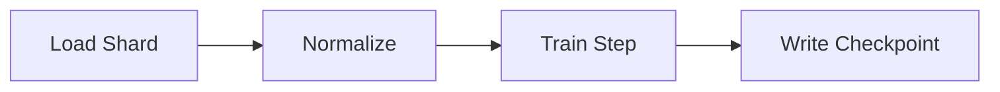

Once that shape exists as data, a runtime can inspect it before running it. That is the practical reason FP matters here.

______________________________________________________________________

## 2. Core Philosophy

The architecture rests on one separation:

- **what** to compute
- **how** to execute it

In this framing:

- the workflow is a pure value
- the optimizer is a pure transformation over that value
- the scheduler is an interpreter
- the runtime is an interpreter
- memoization is a consequence of explicit determinism
- retention policy is part of the model of execution, not an ad hoc cleanup script

In Effectful's boundary vocabulary, most of this document is about representations **inside the
purity boundary**, where workflows and effect descriptions still exist as pure data. Interpreters
and lowerings cross that boundary into imperative runtimes, and those runtimes may still remain
inside the **proof boundary**, the larger verified region whose lowering rules and runtime
contracts are modeled and checked.

In Python, PyTorch, Spark, or Airflow terms:

- a pure workflow value is like an explicit DAG object
- an interpreter is the thing that decides how to run that DAG
- category-theory vocabulary helps describe which parts of the DAG are independent and which are not

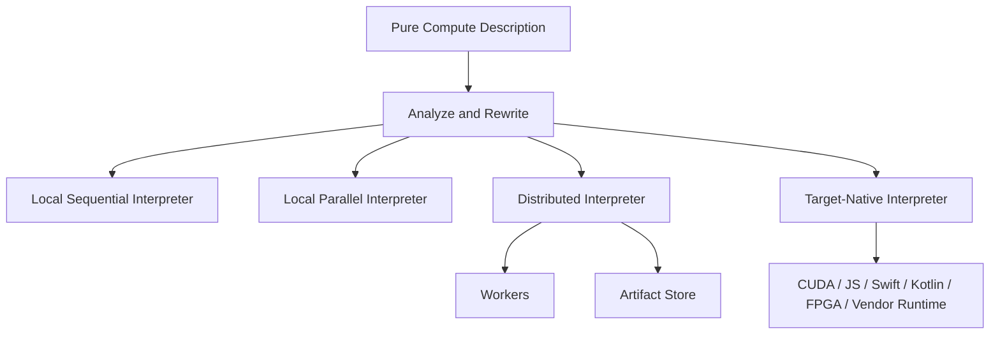

This matters because pure data can be:

- inspected
- validated
- transformed
- hashed
- memoized
- scheduled
- partitioned
- retargeted

before anything performs I/O or crosses a runtime boundary.

______________________________________________________________________

## 3. High-Level Architecture

At a high level, a pure compute DAG architecture looks like this:

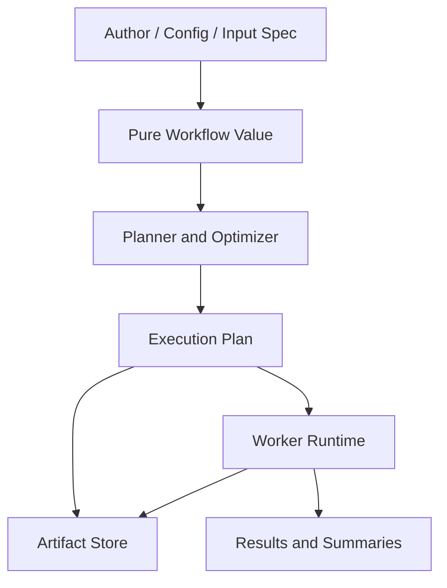

This document stays focused on the pure side of that picture: the Haskell values and category-theoretic structure that make the rest of the system analyzable.

### 3.1 A Concrete Reading

There are two very different ways to think about a workflow:

- "run these commands now"
- "build a value that describes what should be run"

This document is about the second style.

That shift matters because a value can be:

- examined
- transformed
- hashed
- memoized
- split into parallel work
- lowered to different runtimes

before anything has actually happened yet.

______________________________________________________________________

## 4. A Minimal Pure DAG

A general compute DAG can start with very small types:

```haskell
data Workflow n = Workflow
  { wfNodes :: Map NodeId n
  , wfEdges :: Set Edge
  }

data Edge = Edge
  { edgeFrom :: NodeId
  , edgeTo   :: NodeId
  }

data NodeKind
  = PureNode
  | BoundaryNode
  | PartitionNode
  | GatherNode
  | SummaryNode
  deriving (Eq, Show, Generic)

data NodeSpec = NodeSpec
  { nodeId      :: NodeId
  , nodeKind    :: NodeKind
  , nodeName    :: Text
  , nodeInputs  :: [NodeId]
  , nodeParams  :: Map Text Text
  , nodeVersion :: Text
  }
```

The point is not that these are the final production types. The point is that the workflow already exists as **data**.

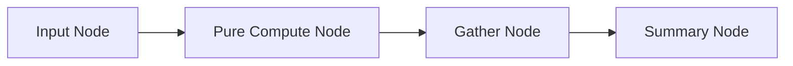

That is enough to support:

- topological validation
- dependency analysis
- partition and gather expansion
- batching
- resource estimation
- memoization keys
- retention decisions
- backend lowering decisions

The type definitions above read best as a schema, not as an executable program. They are saying:

- a workflow has nodes and edges
- an edge connects one node to another
- a node has a kind, a name, some inputs, and some parameters

That is already enough structure for a scheduler to reason about the graph.

______________________________________________________________________

## 5. How to Read the Haskell

The Haskell used here is lightweight. Here is the minimum vocabulary.

- A **type** is something like `Int`, `Text`, or `Tensor`.
- A **type constructor** is something like `Maybe`, `IO`, or `Workflow`.
- A **typeclass** is a shared capability such as `Functor`, `Applicative`, or `Monad`.
- An **instance** says a type provides that capability.

In looser terms:

- a type says what shape a value has
- a type constructor is a template for building types
- a typeclass says "anything with this interface can be used in this way"
- an instance says "this particular type supports that interface"

In C++ terms:

- a **type constructor** is often similar to a template in spirit. `Maybe a` or `Vector a` is like a type-level shape waiting for a concrete argument.
- a **typeclass** is **not** like an OOP class with fields, methods, inheritance, and object identity.
- a **typeclass** is closer to a compile-time capability constraint. In modern C++ it is often more like a `concept` plus associated overload resolution than like a base class.
- an **instance** is also not like "an object instance". It means "this type has an implementation of that capability."

So when you read:

```haskell
Functor f =>
```

the closest C++ mental model is not "class `f` inherits from `Functor`." It is closer to:

- "`f` satisfies the `Functor` interface lawfully"
- "generic code may use the `fmap` operation for `f`"
- "this is ad hoc polymorphism, not subtype polymorphism"

The key symbols:

- `::` means "has type"
- `->` means "function from ... to ..."
- `=>` means "requires this capability"
- `forall` means "for all types"

Two more small Haskell facts help a lot:

- function application is written with spaces, so `f x y` means "call `f` with `x` and `y`"
- `data` introduces a new data shape, similar to defining a schema or algebraic data type

Examples:

```haskell
fmap :: Functor f => (a -> b) -> f a -> f b
```

Read this as:

- `fmap` works for any `f`
- as long as `f` is a `Functor`
- it takes a pure function `a -> b`
- it transforms an `f a` into an `f b`

That is enough to read most of the examples that follow.

### 5.1 Reading a Type Signature Slowly

Take this line:

```haskell
fmap :: Functor f => (a -> b) -> f a -> f b
```

You can read it in plain English as:

"If `f` is some kind of container or context that supports `Functor`, and I know how to turn an `a` into a `b`, then I know how to turn an `f a` into an `f b`."

In C++ terms, that sentence is closer to:

- "for any type constructor `f` that satisfies the `Functor` capability"
- "given a function from `a` to `b`"
- "produce a function from `f<a>` to `f<b>`"

Again, the important warning is that this is not an inheritance story. It is a generic-programming story.

That is the style of most of the signatures in this document. They are compact, but they are usually saying something quite concrete.

### 5.2 Reading a Data Definition Slowly

Take this definition:

```haskell
data Edge = Edge
  { edgeFrom :: NodeId
  , edgeTo   :: NodeId
  }
```

The important part is not the syntax. The important part is the meaning:

- there is a thing called `Edge`
- it has two named fields
- one field says where the edge starts
- one field says where the edge ends

That is just a typed record. Much of Haskell becomes easier once you stop trying to read every line as if it were an unfamiliar control-flow construct.

______________________________________________________________________

## 6. Category Theory Foundations

This section introduces the category-theoretic structure that matters operationally for compute DAGs.

The simplest way to think about this section is:

- these abstractions are different ways of talking about dependency structure
- the more dependence you allow, the harder it becomes to parallelize or inspect ahead of time
- the less dependence you allow, the more the runtime can safely optimize

So the hierarchy below is not just abstract math. It is a language for answering questions such as:

- can these nodes run in parallel?
- do I know the whole graph before execution?
- can I derive cache keys for the whole region ahead of time?
- do later steps depend on earlier results?

### 6.1 The Functor -> Applicative -> Selective -> Monad Hierarchy

These typeclasses form a hierarchy of increasing power. Each step adds expressive strength, but it also changes how much of the workflow is visible before execution.

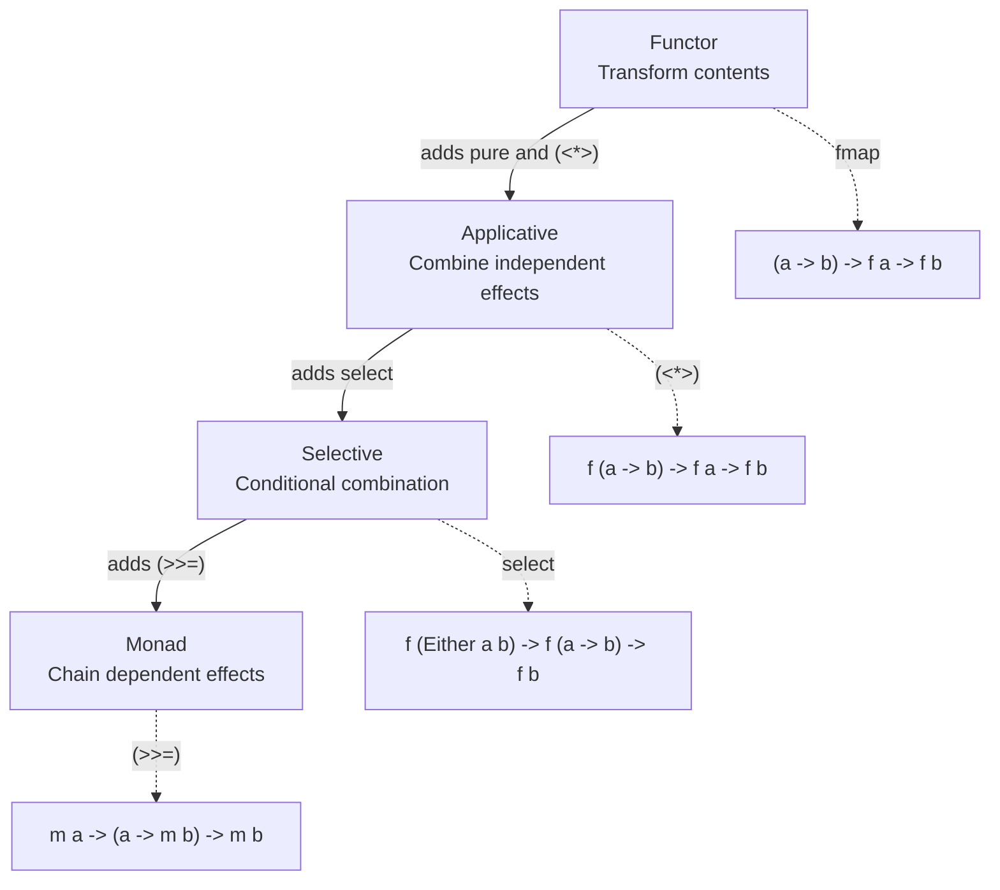

The practical reading is:

- `Functor` preserves shape while changing payloads
- `Applicative` models independent composition and therefore static parallel structure
- `Selective` models conditionals where the branches remain visible as values
- `Monad` models true data dependence where later structure depends on earlier results

Another way to say the same thing in less FP-heavy language is:

- `Functor`: "change the labels"
- `Applicative`: "combine work that is already known"
- `Selective`: "choose between known branches"
- `Monad`: "the later work itself depends on earlier results"

#### 6.1.1 Functor: Structure-Preserving Transformation

A `Functor` lets you transform the contents of a structure without changing the structure itself.

A useful mental model is a wrapper whose internal values can be transformed without changing the
wrapper's overall shape.

```haskell
class Functor f where
  fmap :: (a -> b) -> f a -> f b
```

Laws:

```haskell
fmap id = id
fmap (g . f) = fmap g . fmap f
```

Intuition: a functor is a context whose payload can be relabeled, normalized, or postprocessed while the outer shape stays fixed.

```haskell
fmap (+1) [1, 2, 3]
fmap length (Just "hello")
fmap normalize workflowOutput
```

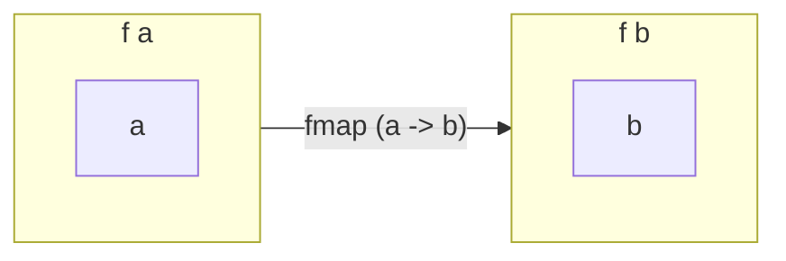

For compute DAGs, `Functor` corresponds to:

- relabeling outputs
- normalizing values
- changing result representations
- adding annotations without changing graph topology

It does **not** combine multiple effectful computations.

That limitation is why `Functor` is usually not enough to describe a whole compute graph by itself. It is mostly about shape-preserving transformation.

#### 6.1.2 Applicative: Independent Combination

An `Applicative` lets you combine multiple independent effectful computations. This is the key abstraction for visible parallelism.

For many engineers, this is the first really important abstraction in the document. If two pieces of work are independent and both are already known, applicative structure is often the cleanest way to model them.

```haskell
class Functor f => Applicative f where
  pure  :: a -> f a
  (<*>) :: f (a -> b) -> f a -> f b
```

Laws:

```haskell
pure id <*> v = v
pure (.) <*> u <*> v <*> w = u <*> (v <*> w)
pure f <*> pure x = pure (f x)
u <*> pure y = pure ($ y) <*> u
```

Example:

```haskell
liftA2 (,) (fetchShard shardA) (fetchShard shardB)
```

Both shard fetches are already known before `liftA2` runs. An interpreter can execute them simultaneously.

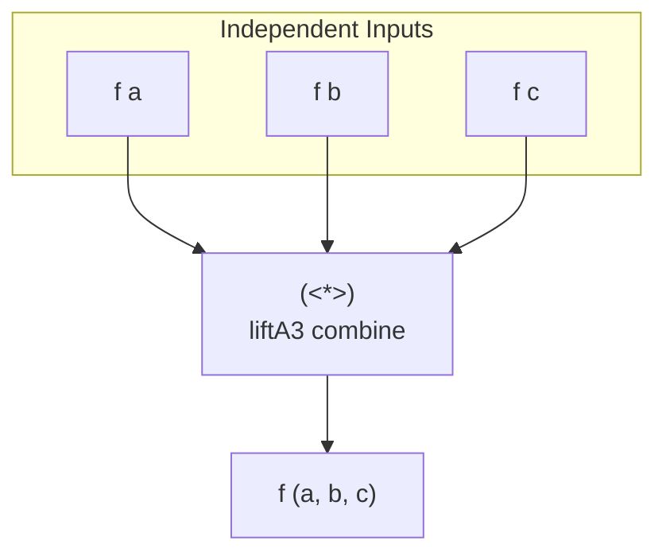

Why `Applicative` enables parallelism:

```haskell
(<*>) :: f (a -> b) -> f a -> f b
```

Both arguments are values. Neither depends on the runtime result of the other.

The key sentence about `Applicative` is:

> Applicative structure preserves independence that the runtime can exploit.

#### 6.1.3 Monad: Dependent Sequencing

A `Monad` lets you chain computations where later computations depend on the results of earlier ones.

This is why monads are so useful and so often misunderstood. They are not "bad for parallelism." They simply represent a different fact about the program: the later structure is not known yet.

```haskell
class Applicative m => Monad m where
  (>>=) :: m a -> (a -> m b) -> m b
```

Laws:

```haskell
return a >>= f = f a
m >>= return = m
(m >>= f) >>= g = m >>= (\x -> f x >>= g)
```

Intuition: the second argument is a **function**. You cannot even construct the rest of the computation until you know the earlier result.

```haskell
do
  shardPlan <- derivePlan input
  executePlan shardPlan
```

`executePlan` does not exist as a concrete computation until `derivePlan` returns.

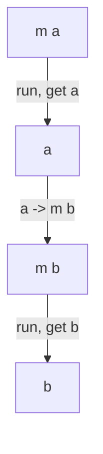

This is why monads are more expressive and more sequential.

That extra expressive power is necessary for many real workflows. The important mistake is only to use monadic structure everywhere, even where the work is actually independent.

#### 6.1.4 The Critical Distinction

```haskell
-- Applicative: both computations are known statically
(<*>) :: f (a -> b) -> f a -> f b

-- Monad: the second computation depends on the first result
(>>=) :: m a -> (a -> m b) -> m b
```

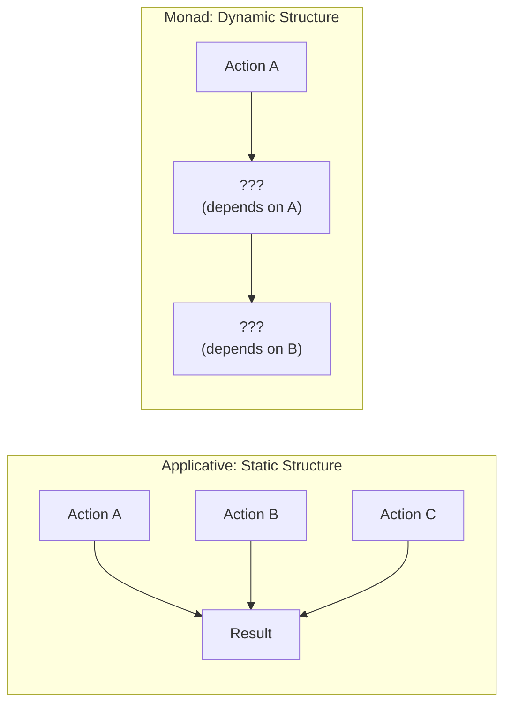

Only the monadic form forces a global sequential barrier. This is why "free modeling" should not be collapsed to "free monads". The spectrum matters.

For distributed systems, this distinction is operational:

- applicative regions are good candidates for batching, partitioning, and aggressive planning
- monadic regions are where true barriers, feedback loops, or adaptive control typically live

#### 6.1.5 The Fish Operator and Kleisli Composition

The fish operator `(>=>)` is composition for effectful functions.

`(>=>)` also reads like ordinary pipeline composition, which often makes the sequential structure
easier to see.

```haskell
(>=>) :: Monad m => (a -> m b) -> (b -> m c) -> (a -> m c)
(f >=> g) a = f a >>= g
```

A Kleisli arrow is a function of type `a -> m b`. It takes a pure value and returns an effectful result.

```haskell
fetchShard   :: ShardId -> Workflow Shard
normalize    :: Shard -> Workflow Shard
scoreShard   :: Shard -> Workflow Score

scorePipeline :: ShardId -> Workflow Score
scorePipeline = fetchShard >=> normalize >=> scoreShard
```


Kleisli composition is useful because it makes sequential pipelines explicit without pretending they are parallel.

### 6.2 What Makes a Free Structure "Free"?

The term "free" has a precise meaning. A free structure is the most general structure satisfying some laws, with no extra equations added.

That sentence is mathematically correct, but the practical reading is simpler:

> A free structure gives you a clean syntax tree for describing work before you decide how to run it.

The important practical point is this:

> Free modeling is a hierarchy. It is not synonymous with free monads.

For compute graphs, the useful spectrum is:

- free functor: structure-preserving relabeling and annotation
- free applicative: static independent composition
- free selective: inspectable conditional composition
- free monad: truly data-dependent continuation

From an ML-systems point of view, the main benefit of free modeling is inspectability. The
workflow remains data that the runtime can analyze.

#### 6.2.1 The Universal Property

A free structure gives you a syntax tree that can be interpreted into any target that supports the relevant algebra.

For a free monad:

```haskell
foldFree :: Monad m => (forall x. f x -> m x) -> Free f a -> m a
```

For a free applicative:

```haskell
runAp :: Applicative g => (forall x. f x -> g x) -> Ap f a -> g a
```

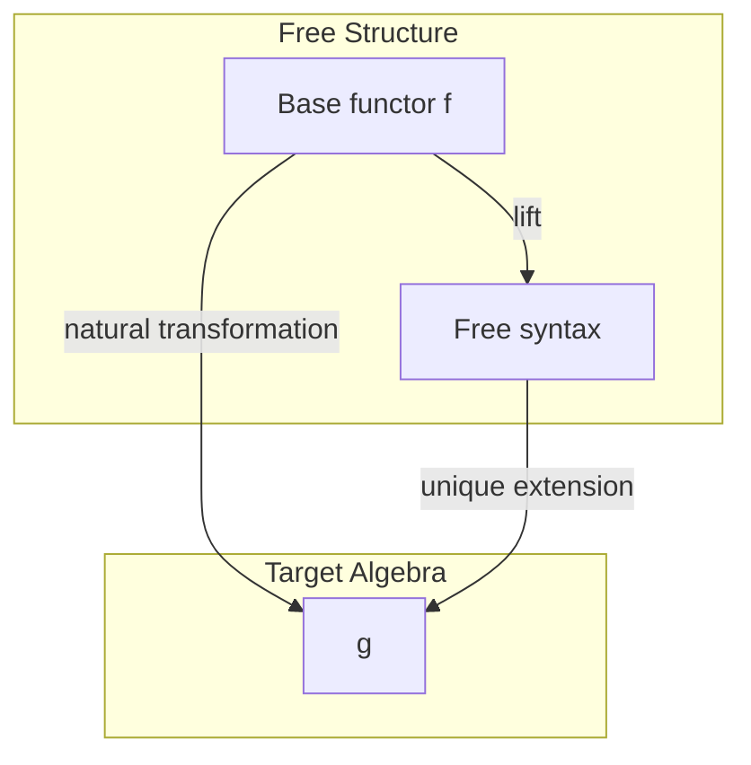

This is why free structures are useful for workflows. They separate description from interpretation.

#### 6.2.2 Free Monad: Syntax Trees for Dependent DSLs

The free monad is a syntax tree for monadic programs.

```haskell
data Free f a
  = Pure a
  | Free (f (Free f a))
```

Example:

```haskell
data ConsoleF a
  = PrintLine String a
  | ReadLine (String -> a)

type Console = Free ConsoleF
```

The important detail is the continuation in `ReadLine`:

```haskell
ReadLine (String -> a)
```

That function means the rest of the tree depends on runtime data.

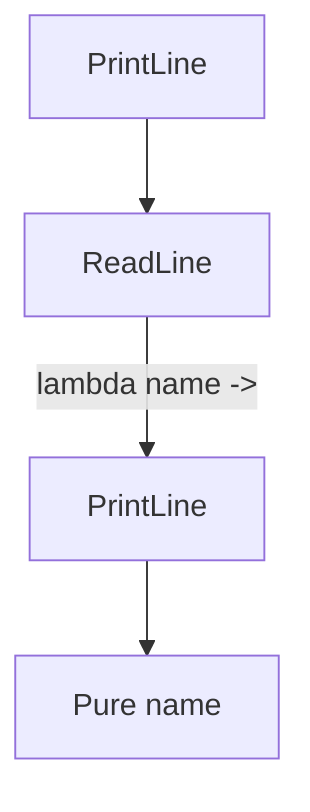

Free monads are excellent for:

- interactive protocols
- truly adaptive control flow
- workflows whose later structure depends on earlier results

They are restrictive only if you use them as the **only** modeling tool for a graph that is mostly parallel.

#### 6.2.3 Free Applicative: Syntax Trees That Preserve Independence

The free applicative preserves static applicative structure.

```haskell
data Ap f a where
  Pure :: a -> Ap f a
  Ap   :: f a -> Ap f (a -> b) -> Ap f b
```

Example:

```haskell
data FetchF a where
  Fetch :: URL -> FetchF ByteString

type Fetcher = Ap FetchF

fetch :: URL -> Fetcher ByteString
fetch url = liftAp (Fetch url)

fetchBoth :: Fetcher (ByteString, ByteString)
fetchBoth = (,) <$> fetch urlA <*> fetch urlB
```

Here the entire structure is visible statically.

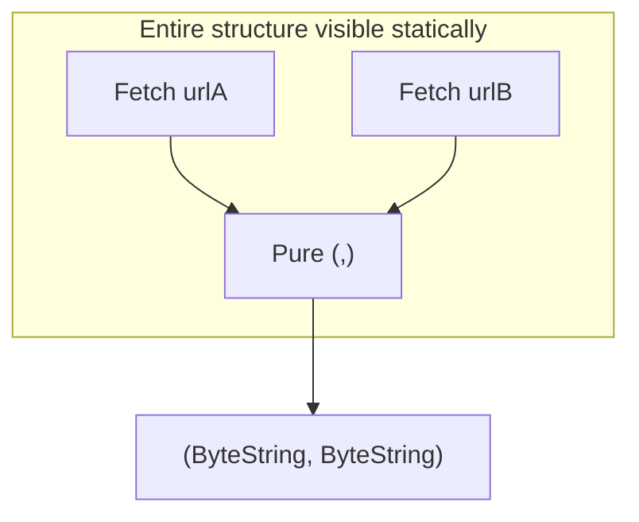

This is the right starting point for many compute DAGs because a large amount of distributed compute is "many independent nodes, then gather".

#### 6.2.4 Free Modeling Is a Spectrum

This is the key correction to an overly narrow reading of "free":

| Structure        | What it captures                          | Parallelism | Static visibility       |
| ---------------- | ----------------------------------------- | ----------- | ----------------------- |
| Free functor     | relabeling, annotation, result transforms | N/A         | full                    |
| Free applicative | independent regions of a graph            | full        | full                    |
| Free selective   | conditional regions with visible branches | partial     | substantial             |
| Free monad       | genuinely data-dependent continuation     | limited     | reduced after each bind |

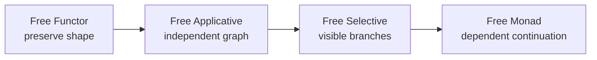

The practical lesson is simple: if a workflow is mostly independent, model most of it applicatively. Reserve monadic regions for actual dependency barriers.

That is the real reason this hierarchy is powerful. It lets one workflow mix:

- broad, parallel, highly inspectable regions
- smaller, adaptive, sequential regions

without pretending they are the same kind of computation.

#### 6.2.5 Why Free Modeling Matters for Compute DAGs

Free modeling gives us:

1. **Separation of concerns**. Describe graph structure without committing to one runtime.
1. **Multiple interpreters**. The same workflow can be run sequentially, in parallel, or across a cluster.
1. **Static analysis**. Before execution we can count operations, estimate cost, detect parallel regions, and derive cache keys.
1. **Determinism**. The structure that determines execution is itself data.

```haskell
countOperations :: Ap f a -> Int
countOperations (Pure _) = 0
countOperations (Ap _ rest) = 1 + countOperations rest
```

The same general story extends to richer graph types as long as the structure is inspectable.

#### 6.2.6 Compile-Time vs Runtime Optimization

It helps to separate two kinds of optimization:

- compile-time: GHC rewrites or specializes your program before it runs
- runtime: your interpreter inspects the workflow value and transforms the execution plan

Examples of compile-time optimization:

- `ApplicativeDo`
- inlining
- specialization
- rewrite rules

Examples of runtime optimization:

- grouping independent nodes into batches
- selecting a backend interpreter
- inspecting a free structure to derive parallel batches
- resource-aware scheduling

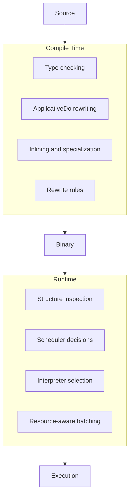

The right answer in practice is often a hybrid: use types and compile-time structure where possible, and use runtime analysis where flexibility matters.

### 6.3 Natural Transformations and Interpreters

A natural transformation is a structure-preserving map between functors.

```haskell
type (~>) f g = forall a. f a -> g a
```

For workflow systems, interpreters are natural transformations from a pure operation functor into some target effect.

```haskell
interpretIO :: WorkflowF ~> IO
interpretIO = ...

interpretPlan :: WorkflowF ~> ExecutionPlanF
interpretPlan = ...
```

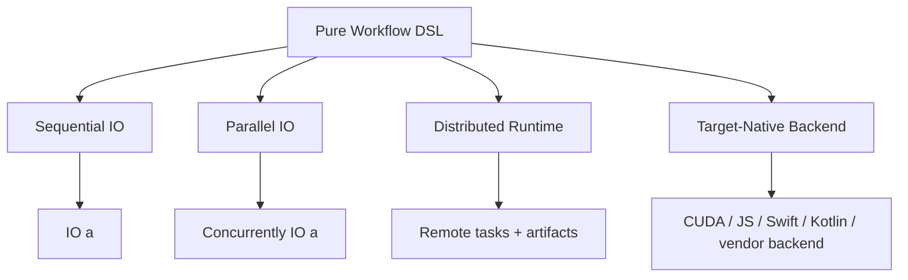

This is the point of keeping the workflow pure: the same structure can be retargeted without rewriting the workflow itself.

### 6.4 Selective Functors: Between Applicative and Monad

`Selective` sits between `Applicative` and `Monad`. It allows conditional execution while preserving more visible structure than a full monad.

```haskell
class Applicative f => Selective f where
  select :: f (Either a b) -> f (a -> b) -> f b
```

Why this matters:

- Applicative cannot short-circuit based on a computed condition
- Monad can short-circuit, but hides the future behind a lambda
- Selective lets both branches remain visible as values

```haskell
whenS :: Selective f => f Bool -> f () -> f ()
whenS cond action =
  ifS cond action (pure ())
```

A compute example:

```haskell
runExpensiveRefinement :: Selective Workflow => Workflow ()
runExpensiveRefinement =
  whenS (needsRefinement <$> quickHeuristic) expensivePass
```

`expensivePass` is visible in the structure even if it may not run.

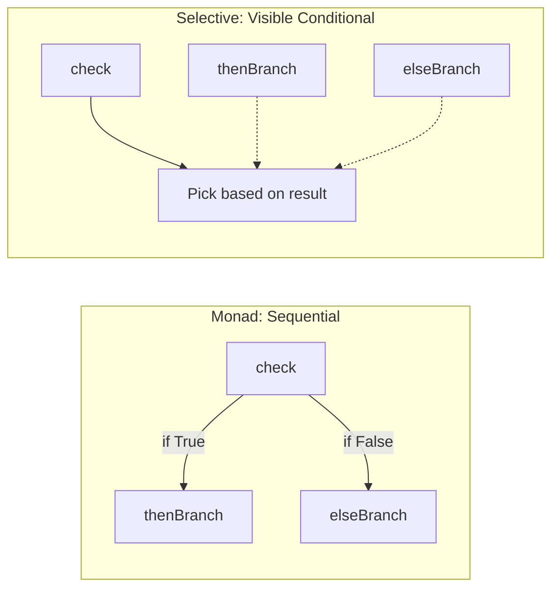

For ML systems, selective structure is useful for:

- fallback refinement passes
- validation gates
- optional expensive diagnostics
- speculative branches where visibility still matters

### 6.5 Traversable: The Bridge to Parallel Collection Processing

`Traversable` is the typeclass that turns "do something effectful to every element in this structure" into a reusable pattern.

```haskell
class (Functor t, Foldable t) => Traversable t where
  traverse :: Applicative f => (a -> f b) -> t a -> f (t b)
```

Why the `Applicative` constraint matters:

```haskell
traverse :: Applicative f => (a -> f b) -> t a -> f (t b)
```

The effects are independent. That is exactly why `traverse` can represent parallel batch execution.

```haskell
parallelFetch :: [URL] -> IO [Response]
parallelFetch urls =
  runConcurrently $ traverse (Concurrently . httpGet) urls
```

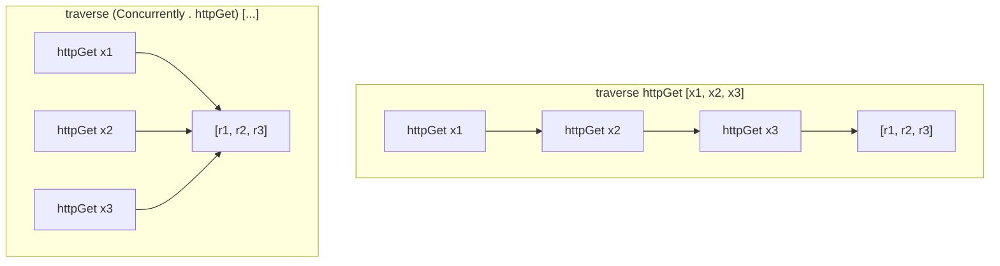

For compute DAGs, `Traversable` is the workhorse for:

- batches of independent nodes
- parameter sweeps
- Monte Carlo paths
- sharded training batches
- tile-wise tensor work

### 6.6 Yoneda and Codensity

The Yoneda idea is operationally useful because it explains how repeated `fmap` chains can be collapsed into one traversal.

```haskell
newtype Yoneda f a = Yoneda
  { runYoneda :: forall b. (a -> b) -> f b
  }
```

The practical optimization:

```haskell
slow = fmap h (fmap g (fmap f structure))

fast =
  lowerYoneda $
    fmap h $
      fmap g $
        fmap f $
          liftYoneda structure
```

Likewise, `Codensity` plays a similar role for monadic bind. You do not need the full proofs here. The practical point is:

- Yoneda explains how repeated functorial mapping can become one pass
- Codensity explains how deeply nested monadic structure can be reassociated more efficiently

For workflow systems, these constructions matter when the pure representation itself becomes large enough that manipulating the representation is nontrivial.

### 6.7 Mapping the Hierarchy to Compute Graphs

The hierarchy maps cleanly onto graph structure:

| Haskell concept   | Compute-graph reading                                                      |
| ----------------- | -------------------------------------------------------------------------- |
| `Functor`         | relabel or postprocess outputs without changing topology                   |
| `Applicative`     | independent nodes or layers that can run in parallel                       |
| `Selective`       | conditional regions where both branches are still visible to analysis      |
| `Monad` / Kleisli | true dependency barriers, adaptive scheduling, runtime-generated structure |
| `Traversable`     | run the same shape of work over a collection                               |
| free structures   | keep the graph as data so it can be inspected and interpreted              |

The takeaway is not "avoid monads". The takeaway is "use the weakest structure that correctly expresses the region you are modeling".

______________________________________________________________________

## 7. The Lift Pattern: From Pure DAG to Distributed Execution

Once the workflow exists as pure data, the runtime can lift it into different execution modes.

### 7.1 Interpreter Architecture

```haskell
data RuntimeMode
  = LocalSequential
  | LocalParallel
  | Distributed
  | TargetNative
  deriving (Eq, Show)

runWorkflow :: RuntimeMode -> RuntimeConfig -> WorkflowF a -> IO a
runWorkflow LocalSequential _   wf = runSequential wf
runWorkflow LocalParallel   _   wf = runParallel wf
runWorkflow Distributed     cfg wf = runDistributed cfg wf
runWorkflow TargetNative    cfg wf = runTargetNative cfg wf
```

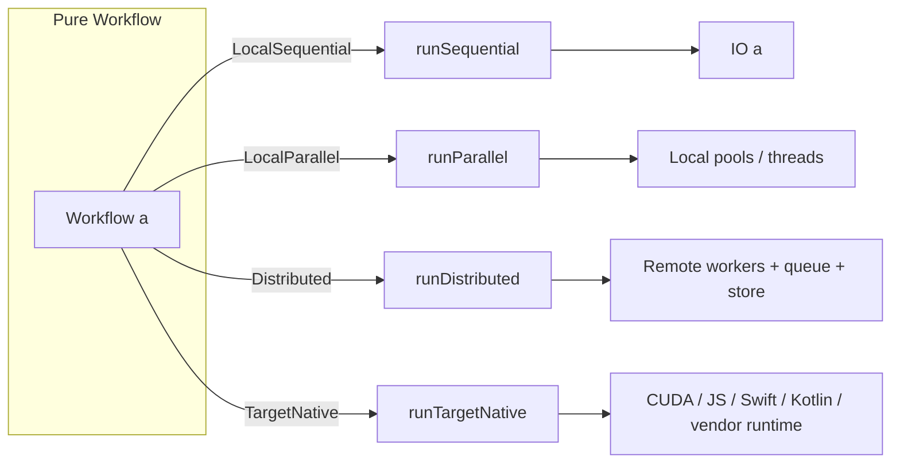

The workflow does not change. Only the interpreter changes.

### 7.2 Lifting Pipeline Stages

In practice, the runtime usually performs a pipeline such as:

1. validate the DAG
1. estimate resources and purity assumptions
1. expand partitionable nodes into scatter/gather subgraphs
1. derive cache keys and preflight memoization status
1. build a schedule
1. dispatch or lower into a target backend

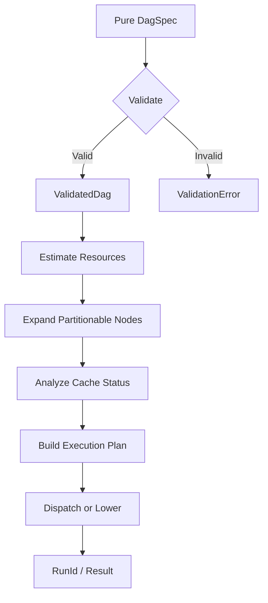

This is why keeping the graph pure matters. The planning phase can do a large amount of work before any side effects begin.

### 7.3 A Useful Hybrid

Most real systems use a hybrid strategy:

- static structure where possible
- runtime analysis where necessary

That usually means:

- use types and applicative structure to preserve obvious independence
- use free structures or inspectable graph values for runtime planning
- reserve monadic regions for true dependence

This is generally more robust than choosing either "everything static" or "everything dynamic".

______________________________________________________________________

## 8. Task Partitioning Algebra

Many pure compute nodes are logically one step but operationally many tasks. That is the role of scatter and gather.

### 8.1 Partition Strategy Types

```haskell
data PartitionStrategy
  = ChunkByCount Natural
  | ChunkByBytes Natural
  | ChunkByRows Natural
  | ChunkByTime Natural
  | ChunkByTiles TileShape
  | ChunkBySamples Natural
  | ChunkByParameterGrid [ParameterSlice]
  deriving (Eq, Show, Generic)

data PartitionSpec = PartitionSpec
  { partitionSourceNode :: NodeId
  , partitionStrategy   :: PartitionStrategy
  , partitionMinChunks  :: Natural
  , partitionMaxChunks  :: Natural
  }
  deriving (Eq, Show, Generic)
```

This covers a large fraction of distributed compute:

- row or tile sharding for tensors and matrices
- sample sharding for Monte Carlo
- batch sharding for training
- parameter sweeps for evaluation or search
- chunking for large media or scientific arrays

### 8.2 Gather Strategy Types

```haskell
data GatherStrategy
  = Concatenate
  | Merge MergeStrategyId
  | Reduce ReduceStrategyId
  | AllGather
  | CustomGather Text
  deriving (Eq, Show, Generic)

data GatherSpec = GatherSpec
  { gatherTargetNode   :: NodeId
  , gatherSourceChunks :: [ChunkId]
  , gatherStrategy     :: GatherStrategy
  }
  deriving (Eq, Show, Generic)
```

The gather node is just as important as the scatter. It names how independent results rejoin:

- concatenate files or batches
- reduce statistics
- merge tiled outputs
- aggregate gradients
- build summaries

### 8.3 Exploded Sub-DAG

The explosion transformation turns one logical node into a sub-DAG:

```haskell
data ExplodedSubDag = ExplodedSubDag
  { explodedScatterNode   :: NodeSpec
  , explodedWorkerNodes   :: [NodeSpec]
  , explodedGatherNode    :: NodeSpec
  , explodedInternalEdges :: [Edge]
  }
  deriving (Eq, Show, Generic)
```

```mermaid
flowchart LR
    subgraph Before["Original DAG"]
        F1[Input] --> S1[Compute]
        S1 --> P1[Persist]
    end

    subgraph After["Exploded DAG"]
        F2[Input] --> SC[Scatter]
        SC --> W1[Worker 0]
        SC --> W2[Worker 1]
        SC --> W3[Worker N]
        W1 --> G[Gather]
        W2 --> G
        W3 --> G
        G --> P2[Persist]
    end

    Before --> |"explodeNode"| After

```

### 8.4 A Monte Carlo / SDE Example

One good ML-shaped example is Monte Carlo simulation. The logical workflow is simple:

- draw seeds or path IDs
- simulate independent paths
- gather summary statistics

The operational graph is highly parallel.

```mermaid
flowchart TD
    INPUT["Seed Stream / Parameters"] --> SCATTER["Scatter Paths"]

    SCATTER --> P0["Path 0"]
    SCATTER --> P1["Path 1"]
    SCATTER --> P2["Path 2"]
    SCATTER --> PN["Path N"]

    P0 --> S0["SDE Worker 0"]
    P1 --> S1["SDE Worker 1"]
    P2 --> S2["SDE Worker 2"]
    PN --> SN["SDE Worker N"]

    S0 --> GATHER["Gather Statistics"]
    S1 --> GATHER
    S2 --> GATHER
    SN --> GATHER

    GATHER --> OUTPUT["Moments / Quantiles / Training Data"]

```

This is exactly the kind of region that should be modeled applicatively or traversably rather than monadically.

### 8.5 Deterministic Partitioning

Partitioning must be deterministic if you want reproducible cache keys.

That means the partition spec should be derived from:

- explicit input content addresses
- explicit partition rules
- explicit seed material
- explicit code or tool versions

If the partition changes, the cache key should change.

______________________________________________________________________

## 9. Content-Addressed Memoization

Large compute graphs benefit enormously from memoization. The whole point of purity is that it makes memoization principled.

### 9.1 Why Memoization Matters

Memoization provides:

1. fault tolerance
1. cost savings
1. incremental recomputation
1. deterministic reuse across runs
1. inspectable intermediate values for debugging

```mermaid
flowchart TD
    subgraph WithoutMemo["Without Memoization"]
        A1["Load Input"] --> B1["Expensive Compute"]
        B1 --> C1["Postprocess"]
        C1 --> D1["Output"]

        CRASH["Crash"] -.-> B1
        RESTART["Restart"] --> A1
    end

    subgraph WithMemo["With Content-Addressed Memoization"]
        A2["Load Input"] --> CHECK{"Cache lookup"}
        CHECK -->|"Miss"| B2["Expensive Compute"]
        CHECK -->|"Hit"| SKIP["Reuse cached artifact"]
        B2 --> STORE["Store result"]
        STORE --> C2["Postprocess"]
        SKIP --> C2
        C2 --> D2["Output"]
    end

```

### 9.2 Content-Addressed Storage

Content-addressed storage uses a hash of the content as the storage key.

```haskell
newtype ContentAddress = ContentAddress ByteString
  deriving (Eq, Ord, Show)

computeContentAddress :: ByteString -> ContentAddress
computeContentAddress = ContentAddress . sha256
```

If two computations produce identical outputs, they produce the same address. Deduplication falls out naturally.

### 9.3 Deriving Cache Keys from Pure Node Specs

Because the workflow is pure, the cache key can be derived from the things that determine the result:

- the operation or kernel identity
- the content addresses of the inputs
- the parameters
- the code or backend version
- explicit randomness or seed material

```haskell
data MemoKey = MemoKey
  { memoNodeId       :: NodeId
  , memoInputs       :: [ContentAddress]
  , memoParams       :: Map Text Text
  , memoVersion      :: Text
  , memoSeedMaterial :: Maybe ByteString
  }
  deriving (Eq, Show, Generic)

deriveCacheKey :: MemoKey -> ContentAddress
deriveCacheKey = computeContentAddress . encodeUtf8 . pack . show
```

The presence of `memoSeedMaterial` matters. Randomness is only memoizable if it is made explicit and deterministic.

### 9.4 The Lookup Flow

```haskell
executeWithMemo
  :: MemoStore
  -> NodeSpec
  -> [ArtifactRef]
  -> IO ArtifactRef
executeWithMemo store spec inputs = do
  inputAddrs <- mapM (resolveContentAddress store) inputs
  let key = deriveCacheKey $ MemoKey
        { memoNodeId = nodeId spec
        , memoInputs = sort inputAddrs
        , memoParams = nodeParams spec
        , memoVersion = nodeVersion spec
        , memoSeedMaterial = Nothing
        }
  memoLookupOrRun store key (runNode spec inputs)
```

```mermaid
sequenceDiagram
    participant Worker
    participant Store as Memo Store
    participant Artifact as Artifact Store
    participant Exec as Executor

    Worker->>Store: build MemoKey
    Store->>Store: derive cache key
    Store->>Artifact: lookup

    alt Cache hit
        Artifact-->>Store: artifact ref
        Store-->>Worker: reuse artifact
    else Cache miss
        Artifact-->>Store: not found
        Worker->>Exec: execute node
        Exec-->>Worker: bytes / artifact
        Worker->>Artifact: store under content address
    end
```

### 9.5 Chunked Memoization

Partitioned workflows benefit from chunk-aware cache keys.

```haskell
data ChunkMemoKey = ChunkMemoKey
  { chunkBaseKey :: MemoKey
  , chunkIndex   :: Natural
  , chunkBounds  :: (Natural, Natural)
  }
  deriving (Eq, Show, Generic)
```

This lets you:

- retry only failed chunks
- reuse unchanged shards
- parallelize uploads and downloads

The exact granularity is a design choice. Whole-input hashes are simple but coarse. Chunk-addressed inputs are finer-grained but more complex.

### 9.6 Memoization Requires Purity Assumptions

Memoization is only sound when the node is pure with respect to the modeled inputs.

That means:

- hidden clocks break determinism
- hidden randomness breaks determinism
- hidden environment dependencies break determinism
- unstable external services break determinism unless explicitly modeled

This is why effect descriptions, backend versions, seeds, and partition specs must be explicit if you want principled reuse.

______________________________________________________________________

## 10. Artifact Lifecycle and Retention Policies

Memoization is only half the story. You also need a principled answer to "what do we keep, and for how long?"

### 10.1 Artifact Categories

It helps to distinguish three kinds of outputs:

- final results
- memoized reusable intermediates
- ephemeral intermediates

```haskell
data ArtifactCategory
  = Result
  | Intermediate
  | Memoized
  deriving (Eq, Show)

newtype Artifact (cat :: ArtifactCategory) = Artifact
  { artifactAddress :: ContentAddress
  }
```

This distinction matters because retention policy should follow semantics, not convenience.

### 10.2 Node-Level Retention Annotations

```haskell
data TTL
  = TTLForever
  | TTLDays Natural
  | TTLRuns Natural
  deriving (Eq, Show, Generic)

data OutputRetention
  = RetainAsResult
  | RetainMemoized TTL
  | DeleteWhenUnused
  deriving (Eq, Show, Generic)
```

Each node should state what kind of output it produces:

- a final deliverable
- a reusable cached artifact
- a transient intermediate

### 10.3 Execution Modes

Different runs may want different caching behavior:

```haskell
data ExecutionMode
  = MemoizeAll
  | MemoizeForRun
  | DeleteAsYouGo
  | DryRun
  deriving (Eq, Show, Generic)
```

```mermaid
flowchart TD
    subgraph MemoizeAll["MemoizeAll"]
        MA1["Node A"] --> MA2["Node B"] --> MA3["Node C"]
        MA1 -.->|"Store"| S3A[("Store")]
        MA2 -.->|"Store"| S3A
        MA3 -.->|"Store"| S3A
        S3A -.->|"Visible to future runs"| FUTURE["Future runs"]
    end

    subgraph DeleteAsYouGo["DeleteAsYouGo"]
        DG1["Node A"] --> DG2["Node B"] --> DG3["Node C"]
        DG1 -.->|"Store"| S3D[("Store")]
        DG2 -->|"A no longer needed"| DEL1["Delete A"]
        DG3 -->|"B no longer needed"| DEL2["Delete B"]
    end

```

### 10.4 Run Results Should Account for Artifacts

```haskell
data RunResult a = RunResult
  { runValue       :: a
  , runArtifacts   :: ArtifactManifest
  , runCacheStats  :: CacheStatistics
  , runCleanupPlan :: CleanupPlan
  }
  deriving (Eq, Show, Generic)

data ArtifactManifest = ArtifactManifest
  { manifestResults       :: [Artifact 'Result]
  , manifestMemoized      :: [Artifact 'Memoized]
  , manifestIntermediates :: [Artifact 'Intermediate]
  }
  deriving (Eq, Show, Generic)
```

This forces the runtime to be explicit about what was produced, what was reused, and what is scheduled for deletion.

### 10.5 Delete-As-You-Go Requires Liveness Analysis

Aggressive cleanup is principled if it follows dependency liveness.

```haskell
data LivenessState = LivenessState
  { liveArtifacts  :: Map ContentAddress (Set NodeId)
  , completedNodes :: Set NodeId
  }
```

The idea is simple:

- if a stored artifact has no remaining downstream consumers
- and it is not marked as a result or memoized artifact
- it is eligible for deletion

```mermaid
sequenceDiagram
    participant A as Node A
    participant B as Node B
    participant C as Node C
    participant S as Store

    A->>S: Store addr_a
    B->>S: Read addr_a
    B->>S: Store addr_b
    B->>S: Delete addr_a
    C->>S: Read addr_b
    C->>S: Store addr_c
    C->>S: Delete addr_b
```

### 10.6 Cross-Run Memoization "Just Works"

When cache keys are derived from pure determinants, cross-run reuse needs no special case:

- same inputs plus same code version plus same parameters => same cache key
- any meaningful change => different cache key

There is no separate notion of "stale cache" if the modeled determinants are complete.

### 10.7 A Retention Policy DSL

For more expressive policies:

```haskell
data RetentionPolicy
  = KeepForever
  | KeepFor TTL
  | KeepWhile Condition
  | DeleteImmediately
  | RetentionPolicy :||: RetentionPolicy
  | RetentionPolicy :&&: RetentionPolicy
  deriving (Eq, Show, Generic)

data Condition
  = RunCountBelow Natural
  | StorageBelow Natural
  | AgeBelow NominalDiffTime
  | ReferencedByRun RunId
  deriving (Eq, Show, Generic)
```

This allows statements such as:

- keep checkpoints for 7 days
- keep Monte Carlo shards while active experiments reference them
- keep gradients only within the current run
- keep final reports forever

### 10.8 Garbage Collection Is a Purely Informed Side Effect

The GC action is effectful, but the eligibility decision should be derivable from:

- artifact metadata
- retention policy
- liveness
- explicit protections

That is the right division of labor: pure reasoning first, side effects second.

______________________________________________________________________

## 11. Resource Estimation from Pure Representation

A pure representation is also a good source for scheduling hints.

### 11.1 Resource Requirement Types

```haskell
data ResourceRequirements = ResourceRequirements
  { reqCpuMillicores :: Natural
  , reqMemoryMiB     :: Natural
  , reqAccelerators  :: [AcceleratorRequirement]
  , reqStorageGiB    :: Natural
  }
  deriving (Eq, Show, Generic)

data AcceleratorRequirement = AcceleratorRequirement
  { acceleratorKind  :: Text
  , acceleratorCount :: Natural
  }
  deriving (Eq, Show, Generic)
```

This deliberately stays generic. Real deployments may target:

- CPU pools
- GPU pools
- TPU or vendor inference devices
- FPGA bitstreams
- target-native runtimes where only a specific language or ABI is available

### 11.2 Estimation Flow

```mermaid
flowchart TD
    DAG["DagSpec"] --> NODES["Inspect Nodes"]
    NODES --> PROFILES["Attach Resource Profiles"]
    PROFILES --> BATCHES["Find Parallel Batches"]
    BATCHES --> PEAK["Peak Concurrent Requirement"]
    PEAK --> PLAN["Worker / backend plan"]

```

Because the graph is data, the scheduler can estimate:

- maximum visible parallelism
- peak resource demand
- critical path length
- backend affinity
- which nodes are partitionable

### 11.3 Backend Affinity

Even in a Haskell-centric architecture, nodes may need different realization strategies:

- run in the default host runtime
- call through a thin adapter to a required native backend
- lower a whole pure region to a target-native backend for deeper optimization

That does not change the pure graph. It changes the interpreter or lowering path.

______________________________________________________________________

## 12. Translating ML Workflows into This Language

This document is general, but the intended reader is often an ML engineer. Here is the practical translation.

### 12.1 Mini-Batch Training

A simple data-parallel training step usually looks like:

- fetch or materialize independent batches
- run forward and backward passes per shard
- gather gradients or updates
- apply a state update

Category-theoretically:

- per-shard work is usually `Applicative` or `Traversable`
- reduction is a gather or monoidal combine
- the optimizer state update is often the monadic barrier

```mermaid
flowchart TD
    A[Batch Source] --> B[Scatter Batches]
    B --> C1[Shard 0 Forward/Backward]
    B --> C2[Shard 1 Forward/Backward]
    B --> C3[Shard N Forward/Backward]
    C1 --> D[Gather Gradients]
    C2 --> D
    C3 --> D
    D --> E[Optimizer Step]
```

### 12.2 Monte Carlo and SDE Workloads

Monte Carlo path generation is an especially clean fit:

- path simulation is independent once seeds and parameters are explicit
- statistics gathering is a pure reduction
- memoization is safe if seeds and kernels are explicit in the key

This is a strong applicative or traversable region.

### 12.3 Adaptive or Curriculum Logic

When the workflow changes based on results:

- early stopping
- adaptive resampling
- branch-on-metric logic
- changing augmentation policy based on observed outcomes

you have entered `Selective` or `Monad` territory.

That is not a failure. It is the correct signal that the future graph depends on the present result.

### 12.4 Determinism in ML Terms

For memoization and reproducibility, purity means modeling the real determinants:

- dataset or artifact content addresses
- seed material
- kernel or backend version
- partitioning scheme
- numerical mode or precision policy

If those are explicit, a great deal of ML workflow infrastructure becomes principled instead of heuristic.

______________________________________________________________________

## 13. Working Rules

The core working rules are:

1. Model the workflow as pure data before choosing an execution strategy.
1. Do not treat "free modeling" as a synonym for "free monads". Use the whole hierarchy.
1. Use `Applicative` and `Traversable` wherever work is independent.
1. Use `Selective` when conditionals matter but branch visibility should be preserved.
1. Use `Monad` only where later structure genuinely depends on earlier results.
1. Make every determinant of execution explicit if you want principled memoization.
1. Make retention policy explicit if you want principled storage management.
1. Keep the graph inspectable so that planners, schedulers, and target-native lowerers can do real work.

The general picture is robust:

- pure description gives determinism
- the functor hierarchy gives a language for graph shape
- free modeling keeps the structure inspectable
- interpreters separate semantics from execution
- content-addressed memoization and explicit retention policies make distributed execution economical

That combination is strong enough to model a large fraction of real compute DAGs, including the ML-shaped ones that motivate much of this work.
