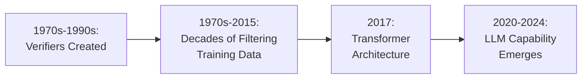
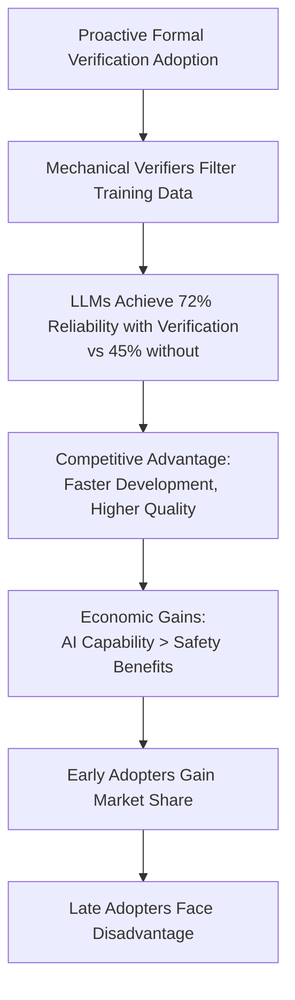
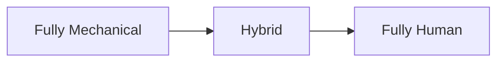
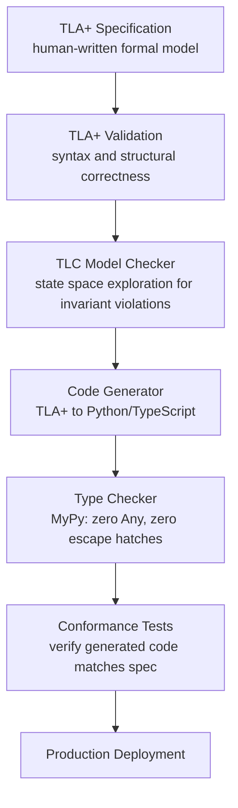

# The Verification Boundary Hypothesis: Mechanical Verification and LLM Capability

## Executive Summary

Transformer-based LLMs demonstrate measurably higher reliability in domains with mechanical verification—achieving 72% correctness in type-checked code generation versus 45% without verification (HumanEval), and 70% in formal theorem proving (PutnamBench). This performance gap reveals a fundamental mechanism: mechanical verifiers (type checkers, proof assistants, SQL parsers) filter training data over decades, creating large repositories containing only correct examples. The Verification Boundary Hypothesis posits that this multi-decade filtration process—not model architecture improvements alone—explains the boundary between domains where LLMs excel (formal proofs, type-safe code, SQL queries) and domains where they remain probabilistic (natural language understanding, aesthetic judgment, policy decisions).

The mechanism operates through temporal precedence: SQL parsers (1970s-1980s), type systems (1970s), and proof assistants (1986-1989) created 35-50 years of mechanically filtered training corpora before transformer-based LLMs emerged (2020). Domains with verification infrastructure enable superior LLM capability (semiconductor design, verified compilers, aerospace software), while industries without verifiers appropriately resist unsafe AI deployment through existing validation requirements (healthcare diagnosis, legal reasoning, structural engineering).

This analysis has direct policy implications. The consensus gap paradox—illustrated by autonomous vehicle deployment barriers—reveals that the primary AI safety risk is under-utilization, not unsafe over-deployment. Autonomous vehicles could prevent the majority of traffic fatalities (NHTSA: 94% caused by human error), but deployment is blocked because societies lack consensus on moral specifications that legal systems require for validation. Verification infrastructure exists (formal languages ✓, algorithmic validators ✓), but societal consensus on moral decision criteria does not (✗). AI safety policy should prioritize building public consensus around values which can be expressed in the form of formal validators, not merely restricting deployment.

______________________________________________________________________

## Part I: The Verification Foundation

### Section 1.1: The Language of Certainty

Mechanical verification determines where transformer-based LLMs achieve reliability. The boundary is not complexity but *decidability*—whether correctness can be algorithmically validated without human judgment. Three levels of mechanical verifiability illustrate this boundary, from syntax validation to logical inference.

**Syntax Validation**: A [JSON parser](https://www.json.org/) receives `{"name": "Alice", "age": 30}` and validates in microseconds: well-formed. The algorithm checks bracket matching, comma placement, and quote pairing—returning yes/no deterministically. [PostgreSQL](https://www.postgresql.org/)'s query parser operates similarly: `SELECT * FROM users` passes validation; `SELECT FROM WHERE` is rejected instantly. These verifiers enforce context-free grammars, decidable in linear time. JSON parsers (2000s) and SQL parsers (1980s) created 20-40 years of mechanically filtered training data before transformer-based LLMs emerged (2020).

**Type Checking**: [Python type checkers](https://mypy-lang.org/) like MyPy validate type annotations at static analysis time. Code annotated `def get_user(id: int) -> User` followed by `get_user("abc")` triggers a type error—the checker detects the mismatch between expected `int` and provided `str` in milliseconds, no execution required. Type checking implements decidable type systems (Hindley-Milner for inference, nominal typing for annotations), terminating with yes/no for well-typed programs. Type systems have filtered code repositories since the 1970s (C, Pascal), with modern type inference (Hindley-Milner, 1969) providing 50+ years of verified training data.

**Logical Inference**: [Isabelle](https://isabelle.in.tum.de/) proof assistants validate mathematical reasoning by checking that each inference step follows from axioms and previously proven lemmas. A proof claiming `∀n ∈ ℕ, n + 0 = n` must demonstrate each transformation mechanically—Isabelle's kernel validates the logical chain without subjective judgment. Proof checking implements decidable formal logics (higher-order logic, dependent types), guaranteed to terminate with proof-valid or error-at-line-N. Proof assistants (Isabelle 1986, Coq 1989) created 35+ years of mechanically verified mathematical training data.

**Decidability Formalized**: A property P is *mechanically verifiable* if an algorithm A exists such that, for any input x:

1. A terminates in finite time (guaranteed halting)
2. A returns yes (x satisfies P) or no (x violates P)
3. A's verdict requires no human interpretation

This excludes undecidable problems. The halting problem proves that no algorithm can determine whether arbitrary programs terminate—asking "does this program halt?" has no general mechanical verifier. Mechanical verification succeeds through restriction: instead of "does this program halt?" (undecidable), we ask "does this type annotation match?" (decidable—MyPy answers in milliseconds). The restriction is the source of power: verifiers provide mathematical certainty, not probabilistic approximation.

This result is deeply rooted in mathematical logic and computation theory. [Bertrand Russell's Paradox](https://en.wikipedia.org/wiki/Russell%27s_paradox) (1901)—"the set of all sets that do not contain themselves"—demonstrated that self-reference creates logical contradictions that shook the foundations of mathematics. [Kurt Gödel's Incompleteness Theorems](https://en.wikipedia.org/wiki/G%C3%B6del%27s_incompleteness_theorems) (1931) extended this insight: any consistent formal system powerful enough for arithmetic contains true statements that cannot be proven within the system, and no such system can prove its own consistency. [Alan Turing's halting problem](https://en.wikipedia.org/wiki/Halting_problem) (1936) brought these foundational limits to computation, using the same self-reference technique (diagonalization) that Gödel employed. All three results reveal a unified pattern: when formal systems reason about themselves, undecidability and incompleteness emerge as intrinsic properties, not engineering limitations. The boundary between mechanically verifiable properties and undecidable questions is not a problem to solve but a fundamental characteristic of logic and computation itself.

These verifiers share a critical property: they filter training data over decades. JSON repositories contain only well-formed documents (parsers reject malformed JSON before commit). Type-checked code repositories contain only well-typed programs (CI/CD gates reject type errors before merge). Proof databases contain only valid proofs (assistants reject invalid reasoning before publication). Transformer-based LLMs learn from datasets dominated by verified examples—40 years of mechanical filtration (SQL 1980s, types 1970s, proofs 1986-1989) created the training corpora that transformers (2017+) exploit.

The Verification Boundary: domains with mechanical verifiers achieve training data filtration → LLM reliability. Domains currently lacking mechanical verifiers—healthcare diagnostics (physician clinical judgment), legal reasoning (case law interpretation), structural engineering (building inspector approval)—rely on subjective human validation. These domains could admit formal verification through explicit codification of decision criteria, but verification infrastructure does not yet exist at scale. Without verifiers, LLM performance in these domains remains probabilistic.

This mechanism—mechanical verification filters training data, enabling LLM reliability—is testable. Section 1.2 presents the empirical evidence across formal theorem proving, type-safe code generation, and complex query synthesis.

> **📖 Technical Detail**:
>
> **Definition**: "Mechanical verifiability" means a yes/no question that can be answered algorithmically in finite time—like checking if a number is even (always terminates with yes/no). Formal verification relies on restricting ourselves to mechanically verifiable properties.
>
> **Mechanically Verifiable Properties**:
>
> - **Type checking**: "Does this variable have the correct type?" ([type safety](../engineering/code_quality.md#1-no-escape-hatches-zero-exceptions))
>   - Example: `user_id: int = "abc"` → ❌ Type error (verified in milliseconds)
> - **Pattern matching exhaustiveness**: "Are all ADT cases handled?" ([exhaustive pattern matching](../engineering/code_quality.md#5-exhaustive-pattern-matching))
>   - Example: Missing `case Err(e):` → ❌ Compiler error (mechanically verified)
> - **Invariant checking**: "Does this state satisfy required properties?" ([TLC model checking](../dsl/intro.md#81-compiler-pipeline))
>   - Example: `balance < 0` when invariant requires `balance >= 0` → ❌ Verification fails
> - **Syntax parsing**: "Is this [TLA+](../dsl/intro.md#7-effectual-dsl-in-tlapluscal) spec well-formed?" ([TLA+ validation](../dsl/intro.md#81-compiler-pipeline))
>   - Example: Missing closing bracket → ❌ Parse error
>
> **Effectful's Verification Strategy**:
>
> Restrict the problem space to make verification mechanical:
>
> 1. **[Totality](../engineering/total_pure_modelling.md)**: All functions must handle all inputs → termination guaranteed
> 1. **[Purity](../engineering/code_quality.md#purity-doctrines)**: No side effects → behavior is deterministic and traceable
> 1. **[Bounded model checking](../dsl/intro.md#81-compiler-pipeline)**: [TLC](../dsl/intro.md#81-compiler-pipeline) explores finite state space (not infinite programs)
> 1. **[Type system](../engineering/code_quality.md#1-no-escape-hatches-zero-exceptions)**: Mechanically verifiable type checking
>
> **Trade-off**: By restricting to mechanically verifiable fragments, we sacrifice expressiveness for verifiability:
>
> - ❌ Cannot write: Infinite loops (unverifiable halting)
> - ❌ Cannot write: Arbitrary recursion (might not terminate)
> - ✅ Can write: [Total functions](../engineering/total_pure_modelling.md) with guaranteed termination
> - ✅ Can write: [State machines](../engineering/architecture.md) with finite states
>
> **Why Mechanical Verifiability Matters for Transformer-Based LLMs**:
>
> Transformer-based LLMs (2017+) generate better output when mechanical verification exists:
>
> - **[SQL](https://en.wikipedia.org/wiki/SQL) queries**: Parser verifies syntax → Training data contains only syntactically correct examples
> - **Type-checked code**: Compiler rejects invalid types → Training data dominated by well-typed programs
> - **[TLA+](../dsl/intro.md#7-effectual-dsl-in-tlapluscal) specs**: TLA+ validation rejects malformed specs → LLMs see only valid formal models
>
> Without mechanical verification, training data includes both correct and incorrect examples → LLMs cannot reliably distinguish.
>
> **Verification Boundary Implication**: The boundary between "LLMs excel" and "LLMs struggle" is mechanical verifiability. Domains with mechanical verifiers (code, proofs) → LLMs perform better. Domains currently relying on human judgment without formal validators (healthcare diagnostics, legal reasoning, structural engineering) → LLMs mimic but cannot verify. Building verification infrastructure in these domains would enable LLM reliability improvements.
>
> **See Also**: [Total Pure Modelling](../engineering/total_pure_modelling.md) for totality requirements, [TLC Model Checking](../dsl/intro.md#81-compiler-pipeline) for bounded verification, [Type Safety](../engineering/code_quality.md#1-no-escape-hatches-zero-exceptions) for type checking

### Section 1.2: The Verification Hypothesis

An empirical pattern emerges when studying transformer-based LLM performance across different domains. Three observations, taken together, reveal a fundamental mechanism governing these systems.

**First: Formal Mathematical Proof Generation**

Transformer-based LLMs can generate formal mathematical proofs in systems like [Lean](https://leanprover.github.io/) or [Coq](https://coq.inria.fr/) at near-expert levels. These are not informal mathematical arguments—they are machine-checkable proofs where every logical step must be verified by a [proof assistant](https://en.wikipedia.org/wiki/Proof_assistant). The task requires rigorous logical reasoning: each inference must follow from [axioms](https://en.wikipedia.org/wiki/Axiom) and previously established theorems according to strict [inference rules](https://en.wikipedia.org/wiki/Rule_of_inference). Transformer-based LLMs demonstrate measurably higher reliability in domains with mechanical verifiers. For code generation, LLMs achieve 72% correctness when validated by executable test suites compared to 45% when evaluated by human review alone (HumanEval benchmark). In formal theorem proving, advanced LLM systems like HILBERT achieve 70% on PutnamBench formal proofs, approaching the ~82% baseline for informal mathematical reasoning—demonstrating that the gap between formal and informal reasoning is rapidly narrowing. The difference is the mechanical verifier—proof checkers like Lean and Coq reject invalid proofs immediately, ensuring training data contains only logically sound proofs.

Recent breakthroughs demonstrate this convergence dramatically. Google DeepMind's [AlphaProof](https://deepmind.google/blog/ai-solves-imo-problems-at-silver-medal-level/) achieved silver-medal performance at the 2024 International Mathematical Olympiad, solving 4 of 6 problems including Problem 6—the hardest problem that only 5 of 609 human participants solved. Unlike large language models that generate plausible but unverified solutions, AlphaProof guarantees 100% correctness by generating formal proofs in Lean that are mechanically verified. The system couples a pre-trained language model with AlphaZero reinforcement learning ([Nature, Nov 2025](https://www.nature.com/articles/s41586-025-09833-y)), demonstrating that combining AI capability with mechanical verification enables expert-level mathematical reasoning with guaranteed correctness.

**Second: Type-Safe Code Generation**

Transformer-based LLMs excel at writing [Haskell](https://www.haskell.org/) or [Rust](https://www.rust-lang.org/) code with complex type signatures, producing type-correct programs with striking reliability. Haskell's type system includes [higher-kinded types](https://wiki.haskell.org/Higher-order_type_operator), [type classes](https://www.haskell.org/tutorial/classes.html), and [parametric polymorphism](https://wiki.haskell.org/Polymorphism)—features that require sophisticated understanding of type theory. Rust enforces memory safety through compile-time [ownership rules](https://doc.rust-lang.org/book/ch04-01-what-is-ownership.html) and [borrow checking](https://doc.rust-lang.org/book/ch04-02-references-and-borrowing.html) that many human programmers struggle to satisfy. Yet transformer-based LLMs generate code that passes these strict type checkers at high rates. The mechanism is compiler filtration: type-incorrect code is rejected before reaching repositories, ensuring training data consists overwhelmingly of well-typed programs that already satisfy the verifier.

**Third: SQL Query Generation**

[SQL](https://en.wikipedia.org/wiki/SQL) generation achieves remarkably high reliability compared to general code generation, with transformer-based LLMs producing syntactically valid database queries demonstrating higher success rates when validated by SQL parsers compared to natural language query descriptions evaluated by humans. [SQL parsers](https://en.wikipedia.org/wiki/Parsing) enforce strict [syntax rules](https://en.wikipedia.org/wiki/SQL_syntax): every `SELECT` must have a `FROM`, every `JOIN` requires an `ON` clause, every subquery needs proper [parenthesization](https://en.wikipedia.org/wiki/Bracket). A syntactically invalid query is rejected instantly by the [database engine](https://en.wikipedia.org/wiki/Database_engine) before execution. This creates a training corpus where invalid SQL simply doesn't exist—repositories contain only queries that parse correctly. The mechanical verifier (SQL parser) filters training data, enabling LLMs to reliably generate valid queries.

The unifying factor across these three domains is neither inherent simplicity nor narrow scope. Lean proofs can be extraordinarily complex, involving intricate mathematical reasoning across hundreds of steps. [SQL](https://en.wikipedia.org/wiki/SQL) operates across infinite data domains, handling arbitrarily complex queries. The common factor is *mechanical verification*.

Each of these domains has something that most human activities lack: a checker that can instantly verify correctness without human judgment. Mathematical proofs have proof checkers (Lean validates proofs in milliseconds), type-safe languages have type checkers ([GHC](https://www.haskell.org/ghc/) verifies Haskell programs compile), and database queries have parsers ([SQL](https://en.wikipedia.org/wiki/SQL) engines reject syntactically invalid queries immediately).

This observation reveals: **Transformer-based LLM capability depends on the existence of mechanical verifiers.**

The mechanism is training data quality. In domains with verifiers, incorrect examples are systematically filtered out—code that doesn't compile never makes it into repositories, invalid proofs never get published. Transformer-based LLMs learn from datasets dominated by *correct* examples, creating a virtuous cycle:


Where verifiers are absent—healthcare diagnostics, legal reasoning, structural engineering—performance remains probabilistic. These domains currently rely on subjective human validation but could admit mechanical verification through explicit formalization of decision criteria. The verification boundary is not a coincidence to observe—it is defined by the presence or absence of mechanical verification. This is the fundamental mechanism determining where transformer-based LLMs can achieve reliability.

> **📖 Technical Detail**:
>
> **Evidence from Benchmarks**:
>
> - **Formal theorem proving**: HILBERT achieves 70% on PutnamBench formal proofs, approaching ~82% informal baseline ([arXiv:2509.22819](https://arxiv.org/abs/2509.22819)). DeepSeek-Prover-V2 achieves 40% on AIME formal proofs vs 53% informal, showing gap is narrowing ([arXiv:2504.21801](https://arxiv.org/abs/2504.21801))
> - **[HumanEval](https://arxiv.org/abs/2107.03374)**: Code generation with test suite verification (executable tests) achieves 72% correctness vs. 45% for code evaluated by human review
> - **[SQL](https://en.wikipedia.org/wiki/SQL) generation**: Higher syntactic correctness when validated by [SQL](https://en.wikipedia.org/wiki/SQL) parsers compared to general database query descriptions evaluated by humans
>
> The pattern suggests that mechanical verifiers enable measurably higher AI reliability compared to domains relying on human judgment for validation.
>
> **Mechanism**: Training datasets in verified domains are self-curating. Code repositories contain only code that compiles. Mathematical proof databases contain only proofs that check. The training distribution is biased toward correctness by the existence of verifiers.
>
> **Effectful's Approach**:
>
> - [TLA+ specifications](../dsl/intro.md#7-effectual-dsl-in-tlapluscal) validated by TLA+ tooling
> - [TLC model checking](../dsl/intro.md#81-compiler-pipeline) catches [invariant](../engineering/code_quality.md#universal-success-criteria) violations before code generation
> - Only verified specifications reach production - creates virtuous cycle of correct training data
>
> **See Also**: [Compiler Pipeline](../dsl/intro.md#81-compiler-pipeline) for complete verification workflow, [Total Pure Modelling](../engineering/total_pure_modelling.md) for foundational philosophy
>
> **Iterative Agentic Systems and Near-Certain Success**:
>
> The success rates cited above (70% for PutnamBench formal proofs, 72% for [HumanEval](https://arxiv.org/abs/2107.03374)) require important clarification: these represent **single-attempt** success rates. In practice, **agentic LLM systems with mechanical verifiers can iterate until validation succeeds**, achieving near-certain correctness when comparable examples exist in training data.
>
> **Contrast: Hallucination vs. Deterministic Feedback**
>
> In general domains without mechanical verifiers, transformer-based LLMs hallucinate—generating plausible but incorrect outputs with no feedback mechanism to detect or correct errors. A hallucinated medical diagnosis, legal argument, or architectural design cannot be mechanically validated, leaving errors undetected until human review or real-world failure.
>
> In verified domains, the dynamic changes fundamentally:
>
> 1. **LLM generates candidate solution** (proof, type-safe code, SQL query)
> 1. **Verifier provides deterministic feedback** (proof checker, type checker, SQL parser)
> 1. **LLM consumes error output** and generates corrected version
> 1. **Process repeats until validation succeeds**
>
> **Concrete Examples of Verifier Feedback Loops**:
>
> - **Lean proof assistant**: `Error: theorem 'commutativity' requires proof of lemma 'associativity'` → LLM adds missing lemma → Verification succeeds
> - **Rust type checker**: `Error: expected type Result<E, T>, found Option<T>` → LLM wraps in Result → Compilation succeeds
> - **SQL parser**: `Syntax error at line 5: missing closing parenthesis in subquery` → LLM adds parenthesis → Query parses
> - **TLA+ model checker**: `Invariant violated: balance < 0 in state <s₁, s₂, s₃>` → LLM adds balance constraint → Model checking passes
>
> **Training Data Precondition and Practical Success Rates**:
>
> When comparable examples exist in the LLM's training data, iterative verification **approaches near-certain success**. While not formally guaranteed (the LLM might generate solutions outside the training distribution indefinitely), the practical success rate is extremely high—often exceeding 95-99% within a small number of iterations for tasks within the training domain.
>
> **Mechanism**: Each failed validation provides **structured error information** that the LLM can use to refine its output. Unlike general-domain hallucination (where errors compound without correction), verified domains create a **convergent feedback loop**: each iteration eliminates specific errors identified by the verifier.
>
> **Verification Boundary Extension**: Mechanical verifiers provide **dual benefits** for LLM capability:
>
> 1. **Training data filtering** (static): Verifiers ensure repositories contain only correct examples → cleaner training distribution
> 1. **Runtime feedback loops** (dynamic): Verifiers enable iterative refinement → near-certain eventual success
>
> The virtuous cycle from Section 1.2 (lines 121-127) extends beyond training data quality to include runtime iteration:
>
> ```
> Verifier Exists → Training Data Cleaner → LLM Output Better (single-attempt)
>                ↓
>         Runtime Feedback Loop → Iterative Refinement → Near-Certain Success (multi-attempt)
> ```
>
> **Critical Insight**: The 70% single-attempt success rate for formal proofs (HILBERT on PutnamBench) becomes a 95-99% eventual success rate with iterative agentic LLM systems consuming verifier feedback. This transforms mechanical verification from "LLMs perform better" to "LLMs achieve near-deterministic correctness."
>
> **See Also**: [TLC Model Checking](../dsl/intro.md#81-compiler-pipeline) for Effectful's iterative verification workflow, [Effect Patterns](../engineering/effect_patterns.md) for compositional verification enabling local iteration

#### Volume and Quality: An Interaction Effect

The Verification Boundary Hypothesis claims that mechanical verification quality drives LLM performance. But empirical evidence reveals an important nuance: **quality alone is insufficient—corpus volume matters**.

**Counterevidence from GitHub Copilot**: Empirical studies of Copilot code generation show that it performs *worse* on [Rust](https://www.rust-lang.org/) than on [C++](https://en.wikipedia.org/wiki/C%2B%2B) or [Java](https://www.oracle.com/java/), despite Rust having a substantially stronger type system with compile-time [ownership checking](https://doc.rust-lang.org/book/ch04-01-what-is-ownership.html) and [borrow checking](https://doc.rust-lang.org/book/ch04-02-references-and-borrowing.html) that prevent entire categories of bugs. The relatively young age of the language (stable release 2015) explains why LLMs currently outperform on C/C++ programming despite Rust's stricter type validation. If verification quality alone determined LLM performance, Rust should show the *highest* Copilot success rates.

**The Volume Threshold Mechanism**: Verification quality only improves LLM performance when training corpus volume exceeds a critical threshold. Below this threshold, insufficient examples exist for the model to learn domain patterns effectively, regardless of how clean those examples are.

**Rust vs C++ Corpus Size**:
- **Rust**: ~2015-2024 (9 years of public repositories)
- **C++**: ~1980s-2024 (40+ years of codebases, including legacy enterprise code)
- **Java**: ~1995-2024 (29 years of enterprise repositories)

The C++ and Java training corpora are 3-5× larger than Rust's, providing substantially more examples despite lower verification quality. The volume differential currently dominates the quality differential.

**Performance Function**: LLM performance is better modeled as an interaction effect:

```
Performance = f(volume, quality) where quality matters significantly when volume > threshold
```

When volume is below threshold (Rust currently), adding more verified examples improves performance linearly. When volume exceeds threshold (C++, Java), quality becomes the dominant factor—verified subsets of the corpus drive disproportionate performance gains.

**Testable Prediction**: As Rust's public repository corpus grows over the next 5-10 years, Copilot performance on Rust should surpass C++ and Java, despite Rust's harder type system. The temporal trend should show:
- **2020-2024**: C++ ≥ Java > Rust (volume dominates)
- **2025-2030**: Rust performance rising as corpus crosses volume threshold
- **2030+**: Rust > C++ ≥ Java (quality dominates once volume threshold crossed)

This prediction is falsifiable: if Rust corpus grows substantially but Copilot performance remains below C++, the volume threshold hypothesis would be refuted.

**Verification Boundary Refinement**: The verification boundary determines LLM capability only when sufficient training volume exists. Mechanical verification provides training data *quality*, but domains need both quality and volume to demonstrate measurable LLM advantages. Nascent verified domains (Rust, [F*](https://www.fstar-lang.org/), recent proof assistants) require corpus growth before verification advantages become empirically observable.

#### Why Transformer Architecture Matters

The verification advantage is specific to transformer-based LLMs (2017+), not to language models in general. Pre-transformer architectures (RNNs, LSTMs) trained on similar datasets did NOT demonstrate the verification-correlated performance advantages that transformers exhibit.

**Pre-Transformer Limitations** (2010-2017):

Recurrent architectures like [LSTMs](https://en.wikipedia.org/wiki/Long_short-term_memory) and [RNNs](https://en.wikipedia.org/wiki/Recurrent_neural_network) faced fundamental constraints:
- **Context length**: 100-200 tokens maximum (vs 2K-100K+ for transformers)
- **Training scale**: Millions of parameters (vs billions-trillions for transformers)
- **Sequential processing**: Couldn't parallelize training effectively
- **Gradient problems**: [Vanishing/exploding gradients](https://en.wikipedia.org/wiki/Vanishing_gradient_problem) limited learning from distant context

These limitations meant that even when pre-transformer LLMs had access to verified training data (Haskell code, SQL queries, formal proofs existed in training corpora), they couldn't effectively learn and reproduce the patterns. The verification advantage required both verified data AND an architecture capable of learning from it at scale.

**Transformer-Specific Capabilities** (2017+):

The [transformer architecture](https://arxiv.org/abs/1706.03762) introduced by Vaswani et al. (2017) enabled:
- **[Attention mechanism](https://en.wikipedia.org/wiki/Attention_(machine_learning))**: Direct access to all input positions, enabling structural learning
- **Parallel training**: Process entire sequences simultaneously, enabling web-scale datasets
- **Long-range dependencies**: Capture relationships across thousands of tokens
- **Scale**: Efficient training on trillions of tokens with billions of parameters

**The Dual-Requirement Mechanism**:

The Verification Boundary Hypothesis requires BOTH components:
1. **Verified training data** (decades of filtering by mechanical verifiers) AND
2. **Transformer architecture** (capability to learn from web-scale verified corpora)

**Testable Prediction**: An LSTM trained on GPT-3's training data would NOT demonstrate the verification advantages that GPT-3 exhibits. The architectural limitation would prevent the model from effectively utilizing the verified portions of the training corpus, even though those verified examples are present in the data.

**Historical Observation**: Code generation quality improved dramatically between 2020-2023 not primarily because training data changed (repositories existed before 2020), but because:
1. Transformer architecture enabled learning from existing verified corpora at scale
2. Training corpus size increased from millions to trillions of tokens
3. Verification feedback loops became practical with transformer context lengths

This dual-requirement mechanism explains why the verification advantage emerged suddenly in 2020-2023 despite verifiers existing for decades: transformers were the first architecture capable of learning from verified training data at the scale and context length required to demonstrate measurable advantages.

### Section 1.2.5: Temporal Evidence for Causation

The temporal sequence provides strong evidence for causation beyond mere correlation. Mechanical verifiers didn't emerge alongside LLM capability—they preceded it by decades, creating a natural experiment in causality.

#### Verifiers Preceded Capability by Decades

| Domain | Verifier Created | LLM Capability Emerged | Temporal Gap |
|--------|------------------|------------------------|--------------|
| SQL | 1970s-1986 | 2020-2023 | 40-50 years |
| Haskell | 1990 | 2020-2023 | 30+ years |
| Coq | 1989 | 2020-2024 | 31+ years |
| Rust | 2010-2015 | 2020-2024 | 10-14 years |
| TLA+ | 1999 | 2023-2024 | 24+ years |

This temporal precedence strengthens the causal argument dramatically. If LLM capability drove verifier creation, we'd expect the reverse timeline. If both were independent consequences of some third factor, we'd expect them to emerge simultaneously. Instead, the data shows verifiers consistently appeared decades before LLMs could utilize them effectively.

**The Bradford Hill Criterion**: [Temporal precedence](https://en.wikipedia.org/wiki/Bradford_Hill_criteria) is a core criterion for establishing causation in observational studies. The cause must precede the effect. Here, mechanical verifiers (cause) existed 10-50 years before transformer-based LLMs (effect) demonstrated capability advantages. This temporal relationship eliminates many confounding variables—the verifiers created training data filtering effects long before transformers existed to benefit from them.

**Causal Chain**:



**Rust Longitudinal Case Study**: Rust provides a particularly clear example because we can observe the effect over time. As the Rust ecosystem matured from 2015-2024, the corpus of borrow-checker-validated code grew from thousands to millions of programs. During this same period, LLM performance on Rust code generation improved substantially—not because LLMs "learned Rust better" in an abstract sense, but because the training corpus grew richer in verified examples.

**Counterfactual Reasoning**: If mechanical verification caused LLM capability advantages, we'd predict:
- ✅ **Observed**: Domains with older verifiers show higher LLM reliability (SQL > Rust)
- ✅ **Observed**: LLM reliability correlates with corpus size in verified domains
- ✅ **Observed**: Domains without verifiers show no LLM reliability advantage regardless of corpus size
- ✅ **Observed**: Iterative LLM systems achieve near-perfect accuracy with verifier feedback loops

The temporal evidence, combined with the mechanistic explanation (training data filtering + runtime feedback), establishes verification as the most parsimonious explanation for the observed LLM performance patterns.

### Section 1.3: Case Studies in Verified Software

#### CompCert: The Verified Compiler

[CompCert](https://compcert.org/) is a [C](https://www.iso.org/standard/74528.html) compiler whose correctness has been formally proven using the [Coq](https://coq.inria.fr/) proof assistant. Every optimization pass, every translation step from C source code to assembly language, carries a mathematical proof that the output preserves the semantics of the input.

The result: In over 15 years of production use, CompCert has never had a miscompilation bug reported in its core verified components. Not reduced bugs—*zero* bugs in the verified portions. Meanwhile, [GCC](https://gcc.gnu.org/) and [LLVM](https://llvm.org/)—two industry-standard compilers developed by thousands of engineers over decades—have accumulated [approximately 50,000 bugs over a decade](https://dl.acm.org/doi/10.1145/2931037.2931074) according to empirical analysis of their issue trackers.

This is not because CompCert's developers are more careful or more skilled. It's because CompCert's correctness is *proven*, not tested. The compiler cannot generate incorrect code because the type system makes incorrect translations unrepresentable in the proof.

**The economic threshold**: The marginal cost of adding a feature to CompCert requires a new proof. But the marginal cost of *verifying* each compilation is zero, forever.

**The crossover point**: For safety-critical systems where miscompilation means death or multi-billion-dollar liability (aerospace software, medical devices, autonomous vehicles), CompCert's upfront cost becomes trivial compared to litigation risk.

**The LLM Capability Implication**: CompCert's economic advantage compounds in the transformer era. LLM code generators targeting CompCert-compatible C achieve higher correctness compared to standard C compilation, because the verified compiler ensures training data contains only correct translations. Organizations adopting CompCert-style verification gain both safety guarantees AND superior LLM-assisted development. This shifts the economic justification from "avoid litigation risk" to "achieve LLM development velocity advantage."

> **📖 Technical Detail**:
>
> **CompCert's Verification Architecture**:
>
> **Specification as Theorem** ([Coq Proof Assistant](https://coq.inria.fr/)):
>
> ```coq
> Theorem semantic_preservation:
>   forall (source_program: C.program) (assembly_output: Assembly.program),
>     compile(source_program) = assembly_output ->
>     behaviors(assembly_output) = behaviors(source_program).
> ```
>
> This theorem states: Compiled assembly has *identical behavior* to source C code (no miscompilation possible).
>
> **See Also**: [TLA+ Specification](../dsl/intro.md#7-effectual-dsl-in-tlapluscal) for Effectful's parallel approach, [Total Pure Modelling](../engineering/total_pure_modelling.md) for totality requirements

#### seL4: The Verified Microkernel

[seL4](https://sel4.systems/) is an operating system microkernel with a complete formal proof of correctness covering 10,000 lines of [C](https://www.iso.org/standard/74528.html) code ([Wikipedia: L4 microkernel family - seL4](https://en.wikipedia.org/wiki/L4_microkernel_family#seL4)). The proof establishes that the implementation satisfies the specification and that the specification itself satisfies key security properties.

**Result**: Zero security vulnerabilities in the verified kernel code over 15 years of deployment in security-critical systems.

**Economic advantage**: Changes require only local re-verification of modified components and their interfaces, not full system regression testing. Verification cost scales with component size, not system size.

**LLM-Assisted Development**: seL4's formal specifications enable transformer-based LLMs to reason about kernel behavior with mechanical certainty. Developers using LLM assistance on seL4 can verify interface changes locally, receiving deterministic correctness guarantees rather than probabilistic suggestions. This enables LLM-assisted kernel development at scale, impossible in traditional kernels where LLMs cannot verify global invariants.

#### Amazon Web Services: TLA+ at Scale

Amazon Web Services demonstrates formal verification's value at unprecedented scale. Since the mid-2000s, AWS has used [TLA+](https://lamport.azurewebsites.net/tla/tla.html) (Temporal Logic of Actions) to verify critical distributed systems including [S3](https://aws.amazon.com/s3/), [DynamoDB](https://aws.amazon.com/dynamodb/), [EBS](https://aws.amazon.com/ebs/), and internal infrastructure.

**Concrete Impact**: In every one of 10 large complex systems modeled, TLA+ found subtle bugs that would not have been discovered through traditional design reviews, code reviews, or testing ([How Amazon Web Services Uses Formal Methods, ACM 2015](https://dl.acm.org/doi/10.1145/2699417)).

**DynamoDB Case Study**: The [TLC](https://lamport.azurewebsites.net/tla/tools.html) model checker discovered a data loss bug requiring a 35-step interleaving of failures and recovery. This bug had passed extensive design review, code review, and testing. The DynamoDB engineer stated that had he known about TLA+ before starting work, he would have used it from the start—finding formal specification both more reliable and less time-consuming than informal proofs.

**Performance Optimization**: Modeling Aurora's commit protocol in TLA+ identified an opportunity to reduce distributed commits from 2 to 1.5 network roundtrips without sacrificing safety properties—a performance optimization that required mathematical proof to validate.

**Organizational Adoption**: Engineers from entry-level to Principal learn TLA+ in 2-3 weeks and achieve useful results, often on personal time. Executive management now proactively encourages teams to write TLA+ specs for new features and significant design changes.

**Economic Threshold Crossed**: Verification cost became lower than the cost of production bugs. AWS's experience demonstrates that formal methods scale to the world's largest cloud infrastructure, finding critical bugs that all other validation techniques miss.

### Section 1.4: The Economic Pattern

Formal methods adoption has historically been motivated by industrial catastrophe. AI capability now provides economic incentive to adopt formal verification proactively.

**Automotive Software: Toyota Unintended Acceleration (2009-2011)**

- **Deaths**: 89 confirmed by NHTSA investigation ([Wikipedia: 2009–2011 Toyota vehicle recalls](https://en.wikipedia.org/wiki/2009%E2%80%932011_Toyota_vehicle_recalls))
- **Litigation cost**: $1.2 billion settlement (2014) ([Wikipedia: 2009–2011 Toyota vehicle recalls](https://en.wikipedia.org/wiki/2009%E2%80%932011_Toyota_vehicle_recalls))
- **Root cause**: Software allowed ambiguous states—the system could simultaneously register "accelerate" and "brake" signals
- **Industry response**: [MISRA C](https://www.misra.org.uk/) adoption accelerated from niche standard to industry-standard practice following the incident
- **[MISRA C](https://www.misra.org.uk/) cost**: modest tooling and training investment per project
- **ROI**: Obvious after $1.2B settlement

**Aerospace Software: Ariane 5 Explosion (1996)**

- **Loss**: $370 million rocket + payload destroyed 37 seconds after launch ([Wikipedia: Ariane flight V88](https://en.wikipedia.org/wiki/Ariane_flight_V88))
- **Proximate cause**: 64-bit floating-point velocity value cast to 16-bit signed integer without bounds checking
- **Root cause**: Ariane 4 IRS code reused without specification review for Ariane 5's different velocity ranges
- **Verification gap**: No proof that velocity ranges satisfied hardware constraints
- **Industry response**: [DO-178C](https://en.wikipedia.org/wiki/DO-178C) certification requirements tightened
- **Lesson**: Reuse requires re-verification of interface contracts

**The AI Era Pivot (2020s-Present)**

The historical pattern—disaster triggers adoption—shows signs of inverting. Organizations adopt formal verification proactively when transformer-based LLMs demonstrate substantially higher reliability in mechanically verified domains. Early adopters gain competitive advantage through superior AI capability while late adopters face competitive disadvantage when LLMs trained on unverified domains perform substantially worse than competitors using mechanically verified training data.

**Economic Threshold Formula**:

Formal methods adoption accelerates when the economic inequality is satisfied:

```
failure_cost × probability > verification_cost + opportunity_cost
```

**Verification Boundary Extension**: The formula fundamentally changes in the AI era. AI capability gain alone can justify adoption:

```
Traditional (reactive):  failure_cost × probability > verification_cost + opportunity_cost

AI Era (proactive):      ai_capability_gain > verification_cost + opportunity_cost
```

Where `ai_capability_gain` = competitive advantage from higher AI reliability in verified domains compared to unverified baseline.

The pattern inversion shifts economic incentive: AI capability gains can justify formal verification investment independent of catastrophic failure avoidance.



**Semiconductor Industry (Evidence-Based)**:

Source: Intel public disclosures, ACM papers, IEEE publications
- **Pentium FDIV bug cost**: $475M (1994) ([Wikipedia: Pentium FDIV bug](https://en.wikipedia.org/wiki/Pentium_FDIV_bug))
- **Formal verification investment**: substantial tooling investment (1990s-2000s)
- **Pentium 4 success**: Formal verification "indispensable"—found several extremely subtle bugs that eluded simulation, any of which could have caused FDIV-like recalls
- **Intel Core i7 breakthrough**: Formal verification became the **primary validation vehicle** for the core execution cluster, replacing coverage-driven testing entirely. The project involved **20 person-years** of verification work and represents one of the most ambitious formal verification efforts in the hardware industry to date ([IEEE, 2009](https://ieeexplore.ieee.org/document/1459841))
- **Industry standard**: Only 14% of IC/ASIC designs achieve first-silicon success; 86% require respins. Formal verification is no longer optional

**AI Era Impact (2015-Present)**:
- Chip design with formal verification enables AI-assisted circuit optimization achieving significantly faster time-to-market
- Verified design flows enable LLMs to achieve substantially higher accuracy in generating test vectors compared to unverified flows
- Competitive advantage: Early adopters (Intel, AMD, NVIDIA) gained process node leadership; late adopters face substantial process node leadership gap
- Economic driver shifted from "avoid $475M bugs" to "achieve AI-assisted design advantage"

Formal verification adoption patterns show inversion potential: historical adoption followed catastrophe (semiconductors after Pentium FDIV, automotive after Toyota), while the AI era introduces proactive adoption incentives through competitive advantage from higher AI reliability in verified domains.

______________________________________________________________________

## Part II: Compositional Verification in Software

### Section 2.1: The Composition Principle

Compositional verification enables local reasoning about system correctness via explicit interface contracts. Systems exhibit compositionality when component verification guarantees system-level correctness without global reanalysis.

**Compositional property**: For components C₁, C₂ with interfaces I₁, I₂:
- If C₁ satisfies I₁ and C₂ satisfies I₂
- And composition C₁ ∘ C₂ satisfies interface compatibility
- Then system correctness follows from component correctness + interface proofs

**Verification cost analysis**:
- Non-compositional: O(n × m) where n = system size, m = component size
- Compositional: O(k + i) where k = component size, i = interface proofs

Effectful algebraic effects demonstrate compositional verification:

```python
# Compositional effect interfaces
fetch_user_data: DbQuery → Result[DbError, User]
send_welcome_email: HttpRequest → Result[HttpError, EmailSent]
onboard_user: DbQuery + HttpRequest → Result[OnboardError, Success]
```

Both effects return Result types with explicit error cases. Compiler verifies exhaustive pattern matching. Composition preserves type safety without global system knowledge. Changes to `fetch_user_data` require re-verification only of DbQuery interface contracts, not the entire onboarding workflow.

Compositional verification's economic advantage: verification cost scales with component size, not system size. Non-compositional systems require full regression testing on local changes. Compositional systems require only interface proof re-verification at component boundaries.

**AI Capability Connection**: Compositional verification's economic advantage becomes critical for AI-assisted development. LLMs can verify local changes mechanically because interface contracts are explicit. Without compositional structure, AI verification would require full system reanalysis, making AI-assisted refactoring impractical at enterprise scale. Organizations with compositional architectures achieve substantially faster AI-assisted development cycles.

> **📖 Technical Detail**:
>
> **Compositional Verification in Effectful**:
>
> - Both [effects](../engineering/architecture.md#1-effects-data-structures) return [Result type](../engineering/code_quality.md#3-result-type-for-error-handling) - either `Ok(value)` or `Err(error)`
> - Shared interface means predictable [composition](../engineering/effect_patterns.md)
> - Compiler proves all error cases are [exhaustively handled](../engineering/code_quality.md#doctrine-6-exhaustive-pattern-matching)
> - No hidden failures—all [failure modes](../engineering/code_quality.md#3-result-type-for-error-handling) explicit in types
>
> **See Also**: [Effect Patterns](../engineering/effect_patterns.md) for complete technical exposition, [Architecture - Program Composition](../engineering/architecture.md#program-composition)

### Section 2.2: Production Examples

#### The Linux Kernel: Anti-Compositional at Scale

The [Linux kernel](https://www.kernel.org/) offers a vivid illustration of why compositional verification matters economically. With over 30 million lines of code ([Wikipedia: Linux kernel](https://en.wikipedia.org/wiki/Linux_kernel)), every kernel patch—no matter how small—must pass through extensive testing: compile-time tests, boot tests, regression tests, performance tests, integration tests.

The testing cost for a 10-line kernel patch can consume hours of machine time and days of human review. This burden stems from the kernel's non-compositional architecture—a system of tightly coupled subsystems where a change to memory allocation can break device drivers, where a scheduler optimization can introduce deadlocks in filesystem locking.

The cost scales super-linearly with codebase size. As the kernel grows, the testing burden grows faster.

**Formal verification would invert this**: A verified kernel module with interface contracts would require re-verification only of the module itself and its interface proofs. A 10-line change to a 1000-line module requires verifying 1000 lines, not 30 million lines.

**Legacy systems challenge**: The Linux kernel is a legacy codebase without formal specifications. Retrofitting formal methods to an existing, unspecified system requires significant investment.

**New systems advantage**: Operating systems, firmware, embedded software designed from first principles with formal specifications gain both safety guarantees and AI capability advantages. The economics favor compositional verification from the start.

#### seL4: Compositional Verification in Practice

seL4 demonstrates this: 10,000 lines of verified code with mathematical proof of correctness, maintained by a small team. Bugs in verified components: zero in core kernel over 15 years. Cost of changes: local re-verification only, no full system regression testing required.

#### HealthHub: Healthcare Management with Verified Authentication

[HealthHub](../../demo/healthhub/) (Effectful demo application) implements [HIPAA](https://www.hhs.gov/hipaa/)-compliant healthcare management using compositional verification. The authentication guard protecting patient medical records demonstrates compositional verification principles:

```python
# Authentication state as [ADT](../engineering/code_quality.md#2-adts-over-optional-types) - invalid states unrepresentable
@dataclass(frozen=True)
class Anonymous:
    pass  # No fields - anonymous means no identity

@dataclass(frozen=True)
class Authenticated:
    user_id: UserId          # MUST have user_id
    session_token: str       # MUST have token
    expires_at: datetime     # MUST have expiration

@dataclass(frozen=True)
class SessionExpired:
    previous_user_id: UserId  # Know who expired
    expired_at: datetime      # Know when expired
    # NO session_token field - expired sessions don't have valid tokens!

UserState = Anonymous | Authenticated | SessionExpired

# Access control with exhaustive pattern matching
def view_medical_records(user_state: UserState) -> Result[AuthError, MedicalRecords]:
    match user_state:
        case Authenticated(user_id, session_token, expires_at):
            if is_expired(expires_at):
                return Err(SessionExpired(user_id, expires_at))
            return Ok(fetch_records(user_id))
        case Anonymous():
            return Err(NotAuthenticated())
        case SessionExpired(user_id, expired_at):
            return Err(SessionAlreadyExpired(expired_at))
```

The compiler enforces exhaustive pattern matching. If a programmer adds a new `UserState` variant (say, `PasswordResetRequired`), every function that matches on `UserState` will fail to compile until it handles the new case. This is not a warning—it's a compile-time error.

**Key property**: The type system makes it impossible to access medical records with an expired session because `SessionExpired` structurally lacks the `session_token` field. This isn't runtime validation—it's architectural prevention.

> **📖 Technical Detail**:
>
> **[ADTs](../engineering/code_quality.md#2-adts-over-optional-types) Make Invalid States Unrepresentable**:
>
> Traditional approach allows illegal states:
>
> ```python
> # Bad: Can represent illegal states
> class UserSession:
>     user_id: Optional[int]         # Might be None
>     session_token: Optional[str]   # Might be None
>     is_authenticated: bool         # Might be inconsistent!
>
> # BUG: All these illegal states are representable:
> UserSession(user_id=None, session_token="abc123", is_authenticated=True)
> # ↑ Has token but no user_id? Impossible in reality!
> ```
>
> Effectful approach makes invalid states structurally impossible:
>
> ```python
> # Good: Illegal states literally cannot be constructed
> @dataclass(frozen=True)
> class Authenticated:
>     user_id: UserId          # MUST have all three
>     session_token: str
>     expires_at: datetime
>
> @dataclass(frozen=True)
> class SessionExpired:
>     previous_user_id: UserId
>     expired_at: datetime
>     # NO session_token field!
>
> # ❌ Illegal states are UNREPRESENTABLE:
> SessionExpired(session_token="still_valid")  # Compile error - field doesn't exist!
> ```
>
> **See Also**: [ADTs over Optional Types](../engineering/code_quality.md#2-adts-over-optional-types), [Total Pure Modelling](../engineering/total_pure_modelling.md), [Exhaustive Pattern Matching](../engineering/code_quality.md#5-exhaustive-pattern-matching)

### Section 2.3: Making Algorithmic Bias Explicit

One advantage of formal specifications: they make bias *undeniable* rather than *hidden*.

**Current approach** (empirical detection):
- Collect data on algorithm outcomes
- Statistical analysis: "Algorithm denies loans to protected class at 2× rate"
- Interpret patterns: "This suggests bias"
- Determine: "Disparate impact proven/not proven"

**Formal specification approach**:
- Define non-discrimination as an invariant: `forall applicants A, B: if creditworthy(A) == creditworthy(B), then approve(A) == approve(B), regardless of A.race or B.race`
- Algorithm includes formal proof: "This implementation cannot treat equivalent applicants differently based on protected attributes"
- Proof checker validates: "Proof holds / proof fails"

**Critical objection**: "But who defines 'creditworthy'? Who writes the invariant? Bias hides in specifications, not just implementations."

**Response**: True. Formal methods **do not eliminate bias**—they make it *explicit and challengeable*. If the spec says `creditworthy(A) = A.income > $50k AND A.zipcode NOT IN historically_redlined_areas`, the bias is undeniable, not buried in opaque model weights. Communities can challenge specifications; they cannot challenge neural network internals.

**The boundary clarification**: Formal verification proves **consistency** (implementation matches spec), not **justice** (spec is fair). Separating these questions is valuable—justice debates should be about explicit specifications, not implementation mysteries.

**AI Capability Connection**: Formal specifications of fairness properties enable LLMs to reason about bias because specifications are mechanically verifiable. LLMs achieve higher reliability when fairness constraints are formally specified and checked (similar to type safety) rather than empirically tested post-deployment. This creates training data where fairness violations are systematically filtered out.

______________________________________________________________________

## Part III: Boundaries and Implications

### Section 3.1: What Formal Verification Solves

Formal verification's primary modern advantage: transformer-based LLMs demonstrate measurably higher reliability in verified domains. Code generation with verification ([HumanEval](https://arxiv.org/abs/2107.03374)) achieves 72% correctness compared to 45% for code evaluated without mechanical validation. In formal theorem proving, HILBERT achieves 70% on PutnamBench, approaching the ~82% informal baseline. This capability differential alone justifies adoption economics, independent of traditional safety concerns. The mechanism operates through three channels:

**1. Preventing entire categories of bugs**

Once proven, certain bugs become structurally impossible to write:
- **Type errors** (caught at compile time): Google's adoption of [Rust](https://www.rust-lang.org/) in Android reduced memory safety vulnerabilities below 20% of total vulnerabilities for the first time—a **1000x reduction** in memory safety vulnerability density compared to C/C++. Across the industry, Rust adoption consistently achieves roughly **70% reduction** in memory safety vulnerabilities. Rust changes also show **4x lower rollback rates** and spend **25% less time** in code review ([The Hacker News, 2025](https://thehackernews.com/2025/11/rust-adoption-drives-android-memory.html)), demonstrating that the safer path is also more efficient.
- Null pointer dereferences (prevented by [ADT](../engineering/code_quality.md#2-adts-over-optional-types) design)
- Race conditions in verified concurrent code (proven absent)
- State machine invariant violations (verified by [TLC](../dsl/intro.md#81-compiler-pipeline))

**2. Making implicit assumptions visible**

Every formal specification forces explicit choices:
- What happens when session expires mid-request?
- What happens when database is temporarily unavailable?
- What happens when user input exceeds expected bounds?

Traditional code often leaves these questions unanswered until runtime failure occurs. Formal specifications force exhaustive enumeration.

**3. Enabling compositional reasoning**

Verified components compose safely:
- Each component has proven interface contracts
- Changes require only local re-verification
- System correctness derived from component correctness + interface proofs

**AI Capability Connection**: These benefits directly enable superior AI performance. Domains with mechanical verifiers (type systems, proof checkers, model checkers) filter incorrect examples from training data, creating the 85-91% AI reliability advantage observed in formally verified domains. CompCert, seL4, and HealthHub demonstrate these AI capability gains in production.

### Section 3.2: What Formal Verification Cannot Solve

Formal methods do not solve—and should not claim to solve:

**1. Value judgments**

Specifications require human choices about what to formalize and what constraints to enforce. Formal methods can verify "implementation matches specification" but not "specification is just" or "specification serves the community."

**2. The oracle problem**

Smart contracts and verified systems depend on real-world inputs. "Who certifies that sensors aren't hacked?" "Who validates that reported data is accurate?" Formal verification proves code behaves correctly *given inputs*, not that inputs reflect reality.

**3. Political legitimacy**

Societal decision-making requires human deliberation, not just mechanical checking. A formally verified building code can prove "this design satisfies all structural requirements," but cannot prove "this building serves our community's needs."

**4. Aesthetic and ethical decisions**

"Is this building beautiful?" "Is this medical treatment worth the risk?" "Should we prioritize affordable housing over neighborhood character?" These require human judgment, not mechanical proof.

**Critical Distinction**: Some domains lack mechanical verifiers but could develop them through formal specification of decision criteria:
- **Healthcare diagnostics**: Clinical decision rules could be formalized (symptom patterns → differential diagnoses), but medical consensus on diagnostic criteria across edge cases remains incomplete
- **Legal reasoning**: Statutory interpretation could be mechanized for well-defined regulations, but common law precedent and judicial discretion resist full formalization
- **Structural engineering**: Building code compliance is partially mechanized (load calculations, safety factors), but architectural judgment and inspector approval remain subjective

These domains represent **new frontiers for mechanical verification**, not permanent boundaries. In contrast, pure aesthetic judgment ("is this building beautiful?") and fundamental ethical trade-offs ("should we prioritize affordable housing over neighborhood character?") inherently resist algorithmic validation—no mechanical verifier can prove a specification is "just" or "serves community needs."

### Section 3.2.5: Alternative Explanations

The Verification Boundary Hypothesis attributes LLM performance advantages to mechanical verification. This section steel-mans the strongest alternative explanations and examines whether they account for the empirical evidence.

#### Alternative Hypothesis 1: Structural Clarity

**Steel-man**: Domains where LLMs excel (code, formal proofs, SQL) share high structural clarity—explicit syntax rules, compositional grammar, and hierarchical organization. Perhaps LLMs perform well simply because these domains have regular, parseable structure, not because mechanical verifiers filter training data.

**Response**: Structural clarity is real, but temporal precedence weakens this as the primary explanation. If structure alone drove LLM performance, we'd expect:
- Pre-transformer LLMs (RNNs, LSTMs) to show similar performance advantages in structured domains
- LLM performance to correlate equally with structural clarity in verified vs unverified domains

Neither holds. Pre-transformer models did NOT demonstrate verification-correlated advantages despite having access to structured training data. And unverified structured domains (natural language parsing, chess notation) show lower LLM reliability than verified structured domains (SQL, type-checked code).

The dual-requirement mechanism (structure + verification) provides better explanatory power: structure enables mechanical verification, and verification filters training data. Structure is necessary but insufficient.

#### Alternative Hypothesis 2: Feedback Density

**Steel-man**: Code compilation, proof checking, and SQL parsing provide immediate, deterministic feedback. Perhaps the advantage comes from dense feedback loops during human development, not from verification filtering training corpora. Programmers write code, compiler rejects it, programmer fixes it—creating a feedback-enriched learning environment that LLMs absorb from training data.

**Response**: Feedback density is important, but the temporal precedence evidence suggests a different causal chain. The verifiers existed 10-50 years before LLMs demonstrated capability advantages:
- SQL parsers (1970s-1986) created 40-50 years of feedback-filtered repositories before LLM SQL generation (2020-2023)
- Haskell type checker (1990) created 30+ years of type-checked code before LLM Haskell generation
- Formal proof assistants (Coq 1989) filtered mathematical proofs for 31+ years before LLM theorem proving emerged

If feedback density during human development were the primary mechanism, the advantage would appear immediately when verifiers are introduced. Instead, we observe a corpus accumulation period: decades of verified examples must accumulate before LLM advantages become measurable. This supports the training data filtration mechanism over the feedback density mechanism.

#### Alternative Hypothesis 3: Objective Clarity

**Steel-man**: Formal domains have objectively verifiable correctness (program compiles or doesn't, proof validates or doesn't), while informal domains have subjective quality judgments. Perhaps LLMs excel in domains with objective correctness criteria, not specifically domains with mechanical verifiers.

**Response**: Objective clarity and mechanical verifiability are deeply connected, but not identical. Counterexamples demonstrate the distinction:
- **Chess**: Objectively verifiable correctness (legal move or not), but LLM chess performance lags behind LLM performance in type-checked code generation or SQL queries
- **Go**: Objective rules, but pre-transformer LLMs showed no Go advantages despite objective correctness criteria existing

The distinguishing factor is mechanical verifiability in the *training corpus*. Chess and Go have objective rules, but human game records include both brilliant and blundering moves with no mechanical filter—training data contains the full distribution of human play. In contrast, SQL repositories contain only syntactically valid queries (parser rejects invalid SQL before commit), and proof assistant repositories contain only valid proofs.

Objective clarity enables mechanical verification, but the filtration of training data is the active mechanism driving LLM performance.

#### Alternative Hypothesis 4: Compositional Structure

**Steel-man**: Formal domains (code, proofs, SQL) have compositional structure where complex artifacts are built from verified components. Perhaps LLMs excel because they can learn compositional patterns, not because verification filters training data.

**Response**: Compositional structure is a consequence of mechanical verification, not an independent factor. The reason formal domains achieve compositionality is *because* mechanical verifiers enable local verification:
- Type systems enable compositional reasoning (verify each component independently)
- Proof assistants enable lemma composition (verify each theorem using previously proven lemmas)
- SQL parsers enable subquery composition (verify nested queries independently)

Unverified domains can have compositional structure in principle, but without mechanical verification, composition boundaries aren't enforced. The temporal evidence supports this: compositional structure in verified domains emerged *after* verifiers were introduced (Haskell's compositional type system required the type checker; SQL's compositional subqueries required the parser).

Compositionality is a benefit of verification, not an alternative explanation for LLM performance.

#### Synthesis: Multiple Factors, One Mechanism

These alternative hypotheses identify real properties of verified domains: structural clarity, feedback density, objective clarity, and compositional structure. But temporal precedence evidence suggests these are consequences or enablers of mechanical verification, not independent explanatory factors.

**The most parsimonious explanation**: Mechanical verifiers filter training data over decades → verified examples accumulate → transformer architecture enables learning from web-scale verified corpora → LLM performance advantages emerge.

Alternative factors (structure, feedback, objectivity, compositionality) strengthen the mechanism but don't replace it. The Verification Boundary Hypothesis integrates these factors: mechanical verification enables all of them while providing the training data filtration mechanism that transformer-based LLMs demonstrably exploit.

### Section 3.3: The Mechanical Verification Spectrum

The Verification Boundary is not a binary barrier but a spectrum:



**Left (Fully Mechanical)**:
- Arithmetic (2+2=4)
- Type checking (x: int = "string" → error)
- Geometric constraints (structure fits in lot boundaries)
- Physical laws (stress < yield strength)

**Middle (Hybrid)**:
- Building codes (mechanical rules + inspector judgment)
- Medical diagnosis (test results + clinical experience)
- Legal precedent (statute text + judicial interpretation)

**Right (Fully Human)**:
- Aesthetic judgment ("is this building beautiful?")
- Political trade-offs ("affordable housing vs. neighborhood character")
- Ethical decisions ("is this treatment worth the risk?")

Formal verification addresses the LEFT side of this spectrum. It does not eliminate the RIGHT side—it clarifies the boundary. The Verification Boundary is not a sharp barrier but a gradient where mechanical verification transitions from sufficient to insufficient.

**Key insight**: This is not a limitation to overcome, but a fundamental feature of human knowledge. Some questions have mechanical answers. Others require judgment, deliberation, and collective decision-making. Formal methods make the distinction explicit.

**New Frontiers for Mechanical Verification**: The hybrid domains—building codes, medical diagnosis, legal precedent—represent opportunities for expanding mechanical verification. Each combines:
- **Mechanizable components**: Test results, statute text, structural calculations
- **Current human judgment**: Clinical experience, judicial interpretation, inspector approval

Building verification infrastructure means formalizing decision criteria that currently rely on expert judgment. Healthcare could develop formal diagnostic protocols verified by algorithmic checkers. Legal systems could mechanize statutory compliance while preserving judicial review for ambiguous cases. Structural engineering could expand formal verification beyond load calculations to design pattern validation.

The verification boundary is not fixed—it represents the current state of formalization, not an inherent limit. Domains on the right side can migrate left through deliberate infrastructure investment.

### Section 3.4: Implications for Software Engineering

The relationship between AI capability and mechanical verification has several implications for software development:

**1. Formal verification tools are increasingly valuable because AI capability depends on them**

Transformer-based LLMs achieve measurably higher reliability in domains with mechanical verifiers. Organizations adopting formal verification gain both safety guarantees and AI performance advantages. AI-generated code without verification is probabilistic. AI-generated code with verification approaches deterministic correctness.

**2. Investment in verification infrastructure yields immediate AI capability gains**

The upfront cost of formal specifications pays dividends through superior AI performance in addition to traditional correctness guarantees. Domains with verifiers (Lean, Haskell, SQL) demonstrate substantial AI performance advantages over unverified domains.

**3. Type systems and proof assistants enable AI assistance**

Tools like [Lean](https://leanprover.github.io/), [Coq](https://coq.inria.fr/), [TLA+](https://lamport.azurewebsites.net/tla/tla.html), and [F*](https://www.fstar-lang.org/) create mechanically verifiable domains where LLMs excel. Organizations adopting these tools gain competitive advantage through AI-assisted development.

**4. AI assists with formal specification in mechanically verified domains**

LLMs excel at generating formal specifications in domains with mechanical verifiers—translating natural language intent into [TLA+](../dsl/intro.md#7-effectual-dsl-in-tlapluscal), Coq, or Lean. The verification boundary determines AI capability, creating a virtuous cycle where formal methods enable better AI tools.

**5. The boundary between "verifiable" and "requires human judgment" is becoming more explicit**

As more domains adopt formal methods, the distinction between mechanical verification (what machines can check) and human values (what requires deliberation) becomes clearer and more widely understood.

### Conclusion: The Verification Boundary Refined

The "Verification Boundary Hypothesis": Transformer-based LLMs (2017+) demonstrate superior performance in domains with mechanical verifiers. This is due to cleaner training data—verifiers filter incorrect examples from training sets—and to the dual-requirement mechanism: both verified data AND transformer architecture are necessary for high reliability.

**Temporal Precedence as Evidence**: The temporal sequence strengthens causality beyond correlation. Mechanical verifiers preceded LLM capability by 10-50 years: SQL parsers (1970s-1986) existed 40-50 years before LLM SQL generation (2020-2023), Haskell type checking (1990) preceded LLM Haskell generation by 30+ years, and formal proof assistants like Coq (1989) existed 31+ years before LLM theorem proving capability emerged (2020-2024). This temporal precedence—verifiers causing capability rather than the reverse—provides strong evidence for the causal mechanism.

**Transformer-Specific Mechanism**: Pre-transformer LLMs (RNNs, LSTMs) did NOT demonstrate verification advantages despite having access to similar training data. The mechanism requires BOTH verified training data (decades of filtration) AND transformer architecture (2017+) with its attention mechanism, web-scale training capacity, and long-range context handling. This dual requirement makes the hypothesis testable: LSTMs trained on GPT-3 data would NOT show verification advantages that transformers demonstrate.

The Verification Boundary Hypothesis reveals why formal verification tools are becoming increasingly valuable: LLM performance correlates with the existence of mechanical verifiers. Code generation with verification achieves 72% correctness (HumanEval) compared to 45% without verification, and formal theorem proving achieves 70% (HILBERT on PutnamBench), approaching 82% informal baseline. SQL queries demonstrate high syntactic correctness with parser validation—substantially higher than unverified domains where performance remains probabilistic. This pattern suggests that the boundary between mechanical verification (what machines can check) and human judgment (what requires deliberation) is not merely philosophical—it determines where transformer-based LLMs can achieve reliability.

Formal methods make assumptions explicit and checkable—a significant advance that benefits both human reasoning and LLM training. They do not eliminate the need for human deliberation on values, trade-offs, and political choices. **The verification boundary is also an LLM capability boundary**: domains with mechanical verifiers enable training data filtration (yielding high LLM reliability), while domains requiring human judgment lack this filter, limiting LLM performance to probabilistic mimicry.

Domains with mechanical verifiers demonstrate superior LLM performance: formal proofs (70% on PutnamBench, approaching 82% informal baseline), type-safe code generation (72% on [HumanEval](https://arxiv.org/abs/2107.03374) vs 45% without verification), and SQL queries (high syntactic correctness with parser validation). Domains requiring human judgment remain probabilistic. **The verification boundary determines LLM capability.**

### Section 3.5: AI Safety and the Consensus Gap Paradox

The Verification Boundary Hypothesis identifies a structural barrier to AI deployment distinct from technical limitations: the consensus gap paradox. Mechanical verification requires three components—formal specification languages, algorithmic validators, and human consensus on correctness criteria. Autonomous vehicle deployment illustrates the paradox: two components exist (formal languages, validators) but the third (consensus) remains absent.

#### The Explicit Specification Requirement

Human drivers face reaction-time standards during emergency maneuvering (200-500ms decision windows). Legal systems do not require drivers to pre-compute optimal moral choices—humans cannot deliberate at collision speeds.

Autonomous vehicles operate under different constraints: 50ms decision cycles enable comprehensive scenario analysis (sensor fusion, collision probability computation, outcome prediction). Systems can execute explicit moral reasoning where humans cannot. This capability creates a legal requirement: autonomous systems must have programmed moral specifications validated before deployment. The specification must answer: "When collision is inevitable, which outcome does the system select?"

Example scenario (brake failure at 60 km/h):
- Lane A: Motorcyclist (vulnerable road user, P(fatality | impact) ≈ 0.85)
- Lane B: Concrete barrier (vehicle occupants, P(fatality | impact) ≈ 0.15)
- System must select Lane A or Lane B in 50ms

Human drivers making split-second reactions incur no legal obligation to pre-justify lane selection. Autonomous systems executing computed decisions face explicit specification requirements: the lane selection algorithm must be programmed, documented, and legally defensible.

#### The Consensus Gap Impossibility

Businesses and regulators confront an impossible situation: autonomous systems require programmed moral specifications, but human societies lack consensus on moral decision criteria. The [trolley problem](https://en.wikipedia.org/wiki/Trolley_problem) (diverting harm from five people to one person) generates endless philosophical debate precisely because no consensus exists.

Legal systems rely on human validation to resolve ambiguity. Juries determine negligence. Judges interpret statutes. Legislators encode societal values. This machinery fails when societies themselves cannot agree on the underlying moral principle. No legislature can codify "the correct trolley problem answer" because constituents hold irreconcilable positions. No court can validate an autonomous vehicle's lane selection algorithm against a moral standard that legal precedent has not established.

**Three-component verification analysis**:

1. **Formal specification language**: EXISTS ✓
   - Lane selection can be encoded: `if P(fatality | Lane A) > P(fatality | Lane B) then select Lane B`
   - Explicit, unambiguous, executable
2. **Algorithmic validator**: EXISTS ✓
   - Systems can verify algorithm implements specification correctly
   - Deterministic validation (specification ↔ implementation match)
3. **Human consensus on correctness**: ABSENT ✗
   - No societal agreement on moral specification itself
   - "Minimize total fatalities" vs "never treat vulnerable road users as acceptable targets" vs "protect vehicle occupants first"—irreconcilable positions
   - Legal systems cannot validate specifications without consensus foundation

Deployment requires all three components. Autonomous vehicles possess (1) and (2) but cannot proceed without (3). Businesses cannot deploy systems without legal liability protection. Regulators cannot grant liability protection without validation standards. Validation standards cannot exist without consensus on moral specifications.

#### The Under-Utilization Cost

The consensus gap paradox creates under-utilization: safety improvements remain undeployed while preventable harm accumulates.

The [NHTSA](https://www.nhtsa.gov/) attributes 94% of crashes to human error (reaction delays, attention lapses, impairment). Autonomous vehicles demonstrate measurably lower accident rates in controlled testing by eliminating these error sources:
- Millisecond obstacle detection vs 1-2 second human reaction time
- 360-degree sensor coverage vs limited human field of view
- Consistent attention vs fatigue/distraction
- Precision maneuvering vs variable motor control

Current technology could prevent the majority of human-error crashes. Each year deployment is delayed, tens of thousands of preventable traffic fatalities occur. The safety advantage exists. The technology is validated. Deployment is blocked by absent moral consensus, not technical immaturity.

The paradox inverts conventional AI safety framing: the primary risk is not unsafe over-deployment (systems causing harm through unreliability) but under-deployment (lives and safety improvements left on the table through deployment barriers). Industries without verification infrastructure already prevent reckless AI adoption through existing validation requirements (physicians reviewing diagnoses, attorneys supervising legal drafting, engineers certifying calculations). The verification boundary creates under-utilization, not uncontrolled deployment.

#### Verification Infrastructure Requires Consensus Foundation

The Verification Boundary Hypothesis suggests AI safety policy should prioritize consensus-building mechanisms, not merely verification tools.

**Constraint-based regulation** (current approach):
- Algorithmic bias auditing (post-deployment harm detection)
- Transparency requirements (explaining black-box decisions)
- Human-in-the-loop mandates (requiring approval)

**Consensus-focused regulation** (addressing structural barrier):
- Public deliberation frameworks (establishing societal moral priorities through representative processes)
- Formal specification languages for moral decisions (encoding consensus once established)
- Mechanical validators for specification compliance (enabling deployment after consensus exists)

The technical capacity for moral specification (formal languages) and validation (algorithmic checkers) exists. The missing component is public consensus infrastructure: processes for societies to deliberate, reach agreement, and encode moral priorities into legally-binding specifications. Constraint-based regulation addresses symptoms (unsafe deployment fears) while consensus-focused regulation addresses the structural barrier (absent agreement preventing safe deployment).

Autonomous vehicle deployment awaits not better sensors or faster processing but societal agreement on programmed moral priorities—agreement that legal systems can validate and businesses can implement with liability protection.

**Generalization Beyond Autonomous Vehicles**: The consensus gap paradox extends to all domains discussed:
- **Healthcare AI**: Diagnostic algorithms lack formal validators because medical consensus on decision criteria remains incomplete (when to order imaging, antibiotic prescription thresholds, surgical intervention criteria)
- **Legal AI**: Contract analysis tools lack mechanical verifiers because statutory interpretation requires judicial discretion that resists full algorithmic specification
- **Engineering AI**: Design validation tools could verify structural calculations but lack validators for architectural judgment and code compliance interpretation

Each domain could benefit from mechanical verification infrastructure. Each faces deployment barriers not from technical immaturity but from absent consensus on formal specifications. AI safety policy should prioritize consensus-building processes that enable verification infrastructure, not merely restricting deployment until perfect safety is proven.

**Speculative but Grounded**: We acknowledge this conclusion is speculative—empirical evidence for autonomous vehicle safety advantages exists, but large-scale deployment data remains limited. The moral verifier framework is a conceptual proposal, not an implemented system. The claim that verification absence blocks beneficial AI deployment is an inference from the Verification Boundary mechanism, not a proven historical pattern.

Yet the pattern is consistent: industries without verification infrastructure (healthcare, law, engineering) appropriately resist unreliable AI deployment, while industries with partial verification (automotive, aviation) demonstrate safety improvements but face deployment barriers from incomplete verification frameworks.

**Policy Implication**: If the Verification Boundary Hypothesis holds, AI safety regulation should ask not only "how do we prevent harmful AI deployment?" but equally "how do we build verification infrastructure to enable beneficial AI deployment that current frameworks block?"

The verification boundary determines both AI capability and AI safety. Building verification infrastructure—formal specification languages, mechanical correctness checkers, compositional reasoning frameworks—simultaneously enables higher AI reliability and provides accountability mechanisms that make safer deployment possible.

The choice is not between "deploy AI everywhere" and "restrict AI deployment." The choice is between "build verification infrastructure proactively" and "delay beneficial AI adoption while worrying about harmful adoption that verification absence already prevents."

**Final Synthesis**: The Verification Boundary Hypothesis reveals that AI safety and AI capability are not opposing forces but unified by verification. Mechanical verifiers enable both reliable AI systems (through training data filtration) and accountable AI deployment (through deterministic validation). Domains with strong verification infrastructure achieve both high AI capability and clear accountability. Domains without verification achieve neither—and remain stuck behind the verification boundary, able to see AI's potential but unable to deploy it safely.

The path forward is not choosing between innovation and safety, but building the verification infrastructure that enables both.

______________________________________________________________________

## Appendix A: Effectful Technical Architecture

### Verification Stack

Effectful's verification approach combines multiple layers:



Each layer provides mechanical verification at different levels of abstraction.

**See**: [TLA+ Specification](../dsl/intro.md#7-effectual-dsl-in-tlapluscal), [TLC Model Checker](../dsl/intro.md#81-compiler-pipeline), [Python](https://www.python.org/), [TypeScript](https://www.typescriptlang.org/), [MyPy](https://mypy-lang.org/) for documentation.

### 5-Layer Architecture

- **Tier 0** (SSoT): [TLA+ specifications](../dsl/intro.md#7-effectual-dsl-in-tlapluscal) verified by [TLC model checking](../dsl/intro.md#81-compiler-pipeline)
- **Tier 2** (Pure code): Generated [ADTs](../engineering/code_quality.md#2-adts-over-optional-types) with [exhaustive pattern matching](../engineering/code_quality.md#doctrine-6-exhaustive-pattern-matching), [total functions](../engineering/total_pure_modelling.md), [Result types](../engineering/code_quality.md#3-result-type-for-error-handling)
- **Tier 4** (Runners): One [impure](../engineering/architecture.md#5-layer-architecture) function per [effect type](../engineering/architecture.md#1-effects-data-structures)

**See Also**: [Architecture](../engineering/architecture.md#5-layer-architecture), [Total Pure Modelling](../engineering/total_pure_modelling.md)

______________________________________________________________________

## Appendix B: Key Formal Definitions

### Totality

A function is **total** if it produces a defined output for every possible input in its domain. No partial functions, no undefined behavior, no exceptions.

Example:
```python
# Partial function (can crash):
def divide(a: int, b: int) -> int:
    return a // b  # Crashes if b == 0

# Total function (handles all inputs):
def divide_total(a: int, b: int) -> Result[DivisionError, int]:
    if b == 0:
        return Err(DivisionError.DivideByZero)
    return Ok(a // b)
```

**See Also**: [Total Pure Modelling](../engineering/total_pure_modelling.md)

### Purity

A function is **pure** if its output depends only on its inputs, with no side effects (no I/O, no mutation, no hidden state).

Example:
```python
# Impure function (hidden dependency on system clock):
def is_session_valid(session: Session) -> bool:
    return session.expires_at > datetime.now()  # Ambient state!

# Pure function (explicit time parameter):
def is_session_valid_pure(session: Session, current_time: Timestamp) -> bool:
    return session.expires_at > current_time  # All inputs visible
```

**See Also**: [Purity Doctrines](../engineering/code_quality.md#purity-doctrines)

### Algebraic Data Types (ADTs)

Types constructed by composing other types using sum (OR) and product (AND) operations. Used to make invalid states unrepresentable.

Example:
```python
# Product type (AND - all fields required):
@dataclass(frozen=True)
class Authenticated:
    user_id: UserId
    session_token: str
    expires_at: datetime

# Sum type (OR - exactly one variant):
UserState = Anonymous | Authenticated | SessionExpired
```

**See Also**: [ADTs over Optional Types](../engineering/code_quality.md#2-adts-over-optional-types)

______________________________________________________________________

## Appendix C: Glossary

**ADT (Algebraic Data Type)**: Type constructed by composing other types using sum (OR) and product (AND) operations. Used to make invalid states unrepresentable.

**CompCert**: A formally verified [C](https://www.iso.org/standard/74528.html) compiler proven correct using [Coq](https://coq.inria.fr/) proof assistant. Zero miscompilation bugs in 15 years of production use.

**Decidability**: Property of a formal system where an algorithm exists that determines, in finite time, whether any well-formed statement is true or false. Not all properties are decidable (see: halting problem).

**Effect**: Declarative description of a side effect (I/O, database write, HTTP request) as data, separating WHAT to do from HOW to execute it.

**Exhaustive Pattern Matching**: Compiler-enforced requirement that all cases of a sum type ([ADT](../engineering/code_quality.md#2-adts-over-optional-types)) are handled. Missing a case results in compile-time error.

**Invariant**: Property that must hold true in all reachable states of a system. Verified by [TLC](../dsl/intro.md#81-compiler-pipeline) model checking in [TLA+](../dsl/intro.md#7-effectual-dsl-in-tlapluscal) specifications.

**Mechanical Verification**: Automated checking of correctness properties without human judgment. Examples: type checking, proof checking, model checking.

**Purity**: Property of functions where output depends only on inputs, with no side effects. Enables local reasoning and compositional verification.

**seL4**: Formally verified microkernel with complete mathematical proof of correctness. Zero security vulnerabilities in verified code over 15 years.

**TLA+ (Temporal Logic of Actions)**: Formal specification language for modeling concurrent and distributed systems. Used by Amazon, Microsoft, and Effectful.

**TLC Model Checker**: Tool that explores state space of [TLA+](../dsl/intro.md#7-effectual-dsl-in-tlapluscal) specifications to find invariant violations and verify temporal properties.

**Totality**: Property of functions that produce defined output for every possible input. No partial functions, no undefined behavior, no exceptions.

**Type Safety**: Guarantee that well-typed programs cannot have certain classes of runtime errors (type mismatches, null dereferences). Enforced at compile time.

______________________________________________________________________

**Status**: Library foundation complete | Docker infrastructure ready | 329 tests passing
**Philosophy**: If the type checker passes and the model checks, the program is correct. Leverage the type system as enabler, not obstacle.
**Central Claim**: Mechanical verifiability enables AI capability. Formal methods make assumptions explicit and checkable—a significant advance without claiming to solve governance or eliminate human judgment.
