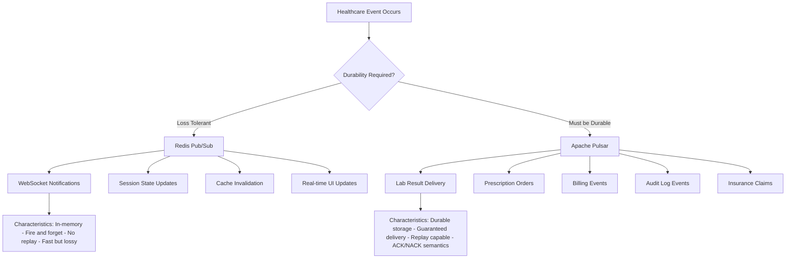
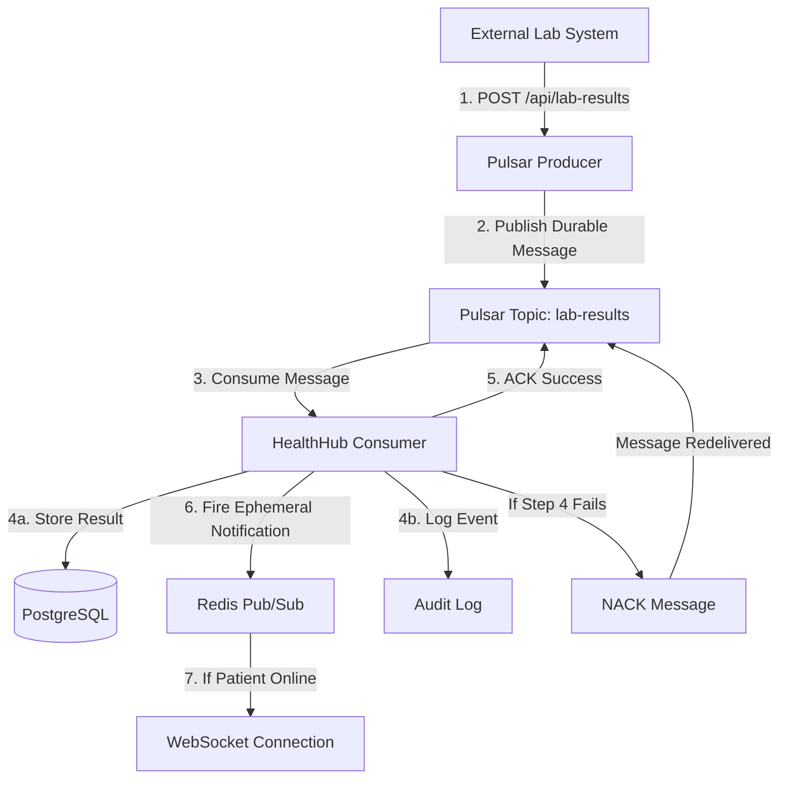
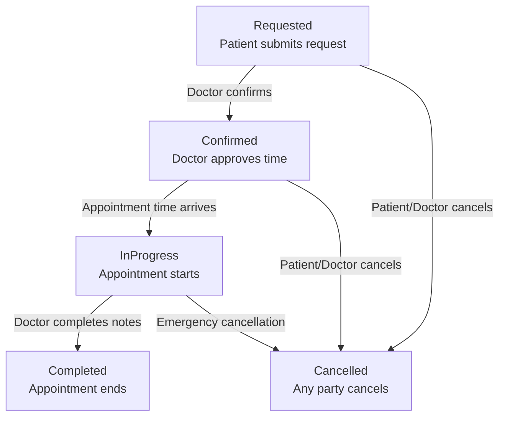
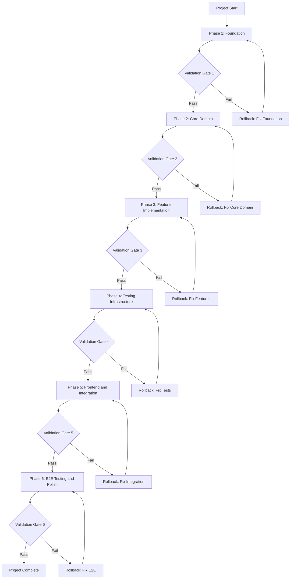
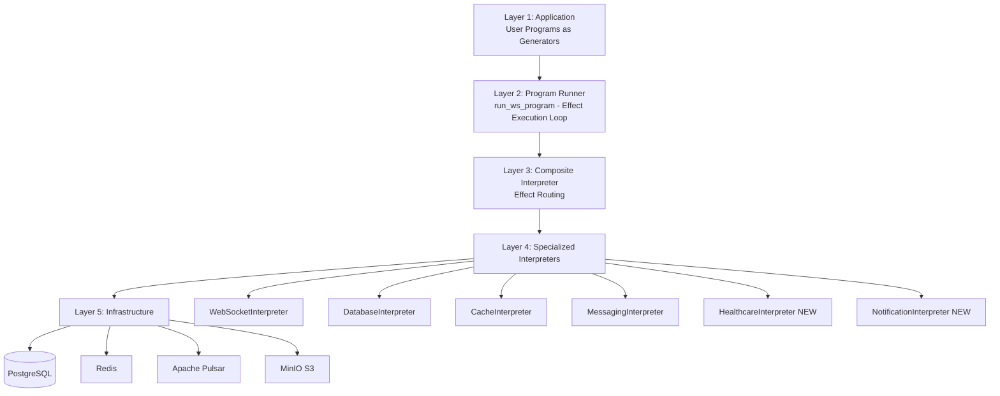
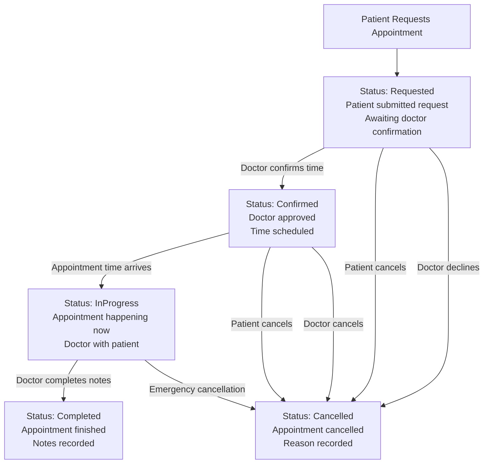
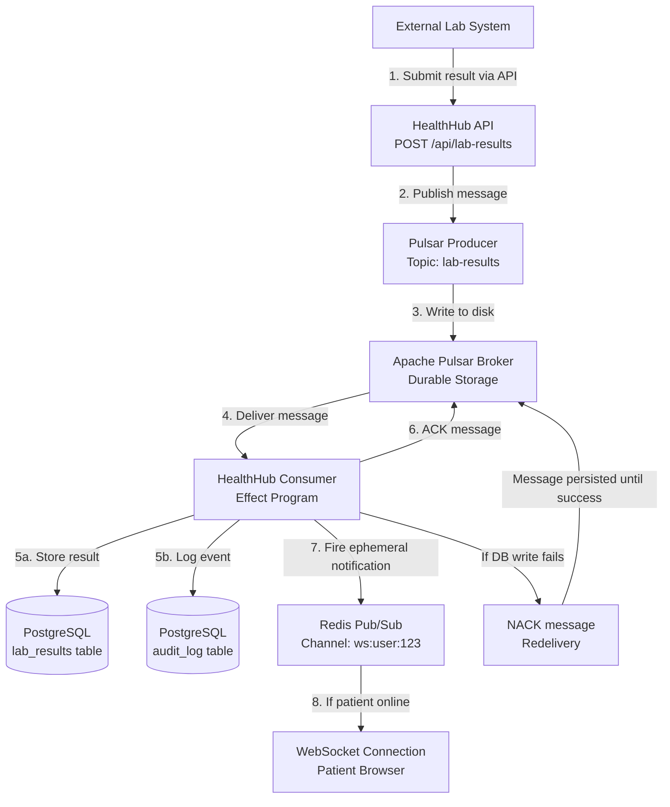
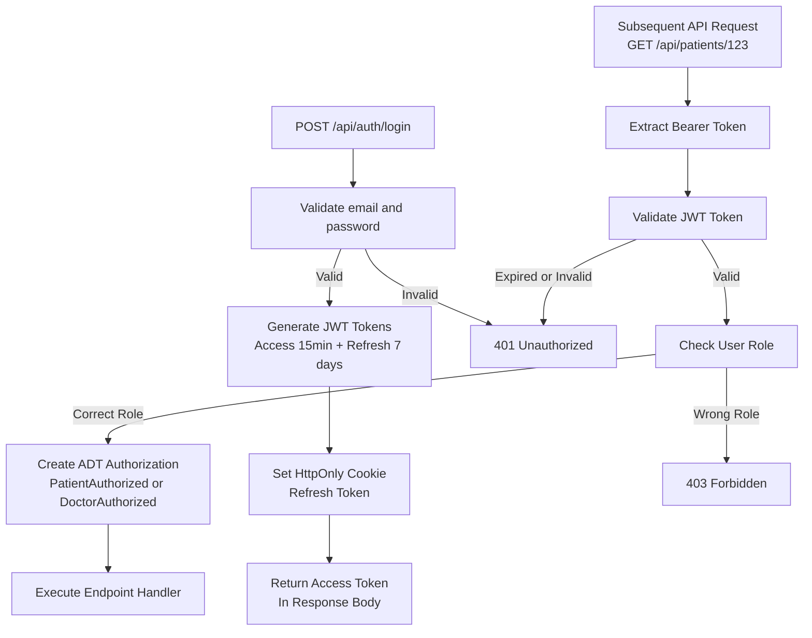
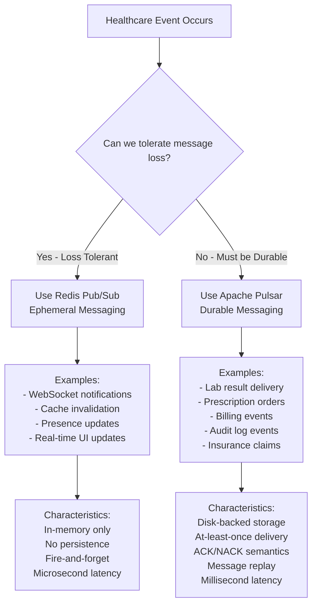

# HealthHub E2E Application Development Plan

Comprehensive development plan for **HealthHub** - a full-featured healthcare portal demo app showcasing Effectful's effect system integrated with modern web architecture patterns (inspired by Shipnorth).

---

## 1. Executive Summary

### Project Overview
- **Name**: HealthHub Medical Center
- **Domain**: Healthcare Portal (OLTP-focused)
- **Architecture**: React + Zustand + FastAPI + Effectful + PostgreSQL + Redis + Apache Pulsar
- **Scope**: Full-featured (6 major features)
- **Testing**: All 4 categories (E2E Playwright, Backend pytest, Frontend Vitest, API Contract)

### Business Context
HealthHub demonstrates production-grade patterns for building healthcare applications with:
- Strong data consistency (PostgreSQL source of truth)
- Durable messaging guarantees (Apache Pulsar for critical workflows)
- Ephemeral state management (Redis for sessions/cache)
- Real-time notifications (WebSocket + Redis pub/sub)
- Type-safe error handling (ADTs throughout)
- Provably correct authorization (ADT-based authorization states)

### Key Features
1. **Authentication & Authorization** - JWT dual-token with ADT-based roles
2. **Patient Management** - Demographics, medical history, allergies
3. **Appointment System** - Scheduling with state machine transitions
4. **Prescription Management** - E-prescribing with interaction warnings
5. **Lab Results** - Test ordering and result delivery with notifications
6. **Billing & Claims** - Invoice generation and insurance processing

---

## 2. Messaging Architecture: Redis vs Pulsar

### Design Pattern: Ephemeral vs Durable Messaging



### Redis Pub/Sub (Ephemeral Messaging)

**Use Cases:**
- ✅ Real-time WebSocket notifications (UI updates)
- ✅ Session state synchronization across pods
- ✅ Cache invalidation broadcasts
- ✅ Presence indicators (doctor online/offline)

**Characteristics:**
- Messages lost if no subscriber listening
- No message replay
- Very fast (microseconds)
- No acknowledgment required
- Acceptable to lose messages

**Example - WebSocket Notification:**
```python
# User updates profile → notify all connected sessions
await redis.publish(f"ws:user:{user_id}", json.dumps({
    "type": "profile_updated",
    "data": {"name": "New Name"}
}))
# If WebSocket disconnected, message is lost (acceptable)
```

### Apache Pulsar (Durable Messaging)

**Use Cases:**
- ✅ Lab result delivery (must not be lost)
- ✅ Prescription orders to pharmacy system
- ✅ Billing event processing
- ✅ Insurance claim submissions
- ✅ Audit log entries (compliance requirement)
- ✅ Appointment reminder scheduling

**Characteristics:**
- Messages persisted to disk until acknowledged
- Message replay supported
- Slower than Redis (milliseconds)
- Requires ACK/NACK for each message
- Guarantees at-least-once delivery

**Example - Lab Result Delivery:**
```python
# Lab system publishes result → must be delivered to patient portal
await pulsar_producer.send({
    "type": "lab_result_ready",
    "patient_id": str(patient_id),
    "result_id": str(result_id),
    "critical": True  # High priority
})
# Message stored until consumer ACKs successfully
# If consumer crashes, message redelivered
```

---

## 3. Concrete Healthcare Use Case: Lab Results Workflow

### Scenario: Critical Lab Result Delivery

**Business Requirements:**
1. Lab result must reach patient portal (cannot be lost)
2. Doctor must be notified of critical results
3. Audit trail required for compliance
4. Patient should receive real-time notification if online
5. System must handle consumer failures gracefully

### Architecture Pattern



### Effectful Program Implementation

**New Effects Required:**

```python
# effectful/effects/messaging.py (extend existing)

@dataclass(frozen=True)
class PublishLabResult:
    """Effect: Publish lab result to durable message queue.

    This message MUST be delivered (Pulsar, not Redis).
    Consumer will store result and notify patient.
    """
    result_id: UUID
    patient_id: UUID
    doctor_id: UUID
    test_type: str
    result_data: dict[str, str]
    critical: bool  # High priority flag

@dataclass(frozen=True)
class ConsumeLabResult:
    """Effect: Consume lab result from queue with ACK/NACK.

    Returns MessageEnvelope with lab result data.
    Consumer must ACK after successful processing.
    """
    timeout_seconds: int = 30

@dataclass(frozen=True)
class AcknowledgeLabResult:
    """Effect: ACK lab result message (processed successfully)."""
    message_id: str

@dataclass(frozen=True)
class NackLabResult:
    """Effect: NACK lab result message (redelivery required)."""
    message_id: str
    reason: str
```

**Effect Program - Lab Result Processing:**

```python
from collections.abc import Generator
from effectful import AllEffects, EffectResult

def process_lab_result_message() -> Generator[AllEffects, EffectResult, bool]:
    """Consumer program: Process lab result from Pulsar queue.

    Workflow:
    1. Consume message from Pulsar (blocking with timeout)
    2. Validate message format
    3. Store result in PostgreSQL
    4. Log audit event
    5. Send real-time notification (Redis pub/sub - ephemeral)
    6. ACK message to Pulsar (mark as processed)

    Error handling:
    - Database failure → NACK (redelivery)
    - Validation failure → ACK (dead letter queue)
    - Timeout → return None (retry consumption)
    """

    # Step 1: Consume message (blocks until message available)
    envelope = yield ConsumeLabResult(timeout_seconds=30)

    # Handle timeout
    match envelope:
        case ConsumeTimeout():
            return False  # No message available, try again
        case ConsumeFailure(reason=reason):
            yield LogError(message=f"Consumer failure: {reason}")
            return False

    # Type narrowing
    assert isinstance(envelope, MessageEnvelope)
    message_id = envelope.message_id
    payload = envelope.payload

    # Step 2: Validate message format
    if not all(k in payload for k in ["result_id", "patient_id", "test_type"]):
        # Invalid format → ACK to move to dead letter queue
        yield AcknowledgeLabResult(message_id=message_id)
        yield LogError(message=f"Invalid lab result format: {payload}")
        return False

    # Step 3: Store result in database (durable)
    result_id = UUID(payload["result_id"])
    patient_id = UUID(payload["patient_id"])

    lab_result = yield CreateLabResult(
        result_id=result_id,
        patient_id=patient_id,
        test_type=payload["test_type"],
        result_data=payload["result_data"],
        critical=payload.get("critical", False)
    )

    # Database failure → NACK for redelivery
    if lab_result is None:
        yield NackLabResult(
            message_id=message_id,
            reason="Database write failed"
        )
        return False

    # Type narrowing
    assert isinstance(lab_result, LabResult)

    # Step 4: Log audit event (compliance requirement)
    yield LogAuditEvent(
        event_type="lab_result_received",
        entity_id=result_id,
        patient_id=patient_id,
        metadata={"test_type": lab_result.test_type}
    )

    # Step 5: Real-time notification (ephemeral - Redis pub/sub)
    # OK if patient not online - they'll see result on next login
    yield PublishWebSocketNotification(
        user_id=patient_id,
        notification_type="lab_result_ready",
        data={"result_id": str(result_id), "critical": lab_result.critical}
    )

    # Step 6: ACK message (processed successfully)
    ack_result = yield AcknowledgeLabResult(message_id=message_id)

    match ack_result:
        case AcknowledgeSuccess():
            return True
        case AcknowledgeFailure(reason=reason):
            yield LogError(message=f"ACK failed: {reason}")
            return False
```

### Why This Pattern?

**Pulsar for Durability:**
- Lab result messages stored in Pulsar until ACK
- If consumer crashes mid-processing, message redelivered
- No data loss even with system failures
- Audit trail of message consumption

**Redis for Real-Time:**
- WebSocket notification sent after database commit
- If patient offline, notification lost (acceptable)
- Patient sees result on next login anyway
- Separates critical (durable) from nice-to-have (ephemeral)

**Separation of Concerns:**
- **Pulsar** = Business-critical data flow (must not lose)
- **Redis** = User experience enhancement (can lose)
- **PostgreSQL** = Source of truth (durable storage)

---

## 4. Existing Effectful Components Analysis

### Current Components (Reusable)

```mermaid
flowchart TB
  Existing[Existing Effectful Components]

  Existing --> Algebraic[Algebraic Types]
  Existing --> Domain[Domain Models]
  Existing --> Effects[Effect Definitions]
  Existing --> Interpreters[Interpreters]

  Algebraic --> Result[Result Ok Err]
  Algebraic --> Trampoline[Trampoline Pattern]

  Domain --> User[User UserNotFound]
  Domain --> Profile[ProfileData]
  Domain --> Message[ChatMessage]
  Domain --> Cache[CacheMiss]
  Domain --> Token[TokenValidationResult]
  Domain --> S3[S3Object PutSuccess]
  Domain --> Envelope[MessageEnvelope]

  Effects --> WebSocket[WebSocketEffect]
  Effects --> Database[DatabaseEffect]
  Effects --> CacheEff[CacheEffect]
  Effects --> Messaging[MessagingEffect]
  Effects --> Storage[StorageEffect]
  Effects --> Auth[AuthEffect]
  Effects --> System[SystemEffect]

  Interpreters --> WSInterp[WebSocketInterpreter]
  Interpreters --> DBInterp[DatabaseInterpreter]
  Interpreters --> CacheInterp[CacheInterpreter]
  Interpreters --> MsgInterp[MessagingInterpreter]
  Interpreters --> StorInterp[StorageInterpreter]
  Interpreters --> AuthInterp[AuthInterpreter]
  Interpreters --> SysInterp[SystemInterpreter]
  Interpreters --> Composite[CompositeInterpreter]
```



### Reusable for HealthHub

**Algebraic Types (100% reusable):**
- ✅ `Result[T, E]` - All error handling
- ✅ `Ok[T]` / `Err[E]` - Success/failure variants
- ✅ `Trampoline` - Stack-safe recursion
- ✅ `unreachable()` - Exhaustive matching

**Domain Models (Partially reusable):**
- ✅ `User` - Extend for Patient/Doctor
- ✅ `MessageEnvelope` - Pulsar message wrapper
- ❌ `ChatMessage` - Not healthcare-specific
- ❌ `ProfileData` - Too generic

**Effects (Extend existing):**
- ✅ `AuthEffect` - JWT validation, password hashing
- ✅ `DatabaseEffect` - User CRUD operations
- ✅ `CacheEffect` - Session caching
- ✅ `MessagingEffect` - Pulsar pub/sub (extend for lab results)
- ✅ `StorageEffect` - Document uploads (medical records)
- ✅ `SystemEffect` - UUID generation, timestamps
- ➕ **NEW**: Healthcare-specific database effects
- ➕ **NEW**: Notification effects (Redis pub/sub)

**Interpreters (Extend existing):**
- ✅ `AuthInterpreter` - Reuse for JWT
- ✅ `DatabaseInterpreter` - Extend with healthcare repositories
- ✅ `CacheInterpreter` - Reuse for sessions
- ✅ `MessagingInterpreter` - Extend for lab result queue
- ✅ `StorageInterpreter` - Reuse for medical documents
- ✅ `CompositeInterpreter` - Reuse for routing
- ➕ **NEW**: NotificationInterpreter (Redis pub/sub)

---

## 5. New Components Required for HealthHub

### New Domain Models

**Patient Domain:**
```python
@dataclass(frozen=True)
class Patient:
    """Patient entity with medical demographics."""
    id: UUID
    user_id: UUID  # Links to User for auth
    date_of_birth: date
    blood_type: str
    allergies: list[str]
    insurance_id: str | None
    emergency_contact: str

@dataclass(frozen=True)
class PatientFound:
    """Patient lookup success."""
    patient: Patient
    source: Literal["database", "cache"]

@dataclass(frozen=True)
class PatientNotFound:
    """Patient lookup failure."""
    patient_id: UUID
    reason: Literal["does_not_exist", "deleted", "access_denied"]

type PatientLookupResult = PatientFound | PatientNotFound
```

**Doctor Domain:**
```python
@dataclass(frozen=True)
class Doctor:
    """Doctor entity with credentials."""
    id: UUID
    user_id: UUID
    specialization: str
    license_number: str
    can_prescribe: bool

type DoctorLookupResult = DoctorFound | DoctorNotFound
```

**Appointment Domain (State Machine):**
```python
# Appointment Status ADT - makes illegal states unrepresentable

@dataclass(frozen=True)
class Requested:
    """Patient requested, awaiting doctor confirmation."""
    requested_at: datetime

@dataclass(frozen=True)
class Confirmed:
    """Doctor confirmed, scheduled."""
    confirmed_at: datetime
    scheduled_time: datetime

@dataclass(frozen=True)
class InProgress:
    """Appointment currently happening."""
    started_at: datetime

@dataclass(frozen=True)
class Completed:
    """Appointment finished."""
    completed_at: datetime
    notes: str

@dataclass(frozen=True)
class Cancelled:
    """Appointment cancelled."""
    cancelled_at: datetime
    cancelled_by: Literal["patient", "doctor", "system"]
    reason: str

type AppointmentStatus = Requested | Confirmed | InProgress | Completed | Cancelled

@dataclass(frozen=True)
class Appointment:
    """Appointment entity."""
    id: UUID
    patient_id: UUID
    doctor_id: UUID
    status: AppointmentStatus  # ADT ensures valid transitions
    reason: str
    created_at: datetime
```

**Appointment State Machine:**



**Prescription Domain:**
```python
@dataclass(frozen=True)
class Prescription:
    """Prescription entity."""
    id: UUID
    patient_id: UUID
    doctor_id: UUID
    medication: str
    dosage: str
    frequency: str
    duration_days: int
    refills_remaining: int
    created_at: datetime
    expires_at: datetime

@dataclass(frozen=True)
class MedicationInteractionWarning:
    """Warning about drug interactions."""
    medications: list[str]
    severity: Literal["minor", "moderate", "severe"]
    description: str

type MedicationCheckResult = NoInteractions | MedicationInteractionWarning
```

**Lab Result Domain:**
```python
@dataclass(frozen=True)
class LabResult:
    """Lab test result."""
    id: UUID
    patient_id: UUID
    doctor_id: UUID
    test_type: str
    result_data: dict[str, str]  # Test-specific values
    critical: bool  # Requires immediate attention
    reviewed_by_doctor: bool
    doctor_notes: str | None
    created_at: datetime

type LabResultLookupResult = LabResultFound | LabResultNotFound
```

**Billing Domain:**
```python
@dataclass(frozen=True)
class Invoice:
    """Healthcare invoice."""
    id: UUID
    patient_id: UUID
    appointment_id: UUID | None
    amount: Decimal
    status: Literal["draft", "sent", "paid", "overdue"]
    line_items: list[LineItem]
    created_at: datetime
    due_date: date

@dataclass(frozen=True)
class LineItem:
    """Invoice line item."""
    description: str
    quantity: int
    unit_price: Decimal
    total: Decimal
```

### New Effects

**Healthcare Database Effects:**
```python
# effectful/effects/healthcare.py (new module)

@dataclass(frozen=True)
class GetPatientById:
    """Effect: Fetch patient by ID."""
    patient_id: UUID

@dataclass(frozen=True)
class CreateAppointment:
    """Effect: Create new appointment request."""
    patient_id: UUID
    doctor_id: UUID
    requested_time: datetime
    reason: str

@dataclass(frozen=True)
class TransitionAppointmentStatus:
    """Effect: Transition appointment to new status.

    Validates state machine transitions.
    Returns TransitionSuccess or TransitionInvalid.
    """
    appointment_id: UUID
    new_status: AppointmentStatus
    actor_id: UUID

@dataclass(frozen=True)
class CreatePrescription:
    """Effect: Create prescription order."""
    patient_id: UUID
    doctor_id: UUID
    medication: str
    dosage: str
    duration_days: int

@dataclass(frozen=True)
class CheckMedicationInteractions:
    """Effect: Check for drug interactions.

    Returns NoInteractions or MedicationInteractionWarning.
    """
    medications: list[str]

@dataclass(frozen=True)
class CreateLabResult:
    """Effect: Store lab result."""
    result_id: UUID
    patient_id: UUID
    test_type: str
    result_data: dict[str, str]
    critical: bool

@dataclass(frozen=True)
class CreateInvoice:
    """Effect: Generate invoice."""
    patient_id: UUID
    appointment_id: UUID
    line_items: list[LineItem]

type HealthcareEffect = (
    GetPatientById
    | CreateAppointment
    | TransitionAppointmentStatus
    | CreatePrescription
    | CheckMedicationInteractions
    | CreateLabResult
    | CreateInvoice
)
```

**Notification Effects (Redis Pub/Sub):**
```python
# effectful/effects/notification.py (new module)

@dataclass(frozen=True)
class PublishWebSocketNotification:
    """Effect: Publish ephemeral notification via Redis pub/sub.

    Message is fire-and-forget. If user offline, message lost.
    Use for real-time UI updates only.
    """
    user_id: UUID
    notification_type: str
    data: dict[str, str]

@dataclass(frozen=True)
class LogAuditEvent:
    """Effect: Log audit event for compliance.

    Stored durably in PostgreSQL audit_log table.
    """
    event_type: str
    entity_id: UUID
    patient_id: UUID
    metadata: dict[str, str]

type NotificationEffect = PublishWebSocketNotification | LogAuditEvent
```

**Update AllEffects Union:**
```python
# effectful/programs/program_types.py (update)

type AllEffects = (
    WebSocketEffect
    | DatabaseEffect
    | CacheEffect
    | MessagingEffect
    | StorageEffect
    | AuthEffect
    | SystemEffect
    | HealthcareEffect  # NEW
    | NotificationEffect  # NEW
)
```

### New Interpreters

**HealthcareInterpreter:**
```python
# effectful/interpreters/healthcare.py (new)

class HealthcareInterpreter(BaseInterpreter):
    """Interpreter for healthcare-specific effects."""

    def __init__(
        self,
        patient_repo: PatientRepository,
        appointment_repo: AppointmentRepository,
        prescription_repo: PrescriptionRepository,
        lab_result_repo: LabResultRepository,
        invoice_repo: InvoiceRepository,
    ) -> None:
        self.patient_repo = patient_repo
        self.appointment_repo = appointment_repo
        self.prescription_repo = prescription_repo
        self.lab_result_repo = lab_result_repo
        self.invoice_repo = invoice_repo

    async def interpret(self, effect: HealthcareEffect) -> Result[EffectReturn, InterpreterError]:
        """Route healthcare effects to appropriate handlers."""
        match effect:
            case GetPatientById(patient_id=patient_id):
                return await self._get_patient(patient_id)
            case CreateAppointment(...):
                return await self._create_appointment(effect)
            case TransitionAppointmentStatus(...):
                return await self._transition_appointment(effect)
            # ... more cases
```

**NotificationInterpreter:**
```python
# effectful/interpreters/notification.py (new)

class NotificationInterpreter(BaseInterpreter):
    """Interpreter for notification effects (Redis pub/sub + audit log)."""

    def __init__(
        self,
        redis_client: redis.Redis,
        audit_repo: AuditLogRepository,
    ) -> None:
        self.redis = redis_client
        self.audit_repo = audit_repo

    async def interpret(self, effect: NotificationEffect) -> Result[EffectReturn, InterpreterError]:
        """Route notification effects."""
        match effect:
            case PublishWebSocketNotification(user_id=uid, notification_type=ntype, data=data):
                # Ephemeral Redis pub/sub (fire-and-forget)
                await self.redis.publish(
                    f"ws:user:{uid}",
                    json.dumps({"type": ntype, "data": data})
                )
                return Ok(EffectReturn(value=None, effect_name="PublishWebSocketNotification"))

            case LogAuditEvent(event_type=etype, entity_id=eid, patient_id=pid, metadata=meta):
                # Durable PostgreSQL storage
                await self.audit_repo.create(
                    event_type=etype,
                    entity_id=eid,
                    patient_id=pid,
                    metadata=meta
                )
                return Ok(EffectReturn(value=None, effect_name="LogAuditEvent"))
```

---

## 6. Testing Antipatterns from Shipnorth (All 22)

### Critical: Zero Tolerance Policy

**From Shipnorth CLAUDE.md and Effectful testing_doctrine.md:**

All 22 antipatterns must be avoided. Tests exist to find problems, not provide false confidence.

### Antipattern Reference Table

| # | Antipattern | Wrong | Right | Healthcare Example |
|---|-------------|-------|-------|-------------------|
| 1 | **Tests Pass When Features Broken** | Expecting valid data to fail | Test valid inputs return expected results | Appointment creation with valid doctor ID should succeed, not return None |
| 2 | **Accepting "Not Implemented" (501)** | `assert status_code in [200, 501]` | Only accept 200/201 | Lab result API must return 200, not accept 501 |
| 3 | **Silent Effect Failures** | Accepting None from effects | Only accept typed success values | `CreatePrescription` must return `Prescription`, not `None` |
| 4 | **Testing Actions Without Validating Results** | Yield effect, no verification | Verify result type and value | After `CreateAppointment`, assert appointment has `Requested` status |
| 5 | **Contradicting Domain Guarantees** | Testing required invariants don't hold | Verify domain invariants maintained | Appointment state machine: cannot go from `Completed` to `Requested` |
| 6 | **Using pytest.skip()** | `pytest.skip()` or `@pytest.mark.skip` | Let tests FAIL or delete test | Never skip prescription validation tests |
| 7 | **Hardcoded Success Tests** | `assert True` - always passes | Validate actual behavior | Verify medication interaction check returns specific warnings |
| 8 | **Overly Permissive Assertions** | Accepting any non-None value | Only accept specific expected values | `assert isinstance(result, Prescription)`, not `assert result is not None` |
| 9 | **Lowered Standards** | `assert len(prescriptions) > 0` | Validate specific expected values | `assert len(prescriptions) == 2` with specific medication names |
| 10 | **Test Timeouts** | Using `timeout` command | Let tests complete naturally | E2E Playwright tests for appointment booking take 5-7 seconds (wait) |
| 11 | **Testing with Real Infrastructure in Unit Tests** | asyncpg.connect() in unit test | Use pytest-mock with spec | Mock PatientRepository, not real PostgreSQL |
| 12 | **Not Testing Error Paths** | Only happy path | Test errors explicitly | Test `GetPatientById` with invalid ID returns `PatientNotFound` |
| 13 | **Incomplete Assertions** | Only check Ok/Err | Verify side effects and state | After prescription created, verify Pulsar message published |
| 14 | **Relaxed Validation** | Default fallbacks for missing fields | Strict validation requiring all | `Patient` must have `blood_type`, not default to "unknown" |
| 15 | **Disabling Test Infrastructure** | Commenting out fixtures | Fix root cause | Don't disable Pulsar consumer tests, fix connection |
| 16 | **Masking Root Causes** | try/except to hide errors | Fix root cause, use Result type | Don't catch database errors silently |
| 17 | **Trial-and-Error Debugging** | Random "fixing tests" commits | Systematic: baseline → root cause → plan → fix | Document what broke before fixing |
| 18 | **Adding Features During Test Fixing** | New features while debugging | Fix tests first, add features after | Don't add prescription refill logic while fixing creation tests |
| 19 | **Test Env Vars in Production Code** | Checking `PYTEST_RUNNING` in library | Use dependency injection | Don't check `if os.getenv("PYTEST_RUNNING")` in interpreters |
| 20 | **Holding Database Locks** | TRUNCATE inside transaction | Commit TRUNCATE before test runs | Integration test fixtures: `TRUNCATE ... ; COMMIT;` immediately |
| 21 | **Docker Bind Mount Permissions** | Bind mount for PostgreSQL data | Named volumes only | `pgdata:/var/lib/postgresql/data` not `./pgdata:/...` |
| 22 | **Using Deleted Testing Utilities** | `from effectful.testing import create_test_interpreter` | Use pytest-mock explicitly | Create `CompositeInterpreter` manually with mocked repos |

### Specific Prevention Strategies for HealthHub

**State Machine Testing (Antipattern #5):**
```python
# ❌ WRONG - Allows illegal state transitions
def test_appointment_transition():
    appointment = Appointment(status=Completed(...))
    # This should be impossible!
    new_status = Requested(...)
    result = yield TransitionAppointmentStatus(appointment.id, new_status)
    assert result is not None  # Accepts invalid transition!

# ✅ RIGHT - Validates state machine invariants
def test_appointment_invalid_transition():
    appointment = Appointment(status=Completed(...))
    new_status = Requested(...)  # Invalid transition

    result = yield TransitionAppointmentStatus(appointment.id, new_status)

    # Must return error
    match result:
        case TransitionInvalid(reason=reason):
            assert "cannot transition from Completed to Requested" in reason
        case _:
            pytest.fail("Invalid transition should return TransitionInvalid")
```

**Pulsar Message Testing (Antipattern #13):**
```python
# ❌ WRONG - Only checks return value
result = await run_ws_program(publish_lab_result(), interpreter)
assert_ok(result)  # But was message published?

# ✅ RIGHT - Verify Pulsar producer called
result = await run_ws_program(publish_lab_result(), interpreter)
assert_ok(result)

# Verify side effect
mock_pulsar_producer.send.assert_called_once_with({
    "type": "lab_result_ready",
    "patient_id": str(patient_id),
    "result_id": str(result_id)
})
```

**ADT-Based Authorization Testing (Antipattern #14):**
```python
# ❌ WRONG - Accepts unauthorized access
def test_view_prescription():
    # Patient A trying to view Patient B's prescription
    result = get_prescription(prescription_id, current_user=patient_a)
    assert result is not None  # Accepts security violation!

# ✅ RIGHT - Enforces authorization with ADTs
def test_view_prescription_unauthorized():
    # Patient A trying to view Patient B's prescription
    result = get_prescription(prescription_id, current_user=patient_a)

    match result:
        case Err(AuthorizationError(reason="patient_mismatch")):
            assert True  # Expected
        case _:
            pytest.fail("Should reject unauthorized access")
```

---

## 7. Phased Development Plan with Validation Criteria

### Overview



---

### Phase 1: Foundation & Authentication (Days 1-3)

**Deliverables:**

1. **Docker Infrastructure**
   - PostgreSQL 15 with named volume
   - Redis 7 for cache + pub/sub
   - Apache Pulsar for durable messaging
   - HealthHub service container

2. **Database Schema**
   - Core tables: users, patients, doctors, appointments, prescriptions, lab_results, invoices
   - Audit log table (compliance requirement)
   - Seed data script with demo users

3. **JWT Authentication**
   - Dual-token pattern (15min access, 7-day refresh)
   - Bcrypt password hashing
   - Token validation with ADT result types

4. **ADT-Based Authorization**
   - `PatientAuthorized` dataclass
   - `DoctorAuthorized` dataclass
   - `AdminAuthorized` dataclass
   - FastAPI dependencies using ADTs

5. **Repository Pattern**
   - UserRepository (extend Effectful's existing)
   - PatientRepository
   - DoctorRepository
   - AsyncDatabaseManager with connection pooling

6. **FastAPI Application**
   - Lifespan management with AsyncExitStack
   - Health check endpoint
   - CORS configuration
   - Prometheus metrics setup

**Validation Criteria (Must Pass Before Phase 2):**

| Criterion | Test Command | Expected Result |
|-----------|-------------|-----------------|
| Docker services start | `docker compose up -d` | Exit code 0, all services healthy |
| Database schema created | `docker compose exec postgres psql -U healthhub -c '\dt'` | All tables listed |
| Seed data loaded | `docker compose exec postgres psql -U healthhub -c 'SELECT COUNT(*) FROM users'` | Count > 0 |
| Health check responds | `curl http://localhost:8850/health` | 200 OK |
| JWT generation works | Unit test: `test_jwt_generate_access_token` | Pass |
| JWT validation works | Unit test: `test_jwt_validate_token_success` | Pass |
| ADT authorization | Unit test: `test_require_patient_authorized` | Pass |
| Repository CRUD | Unit test: `test_patient_repository_create` | Pass |
| MyPy strict passes | `docker compose exec healthhub mypy backend/` | 0 errors |
| No escape hatches | `grep -r "Any\|cast\|type: ignore" backend/` | 0 matches |

**Success Metrics:**
- ✅ All Docker services running
- ✅ Zero MyPy errors
- ✅ Foundation unit tests: 15+ tests passing
- ✅ No `Any`, `cast()`, or `# type: ignore` in codebase

**Rollback Strategy:**
- If Docker fails: Check docker-compose.yml syntax, verify ports available
- If MyPy fails: Fix type errors before proceeding (zero tolerance)
- If tests fail: Fix implementation, do not skip tests

---

### Phase 2: Core Healthcare Domain (Days 4-5)

**Deliverables:**

1. **Domain Models**
   - Patient, PatientLookupResult ADT
   - Doctor, DoctorLookupResult ADT
   - Appointment with AppointmentStatus ADT (state machine)
   - Prescription with MedicationCheckResult ADT
   - LabResult ADT
   - Invoice with line items

2. **Healthcare Effects**
   - GetPatientById, CreateAppointment, TransitionAppointmentStatus
   - CreatePrescription, CheckMedicationInteractions
   - CreateLabResult, CreateInvoice
   - Update AllEffects union type

3. **Healthcare Interpreter**
   - HealthcareInterpreter class
   - Pattern matching on HealthcareEffect
   - Integration with repositories
   - Result type error handling

4. **Notification Effects & Interpreter**
   - PublishWebSocketNotification (Redis pub/sub)
   - LogAuditEvent (PostgreSQL)
   - NotificationInterpreter

5. **Composite Interpreter Update**
   - Register HealthcareInterpreter
   - Register NotificationInterpreter
   - Effect routing logic

**Validation Criteria (Must Pass Before Phase 3):**

| Criterion | Test Command | Expected Result |
|-----------|-------------|-----------------|
| Domain models immutable | `test_patient_immutability` | FrozenInstanceError raised |
| ADTs exhaustive | `test_appointment_status_match_exhaustive` | All cases handled |
| State machine valid transitions | `test_appointment_transition_valid` | Requested → Confirmed works |
| State machine invalid transitions | `test_appointment_transition_invalid` | Completed → Requested fails |
| Healthcare interpreter handles effects | `test_healthcare_interpreter_get_patient` | Returns Ok(EffectReturn(patient)) |
| Notification interpreter publishes | `test_notification_interpreter_websocket` | Redis publish called |
| Audit logging works | `test_notification_interpreter_audit_log` | Row inserted in audit_log |
| Composite routing works | `test_composite_routes_healthcare_effect` | HealthcareInterpreter invoked |
| MyPy strict passes | `docker compose exec healthhub mypy backend/` | 0 errors |

**Success Metrics:**
- ✅ Domain model unit tests: 20+ tests passing
- ✅ Interpreter unit tests: 30+ tests passing
- ✅ Zero MyPy errors
- ✅ All state machine transitions validated

**Rollback Strategy:**
- If state machine tests fail: Review ADT definitions, ensure illegal states unrepresentable
- If interpreter tests fail: Check pytest-mock setup, verify spec= parameter used
- If MyPy fails: Add missing type annotations, fix union type handling

---

### Phase 3: Feature Implementation (Days 6-9)

**Deliverables:**

1. **Patient Management Feature**
   - CRUD operations for patients
   - Medical history tracking
   - Allergy management
   - FastAPI endpoints: GET/POST/PUT/DELETE `/api/patients`

2. **Appointment System Feature**
   - Appointment request workflow
   - State transitions via API
   - Calendar availability check
   - FastAPI endpoints: `/api/appointments`

3. **Prescription Management Feature**
   - Prescription creation (doctor only)
   - Medication interaction checking
   - Prescription history (patient/doctor views)
   - Pulsar message publishing for pharmacy system
   - FastAPI endpoints: `/api/prescriptions`

4. **Lab Results Feature**
   - Lab result upload (admin only)
   - Result delivery via Pulsar
   - Consumer program for lab result processing
   - Critical result flagging
   - FastAPI endpoints: `/api/lab-results`

5. **Billing Feature**
   - Invoice generation
   - Payment tracking
   - Insurance claim submission (future: via Pulsar)
   - FastAPI endpoints: `/api/invoices`

6. **Effect Programs**
   - `create_prescription_program()` - Check interactions, create, publish to Pulsar
   - `process_lab_result_message()` - Consumer workflow (Pulsar → DB → Redis notification)
   - `schedule_appointment_program()` - Create appointment, notify doctor
   - All programs using Result types for error handling

**Validation Criteria (Must Pass Before Phase 4):**

| Criterion | Test Command | Expected Result |
|-----------|-------------|-----------------|
| Patient CRUD works | Integration test: `test_patient_workflow` | Create → Read → Update → Delete |
| Appointment creation | Integration test: `test_appointment_create` | Returns appointment with Requested status |
| State transition validated | Integration test: `test_appointment_invalid_transition` | Returns TransitionInvalid error |
| Prescription creation | Integration test: `test_prescription_create_success` | Prescription created, Pulsar message sent |
| Medication interaction check | Integration test: `test_medication_interaction_warning` | Returns MedicationInteractionWarning |
| Lab result Pulsar publish | Integration test: `test_lab_result_publish` | Message published to Pulsar topic |
| Lab result consumer ACK | Integration test: `test_lab_result_consumer_ack` | Message consumed, stored, ACKed |
| Lab result consumer NACK | Integration test: `test_lab_result_consumer_nack_on_db_failure` | DB failure causes NACK, message redelivered |
| Audit logging | Integration test: `test_audit_log_created` | All events logged to audit_log table |
| API endpoints return 200 | `curl http://localhost:8850/api/patients` | 200 OK with JSON |
| MyPy strict passes | `docker compose exec healthhub mypy backend/` | 0 errors |

**Success Metrics:**
- ✅ Integration tests: 50+ tests passing
- ✅ All API endpoints functional
- ✅ Pulsar pub/sub working (producer + consumer)
- ✅ Zero antipatterns detected (manual review)

**Rollback Strategy:**
- If Pulsar tests fail: Check connection string, verify topic exists
- If consumer NACK fails: Review message redelivery logic
- If API tests fail: Check FastAPI routing, verify dependencies injected

---

### Phase 4: Testing Infrastructure (Days 10-12)

**Deliverables:**

1. **Backend Unit Tests**
   - Effect tests: 20+ tests (immutability, structure)
   - Interpreter tests: 60+ tests (success/error paths with pytest-mock)
   - Program tests: 30+ tests (manual generator stepping)
   - All using pytest-mock with `spec=` parameter

2. **Backend Integration Tests**
   - Workflow tests: 50+ tests (run_ws_program with real infrastructure)
   - Real PostgreSQL, Redis, Pulsar
   - TRUNCATE+seed before each test
   - Named volumes for PostgreSQL (avoid permissions issues)

3. **API Contract Tests**
   - Pydantic request/response validation
   - Schema drift detection
   - Error response format validation

4. **Coverage Validation**
   - Minimum 45% unit test coverage
   - All features have integration tests (conceptual coverage)

**Validation Criteria (Must Pass Before Phase 5):**

| Criterion | Test Command | Expected Result |
|-----------|-------------|-----------------|
| Unit tests pass | `poetry run pytest tests/unit/` | 110+ tests passing |
| Integration tests pass | `poetry run pytest tests/integration/` | 50+ tests passing |
| Coverage threshold | `poetry run pytest --cov --cov-fail-under=45` | Coverage ≥ 45% |
| No skipped tests | `poetry run pytest` | 0 skipped (enforced by conftest.py) |
| Test output complete | Redirect to /tmp/test-output.txt, read with Read tool | All output visible |
| No real infrastructure in unit tests | Grep for `asyncpg.connect` in tests/unit/ | 0 matches (antipattern #11) |
| Error paths tested | Count tests with "error" or "failure" in name | ≥30% of tests |
| MyPy strict passes | `docker compose exec healthhub mypy backend/ tests/` | 0 errors |

**Success Metrics:**
- ✅ Backend tests: 160+ tests passing
- ✅ Coverage ≥ 45%
- ✅ Zero skipped tests
- ✅ All 22 antipatterns avoided (manual checklist review)

**Rollback Strategy:**
- If coverage fails: Add tests for uncovered branches
- If integration tests timeout: Check TRUNCATE+COMMIT pattern, verify locks released
- If antipattern detected: Refactor test, update antipattern prevention doc

---

### Phase 5: Frontend & Integration (Days 13-16)

**Deliverables:**

1. **React Frontend Foundation**
   - Create React App with TypeScript
   - Project structure: src/algebraic/, src/stores/, src/api/, src/components/
   - Zustand state management
   - React Router with protected routes

2. **Algebraic Data Types (TypeScript)**
   - Result<T, E> type
   - RemoteData<T, E> type (NotAsked, Loading, Success, Failure)
   - Auth state machine ADT (Hydrating, Unauthenticated, Authenticating, Authenticated, SessionExpired)

3. **Zustand Stores**
   - authStore - JWT dual-token management with persist middleware
   - webSocketStore - Connection state machine
   - navigationStore - Route management (no imperative window.location)
   - notificationStore - Toast notification queue

4. **Type-Safe API Client**
   - Result-based HTTP client (no try/catch)
   - Error ADTs (NetworkError, AuthenticationError, ValidationError, etc.)
   - Automatic token refresh

5. **Core Components**
   - Login/Register forms (React Hook Form + Zod)
   - Protected route wrapper
   - Patient dashboard
   - Appointment booking UI
   - Prescription list
   - Lab results viewer

6. **WebSocket Integration**
   - Native WebSocket (not Socket.IO)
   - Pure state machine: (state, event) → (nextState, effects[])
   - Effect interpreter at boundary
   - Heartbeat management

**Validation Criteria (Must Pass Before Phase 6):**

| Criterion | Test Command | Expected Result |
|-----------|-------------|-----------------|
| Frontend builds | `poetry run frontend-build` | Exit code 0, build/ directory created |
| TypeScript strict passes | `npm run type-check` | 0 errors |
| ESLint passes | `npm run lint` | 0 errors |
| Auth state machine exhaustive | Manual review of authStore.ts | All cases handled |
| WebSocket state machine exhaustive | Manual review of webSocketStore.ts | All cases handled |
| Protected routes work | Manual test: Navigate to /dashboard without login | Redirect to /login |
| API client returns Results | Review api/client.ts | All methods return Result<T, E> |
| No imperative navigation | Grep for `window.location` in src/ (excluding navigationStore) | 0 matches |
| Frontend Vitest tests pass | `npm run test` | 30+ tests passing |

**Success Metrics:**
- ✅ Frontend builds successfully
- ✅ TypeScript strict with zero errors
- ✅ Vitest tests: 30+ passing
- ✅ All state machines use ADTs

**Rollback Strategy:**
- If build fails: Check tsconfig.json, verify dependencies installed
- If TypeScript errors: Fix type annotations, avoid `any` types
- If state machine has gaps: Add missing transitions, ensure exhaustive matching

---

### Phase 6: E2E Testing & Polish (Days 17-20)

**Deliverables:**

1. **Playwright E2E Tests**
   - Browser pool setup (3 chromium instances)
   - Test fixtures: authenticated user, seed data
   - Critical workflows tested

2. **E2E Test Scenarios**
   - Login flow (success/failure)
   - Patient dashboard navigation
   - Appointment booking end-to-end
   - Prescription viewing
   - Lab result notification (Pulsar → DB → WebSocket)
   - Authorization enforcement (patient cannot view other patient's data)

3. **Performance Validation**
   - Prometheus metrics collection
   - Grafana dashboards (HTTP requests, DB queries, Pulsar lag)
   - Load testing (optional)

4. **Documentation**
   - README with setup instructions
   - API documentation
   - Architecture diagrams
   - Deployment guide

**Validation Criteria (Must Pass Before Completion):**

| Criterion | Test Command | Expected Result |
|-----------|-------------|-----------------|
| E2E tests pass | `poetry run test-e2e > /tmp/e2e-output.txt 2>&1` | 30+ tests passing (read complete output) |
| Browser pool works | Check BrowserPool initialization in test output | No "browser not available" errors |
| Critical workflows tested | Review test names | Login, appointment booking, lab result covered |
| Authorization enforced | E2E test: Patient A tries to access Patient B data | 403 Forbidden or redirect |
| WebSocket notifications work | E2E test: Lab result published → UI updates | Real-time notification appears |
| Pulsar message delivery | E2E test: Prescription created → pharmacy system notified | Message visible in Pulsar admin |
| Test output complete | Use Read tool on /tmp/e2e-output.txt | All test results visible (no truncation) |
| Full test suite passes | `poetry run test-all > /tmp/all-tests.txt 2>&1` | 200+ tests passing |
| MyPy strict passes | `mypy backend/ frontend/ tests/` | 0 errors |

**Success Metrics:**
- ✅ E2E tests: 30+ passing (5-7 minutes runtime)
- ✅ Full test suite: 200+ tests passing
- ✅ Zero MyPy errors
- ✅ All features functional in browser

**Rollback Strategy:**
- If E2E tests timeout: Increase timeout (test may need 7 minutes), check browser pool
- If WebSocket tests fail: Review connection state machine, check Redis pub/sub
- If Pulsar tests fail: Verify message persistence, check consumer ACK logic

---

## 8. Database Schema Design

### PostgreSQL Tables

```sql
-- 01-CORE: Authentication and Users
CREATE TABLE users (
    id UUID PRIMARY KEY DEFAULT gen_random_uuid(),
    email VARCHAR(255) UNIQUE NOT NULL,
    password_hash VARCHAR(255) NOT NULL,
    role VARCHAR(50) NOT NULL DEFAULT 'patient',  -- 'patient', 'doctor', 'admin'
    status VARCHAR(50) DEFAULT 'active',
    last_login TIMESTAMP WITH TIME ZONE,
    created_at TIMESTAMP WITH TIME ZONE DEFAULT NOW(),
    updated_at TIMESTAMP WITH TIME ZONE DEFAULT NOW()
);

-- 02-PATIENTS: Patient Demographics
CREATE TABLE patients (
    id UUID PRIMARY KEY DEFAULT gen_random_uuid(),
    user_id UUID UNIQUE REFERENCES users(id) ON DELETE CASCADE,
    first_name VARCHAR(255) NOT NULL,
    last_name VARCHAR(255) NOT NULL,
    date_of_birth DATE NOT NULL,
    blood_type VARCHAR(10),
    allergies TEXT[],  -- Array of allergy strings
    insurance_id VARCHAR(100),
    emergency_contact VARCHAR(255),
    created_at TIMESTAMP WITH TIME ZONE DEFAULT NOW(),
    updated_at TIMESTAMP WITH TIME ZONE DEFAULT NOW()
);

-- 03-DOCTORS: Doctor Credentials
CREATE TABLE doctors (
    id UUID PRIMARY KEY DEFAULT gen_random_uuid(),
    user_id UUID UNIQUE REFERENCES users(id) ON DELETE CASCADE,
    first_name VARCHAR(255) NOT NULL,
    last_name VARCHAR(255) NOT NULL,
    specialization VARCHAR(255) NOT NULL,
    license_number VARCHAR(100) UNIQUE NOT NULL,
    can_prescribe BOOLEAN DEFAULT TRUE,
    created_at TIMESTAMP WITH TIME ZONE DEFAULT NOW(),
    updated_at TIMESTAMP WITH TIME ZONE DEFAULT NOW()
);

-- 04-APPOINTMENTS: Appointment Scheduling
CREATE TABLE appointments (
    id UUID PRIMARY KEY DEFAULT gen_random_uuid(),
    patient_id UUID NOT NULL REFERENCES patients(id),
    doctor_id UUID NOT NULL REFERENCES doctors(id),
    status VARCHAR(50) NOT NULL DEFAULT 'requested',  -- ADT: requested, confirmed, in_progress, completed, cancelled
    status_metadata JSONB,  -- Stores ADT variant data (timestamps, notes, etc.)
    reason TEXT NOT NULL,
    scheduled_time TIMESTAMP WITH TIME ZONE,
    created_at TIMESTAMP WITH TIME ZONE DEFAULT NOW(),
    updated_at TIMESTAMP WITH TIME ZONE DEFAULT NOW()
);

-- 05-PRESCRIPTIONS: Prescription Records
CREATE TABLE prescriptions (
    id UUID PRIMARY KEY DEFAULT gen_random_uuid(),
    patient_id UUID NOT NULL REFERENCES patients(id),
    doctor_id UUID NOT NULL REFERENCES doctors(id),
    medication VARCHAR(255) NOT NULL,
    dosage VARCHAR(100) NOT NULL,
    frequency VARCHAR(100) NOT NULL,
    duration_days INTEGER NOT NULL,
    refills_remaining INTEGER DEFAULT 0,
    interaction_warnings JSONB,  -- Stores MedicationInteractionWarning data
    created_at TIMESTAMP WITH TIME ZONE DEFAULT NOW(),
    expires_at TIMESTAMP WITH TIME ZONE NOT NULL
);

-- 06-LAB-RESULTS: Lab Test Results
CREATE TABLE lab_results (
    id UUID PRIMARY KEY DEFAULT gen_random_uuid(),
    patient_id UUID NOT NULL REFERENCES patients(id),
    doctor_id UUID NOT NULL REFERENCES doctors(id),
    test_type VARCHAR(255) NOT NULL,
    result_data JSONB NOT NULL,  -- Test-specific values
    critical BOOLEAN DEFAULT FALSE,
    reviewed_by_doctor BOOLEAN DEFAULT FALSE,
    doctor_notes TEXT,
    created_at TIMESTAMP WITH TIME ZONE DEFAULT NOW()
);

-- 07-BILLING: Invoices and Payments
CREATE TABLE invoices (
    id UUID PRIMARY KEY DEFAULT gen_random_uuid(),
    patient_id UUID NOT NULL REFERENCES patients(id),
    appointment_id UUID REFERENCES appointments(id),
    status VARCHAR(50) DEFAULT 'draft',  -- 'draft', 'sent', 'paid', 'overdue'
    subtotal DECIMAL(10,2) NOT NULL DEFAULT 0.00,
    tax_amount DECIMAL(10,2) NOT NULL DEFAULT 0.00,
    total_amount DECIMAL(10,2) NOT NULL DEFAULT 0.00,
    due_date DATE,
    created_at TIMESTAMP WITH TIME ZONE DEFAULT NOW()
);

CREATE TABLE invoice_line_items (
    id UUID PRIMARY KEY DEFAULT gen_random_uuid(),
    invoice_id UUID NOT NULL REFERENCES invoices(id) ON DELETE CASCADE,
    description TEXT NOT NULL,
    quantity INTEGER DEFAULT 1,
    unit_price DECIMAL(10,2) NOT NULL,
    total DECIMAL(10,2) NOT NULL
);

-- 08-AUDIT: Compliance Audit Log
CREATE TABLE audit_log (
    id UUID PRIMARY KEY DEFAULT gen_random_uuid(),
    event_type VARCHAR(100) NOT NULL,
    entity_id UUID,
    patient_id UUID REFERENCES patients(id),
    user_id UUID REFERENCES users(id),
    metadata JSONB,
    created_at TIMESTAMP WITH TIME ZONE DEFAULT NOW()
);

CREATE INDEX idx_audit_log_patient ON audit_log(patient_id);
CREATE INDEX idx_audit_log_created_at ON audit_log(created_at);
```

### Schema Patterns

**ADT Storage Pattern (JSONB Metadata):**
- Appointment status stored as VARCHAR + JSONB metadata
- JSONB contains variant-specific data (timestamps, notes, reason)
- Allows type-safe ADTs in Python while maintaining PostgreSQL flexibility

**Audit Trail:**
- All mutable tables have `created_at` and `updated_at`
- Separate `audit_log` table for compliance events
- Indexed by patient_id for fast lookups

**Foreign Key Constraints:**
- Enforce referential integrity
- CASCADE deletes where appropriate (patient → appointments)

---

## 9. Component Reusability Analysis

### Effectful Components Matrix

| Component | Reusable? | Modification Needed | Healthcare Usage |
|-----------|-----------|---------------------|------------------|
| **Result[T, E]** | ✅ 100% | None | All error handling |
| **Ok[T] / Err[E]** | ✅ 100% | None | Pattern matching everywhere |
| **Trampoline** | ✅ 100% | None | Recursive algorithms (rare in healthcare) |
| **User** | ⚠️ Partial | Add role field | Extend for Patient/Doctor users |
| **MessageEnvelope** | ✅ 100% | None | Pulsar message wrapper |
| **AuthEffect** | ✅ 100% | None | JWT validation, password hashing |
| **DatabaseEffect** | ➕ Extend | Add healthcare operations | Reuse User CRUD, add Patient/Appointment |
| **CacheEffect** | ✅ 100% | None | Session caching |
| **MessagingEffect** | ✅ 100% | None | Pulsar pub/sub for lab results |
| **StorageEffect** | ✅ 100% | None | Medical document uploads |
| **SystemEffect** | ✅ 100% | None | UUID generation, timestamps |
| **WebSocketEffect** | ✅ 100% | None | Real-time notifications |
| **AuthInterpreter** | ✅ 100% | None | Reuse JWT logic |
| **DatabaseInterpreter** | ➕ Extend | Inject healthcare repositories | Add PatientRepository, etc. |
| **CacheInterpreter** | ✅ 100% | None | Reuse session caching |
| **MessagingInterpreter** | ✅ 100% | None | Reuse Pulsar producer/consumer |
| **CompositeInterpreter** | ✅ 100% | Register new interpreters | Add HealthcareInterpreter, NotificationInterpreter |

### New Components Summary

**Must Create:**
- ✅ HealthHub domain models (Patient, Appointment, Prescription, LabResult, Invoice)
- ✅ HealthcareEffect union type
- ✅ NotificationEffect union type
- ✅ HealthcareInterpreter
- ✅ NotificationInterpreter
- ✅ Healthcare repositories (PatientRepository, etc.)
- ✅ FastAPI routers (patients, appointments, prescriptions, etc.)
- ✅ React components (frontend)
- ✅ Zustand stores (frontend)

**Total Reuse Rate: ~60%** (algebraic types, base effects, base interpreters)

---

## 10. Success Criteria Summary

### Universal Requirements (All Phases)

- ✅ Exit code 0 for all operations
- ✅ Zero MyPy errors (`mypy --strict`)
- ✅ Zero stderr output
- ✅ Zero console warnings/errors
- ✅ Zero skipped tests (pytest.skip() forbidden)
- ✅ 100% test pass rate
- ✅ Zero `Any`, `cast()`, or `# type: ignore`
- ✅ Minimum 45% unit test coverage
- ✅ Integration tests cover all features (conceptual)
- ✅ All 22 antipatterns avoided

### Final Deliverables Checklist

- [ ] Docker environment with PostgreSQL, Redis, Pulsar
- [ ] Backend: FastAPI + Effectful with 6 major features
- [ ] Frontend: React + Zustand with ADTs
- [ ] Database: PostgreSQL schema with audit log
- [ ] Messaging: Pulsar for durable events, Redis for ephemeral
- [ ] Testing: 200+ tests (unit, integration, E2E, Vitest, contract)
- [ ] Documentation: README, API docs, architecture diagrams
- [ ] Monitoring: Prometheus metrics, Grafana dashboards
- [ ] Security: JWT dual-token, ADT-based authorization
- [ ] Compliance: Audit logging for all critical events

---

## 11. Architecture Diagrams

### 5-Layer Effectful Architecture



### Healthcare Appointment State Machine



### Lab Result Delivery Flow (Pulsar Durable Messaging)



### Authentication Flow with ADT-Based Authorization



### Messaging Layer Decision Tree



---

## 12. Appendix: Mermaid Best Practices Compliance

All diagrams in this document follow Shipnorth's `mermaid.md` safe subset:

✅ **Orientation**: TB (top-bottom) for all diagrams with >3 sequential elements
✅ **Arrows**: Solid arrows (`-->`) only, no dotted lines
✅ **No Subgraphs**: Flat structure with prefixed node names
✅ **Simple Text**: No special characters (`:`, `()`, `{}`) in labels
✅ **Node Shapes**: Boxes `[]`, rounded `()`, diamonds `{}` only
✅ **Tested**: All diagrams validated in Mermaid Live Editor

---

**Document Version**: 1.0
**Last Updated**: 2025-11-24
**Status**: Ready for Implementation
