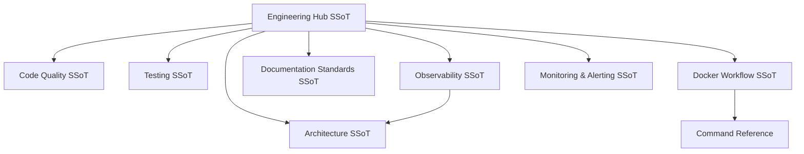

# Effectful Engineering Standards

> **Single Source of Truth (SSoT)** for navigating engineering practices, coding standards, and development workflows.

## Purpose

The **engineering/** directory contains **effectful-specific engineering standards** for building pure functional effect programs in Python. These documents define **HOW to implement** features following type safety, purity, and testing doctrines.

## SSoT Link Map

| What do you need? | SSoT Document |
|-------------------|---------------|
| Understand system design | [Architecture](architecture.md) |
| Write type-safe, pure code | [Code Quality](code_quality.md) |
| Test programs correctly | [Testing](testing.md) |
| Set up development environment | [Docker Workflow](docker_workflow.md) |
| Run quality checks | [Code Quality](code_quality.md#detection-and-enforcement) |
| Add metrics/observability | [Observability](observability.md) |
| Monitoring + alerting policy | [Monitoring & Alerting](monitoring_and_alerting.md) |
| Write documentation | [Documentation Standards](documentation_standards.md) |

## Core Standards

**[Architecture](architecture.md)** (569 lines)
- 5-layer architecture (Application → Runner → Composite → Interpreters → Infrastructure)
- Separation of concerns
- Effect system design decisions
- Why pure functional programming for Python

**[Code Quality](code_quality.md)** (Type safety + purity, consolidated)
- Eight type safety doctrines (zero escape hatches, ADTs over Optional, Result for errors, immutable/frozen dataclasses)
- Six purity doctrines (effects as data, yield-don't-call, exhaustive matches)
- Generator rules and anti-pattern routing
- Detection + remediation workflow (check-code, MyPy strict, link verification)

**[Testing](testing.md)** (3,659 lines)
- Test pyramid strategy (Unit → Integration → E2E)
- 22 test anti-patterns with examples
- Generator testing patterns
- Zero skipped tests policy

**[Docker Workflow](docker_workflow.md)** (438 lines)
- Docker-only development policy
- Container architecture
- Named volumes vs bind mounts
- Forbidden local commands
- Why Docker for all operations

## Development Guides

**[Documentation Guidelines](documentation_standards.md)** (500+ lines)
- SSoT (Single Source of Truth) enforcement
- DRY (Don't Repeat Yourself) principles
- Mermaid diagram best practices (GitHub + VSCode compatibility)
- Cross-reference management
- Document templates (engineering, tutorial, API)
- Writing style guidelines

**[Command Reference](command_reference.md)** (120 lines)
- All Docker compose commands
- Test execution patterns
- Test statistics (329 tests, ~1.6s execution)
- Output capture techniques

**[Code Quality](code_quality.md)** (combined)
- check-code workflow (Black → MyPy → doc link verification)
- Universal success criteria
- Purity + type safety doctrines and generators
- Anti-pattern routing and remediation

**[Development Workflow](development_workflow.md)** (150 lines)
- Daily development loop
- Adding new effects (9-step procedure)
- Adding new domain models (5-step procedure)
- Database management
- Integration test setup

**[Configuration](configuration.md)** (50 lines)
- Environment variables for all services
- PostgreSQL configuration
- Redis configuration
- MinIO S3 configuration
- Apache Pulsar configuration

**[Effect Patterns](effect_patterns.md)** (200 lines)
- Generator-based DSL pattern
- Fail-fast error propagation
- Composing programs with yield from
- Recording metrics without failing on errors
- Real-world code examples

## Observability Standards

**[Observability](observability.md)** (710 lines)
- Metrics philosophy (dual-layer architecture)
- Recording vs alerting separation
- Cardinality management
- What to measure and why

**[Monitoring & Alerting](monitoring_and_alerting.md)** (combined)
- Metric naming conventions, label standards, default framework metrics
- Cardinality rules and registry pattern
- Alert severity levels, runbook requirements, routing patterns
- Alert/PromQL testing expectations

## Relationship to Other Documentation

### Engineering → Tutorials
- **Engineering** defines standards and patterns (HOW)
- **Tutorials** teach how to apply them step-by-step (LEARN)
- Example: [Code Quality](code_quality.md) (standard) → [tutorials/03_adts_and_results.md](../tutorials/03_adts_and_results.md) (tutorial)

### Engineering → API
- **Engineering** explains architectural decisions (WHY)
- **API** documents specific functions and types (WHAT)
- Example: [Architecture](architecture.md) (design) → [api/programs.md](../api/programs.md) (reference)

### Engineering → Contributing
- **Engineering** defines what is required
- **[Contributing](../CONTRIBUTING.md)** explains the contribution process
- Both must be satisfied for pull requests

## Philosophy

> **Make invalid states unrepresentable through the type system.**

All engineering decisions flow from this principle. Every standard, pattern, and anti-pattern serves to eliminate entire classes of bugs at compile time rather than runtime.

### Core Principles

1. **Type Safety First**: If it type-checks with MyPy strict, it's likely correct
2. **Purity by Default**: Effects as data, not execution
3. **Test to Find Problems**: Tests exist to catch bugs, not provide false confidence
4. **DRY Documentation**: Link liberally, duplicate never
5. **SSoT Enforcement**: Each piece of knowledge lives in exactly one place

## Document Status

**Total**: 16 engineering documents (8 core + 8 guides)
**Lines of Code**: ~9,000 lines of engineering documentation
**Last Major Update**: 2025-11-29 (documentation refactor - moved from core/)

All engineering documents marked with "**SSoT**" are authoritative. When conflicts arise between documents, SSoT documents take precedence.

## Meta-Documentation

**How to update these standards:**
1. Read [Documentation Guidelines](documentation_standards.md) for standards
2. Make changes to appropriate SSoT document
3. Update "Last Updated" timestamp
4. Update "Referenced by" list if adding new cross-references
5. Run link verification: `python tools/verify_links.py`
6. Create pull request (see [Contributing](../CONTRIBUTING.md))

**Naming convention**: All files lowercase with underscores, descriptive names (e.g., `code_quality.md` not `types.md`)

## See Also

- **[Documentation Hub](../README.md)** - Complete documentation index (tutorials + API + engineering)
- **[Contributing Guide](../CONTRIBUTING.md)** - How to contribute to effectful
- **[Main README](../../README.md)** - Project overview and quickstart

---

**Last Updated**: 2025-12-01
**Document Count**: 18 engineering standards
**Status**: Authoritative engineering reference for effectful library
