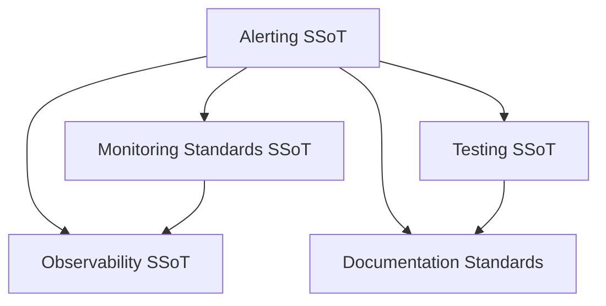
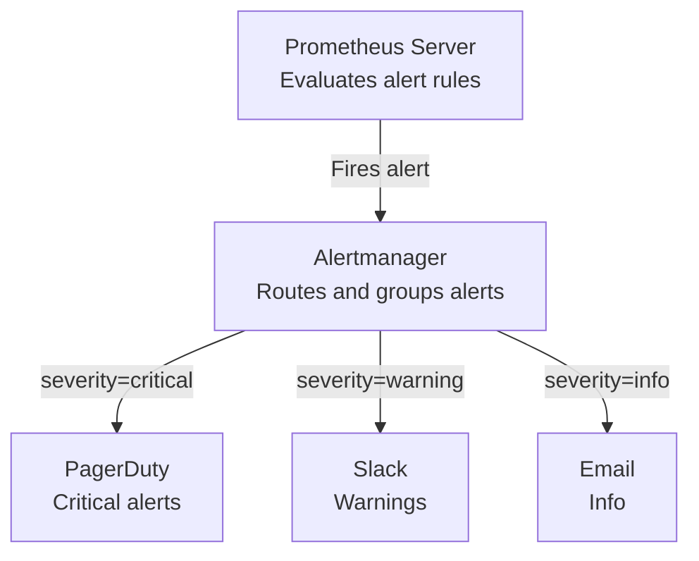

# Alerting

**effectful** - Alert rules, severity levels, and Prometheus Alertmanager integration.

This is the Single Source of Truth (SSoT) for effectful alerting policy, ensuring actionable, maintainable alerts across all applications.

## SSoT Link Map



| Need | Link |
|------|------|
| Metric pipeline architecture | [Observability](observability.md) |
| Naming + label rules | [Monitoring Standards](monitoring_standards.md) |
| Test alerts and runbooks | [Testing](testing.md#part-5-testing-patterns) |
| Documentation expectations | [Documentation Standards](documentation_standards.md) |

## Overview

Alerts are your production safety net. Too few alerts and you miss critical issues. Too many and they become noise. This doctrine establishes clear standards for when, why, and how to alert.

**Core Principles:**
1. **Alerts as Code** - All alert rules version-controlled, reviewed, tested
2. **Actionable Only** - Every alert requires a response action
3. **Severity-Driven Routing** - Critical alerts page on-call, warnings email
4. **Self-Documenting** - Alert descriptions include runbooks and context
5. **Test Everything** - Alert expressions validated like any other code

---

## Alerting Philosophy

### Alerts vs Metrics

**Metrics** = Continuous observation (always collected, no action required)

**Alerts** = Exception notification (action required when threshold crossed)

```python
# Metric - Always collected, no action
effectful_effect_duration_seconds{effect_type="GetUserById"}

# Alert - Fires when metric crosses threshold
alert: SlowDatabaseQueries
expr: histogram_quantile(0.95, rate(effectful_effect_duration_seconds_bucket{effect_type=~"Get.*"}[5m])) > 1.0
```

**When to Create an Alert:**
- ✅ System down / degraded performance
- ✅ SLO violation (error rate, latency)
- ✅ Resource exhaustion (disk, memory, connections)
- ✅ Security event (failed auth attempts, HIPAA violations)
- ❌ Informational metrics (request counts, cache hit rates)
- ❌ Expected failures (retryable errors, client timeouts)

### Alerts as Code

All alert rules live in version control:

```yaml
# docker/prometheus/alerts.yml
groups:
  - name: effectful_slo_alerts
    interval: 30s
    rules:
      - alert: HighEffectErrorRate
        expr: |
          sum(rate(effectful_effects_total{result="error"}[5m]))
          /
          sum(rate(effectful_effects_total[5m]))
          > 0.05
        for: 5m
        labels:
          severity: critical
          component: effect_system
        annotations:
          summary: "High effect error rate detected"
          description: "Effect error rate is {{ $value | humanizePercentage }} (threshold: 5%)"
          runbook_url: "https://docs.effectful.dev/runbooks/high-error-rate"
```

**Benefits:**
- Code review catches mistakes
- Git history shows alert evolution
- Rollback bad alert changes
- Test alert expressions in CI

---

## Severity Levels

effectful uses three severity levels, aligned with Prometheus/Alertmanager standards:

### Critical - Immediate Action Required

**Characteristics:**
- Pages on-call engineer immediately
- SLO breach or imminent service degradation
- Requires human intervention within minutes
- Resolution tracked in incident report

**Examples:**
- Effect error rate > 5% for 5 minutes
- Database connection pool exhausted
- Disk usage > 90%
- Critical HIPAA violation (unauthorized access)

**Routing:**
```yaml
route:
  receiver: pagerduty-critical
  matchers:
    - severity =~ "critical"
```

### Warning - Action Required Soon

**Characteristics:**
- Email or Slack notification
- Degraded performance but service operational
- Requires investigation within hours
- May escalate to critical if unresolved

**Examples:**
- Effect p95 latency > 2 seconds for 10 minutes
- Cache hit rate < 80%
- Unreviewed critical lab results > 1 hour old
- Failed prescription interaction checks

**Routing:**
```yaml
route:
  receiver: slack-warnings
  matchers:
    - severity =~ "warning"
```

### Info - FYI Notification

**Characteristics:**
- Informational only, no immediate action
- Dashboard / metrics anomaly detection
- Investigation during business hours
- May indicate future issues

**Examples:**
- New deployment detected
- Unusual traffic pattern
- Scheduled maintenance window

**Routing:**
```yaml
route:
  receiver: slack-info
  matchers:
    - severity =~ "info"
```

---

## Alert Rule Patterns

### 1. Effect Error Rate Alert

**Purpose**: Detect when too many effects are failing

```yaml
- alert: HighEffectErrorRate
  expr: |
    sum(rate(effectful_effects_total{result="error"}[5m]))
    /
    sum(rate(effectful_effects_total[5m]))
    > 0.05
  for: 5m
  labels:
    severity: critical
    component: effect_system
  annotations:
    summary: "High effect error rate detected"
    description: "Effect error rate is {{ $value | humanizePercentage }} (threshold: 5%)"
    runbook_url: "https://docs.effectful.dev/runbooks/high-error-rate"
```

**Rationale:**
- 5% error rate = likely infrastructure issue
- 5-minute window = avoids false positives from spikes
- `for: 5m` = must be sustained for 5 minutes before firing

**Action Items:**
1. Check recent deployments
2. Review interpreter error logs
3. Verify database/cache/storage connectivity
4. Check resource utilization (CPU, memory, connections)

### 2. Slow Effect Execution Alert

**Purpose**: Detect latency regressions

```yaml
- alert: SlowEffectExecution
  expr: |
    histogram_quantile(0.95,
      sum by (effect_type, le) (
        rate(effectful_effect_duration_seconds_bucket[5m])
      )
    ) > 5.0
  for: 10m
  labels:
    severity: warning
    component: effect_system
  annotations:
    summary: "Slow effect execution detected"
    description: "P95 effect duration is {{ $value }}s for {{ $labels.effect_type }} (threshold: 5s)"
    runbook_url: "https://docs.effectful.dev/runbooks/slow-effects"
```

**Rationale:**
- p95 > 5s = significant tail latency
- 10-minute window = distinguishes from transient slowness
- Warning (not critical) = service still operational

**Action Items:**
1. Identify which effect_type is slow
2. Check database query plans (if DB effect)
3. Review cache hit rates (if cache effect)
4. Check external API latency (if HTTP effect)

### 3. Database Connection Pool Exhaustion

**Purpose**: Prevent cascading failures from connection exhaustion

```yaml
- alert: DatabaseConnectionPoolExhaustion
  expr: |
    (
      sum(pg_stat_database_numbackends{datname="effectful"})
      /
      sum(pg_settings_max_connections)
    ) > 0.90
  for: 5m
  labels:
    severity: critical
    component: database
  annotations:
    summary: "Database connection pool nearly exhausted"
    description: "{{ $value | humanizePercentage }} of connections in use (threshold: 90%)"
    runbook_url: "https://docs.effectful.dev/runbooks/db-connection-exhaustion"
```

**Rationale:**
- 90% usage = at risk of connection errors
- 5-minute sustained = not a transient spike
- Critical severity = can cause service outage

**Action Items:**
1. Check for connection leaks (unclosed connections)
2. Review database connection timeout settings
3. Scale up max_connections (if legitimate load increase)
4. Identify slow queries holding connections

### 4. Cache Hit Rate Degradation

**Purpose**: Detect cache effectiveness issues

```yaml
- alert: LowCacheHitRate
  expr: |
    sum(rate(effectful_cache_hits_total[10m]))
    /
    sum(rate(effectful_cache_requests_total[10m]))
    < 0.80
  for: 15m
  labels:
    severity: warning
    component: cache
  annotations:
    summary: "Cache hit rate below threshold"
    description: "Cache hit rate is {{ $value | humanizePercentage }} (threshold: 80%)"
    runbook_url: "https://docs.effectful.dev/runbooks/low-cache-hit-rate"
```

**Rationale:**
- 80% hit rate = significant cache misses
- 15-minute window = avoids cold-start false positives
- Warning severity = performance impact, not outage

**Action Items:**
1. Check cache size / eviction rate
2. Review TTL settings
3. Verify cache warming after deployments
4. Analyze cache key distribution

---

## HealthHub Alert Examples

### HIPAA Violation: Unauthorized Access

**Purpose**: Alert on potential HIPAA violations

```yaml
- alert: UnauthorizedPatientDataAccess
  expr: |
    sum(increase(healthhub_audit_events_total{
      event_type="patient_data_accessed",
      authorization_result="unauthorized"
    }[5m])) > 0
  for: 1m
  labels:
    severity: critical
    component: security
    compliance: hipaa
  annotations:
    summary: "Unauthorized patient data access detected"
    description: "{{ $value }} unauthorized access attempts in last 5 minutes"
    runbook_url: "https://healthhub.internal/runbooks/hipaa-violation"
    compliance_requirement: "HIPAA Security Rule §164.308(a)(1)(ii)(D)"
```

**Rationale:**
- Any unauthorized access = potential breach
- 1-minute `for` = immediate notification
- Critical severity = compliance violation

**Action Items:**
1. Identify user_id and patient_id from audit logs
2. Suspend user access immediately
3. Notify security team
4. Document incident per HIPAA breach notification rules

### Critical Lab Results Unreviewed

**Purpose**: Ensure timely review of critical lab values

```yaml
- alert: CriticalLabResultsUnreviewed
  expr: |
    sum(healthhub_unreviewed_critical_results_current{age_bucket=~"6_24h|24h_plus"}) > 0
  for: 30m
  labels:
    severity: critical
    component: clinical
  annotations:
    summary: "Critical lab results unreviewed for >6 hours"
    description: "{{ $value }} critical lab results awaiting review"
    runbook_url: "https://healthhub.internal/runbooks/critical-lab-review"
```

**Rationale:**
- Critical values > 6 hours old = patient safety risk
- 30-minute `for` = allows time for doctor review
- Critical severity = requires immediate action

**Action Items:**
1. Page on-call physician
2. Review specific lab results
3. Contact patient if necessary
4. Document review in patient chart

### Medication Interaction Detected

**Purpose**: Alert on high-severity drug interactions

```yaml
- alert: HighSeverityMedicationInteraction
  expr: |
    sum(increase(healthhub_medication_interactions_detected_total{
      severity="high"
    }[5m])) > 0
  for: 1m
  labels:
    severity: warning
    component: clinical
  annotations:
    summary: "High-severity medication interaction detected"
    description: "{{ $value }} high-severity interactions in last 5 minutes"
    runbook_url: "https://healthhub.internal/runbooks/medication-interactions"
```

**Rationale:**
- High severity = potential adverse effects
- 1-minute `for` = quick notification
- Warning (not critical) = pharmacist intervention required, not emergency

**Action Items:**
1. Review prescription details
2. Contact prescribing physician
3. Recommend alternative medications
4. Document interaction in patient record

---

## Alert Routing

Alerts flow through Prometheus → Alertmanager → Notification Channels:



### Alertmanager Configuration

```yaml
# docker/prometheus/alertmanager.yml
global:
  slack_api_url: 'https://hooks.slack.com/services/XXX'
  pagerduty_url: 'https://events.pagerduty.com/v2/enqueue'

route:
  receiver: 'slack-warnings'
  group_by: ['alertname', 'component']
  group_wait: 30s
  group_interval: 5m
  repeat_interval: 4h

  routes:
    # Critical alerts → PagerDuty
    - matchers:
        - severity =~ "critical"
      receiver: pagerduty-critical
      group_wait: 10s
      repeat_interval: 5m

    # Warning alerts → Slack
    - matchers:
        - severity =~ "warning"
      receiver: slack-warnings

    # Info alerts → Email
    - matchers:
        - severity =~ "info"
      receiver: email-info

receivers:
  - name: 'pagerduty-critical'
    pagerduty_configs:
      - service_key: '<PAGERDUTY_SERVICE_KEY>'
        description: '{{ .GroupLabels.alertname }}: {{ .CommonAnnotations.summary }}'

  - name: 'slack-warnings'
    slack_configs:
      - channel: '#alerts-warnings'
        title: '{{ .GroupLabels.alertname }}'
        text: '{{ .CommonAnnotations.description }}'

  - name: 'email-info'
    email_configs:
      - to: 'team@healthhub.com'
        from: 'alerts@healthhub.com'
        subject: '{{ .GroupLabels.alertname }}'
```

### Grouping and Throttling

**Grouping** - Combine related alerts into single notification:

```yaml
group_by: ['alertname', 'component']
# All "HighEffectErrorRate" alerts for "database" component → 1 notification
```

**Group Wait** - Wait before sending first notification (allow batching):

```yaml
group_wait: 30s
# Wait 30s after first alert in group before notifying
```

**Group Interval** - Wait before sending updates:

```yaml
group_interval: 5m
# Send updates every 5 minutes if alerts still firing
```

**Repeat Interval** - Wait before re-notifying:

```yaml
repeat_interval: 4h
# Re-send notification every 4 hours if alert still active
```

---

## Testing Alerts

### Unit Testing Alert Expressions

Test PromQL expressions without running Prometheus:

```python
import pytest
from promql_parser import parse

def test_high_effect_error_rate_expression() -> None:
    """Test alert expression parses correctly."""
    expr = """
    sum(rate(effectful_effects_total{result="error"}[5m]))
    /
    sum(rate(effectful_effects_total[5m]))
    > 0.05
    """

    # Parse expression
    parsed = parse(expr)

    # Verify components
    assert "effectful_effects_total" in expr
    assert 'result="error"' in expr
    assert "[5m]" in expr
    assert "> 0.05" in expr
```

### Integration Testing with Prometheus

Test alerts fire correctly with test data:

```python
@pytest.mark.integration
async def test_high_error_rate_alert_fires() -> None:
    """Test alert fires when error rate exceeds threshold."""

    # Generate high error rate (10% errors)
    for _ in range(100):
        yield IncrementCounter(
            metric_name="effectful_effects_total",
            labels={"effect_type": "TestEffect", "result": "ok"},
            value=1.0,
        )

    for _ in range(10):
        yield IncrementCounter(
            metric_name="effectful_effects_total",
            labels={"effect_type": "TestEffect", "result": "error"},
            value=1.0,
        )

    # Wait for Prometheus to scrape
    await asyncio.sleep(15)

    # Query Prometheus API for active alerts
    response = await prometheus_client.get_alerts()

    # Verify alert fired
    active_alerts = [a for a in response["data"]["alerts"] if a["state"] == "firing"]
    assert any(a["labels"]["alertname"] == "HighEffectErrorRate" for a in active_alerts)
```

### Runbook Validation

Ensure every critical/warning alert has a runbook:

```python
import yaml

def test_all_alerts_have_runbooks() -> None:
    """Verify all critical/warning alerts have runbook_url."""
    with open("docker/prometheus/alerts.yml") as f:
        alerts = yaml.safe_load(f)

    for group in alerts["groups"]:
        for rule in group["rules"]:
            if "alert" not in rule:
                continue  # Recording rule, not alert

            severity = rule["labels"].get("severity")
            if severity in ("critical", "warning"):
                annotations = rule.get("annotations", {})
                assert "runbook_url" in annotations, (
                    f"Alert {rule['alert']} (severity={severity}) missing runbook_url"
                )
```

---

## Alert Naming Conventions

Follow consistent naming for discoverability:

```yaml
# Pattern: <State><Component><Condition>
# Examples:
- alert: HighEffectErrorRate          # High (state) + Effect (component) + Error Rate (condition)
- alert: LowCacheHitRate              # Low (state) + Cache (component) + Hit Rate (condition)
- alert: DatabaseConnectionPoolFull   # Full (state) + DatabaseConnectionPool (component)
- alert: SlowEffectExecution          # Slow (state) + Effect (component) + Execution (condition)
```

**States**: High, Low, Slow, Fast, Full, Empty, Down, Degraded, Failing

**Components**: Effect, Database, Cache, Program, WebSocket, Storage, Messaging

**Conditions**: ErrorRate, Latency, Duration, HitRate, Usage, Count

---

## Cross-References

> **Core Doctrine**: For observability architecture, see [observability.md](./observability.md)

> **Core Doctrine**: For testing strategies, see [testing.md](./testing.md)

---

## See Also

- [Observability](./observability.md) - Metrics philosophy and architecture
- [Monitoring Standards](./monitoring_standards.md) - Metric naming and labeling
- [Alert Rules Tutorial](../tutorials/14_alert_rules.md) - Writing Prometheus alert rules
- [Grafana Dashboards](../tutorials/15_grafana_dashboards.md) - Visualizing metrics

---

**Status**: Single Source of Truth (SSoT) for alerting policy
**Last Updated**: 2025-12-01
**Referenced by**: observability.md, monitoring_standards.md, README.md
