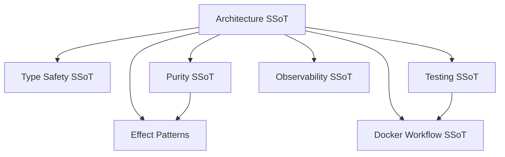
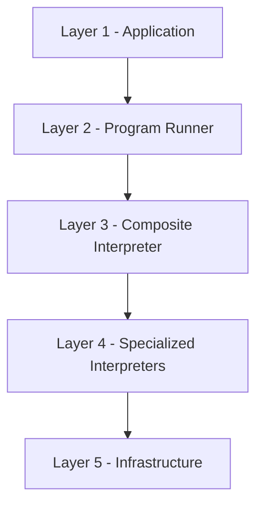
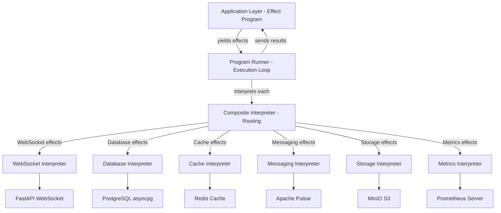
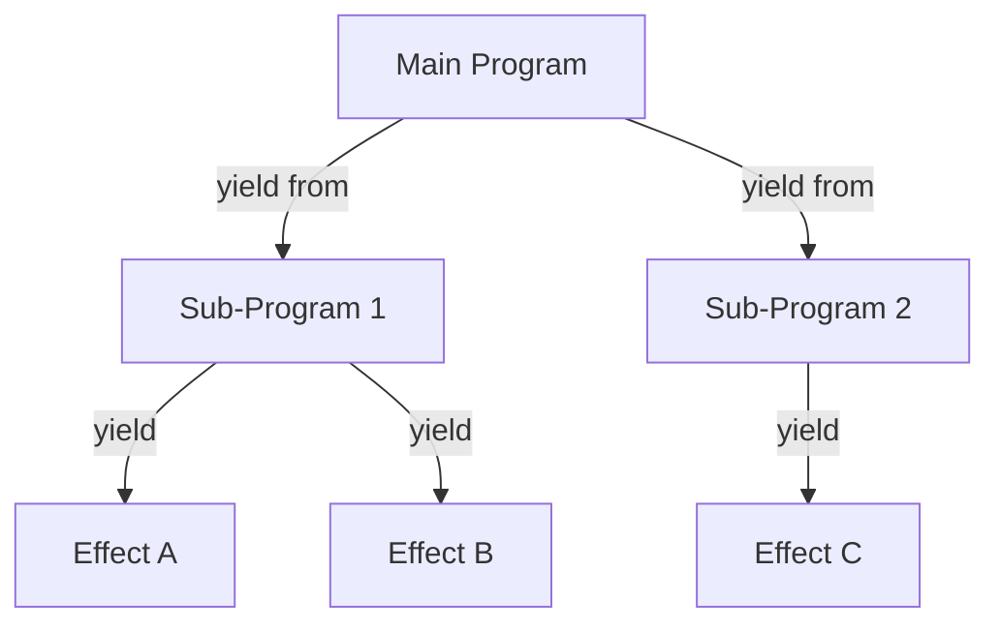
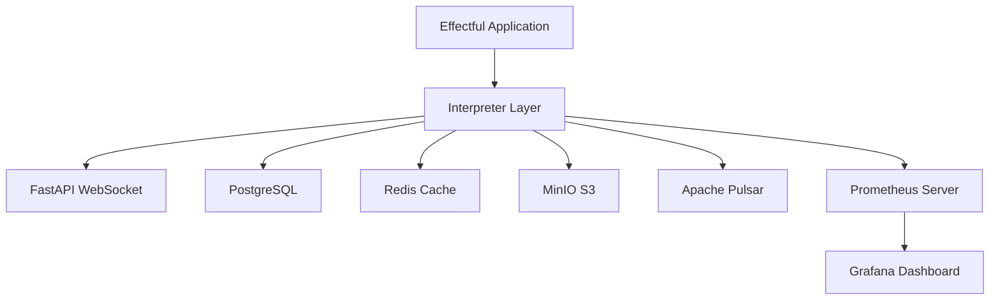
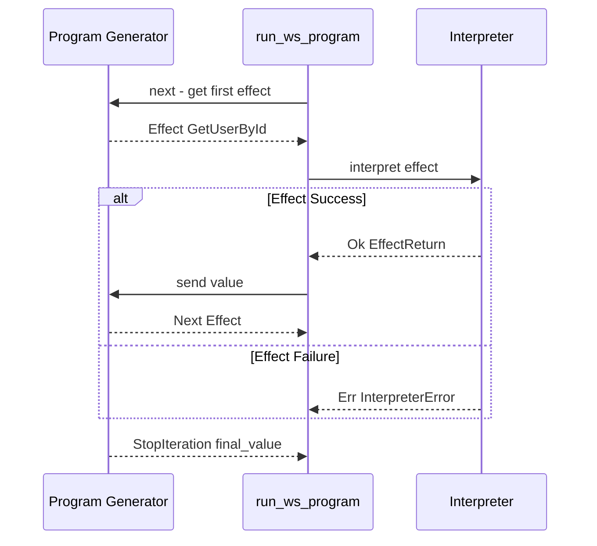
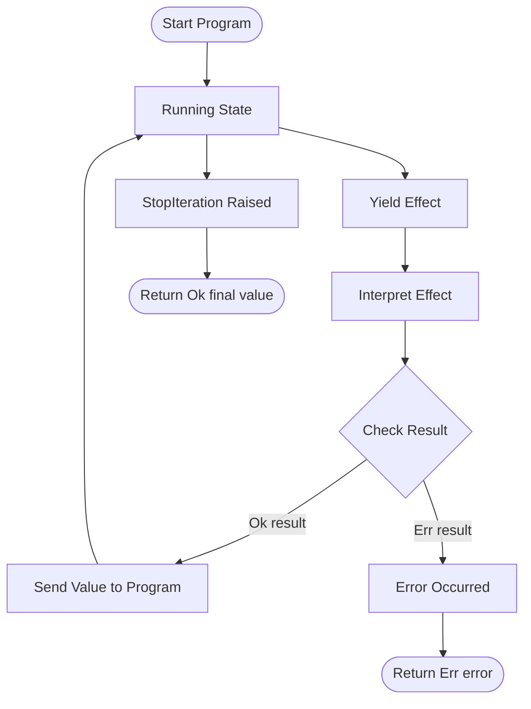

# Architecture

**effectful** - A pure functional effect system for Python with algebraic data types and explicit error handling.

This is the Single Source of Truth (SSoT) for the Effectful architecture.

## SSoT Link Map



| Need | Link |
|------|------|
| Doctrine for types + purity | [Code Quality](code_quality.md) |
| Purity boundaries | [Code Quality](code_quality.md#purity-doctrines) |
| Test shape by layer | [Testing](testing.md#part-4-four-layer-testing-architecture) |
| Observability guidance | [Observability](observability.md) |
| Container contract | [Docker Workflow](docker_workflow.md) |
| Effect composition examples | [Effect Patterns](effect_patterns.md) |

## Design Philosophy

### Make Invalid States Unrepresentable

The core principle: If your program compiles with `mypy --strict`, it should be correct.

We achieve this through:
1. **Algebraic Data Types (ADTs)** - Model all possible states explicitly
2. **Result Type** - Make errors visible in type signatures
3. **Immutability** - Eliminate temporal coupling and race conditions
4. **Exhaustive Matching** - Type checker enforces handling all cases

For detailed type safety patterns, see `documents/engineering/code_quality.md`.

## 5-Layer Architecture



**Layer Responsibilities:**

| Layer | Component | Responsibility |
|-------|-----------|----------------|
| 1 | Application | Pure effect programs (business logic as generators) |
| 2 | Program Runner | Execution engine (generator protocol, fail-fast semantics) |
| 3 | Composite Interpreter | Effect routing (pattern matching to specialized handlers) |
| 4 | Specialized Interpreters | Infrastructure integration (WebSocket, Database, Cache, Messaging, Storage, Auth, Metrics) |
| 5 | Infrastructure | External systems (PostgreSQL, Redis, FastAPI, Apache Pulsar, AWS S3, JWT auth, Prometheus, or test fakes) |

**Key Properties:**
- **Unidirectional flow**: Data flows down through layers, results flow back up
- **Separation of concerns**: Each layer has single responsibility
- **Testability**: Replace Layer 5 with fakes for unit tests
- **Type safety**: All boundaries have explicit Result types

### Visual Data Flow



**Key Points:**
- Programs yield effects (pure data) to the runner
- Runner calls interpreter for each effect
- Composite interpreter routes to specialized handlers
- Specialized interpreters interact with infrastructure
- Results flow back up through the same path (fail-fast on errors)

---

## Core Abstractions

### 1. Effects (Data Structures)

Effects are **pure data** - they describe what should happen, not how to do it.

```python
@dataclass(frozen=True)
class SendText:
    """Effect: Send text message over WebSocket."""
    text: str

@dataclass(frozen=True)
class GetUserById:
    """Effect: Look up user by ID."""
    user_id: UUID
```

**Why frozen dataclasses?**
- Immutable - can't be modified after creation
- Hashable - can be used in sets, dict keys
- Thread-safe - no race conditions
- Clear intent - "this is data, not behavior"

### 2. Result Type (Explicit Error Handling)

```python
@dataclass(frozen=True)
class Ok[T]:
    """Success case containing value."""
    value: T

@dataclass(frozen=True)
class Err[E]:
    """Failure case containing error."""
    error: E

type Result[T, E] = Ok[T] | Err[E]
```

**Why not exceptions?**
- Errors are **visible in type signatures**
- Cannot forget to handle errors (type checker enforces)
- Errors can be transformed, composed, logged
- No invisible control flow (no try/except archaeology)

### 3. Algebraic Data Types (Domain Modeling)

ADTs use type unions to represent "one of these cases" explicitly.

```python
@dataclass(frozen=True)
class UserFound:
    user: User
    source: str  # "database" | "cache"

@dataclass(frozen=True)
class UserNotFound:
    user_id: UUID
    reason: str  # "does_not_exist" | "deleted" | "access_denied"

type UserLookupResult = UserFound | UserNotFound
```

**Benefits:**
- Impossible to forget cases (exhaustive matching)
- Self-documenting (all states explicit)
- Refactoring-friendly (add new case -> type errors guide you)

### 4. Generator-Based Programs

Programs are generators that yield effects and receive results.

```python
from collections.abc import Generator

def greet_user(user_id: UUID) -> Generator[AllEffects, EffectResult, str]:
    # Yield effect, receive typed result
    user_result = yield GetUserById(user_id=user_id)

    match user_result:
        case UserNotFound(reason=reason):
            yield SendText(text=f"User not found: {reason}")
            return "error"
        case User(name=name):
            yield SendText(text=f"Hello {name}!")
            return "success"
```

**Why generators?**
- **Separation of concerns**: Program describes what (effects), interpreter decides how (execution)
- **Composability**: Use `yield from` to call sub-programs
- **Testability**: Swap real interpreter for fake
- **Type safety**: Return type preserved (`Generator[..., ..., str]` -> runner returns `Result[str, E]`)

### 5. Interpreters (Effect Handlers)

Interpreters execute effects against real or fake infrastructure.

```python
class WebSocketInterpreter:
    def __init__(self, connection: WebSocketConnection):
        self._connection = connection

    async def interpret(self, effect: WebSocketEffect) -> Result[EffectReturn, WebSocketClosedError]:
        match effect:
            case SendText(text=text):
                if not await self._connection.is_open():
                    return Err(WebSocketClosedError(...))
                await self._connection.send_text(text)
                return Ok(EffectReturn(value=None, effect_name="SendText"))
```

**Production interpreter**: Uses real WebSocket connection (FastAPI, asyncio)
**Test interpreter**: Uses pytest-mock AsyncMock

### WebSocket Security Pattern
- Use **one-time tickets**: issue a short-lived JWT (aud = `ws`) and store `jti` in Redis; consume with `GETDEL` on connect to enforce single use.
- Enforce **origin allowlist** and `wss://` only; reject upgrades from unknown origins in middleware.
- Apply **defense-in-depth**: ticket validation → server-side channel authorization (deny by default) → per-connection/user/global rate limits.
- Set CSP `connect-src` to the explicit WebSocket endpoints to block exfiltration.
- Treat WebSocket interpreters like any other I/O: return typed errors (e.g., `WebSocketClosedError`) and keep programs pure.

---

## Effect Type Hierarchy

```mermaid
flowchart TB
    AllEffects[AllEffects Union Type]
    WebSocket[WebSocketEffect]
    Database[DatabaseEffect]
    Cache[CacheEffect]
    Messaging[MessagingEffect]
    Storage[StorageEffect]
    Auth[AuthEffect]
    Metrics[MetricsEffect]

    AllEffects --> WebSocket
    AllEffects --> Database
    AllEffects --> Cache
    AllEffects --> Messaging
    AllEffects --> Storage
    AllEffects --> Auth
    AllEffects --> Metrics

    WebSocket --> SendText[SendText]
    WebSocket --> ReceiveText[ReceiveText]
    WebSocket --> CloseConnection[CloseConnection]

    Database --> GetUserById[GetUserById]
    Database --> SaveChatMessage[SaveChatMessage]
    Database --> GetChatMessages[GetChatMessages]

    Cache --> GetCachedProfile[GetCachedProfile]
    Cache --> PutCachedProfile[PutCachedProfile]
    Cache --> DeleteCachedProfile[DeleteCachedProfile]

    Metrics --> IncrementCounter[IncrementCounter]
    Metrics --> RecordGauge[RecordGauge]
    Metrics --> ObserveHistogram[ObserveHistogram]
```



**Key Properties:**
- **Union type**: `AllEffects = WebSocketEffect | DatabaseEffect | CacheEffect | ...`
- **Pattern matching**: Composite interpreter routes based on effect type
- **Extensible**: Add new effect categories by extending the union

---

## Program Composition



**Composition Patterns:**
- **Sequential**: `yield effect1; yield effect2`
- **Delegation**: `result = yield from sub_program()`
- **Conditional**: `match result: case Ok(...): yield effect`

```python
def main_workflow(user_id: UUID) -> Generator[AllEffects, EffectResult, str]:
    # Delegate to sub-program
    profile = yield from lookup_and_cache_profile(user_id)

    # Sequential effects
    yield SendText(text=f"Welcome {profile.name}")
    message = yield SaveChatMessage(user_id=user_id, text="Logged in")

    return "success"
```

---

## Infrastructure Topology



**Infrastructure Services:**

| Service | Protocol | Purpose |
|---------|----------|---------|
| FastAPI WebSocket | WebSocket | Real-time client communication |
| PostgreSQL | asyncpg | Persistent data storage |
| Redis | aioredis | Caching and session storage |
| MinIO S3 | S3 API | File and object storage |
| Apache Pulsar | Pulsar client | Pub/sub messaging |
| Prometheus | HTTP | Metrics collection and monitoring |
| Grafana | HTTP | Metrics visualization and alerting |

**Testing Strategy:**
- **Unit tests**: All services mocked with pytest-mock
- **Integration tests**: Real Docker containers for each service

---

## Effect Execution Flow



**Key Behavior:**
- Runner uses `next()` to get the first effect from the program
- For each effect, runner calls `interpreter.interpret(effect)`
- On success (`Ok`), runner sends the value back to the program using `send()`
- On failure (`Err`), runner immediately returns the error (fail-fast semantics)
- When program completes (`StopIteration`), runner returns `Ok(final_value)`

---

## Error Propagation



**Critical Properties:**
- **Fail-Fast**: First error immediately stops execution and returns `Err`
- **No Cleanup**: Program does not continue after error (no finally blocks)
- **No Retry**: Errors are returned as-is (retry logic in application layer)
- **Deterministic**: Same error at same point always produces same result

---

## Design Decisions

### Why Generators Instead of Monads?

**Chose generators** because:
1. Native Python feature (no library needed)
2. Familiar syntax (looks like regular async code)
3. Type checker understands them
4. Excellent IDE support
5. No performance overhead (compared to monad transformers)

**Tradeoff**: Less compositional than monads, but easier to learn and use.

### Why Result Type Instead of Exceptions?

**Exceptions are invisible** - errors not in type signatures.

**Result type makes errors visible** - type checker enforces error handling.

**Benefits:**
- Type checker enforces error handling
- No try/except archaeology
- Errors can be transformed, logged, retried
- Fail-fast semantics (first error stops program)

### Why Frozen Dataclasses Instead of NamedTuples?

**Frozen dataclasses**:
- Better IDE support (type hints, docstrings)
- Clearer syntax (`@dataclass(frozen=True)`)
- Can have methods
- More Pythonic

### Why Composite Interpreter Instead of Monad Transformers?

**Benefits:**
- Simple delegation (no transformer stack)
- Easy to add new effect types
- Clear error handling (each interpreter returns Result)
- Type-safe (mypy validates effect routing)

### Why ADTs Instead of Optional?

**Optional is a code smell** - hides the reason for None.

**ADT is self-documenting** - all cases explicit with reasons.

**Benefits:**
- Forces caller to think about all cases
- Self-documenting (no comments needed)
- Refactoring-safe (add new case -> type errors guide you)

---

## Performance Considerations

### Immutability Cost

**Reality**: Python's garbage collector handles short-lived objects efficiently. Cost is negligible compared to I/O.

- Mutable update: ~50ns
- Frozen dataclass creation: ~150ns
- Database query: ~1-10ms (10,000-100,000x slower)

**Conclusion**: Correctness > micro-optimization. I/O dominates.

### Generator Overhead

**Reality**: Overhead is constant (~100ns per effect), I/O dominates.

- Program with 10 effects: ~1us overhead
- Same program with real DB/WebSocket: ~10-100ms

### Result Type Overhead

**Reality**: Branching is fast (~1ns), I/O dominates.

**Conclusion**: Result type is faster for error cases.

---

## Migration Guide

### From Imperative to Functional

**Before** (imperative, exceptions):
```python
async def greet_user(websocket: WebSocket, db: AsyncSession, user_id: UUID):
    # Tightly coupled to infrastructure
    user = await db.execute(select(User).where(User.id == user_id))
    if not user:
        await websocket.send_text("User not found")
        return
    await websocket.send_text(f"Hello {user.name}!")
```

**After** (functional, effects):
```python
def greet_user(user_id: UUID) -> Generator[AllEffects, EffectResult, None]:
    # Pure program, testable without infrastructure
    user_result = yield GetUserById(user_id=user_id)

    match user_result:
        case None:
            yield SendText(text="User not found")
            return
        case User(name=name):
            yield SendText(text=f"Hello {name}!")
```

**Benefits:**
- Testable without database/WebSocket
- Type-safe (all effects explicit)
- Composable (can call from other programs)
- Error handling enforced by type system

---

## Future Extensions

### Planned Features

1. **Parallel Effects** - Execute multiple effects concurrently
2. **Effect Retries** - Automatic retry with backoff
3. **Effect Timeouts** - Timeout wrapper for effects
4. **Effect Logging** - Automatic structured logging

### Non-Goals

- **Not a web framework** - Works with FastAPI/Flask/etc.
- **Not an ORM** - Use SQLAlchemy/asyncpg/etc.
- **Not a task queue** - Use Celery/Dramatiq/etc.
- **Not a reactive framework** - Use RxPY/aioreactive/etc.

---

## Related Documentation

- **Code Quality**: `documents/engineering/code_quality.md`
- **Testing**: `documents/engineering/testing.md` (SSoT for all testing)
- **Observability**: `documents/engineering/observability.md` (SSoT for metrics, monitoring, and alerting)
- **Test Suite Audit**: `documents/testing/test_suite_audit.md`
- **API Reference**: `documents/api/`

---

## References

- **Algebraic Effects**: Research papers on effect systems
- **Result Type**: Rust's `Result<T, E>`, Haskell's `Either`
- **ADTs**: Haskell's sum types, TypeScript's discriminated unions
- **Generators**: PEP 255, PEP 342 (coroutines)
- **Type Safety**: Mypy strict mode, PEP 695 (generic type syntax)

---

**Philosophy**: Correctness first, performance second. Make invalid states unrepresentable.

**Last Updated:** 2025-12-01
**Supersedes**: none
**Referenced by**: README.md, CLAUDE.md, code_quality.md, testing.md, ../documentation_standards.md
