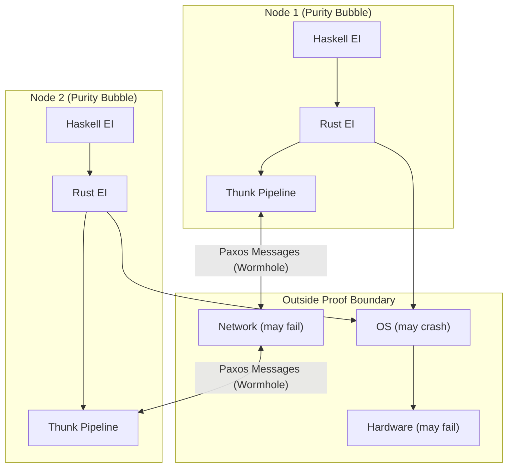

# Proof Boundary and Purity Boundary: Architectural Foundation

**Status**: Authoritative source
**Supersedes**: none
**Referenced by**: architecture.md, dsl/intro.md, code_quality.md

> **Purpose**: Define the two-boundary model that provides the architectural foundation for Effectful. This model replaces traditional layer-based architectures with a nested boundary approach that makes verification scope explicit.

______________________________________________________________________

## SSoT Link Map

| Need                      | Link                                             |
| ------------------------- | ------------------------------------------------ |
| Effectful overview        | [Effectful DSL Hub](../dsl/intro.md)             |
| Proof boundary philosophy | [Proof Boundary Essay](../dsl/proof_boundary.md) |
| JIT compilation           | [JIT Compilation](../dsl/jit.md)                 |
| System architecture       | [Architecture](architecture.md)                  |
| Code quality              | [Code Quality](code_quality.md)                  |
| Runner pattern            | [Runner Pattern](runner_pattern.md)              |

______________________________________________________________________

## 1. The Nested Boundary Model

### 1.1 Overview

The boundary model defines three concentric regions:

```mermaid
┌─────────────────────────────────────────────────────────────────────────┐
│                     OUTSIDE PROOF BOUNDARY                               │
│  Device drivers, proprietary APIs (iOS ARKit, CUDA, etc.), hardware      │
│  Assumptions documented explicitly; TLA+ proofs depend on them           │
│  (These assumptions may be wrong—they can never be proven)               │
└─────────────────────────────────────────────────────────────────────────┘
                                    │
                                    ▼
┌─────────────────────────────────────────────────────────────────────────┐
│                        PROOF BOUNDARY                                    │
│  TLA+ specifications, invariants, temporal properties                    │
│  Rust lives here: imperative, inside proof boundary, outside purity      │
│  Communicates with drivers/APIs; receives marching orders from Haskell   │
└─────────────────────────────────────────────────────────────────────────┘
                                    │
                                    ▼
┌─────────────────────────────────────────────────────────────────────────┐
│                       PURITY BOUNDARY                                    │
│  Haskell core logic with distributed compute graph optimization          │
│  Pure functional, deterministic, exhaustively testable                   │
│  Composes with distributed consensus state machines                      │
│  Byzantine security model replaces firewalls within this layer           │
└─────────────────────────────────────────────────────────────────────────┘
```

### 1.2 Why Boundaries Instead of Layers

Traditional layered architectures (N-tier, hexagonal, clean architecture) define responsibilities but not verification scope. The boundary model makes explicit:

1. **What can be formally verified** (inside proof boundary)
1. **What requires assumptions** (outside proof boundary)
1. **What is pure and deterministic** (inside purity boundary)

This enables:

- Clear responsibility for correctness claims
- Explicit documentation of unverifiable assumptions
- Language-appropriate implementation strategies

______________________________________________________________________

## 2. What Lives at Each Boundary

### 2.1 Outside Proof Boundary

**Components**:

- Device drivers (GPU, network, storage)
- Operating system services
- Proprietary APIs (iOS SDK, Android SDK, cloud provider APIs)
- Third-party libraries not built with formal methods
- Hardware behavior

**Characteristics**:

- Cannot be formally verified by our tools
- Behavior is assumed, not proven
- Assumptions must be documented explicitly
- Failures may be silent or unpredictable

**Documentation Requirement**:

```python
# assumption template
ASSUMPTION: [Component] behaves according to [specification]
DEPENDS ON: [Version requirements]
TLA+ PROPERTY: [Which TLA+ properties depend on this]
FAILURE MODE: [What happens if assumption is violated]
MITIGATION: [How we detect or recover from failures]
```

### 2.2 Proof Boundary (TLA+ Verifiable)

**Components**:

- TLA+ specifications and invariants
- Temporal properties (safety and liveness)
- Rust code that implements effect runners
- Protocol state machines
- Conformance tests

**Characteristics**:

- Formally specified in TLA+
- Model-checked for safety and liveness
- Imperative code is verified against specs
- All error paths are typed and exhaustive

**Language**: Rust (imperative, memory-safe, no GC)

**Responsibility**:

- Implement pure effect descriptions from Haskell
- Communicate with drivers and APIs
- Convert external errors to typed Result values
- Enforce resource bounds (timeouts, memory limits)

### 2.3 Purity Boundary (Innermost)

**Components**:

- Haskell DSL for business logic
- Compute graph construction and optimization
- Effect descriptions (pure values, not actions)
- Byzantine security model (threat modeling as types)
- Distributed consensus state machines (pure logic)

**Characteristics**:

- Pure functional (no side effects)
- Deterministic (same inputs → same outputs)
- Exhaustively testable
- Total (no partial functions, all cases handled)

**Language**: Haskell (pure, lazy, strong type system)

**Responsibility**:

- Express all business logic
- Optimize computation placement and ordering
- Make illegal security states unrepresentable
- Provide "marching orders" to Rust as pure effect descriptions

______________________________________________________________________

## 3. Language Assignment

### 3.1 Why This Mapping

| Boundary | Language | Rationale                                                          |
| -------- | -------- | ------------------------------------------------------------------ |
| Purity   | Haskell  | Compute graph optimization, pure effect descriptions, strong types |
| Proof    | Rust     | Memory safety, no GC (predictable latency), C FFI for drivers      |
| Outside  | Various  | Whatever the external component requires                           |

### 3.2 The Handoff

Haskell produces pure effect descriptions. Rust consumes them:

````haskell
-- Haskell: Pure effect description
data DbQuery = DbQuery
  { sql :: Text
  , params :: [Value]
  , mode :: QueryMode
  }

-- This is a VALUE, not an action
queryUser :: UserId -> DbQuery
queryUser uid = DbQuery
  { sql = "SELECT * FROM users WHERE id = ?"
  , params = [toValue uid]
  , mode = One
  }
```text

```rust
// Rust: Effect execution
fn run_db_query(effect: DbQuery) -> Result<DbRows, DbError> {
    // ASSUMPTION: PostgreSQL implements SQL semantics correctly
    let rows = pool.query(&effect.sql, &effect.params)?;
    Ok(to_db_rows(rows))
}
```python

---

## 4. Relationship to Existing Concepts

### 4.1 Five-Layer Architecture (Legacy Python)

The existing Python codebase uses a 5-layer architecture:

| Layer | Boundary Equivalent |
|-------|---------------------|
| Layer 5: Framework | Outside proof boundary (FastAPI glue) |
| Layer 4: Runner | Proof boundary edge (effect execution) |
| Layer 3: Interpreter | Proof boundary (orchestration) |
| Layer 2: Pure | Purity boundary (business logic) |
| Layer 1: Infrastructure | Outside proof boundary (external services) |

This mapping allows gradual migration from Python to Haskell/Rust.

### 4.2 Total Pure Modelling

Total Pure Modelling (TPM) applies **within the purity boundary**:

- Model domain as pure mathematical state space
- Events represent all possible inputs
- Effects are pure data (not actions)
- Step function is total (handles all cases)

See [total_pure_modelling.md](total_pure_modelling.md) for details.

### 4.3 Proof Boundary Essay

The philosophical foundation for why we have boundaries at all is in [proof_boundary.md](../dsl/proof_boundary.md). That essay argues:

- Proofs have limits; those limits must be explicit
- Moving the proof boundary is a strategic choice
- Formal methods enable LLM-assisted development
- Assumptions are the price of tractable verification

---

## 5. Design Principles

### 5.1 Maximize Purity

Push as much logic as possible into the purity boundary:

- **Good**: Business rules in Haskell, Rust only executes effects
- **Bad**: Business rules scattered across Rust and external services

### 5.2 Minimize Assumption Surface

Reduce the number and scope of assumptions:

- **Good**: One assumption per driver, well-documented
- **Bad**: Implicit assumptions scattered through the codebase

### 5.3 Make Boundaries Explicit

Every crossing between boundaries should be visible:

- **Good**: Clear effect runner interface at proof/outside boundary
- **Bad**: Direct driver calls from business logic

### 5.4 Document All Assumptions

Every interaction with the outside world needs documented assumptions:

- **Good**: Assumption inventory with version pins and failure modes
- **Bad**: "It works in testing" as the only assurance

---

## 6. Verification Strategy

### 6.1 Purity Boundary Verification

| Technique | Purpose |
|-----------|---------|
| Type checking | Ensure effects are handled, states are representable |
| Property-based testing | Exhaustively test pure functions |
| Formal semantics | Prove optimization passes preserve meaning |

### 6.2 Proof Boundary Verification

| Technique | Purpose |
|-----------|---------|
| TLA+ model checking | Verify protocol safety and liveness |
| Conformance tests | Ensure Rust code matches TLA+ spec |
| Memory safety | Rust's type system prevents common bugs |

### 6.3 Outside Verification

| Technique | Purpose |
|-----------|---------|
| Integration tests | Validate assumptions about external behavior |
| Monitoring | Detect assumption violations in production |
| Mitigations | Recover when assumptions fail |

---

## 7. Common Patterns

### 7.1 Adding a New Effect

1. **Define in Haskell** (purity boundary): Pure effect description ADT
2. **Specify in TLA+** (proof boundary): Protocol properties
3. **Implement in Rust** (proof boundary): Effect runner
4. **Document assumptions** (outside): What we assume about external services

### 7.2 Handling External Failures

1. External service fails (outside proof boundary)
2. Rust runner catches failure, classifies it (proof boundary)
3. Returns typed error variant (proof boundary → purity boundary)
4. Haskell logic decides recovery strategy (purity boundary)

### 7.3 Optimizing Performance

1. Profile to identify bottleneck (any boundary)
2. If in purity boundary: Optimize compute graph
3. If in proof boundary: Optimize Rust code or use JIT
4. If outside: Document assumption about performance characteristics

---

## 8. Effect Interpreter Architecture and Language Boundaries

### 8.1 The Purity Boundary is Always an Effect Interpreter

In Effectful, the purity boundary is always an effect interpreter:

- The **reference effect interpreter** implemented in Haskell is always available
- All (installed) effects can be interpreted there
- The main Haskell EI is a `do` statement that parses Dhall config and launches accordingly
- **Purity means correctness is self-verifying**: a Haskell binary created via GHC is a self-verified effect system

### 8.2 Haskell's Role: Thunk Performance Optimizer

**Haskell's main job is thunk performance optimization** according to Dhall config rules.

| Config Question | Answer |
|-----------------|--------|
| Compiler available? | Proceed with JIT capability |
| No compiler? | Immediate `Error(E)` if compiler assumed |
| No compiler? | Locked into explicit, finite list of Rust effects |

Haskell passes **thunks** as async bundles of abstract effects. Monads are heavily utilized for:

- Arbitrary pure compute graphs
- Security whitelist monad
- Effect timeout wrappers (explicit timeout, can return `Success(T)`)

**Every thunk is a pure representation of effects.**

### 8.3 The Purity Boundary: Memory Semantics and Foreign Call Contract

#### Purity Extends Through Generated Rust

Because Rust code is **Haskell-generated using a TLA+-verified transpiler**, the purity boundary continues through the shared immutable memory contract. This is not a "break" in purity—it's a **verified extension** of it.

#### The Foreign Call Interface

An explicit call function in Rust is invoked via Haskell foreign call:

- **Input**: Thunk type (referencing memory locations for thunk-scoped immutable store)
- **Output**: `Result[Future[T], E]` returned "immediately"
  - The Future may eventually point to memory Rust allocated
  - Rust **surrenders ownership** of this memory when/if `T` becomes available
  - Haskell's GC can then manage it

#### Memory Ownership Model

| Responsibility | Owner |
|----------------|-------|
| Memory allocation for effects | Haskell (monadic via GC) |
| Memory freeing after use | Haskell GC |
| Traversing immutable data | Rust (using its own model for Haskell types) |
| Arbitrary return data shapes | Rust (allocates, then surrenders ownership) |
| Static `Result[T,E]` shapes | Haskell preallocates; Rust's borrowing manages |

- TLA+ formally proves this representation is sufficient for our class of Haskell types
- **Completely clean purity chain** runs through Haskell and Rust EI, up until side effects run

#### The Cancel Effect Monad

Every effect must implement a monadic "cancel effect" command:

- **Unit**: Provides a function that can be used to "interrupt" something we are awaiting on
- **Bind**: Represents the logic for composing cancellation—chains forward monadically

This enables modeling of:
- **Hard cancels**: Immediate termination, resources released
- **Soft cancels**: Graceful shutdown, allows cleanup
- Parent effect cancellation propagates to child effects via bind

### 8.4 The Two-Stage Effect Interpreter Architecture

```mermaid
flowchart LR
  subgraph Haskell["HASKELL EI (Purity Boundary)"]
    Config["Parse Dhall Config"] --> Optimize["Optimize Compute Graph"]
    Optimize --> Package["Package Thunks"]
  end
  subgraph Rust["RUST EI (Proof Boundary)"]
    Package --> Queue["FIFO Effect Queue"]
    Queue --> Execute["Execute Effects"]
    Execute --> Return["Return Result[Future[T],E]"]
  end
  Return --> Haskell
````

**Haskell EI**:

- Packages thunks, gives them to Rust as references to pure immutable types
- Parses Dhall config, launches effect interpreter

**Rust EI**:

- Processes effects concurrently, subscribes to FIFO-style effect queue
- Safe memory sharing: can traverse Haskell's immutable data structures using its own model
- Immutability from the perspective of the thunk's lifetime

**The thunk pipeline flowing out of Haskell is Effectful's formal purity boundary.**

### 8.5 Haskell and Rust Effect Interpreter Composition

- Effects can be marked for the Rust EI
- The Haskell EI can outsource effect running to other EIs
- A **provably correct resource ownership contract** between Haskell and Rust
- Rust's ownership model composes well with the Haskell EI

### 8.5.1 Effect Interpreters in Other Languages

In principle, effect interpreters can be implemented in **other imperative languages** to leverage their frameworks:

| Language   | Use Case                                                  |
| ---------- | --------------------------------------------------------- |
| Python     | ML frameworks (PyTorch, TensorFlow), scientific computing |
| TypeScript | Browser APIs, Node.js ecosystem                           |
| Swift      | iOS/macOS native frameworks (UIKit, SwiftUI, ARKit)       |
| Kotlin     | Android native frameworks, JVM ecosystem                  |

**Implementation Pattern:**

1. **Idiomatic representation**: Specific class of pure types and functions from Haskell represented idiomatically in target language
1. **TLA+ verified isomorphism**: Prove the representation preserves semantics
1. **Shared memory model**: Continue to leverage immutable references tied to thunk lifespan
1. **Purity boundary extension**: The purity boundary passes through to the domain effect interpreter—provided it behaves purely up to the purity boundary

**Key Constraint**: The target language EI must behave purely up to the effect execution point. The isomorphism proof via TLA+ ensures this contract is maintained.

### 8.5.2 Concurrent Thunks and Interpreters

There is nothing preventing **multiple thunks/interpreters running simultaneously**:

- Each thunk maintains its own immutable reference scope
- Interpreters can run in parallel across threads/processes
- The shared memory model ensures no interference between concurrent thunks
- Purity guarantees make concurrent execution safe by construction

```text
# diagram
┌─────────────────────────────────────────────────────────┐
│                    Haskell EI                           │
│  ┌─────────┐  ┌─────────┐  ┌─────────┐  ┌─────────┐   │
│  │ Thunk 1 │  │ Thunk 2 │  │ Thunk 3 │  │ Thunk N │   │
│  └────┬────┘  └────┬────┘  └────┬────┘  └────┬────┘   │
└───────┼────────────┼────────────┼────────────┼────────┘
        │            │            │            │
        ▼            ▼            ▼            ▼
   ┌────────┐   ┌────────┐   ┌────────┐   ┌────────┐
   │Rust EI │   │Python  │   │Swift   │   │Rust EI │
   │        │   │EI      │   │EI      │   │        │
   └────────┘   └────────┘   └────────┘   └────────┘
        │            │            │            │
        ▼            ▼            ▼            ▼
    [Network]    [PyTorch]    [UIKit]     [Storage]
```

This architecture enables:

- **Framework leverage**: Use native frameworks where they excel
- **Parallel execution**: Multiple effects execute concurrently
- **Unified purity model**: All paths maintain the purity contract

### 8.6 Rust as Hardware Interface

Rust's EI is the **preferred way to interact with hardware**:

- Network adapters (all network I/O)
- Storage devices
- GPU acceleration
- Platform-native APIs

Rust interacts with network driver in the course of interpreting its own effects. Rust is **outside the purity boundary but inside the proof boundary**.

### 8.7 Pure Work in Both Languages

Both Haskell and Rust can do pure work on pure types using their respective idioms:

| Language | Pure Work Idioms                                        |
| -------- | ------------------------------------------------------- |
| Haskell  | Lazy evaluation, algebraic data types, pattern matching |
| Rust     | Zero-cost abstractions, ownership, iterators            |

### 8.8 Haskell Compute Graph Optimizer and JIT

On nodes with compilers (servers), Haskell may write Rust implementations of thunks with additional logic:

- Pure type representing filesystem: **immutable but extendable**
- Rust responsible for JITs and caching
- Between executing thunks, Rust essentially updates itself
- **Server node definition**: can do JIT compilations of generated Rust code

### 8.9 Rust Code Generation Rules

- **All Rust code that handles pure logic is to be generated by Haskell**
- This is true for both static and JIT-compiled code
- Human-written Rust reserved for:
  - Driver interfaces (outside proof boundary interactions)
  - Unsafe code requiring human review
  - Performance-critical paths already optimized

### 8.10 TLA+ Verification of Haskell-to-Rust Semantics

- Core Haskell semantics for generating Rust proven correct by TLA+
- Ensures **semantic preservation** across the purity boundary
- Generated code conforms to specifications

### 8.11 Rust Compiler and the Proof Boundary

Rust-built binaries technically fall **outside the proof boundary** since the Rust compiler was not developed using formal methods.

- This is explicitly stated and accepted as an assumption
- The proof boundary is not punctured—it's a **documented assumption about rustc correctness**

### 8.12 Purity Wormholes: Compositional Trust

The proof boundary doesn't permit "punctures" but does permit compositional **"wormholes"**:

- Pure-to-pure communication between nodes is valid (purity bubble to purity bubble)
- TLA+ proofs are only as good as their assumptions
- OS crashes, hardware failures, network/service outages are raw effects from the wild

**Trust via purity wormhole**: Pure compositions are valid between purity bubbles so long as node failures can be proven to be made eventually consistent by Paxos.

- Byzantine Paxos is a **sufficient model** for handling nodes with unknowable failure states
- General theme: technology tools outside the purity boundary can be trusted via purity wormhole



______________________________________________________________________

## Cross-References

- [dsl/intro.md](../dsl/intro.md) — Effectful language overview
- [dsl/infrastructure_deployment.md](../dsl/infrastructure_deployment.md) — Infrastructure deployment model
- [dsl/proof_boundary.md](../dsl/proof_boundary.md) — Philosophical foundation
- [dsl/jit.md](../dsl/jit.md) — JIT compilation standards
- [architecture.md](architecture.md) — System architecture
- [runner_pattern.md](runner_pattern.md) — Effect runner contract
- [verification_contract.md](verification_contract.md) — TLA+ verification workflow
- [total_pure_modelling.md](total_pure_modelling.md) — Pure modeling within purity boundary
