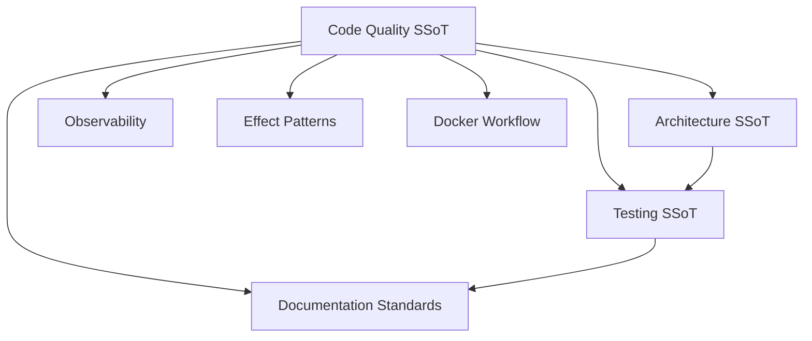

# Code Quality

**Status**: Authoritative source  
**Supersedes**: type_safety_enforcement.md, purity.md  
**Referenced by**: engineering/README.md, documents/readme.md

> **Purpose**: Single Source of Truth for type safety, purity, and code quality enforcement in Effectful.

## SSoT Link Map



| Need | Link |
|------|------|
| Layer boundaries and imports | [Architecture](architecture.md#core-abstractions) |
| Generator + interpreter testing | [Testing](testing.md#part-4-four-layer-testing-architecture) |
| Documentation + link hygiene | [Documentation Standards](../documentation_standards.md) |
| Metrics/alert hooks | [Observability](observability.md) |
| Canonical effect patterns | [Effect Patterns](effect_patterns.md) |
| Docker-only contract | [Docker Workflow](docker_workflow.md#development-contract) |

---

## Overview

Code quality = **type safety + purity**. Programs remain pure descriptions, interpreters isolate impurity, and the type system makes invalid states unrepresentable. All standards, anti-pattern routing, and remediation workflows now live here to enforce a single, heavily cross-linked source of truth.

**Core principles**
- Zero escape hatches: no `Any`, `cast()`, or `# type: ignore` anywhere.
- Effects as data: programs `yield` effect descriptions; interpreters execute I/O.
- Immutability by default: frozen dataclasses, Result/ADT returns, exhaustive matches.
- Link, don’t duplicate: every rule below links to the SSoT section that owns the fix.

---

## Type Safety Doctrines

### 1. NO Escape Hatches (ZERO Exceptions)
- ❌ Forbidden: `Any`, `cast()`, `# type: ignore` in all code (prod, tests, docs, scripts).
- ✅ Required: explicit types + `mypy --strict` (`disallow_any_explicit = true`).
- Testing frozen dataclasses: use `setattr` + `pytest.raises` instead of `type: ignore`.

### 2. ADTs Over Optional Types

Replace `Optional[T]` with explicit ADT unions that encode why a value may be absent.

**Progression from Optional to ADTs:**

1. **Optional[T]** (typing module) - ❌ Avoid for domain logic
   ```python
   user: Optional[User]  # Why None? Not found? Deleted? Error?
   ```

2. **OptionalValue[T]** (effectful.domain) - ✅ Good for generic optional fields
   ```python
   metadata: OptionalValue[dict[str, str]]  # Absent(reason="not_provided")
   ```
   Use when: Generic presence/absence, no domain-specific reasons needed

3. **Custom Domain ADT** - ✅ Best for domain-specific semantics
   ```python
   type UserLookupResult = UserFound | UserNotFound | UserDeleted
   ```
   Use when: Multiple absence reasons, domain semantics matter

See [OptionalValue API Decision Tree](../api/optional_value.md#decision-tree-optional-vs-optionalvalue-vs-custom-adt) for complete guidance.

### 3. Result Type for Error Handling
- Never throw for expected errors; return `Result[T, E]` and pattern match on outcomes.
- Errors must be part of the type to keep flows explicit and testable.

### 4. Immutability by Default
- Domain models and effects use `@dataclass(frozen=True)`.
- Update via `replace()` or immutable copies, never in-place mutation.

### 5. Exhaustive Pattern Matching
- Use `match` with `assert_never()` to cover every union variant at compile time.
- No wildcard fallbacks that swallow new cases.

### 6. Type Narrowing for Union Types
- Narrow with structural checks (`match`, `isinstance`, tagged unions) instead of casts.
- Prefer `match` or guards over Boolean flag fields.

### 7. Generic Type Parameters
- Keep generics concrete and bounded; avoid unconstrained `TypeVar` usage.
- Use variance annotations only when necessary; document constraints.

### 8. PEP 695 Type Aliases
- Use inline `type` aliases for readability and reuse.
- Aliases must remain immutable and specific (no aliasing to `Any`).

---

## Purity Doctrines

### Doctrine 1: No Loops
- No `for`/`while` loops in pure code; use comprehensions or trampolines.
- Controlled exceptions: trampoline driver and program runner loops only.

### Doctrine 2: Effects as Data
- Effects describe intent; they never perform I/O. Interpreters do the work.

### Doctrine 3: Yield Don't Call
- Programs `yield` effect descriptions rather than calling infrastructure.
- Composition via `yield from` keeps flows testable without mocks.

### Doctrine 4: Interpreters Isolate Impurity
- All I/O, logging, and randomness live in interpreters/adapters at the boundary.
- Mutable state is acceptable only inside adapters that wrap infrastructure handles.

### Doctrine 5: Immutability by Default
- Pure layers construct new values instead of mutating; adapters may manage mutable handles.

### Doctrine 6: Exhaustive Pattern Matching
- Pure code matches on ADTs exhaustively with `assert_never()` safeguards.

---

## Generator Program Rules

- Programs are synchronous generators; never `async def` or `await` inside programs.
- No direct I/O in generators (no `print`, file, network, time, random); always yield effects.
- Compose with `yield from` and return immutable results (tuples/records).
- Use comprehensions inside generators only when the body is pure; prefer explicit `for` + `yield` when building effect sequences.

---

## Anti-Pattern Index (Routing to Canonical Fixes)

| Anti-Pattern | Impact | Fix |
|--------------|--------|-----|
| Using `Any` / `cast()` / `# type: ignore` | Breaks type safety gates | See [Doctrine 1](#1-no-escape-hatches-zero-exceptions) |
| Mutable domain/effects | Hidden state, races | See [Doctrine 4](#4-immutability-by-default) |
| Optional for domain logic | Ambiguous absence | See [Doctrine 2](#2-adts-over-optional-types) |
| Using Optional for domain fields | Hides absence reason | See [API: OptionalValue Decision Tree](../api/optional_value.md#decision-tree-optional-vs-optionalvalue-vs-custom-adt) |
| Sharing OptionalValue normalization | Incorrect abstraction | See [API: Pattern 3 - Local Normalization](../api/optional_value.md#pattern-3-effect-parameters-the-canonical-normalization-pattern) |
| Exceptions for expected errors | Hidden control flow | See [Doctrine 3](#3-result-type-for-error-handling) |
| Imperative effect execution | Untestable programs | See [Doctrine 3: Yield Don't Call](#doctrine-3-yield-dont-call) |
| Impure comprehensions | Side effects in pure layer | See [Doctrine 1: No Loops](#doctrine-1-no-loops) |
| Global mutable state | Non-determinism | See [Doctrine 5: Immutability by Default](#doctrine-5-immutability-by-default) |
| Inline interpreter construction | Boilerplate, resource leaks | Use `Depends(get_audited_composite_interpreter)` for API endpoints |
| Skipped tests (`pytest.skip`) | Masks regressions | See [Testing Anti-Patterns](testing.md#anti-pattern-2-skipped-tests) |
| Running pytest/poetry on host | Bypasses infra contract | See [Docker Workflow](docker_workflow.md#development-contract) |

**How to remediate**
1. Stop and map the violation to the doctrine above.
2. Apply the canonical pattern from this file (or linked SSoT).
3. Add/adjust tests (unit/integration as appropriate).
4. Run `docker compose -f docker/docker-compose.yml exec effectful poetry run check-code`.

---

## Detection and Enforcement

### General Enforcement

- **Primary gate:** `docker compose -f docker/docker-compose.yml exec effectful poetry run check-code` (Black → MyPy strict → doc link verification). See [Command Reference](command_reference.md).
- **Static queries:** search for `Any`, `cast`, `# type: ignore`, `for ` / `while ` in pure modules, and direct `raise` in business logic.
- **Code review checklist:** exhaustive matches present, no direct I/O in programs, frozen dataclasses, Result-based errors, adapters own impurity, and links target SSoT sections instead of duplicating guidance.

### OptionalValue Doctrine Enforcement

**Automated Checks:**

The codebase enforces OptionalValue doctrine through multiple layers:

1. **Validation Script** - `bash scripts/validate_optional_value_doctrine.sh`
   - Prevents Optional[] in domain/effects
   - Verifies normalization functions present
   - Checks for escape hatches (Any, cast, type: ignore)
   - Validates ADT usage in domain layer
   - Exit code 0 = all checks pass

2. **Pattern Checker** - `python3 scripts/check_optional_value_pattern.py`
   - Validates canonical normalization pattern
   - Ensures frozen=True and init=False on effects
   - Verifies object.__setattr__ usage
   - Checks normalization function presence

3. **Pre-Commit Hooks** - `.pre-commit-config.yaml`
   - Blocks Optional[] commits in domain/effects
   - Runs pattern checker on effect files
   - Manual full validation available
   - Install: `pre-commit install`

**Running Validation:**

```bash
# Full validation
bash scripts/validate_optional_value_doctrine.sh

# Pattern checking only
python3 scripts/check_optional_value_pattern.py

# Pre-commit (automatic on git commit)
pre-commit install  # One-time setup
git commit -m "..."  # Automatically validates

# Manual pre-commit run
pre-commit run --all-files
```

**Adding New Effects with Optional Parameters:**

When creating effects with optional parameters, follow the canonical pattern:

1. Import OptionalValue types from `effectful.domain.optional_value`
2. Add local `_normalize_optional_value()` function (type-specific, 4 lines)
3. Use `@dataclass(frozen=True, init=False)` decorator
4. Implement custom `__init__` with normalization
5. Store `OptionalValue[T]` internally, accept `T | OptionalValue[T] | None` in constructor

**Example:**

```python
from dataclasses import dataclass
from effectful.domain.optional_value import OptionalValue, Provided, Absent, to_optional_value

# Local normalization - type-specific
def _normalize_optional_value(
    value: dict[str, str] | OptionalValue[dict[str, str]] | None,
) -> OptionalValue[dict[str, str]]:
    if isinstance(value, (Provided, Absent)):
        return value
    return to_optional_value(value)

@dataclass(frozen=True, init=False)
class PutObject:
    bucket: str
    key: str
    metadata: OptionalValue[dict[str, str]]  # Store OptionalValue internally

    def __init__(
        self,
        bucket: str,
        key: str,
        metadata: dict[str, str] | OptionalValue[dict[str, str]] | None = None,
    ) -> None:
        object.__setattr__(self, "bucket", bucket)
        object.__setattr__(self, "key", key)
        object.__setattr__(self, "metadata", _normalize_optional_value(metadata))
```

**See:**
- [OptionalValue API Reference](../api/optional_value.md) - Complete API documentation
- [Effect Patterns: Pattern 6](effect_patterns.md#pattern-6-boundary-normalization-for-optionalvalue) - Canonical normalization pattern
- [ADTs and Results Tutorial](../tutorials/adts_and_results.md#step-6-optionalvalue---the-pre-built-adt) - When to use OptionalValue

---

## Cross-References

- **Testing:** effect generators, integration policies, and anti-pattern catalog live in [testing.md](testing.md).
- **Observability:** metrics/alert hooks and registries live in [observability.md](observability.md) and [monitoring_and_alerting.md](monitoring_and_alerting.md).
- **Documentation:** SSoT/DRY rules and mermaid safety in [documentation_standards.md](../documentation_standards.md).
- **Architecture:** import boundaries and layer rules in [architecture.md](architecture.md).
- **Effect Patterns:** canonical program and interpreter shapes in [effect_patterns.md](effect_patterns.md).
