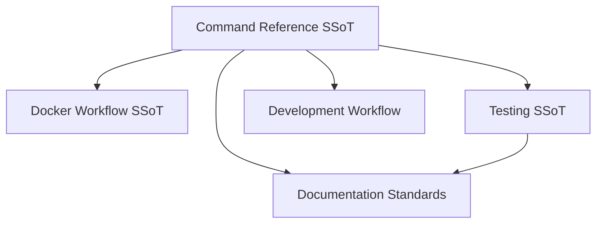
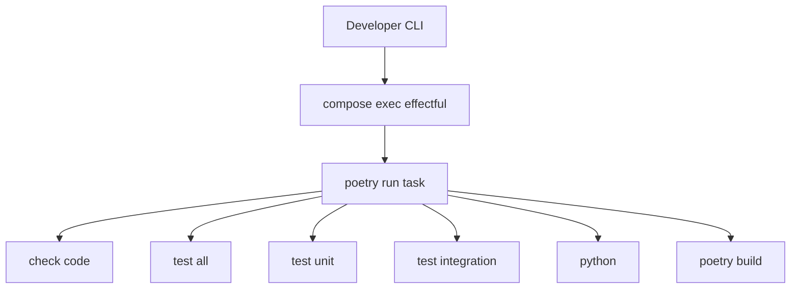

# Command Reference

**Status**: Authoritative source  
**Supersedes**: None  
**Referenced by**: docker_workflow.md, development_workflow.md, testing.md, README.md

> **Purpose**: SSoT for all Docker commands, test execution patterns, and output management in effectful.

Authoritative command map for running, testing, and packaging inside the containerized toolchain.

---

## SSoT Link Map



| Need | Link |
|------|------|
| Docker contract | [Docker Workflow](docker_workflow.md#development-contract) |
| Which tests to run | [Testing](testing.md#running-tests) |
| Daily development loop | [Development Workflow](development_workflow.md) |
| Formatting + linking rules | [Documentation Standards](../documentation_standards.md) |

## Command Map (Mermaid)



## Docker Command Prefix

**All commands run inside Docker**: `docker compose -f docker/docker-compose.yml exec effectful poetry run <command>`

**Important**: Poetry is configured to NOT create virtual environments via `poetry.toml` (`create = false`). Running `poetry install` outside the container will fail. All development happens inside Docker.

See [Docker Workflow](docker_workflow.md) for complete policy.

## Command Table

| Task | Command |
|------|---------|
| Start services | `docker compose -f docker/docker-compose.yml up -d` |
| View logs | `docker compose -f docker/docker-compose.yml logs -f effectful` |
| Check code quality | `docker compose -f docker/docker-compose.yml exec effectful poetry run check-code` |
| Test all | `docker compose -f docker/docker-compose.yml exec effectful poetry run test-all` |
| Test unit | `docker compose -f docker/docker-compose.yml exec effectful poetry run test-unit` |
| Test integration | `docker compose -f docker/docker-compose.yml exec effectful poetry run test-integration` |
| Python shell | `docker compose -f docker/docker-compose.yml exec effectful poetry run python` |
| Build package | `docker compose -f docker/docker-compose.yml exec effectful poetry build` |

## Poetry Entrypoints

**Defined in pyproject.toml `[tool.poetry.scripts]`**:

- `check-code` - Black formatter + MyPy strict type checking + documentation link verification (`tools/verify_links.py`)
- `test-unit` - Unit tests only (pytest-mock, no I/O)
- `test-integration` - Integration tests (real PostgreSQL, Redis, MinIO, Pulsar)
- `test-all` - Complete test suite

**Test Isolation**: Each test is responsible for creating reproducible starting conditions (e.g., TRUNCATE + seed in fixtures).

## Test Statistics

| Category | Test Count (via `rg "def test_"`) | Duration | Infrastructure |
|----------|-----------------------------------|----------|----------------|
| Unit tests | ~479 | Varies by host/container; run in Docker | pytest-mock only |
| Integration | ~84 | Varies; requires Docker services | PostgreSQL/Redis/MinIO/Pulsar |
| Full suite | ~750 | Varies; run containerized | Mixed |
| Coverage | 69% overall | - | Adapters/infrastructure excluded from measurement |

**Test Organization**:
- `tests/unit/` - Pure logic and interpreter/unit coverage
- `tests/integration/` - Multi-effect workflows against real infrastructure
- `tests/e2e/` - End-to-end chat workflow
- `tests/test_effects.py` - Effect definition tests
- `tests/test_domain.py` - Domain model tests
- `tests/test_observability.py` - Observability surface tests
- `tests/test_adapters.py` - Adapter-focused tests

## Test Output Management

**CRITICAL - Output Truncation**: Bash tool truncates at 30,000 characters. Large test suites can exceed this.

**REQUIRED Pattern**:

```bash
# Step 1: Run tests with output redirection
docker compose -f docker/docker-compose.yml exec effectful poetry run pytest > /tmp/test-output.txt 2>&1

# Step 2: Read complete output using Read tool on /tmp/test-output.txt

# Step 3: Analyze ALL failures, not just visible ones
```

**Why This Matters**: Truncated output hides failures, making diagnosis impossible. File-based approach ensures complete output is always available. Read tool has no size limits.

**For all test categories**: Use pattern above with `pytest`, `test-integration`, or specific test paths.

### Forbidden Practices

- ❌ `Bash(command="...pytest...", timeout=60000)` - Kills tests mid-run, truncates output
- ❌ `Bash(command="...pytest...", run_in_background=True)` - Loses real-time failure visibility
- ❌ Reading partial output with `head -n 100` or similar truncation
- ❌ Checking test status before completion (polling BashOutput prematurely)
- ❌ Running tests via Bash tool and analyzing truncated stdout
- ❌ Drawing conclusions without seeing complete output
- ❌ Creating fix plans based on partial failure information

### Required Practices

- ✅ Always redirect to /tmp/, then read complete output
- ✅ Verify you have seen ALL test results before creating fix plans
- ✅ If output is truncated, STOP and re-run with file redirection
- ✅ Let tests complete naturally (integration tests may take 1-2 seconds - patience required!)
- ✅ Review ALL stdout/stderr output before drawing conclusions

## See Also

- [Docker Workflow](docker_workflow.md) - Complete Docker development policy
- [Testing](testing.md) - Testing standards and anti-patterns
- [Code Quality](code_quality.md) - check-code workflow and MyPy strict enforcement

## Cross-References
- [Docker Workflow](docker_workflow.md)
- [Testing](testing.md)
- [Development Workflow](development_workflow.md)
- [Documentation Standards](../documentation_standards.md)
