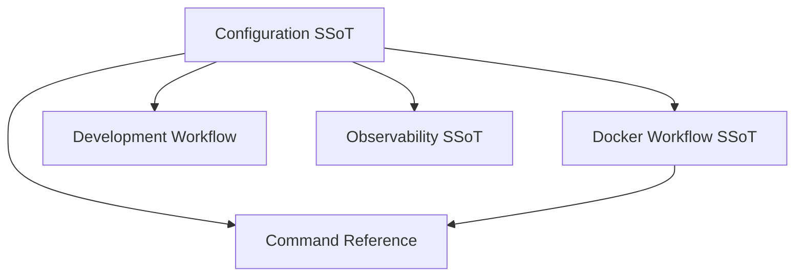
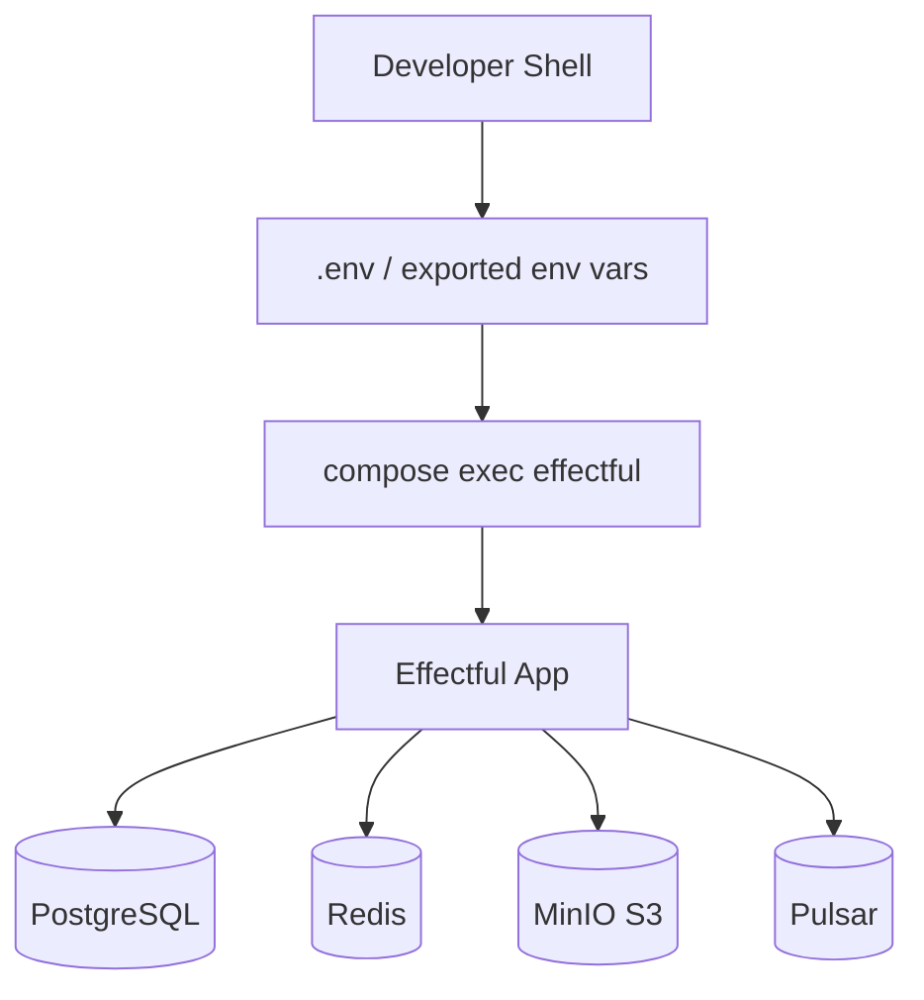

# Configuration Standards

> **SSoT** for all environment variables and service configuration in effectful.

Defines environment variables and service wiring for effectful across local development and production.

---

**Last Updated**: 2025-12-03
**Supersedes**: None
**Referenced by**: docker_workflow.md, development_workflow.md, README.md, monitoring_and_alerting.md

## SSoT Link Map



| Need | Link |
|------|------|
| Container topology | [Docker Workflow](docker_workflow.md) |
| Command prefixes | [Command Reference](command_reference.md) |
| Database lifecycle | [Development Workflow](development_workflow.md#database-management) |
| Observability endpoints | [Observability](observability.md#metrics-publishing) |

## Configuration Topology



## Environment Variables

**All configuration via environment variables** - no config files.

### PostgreSQL Configuration

```bash
POSTGRES_HOST=postgres
POSTGRES_PORT=5432
POSTGRES_DB=effectful_test
POSTGRES_USER=effectful
POSTGRES_PASSWORD=effectful_pass
```

**Used by**: Integration tests, database adapters

**Default location**: `docker/docker-compose.yml` environment section

### Redis Configuration

```bash
REDIS_HOST=redis
REDIS_PORT=6379
```

**Used by**: Cache integration tests, auth integration tests

**No password required** for development environment.

### MinIO S3 Configuration

```bash
MINIO_ENDPOINT=minio:9000
MINIO_ACCESS_KEY=minioadmin
MINIO_SECRET_KEY=minioadmin
MINIO_BUCKET=effectful-test
```

**Used by**: Storage effect integration tests

**Default credentials**: MinIO defaults for development

### Apache Pulsar Configuration

```bash
PULSAR_URL=pulsar://pulsar:6650
```

**Used by**: Messaging effect integration tests

**No authentication required** for development environment.

## Docker Compose Configuration

**Location**: `docker/docker-compose.yml`

**Services defined**:
- `effectful` - Python 3.12 + Poetry container
- `postgres` - PostgreSQL 15+
- `redis` - Redis 7+
- `minio` - MinIO S3-compatible storage
- `pulsar` - Apache Pulsar messaging

**Named volumes** (recommended):
- `pgdata:/var/lib/postgresql/data` - PostgreSQL data
- `redisdata:/data` - Redis persistence
- `miniodata:/data` - MinIO object storage
- `pulsardata:/pulsar/data` - Pulsar message data

See [Docker Workflow](docker_workflow.md) for rationale on named volumes vs bind mounts.

## Production Configuration

**WARNING**: Configuration above is for **development only**.

**Production requirements**:
- ✅ Strong passwords (not defaults)
- ✅ TLS/SSL for all connections
- ✅ Network isolation (private networks)
- ✅ Secrets management (Vault, AWS Secrets Manager, etc.)
- ✅ Connection pooling configuration
- ✅ Resource limits (memory, CPU)
- ✅ Monitoring and alerting

See [Observability](observability.md) for production monitoring standards.

## Connection Pooling

**PostgreSQL** (asyncpg):
```python
pool = await asyncpg.create_pool(
    host=os.environ["POSTGRES_HOST"],
    port=int(os.environ["POSTGRES_PORT"]),
    database=os.environ["POSTGRES_DB"],
    user=os.environ["POSTGRES_USER"],
    password=os.environ["POSTGRES_PASSWORD"],
    min_size=5,
    max_size=20,
)
```

**Redis** (redis-py):
```python
pool = redis.ConnectionPool(
    host=os.environ["REDIS_HOST"],
    port=int(os.environ["REDIS_PORT"]),
    max_connections=10,
)
```

## See Also

- [Docker Workflow](docker_workflow.md) - Container architecture and services
- [Development Workflow](development_workflow.md) - Database management
- [Observability](observability.md) - Production monitoring

---

**Last Updated**: 2025-12-01
**Supersedes**: none
**Referenced by**: CLAUDE.md, docker_workflow.md, development_workflow.md
